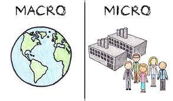
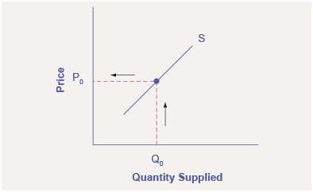
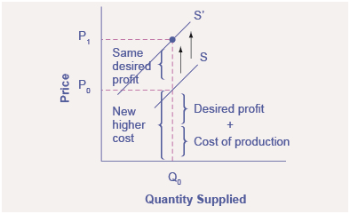
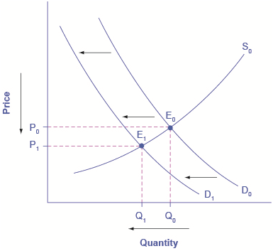
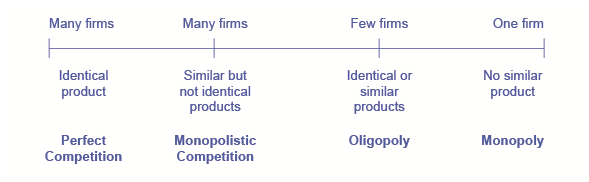
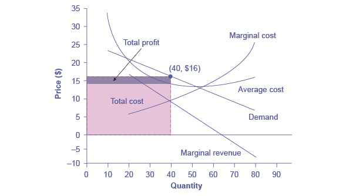
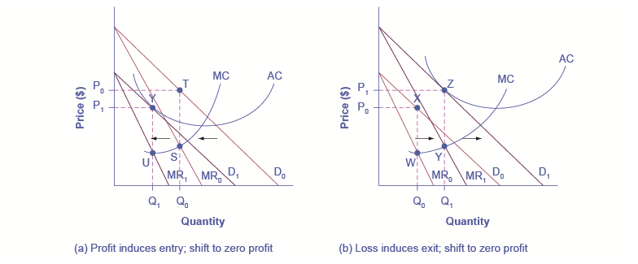

<!--
author:   EPISD SS 2018

email:    LiaScript@web.de

version:  0.0.1

language: en

narrator: US English Female

comment:  El Paso Independent School District in El Paso Texas created this Economics text for its high school course using OER, CC, and public domain content from a variety of sources by educators in the district. The course is aligned to the Texas TEKS and is usually taken in Grade 11.

logo:     ../cover.jpg

tags:      economics, episd, El Paso ISD

-->

# EPISD 2019-2020 Economics with Emphasis on the Free Enterprise System

> This document was automatically translated to LiaScript from
>
> https://flexbooks.ck12.org/user:3d76c1256888/cbook/episd-2019-2020-economics-with-emphasis-on-the-free-enterprise-system/section/1.1/primary/lesson/unit-1-introduction-vocabulary-and-objectives/

## 1.1 Unit 1: Basic Understandings, Vocabulary, and Objectives

<article>

### Unit 1 - Basic Understandings

* The economic principles of scarcity and opportunity costs influence the economic choices of societies and individuals.
* The economic systems of free enterprise, socialism, and communism share some characteristics but have different methods for making economic decisions.
* The viewpoints of various economic philosophers have influenced the development of the free enterprise system in the United States.
* The United States uses a free enterprise system that is continually changing.
* The circular flow model can be used to represent the movement of resources in an economy.

### Unit 1 - Vocabulary

**free enterprise system**– an economic system characterized by private ownership of businesses operated for profit with economic freedom for both consumers and producers

**scarcity**– the condition in which there are not enough resources available to produce everything that individuals demand

**opportunity cost**– the value of goods and services that are given up in order to obtain an alternative good or service

**factors of production**– the resources needed to produce goods and services, including land, labor, capital, and entrepreneurship

**resources**– supplies of something of value

**economic system**– a process created to manage the production, consumption, and distribution of goods and services

**circular flow model**– a visual representation showing the relationship between the factor market and the product market

### Unit 1 - Related Vocabulary

* choice
* competition
* firms
* incentives
* consumers
* producers
* socialism
* communism
* capitalism

### What is Economics?

!?[0](https://www.youtube.com/watch?v=2YULdjmg3o0)

### **Why Should You Study Economics?**

!?[0](https://www.youtube.com/watch?v=CE5eJbaHL8s)

### **Unit 1 TEKS**

**(1) Economics. The student understands the concepts of scarcity and opportunity costs. The student is expected to:**

(A) explain why scarcity and choice are basic economic problems faced by every society;

(B) describe how societies answer the basic economic questions: what to produce, how to produce, and for whom to produce;

(C) describe the economic factors of production: land, labor, capital, and entrepreneurship; and

(D) interpret a production-possibilities curve and apply the concepts of opportunity costs and scarcity.

**(4) Economics. The student understands free enterprise, socialist, and communists economic systems. The student is expected to:**

(A) explain the basic characteristics of economic systems, including property rights, incentives, economic freedom, competition, and the role of government;

(B) contrast current and historic examples of the free enterprise system, socialism, and communism using the basic characteristics of economic systems; and

(C) analyze the contributions of various economic philosophers, including Friedrich Hayek, Milton Friedman, John Maynard Keynes, and Adam Smith, and their impact on the U.S. free enterprise system.

**(5) Economics. The student understands the basic characteristics and benefits of the U.S. free enterprise system. The student is expected to:**

(A) explain the benefits of the U.S. free enterprise system, including individual freedom of consumers and producers, variety of goods, responsive prices, investment opportunities, and the creation of wealth; and

(B) analyze recent changes in the basic characteristics, including private property, incentives, economic freedom, competition, and the limited role of government, of the U.S. economy.

**(7) Economics. The student understands the circular-flow model of the economy. The student is expected to:**

(A) interpret the roles of resource owners and firms in a circular-flow model of the economy and provide real-world examples to illustrate elements of the model; and

(B) explain how government actions affect the circular-flow model.

</article>

## 1.2 Scarcity, Choice, and Resources

<article>

 

### **What is Economics?**

Ultimately, economics is the study of choice. Because choices range over every imaginable aspect of human experience, so does economics. Economists have investigated the nature of family life, the arts, education, crime, sports, job creation—the list is virtually endless because so much of our lives involves making choices.

How do individuals make choices: Would you like better grades? More time to relax? More time watching movies? Getting better grades probably requires more time studying, and perhaps less relaxation and entertainment. Not only must we make choices as individuals, we must make choices as a society. Do we want a cleaner environment? Faster economic growth? Both may be desirable, but efforts to clean up the environment may conflict with faster economic growth. Society must make choices.

Economics is defined less by the subjects economists investigate than by the way in which economists investigate them. Economists have a way of looking at the world that differs from the way scholars in other disciplines look at the world. It is the economic way of thinking; thisunit introduces that way of thinking.

**Economics**is a social science that examines how people choose among the alternatives available to them. Economics can be described as social because it involves people and their behavior. Economics is also a science because it uses, as much as possible, a scientific approach in its investigation of choices.

**Universal Generalizations**

* Consumers decide how resources are allocated and what is produced.
* Since resources are limited, people must make choices related to goods and services.
* Scarcity is the condition of not being able to have all of the goods and services one wants because wants exceed what can be made from all available resources at any given time.
* The wealth that an economy generates is made possible by the circular flow of economic activity.

**Guiding Questions**

1.  What kinds of goods and services are required to meet peoples’ needs and a wants?
2.  What goods will be produced? How will they be produced? For whom will they be produced?

Scarcity, Choice, and Cost
--------------------------

All choices mean that one alternative is selected over another. Selecting among alternatives involves three ideas central to economics: scarcity, choice, and opportunity cost.

Scarcity
--------

Our resources are limited. At any one time, we have only so much land, so many factories, so much oil, so many people. But our wants, our desires for the things that we can produce with those resources, are unlimited. We would always like more and better housing, more and better education—more and better of practically everything.

If our resources were also unlimited, we could say yes to each of our wants—and there would be no economics. Because our resources are limited, we cannot say yes to everything. To say yes to one thing requires that we say no to another. Whether we like it or not, we must make choices.

Our unlimited wants are continually colliding with the limits of our resources, forcing us to pick some activities and to reject others.**Scarcity**is the condition of having to choose among alternatives. A**scarce good**is one for which the choice of one alternative requires that another be given up.

Consider a parcel of land. The parcel presents us with several alternative uses. We could build a house on it. We could put a gas station on it. We could create a small park on it. We could leave the land undeveloped in order to be able to make a decision later as to how it should be used.

Suppose we have decided the land should be used for housing. Should it be a large and expensive house or several modest ones? Suppose it is to be a large and expensive house. Who should live in the house? If the Lees live in it, the Nguyens cannot. There are alternative uses of the land both in the sense of the type of use and also in the sense of who gets to use it. The fact that land is scarce means that society must make choices concerning its use.

Virtually everything is scarce. Consider the air we breathe, which is available in huge quantity at no charge to us. Could it possibly be scarce?

The test of whether air is scarce is whether it has alternative uses. What uses can we make of the air? We breathe it. We pollute it when we drive our cars, heat our houses, or operate our factories. In effect, one use of the air is as a garbage dump. We certainly need the air to breathe. But just as certainly, we choose to dump garbage in it. Those two uses are clearly alternatives to each other. The more garbage we dump in the air, the less desirable—and healthy—it will be to breathe. If we decide we want to breathe cleaner air, we must limit the activities that generate pollution. Air is a scarce good because it has alternative uses.

Not all goods, however, confront us with such choices. A**free good**is one for which the choice of one use does not require that we give up another. One example of a free good is gravity. The fact that gravity is holding you to the earth does not mean that your neighbor is forced to drift up into space! One person’s use of gravity is not an alternative to another person’s use.

There are not many free goods. Outer space, for example, was a free good when the only use we made of it was to gaze at it. But now, our use of space has reached the point where one use can be an alternative to another. Conflicts have already arisen over the allocation of orbital slots for communications satellites. Thus, even parts of outer space are scarce. Space will surely become more scarce as we find new ways to use it. Scarcity characterizes virtually everything. Consequently, the scope of economics is wide indeed.

_**Video: Scarcity and Markets**_

!?[0](https://www.youtube.com/watch?v=Np-dZSdzymk)

Think about scarcity this way. According to the U.S. Bureau of Labor Statisticsin 2012, the labor force in the United States contained over 155.5 million workers. Similarly, the total area of the United States is 3,794,101 square miles. These are large numbers for such crucial resources, however, they are limited. Because these resources are limited, so are the numbers of goods and services we can produce with them. Combine this with the fact that human wants seem to be virtually infinite, and you can see why scarcity is a problem.

**Click on the links below to see how cities in our area, to include El Paso, have been dealing with water scarcity:**

["How 10 Western Cities Are Dealing with Water Scarcity and Drought"](https://stateimpact.npr.org/texas/2013/08/02/how-10-western-cities-are-dealing-with-water-scarcity-and-drought/ "How 10 Western Cities Are Dealing With Water Scarcity and Drought")

["El Paso to drink treated sewage water due to climate change drought"](https://www.cnn.com/2018/11/30/health/water-climate-change-el-paso/index.html "El Paso to drink treated sewage water due to climate change drought")

---

**If you still do not believe that scarcity is a problem, consider the following questions:**

* Does everyone need food to eat?
* Does everyone need a decent place to live?
* Does everyone have access to health care?

This image, depicting a homeless person sleeping on a city bench, is a stark reminder of the reality of scarcity.

---

### Scarcity and the Fundamental Economic Questions

The choices we confront as a result of scarcity raise three sets of issues. Every economy must answer the following questions:

1.  **What should be produced?**Using the economy’s scarce resources to produce one thing requires giving up another. Producing better education, for example, may require cutting back on other services, such as health care. A decision to preserve a wilderness area requires giving up other uses of the land. Every society must decide what it will produce with its scarce resources.
2.  **How should goods and services be produced?**There are all sorts of choices to be made in determining how goods and services should be produced. Should a firm employ a few skilled or a lot of unskilled workers? Should it produce in its own country or should it use foreign plants? Should manufacturing firms use new or recycled raw materials to make their products?
3.  **For whom should goods and services be produced?**If a good or service is produced, a decision must be made about who will get it. A decision to have one person or group receive a good or service usually means it will not be available to someone else. For example, representatives of the poorest nations on earth often complain that energy consumption per person in the United States is 17_times_greater than energy consumption per person in the world’s 62 poorest countries. Critics argue that the world’s energy should be more evenly allocated. Should it? That is a “for whom” question.

Every economy must determine what should be produced, how it should be produced, and for whom it should be produced. We shall return to these questions again and again.

Opportunity Cost
----------------

It is within the context of scarcity that economists define what is perhaps the most important concept in all of economics, the concept of opportunity cost.**Opportunity cost**is the value of the best alternative forgone in making any choice.

The opportunity cost to you of reading the remainder of this chapter will be the value of the best other use to which you could have put your time. If you choose to spend $20 on a potted plant, you have simultaneously chosen to give up the benefits of spending the $20 on pizzas or a paperback book or a night at the movies. If the book is the most valuable of those alternatives, then the opportunity cost of the plant is the value of the enjoyment you otherwise expected to receive from the book.

The concept of opportunity cost must not be confused with the purchase price of an item. Consider the cost of a college or university education. That includes the value of the best alternative use of money spent for tuition, fees, and books. But the most important cost of a college education is the value of the forgone alternative uses of time spent studying and attending class instead of using the time in some other endeavor. Students sacrifice that time in hopes of even greater earnings in the future or because they place a value on the opportunity to learn. Or consider the cost of going to the doctor. Part of that cost is the value of the best alternative use of the money required to see the doctor. But, the cost also includes the value of the best alternative use of the time required to see the doctor. The essential thing to see in the concept of opportunity cost is found in the name of the concept. Opportunity cost is the value of the best opportunity forgone in a particular choice. It is not simply the amount spent on that choice.

The concepts of scarcity, choice, and opportunity cost are at the heart of economics. A good is scarce if the choice of one alternative requires that another be given up. The existence of alternative uses forces us to make choices. The opportunity cost of any choice is the value of the best alternative forgone in making it.

#### _**Video: I, Pencil**_

!?[0](https://www.youtube.com/watch?v=IYO3tOqDISE)

**Needs vs. Wants**

Consumers may use the terms “needs” and “wants” interchangeably and not realize the subtle differences between them. Needs are a basic requirement for survival and include: food, clothing, and shelter. Wants are a way of expressing those needs. To satisfy the “need” for food, a person may express it as a “want”. For example: _I need food, I want pizza. I need clothing, I want Nike tennis shoes. I need shelter, I want to live in a mansion._

>  **There is no such thing as a free lunch!**

Resources are limited and everything we do has some cost. The idea of “Buy One, Get One Free” is not actually correct; someone must pay for “the free” one. The cost of the “free” item will get passed on to someone else. For example, if a restaurant is giving away “free appetizers” then the business will need to recover these costs by passing the charges on to other customers by raising prices. Therefore the idea that “there is no such thing as a free lunch” is another way to say that the consumer may not always be getting the great deal that he thinks he is getting because someone always has to pay for the production in the end.

Answer the self check questions below to monitor your understanding of the concepts in this section.

### **Self Check Questions**

1. What is scarcity? Can you think of two causes of scarcity?

2. What are the three basic questions that must be asked in relation to economics?

3. List three examples of goods or services that are not scarce.

4. How does scarcity affect you and your life? Provide at least three examples of items that you have had to do without because of limited resources. How did you adjust to this situation? Were you able to find suitable substitutions?

5. Explain the concept of opportunity cost. Explain how opportunity cost affects choices that you make in your own life.

</article>

## 1.3 Factors of Production

<article>

 

### Factors of Production

Choices concerning what goods and services to produce are choices about an economy’s use of its**factors of production**, the resources available to it for the production of goods and services. More simply stated, the "factors of production" are the resources we need in order to produce the items that we would like to have. Those four factors are **land**, **labor**, **capital**, and **entrepreneurs**. Each of the factors makes production possible and the use, or misuse, of any one of them may impact the economy.

**Universal Generalizations**

* Consumers decide how resources are allocated and what is produced.
* Since resources are limited, people must make choices related to goods and services.
* The wealth that an economy generates is made possible by the circular flow of economic activity.

**Guiding Questions**

1.  What kinds of goods and services are required to meet peoples' needs and wants?
2.  What goods will be produced? How will they be produced? For whom will they be produced?

The concept of **land** has to do with specific items that humans get from nature, such as natural resources or things that are produced by the land, such as farm products.

**Labor** is what each person does as part of their livelihood or job to pay for their existence. Labor is performed by people and it is the total amount of talent and effort that a country’s labor force has to create products or services. The labor force may expand or contract over time, or it can evolve with changes to the market, but in the long run it will impact the economy of a country.

The third factor of production is **capital**, or capital goods, which are the tools or equipment necessary for production. Capital is both the result of production (assembly of a bulldozer) and can be used in production (bulldozer used on a construction site). Any equipment or items used by a business, to help the business function, is a capital good.

The last factor of production is the **entrepreneur**, or the person with the idea to create a product or develop a service. The entrepreneur is the one who believes that he/she has a better idea of how to build “a better mousetrap”. It is this person who ultimately tries to combine the factors of production to make a product or provide a service that people want and sell it for a profit. The entrepreneur is a risk-taker and the creative element that allows a free market economy to evolve as consumer demand changes.

_**Video: Four Factors of Production**_

!?[0](https://www.youtube.com/watch?v=iU64lU4-yZ0)

Let's takea closer look at the factors of production we use to produce the goods and services we consume. 

### Land (Natural Resources)

Remember that the factor of production known as land is not just the land itself; "land" refers to the items humans get from nature. For this reason, it is helpful to think of "land" as "natural resources." There are two essential characteristics of natural resources. The first is that they are found in nature—that no human effort has been used to make or alter them. The second is that they can be used for the production of goods and services. That requires knowledge; we must know how to use the things we find in nature before they become resources.

The field, the cows, and the milk and beef they produce are all examples of the factor of production known as land.

Consider oil. Oil in the ground is a natural resource because it is found (not manufactured) and can be used to produce goods and services. However, 250 years ago oil was a nuisance, not a natural resource. Pennsylvania farmers in the eighteenth century who found oil oozing up through their soil were dismayed, not delighted. No one knew what could be done with the oil. It was not until the mid-nineteenth century that a method was found for refining oil into kerosene that could be used to generate energy, transforming oil into a natural resource. Oil is now used to make all sorts of things, including clothing, drugs, gasoline, and plastic. It became a natural resource because people discovered and implemented a way to use it.

Defining something as a natural resource only if it can be used to produce goods and services does not mean that a tree has value only for its wood or that a mountain has value only for its minerals. If people gain enjoymentfrom the existence of a beautiful wilderness area, then that wilderness provides a service. The wilderness is thus a natural resource.

The natural resources available to us can be expanded in three ways. One is the discovery of new natural resources, such as the discovery of a deposit of ore containing titanium. The second is the discovery of new uses for resources, as happened when new techniques allowed oil to be put to productive use or sand to be used in manufacturing computer chips. The third is the discovery of new ways to extract natural resources in order to use them. New methods of discovering and mapping oil deposits have increased the world’s supply of this important natural resource.

### Labor

Laboris the human effort that can be applied to the production of goods and services. People who are employed or would like to be are considered part of the labor available to the economy.People who work to repair tires, pilot airplanes, teach children, or enforce laws are all part of the economy’s labor. People who would like to work but have not found employment—who are unemployed—are also considered part of the labor available to the economy.

These emergency room nurses are an example of the factor of production known as labor.

In some contexts, it is useful to distinguish two forms of labor. The first is the human equivalent of a natural resource. It is the natural ability an untrained, uneducated person brings to a particular production process. But most workers bring far more. The skills a worker has as a result of education, training, or experience that can be used in production are calledhuman capital. Students who are attending a college or university are acquiring human capital. Workers who are gaining skills through experience or through training are acquiring human capital. Children who are learning to read are acquiring human capital.

The amount of labor available to an economy can be increased in two ways. One is to increase the total quantity of labor, either by increasing the number of people available to work or by increasing the average number of hours of work per week. The other is to increase the amount of human capital possessed by workers.

Capital
-------

Capitalis a factor of production that has been produced for use in the production of other goods and services. Office buildings, machinery, and tools are examples of capital.

Long ago, when the first human beings walked the earth, they produced food by picking leaves or fruit off a plant or by catching an animal and eating it. We know that very early on, however, they began shaping stones into tools, apparently for use in butchering animals. Those tools were the first capital because they were produced for use in producing other goods—food and clothing.

Modern versions of the first stone tools include saws, meat cleavers, hooks, and grinders; all are used in butchering animals. Tools such as hammers, screwdrivers, and wrenches are also capital. Transportation equipment, such as cars and trucks, is capital. Facilities such as roads, bridges, ports, and airports are capital. Buildings, too, are capital; they help us to produce goods and services.

This Boeing factory in Seattle, along with all of the machines housing inside, is an example of the factor of production known as capital.

Capital does not consist solely of physical objects. The score for a new symphony is capital because it will be used to produce concerts. Computer software used by business firms or government agencies to produce goods and services is capital. Capital may thus include physical goods and intellectual discoveries. Any resource is capital if it satisfies two criteria:

1.  The resource must have been produced.
2.  The resource can be used to produce other goods and services.

One thing that is not considered capital is money. A firm cannot use money directly to produce other goods, so money does not satisfy the second criterion for capital. Firms can, however, use money to acquire capital. Money is a form of financial capital.Financial capitalincludes money and other “paper” assets (such as stocks and bonds) that represent claims on future payments. These financial assets are not capital, but they can be used directly or indirectly to purchase factors of production or goods and services.

Entrepreneurship
----------------

Entrepreneurs play a role in putting these other three factors of production to work. As economists began to grapple with the problems of scarcity, choice, and opportunity cost two centuries ago, they focused on these concepts, just as they are likely to do two centuries hence.

Goods and services are produced using the factors of production available to the economy. Two things play a crucial role in putting these factors of production to work. The first istechnology, the knowledge that can be applied to the production of goods and services. The second is an individual who plays a key role in a market economy: the entrepreneur. An**entrepreneur**is a person who, operating within the context of a market economy, seeks to earn profits by finding new ways to organize factors of production. In non-market economies the role of the entrepreneur is played by bureaucrats and other decision makers who respond to incentives other than profit to guide their choices about resource allocation decisions.

Steve Jobs and Bill Gates are both well-known entrepreneurs; they founded Apple and Microsoft, respectively.

The interplay of entrepreneurs and technology affects all our lives. Entrepreneurs put new technologies to work every day, changing the way factors of production are used. Farmers and factory workers, engineers and electricians, technicians and teachers all work differently than they did just a few years ago, using new technologies introduced by entrepreneurs. The music you enjoy, the books you read, the athletic equipment with which you play are produced differently than they were five years ago. The book you are reading was written and manufactured using technologies that did not exist ten years ago. We can dispute whether all the changes have made our lives better. What we cannot dispute is that they have made our lives different.

Answer the self check questions below to monitor your understanding of the concepts in this section.

### **Self Check Questions**

1. What are the factors of production? Which one do you think is the most important? Why?

2. List two characteristics of natural resources.

3. What are the two forms of labor and how can we increase labor?

4. What two criteria classify a resource as capital?

5. What makes a person an entrepreneur?

</article>

## 1.4 The Production Possibilities Curve

<article>

 

### **Economic Models**

Economists use economic models to to graphically demonstrate the concepts and theories they develop to explain human behavior and decision making.

An economy’s factors of production are scarce; they cannot produce an unlimited quantity of goods and services. A**production possibilities curve**is a graphical representation of the alternative combinations of goods and services an economy can produce. It illustrates the production possibilities model. In drawing the production possibilities curve, we shall assume that the economy can produce only two goods and that the quantities of factors of production and the technology available to the economy are fixed.

**Universal Generalizations**

* Economists conduct research by evaluating sources; gathering, analyzing, and synthesizing information; and communicating conclusions supported by evidence.
* A production possibilities curve is a tool used by economists to demonstrate tradeoffs associated with allocating resources.

**Guiding Questions**

1.  What can be learned from examining a production possibilities curve?
2.  How can a production possibilities curve help consumers and producers make better economic choices?

Constructing a Production Possibilities Curve
---------------------------------------------

To construct a production possibilities curve, we will begin with the case of a hypothetical firm, Alpine Sports, Inc., a specialized sports equipment manufacturer. Christie Ryder began the business with a single ski production facility near Killington ski resort in central Vermont. Ski sales grew, and she also saw demand for snowboards rising—particularly after snowboard competition events were included in the 2002 Winter Olympics in Salt Lake City. She added a second plant in a nearby town. The second plant, while smaller than the first, was designed to produce snowboards as well as skis. She also modified the first plant so that it could produce both snowboards and skis. Two years later she added a third plant in another town. While even smaller than the second plant, the third was primarily designed for snowboard production but could also produce skis.

We can think of each of Ms. Ryder’s three plants as a miniature economy and analyze them using the production possibilities model. We assume that the factors of production and technology available to each of the plants operated by Alpine Sports are unchanged.

Suppose the first plant, Plant 1, can produce 200 pairs of skis per month when it produces only skis. When devoted solely to snowboards, it produces 100 snowboards per month. It can produce skis and snowboards simultaneously as well.

The table in\[Figure 1 - A Production Possibilities Curve\]gives three combinations of skis and snowboards that Plant 1 can produce each month. Combination A involves devoting the plant entirely to ski production; combination C means shifting all of the plant’s resources to snowboard production; combination B involves the production of both goods. These values are plotted in a production possibilities curve for Plant 1. The curve is a downward-sloping straight line, indicating that there is a linear, negative relationship between the production of the two goods.

Neither skis nor snowboards is an independent or a dependent variable in the production possibilities model; we can assign either one to the vertical or to the horizontal axis. Here, we have placed the number of pairs of skis produced per month on the vertical axis and the number of snowboards produced per month on the horizontal axis.

The negative slope of the production possibilities curve reflects the scarcity of the plant’s capital and labor. Producing more snowboards requires shifting resources out of ski production and thus producing fewer skis. Producing more skis requires shifting resources out of snowboard production and thus producing fewer snowboards.

The slope of Plant 1’s production possibilities curve measures the rate at which Alpine Sports must give up ski production to produce additional snowboards. Because the production possibilities curve for Plant 1 is linear, we can compute the slope between any two points on the curve and get the same result. Between points A and B, for example, the slope equals −2 pairs of skis/snowboard (equals −100 pairs of skis/50 snowboards). (Many students are helped when told to read this result as “−2 pairs of skis_per_snowboard.”) We get the same value between points B and C, and between points A and C.

**\[Figure 1 -A Production Possibilities Curve\]**

The table shows the combinations of pairs of skis and snowboards that Plant 1 is capable of producing each month. These are also illustrated with a production possibilities curve. Notice that this curve is linear.

_**Videos: Production Possibilities Curve and Shifting the Production Possibilities Curve**_

Before continuing into a more in-depth examination of the production possibilities for Alpine Sports, view the video clips below to gain a clearer understanding of the basics of the production possibilities curve:

!?[0](https://www.youtube.com/watch?v=O6XL__2CDPU)

!?[0](https://www.youtube.com/watch?v=FwPiWz1a1Tw)

To see this relationship more clearly, examine \[Figure 2 - The Slope of a Production Possibilities Curve\].Suppose Plant 1 is producing 100 pairs of skis and 50 snowboards per month at point B. Now consider what would happen if Ms. Ryder decided to produce 1 more snowboard per month. The segment of the curve around point B is magnified in\[Figure 2 - The Slope of a Production Possibilities Curve\].The slope between points B and B′ is −2 pairs of skis/snowboard. Producing 1 additional snowboard at point B′ requires giving up 2 pairs of skis. We can think of this as the opportunity cost of producing an additional snowboard at Plant 1. This opportunity cost equals the absolute value of the slope of the production possibilities curve.

**\[Figure 2 - The Slope of a Production Possibilities Curve\]**

The slope of the linear production possibilities curve in\[Figure 1 - A Production Possibilities Curve\]is constant; it is −2 pairs of skis/snowboard. In the section of the curve shown here, the slope can be calculated between points B and B′. Expanding snowboard production to 51 snowboards per month from 50 snowboards per month requires a reduction in ski production to 98 pairs of skis per month from 100 pairs. The slope equals −2 pairs of skis/snowboard (that is, it must give up two pairs of skis to free up the resources necessary to produce one additional snowboard). To shift from B′ to B″, Alpine Sports must give up two more pairs of skis per snowboard. The absolute value of the slope of a production possibilities curve measures the opportunity cost of an additional unit of the good on the horizontal axis measured in terms of the quantity of the good on the vertical axis that must be forgone.

The absolute value of the slope of any production possibilities curve equals the opportunity cost of an additional unit of the good on the horizontal axis. It is the amount of the good on the vertical axis that must be given up in order to free up the resources required to produce one more unit of the good on the horizontal axis. We will make use of this important fact as we continue our investigation of the production possibilities curve.

\[Figure 3 - Production Possibilities at Three Plants\]shows production possibilities curves for each of the firm’s three plants. Each of the plants, if devoted entirely to snowboards, could produce 100 snowboards. Plants 2 and 3, if devoted exclusively to ski production, can produce 100 and 50 pairs of skis per month, respectively. The exhibit gives the slopes of the production possibilities curves for each plant. The opportunity cost of an additional snowboard at each plant equals the absolute values of these slopes (that is, the number of pairs of skis that must be given up per snowboard).

**\[Figure 3 - Production Possibilities at Three Plants\]**

The slopes of the production possibilities curves for each plant differ. The steeper the curve, the greater the opportunity cost of an additional snowboard. Here, the opportunity cost is lowest at Plant 3 and greatest at Plant 1.

The exhibit gives the slopes of the production possibilities curves for each of the firm’s three plants. The opportunity cost of an additional snowboard at each plant equals the absolute values of these slopes. More generally, the absolute value of the slope of any production possibilities curve at any point gives the opportunity cost of an additional unit of the good on the horizontal axis, measured in terms of the number of units of the good on the vertical axis that must be forgone.

The greater the absolute value of the slope of the production possibilities curve, the greater the opportunity cost will be. The plant for which the opportunity cost of an additional snowboard is greatest is the plant with the steepest production possibilities curve; the plant for which the opportunity cost is lowest is the plant with the flattest production possibilities curve. The plant with the lowest opportunity cost of producing snowboards is Plant 3; its slope of −0.5 means that Ms. Ryder must give up half a pair of skis in that plant to produce an additional snowboard. In Plant 2, she must give up one pair of skis to gain one more snowboard. We have already seen that an additional snowboard requires giving up two pairs of skis in Plant 1.

Comparative Advantage and the Production Possibilities Curve
------------------------------------------------------------

To construct a combined production possibilities curve for all three plants, we can begin by asking how many pairs of skis Alpine Sports could produce if it were producing only skis. To find this quantity, we add up the values at the vertical intercepts of each of the production possibilities curves in\[Figure 3 - Production Possibilities at Three Plants\]. These intercepts tell us the maximum number of pairs of skis each plant can produce. Plant 1 can produce 200 pairs of skis per month, Plant 2 can produce 100 pairs of skis at per month, and Plant 3 can produce 50 pairs. Alpine Sports can thus produce 350 pairs of skis per month if it devotes its resources exclusively to ski production. In that case, it produces no snowboards.

Now suppose the firm decides to produce 100 snowboards. That will require shifting one of its plants out of ski production. Which one will it choose to shift? The sensible thing for it to do is to choose the plant in which snowboards have the lowest opportunity cost—Plant 3. It has an advantage not because it can produce more snowboards than the other plants (all the plants in this example are capable of producing up to 100 snowboards per month) but because it is the least productive plant for making skis. Producing a snowboard in Plant 3 requires giving up just half a pair of skis.

Economists say that an economy has acomparative advantagein producing a good or service if the opportunity cost of producing that good or service is lower for that economy than for any other. Plant 3 has a comparative advantage in snowboard production because it is the plant for which the opportunity cost of additional snowboards is lowest. To put this in terms of the production possibilities curve, Plant 3 has a comparative advantage in snowboard production (the good on the horizontal axis) because its production possibilities curve is the flattest of the three curves.

**\[Figure 4 - The Combined Production Possibilities Curve for Alpine Sports\]**

The curve shown combines the production possibilities curves for each plant. At point A, Alpine Sports produces 350 pairs of skis per month and no snowboards. If the firm wishes to increase snowboard production, it will first use Plant 3, which has a comparative advantage in snowboards.

Plant 3’s comparative advantage in snowboard production makes a crucial point about the nature of comparative advantage. It need not imply that a particular plant is especially good at an activity. In our example, all three plants are equally good at snowboard production. Plant 3, though, is the least efficient of the three in ski production. Alpine thus gives up fewer skis when it produces snowboards in Plant 3. Comparative advantage thus can stem from a lack of efficiency in the production of an alternative good rather than a special proficiency in the production of the first good.

The combined production possibilities curve for the firm’s three plants is shown in\[Figure 4 - The Combined Production Possibilities Curve for Alpine Sports\]. We begin at point A, with all three plants producing only skis. Production totals 350 pairs of skis per month and zero snowboards. If the firm were to produce 100 snowboards at Plant 3, ski production would fall by 50 pairs per month (recall that the opportunity cost per snowboard at Plant 3 is half a pair of skis). That would bring ski production to 300 pairs, at point B. If Alpine Sports were to produce still more snowboards in a single month, it would shift production to Plant 2, the facility with the next-lowest opportunity cost. Producing 100 snowboards at Plant 2 would leave Alpine Sports producing 200 snowboards and 200 pairs of skis per month, at point C. If the firm were to switch entirely to snowboard production, Plant 1 would be the last to switch because the cost of each snowboard there is 2 pairs of skis. With all three plants producing only snowboards, the firm is at point D on the combined production possibilities curve, producing 300 snowboards per month and no skis.

Notice that this production possibilities curve, which is made up of linear segments from each assembly plant, has a bowed-out shape; the absolute value of its slope increases as Alpine Sports produces more and more snowboards. This is a result of transferring resources from the production of one good to another according to comparative advantage. We shall examine the significance of the bowed-out shape of the curve in the next section.

The Law of Increasing Opportunity Cost
--------------------------------------

We see in\[Figure 4 - The Combined Production Possibilities Curve for Alpine Sports\]that, beginning at point A and producing only skis, Alpine Sports experiences higher and higher opportunity costs as it produces more snowboards. The fact that the opportunity cost of additional snowboards increases as the firm produces more of them is a reflection of an important economic law. Thelaw of increasing opportunity costholds that as an economy moves along its production possibilities curve in the direction of producing more of a particular good, the opportunity cost of additional units of that good will increase.

We have seen the law of increasing opportunity cost at work traveling from point A toward point D on the production possibilities curve in\[Figure 4 - The Combined Production Possibilities Curve for Alpine Sports\]. The opportunity cost of each of the first 100 snowboards equals half a pair of skis; each of the next 100 snowboards has an opportunity cost of 1 pair of skis, and each of the last 100 snowboards has an opportunity cost of 2 pairs of skis. The law also applies as the firm shifts from snowboards to skis. Suppose it begins at point D, producing 300 snowboards per month and no skis. It can shift to ski production at a relatively low cost at first. The opportunity cost of the first 200 pairs of skis is just 100 snowboards at Plant 1, a movement from point D to point C, or 0.5 snowboards per pair of skis. We would say that Plant 1 has a comparative advantage in ski production. The next 100 pairs of skis would be produced at Plant 2, where snowboard production would fall by 100 snowboards per month. The opportunity cost of skis at Plant 2 is 1 snowboard per pair of skis. Plant 3 would be the last plant converted to ski production. There, 50 pairs of skis could be produced per month at a cost of 100 snowboards, or an opportunity cost of 2 snowboards per pair of skis.

The bowed-out production possibilities curve for Alpine Sports illustrates the law of increasing opportunity cost. Scarcity implies that a production possibilities curve is downward sloping; the law of increasing opportunity cost implies that it will be bowed out, or concave, in shape.

The bowed-out curve of\[Figure 4 - The Combined Production Possibilities Curve for Alpine Sports\]becomes smoother as we include more production facilities. Suppose Alpine Sports expands to 10 plants, each with a linear production possibilities curve. Panel (a) of\[Figure 5 - Production Possibilities for the Economy\]shows the combined curve for the expanded firm, constructed as we did in\[Figure 4 - The Combined Production Possibilities Curve for Alpine Sports\]. This production possibilities curve includes 10 linear segments and is almost a smooth curve. As we include more and more production units, the curve will become smoother and smoother. In an actual economy, with a tremendous number of firms and workers, it is easy to see that the production possibilities curve will be smooth. We will generally draw production possibilities curves for the economy as smooth, bowed-out curves, like the one in Panel (b). This production possibilities curve shows an economy that produces only skis and snowboards. Notice the curve still has a bowed-out shape; it still has a negative slope. Notice also that this curve has no numbers. Economists often use models such as the production possibilities model with graphs that show the general shapes of curves but that do not include specific numbers.

**\[Figure 5 - Production Possibilities for the Economy\]**

As we combine the production possibilities curves for more and more units, the curve becomes smoother. It retains its negative slope and bowed-out shape. In Panel (a) we have a combined production possibilities curve for Alpine Sports, assuming that it now has 10 plants producing skis and snowboards. Even though each of the plants has a linear curve, combining them according to comparative advantage, as we did with 3 plants in\[Figure 4 - The Combined Production Possibilities Curve for Alpine Sports\], produces what appears to be a smooth, nonlinear curve, even though it is made up of linear segments. In drawing production possibilities curves for the economy, we shall generally assume they are smooth and “bowed out,” as in Panel (b). This curve depicts an entire economy that produces only skis and snowboards.

_**Video: Production Possibilities**_

For another way of looking at the production possibilities curve, view the video below by economics teacher Jacob Clifford. He used the movie Monsters, Inc. to explain the production possibilities curve in an easier-to-understand way.

!?[0](https://www.youtube.com/watch?v=tW4G5IPpzFY)

Answer the self check questions below to monitor your understanding of the concepts in this section.

### **Self Check Questions**

1. How would you construct a production possibilities curve?

2. What is the comparative advantage in economy?

3. Describe the law of opportunity cost.

4. Name three points made in the video by Jacob Clifford.

</article>

## 1.5 Economic Systems

<article>

 

### Economic Systems

Every society has an economy or economic system that helps it provide necessities for the people. The economy or economic system is an organized way of providing for the wants and needs of their people. Every economy has to deal with the concept of scarcity and must answer the questions “what to produce?”, “how to produce?” and “for whom to produce?”

**Universal Generalizations**

* Capitalism, socialism, and communism are the three major economic systems.
* All economic systems have advantages and disadvantages.

**Guiding Questions**

1.  What are the advantages and disadvantages of capitalism?
2.  What is the difference between socialism and communism?
3.  How is communism both an economic and a political system?

Think about what a complex system a modern economy is. It includes all production of goods and services, all buying and selling, and all employment. The economic life of every individual is interrelated, at least to a small extent, with the economic lives of thousands or even millions of other individuals. Who organizes and coordinates this system? Who ensures that the number of televisions a society provides is the same as the amount it needs and wants? Who ensures that the right number of employees work in the electronics industry? Who insures that televisions are produced in the best way possible? How does it all get done?

**Traditional Economy**

There are at least three ways societies have found to organize an economy. The first is the traditional economy, which is the oldest economic system and can be found in parts of Asia, Africa, and South America. Traditional economies organize their economic affairs the way they have always done (i.e., tradition). Occupations stay in the family. Most families are farmers who grow the crops they have always grown using traditional methods. What you produce is what you get to consume. Because things are driven by tradition, there is little economic progress or development.

In a society with a traditional economy, the allocation of resources stems from ritual, habit, or custom. This type of economic system also guides the society since the roles regarding people's jobs are defined by the custom of elders and ancestors. The expectation is that the members of the community carry on the skills of the previous generation Therefore, the custom is for children to continue to practice the same role as the parents. Girls learn their role from their mothers and other female adults, while boys learn their economic and social role from their fathers or other male adults. If you are a son of a farmer, you too will be a farmer. This type of social conformity makes it possible for the group to survive from one generation to the next.

**A Command Economy**

Command economies are very different. In a command economy,economiceffort is devoted to goals passed down from a ruler or ruling class. Ancient Egypt was a good example: a large part of economic life was devoted to building pyramids, for the pharaohs \[Figure 1\]. Medieval manor life is another example: the lord provided the land for growing crops and protection in the event of war. In return, vassals provided labor and soldiers to do thelord’sbidding. In the last century, communism emphasized command economies.

**\[Figure 1\]** - Ancient Egypt was an example of a command economy. (Credit: Jay Bergesen/Flickr Creative Commons)

In a command economy, the government decides which goods and services will be produced and what prices will be charged for them. The government decides what methods of production will be used and how much workers will be paid. Many necessities like healthcare and education are provided for free and may be considered a strength of the economy. However, the disadvantages of the system, such as not catering to consumers, little incentive to work harder or better, the large bureaucracy, lack of flexibility, and no rewards for individual initiative or unique ideas, creates a stagnant marketplace. Currently, Cuba and North Korea have command economies.

**A Market Economy**

**A market is an institution that brings together buyers and sellers of goods or services, who may be either individuals or businesses.Although command economies have a very centralized structure for economic decisions, market economies have a very decentralized structure.In a market economy, decision-making is decentralized. Market economies are based on private enterprise: the means of production (resources and businesses) are owned and operated by private individuals or groups of private individuals.**

**\[Figure 2\]** Nothing says “market” more than The New York Stock Exchange. (Credit: Erik Drost/Flickr Creative Commons)

The New York Stock Exchange, shown in \[Figure 2\], is a prime example of a market in which buyers and sellers are brought together. Businesses supply goods and services based on demand. (In a command economy, by contrast, resources and businesses are owned by the government.)The goods and services supplied depend on what is demanded. A person’s income is based on his or her ability to convert resources (especially labor) into something that society values. The more society values the person’s output, the higher that person's income (think Lady Gaga or LeBron James). In this scenario, economic decisions are determined by market forces, not governments.

Most economies in the real world are mixed; they combine elements of command and market (and even traditional) systems. The U.S. economy is positioned toward the market-oriented end of the spectrum. Many countries in Europe and Latin America, while primarily market-oriented, have a greater degree of government involvement in economic decisions than the U.S. economy does. China and Russia, while they are closer to having a market-oriented system now than several decades ago, remain closer to the command economy end of the spectrum. A rich resource of information about countries and their economies can be found on the Heritage Foundation’s website.

The economic spectrum demonstrates the range of possible economic systems used by societies.

> ### 
>
> What countries are considered economically free?
>
> Who is in control of economic decisions? Are people free to do what they want and to work where they want? Are businesses free to produce when they want and what they choose, and to hire and fire as they wish? Are banks free to choose who will receive loans? Or does the government control these kinds of choices?

<table border="1" id="x-ck12-ZTAxMzE1NjUxY2JhNDM0ZmM3NWExZDRhMmU1MTgzNWI.-cy0"><tbody><tr><td>

</td><td>
<strong>Traditional</strong>
</td><td>
<strong>Command</strong>
</td><td>
<strong>Market</strong>
</td></tr><tr><td>
<strong>Advantages</strong>
</td><td><ul id="x-ck12-N2FjODVkZjBiZWMxY2Q5YmM1NmJkM2I5YmRlNWU0OTc.-hvb"><li>Stable, predictable, self-perpetuating</li><li>Specific economic roles determined by gender and family (children have the same roles/jobs as parents)</li></ul></td><td><ul id="x-ck12-YTYxN2EwZWZjZTNlZjY0NzAxMmJjYThiNzA5NDA4Zjk.-niv"><li>Provides basic services such as education, public health, for little or no cost</li><li>Limited choice of career, where to work or losing job</li><li>Can change quickly in a short period of time</li></ul></td><td><ul id="x-ck12-MjU4NWY2Nzg2ZWE4YWFiZTQzN2FiNTdlNjE0NmJlMjY.-fq9"><li>High consumer satisfaction</li><li>Large variety of goods/services</li><li>Decentralized decision making</li><li>Little government interference</li><li>Individual freedom</li><li>Able to adjust to change gradually</li></ul></td></tr><tr><td>
<strong>Disadvantages</strong>
</td><td><ul id="x-ck12-YmZmYjJiZjdmZWFkYjNjMDA5ZWU1ODM1MGE0YTIxZWM.-wg4"><li>Low standard of living</li><li>Lack of progress</li><li>Discourages new ideas or ways of doing things</li></ul></td><td><ul id="x-ck12-MDY5MDI2NTZkNGM3MzAyZDI0NzcyOWI5YTI3ZDRlYzU.-dq4"><li>Discourages new ideas</li><li>Little flexibility on a day to day basis</li><li>Has a large bureaucracy</li><li>Lack of incentive to work hard/better</li><li>Does not address the wants/needs of consumers</li></ul></td><td><ul id="x-ck12-ZWRjNGI5Y2Q2ODhjMzkxMmQxMDY0MmFhMzQzZTJiOTc.-wl8"><li>Must guard against failure</li><li>Does not produce enough public goods such as health care</li><li>Workers and businesses face the uncertainty and competition</li><li>Rewards only productive resources</li><li>does not provide for the old, sick, or young</li></ul></td></tr></tbody></table>

Each year, researchers at the Heritage Foundation and the _Wall Street Journal_ look at 50 different categories of economic freedom for countries around the world. They give each nation a score based on the extent of economic freedom in each category.

The 2013 Heritage Foundation’s Index of Economic Freedom report ranked 177 countries around the world: some examples of the most free and the least free countries are listed in [Table 1](http://cnx.org/contents/69619d2b-68f0-44b0-b074-a9b2bf90b2c6@11.69:6/Principles_of_Economics#Table_01_01). Several countries were not ranked because of extreme instability that made judgments about economic freedom impossible. These countries include Afghanistan, Iraq, Syria, and Somalia.

| **Most Economic Freedom** | **Least Economic Freedom** |
| --- | --- |
| 1. Hong Kong | 168. Iran |
| 2. Singapore | 169. Turkmenistan |
| 3. Australia | 170. Equatorial Guinea |
| 4. New Zealand | 171. Democratic Republic of Congo |
| 5. Switzerland | 172. Burma |
| 6. Canada | 173. Eritrea |
| 7. Chile | 174. Venezuela |
| 8. Mauritius | 175. Zimbabwe |
| 9. Denmark | 176. Cuba |
| 10. United States | 177. North Korea |

Table 1: Economic Freedoms, 2013 (Source: The Heritage Foundation, 2013 Index of Economic Freedom, Country Rankings, [http://www.heritage.org/index/ranking)](http://www.heritage.org/index/ranking%29)

The assigned rankings are inevitably based on estimates, yet even these rough measures can be useful for discerning trends. In 2013, 91 of the 177 included countries shifted toward greater economic freedom, although 78 of the countries shifted toward less economic freedom. In recent decades, the overall trend has been a _higher level of economic freedom around the world_.

_**Video: Economic Systems and Macroeconomics**_

!?[0](https://www.youtube.com/watch?v=B43YEW2FvDs)

As previously addressed, market systems and command systems in their pure form are on the extremes of the economic spectrum, and in reality each fails to exist entirely in isolation of the other. More accurately, all nations operate under a "mixed economic system" that emulates certain characteristics of each type of economy to varying degrees.

In a pure command economy, rather than businesses and individuals, because government owns the means of production, they determine what to produce, how to produce it, and who gets it once it has been produced. This is an incredibly difficult and complicated process that limits the free will of the people living within its rules. Central planners (government officials) make decisions based on what they believe is best for the population.

In a pure market economy, there is no government intervention. The prices of goods and services are entirely set by the demand and supply of what is available. This is known as the "price system." Thus there is competition amongst buyers and sellers in a market economy. Buyers are trying to outbid other buyers by offering a higher price. Whereas sellers are competing with other sellers by offering lower prices and/or higher quality goods and services.

Regardless of what type of economic system a nation has, there are three questions that each must answer. How the nation answers these questions determines whether it is a more market or command-leaning economic system. These three questions were covered in an earlier section, but to review:

* What is to be produced?
    * Given the resources a country has at its disposal, it could make any great number of things. Who decides how an economy is going to utilize those productive resources to produce things determines whether the economy is more command or market.

* How are those goods and services going to be produced?
    * In a market economy, businesses (firms) decide how goods and services are going to be produced. They hire labor as they see fit and pay accordingly.
    * In a command economy, the government plays a large part in directing certain people to be responsible for producing goods and providing services, and is likely to set a wage that is very similar to other wages for different work.

* For whom are goods and services going to be produced?
    * This is a question that focuses on who is going to receive the goods and services that are being produced. In a market economy, this would be largely determined by the consumers who can afford to purchase the goods and services they demand.
    * In a command economy the government would decide who receives which goods and services.

Whether a nation's economy is labeled as a market or command economy is determined by who makes these decisions. In a market economy, most of the decisions are made privately by consumers and firms about what to produce, how to produce it, and who receives it. In a command economy, all decisions are carried out by government officials. As stated earlier, most economies are mixed, where economic decisions are sometimes made by individuals and private firms, while others are put in place by government officials.

### **Economic Goals**

Countries go about attempting to create stability for their economy by fulfilling various economic goals. While all societies work toward each of the goals listed below to some extent, societal values are the differentiating factors that determine to what degree each goal is pursued. Economic efficiency, freedom, security, equity, and growth are all values that determine to what extent the economic players are involved, and since countries do not always agree on what the most important economic goals are, some goals are more valued than others. Below is a brief explanation of each economic goal. As you read through the numbered list, contemplate which goals would be more important to a market economy and which would be more important for a country with a command economy.

**1. Economic Efficiency**

Efficiency is focused on making sure that the available resources are used to the fullest extent to produce the most wanted goods and services demanded by the people. When an economy is efficient, it is organized and maximizes production.

When an economy isn't focused on efficiency, it may be more wasteful in the utilization of its resources and less responsive to the demands of the people.

**2. Economic Equity**

Equity refers to promoting fairness. To ensure equity, a government may redistribute wealth among its citizens. This means the government may tax wealthier people at a higher percentage than the rest of the population and then provide social welfare programs to the poorer populations. Low income families would receive assistance in terms of food stamps, cheaper housing, medical care, or qualifying education grants.

When an economy isn't focused on equity, it would do little to ensure that the poor or lower-income population have access to the goods and services readily available to those who can easily afford them.

**3. Economic Freedom**

Freedom in an economic sense means that one is able to make decisions about what goods and services to buy or sell, and how to live without any restrictions by a governing body. Obviously complete freedom would be problematic because potentially harmful trade would be legal, putting the safety of citizens at risk. For this reason, no economy can be entirely free.

Economies become less free when they tax more, restrict certain forms of trade, and control the means of production.

**4. Economic Growth**

Growth in an economy is measured by a continual increase in the production of goods and services. As a result of economic growth, the standard of living improves, meaning people are making more money, the population is able to grow, and education levels rise.

Countries that lack economic growth tend to be inefficient with their resources and lack a feeling of optimism about the future. Without adequate economic growth these countries face problems with their security as well.

**5. Economic Security**

A country that provides a high level of economic security alleviates the fear individuals might feel when it comes to the occurrence of economic risks over which an individual has very little control. For example, if a country were to suffer a natural disaster, or go to war, experience massive unemployment, individuals would want to know that they are going to have their needs met so they can provide for themselves and their families.

Countries that lack economic security usually have no safety net available for those who are affected by forces outside of their control. These systems lack government programs like food stamps, unemployment benefits, public housing, and Social Security. Without these programs in place, those who are affected by such events have little chance of surviving on their own financially.

**6. Economic Stability**

Stability comes when three major measures of economic well-being are met:

* The economy is consistently growing.
* Unemployment rates are relatively low and consistent.
* Prices are maintained at the same level.

Countries that lack economic stability will experience harmful swings that discourage people from spending money in their economy which stalls growth and improvement.

In conclusion, all economic systems are designed to manage the production, consumption, and distribution of goods and services, they simply have varying degrees of control along the economic spectrum.

Use the resources below to further investigate these concepts:

_**Index of Economic Freedom**_

Explore the interactive heat map of economic freedom at the website below. This map demonstrates the relative economic freedom of different countries throughout the world. Which are more likely to be market economies? Which are more likely to be command economies?

[Interactive Heat Map of Economic Freedom](https://www.heritage.org/index/heatmap)

_**Communism or Socialism?**_

For clarification on the difference between communism and socialism, read the following article by David Floyd:

[What is the Difference Between Communism and Socialism?](https://www.investopedia.com/ask/answers/100214/what-difference-between-communism-and-socialism.asp)

_**Video: Why is Communist China Doing So Well?**_

Watch this video by economics teacher Jacob Clifford to learn how a the communist country of China has been using the free market to grow its economy.

!?[0](https://www.youtube.com/watch?v=KPpmAUk1olA)

Answer the self check questions below to monitor your understanding of the concepts in this section.

### **Self Check Questions**

1. What are at least three ways societies have found to organize economy?

2. Describe thedifferences between traditional, command and market economies. Give advantages and disadvantages for each.

3. List the six economic goals and give a brief description for each.

4. What are some differences between communism and socialism?

5. Why might a country move from one economic system to another?

</article>

## 1.6 Significant Economic Philosophers

<article>

 

### **Economic Theories**

Throughout history, numerous economists and philosophers have studied the economic patterns of societies and developed theories to explain how economic systems function. Each thinker has made contributions towards better understanding how and why individuals and societies make particular economic choices. These philosophers have also developed theories that serve as recommendations as to what they believe are the best choices a society can make with respect to its economy.

**Universal Generalizations**

* The free enterprise system of today reflects various economic philosophies.
* An individual country's societal values and culture can affect its economic development.

**Guiding Questions**

1.  What are the economic philosophies of John Maynard Keynes, Adam Smith, Milton Friedman, and Friedrich Hayek?
2.  How did these philosopher's ideas contribute to the current U.S. free enterprise system?

_**Video: Economic Schools of Thought**_

!?[0](https://www.youtube.com/watch?v=tZvjh1dxz08)

### **Adam Smith (1723-1790)**

Adam Smith, a Scottish economist and philosopher, is known within the field of economics as "The Father of Capitalism." Smith introduced capitalist ideas such as the importance of the division of labor and worker productivity in his book _The Wealth of Nations_. Smith also put forth the idea that a free market system succeeds due to mutual self-interest. This concept is called "**the invisible hand**." Essentially, the invisible hand is an unseen force that helps the supply and demand of goods and services in a free market remain in balance. Smith believed in the concept of **laissez-faire**, an idea that suggests the government should play a minimal role in the economy. Instead, the invisible hand should be allowed to dictate the flow of goods in the market.

_**The Wealth of Nations**_

To read more about the ideas in Adam Smith's book The Wealth of Nations, follow this link.

[The Adam Smith Institute - The Wealth of Nations](https://www.adamsmith.org/the-wealth-of-nations)

### **John Maynard Keynes (1883-1946)**

John Maynard Keynes was a British economist whose theories have greatly influenced modern views of macroeconomics as well as the economic policies of governments. Writing during the Great Depression, Keynes argued that the government could employ fiscal and monetary measures to help neutralize to some extent the effects of economic recessions and depressions. Keynes wrote the book _The General Theory of Employment, Interest, and Money_. In this text, Keynes explained that he believed underspending was a primary cause of financial depression; his solution was for the government to taken an increased role in stabilizing a nation's economy during challenging financial times. These ideas were considered revolutionary; his theories changed people's thinking about role of government in the economy.

_**Video: Keynesian Economics**_

View the video below by economics teacher Jacob Clifford for a quick review of the theories of John Maynard Keynes:

!?[0](https://www.youtube.com/watch?v=xKGtmzLP8gw)

### **Friedrich Hayek (1899-1992)**

Friedrich Hayek was an Austrian economist who argued in support of capitalism and free markets. He is known for the school of thought known as Austrian Economics. Two of his most famous books, _The Road to Serfdom_ and _The Fatal Conceit: The Errors of Socialism_, both attack communist and socialist models and defend free-market capitalism. He was awarded the Nobel Memorial Prize in Economic Sciences in 1974.

_**Hayek and the Free Market**_

To read more about Hayek's views of the free market and his opposition to socialist theories, read the following two internet articles.

[Friedrich Hayek's Devotion to the Free Market](https://www.the-tls.co.uk/articles/public/hayek-devotion-free-market/)

[The Library of Economics and Liberty - Friedrich August Hayek](https://www.econlib.org/library/Enc/bios/Hayek.html)

_**Videos: Keynes vs. Hayek Rap Battles**_

View the following two videos to see a modern interpretation of the contrasting views of John Maynard Keynes and Friedrich Hayek.

!?[0](https://www.youtube.com/watch?v=d0nERTFo-Sk)

!?[0](https://www.youtube.com/watch?v=GTQnarzmTOc)

### **Milton Friedman (1912-2006)**

Milton Friedman was another economist who also supported free-market capitalism; he believed that government intervention in a nation's economy should be limited. In fact, Friedman held that often times the government's or the Federal Reserve Bank's interference in the economy led to economic instability. Friedman supported the Monetarist view of the economy. This view believes that an economy's money supply is important, but that the money supply should be allowed to grow in tandem with the economy itself without the Federal Reserve Bank increasing or decreasing the money supply.

_**Milton Friedman**_

Read the article below to learn more about Friedman's theories.

[The Library of Economics and Liberty - Milton Friedman](https://www.econlib.org/library/Enc/bios/Friedman.html)

_**Video: Four Ways to Spend Money**_

View the video below to see economics teacher Jacob Clifford demonstration Milton Friedman's claim that "nobody spends somebody else's money as carefully as he spends his own."

!?[0](https://www.youtube.com/watch?v=CWU6dJ8tub4)

_**Video: Government and the Economy**_

In this video, Jacob Clifford uses the movie Terminator to talk about the government's role in the economy, as well as the views of Milton Friedman.

!?[0](https://www.youtube.com/watch?v=ud6TCYbBilE)

Answer the self check questions below to monitor your understanding of the concepts in this section.

### **Self Check Questions**

1. Who is the “father of capitalism” and why is he given this title?

2. What is Keynesian economics?

3. According to the videos, what were the contrasting views of Keynes and Hayek?

4. Explain Friedman's views of government intervention in the economy. How are his views demonstrated in Jacob Clifford's video using“The Terminator”?

</article>

## 1.7 Capitalism & Economic Freedom

<article>

 

### Capitalism and Economic Freedom

**Capitalism** is another term fora **free****market system** or **free enterprise system**. All three of these terms are used to describe the same type of economic system. In this type ofeconomy, people own the factors of production and make decisions based on their own best interest. Government limits its interference in the marketplace, and competition between sellers helps keep prices down for buyers. So what makes an economy capitalist?

According toeconomists, five conditions must be present for capitalism to exist:

1.  economic freedom,
2.  competition,
3.  voluntary exchange,
4.  private property rights,
5.  and a motive to earn profits (incentives).

**Universal Generalizations**

* Goods and services are allocated through different economic systems.
* Capitalism is a competitive economic system in which private citizens own the factors of production.
* The United States has a free enterprise system in which its citizens carry on their economic affairs freely but are subject to some government intervention and regulation.

**Guiding Questions**

1.  How do people, acting individually or collectively through the government, make decisions about the allocation of goods and services?
2.  In what way has advanced technology and science affected the productivity and distribution of goods and services throughout the economy?

### **Characteristics of Capitalism**

If economic freedom exists, everyone from producer to consumer has the freedom to enter into or leave the market. Producers can decide what to produce, how to produce, and for whom to produce. They may also decide where to set up their businesses, hours of operation, and who to hire. Consumers can decide what to purchase, from which companies to do business with, where to work, how to work, and what to do with their earnings. Competition among sellers helps to keep prices low for consumers, as producers are competing with each other over how to attract and keep customers. At the same time, buyers will compete with each other to find the best products at the lowest price. Voluntary exchange is the freedom for both buyers and sellers to enter into the marketplace to buy or sell products. Sellers must believe that what they are selling is worth the price they are charging, while buyers must believe that the product they want to purchase is worth the money that they will be exchanging for the product. People have the right to own private property, or the right to own and control their possessions as they wish. Finally, the profit motive is the belief that people have the right to risk their money in a business venture or as an investment. The end result, of course, would be that if people are willing to invest, then they will get a return on their money above the amount they invested, and therefore people are considered better off.

Besides the five conditions that must be present for capitalism to function, there must also be: a consumer, an entrepreneur, and government. Each of these elements plays a role in the free enterprise system. The consumer helps determine which products a company makes and continues to produce based on their demand. If a product is rejected, then the company will no longer make it. Today consumers in a free market economy are very powerful since they can take their money to any “marketplace” that they wish to shop at. Consumption is one of the basic ingredients to make the market economy work. Without consumption, the economic activity of a country would suffer.

The entrepreneur is the “risk taker”. He or she is the one that comes up with a product, or a better product than what is currently available on the market. They may even find a better way to shop for a product (Amazon) or deliver a product (FedEx). The entrepreneur is the one that is willing to risk failure while trying to gain a position in the marketplace. If successful, the entrepreneur will be rewarded with monetary success, and the market will benefit with a new or better product than one that is currently in the store. In fact, more products of better quality benefit the consumer as the prices will generally adjust downward as more competition enters the market.

Lastly, the government willinglylimits its intervention in the economy. In the United States, the government plays various roles such as: regulator, protector, provider, consumer, and promoter. As a regulator, the government is charged with ensuring competition in the market. It oversees businesses and its own agencies to make sure that industries are playing by certain rules. In the role of protector, the government enforces laws to prevent businesses from abusing or taking advantage of consumers. The government is also a provider of certain goods and services such as national defense, roads, public education, hospitals, libraries, and public welfare. In addition, the government is a consumer of goods. It purchases goods and services from the private sector such as office goods, buildings, and automobiles to run its offices and operate on a daily basis. Finally, this government is a promoter of national goals. The president, Congress, and administration of federal programs work to promote the goals of this economic system. As a result, this economy is no longer the same one it was fifty or even one hundred years ago. The government now reflects the expectations of the people and has moved the economy to what may be termed as a “modified private enterprise economy” or a “mixed economy”. It is clear that the economic system may continue to evolve as people’s needs change over time.

> ### Viewpoints:
>
> _"If eyes are opened, or opening, to the rights of man. The general spread of the light of science has already laid open to every view the palpable truth, that the mass of mankind has not been born with saddles on their backs, nor a favored few booted and spurred, ready to ride legitimately, by the grace of God._"
>
> _–Thomas Jefferson, letter to Roger C. Weightman, June 24, 1826_

Writing in anticipation of the 50th anniversary of America’s Declaration of Independence, Thomas Jefferson optimistically believed that the example of American freedom and individual rights had opened the eyes of the world to the value of liberty. Nearly two centuries after Jefferson wrote, it is clear that America has indeed been the shining example of freedom for the rest of the world. Since Jefferson wrote, people around the globe have sought either to imitate the example of American freedom by replicating its institutions or to enjoy that freedom directly by migrating to the United States.

The example of American freedom is a powerful one. Nowhere else has the liberty of average citizens been greater, more secure, and more protected. Lovers of freedom have admired all its aspects; from our protection of religious conscience to our free elections, from our freedom of speech to our impartial judicial system to our ability to choose our own private associations and more. One of the most persuasive features of our freedom, of course, is America’s high degree of economic freedom and the wealth and widespread abundance that has resulted from it.

Surveying the record of American productivity and prosperity is an inspiring task. In the space of just one-and-a-half centuries, American standards of living not only rose above those of most of the rest of the world, but they also rose beyond all expectation. Who among the most visionary forecasters of the mid-19th century could have imagined both the nearly unlimited economic opportunities available to Americans in the 21st-century and the fact that these opportunities would be available to everyone wholaboredto achieve them without regard to race, creed, noble birth, or the accidents of fortune?

Our ancestors would scarcely recognize a world where jet airliners whisk people from hemisphere to hemisphere in less than a day, where information about world events is available instantaneously, where corporations coordinate the economic activity of tens of thousands of employees around the globe (working in modern, climate-controlled high-rise offices, no less) while producing products to be sold to tens of millions, where diseases, plagues, and famines are a rare and tragic exception and not an accepted part of life.

Even the richest American in the early 19th-century would likely marvel at what is available to the average worker in 2008–the dizzying variety of food (from year-round fresh fruits and vegetables to exotic meats to instantly prepared meals-on-the-go), the comforts of life (from cheap clothing and transportation to modern housing and appliances), and the provision for optimal health (from MRIs and laser surgeries to organ transplants and universal vaccination), and beyond. That same 19th-century elite would be flabbergasted and stupefied by the fact that obesity–essentially, the consumption of too many calories and expenditure of too little physical labor–is a leading problem among the poor. In sum, by all economic measures, each successive generation of Americans enjoys indisputably better lives than previous ones. They work less and earn more, they can spend less on necessities and more on conveniences, and they live longer more pleasurable and more productive lives.

It is not just migrants and imitators, however, who have noticed the superior material results accrued by Americans as a result of their high levels of freedom. Over the past 20 years, scholars have increasingly directed attention to the problem of measuring different levels of prosperity around the world and correlating those observations with the differing levels of freedom. Since 1995, the Heritage Foundation and the _Wall Street Journal_ have produced the annual _Index of Economic Freedom_, which scores the nations of the world on a multi-factor formula that determines their level of economic freedom. Since 1996, the Fraser Institute and Cato Institute have teamed with an international network of free market think tanks to produce and distribute the annual _Economic Freedom of the World_ reports.

These studies’ conclusions are unambiguous and clear–-economic freedom not only correlates with economic growth and prosperity, but also is a direct cause of and necessary condition for it. Likewise, comparing these lists of the most economically free countries with the annual ranking of countries according to levels of political freedom and civil liberties by Freedom House, titled _Freedom in the World_, shows a direct link between levels of political and economic freedom.

### **Economic Freedom in America**

The United States has consistently scored in the top 10 of each of these studies, confirming the high degree of economic and political freedom enjoyed by Americans. Despite the high-level of economic freedom in America generally, there is, nevertheless, a wide degree of variation in the United States itself. That uneven level of freedom forms the heart of our study and poses the central questions for it. How does economic freedom vary in the United States? What are the causes and the results of that variation?

_**Video: What is Economic Freedom?**_

!?[0](https://www.youtube.com/watch?v=FjzC1a1evwk)

Despite the high aggregate levels of economic freedom found in the United States, especially as compared with other nations, there is, nevertheless, a lack of uniformity in the distribution of that freedom. Within the United States, different groups of citizens experience different levels of economic freedom, often with drastic results. The lines that divide the levels of freedom in America are not based on class or race or sex. Instead, the origin of variation is found in the very nature of the American political compact–the federal nature of our republic. Because each of the 50 states has the sovereign power to direct local economic policy within its boundaries, there can be 50 different climates of economic freedom in the United States.

Supreme Court Justice Louis Brandeis once observed that the states could serve as “laboratories of democracy” by “try\[ing\] novel social and economic experiments.” Brandeis hoped that the states could experiment with economic policy and thereby encourage more economic planning, more regulation, and more intervention on the socialist model. His observation about the potential for the states to serve as laboratories is an apt one, even if the results are the opposite of what he might have expected. Instead of embracing the socialist model through state-level experimentation, Americans have demonstrated their belief in economic freedom by adopting the most basic strategy available to them–by doing what economist Charles Tiebout called “voting with their feet.” That is, given the freedom of Americans to move from jurisdiction to jurisdiction, we have found that Americans move away from states that impose regimes of less economic freedom in favor of those upholding more economic freedom.

### **Definitions, Assumptions, and Methods**

At first glance, freedom can be a difficult concept to measure. Freedom, as a concept, is as old as written history itself. The earliest example of its written form dates to the 24th-century B.C. It initially seems quite simple–nearly everyone recognizes the visceral reaction when one’s freedom is restricted. When people do or do not feel restrained or curtailed by some authority, there we might find a rough measure of the extent of their freedom. Yet this is too simplistic. We cannot rely merely on self-reporting to measure something as important as freedom. We need a more objective standard by which we can determine whether a society or a government upholds and protects freedom or restricts and denies freedom. In short, we need a set of criteria based on an explicit definition of economic freedom whereby we can measure objectively the levels of freedom state-by-state. Thus, we must begin our study with a clear definition of freedom.

Economic freedom is an application of political freedom. The most basic distinction at the heart of the concept of freedom is the distinction between _voluntary action_ and _compulsion_ or _coercion_. Where individuals can choose their thoughts and actions, where they are free from physical coercion, they are free. We operate from a negative definition of freedom–it means the _absence_ of physical restraints that halt or forcibly redirect one’s thoughts or actions. In the economic realm, this means that economic freedom is the freedom to produce and trade goods and services according to one’s own judgment, unrestrained by the physical coercion or compulsion of others, including the government. One must be free to acquire, use, and dispose of private property. Individuals must be free to enter into voluntary contractual relationships. The root identification here is that no man has a moral right to stake a claim on the productive activity of another against his will.

The implementation of freedom in society requires the identification and protection of individual rights, including property rights, and the creation of a government restrained by the rule of law, with the sole purpose of that government being the protection of those rights. Under this ideology, the proper functions of government are the provision of a realm of freedom for individuals to engage freely in economic transactions. To provide these freedoms, a government must protect its citizens from bodily harm or physical coercion from criminals or hostile foreign powers. It must also provide a system of courts and laws that objectively define the rules of social interaction among individuals–that is, they must prohibit the initiation of force and place the retaliatory use of force under the control of a properly delimited government. Under such a system, individuals are free to exercise their rights in any manner that does not violate the rights of others. In the economic realm, this means that the government must provide a legal system whereby individuals’ rights to property and contract are upheld and where disputes can be settled by law, not violence.

Consumers making choices in a supermarket.

In summary, we define economic freedom as the right of individuals to pursue their interests through voluntary exchange of private property under rule of law.

In order to make the measurement of different levels of economic freedom more objective, this requires that we specify a series of indicators and tie them to whether they advance or inhibit the proper functions of government in regard to an economy. In cases where an indicator leads, for example, to a greater ability of individuals to contract voluntarily with their fellow citizens, such a variable indicates a greater degree of freedom. Where an indicator leads to a diminished capacity for individuals to acquire, use, or dispose of their private property, for example, such a variable indicates a lesser degree of freedom.

This central insight has been the heart of a continuing project of studying and evaluating economic freedom in America. This _2008 Report_ is the third edition of the _U.S. Economic Freedom Index_, which began in a 1999 study by John D. Byars, Robert E. McCormick, and T. Bruce Yandle, and was revised in 2004 by Ying Huang, Robert E. McCormick, and Lawrence J. McQuillan. It measures the differing levels of economic freedom on a state-by-state basis. By applying a methodology similar to the comparison of economic freedom between countries, we have endeavored to measure different levels of economic freedom between states. That is, we have compiled criteria that illustrate a range of characteristics that indicate levels of freedom and that can vary between states. We define economic freedom as the right of individuals to pursue their interests through voluntary exchange of private property under rule of law.

### **What Others Have Said**

The literature on economic freedom has been growing significantly in recent years. Since the original publication of this index, scholars have focused more attention on the basic questions we investigate and their implications. Does economic freedom vary in significant ways in the United States? Can we observe a movement of people and human capital across state borders in response to differing levels of freedom?Is economic growth and personal income higher in states with more economic freedom?

In a wider conception, however, the literature on economic freedom was already well established and historically rich when this index was first published. Great minds throughout history have observed and remarked on the relationship between political and economic freedom and have arrived at the same conclusions. Our purpose here will be to survey their thought briefly and then review the modern literature.

_Eric Daniels is a research assistant professor at the Clemson Institute for the Study of Capitalism at Clemson University in Clemson, South Carolina._

### **Additional Resources:**

**_Benefits of Economic Freedom_**

Follow the link below to read an article by James M. Roberts and Ryan Olson on the benefits of economic freedom.

[How Economic Freedom Promotes Better Health Care, Education, and Environmental Quality](https://www.heritage.org/international-economies/report/how-economic-freedom-promotes-better-health-care-education-and)

_**Video: Voluntary Exchange**_

View the video below for abreak down of the term "voluntary exchange."

!?[0](https://www.youtube.com/watch?v=W-qGYlRtCcM)

_**Video: Capitalism and the Hunger Games**_

In this video, economics teacher Jacob Clifford uses The Hunger Games to discuss the advantages and disadvantages of capitalism.

!?[0](https://www.youtube.com/watch?v=tzXzkAs_cf0)

Answer the self check questions below to monitor your understanding of the concepts in this section.

### **Self Check Questions**

1. Identify the role of the economy in a free enterprise economy.

2. Give at least three examples of voluntary exchange you have made in the last week. Are you better off than you were before these purchases? How do you know?

3. Describe the role of the entrepreneur. Can anyone be an entrepreneur? What does an entrepreneur need? Would you like to be an entrepreneur?

4. What are the 5 major characteristics of a free enterprise system?

5. What are the consequences of consumer economic decisions? How does the consumer impact the economy? What is the main goal of the consumer?

6. How have our economic goals changed over the last 100 years? Will our economic goals continue to change over time? How do you know the goals will change? Give an example of 2 changes in economic goals.

7. How do people and businesses benefit from economic freedom?

8. Of the roles that the government plays in the economy, which role do you believe is the most important? Why? Which role is the least important? Why?

</article>

## 1.8 Historical & Current Variations of Capitalism

<article>

### Historical & Current Variations of Capitalism

Every country worries about economic growth. In the United States and other high-income countries, the question is whether economic growth continues to provide the same remarkable gains in our standard of living as it did during the twentieth century. Meanwhile, can middle-income countries like South Korea, Brazil, Egypt, or Poland catch up to the higher-income countries? Must they remain in the second-tier of per capita income? Of the world’s population of roughly 6.7 billion people, about 2.6 billion are scraping by on incomes that average less than $2 per day. This is not that different from the standard of living 2,000 years ago. Can the world’s poor be lifted from their fearful poverty? As the 1995 Nobel laureate in economics, Robert E. Lucas Jr., once noted: “The consequences for human welfare involved in questions like these are simply staggering: Once one starts to think about them, it is hard to think about anything else.”

**Universal Generalizations**

* Despite a multitude of variations, many countries consider themselves to be capitalist.

**Guiding Questions**

1.  What significant factors have contributed to a specific country's (for example, Japan's) economic growth and development?
2.  What has been the positive international impact created by additional nations moving toward a free market economy?

### **Economic Growth**

Dramatic improvements in a nation’s standard of living are possible. After the Korean War in the late 1950s, the Republic of Korea, often called South Korea, was one of the poorest economies in the world. Most South Koreans worked in peasant agriculture. According to the British economist Angus Maddison, whose life’s work was the measurement of GDP and population in the world economy, GDP per capita in 1990 international dollars was $854 per year. From the 1960s to the early twenty-first century, a time period well within the lifetime and memory of many adults, the South Korean economy grew rapidly. Over these four decades, GDP per capita increased by more than 6% per year. According to the World Bank, GDP for South Korea now exceeds $30,000 in nominal terms, placing it firmly among high-income countries like Italy, New Zealand, and Israel. Measured by total GDP in 2012, South Korea is the thirteenth-largest economy in the world. For a nation of 49 million people, this transformation is extraordinary.

South Korea is a standout example, but it is not the only case of rapid and sustained economic growth. Other nations of East Asia like Thailand and Indonesia, have seen very rapid growth as well. China has grown enormously since market-oriented economic reforms were enacted around 1980. GDP per capita in high-income economies like the United States also has grown dramatically albeit over a longer time frame. Since the Civil War, the U.S. economy has been transformed from a primarily rural and agricultural economy to an economy based on services, manufacturing, and technology.

_**Video: Secrets Behind Korea's Economic Success**_

!?[0](https://www.youtube.com/watch?v=bJ0hMr5TSkI)

### **The Relatively Recent Arrival of Economic Growth**

Let’s begin with a brief overview of the spectacular patterns of economic growth around the world in the last two centuries. This time period is commonly referred to as the period of modern economic growth. Rapid and sustained economic growth is a relatively recent experience for the human race. Before the last two centuries, although rulers, nobles, and conquerors could afford some extravagances and although economies rose above the subsistence level, the average person’s standard of living had not changed much for centuries.

Progressive, powerful economic and institutional changes started to have a significant effect in the late eighteenth and early nineteenth-centuries. According to the Dutch economic historian Jan Luiten van Zanden, slavery-based societies, favorable demographics, global trading routes, and standardized trading institutions that spread with different empires set the stage for the Industrial Revolution to succeed. The Industrial Revolution refers to the widespread use of power-driven machinery and the economic and social changes that resulted in the first half of the 1800s. Ingenious machines—the steam engine, the power loom, and the steam locomotive—performed tasks that otherwise would have taken vast numbers of workers to complete. The Industrial Revolution began in Great Britain and soon spread to the United States, Germany, and other countries.

The jobs for ordinary people working with these machines were often dirty and dangerous by modern standards, but the alternative jobs of that time in peasant agriculture and small-village industry were often dirty and dangerous, too. The new jobs of the Industrial Revolution typically offered higher pay and a chance for social mobility. A self-reinforcing cycle began: New inventions and investments generated profits, the profits provided funds for new investment and inventions, and the investments and inventions provided opportunities for further profits. Slowly, a group of national economies in Europe and North America emerged from centuries of sluggishness into a period of rapid modern growth. During the last two centuries, the average rate of growth of GDP per capita in the leading industrialized countries has averaged about 2% per year. What were times like before then?

_**Read the following feature for the answer.**_

> ### What were economic conditions like before 1870?
>
> Angus Maddison, a quantitative economic historian, led the most systematic inquiry into national incomes before 1870. His methods recently have been refined and used to compile GDP per capita estimates from year 1 C.E. to 1348. [Table](https://cnx.org/contents/69619d2b-68f0-44b0-b074-a9b2bf90b2c6@11.73:90/Principles_of_Economics#Table_20_01) 1 is an important counterpoint to most of the narrative in this chapter. It shows that nations can decline as well as rise. The declines in income are explained by a wide array of forces, such as epidemics, natural and weather-related disasters, the inability to govern large empires, and the remarkably slow pace of technological and institutional progress. Institutions are the traditions, laws, and so on by which people in a community agree to behave and govern themselves. Such institutions include marriage, religion, education, and laws of governance. Institutional progress is the development and codification of these institutions to reinforce social order, and thus, economic growth.
>
> One example of such an institution is the Magna Carta (Great Charter), which the English nobles forced King John to sign in 1215. The Magna Carta codified the principles of due process, whereby a free man could not be penalized unless his peers had made a lawful judgment against him. This concept was later adopted by the United States in its own constitution. This social order may have contributed to England’s GDP per capita in 1348, which was second to that of northern Italy.

In the study of economic growth, a country’s institutional framework plays a critical role. [Table](https://cnx.org/contents/69619d2b-68f0-44b0-b074-a9b2bf90b2c6@11.73:90/Principles_of_Economics#Table_20_01) 1 also shows relative global equality for almost 1,300 years. After this, we begin to see a significant divergence in income (not shown in table).

| **Year** | **Northern Italy** | **Spain** | **England** | **Holland** | **Byzantium** | **Iraq** | **Egypt** | **Japan** |
| --- | --- | --- | --- | --- | --- | --- | --- | --- |
| 1   | $800 | $600 | $600 | $600 | $700 | $700 | $700 | \-  |
| 730 | \-  | \-  | \-  | \-  | \-  | $920 | $730 | $402 |
| 1000 | \-  | \-  | \-  | \-  | $600 | $820 | $600 | \-  |
| 1150 | \-  | \-  | \-  | \-  | $580 | $680 | $660 | $520 |
| 1280 | \-  | \-  | \-  | \-  | \-  | \-  | $670 | $527 |
| 1300 | $1,588 | $864 | $892 | \-  | \-  | \-  | $610 | \-  |
| 1348 | $1,486 | $907 | $919 | \-  | \-  | \-  | \-  | \-  |

GDP Per Capita Estimates in Current International Dollars from AD 1 to 1348(Source: Bolt and van Zanden. “The First Update of the Maddison Project. Re-Estimating Growth Before 1820.” 2013)

Another fascinating and underreported fact is the high levels of income, compared to others at that time, attained by the Islamic Empire Abbasid Caliphate—which was founded in present-day Iraq in 730 C.E. At its height, the empire spanned large regions of the Middle East, North Africa, and Spain until its gradual decline over 200 years.

The Industrial Revolution led to increasing inequality among nations. Some economies flourished, whereas others, like many of those in Africa or Asia, remained close to a subsistence standard of living. General calculations show that the 17 countries of the world with the most developed economies had, on average, 2.4 times the GDP per capita of the world’s poorest economies in 1870. By 1960, the most developed economies had 4.2 times the GDP per capita of the poorest economies.

However, by the middle of the twentieth century, some countries had shown that catching up was possible. Japan’s economic growth took off in the 1960s and 1970s, with a growth rate of real GDP per capita averaging 11% per year during those decades. Certain countries in Latin America experienced a boom in economic growth in the 1960s as well. In Brazil, for example, GDP per capita expanded by an average annual rate of 11.1% from 1968 to 1973. In the 1970s, some East Asian economies, including South Korea, Thailand, and Taiwan, saw rapid growth. In these countries, growth rates of 11% to 12% per year in GDP per capita were not uncommon. More recently, China, with its population of 1.3 billion people, grew at a per capita rate 9% per year from 1984 into the 2000s. India, with a population of 1.1 billion, has shown promising signs of economic growth, with growth in GDP per capita of about 4% per year during the 1990s and climbing toward 7% to 8% per year in the 2000s.

These waves of catch-up economic growth have not reached all shores. In certain African countries like Niger, Tanzania, and Sudan, for example, GDP per capita at the start of the 2000s was still less than $300, not much higher than it was in the nineteenth century and for centuries before that. In the context of the overall situation of low-income people around the world, the good economic news from China (population: 1.3 billion) and India (population: 1.1 billion) is, nonetheless, astounding and heartening.

Economic growth in the last two centuries has made a striking change in the human condition. In 2000 Richard Easterlin, an economist at the University of Southern California, wrote:

_By many measures, a revolution in the human condition is sweeping the world. Most people today are better fed, clothed, and housed than their predecessors two centuries ago. They are healthier, live longer, and are better educated. Women’s lives are less centered on reproduction and political democracy has gained a foothold. Although Western Europe and its offshoots have been the leaders of this advance, most of the less developed nations have joined in during the 20th century, with the newly emerging nations of sub-Saharan Africa the latest to participate. Although the picture is not one of universal progress, it is the greatest advance in the human condition of the world’s population ever achieved in such a brief span of time._

### **Rule of Law and Economic Growth**

Economic growth depends on many factors. Key among those factors is adherence to the rule of law and protection of property rights and contractual rights by a country’s government so that markets can work effectively and efficiently. Laws must be clear, public, fair, enforced, and equally applicable to all members of society. Property rights, are the rights of individuals and firms to own property and use it as they see fit. If you have $100, you have the right to use that money, whether you spend it, lend it, or keep it in a jar. It is your property. The definition of property includes physical property as well as the right to your training and experience, especially since your training is what determines your livelihood. The use of this property includes the right to enter into contracts with other parties with your property. Individuals or firms must own the property to enter into a contract.

Contractual rights, then, are based on property rights and they allow individuals to enter into agreements with others regarding the use of their property providing recourse through the legal system in the event of noncompliance. One example is the employment agreement: a skilled surgeon operates on an ill person and expects to get paid. Failure to pay would constitute a theft of property by the patient; that property being the services provided by the surgeon. In a society with strong property rights and contractual rights, the terms of the patient–surgeon contract will be fulfilled because the surgeon would have recourse through the court system to extract payment from that individual. Without a legal system that enforces contracts, people would not be likely to enter into contracts for current or future services because of the risk of non-payment. This would make it difficult to transact business and would slow economic growth.

The World Bank considers a country’s legal system effective if it upholds property rights and contractual rights. The World Bank has developed a ranking system for countries’ legal systems based on effective protection of property rights and rule-based governance using a scale from 1 to 6, with 1 being the lowest and 6 the highest rating. In 2012, the world average ranking was 2.9. The three countries with the lowest ranking of 1.5 were Afghanistan, the Central African Republic, and Zimbabwe; their GDP per capita was $1,000, $800, and $600 respectively. Afghanistan is cited by the World Bank as having a low standard of living, weak government structure, and lack of adherence to the rule of law, which has stymied its economic growth. The landlocked Central African Republic has poor economic resources as well as political instability and is a source of children used in human trafficking. Zimbabwe has had declining growth since 1998. Land redistribution and price controls have disrupted the economy, and corruption and violence have dominated the political process. Although global economic growth has increased, those countries lacking a clear system of property rights and an independent court system free from corruption have lagged far behind.

Since the early nineteenth century, there has been a spectacular process of long-run economic growth during which the world’s leading economies—mostly those in Western Europe and North America—expanded GDP per capita at an average rate of about 2% per year. In the last half-century, countries like Japan, South Korea, and China have shown the potential to catch up. The extensive process of economic growth, often referred to as modern economic growth, was facilitated by the Industrial Revolution, which increased worker productivity and trade, as well as the development of governance and market institutions.

**The Diversity of Countries and Economies across the World**  
  
The national economies that make up the global economy are remarkably diverse. Let us use one key indicator of the standard of living, GDP per capita, to quantify this diversity. You will quickly see that quantifying this diversity is fraught with challenges and limitations. As explained in The Macroeconomic Perspective, we must consider using purchasing power parity or “international dollars” to convert average incomes into comparable units. Purchasing power parity, as formally defined in Exchange Rates and International Capital Flows, takes into account the fact that prices of the same good are different across countries.

The Macroeconomic Perspective explained how to measure GDP, the challenges of using GDP to compare standards of living, and the difficulty of confusing economic size with distribution. In China's case, for example, China ranks as the second largest global economy, second to only the United States, with Japan being third. But, when we take China's GDP of $9.2 trillion and divide it by its population of 1.4 billion, then the per capita GDP is only $6,900, which is significantly lower than that of Japan, at $38,500, and that of the United States, at $52,800. Measurement issues aside, it’s worth repeating that the goal, then, is to not only increase GDP, but to strive toward increased GDP per capita to increase overall standards of living for individuals. As we have learned from Economic Growth, this can be achieved at the national level by designing policies that increase worker productivity, deepen capital, and advance technology.

GDP per capita also allows us to rank countries into high-, middle-, or low-income groups. Low-income countries are those with $1,025 per capita GDP per year; middle-income countries have a per capita GDP between $1,025 and $12,475; while high-income countries have over $12,475 per year per capita income. As seen in Table 2 and Figure 1, high-income countries earn 68% of world income but represent just 12% of the global population. Low-income countries earn 1% of total world income but represent 18.5% of global population.

| **Ranking based on GDP/capita** | **GDP (in billions)** | **% of Global GDP** | **Population** | **% of Global Population** |
| --- | --- | --- | --- | --- |
| Low income ($1,025 or less) | $612.7 | 0.8% | 848,700,000 | 11.8% |
| Middle income ($1,025 - $12,475) | $23,930 | 31.7% | 4,970,000,000 | 69.4% |
| High income (more than $12,475) | $51,090,000,000 | 67.5% | 1,306,000,000 | 18.8% |
| _World Total income_ | _$75,592,941_ |     | _7,162,119,434_ |     |

_World Income versus Global Population_  
Source:http://databank.worldbank.org/data/views/reports/tableview.aspx?isshared=true&ispopular=series&pid=20)

(Source: [http://databank.worldbank.org/data/views/reports/tableview.aspx?isshared=true&ispopular=series&pid=20)](http://databank.worldbank.org/data/views/reports/tableview.aspx?isshared=true&ispopular=series&pid=20%29)

The pie charts show the GDP (from 2011) for countries categorized into low, middle, or high income. Low-income are those earning less than $1,025 (less than 1% of global income). They represent 18.5% of the world population. Middle-income countries are those with per capita income of $1,025–$12,475 (31.1% of global income). They represent 69.5% of world population. High-income countries have 68.3% of global income and 12% of the world’s population.

An overview of the regional averages of GDP per person for developing countries, measured in comparable international dollars as well as the population in 2008 (Figure 2), shows that the differences across these regions are stark. As Table 3 shows, nominal GDP per capita in 2012 for the 581.4 million people living in Latin America and the Caribbean region was $9,190, which far exceeds that of South Asia and sub-Saharan Africa. In turn, people in the high-income nations of the world, such as those who live in the European Union nations or North America, have a per capita GDP three to four times that of the people of Latin America. To put things in perspective, North America and the European Union have slightly more than 9% of the world’s population, but they produce and consume close to 70% of the world’s GDP.

There is a clear imbalance in the GDP across the world. North America, Australia, and Western Europe have the highest GDPs while large areas of the world have dramatically lower GDPs. (Credit: modification of work by Bsrboy/Wikimedia Commons)

|  |  **Population in Millions                                     GDP Per Capita** |
| --- | --- | --- |
| East Asia and Pacific | 2,006 | $5,536 |
| South Asia | 1,671 | $1,482 |
| Sub-Saharan Africa | 936.1 | $1,657 |
| Latin America and Caribbean | 588 | $9,536 |
| Middle East and North Africa | 345.4 | $3,456 |
| Europe and Central Asia | 272.2 | $7,118 |

Regional Comparisons of Nominal GDP per Capita and Population in 2013(Source: [http://databank.worldbank.org/data/home.aspx)](http://databank.worldbank.org/data/home.aspx%29)

Such comparisons between regions are admittedly rough. After all, per capita GDP cannot fully capture the quality of life. Many other factors have a large impact on the standard of living, like health, education, human rights, crime and personal safety, and environmental quality. These measures also reveal very wide differences in the standard of living across the regions of the world. Much of this is correlated with per capita income, but there are exceptions. For example, life expectancy at birth in many low-income regions approximates those who are more affluent. The data also illustrate that nobody can claim to have perfect standards of living. For instance, despite very high-income levels, there is still undernourishment in Europe and North America.

The differences in economic statistics and other measures of well-being, substantial though they are, do not fully capture the reasons for the enormous differences between countries. Aside from the neoclassical determinants of growth, four additional determinants are significant in a wide range of statistical studies and are worth mentioning: geography, demography, industrial structure, and institutions.

###   
**Geographic and Demographic Differences**

Countries have geographic differences: some have extensive coastlines, some are landlocked. Some have large rivers that have been a path of commerce for centuries, or mountains that have been a barrier to trade. Some have deserts, some have rain forests. These differences create different positive and negative opportunities for commerce, health, and the environment.

Countries also have considerable differences in the age distribution of the population. Many high-income nations are approaching a situation by 2020 or so in which the elderly will form a much larger share of the population. Most low-income countries still have a higher proportion of youth and young adults, but by about 2050, the elderly populations in these low-income countries are expected to boom as well. These demographic changes will have a considerable impact on the standard of living of the young and the old.

### **Differences in Industry Structure and Economic Institutions**

Countries have differences in industry structure. In the high-income economies of the world, only about 2% of GDP comes from agriculture; the average for the rest of the world is 12%. Countries have strong differences in degree of urbanization.

Countries also have strong differences in economic institutions: some nations have economies that are extremely market-oriented, while other nations have command economies. Some nations are open to international trade, while others use tariffs and import quotas to limit the impact of trade. Some nations are torn by long-standing armed conflicts; other nations are largely at peace. There are differences in political, religious, and social institutions as well.

No nation intentionally aims for a low standard of living, high rates of unemployment and inflation, or an unsustainable trade imbalance. However, nations will differ in their priorities and in the situations in which they find themselves, and so their policy choices can reasonably vary, too. The next modules will discuss how nations around the world, from high income to low income, approach the four macroeconomic goals of economic growth, low unemployment, low inflation, and a sustainable balance of trade.

Macroeconomic policy goals for most countries strive toward low levels of unemployment and inflation, as well as stable trade balances. Countries are analyzed based on their GDP per person and ranked as low-, middle-, and high-income countries. Low-income are those earning less than $1,025 (less than 1%) of global income. They currently have 18.5% of the world population. Middle-income countries are those with per capita income of $1,025–$12,475 (31.1% of global income). They have 69.5% of world population. High-income countries are those with per capita income greater than $12,475 (68.3% of global income). They have 12% of the world’s population. Regional comparisons tend to be inaccurate because even countries within those regions tend to differ from each other.

Answer the self check questions below to monitor your understanding of the concepts in this section.

### **Self Check Questions**

1. Go online and research the Japanese economy. Identify some of the similarities and differences between the U.S. and Japan. Who do you believe has a stronger economy? Why? Defend your answer.

2. Go online and research one of the Asian Tigers (Hong Kong, Singapore, Taiwan, South Korea). Why are they called Asian Tigers? How are their economies compared to other Asian nations and the U.S.?

</article>

## 1.9 Economic Concepts and the Circular Flow Model

<article>

 

### Basic Economic Concepts

Economists carry a set of theories in their heads like a carpenter carries around a toolkit. When they see an economic issue or problem, they go through the theories they know to see if they can find one that fits. Then they use the theory to derive insights about the issue or problem. In economics, theories are expressed as diagrams, graphs, or even as mathematical equations. (Do not worry. In this course, we will mostly use graphs.) Economists do not figure out the answer to the problem first and then draw the graph to illustrate. Instead, they use the graph of the theory to help them figure out the solution.

Although at the basic level, you can sometimes figure out the right answer without applying a model, if you keep studyingeconomicsbefore too long you will run into issues and problems that you will need to graph to solve. Both micro and macroeconomics are explained with theories and models. The most well-known theories are probably those of supply and demand, but you will learn many others.

**Universal Generalizations**

* Economics provides a foundation for analyzing choices and making decisions.
* Economists believe that economic systems will be able to cope and evolve when necessary.

**Guiding Questions**

1.  Why is the free enterprise economy not the same as it was a century ago?
2.  What do economists predict will happen to economic systems in the future?

### **Consumers, Goods & Services**

Economic products are goods and services that are considered transferable, scarce and useful to individuals, businesses, or governments. When we purchase goods and services, we are consumers. We acquire things or services to satisfy our wants and needs. Because goods and services may be scarce, they will command a price. Consumer goods are products that are intended for use by individuals, such as shoes, backpacks, cars, or computer. While capital goods are items that are manufactured to produce other goods and services, such as a bulldozer used to clear land for homes, school computers for students, or a cash register at a grocery store. Writing paper, food products, and gasoline are considered non-durable goods since they do not last for longer than six months when used regularly. Televisions, refrigerators, or tables are durable goods because they will last three or more years when used on a regular basis.

A service is also considered an economic product because people will pay to have a service performed by someone else. Haircuts, insurance, a visit to the dentist, or banking are all services. The difference between a good and a service is that a good is tangible, it is something that we receive. While a service is something we pay for but it is not tangible.

### **Value, Utility & Wealth**

According to economists, for something to have value, it must be scarce and have utility. **Value** is defined as an item that has a worth that can be expressed in dollars and cents. Individuals, businesses, and governments determine if a product or service is worth the “value” that is placed on it. If the item is worth more to the consumer than the value it is listed at; then we may decide to purchase the product and trade money for the good or service. This type of economic decision also takes into account the concept of utility. **Utility** is the usefulness of an item and must provide the purchaser with some satisfaction; otherwise, the purchase would not take place. A product’s utility is determined by the consumer. Some people may find an item more useful than another. One person may enjoy collecting DVDs of movies or attending concerts, while another person may not find those items as useful.

One contradiction in economics is **“the paradox of value”**. The “paradox of value” is a situation where something should have value because it is useful, such as water, but it, in fact, has little monetary value. On the other hand, diamonds have a high monetary value but have little use and are not essential for survival.

**Wealth** is the accumulation of all those products that are scarce, tangible and transferable from one person to another. A nation’s wealth is comprised of everything the nation has within its borders. All of the resources, material goods, and skills of a country’s people determine its wealth. When economists evaluate countries and their standard of living, or how well the people live, some nations are therefore considered wealthier than others based on what they have. An example of what may add wealth to a nation would be the amount of fertile land it has for food production.

Economists see the world through a different lens than anthropologists, biologists, classicists, or practitioners of any other discipline. They analyze issues and problems with economic theories that are based on particular assumptions about human behavior, which are different from the assumptions an anthropologist or psychologist might use. A theory is a simplified representation of how two or more variables interact with each other. The purpose of a theory is to take a complex, real-world issue and simplify it down to its essentials. If done well, this enables the analyst to understand the issue and any problems with it. A good theory is simple enough to be understood, while complex enough to capture the key features of the object or situation being studied.

Sometimes economists use the term model instead of theory. Strictly speaking, a theory is a more abstract representation, while a model is amore applied or empirical representation. Models are used to test theories, but for this course, we will use the terms interchangeably.

For example, an architect who is planning an office building will often build a physical model that sits on a tabletop to show how the entire city block will look after the new building is constructed. Companies often build models of their new products, which are more rough and unfinished than the final product will be but can still demonstrate how the new product will work.

### **Circular Flow Model**

In economics, a good model to start with is the circular flow diagram, shown below.It pictures the economy as consisting of two groups—households and firms—that interact in two markets: the goods and services market in which firms sell and households buy and the labor market in which households sell labor to business firms or other employees.

**The Circular Flow Diagram**

The circular flow diagram shows how households and firms interact in the goods and services market, and in the labor market. The direction of the arrows shows that in the goods and services market, households receive goods and services and pay firms for them. In the labor market, households provide labor and receive payment from firms through wages, salaries, and benefits.

Of course, in the real world, there are many different markets for goods and services and markets for many different types of labor. The circular flow diagram simplifies this to make the picture easier to grasp. In the diagram, firms produce goods and services, which they sell to households in return for revenues. This is shown in the outer circle and represents the two sides of the product market (for example, the market for goods and services) in which households demand and firms supply. Households sell their labor as workers to firms in return for wages, salaries, and benefits. This is shown in the inner circle and represents the two sides of the labor market in which households supply and firms demand.

This version of the circular flow model is stripped down to the essentials, but it has enough features to explain how the product and labor markets work in the economy. We could easily add details to this basic model if we wanted to introduce more real-world elements, like financial markets, governments, and interactions with the rest of the globe (imports and exports).

_**Video: Circular Flow of Income and Expenditures**_

!?[0](https://www.youtube.com/watch?v=Hfz1bwK5C4o)

### **Circular Flow of Economic Activity**

The circular flow of economic activity helps to generate wealth in a country. The features of the product markets, businesses, individuals and factor markets, allows buyers and sellers to exchange money for products or products for money. Markets may be local, regional, national or international. In the last several years the internet has helped to facilitate the idea of a truly global market. Businesses and individuals can locate and exchange goods and services all with the click of a mouse.

Factor markets are places where productive resources are bought and sold. This is where workers sell their labor and entrepreneurs look for labor. This is also where land is bought, sold or rented by businesses and where banks lend capital or money. The factors market is the place where the four factors of production (land, labor, capital, entrepreneurs) come together.

Businesses and individuals spend money in the product market where they purchase goods and services. Therefore the money that individuals receive from working in the factor market (at their job) is then spent in the product markets acquiring goods and services. Then a business uses the money to hire more workers, produce more goods, and increase their business output. Thus the cycle continues, and if the business cycle is doing well, then the added result will be that the economy will grow.

Economic growth will occur if the country’s output of goods and services increases over time. The circular flow diagram will continue to expand, and more and more items will be for sale as long as people have jobs (participate as labor) and continue to spend their money on those products. If people lose their jobs or are fearful about the future, they will not spend money, which would hurt the circular flow of economic activity, and the overall economy will contract.

Everyone benefits if the economy is expanding. Productivity can increase if resources are used efficiently, and the factors of production are skillfully applied. If a company hires workers who are proficient in their jobs, then the division of labor and specialization of the workforce can, in fact, increase the productivity of the company. One of the best ways to improve the workforce is by investing in human capital, or the education and skills of the laborers. The better qualified, competent, and motivated a workforce is, the more productive it can be. Those workers who are skilled in their occupations can impact the performance of the business and the life of the employees. Workers with more education and skills have higher earning potential over their lifetimes and contribute to the economy by participating in the circular flow of economic activity.

Our economy relies on everyone doing their part in the circular flow of economic activity. Events that occur locally, or nationally, impact the rest of the consumers and producers in this country. Once again we realize why the concept of economics is vital to everyone, and how our participation in the economy can impact others.

### **Financing Higher Education**

On November 8, 1965, President Lyndon B. Johnson signed The Higher Education Act of 1965 into law. With a stroke of the pen, he implemented what we know as the financial aid, work-study, and student loan programs to help Americans pay for a college education. In his remarks, the President said:

> Here the seeds were planted from which grew my firm conviction that for the individual, education is the path to achievement and fulfillment; for the Nation, it is a path to a society that is not only free but civilized; and for the world, it is the path to peace—for it is education that places reason over force.   President Lyndon B. Johnson

This Act, he said, "is responsible for funding higher education for millions of Americans. It is the embodiment of the United States’ investment in ‘human capital’." Since the Act was first signed into law, it has been renewed several times.

The purpose of The Higher Education Act of 1965 was to build the country’s human capital by creating educational opportunity for millions of Americans. The three criteria used to judge eligibility are income, full-time or part-time attendance, and the cost of the institution. According to the 2011–2012 National Postsecondary Student Aid Study (NPSAS:12), in the 2011–2012 school year, over 70% of all full-time college students received some form of federal financial aid; 47% received grants, and another 55% received federal government student loans. The budget to support financial aid has increased not only because of increased enrollment but also because of increased tuition and fees for higher education. These increases are currently being questioned. The President and Congress are charged with balancing fiscal responsibility and significant government-financed expenditures like investing in human capital.

_**Video: The Circular Flow Matrix**_

View the video below by economics teacher Jacob Clifford for another explanation of the circular flow model.

!?[0](https://www.youtube.com/watch?v=mN5HPJYJzus)

Answer the self check questions below to monitor your understanding of the concepts in this section.

### **Self Check Questions**

1. What is an example of a problem in the world today, not mentioned in this chapter, that has an economic component?

2. Are households primarily buyers or sellers in the goods and services market? In the labor market?

3. Are firms primarily buyers or sellers in the goods and services market? In the labor market?

4. Discuss the relationship between scarcity, value, utility, and wealth.

5. Explain why productivity is vital to economic growth.

6. In what ways do businesses and households both supply and demand in the circular flow model?

**Application:**

Suppose, as an economist, you are asked to analyze an issue, unlike anything you have ever done before. Also, suppose you do not have a specific model for analyzing that issue.What should you do?Hint: What would a carpenter do in a similar situation?

</article>

## 1.10 Concept: Applying the Economic Way of Thinking

<article>

### **Applying the Economic Way of Thinking**

Certain global environmental issues, such as global warming and biodiversity, spill over national borders and will need to be addressed with some form of international agreement.

Depending on their different income levels and political preferences, countries are likely to make different choices about allocative efficiency—that is, the choice between economic output and environmental protection along the production possibility frontier. However, all countries should prefer to make a choice that shows productive efficiency—that is, the choice is somewhere on the production possibility frontier rather than inside it.

---
__**_Video: ThePromise of a Free Enterprise Economy_**__

**_Video: ThePromise of a Free Enterprise Economy_**

!?[0](https://www.youtube.com/watch?v=xSMd4BuuXB8)

___**First Objection: People, Firms, and Society Do Not Act Like This!**___

_**First Objection: People, Firms, and Society Do Not Act Like This!**_

The economic approach to decision-making seems to require more information than most individuals possess and more careful decision-making than most individuals actually display. After all, do you or any of your friends draw a budget constraint and mutter to yourself about maximizing utility before you head to the shopping mall? Do members of the U.S. Congress contemplate production possibilities frontiers before they vote on the annual budget? The messy ways in which people and societies operate somehow doesn’t look much like neat budget constraints or smoothly curving production possibilities frontiers.

However, the economics approach can be a useful way to analyze and understand the tradeoffs of economic decisions even so. To appreciate this point, imagine for a moment that you are playing basketball, dribbling to the right, and throwing a bounce-pass to the left to a teammate who is running toward the basket. A physicist or engineer could work out the correct speed and trajectory for the pass, given the different movements involved and the weight and bounciness of the ball. But when you are playing basketball, you do not perform any of these calculations. You just pass the ball, and if you are a good player, you will do so with high accuracy.

Someone might argue: “The scientist’s formula of the bounce-pass requires a far greater knowledge of physics and far more specific information about speeds of movement and weights than the basketball player actually has, so it must be an unrealistic description of how basketball passes are actually made.” This reaction would be wrongheaded. The fact that a good player can throw the ball accurately because of practice and skill, without making a physics calculation, does not mean that the physics calculation is wrong.

Similarly, from an economic point of view, someone who goes shopping for groceries every week has a great deal of practice with how to purchase the combination of goods that will provide that person with utility, even if the shopper does not phrase decisions in terms of a budget constraint. Government institutions may work imperfectly and slowly, but in general, a democratic form of government feels pressure from voters and social institutions to make the choices that are most widely preferred by people in that society. So, when thinking about the economic actions of groups of people, firms, and society, it is reasonable, as a first approximation, to analyze them with the tools of economic analysis.

___**Second Objection: People, Firms, and Society Should Not Act This Way**___

_**Second Objection: People, Firms, and Society Should Not Act This Way**_

The economics approach portrays people as self-interested. For some critics of this approach, even if self-interest is an accurate description of how people behave, these behaviors are not moral. Instead, the critics argue that people should be taught to care more deeply about others. Economists offer several answers to these concerns.

First, economics is not a form of moral instruction. Rather, it seeks to describe economic behavior as it actually exists. Philosophers draw a distinction between positive statements, which describe the world as it is, and normative statements, which describe how the world should be. For example, an economist could analyze a proposed subway system in a certain city. If the expected benefits exceed the costs, he concludes that the project is worth doing—an example of positive analysis. Another economist argues for extended unemployment compensation during the Great Depression because a rich country like the United States should take care of its less fortunate citizens—an example of normative analysis.

Even if the line between positive and normative statements is not always crystal clear, economic analysis does try to remain rooted in the study of the actual people who inhabit the actual economy. Fortunately however, the assumption that individuals are purely self-interested is a simplification about human nature. In fact, we need to look no further than to Adam Smith, the very father of modern economics to find evidence of this. The opening sentence of his book, _The Theory of Moral Sentiments_, puts it very clearly: “How selfish soever man may be supposed, there are evidently some principles in his nature, which interest him in the fortune of others, and render their happiness necessary to him, though he derives nothing from it except the pleasure of seeing it.” Clearly, individuals are both self-interested and altruistic.

Second, self-interested behavior and profit-seeking can be labeled with other names, such as personal choice and freedom. The ability to make personal choices about buying, working, and saving is an important personal freedom. Some people may choose high-pressure, high-paying jobs so that they can earn and spend a lot of money on themselves. Others may earn a lot of money and give it to charity or spend it on their friends and family. Others may devote themselves to a career that can require a great deal of time, energy, and expertise but does not offer high financial rewards, like being an elementary school teacher or a social worker. Still others may choose a job that does not take lots of their time or provide a high level of income, but still leaves time for family, friends, and contemplation. Some people may prefer to work for a large company; others might want to start their own business. People’s freedom to make their own economic choices has a moral value worth respecting.

Third, self-interested behavior can lead to positive social results. For example, when people work hard to make a living, they create economic output. Consumers who are looking for the best deals will encourage businesses to offer goods and services that meet their needs. Adam Smith, writing in _The Wealth of Nations_, christened this property the invisible hand. In describing how consumers and producers interact in a market economy, Smith wrote:

Every individual…generally, indeed, neither intends to promote the public interest, nor knows how much he is promoting it. By preferring the support of domestic to that of foreign industry, he intends only his own security; and by directing that industry in such a manner as its produce may be of the greatest value, he intends only his own gain. And he is in this, as in many other cases, led by an invisible hand to promote an end which was no part of his intention…By pursuing his own interest he frequently promotes that of the society more effectually than when he really intends to promote it.

The metaphor of the invisible hand suggests the remarkable possibility that broader social good can emerge from selfish individual actions.

Fourth, even people who focus on their own self-interest in the economic part of their life often set aside their own narrow self-interest in other parts of life. For example, you might focus on your own self-interest when asking your employer for a raise or negotiating to buy a car. But then you might turn around and focus on other people when you volunteer to read stories at the local library, help a friend move to a new apartment, or donate money to a charity. Self-interest is a reasonable starting point for analyzing many economic decisions, without needing to imply that people never do anything that is not in their own immediate self-interest.

---

_**Video: Cost-Benefit Analysis Defined**_

!?[0](https://www.youtube.com/watch?v=7tdKkeNClPE)

> ### Classroom Activity Options
>
> * Distribute 3 x 5 cards and have the participants write complete definitions of economics on the card. Ask several people to read their definitions. Share the definitions and insights of Smith, Keynes, Heyne, and Reinke as a point of comparison. Ask the students to revise their definitions as the course continues.
> * Distribute the list of “mysteries” that economic reasoning can be solved with economic reasoning. Discuss a few. Challenge students to keep the remaining mysteries in mind as they accumulate economic reasoning tools.
> * Distribute “Things Are the Way They Are for a Reason,” to demonstrate that the power of economic reasoning is not limited to the discipline of economics.
> * Distribute the “Economic Reasoning Principles” handout. Discuss each principle and include a current event, headline, or mystery as an example. Ask students to generate or collect their own examples.
> * Distribute and ask each student to take the Economic Reasoning Quiz. Discuss the answers, emphasizing how economic reasoning was used.
> * Distribute and discuss the handout, “Identifying an Economically Literate Person.” Assign students’ the task of reading the complete description as homework and determining whether they are currently “economically literate.”
> * Assign individual students or small student groups to use economic reasoning to identify and solve a “real life” mystery.

</article>

## 1.11 Concept: Microeconomics vs. Macroeconomics

<article>

### Micro or Macro?...That is the question...

Economics is concerned with the well-being of _all_ people, including those with jobs and those without jobs, as well as those with high incomes and those with low incomes. Economics acknowledges that production of useful goods and services can create problems of environmental pollution. It explores the question of how investing in education helps to develop workers’ skills. It probes questions like how to tell when big businesses or big labor unions are operating in a way that benefits society as a whole and when they are operating in a way that benefits their owners or members at the expense of others. It looks at how government spending, taxes, and regulations affect decisions about production and consumption.

It should be clear by now that economics covers a lot of ground. That ground can be divided into two parts: **Microeconomics** focuses on the actions of individual agents within the economy, like households, workers, and businesses.**Macroeconomics** looks at the economy as a whole. It focuses on broad issues such as the growth of production, the number of unemployed people, the inflationary increase in prices, government deficits, and levels of exports and imports. Microeconomics and macroeconomics are not separate subjects, but rather complementary perspectives on the overall subject of the economy.

To understand why both microeconomic and macroeconomic perspectives are useful, consider the problem of studying a biological ecosystem like a lake. One person who sets out to study the lake might focus on specific topics: certain kinds of algae or plant life; the characteristics of particular fish or snails; or the trees surrounding the lake. Another person might take an overall view and instead consider the entire ecosystem of the lake from top to bottom; what eats what, how the system stays in a rough balance, and what environmental stresses affect this balance. Both approaches are useful, and both examine the same lake, but the viewpoints are different. In a similar way, both microeconomics and macroeconomics study the same economy, but each has a different viewpoint.

Whether you are looking at lakes or economics, the micro and the macro insights should blend with each other. In studying a lake, the micro insights about particular plants and animals help to understand the overall food chain, while the macro insights about the overall food chain help to explain the environment in which individual plants and animals live.

In economics, the micro-decisions of individual businesses are influenced by whether the macroeconomy is healthy; for example, firms will be more likely to hire workers if the overall economy is growing. In turn, the performance of the macroeconomy ultimately depends on the microeconomic decisions made by individual households and businesses.

> ### Activity Choices to Apply Concepts
>
> Microeconomics
> --------------
>
> * [Microeconomic Activity: Are You an Entrepreneur?](https://commonsenseeconomics.com/wp-content/uploads/Entrepreneur.pdf)
> * [Microeconomic Activity: Gains from Trade Game](https://commonsenseeconomics.com/wp-content/uploads/GainsFromTrade.pdf)
> * [Microeconomics or Macroeconomics Activity: Poverty Around the World](https://commonsenseeconomics.com/wp-content/uploads/Poverty.pdf)
> * [Microeconomic Activity: How Price Ceilings Affect Incentives?](https://commonsenseeconomics.com/wp-content/uploads/PriceCeilings.pdf)
> * [Microeconomic Activity: A Property Rights Simulation](https://commonsenseeconomics.com/wp-content/uploads/PropertyRights.pdf)
>
> Macroeconomics
> --------------
>
> * [Macroecomics Activity: Find out “What is a Dollar Worth” by visiting the Federal Reserve Bank of Minneapolis](http://www.minneapolisfed.org/)
> * [Macroeconomics Activity: Economic Freedom, Prosperity, and the Quality of Life](https://commonsenseeconomics.com/wp-content/uploads/EconFreedom.pdf)
> * [Macroeconomics Activity: What Should the Role of Government Be in Providing Goods and Services?](https://commonsenseeconomics.com/wp-content/uploads/PublicServices.pdf)
> * [Macroeconomics Activity: Government Spending, Subsidies, Taxes and Opportunity Costs](https://commonsenseeconomics.com/wp-content/uploads/GovernmentSpending.pdf)
> * [Macroeconomics Activity: Gross Domestic Product: What It Is and How It Is Measured](https://commonsenseeconomics.com/wp-content/uploads/GDP_CSE_2008.pdf)  
>     _By Tawni Hunt Ferrarini, Northern Michigan University’s Center for Economic Education and Entrepreneurship and James Gwartney, Florida State University’s Center for the Advancement of Free Enterprise and Economic Education_

</article>

## 2.1 Unit 2: Basic Understandings, Vocabulary, and Objectives

<article>

### **Unit 2 - Basic Understandings**

* Economies develop to manage limited resources.
* In a free enterprise system, the individual has choices as a producer and consumer.
* In a competitive market, the interaction between supply and demand affects the price and quantity of goods and services.
* Market structures are based on the degree of competition and impact a firm's ability to control the price of a product.
* Absolute and comparative advantage results in specialization in the production of goods and facilitates trade.
* The development of global trade markets has resulted in the elimination of some trade barriers.

### **Unit 2 - Vocabulary**

**market** - an arrangement that brings sellers and buyers together for economic transactions

**supply** - the total amount of goods and services offered for sale at various prices

**demand** - the total amount of goods and services consumers are willing to buy at various prices

**equilibrium price** - the price at which the quantity supplied in the market matches the quantity demanded in the market

**absolute advantage** - condition that occurs when someone can produce goods and services cheaper than other producers

**comparative advantage** - condition that occurs when someone can produce at a lower opportunity cost than other producers

**specialization** - the development of skills and knowledge associated with one job or one area of expertise

**pure competition** - a market structure characterized by many producers supplyingthe same productand very few barriers to entry to the market

**monopolistic competition** - a market structure characterized by many producers supplying similar but varied products with few barriers to entry to the market

**oligopoly** - a market structure characterized by very few producers supplying similar products with high barriers to entry in the market

**monopoly** - a market structure characterized by one producer with a unique product and very high barriers to entry in the market

### **Unit 2 - Related Vocabulary**

* quantity demanded / quantity supplied
* imports / exports
* free trade
* trade barriers
* production possibilities curve
* supply schedule
* demand schedule
* market structure

### _**How Markets Work**_

!?[0](https://www.youtube.com/watch?v=8xKfTMO2nCQ)

### **Unit 2 TEKS**

**(2) Economics. The student understands the interaction of supply, demand, and price. The student is expected to:**

(A) understand the effect of changes in price on the quantity demanded and quantity supplied;

(B) identify the non-price determinants that create changes in supply and demand, which result in a new equilibrium price; and

(C) interpret a supply-and-demand graph using supply-and-demand schedules.

**(3) Economics. The student understands the reasons for international trade and its importance to the United States and the global economy. The student is expect to:**

(A) apply the concepts of absolute and comparative advantages;

(B) compare the effects of free trade and trade barriers on economic activities, including the benefits and costs of participating in international trade; and

(C) analyze the effects of changes in exchange rates on imports and exports.

(**8) Economics. The student understands types of market structures. The student is expected to:**

(A) describe the characteristics and give examples of pure competitions, monopolistic competition, oligopoly, and monopoly; and

(B) identify regulations that apply to the establishment and operation of various types of market structures.

**(10) Economics. The student understands key components of economic growth. The student is expected to:**

(A) analyze how productivity relates to growth;

(B) analyze how technology relates to growth; and

(C) analyze how trade relates to growth.

</article>

## 2.2 Supply and Demand

<article>

 

### Supply and Demand

Supply and demand affect prices in the market by interacting with one another. **Supply** is defined as the amount of a product that will be offered for sale at all the possible prices in the market. For this reason, supply is considered to be from the producer or seller’s point of view. More will be offered for sale at higher prices, and less will be offered for sale at lower prices, which is known as the **Law of Supply.** When a consumer enters into the marketplace, it is essential that he or she knows that the supplier is in business to make a profit, and even though there may be many products available to purchase, it is the informed consumer who gets the best value for his money. Changes in supply can be caused by several factors, including the cost of inputs, productivity, new technology, taxes, subsidies, expectations, government regulations, and the number of sellers in the market.

**Universal Generalizations**

* The interaction between supply, demand, and price is illustrated by supply and demand graphs.

**Guiding Questions**

1.  How are the laws of supply and demand similar? How are they different?
2.  How do businesses react to changes in prices?

Before reading more about supply and demand, view the two introductory videos below by economics teacher Jacob Clifford.

_**Video: An Introduction to Demand**_

!?[0](https://www.youtube.com/watch?v=LwLh6ax0zTE)

_**Video: An Introduction to Supply**_

!?[0](https://www.youtube.com/watch?v=ewPNugIqCUM)

All suppliers of economic products must decide how much to offer for sale at various prices, which is a decision made according to what is best for that individual seller. What is best depends on the cost of producing those goods and services. On the other hand, you as a consumer must determine what is best for you and how much you are willing to pay to acquire those goods and services.

#### **Supply of Goods and Services**

When economists talk about supply, they mean the amount of some good or service a producer is willing to supply at each price. **Price** is what the producer receives for selling one unit of a good or service. A rise in price almost always leads to an increase in the quantity supplied of that good or service, while a fall in price will decrease the quantity supplied. When the price of gasoline rises, for example, it encourages profit-seeking firms to take several actions: expand exploration for oil reserves; drill for more oil; invest in more pipelines and oil tankers to bring the oil to plants where it can be refined into gasoline; build new oil refineries; purchase additional pipelines and trucks to ship the gasoline to gas stations; and open more gas stations or keep existing gas stations open longer hours. Economists call this positive relationship between price and quantity supplied—that a higher price leads to a higher quantity supplied and a lower price leads to a lower quantity supplied—the law of supply. The law of supply assumes that all other variables that affect supply are held constant.

#### **Supplyvs.Quantity Supplied**

A **supply schedule** is a table that shows the quantity supplied at different prices in the market. A supply curve shows the relationship between quantity supplied and price on a graph. The law of supply says that a higher price typically leads to a higher quantity supplied.

In economic terminology, supply is not the same as quantity supplied. When economists refer to supply, they mean the relationship between a range of prices and the quantities supplied at those prices, a relationship that can be illustrated with a supply curve or a supply schedule. When economists refer to **quantity supplied**, they mean only a certain point on the supply curve, or one quantity on the supply schedule. In short, supply refers to the curve and quantity supplied refers to the (specific) point on the curve.

**\[[Figure](http://cnx.org/contents/69619d2b-68f0-44b0-b074-a9b2bf90b2c6@11.69:12/Principles_of_Economics#CNX_Econ_C03_002) 1\]** illustrates the law of supply, again using the market for gasoline as an example. Like demand, supply can be illustrated using a table or a graph. A **supply schedule** is a table, like **\[[Table 1](http://cnx.org/contents/69619d2b-68f0-44b0-b074-a9b2bf90b2c6@11.69:12/Principles_of_Economics#Table_03_02)\]**, that shows the quantity supplied at a range of different prices. Again, price is measured in dollars per gallon of gasoline and quantity demanded is measured in millions of gallons. A **supply curve** is a graphic illustration of the relationship between price, shown on the vertical axis, and quantity, shown on the horizontal axis. The supply schedule and the supply curve are just two different ways of showing the same information. Notice that the horizontal and vertical axes on the graph for the supply curve are the same as for the demand curve.

                      **A Supply Curve for Gasoline**

The supply schedule is the table that shows quantity supplied of gasoline at each price. Asthe price rises, quantity supplied also increases and vice versa. The supply curve (S) is created by graphing the points from the supply schedule and then connecting them. The upward slope of the supply curve illustrates the law of supply—that a higher price leads to a higher quantity supplied, and vice versa.

#### Price and Supply of Gasoline (Supply Schedule)

| **Price (per gallon)** | **Quantity Supplied (millions of gallons)** |
| --- | --- |
| $1.00 | 500 |
| $1.20 | 550 |
| $1.40 | 600 |
| $1.60 | 640 |
| $1.80 | 680 |
| $2.00 | 700 |
| $2.20 | 720 |

The shape of supply curves will vary somewhat according to the product: steeper, flatter, straighter, or curved. Nearly all supply curves, however, share a basic similarity: they slope up from left to right and illustrate the law of supply: as the price rises, say, from $1.00 per gallon to $2.20 per gallon, the quantity supplied increases from 500 gallons to 720 gallons. Conversely, as the price falls, the quantity supplied decreases.

**Law of Demand**

**The **law of demand** states that, if all other factors remain equal, the higher the price of a good, the less people will demand that good. In other words, the higher the price, the lower the quantity demanded. The amount of a good that buyers purchase at a higher price is less because as the price of a good goes up, so does the opportunity cost of buying that good. As a result, people will naturally avoid buying a product that will force them to forgo the consumption of something else they value more.**

_**Video: Demand vs. Supply**_

!?[0](https://www.youtube.com/watch?v=bhpgaXx6e4E)

**Demand**refers to how much (quantity) of a product or service is desired by buyers. The **quantity demanded** is the amount of a product people are willing to buy at a certain price; the relationship between price and quantity demanded is known as the demand relationship.

**Other Factors That Affect Supply**

In the example above, we saw that changes in the prices of inputs in the production process will affect the cost of production and thus the supply. Changes in supply are affected by the cost of inputs, productivity, technology, taxes and subsidies, expectations, and the number of sellers. In addition, the cost of production may be affected by changes in weather or other natural conditions, natural disasters, and some governmental policies.

The cost of production for many agricultural products will be affected by changes in natural conditions. For example, the area of northern China which typically grows about 60% of the country’s wheat output experienced its worst drought in at least 50 years in the second half of 2009. A drought decreases the supply of agricultural products, which means that at any given price, a lower quantity will be supplied; conversely, especially good weather would shift the supply curve to the right.

Natural conditions, like drought, are one factor that can affect the supply of agricultural goods, like the Texas soybean crop pictured here.

When a firm discovers a new technology that allows the firm to produce at a lower cost, the supply curve will shift to the right, as well. For instance, in the 1960s a major scientific effort nicknamed the Green Revolution focused on breeding improved seeds for basic crops like wheat and rice. By the early 1990s, more than two-thirds of the wheat and rice in low-income countries around the world was grown with these Green Revolution seeds—and the harvest was twice as high per acre. A technological improvement that reduces costs of production will shift supply to the right, so that a greater quantity will be produced at any given price.

Government policies can affect the cost of production and the supply curve through taxes, regulations, and subsidies. For example, the U.S. government imposes a tax on alcoholic beverages that collects about $8 billion per year from producers. Taxes are treated as costs by businesses. Higher costs decrease supply for the reasons discussed above. Other examples of policy that can affect cost are the wide array of government regulations that require firms to spend money to provide a cleaner environment or a safer workplace; complying with regulations increases costs.

A government subsidy, on the other hand, is the opposite of a tax. A **subsidy** occurs when the government pays a firm directly or reduces the firm’s taxes if the firm carries out certain actions. From the firm’s perspective, taxes or regulations are an additional cost of production that shifts supply to the left, leading the firm to produce a lower quantity at every given price. Government subsidies reduce the cost of production and increase supply at every given price, shifting supply to the right.

___Video: Should the Government Subsidize... Silly Walks? (A Ridiculous Example of a Subsidy)___

_Video: Should the Government Subsidize... Silly Walks? (A Ridiculous Example of a Subsidy)_

!?[0](https://www.youtube.com/watch?v=WzemQqkyoiI)

#### **Shift in Supply**

We know that a supply curve shows the minimum price a firm will accept to produce a given quantity of output. What happens to the supply curve when the cost of production goes up? Following is an example of a shift in supply due to a production cost increase.

**Step 1.** Draw a graph of a supply curve for pizza. Pick a quantity (like Q0). If you draw a vertical line up from Q0 to the supply curve, you will see the price the firm chooses. An example is shown in **\[[Figure](http://cnx.org/contents/69619d2b-68f0-44b0-b074-a9b2bf90b2c6@11.69:13/Principles_of_Economics#CNX_Econ_C03_022) 2\]**.

__                          Supply Curve__

                          Supply Curve

**Step 2.** Why did the firm choose that price and not some other? One way to think about this is that the price is composed of two parts. The first part is the average cost of production, in this case, the cost of the pizza ingredients (dough, sauce, cheese, pepperoni, and so on), the cost of the pizza oven, the rent forthe shop, and the wages of the workers. The second part is the firm’s desired profit, which is determined, among other factors, by the profit margins in that particular business. If you add these two parts together, you get the price the firm wishes to charge. The quantity Q0 and associated price P0 give you one point on the firm’s supply curve, as shown in **\[[Figure](http://cnx.org/contents/69619d2b-68f0-44b0-b074-a9b2bf90b2c6@11.69:13/Principles_of_Economics#CNX_Econ_C03_023) 3\]**.

__                          Setting Prices__

                          Setting Prices

_The cost of production and the desired profit equal the price a firm will set for a product._

**Step 3.** Now, suppose that the cost of production goes up. Perhaps cheese has become more expensive by $0.75 per pizza. If that is true, the firm will want to raise its price by the amount of the increase in cost ($0.75). Draw this point on the supply curve directly above the initial point on the curve, but $0.75 higher, as shown in **\[[Figure](http://cnx.org/contents/69619d2b-68f0-44b0-b074-a9b2bf90b2c6@11.69:13/Principles_of_Economics#CNX_Econ_C03_024) 4\]**.

__                  Increasing Costs Leads to Increasing Price__

                  Increasing Costs Leads to Increasing Price

_Because the cost of production and the desired profit equals the price a firm will set for a product, if the cost of production increases, the price for the product will also need to increase._

**Step 4.** Shift the supply curve through this point. You will see that an increase in cost causes an upward (or a leftward) shift of the supply curve so that at any price, the quantities supplied will be smaller, as shown in **\[[Figure](http://cnx.org/contents/69619d2b-68f0-44b0-b074-a9b2bf90b2c6@11.69:13/Principles_of_Economics#CNX_Econ_C03_025) 5\]**.

__                       Supply Curve Shifts__

                       Supply Curve Shifts

_When the cost of production increases, the supply curve shifts upwardly to a new price level._

#### **Calculating the Price Elasticity of Supply**

Assume that an apartment rents for $650 per month and at that price 10,000 units are rented as shown in **\[[Figure](http://cnx.org/contents/69619d2b-68f0-44b0-b074-a9b2bf90b2c6@11.69:22/Principles_of_Economics#CNX_Econ_C05_023) 6\]**. When the price increases to $700 per month, 13,000 units are supplied into the market. By what percentage does apartment supply increase? What is the price sensitivity?

__                          Price Elasticity of Supply__

                          Price Elasticity of Supply

_The price elasticity of supply is calculated as the percentage change in quantity divided by the percentage change in price._

**Price elasticity** measures the responsiveness of the quantity demanded or supplied of a good to a change in its price. It is computed as the percentage change in quantity demanded (or supplied) divided by the percentage change in price. Elasticity can be described as elastic (or very responsive), unit elastic, or inelastic (not very responsive). Elastic demand or supply curves indicate that quantity demanded or supplied respond to price changes in a greater than proportional manner. An inelastic demand or supply curve is one where a given percentage change in price will cause a smaller percentage change in quantity demanded or supplied. A unitary elasticity means that a given percentage change in price leads to an equal percentage change in quantity demanded or supplied.

#### **Summing Up Factors That Change Supply**

Changes in the cost of inputs, natural disasters, new technologies, and the impact of government decisions all affect the cost of production. In turn, these factors affect how much firms are willing to supply at any given price.

**\[[Figure](http://cnx.org/contents/69619d2b-68f0-44b0-b074-a9b2bf90b2c6@11.69:13/Principles_of_Economics#CNX_Econ_C03_027) 7\]** summarizes factors that change the supply of goods and services. Notice that a change in the price of the product itself is not among the factors that shift the supply curve. Although a change in price of a good or service typically causes a change in quantity supplied or a movement along the supply curve for that specific good or service, it does not cause the supply curve itself to shift.

__                     Factors That Shift Supply Curves__

                     Factors That Shift Supply Curves

_(a) A list of factors that can cause an increase in supply from S0 to S1. (b) The same factors, if their direction is reversed, can cause a decrease in supply from S0 to S1._

Because demand and supply curves appear on a two-dimensional diagram with only price and quantity on the axes, an unwary visitor to the land of economics might be fooled into believing that economics is about only four topics: demand, supply, price, and quantity. However, demand and supply are really “umbrella” concepts: demand covers all the factors that affect demand, and supply covers all the factors that affect supply. Factors other than price that affect demand and supply are included by using shifts in the demand or the supply curve. In this way, the two-dimensional demand and supply model becomes a powerful tool for analyzing a wide range of economic circumstances.

#### **Long-Run vs. Short-Run Impact**

Elasticities are often lower in the short run than in the long run. On the demand side of the market, it can sometimes be difficult to change Qd in the short run, but easier in the long run. Consumption of energy is a clear example. In the short run, it is not easy for a person to make substantial changes in their energy consumption. Maybe you can carpool to work sometimes or adjust your home thermostat by a few degrees if the cost of energy rises, but that is about all. However, in the long-run you can purchase a car that gets more miles to the gallon, choose a job that is closer to where you live, buy more energy-efficient home appliances, or install more insulation in your home. As a result, the elasticity of demand for energy is somewhat inelastic in the short run, but much more elastic in the long run.

**\[[Figure](http://cnx.org/contents/69619d2b-68f0-44b0-b074-a9b2bf90b2c6@11.69:24/Principles_of_Economics#CNX_Econ_C05_021) 8\]** is an example, based roughly on historical experience, for the responsiveness of Qd to price changes. In 1973, the price of crude oil was $12 per barrel and total consumption in the U.S. economy was 17 million barrels per day. That year, the nations who were members of the Organization of Petroleum Exporting Countries (OPEC) cut off oil exports to the United States for six months because the Arab members of OPEC disagreed with the U.S. support for Israel. OPEC did not bring exports back to their earlier levels until 1975—a policy that can be interpreted as a shift of the supply curve to the left in the U.S. petroleum market. **\[[Figure](http://cnx.org/contents/69619d2b-68f0-44b0-b074-a9b2bf90b2c6@11.69:24/Principles_of_Economics#CNX_Econ_C05_021) 8(a)\]** and **\[[Figure](http://cnx.org/contents/69619d2b-68f0-44b0-b074-a9b2bf90b2c6@11.69:24/Principles_of_Economics#CNX_Econ_C05_021) 8(b)\]** show the same original equilibrium point and the same identical shift of a supply curve to the left from S0 to S1.

__              How a Shift in Supply Can Affect Price or Quantity__

              How a Shift in Supply Can Affect Price or Quantity

_The intersection (E0) between demand curve D and supply curve S0 is the same in both (a) and (b). The shift of supply to the left from S0 to S1 is identical in both (a) and (b). The new equilibrium (E1) has a higher price and a lower quantity than the original equilibrium (E0) in both (a) and (b). However, the shape of the demand curve D is different in (a) and (b). As a result, the shift in supply can result either in a new equilibrium with a much higher price and an only slightly smaller quantity, as in (a), or in a new equilibrium with only a small increase in price and a relatively larger reduction in quantity, as in (b)._

**\[[Figure](http://cnx.org/contents/69619d2b-68f0-44b0-b074-a9b2bf90b2c6@11.69:24/Principles_of_Economics#CNX_Econ_C05_021) 8(a)\]** shows inelastic demand for oil in the short run similar to that which existed for the United States in 1973. In **\[[Figure](http://cnx.org/contents/69619d2b-68f0-44b0-b074-a9b2bf90b2c6@11.69:24/Principles_of_Economics#CNX_Econ_C05_021) 8(a)\]**, the new equilibrium (E1) occurs at a price of $25 per barrel, roughly double the price before the OPEC shock, and an equilibrium quantity of 16 million barrels per day. **\[[Figure 8](http://cnx.org/contents/69619d2b-68f0-44b0-b074-a9b2bf90b2c6@11.69:24/Principles_of_Economics#CNX_Econ_C05_021)(b)\]** shows what the outcome would have been if the U.S. demand for oil had been more elastic, a result more likely over the long term. This alternative equilibrium (E1) would have resulted in a smaller price increase to $14 per barrel and larger reduction in equilibrium quantity to 13 million barrels per day. In 1983, for example, U.S. petroleum consumption was 15.3 million barrels a day, which was lower than in 1973 or 1975. U.S. petroleum consumption was down even though the U.S. economy was about one-fourth larger in 1983 than it had been in 1973. The primary reason for the lower quantity was that higher energy prices spurred conservation efforts, and after a decade of home insulation, more fuel-efficient cars, more efficient appliances and machinery, and other fuel-conserving choices, the demand curve for energy had become more elastic.

On the supply side of markets, producers of goods and services typically find it easier to expand production in the long term of several years rather than in the short run of a few months. After all, in the short run it can be costly or difficult to build a new factory, hire many new workers, or open new stores. But over a few years, all of these are possible.

Indeed, in most markets for goods and services, prices bounce up and down more than quantities in the short run, but quantities often move more than prices in the long run. The underlying reason for this pattern is that supply and demand are often inelastic in the short run, so that shifts in either demand or supply can cause a relatively greater change in prices. But since supply and demand are more elastic in the long run, the long-run movements in prices are more muted, while quantity adjusts more easily in the long run.

_**Further Reading**_

Consider how supply and demand factor in to the production of automobiles in these two news articles:

['Everybody's struggling': Fiat Chrysler's Windsor plant to lose 1,500 jobs, hit by industry slowdown and changing tastes](https://business.financialpost.com/transportation/autos/fiats-windsor-plant-to-lose-1500-jobs-hit-by-industry-slowdown-and-changing-tastes)

[Ford will halt all production of its popular F-Series pickup](https://www.cnbc.com/2018/05/09/ford-will-halt-all-production-of-its-popular-f-series-pickup.html)

Answer the self check questions below to monitor your understanding of the concepts in this section.

### **Self Check Questions**

1. What does the Law of Supply state? Do you believe this idea to be true? Why or why not?

2. How does the seller/supplier determine how much to charge for a product? What factors must he/she take into account?

3. How does the Law of Supply differ from the Law of Demand?

4. How else can a supply schedule be presented?

5. How can the Law of Supply apply to you, as a form of "labor"? What are you willing to do for a higher wage?

6. What does the market supply curve show?

7. Explain the difference between a supply curve and a market supply curve.

8. What does a change in quantity supplied respond to?

9. There are 7 factors that may cause a change in supply. List each one and give an example of how these changes impact supply.

10. Supply elasticity responds to a change in price. Explain the 3 types of supply elasticity and price changes. How can a business determine its supply elasticity?

</article>

## 2.3 The Price System at Work

<article>

### The Price System at Work

Prices are considered to be neutral because they do not favor either the producer or the consumer. Prices are flexible when an unforeseen event, such as war, occurs. Prices will be adjusted to meet the unexpected situation and then over time, may return to previous levels. Prices are considered efficient because they are based on supply and demand; there is no need for a bureaucracy to create them. Finally, prices are easy to understand. From the time that we are old enough to buy something, we are familiar with how prices work in the market place.

Because of supply and demand in the free market economy, there are various prices that may prevail. A change in price in one market may affect the allocation of resources in that market, as well as between markets. We know this is how the market economy works because economists use economic models to help analyze behavior and predict outcomes. These types of models can help determine why there may be a surplus or a shortage in the market. In addition, economists use theories to help create what would be ideal conditions and outcomes, in order to measure the performance of the market or other types of economic systems.

**Universal Generalizations**

* Changes in supply and demand cause prices to change.
* The interaction between supply, demand, and price is illustrated by supply and demand graphs.
* The interaction between supply, demand, and non-price determinants is illustrated by supply and demand graphs.
* Economists use market models to predict how events impact possible changes in price.

**Guiding Questions**

1.  How are prices determined in a competitive market?
2.  How can economic models be used to predict and explain changes in price?
3.  Why is price elasticity important?

_**Video: Supply, Demand, Equilibrium, and Shifting Curves (Indiana Jones)**_

!?[0](https://www.youtube.com/watch?v=RP0j3Lnlazs)

#### **Equilibrium—Where Demand and Supply Intersect**

Because the graphs for demand and supply curves both have price on the vertical axis and quantity on the horizontal axis, the demand curve and supply curve for a particular good or service can appear on the same graph. Together, demand and supply determine the price and the quantity that will be bought and sold in a market.

**\[[Figure](http://cnx.org/contents/69619d2b-68f0-44b0-b074-a9b2bf90b2c6@11.69:12/Principles_of_Economics#CNX_Econ_C03_003) 1\]** illustrates the interaction of demand and supply in the market for gasoline. The demand curve (D), the supply curve (S), and **\[[Table](http://cnx.org/contents/69619d2b-68f0-44b0-b074-a9b2bf90b2c6@11.69:12/Principles_of_Economics#Table_03_03) 1\]** contains the same information in tabular form.

                    **Demand and Supply for Gasoline**

The demand curve (D) and the supply curve (S) intersect at the equilibrium point E, with a price of $1.40 and a quantity of 600. The equilibrium is the only price where quantity demanded is equal to quantity supplied. At a price above equilibrium like $1.80, quantity supplied exceeds the quantity demanded, so there is excess supply. At a price below equilibrium such as $1.20, quantity demanded exceeds quantity supplied, so there is excess demand.

|   Price, Quantity Demanded, and Quantity Supplied |
| --- | --- | --- |
| **Price (per gallon)** | **Quantity demanded (millions of gallons)** | **Quantity supplied (millions of gallons)** |
| --- | --- | --- |
| $1.00 | 800 | 500 |
| $1.20 | 700 | 550 |
| **$1.40** | **600** | **600** |
| $1.60 | 550 | 640 |
| $1.80 | 500 | 680 |
| $2.00 | 460 | 700 |
| $2.20 | 420 | 720 |

Remember this: When two lines on a diagram cross, this intersection usually means something. The point where the supply curve (S) and the demand curve (D) cross, designated by point E in **\[[Figure](http://cnx.org/contents/69619d2b-68f0-44b0-b074-a9b2bf90b2c6@11.69:12/Principles_of_Economics#CNX_Econ_C03_003) 1\]**, is called the equilibrium. The **equilibrium price** is the only price where the plans of consumers and the plans of producers agree—that is, where the amount of the product consumers want to buy (quantity demanded) is equal to the amount producers want to sell (quantity supplied). This common quantity is called the **equilibrium quantity**. At any other price, the quantity demanded does not equal the quantity supplied, so the market is not in equilibrium at that price.

In **\[[Figure](http://cnx.org/contents/69619d2b-68f0-44b0-b074-a9b2bf90b2c6@11.69:12/Principles_of_Economics#CNX_Econ_C03_003) 1\]**, the equilibrium price is $1.40 per gallon of gasoline and the equilibrium quantity is 600 million gallons. If you had only the demand and supply schedules, and not the graph, you could find the equilibrium by looking for the price level on the tables where the quantity demanded and the quantity supplied are equal.

The word “equilibrium” means “balance.” If a market is at its equilibrium price and quantity, then it has no reason to move away from that point. However, if a market is not at equilibrium, then economic pressures arise to move the market toward the equilibrium price and the equilibrium quantity.

Imagine, for example, that the price of a gallon of gasoline was above the equilibrium price—that is, instead of $1.40 per gallon, the price is $1.80 per gallon. This above-equilibrium price is illustrated by the dashed horizontal line at the price of $1.80 in **\[[Figure](http://cnx.org/contents/69619d2b-68f0-44b0-b074-a9b2bf90b2c6@11.69:12/Principles_of_Economics#CNX_Econ_C03_003) 1\]**. At this higher price, the quantity demanded drops from 600 to 500. This decline in quantity reflects how consumers react to the higher price by finding ways to use less gasoline.

Additionally, at this higher price of $1.80, the quantity of gasoline supplied rises from the 600 to 680, as the higher price makes it more profitable for gasoline producers to expand their output. Now, consider how quantity demanded and quantity supplied are related at this above-equilibrium price. Quantity demanded has fallen to 500 gallons, while quantity supplied has risen to 680 gallons. In fact, at any above-equilibrium price, the quantity supplied exceeds the quantity demanded. We call this an excess supply or a **surplus**.

With a surplus, gasoline accumulates at gas stations, in tanker trucks, in pipelines, and at oil refineries. This accumulation puts pressure on gasoline sellers. If a surplus remains unsold, those firms involved in making and selling gasoline are not receiving enough cash to pay their workers and to cover their expenses. In this situation, some producers and sellers will want to cut prices, because it is better to sell at a lower price than not to sell at all. Once some sellers start cutting prices, others will follow to avoid losing sales. These price reductions in turn will stimulate a higher quantity demanded. So, if the price is above the equilibrium level, incentives built into the structure of demand and supply will create pressures for the price to fall toward the equilibrium.

Now suppose that the price is below its equilibrium level at $1.20 per gallon, as the dashed horizontal line at this price in **\[[Figure](http://cnx.org/contents/69619d2b-68f0-44b0-b074-a9b2bf90b2c6@11.69:12/Principles_of_Economics#CNX_Econ_C03_003) 1\]** shows. At this lower price, the quantity demanded increases from 600 to 700 as drivers take longer trips, spend more minutes warming up the car in the driveway in wintertime, stop sharing rides to work, and buy larger cars that get fewer miles to the gallon. However, the below-equilibrium price reduces gasoline producers’ incentives to produce and sell gasoline, and the quantity supplied falls from 600 to 550.

When the price is below equilibrium, there is excess demand, or a **shortage**—that is, at the given price the quantity demanded, which has been stimulated by the lower price, now exceeds the quantity supplied, which had been depressed by the lower price. In this situation, eager gasoline buyers mob the gas stations, only to find many stations running short of fuel. Oil companies and gas stations recognize that they have an opportunity to make higher profits by selling what gasoline they have at a higher price. As a result, the price rises toward the equilibrium level.

#### **Changes in Equilibrium Price and Quantity: The Four-Step Process**

Let’s begin this discussion with a single economic event. It might be an event that affects demand, like a change in income, population, tastes, prices of substitutes or complements, or expectations about future prices. It might be an event that affects supply, like a change in natural conditions, input prices, or technology, or government policies that affect production. How does this economic event affect equilibrium price and quantity? We will analyze this question using a four-step process.

**Step 1.**

Draw a demand and supply model before the economic change took place. To establish the model requires four standard pieces of information: The law of demand, which tells us the slope of the demand curve; the law of supply, which gives us the slope of the supply curve; the shift variables for demand; and the shift variables for supply. From this model, find the initial equilibrium values for price and quantity.

**Step 2.**

Decide whether the economic change being analyzed affects demand or supply. In other words, does the event refer to something in the list of demand factors or supply factors?

**Step 3.**

Decide whether the effect on demand or supply causes the curve to shift to the right or to the left, and sketch the new demand or supply curve on the diagram. In other words, does the event increase or decrease the amount consumers want to buy or producers want to sell?

**Step 4.**

Identify the new equilibrium and then compare the original equilibrium price and quantity to the new equilibrium price and quantity.

Let’s consider one example that involves a shift in supply and one that involves a shift in demand. Then we will consider an example where both supply and demand shift.

> ### Application: Good Weather for Salmon Fishing
>
> In the summer of 2000, weather conditions were excellent for commercial salmon fishing off the California coast. Heavy rains meant higher than normal levels of water in the rivers, which helps the salmon to breed. Slightly cooler ocean temperatures stimulated the growth of plankton, the microscopic organisms at the bottom of the ocean food chain, providing everything in the ocean with a hearty food supply. The ocean stayed calm during fishing season, so commercial fishing operations did not lose many days to bad weather. How did these climate conditions affect the quantity and price of salmon?
>
> \[[Figure](http://cnx.org/contents/69619d2b-68f0-44b0-b074-a9b2bf90b2c6@11.69:14/Principles_of_Economics#CNX_Econ_C03_010) 2. illustrates the four-step approach, which is explained below, to work through this problem. \[[Table](http://cnx.org/contents/69619d2b-68f0-44b0-b074-a9b2bf90b2c6@11.69:14/Principles_of_Economics#Table_03_07) 2. provides the information to work the problem as well.
>
>          Good Weather for Salmon Fishing: The Four-Step Process
>
> 
>
>
>
>          Unusually good weather leads to changes in the price and quantity of salmon.
>
> | Salmon Fishing |
> | --- | --- | --- | --- |
> | **Price per Pound** | **Quantity Supplied in 1999** | **Quantity Supplied in 2000** | **Quantity Demanded** |
> | --- | --- | --- | --- |
> | $2.00 | 80  | 400 | 840 |
> | $2.25 | 120 | 480 | 680 |
> | $2.50 | 160 | 550 | 550 |
> | $2.75 | 200 | 600 | 450 |
> | $3.00 | 230 | 640 | 350 |
> | $3.25 | 250 | 670 | 250 |
> | $3.50 | 270 | 700 | 200 |
>
> **Step 1.** Draw a demand and supply model to illustrate the market for salmon in the year before the good weather conditions began. The demand curve D0 and the supply curve S0 show that the original equilibrium price is $3.25 per pound and the original equilibrium quantity is 250,000 fish. (This price per pound is what commercial buyers pay at the fishing docks; what consumers pay at the grocery is higher.)
>
> **Step 2.** Did the economic event affect supply or demand? Good weather is an example of a natural condition that affects supply.
>
> **Step 3.** Was the effect on supply an increase or a decrease? Good weather is a change in natural conditions that increases the quantity supplied at any given price. The supply curve shifts to the right, moving from the original supply curve S0 to the new supply curve S1, which is shown in both the table and the figure.
>
> **Step 4.** Compare the new equilibrium price and quantity to the original equilibrium. At the new equilibrium E1, the equilibrium price falls from $3.25 to $2.50, but the equilibrium quantity increases from 250,000 to 550,000 salmon. Notice that the equilibrium quantity demanded increased, even though the demand curve did not move.
>
> In short, good weather conditions increased supply of the California commercial salmon. The result was a higher equilibrium quantity of salmon bought and sold in the market at a lower price.

  

> ### Application:Newspapers and the Internet
>
> According to the Pew Research Center for People and the Press, more and more people, especially younger people, are getting their news from online and digital sources. The majority of U.S. adults now own smartphones or tablets, and most of those Americans say they use them in part to get the news. From 2004 to 2012, the share of Americans who reported getting their news from digital sources increased from 24% to 39%. How has this affected consumption of print news media, and radio and television news? \[[Figure](http://cnx.org/contents/69619d2b-68f0-44b0-b074-a9b2bf90b2c6@11.69:14/Principles_of_Economics#CNX_Econ_C03_011) 3. and the text below illustrates using the four-step analysis to answer this question.
>
>                **The Print News Market: A Four-Step Analysis**
>
> 
>
>
>
> A change in tastes from print news sources to digital sources results in a leftward shift in demand for the former. The result is a decrease in both equilibrium price and quantity.
>
> **Step 1.** Develop a demand and supply model to think about what the market looked like before the event. The demand curve D0 and the supply curve S0 show the original relationships. In this case, the analysis is performed without specific numbers on the price and quantity axis.
>
> **Step 2.** Did the change described affect supply or demand? A change in tastes, from traditional news sources (print, radio, and television) to digital sources, caused a change in demand for the former.
>
> **Step 3.** Was the effect on demand positive or negative? A shift to digital news sources will tend to mean a lower quantity demanded of traditional news sources at every given price, causing the demand curve for print and other traditional news sources to shift to the left, from D0 to D1.
>
> **Step 4.** Compare the new equilibrium price and quantity to the original equilibrium price. The new equilibrium (E1) occurs at a lower quantity and a lower price than the original equilibrium (E0).
>
> The decline in print news reading predates 2004. Print newspaper circulation peaked in 1973 and has declined since then due to competition from television and radio news. In 1991, 55% of Americans indicated they got their news from print sources, while only 29% did so in 2012. Radio news has followed a similar path in recent decades, with the share of Americans getting their news from radio declining from 54% in 1991 to 33% in 2012. Television news has held its own over the last 15 years, with a market share staying in the mid to upper fifties. What does this suggest for the future, given that two-thirds of Americans under 30 years old say they do not get their news from television at all?

#### **A Combined Example**

> ### Application: A Combined Example
>
> The U.S. Postal Service is facing difficult challenges. Compensation for postal workers tends to increase most years due to cost-of-living increases. At the same time, more and more people are using email, text, and other digital message forms such as Facebook and Twitter to communicate with friends and others. What does this suggest about the continued viability of the Postal Service?\[[Figure](http://cnx.org/contents/69619d2b-68f0-44b0-b074-a9b2bf90b2c6@11.69:14/Principles_of_Economics#CNX_Econ_C03_029) 4. and the text below illustrates using the four-step analysis to answer this question.
>
>             **Higher Compensation for Postal Workers: A Four-Step Analysis**
>
> 
>
> (a) Higher labor compensation causes a leftward shift in the supply curve, a decrease in the equilibrium quantity, and an increase in the equilibrium price. (b) A change in tastes away from Postal Services causes a leftward shift in the demand curve, a decrease in the equilibrium quantity, and a decrease in the equilibrium price.
>
> Since this problem involves two disturbances, we need two four-step analyses, the first to analyze the effects of higher compensation for postal workers, the second to analyze the effects of many people switching from “snail mail” to email and other digital messages.
>
> Since this problem involves two disturbances, we need two four-step analyses, the first to analyze the effects of higher compensation for postal workers, the second to analyze the effects of many people switching from “snail mail” to email and other digital messages.
>
> \[[Figure](http://cnx.org/contents/69619d2b-68f0-44b0-b074-a9b2bf90b2c6@11.69:14/Principles_of_Economics#CNX_Econ_C03_029) 4 (a)\] shows the shift in supply discussed in the following steps.
>
> **Step 1.** Draw a demand and supply model to illustrate what the market for the U.S. Postal Service looked like before this scenario starts. The demand curve D0 and the supply curve S0 show the original relationships.
>
> **Step 2.** Did the change described affect supply or demand? Labor compensation is a cost of production. A change in production costs caused a change in supply for the Postal Service.
>
> **Step 3.** Was the effect on supply positive or negative? Higher labor compensation leads to a lower quantity supplied of traditional news sources at every given price, causing the supply curve for print and other traditional news sources to shift to the left, from S0 to S1.
>
> **Step 4**. Compare the new equilibrium price and quantity to the original equilibrium price. The new equilibrium (E1) occurs at a lower quantity and a higher price than the original equilibrium (E0).
>
> \[[Figure](http://cnx.org/contents/69619d2b-68f0-44b0-b074-a9b2bf90b2c6@11.69:14/Principles_of_Economics#CNX_Econ_C03_029) 4 (b)\] shows the shift in demand discussed in the following steps.
>
> **Step 1.** Draw a demand and supply model to illustrate what the market for U.S. Postal Services looked like before this scenario starts. The demand curve D0 and the supply curve S0 show the original relationships. Note that this diagram is independent of the diagram in panel (a).
>
> **Step 2.** Did the change described affect supply or demand? A change in tastes away from snail mail toward digital messages will cause a change in demand for the Postal Service.
>
> **Step 3.** Was the effect on supply positive or negative? A change in tastes away from snail mail toward digital messages leads to a lower quantity demanded of Postal Services at every given price, causing the demand curve for Postal Services to shift to the left, from D0 to D1.
>
> **Step 4.** Compare the new equilibrium price and quantity to the original equilibrium price. The new equilibrium (E2) occurs at a lower quantity and a lower price than the original equilibrium (E0).
>
> The final step in a scenario where both supply and demand shift is to combine the two individual analyses to determine what happens to the equilibrium quantity and price. Graphically, we superimpose the previous two diagrams one on top of the other, as in \[[Figure](http://cnx.org/contents/69619d2b-68f0-44b0-b074-a9b2bf90b2c6@11.69:14/Principles_of_Economics#CNX_Econ_C03_030) 5\].
>
>           **Combined Effect of Decreased Demand and Decreased Supply**
>
> 
>
>
>
>           Supply and demand shifts cause changes in equilibrium price and quantity.
>
>

####   
Results:

Effect on Quantity:

The effect of higher labor compensation on Postal Services because it raises the cost of production is to decrease the equilibrium quantity. The effect of a change in tastes away from snail mail is to decrease the equilibrium quantity. Since both shifts are to the left, the overall impact is a decrease in the equilibrium quantity of Postal Services (Q3). This is easy to see graphically, since Q3 is to the left of Q0.

Effect on Price:

The overall effect on price is more complicated. The effect of higher labor compensation on Postal Services, because it raises the cost of production, is to increase the equilibrium price. The effect of a change in tastes away from snailmail is to decrease the equilibrium price. Since the two effects are in opposite directions, unless we know the magnitudes of the two effects, the overall effect is unclear. This is not unusual. When both curves shift, typically we can determine the overall effect on price or on quantity, but not on both. In this case, we determined the overall effect on the equilibrium quantity, but not on the equilibrium price. In other cases, it might be the opposite.

#### What is the difference between shifts of demand or supply versus movements along a demand or supply curve?

One common mistake in applying the demand and supply framework is to confuse the shift of a demand or a supply curve with movement along a demand or supply curve. As an example, consider a problem that asks whether a drought will increase or decrease the equilibrium quantity and equilibrium price of wheat. Lee, a student in an introductory economics class, might reason:

“Well, it is clear that a drought reduces supply, so I will shift back the supply curve, as in the shift from the original supply curve S0 to S1 shown on the diagram (called Shift 1). So the equilibrium moves from E0 to E1, the equilibrium quantity is lower and the equilibrium price is higher. Then, a higher price makes farmers more likely to supply the good, so the supply curve shifts right, as shown by the shift from S1 to S2, on the diagram (shown as Shift 2), so that the equilibrium now moves from E1 to E2. The higher price, however, also reduces demand and so causes demand to shift back, like the shift from the original demand curve, D0 to D1 on the diagram (labeled Shift 3), and the equilibrium moves from E2 to E3.”

    **Shifts of Demand or Supply versus Movements along a Demand or Supply Curve**

A shift in one curve never causes a shift in the other curve. Rather, a shift in one curve causes a movement along the second curve.

At about this point, Lee suspects that this answer is headed down the wrong path. Think about what might be wrong with Lee’s logic, and then read the answer that follows.

##### Answer: Lee’s first step is correct: that is, drought shifts back the supply curve of wheat and leads to a prediction of a lower equilibrium quantity and a higher equilibrium price. This corresponds to a movement along the original demand curve (D0), from E0 to E1. The rest of Lee’s argument is wrong, because it mixes up shifts in supply with quantity supplied, and shifts in demand with quantity demanded. A higher or lower price never shifts the supply curve, as suggested by the shift in supply from S1 to S2. Instead, a price change leads to a movement along a given supply curve. Similarly, a higher or lower price never shifts a demand curve, as suggested in the shift from D0 to D1. Instead, a price change leads to a movement along a given demand curve. Remember, a change in the price of a good never causes the demand or supply curve for that good to shift.

Think carefully about the timeline of events: What happens first, what happens next? What is the cause, what is the effect? If you keep the order right, you are more likely to get the analysis correct.

In the four-step analysis of how economic events affect equilibrium price and quantity, the movement from the old to the new equilibrium seems immediate. As a practical matter, however, prices and quantities often do not zoom straight to equilibrium. More realistically, when an economic event causes demand or supply to shift, prices and quantities set off in the general direction of equilibrium. Indeed, even as they are moving toward one new equilibrium, prices are often then pushed by another change in demand or supply toward another equilibrium.

#### **Demand, Supply, and Efficiency**

The familiar demand and supply diagram holds within it the concept of economic efficiency. One typical way that economists define efficiency is when it is impossible to improve the situation of one party without imposing a cost on another. Conversely, if a situation is inefficient, it becomes possible to benefit at least one party without imposing costs on others.

Efficiency in the demand and supply model has the same basic meaning: The economy is getting as much benefit as possible from its scarce resources and all the possible gains from trade have been achieved. In other words, the optimal amount of each good and service is being produced and consumed.

The economists often use the economic model to help analyze behavior and predict outcomes. These models are often represented with supply and demand curves in order to example the concept of market equilibrium to show how prices are relatively stable and the quantity of output supplies is equal to the quantity demanded. Prices in a competitive market are established by supply and demand. If prices are too high there will be a surplus. If prices are too low there will be a shortage. Eventually the market will correct itself so that it reaches market equilibrium and there will be neither a surplus nor a shortage.

Prices will change in response to a change in supply or a change in demand. What economists have determined is that the size of the price changes are affected by "elasticity". Price elasticity can influence consumers. An item that is a luxury may be demand more if the product goes on sale, however, if the product is a need then the change in price does not usually influence consumer demand.

Of course the theory of competitive pricing is just that, a theory. It represents a set of ideal conditions and outcomes and is another model that allows economists to measure the performance of less competitive markets.

Read this article that addresses how the 2012 drought impacted food prices:

[Why Are Food Prices Rising - Understanding the Effect of Droughts](https://www.moneycrashers.com/why-food-prices-rising-droughts/)

Answer the self check questions below to monitor your understanding of the concepts in this section.

### **Self Check Questions**

1. What is an economic model?

2. What is market equilibrium?

3. How does the market find its equilibrium?

4. What is a surplus? Why does it occur?

5. What is a shortage? Why does it occur?

6. What is equilibrium price?

7. Why do economists use models?

8. What is the theory of competitive pricing?

</article>

## 2.4 Prices as Signals

<article>

 

### Prices as Signals

Prices serve as a signal to both consumers and producers. Prices can assist consumers to decide if they have the desire, ability, and willingness to go through with the purchase (demand), and it helps the producer decide what to produce, how to produce, and for whom to produce. The relationship for the consumer is an inverse one: when prices are high consumers buy less, and when prices are low consumers buy more. The same cannot be said for producers. When prices are high they will bring more to the market, and when prices are low they will bring less to the market. As a result, prices serve as a way for both consumers and producers to determine whether or not they want to buy (demand) or sell (supply/produce) a particular good or service.

**Universal Generalizations**

* Prices are important in a free market economy.
* Competitive markets use prices as signals.
* Prices communicate information and provide incentives to both producers and consumers.

**Guiding Questions**

1.  How do prices act as a signal in a free market economy?
2.  How can resources be allocated without prices?
3.  What is the advantage of prices to allocate scarce resources?

#### **The Market System as an Efficient Mechanism for Information**

Prices exist in markets for goods and services, for labor, and for financial capital. In all of these markets, prices serve as a remarkable social mechanism for collecting, combining, and transmitting information that is relevant to the market—namely, the relationship between demand and supply—and then serving as messengers to convey that information to buyers and sellers. In a market-oriented economy, no government agency or guiding intelligence oversees the set of responses and interconnections that result from a change in price. Instead, each consumer reacts according to that person’s preferences and budget set, and each profit-seeking producer reacts to the impact on its expected profits.

#### **Why are demand and supply curves important?**

The demand and supply model is the second fundamental diagram for this course. Just as it would be foolish to try to learn the arithmetic of long division by memorizing every possible combination of numbers that can be divided by each other, it would be foolish to try to memorize every specific example of demand and supply in this chapter, this textbook, or this course. Demand and supply is not primarily a list of examples; it is a model to analyze prices and quantities. Even though demand and supply diagrams have many labels, they are fundamentally the same in their logic. Your goal should be to understand the underlying model so you can use it to analyze _any_ market.

\[[Figure](http://cnx.org/contents/69619d2b-68f0-44b0-b074-a9b2bf90b2c6@11.69:20/Principles_of_Economics#CNX_Econ_C04_008) 1. displays a generic demand and supply curve. The horizontal axis shows the different measures of quantity: a quantity of a good or service, or a quantity of labor for a given job, or a quantity of financial capital. The vertical axis shows a measure of price: the price of a good or service, the wage in the labor market, or the rate of return (like the interest rate) in the financial market.

The demand and supply model can explain the existing levels of prices, wages, and rates of return. To carry out such an analysis, think about the quantity that will be demanded at each price and the quantity that will be supplied at each price—that is, think about the shape of the demand and supply curves—and how these forces will combine to produce equilibrium.

Demand and supply can also be used to explain how economic events will cause changes in prices, wages, and rates of return. There are only four possibilities: the change in any single event may cause the demand curve to shift right or to shift left; or it may cause the supply curve to shift right or to shift left. The key to analyzing the effect of an economic event on equilibrium prices and quantities is to determine which of these four possibilities occurred. The way to do this correctly is to think back to the list of factors that shift the demand and supply curves. Note that if more than one variable is changing at the same time, the overall impact will depend on the degree of the shifts; when there are multiple variables, economists isolate each change and analyze it independently.

               **Demand and Supply Curves**

The figure displays a generic demand and supply curve. The horizontal axis shows the different measures of quantity: a quantity of a good or service, a quantity of labor for a given job, or a quantity of financial capital. The vertical axis shows a measure of price: the price of a good or service, the wage in the labor market, or the rate of return (like the interest rate) in the financial market. The demand and supply curves can be used to explain how economic events will cause changes in prices, wages, and rates of return.

An increase in the price of some product signals consumers that there is a shortage and the product should perhaps be economized on. For example, if you are thinking about taking a plane trip to Hawaii, but the ticket turns out to be expensive during the week you intend to go, you might consider other weeks when the ticket might be cheaper. The price could be high because you were planning to travel during a holiday when demand for traveling is high. Alternatively, maybe the cost of an input like jet fuel increased or the airline has raised the price temporarily to see how many people are willing to pay it. Perhaps all of these factors are present at the same time. You do not need to analyze the market and break down the price change into its underlying factors. You just have to look at the price of a ticket and decide whether and when to fly.

In the same way, price changes provide useful information to producers. Imagine the situation of a farmer who grows oats and learns that the price of oats has risen. The higher price could be due to an increase in demand caused by a new scientific study proclaiming that eating oats is especially healthful.Perhaps instead, the higher price hasresulted from the price of a substitute grain, like corn, rising, and people have responded by buying more oats. Whichever factor caused the rise in price,the oat farmer does not need to know the details. The farmer only needs to know that the price of oats has risen and that it will be profitable to expand production as a result.

The actions of individual consumers and producers as they react to prices overlap and interlock in markets for goods, labor, and financial capital. A change in any single market is transmitted through these multiple interconnections to other markets. The vision of the role of flexible prices helping markets to reach equilibrium and linking different markets together helps to explain why price controls can be so counterproductive. **Price controls** are government laws that serve to regulate prices rather than allowing the various markets to determine prices. There is an old proverb: “Don’t kill the messenger.” In ancient times, messengers carried information between distant cities and kingdoms. When they brought bad news, there was an emotional impulse to kill the messenger. This did not solve the problem, however, because killing the messenger did not kill the bad news. Instead, killing the messenger had an undesirable side effect: other messengers would refuse to bring news to that city or kingdom, depriving its citizens of vital information.

Those who seek price controls are trying to kill the messenger—or at least to stifle an unwelcome message that prices are bringing about the equilibrium level of price and quantity. However, price controls do nothing to affect the underlying forces of demand and supply, and this can have serious repercussions. During China’s “Great Leap Forward” in the late 1950s, food prices were kept artificially low, with the result that 30 to 40 million people died of starvation because the low prices depressed farm production. Changes in demand and supply will continue to reveal themselves through consumers’ and producers’ behavior. Immobilizing the price messenger through price controls will deprive everyone in the economy of critical information. Without this information, it becomes difficult for everyone—buyers and sellers alike—to react in a flexible and appropriate manner as changes occur throughout the economy.

#### **Baby Boomers Come of Age**

The theory of supply and demand can explain what happens in the labor markets and suggests that the demand for nurses will increase as healthcare needs of baby boomers increase, as \[[Figure](http://cnx.org/contents/69619d2b-68f0-44b0-b074-a9b2bf90b2c6@11.69:20/Principles_of_Economics#CNX_Econ_C04_015) 2. shows. The impact of that increase will result in an average salary higher than the $64,690 earned in 2010 referenced in the first part of this case. The new equilibrium (E1) will be at the new equilibrium price (Pe1). Equilibrium quantity will also increase from Qe0 to Qe1.

         **Impact of Increasing Demand for Nurses 2010-2020**

In 2010, the median salary for nurses was $64,690. As demand for services increases, the demand curve shifts to the right (from D0 to D1) and the equilibrium quantity of nurses increases from Qe0 to Qe1. The equilibrium salary increases from Pe0 to Pe1.

Suppose that as the demand for nurses increases, the supply shrinks due to an increasing number of nurses entering retirement and increases in the tuition of nursing degrees. The impact of a decreasing supply of nurses is captured by the leftward shift of the supply curve in \[[Figure](http://cnx.org/contents/69619d2b-68f0-44b0-b074-a9b2bf90b2c6@11.69:20/Principles_of_Economics#CNX_Econ_C04_016) 3\]. The shifts in the two curves result in higher salaries for nurses, but the overall impact in the quantity of nurses is uncertain, as it depends on the relative shifts of supply and demand.

          **Impact of Decreasing Supply of Nurses between 2010 and 2020**

Initially, salaries increase as demand for nursing increases to Pe1. When demand increases, so too do the equilibrium quantity, from Qe0 to Qe1. The decrease in the supply of nurses due to nurses retiring from the workforce and fewer nursing graduates (_ceterus paribus_), causes a leftward shift of the supply curve resulting in even higher salaries for nurses, at Pe2, but an uncertain outcome for the equilibrium quantity of nurses, which in this representation is less than Qe1, but more than the initial Qe0.

While we do not know if the number of nurses will increase or decrease relative to their initial employment, we know they will have higher salaries. The situation of the labor market for nurses described in the beginning of the chapter is different from this example, because instead of a shrinking supply, we had the supply growing at a lower rate than the growth in demand. Since both curves were shifting to the right, we would have an unequivocal increase in the quantity of nurses. Because the shift in the demand curve was larger than the one in the supply, we would expect higher wages as a result.

The market price system provides a highly efficient mechanism for disseminating information about relative scarcities of goods, services, labor, and financial capital. Market participants do not need to know why prices have changed, only that the changes require them to revisit previous decisions they made about supply and demand. Price controls hide information about the true scarcity of products and thereby cause misallocation of resources.

For additionalinformation on the topic of prices as signals, read the following articles:

[Movie Ticket Prices Hit All-Time High in 2012: Why That’s Probably Good for Moviegoers](http://business.time.com/2013/02/19/movie-ticket-prices-hit-all-time-high-in-2012-why-thats-probably-good-for-moviegoers/ "Movie Ticket Prices Hit All-Time High in 2012: Why That’s Probably Good for Moviegoers")

[Variable-Price Coke Machine Being Tested](http://www.nytimes.com/1999/10/28/business/variable-price-coke-machine-being-tested.html)

_**Video: Shifting Demand and Supply**_

To review how various factors cause supply and demand curves to shift, view the following video.

!?[0](https://www.youtube.com/watch?v=V0tIOqU7m-c)

Answer the self check questions below to monitor your understanding of the concepts in this section.

### **Self Check Questions**

1. Define price.

2. What are the advantages of prices?

3. How can prices be a signal to consumers? To producers?

4. What would happen if there were no prices? How could products be distributed?

5. Besides being a signal for consumers and producers, what else can prices determine?

</article>

## 2.5 Importance of International Trade

<article>

 

### Importance of International Trade

_The international market is important not just in terms of the goods and services it provides to a country, but as a market for that country’s goods and services. Because foreign demand for U.S. exports is almost as large as investment and government purchases as a component of aggregate demand, it can be very important in terms of growth._

**_Universal Generalizations_**

* _Trade affects neither the economy's natural level of employment nor its real wage in the long run; those are determined by the demand for and the supply curve of labor._
* _Growth in international trade has outpaced growth in world output over the past five decades._
* _The chief determinants of net exports are domestic and foreign incomes, relative price levels, exchange rates, domestic and foreign trade policies, and preferences and technology._
* _A change in the price level causes a change in net exports that moves the economy along its aggregate demand curve. This is the international trade effect._
* _A change in net exports produced by one of the other determinants of net exports will shift the aggregate demand curve by an amount equal to the initial change net exports times the multiplier._

**_Guiding Questions_**

1.  _How does specialization facilitate trade between individuals and nations?_
2.  _How does importing and exporting affect the economy of the United States and the trading partners of the United States?_
3.  _What are the advantages and disadvantages of having trade barriers?_
4.  _How do changes made to the exchange rate impact imports and exports?_

_**Video: Imports, Exports, and Exchange Rates**_

!?[0](https://www.youtube.com/watch?v=geoe-6NBy10)

#### The Case for Trade

International trade increases the quantity of goods and services available to the world’s consumers. By allocating resources according to the principle of comparative advantage, trade allows nations to consume combinations of goods and services they would be unable to produce on their own, combinations that lie outside each country’s production possibilities curve.

When an economy or individual can produce more of any good per unit of labor than another country or individual, that country or person is said to have an **absolute advantage**. A country has a **comparative advantage** in the production of a good if it can produce that good at a lower**opportunity cost**than can other countries. If each country specializes in the production of goods in which it has a comparative advantage and trades those goods for things in which other countries have a comparative advantage, global production of all goods and services will be increased. The result can be higher levels of consumption for all.

If international trade allows expanded world production of goods and services, it follows that restrictions on trade will reduce world production. That is the economic case for free trade. It suggests that restrictions on trade, such as a**tariff**, a tax imposed on imported goods and services, or a**quota**, a ceiling on the quantity of specific goods and services that can be imported, reduce world living standards.

The conceptual argument for**free trade**is a compelling one; virtually all economists support policies that reduce barriers to trade. Economists were among the most outspoken advocates for the 1993 ratification of the North American Free Trade Agreement (**NAFTA**), which virtually eliminated trade restrictions between Mexico, the United States, and Canada, and the 2004 Central American Free Trade Agreement (**CAFTA**), which did the same for trade between the United States, Central America, and the Dominican Republic. Most economists have also been strong supporters of worldwide reductions in trade barriers, including the 1994 ratification of the General Agreement on Tariffs and Trade (**GATT**), a pact slashing tariffs and easing quotas among 117 nations, including the United States, and the Doha round of World Trade Organization negotiations, named after the site of the first meeting in Doha, Qatar, in 2001 and still continuing. In Europe, member nations of the European Union (**EU**) have virtually eliminated trade barriers among themselves, and 15 EU nations now have a common currency, the euro, and a single central bank, the European Central Bank, established in 1999. Trade barriers have also been slashed among the economies of Latin America and of Southeast Asia. A treaty has been signed that calls for elimination of trade barriers among the developed nations of the Pacific Rim (including the United States and Japan) by 2010 and among all PacificRim nations by 2020.

The global embrace of the idea of free trade demonstrates the triumph of economic ideas over powerful forces that oppose free trade. One source of opposition to free trade comes from the owners of factors of production used in industries in which a nation lacks a comparative advantage.

A related argument against free trade is that it not only reduces employment in some sectors but also reduces employment in the economy as a whole. In the long run, this argument is clearly wrong. The economy’s natural level of employment is determined by forces unrelated to trade policy, and employment moves to its natural level in the long run.

Further, trade has no effect on real wage levels for the economy as a whole. The equilibrium real wage depends on the economy’s demand for and supply curve of labor. Trade affects neither.

In the short run, trade does affect aggregate demand. Net exports are one component of aggregate demand; a change in net exports shifts the aggregate demand curve and affects real GDP in the short run. All other things unchanged, a reduction in net exports reduces aggregate demand, and an increase in net exports increases it.

Protectionist sentiment always rises during recessions. The recession that began in the United States in 2007 is no exception. The stimulus bill contained a provision ordering U.S. government agencies and contractors to purchase goods and services produced in the United States in preference to goods and services from other countries. Our trading partners have already begun threatening a trade war as a result of this provision. The stimulus bill does say that the “buy America first” provision should be “consistent with international obligations.” As yet, it is not clear how significant this provision would become.

_**Videos: Comparative Advantage and Comparative Advantage Practice**_

View the video below for a lesson on comparative advantage. The second video provides practice with the concept of comparative advantage.

!?[0](https://www.youtube.com/watch?v=FpTBjRf8lGs)

!?[0](https://www.youtube.com/watch?v=HneRNVtahYw)

#### The Rising Importance of International Trade

International trade is important, and its importance is increasing. From 1965 to 2007, world output rose by about 300%.The gains in total exports were even more spectacular; they soared by over 1,000%!

While international trade was rising around the world, it was playing a more significant role in the United States as well. In 1960, exports represented just 3.6% of real GDP; by 2007, exports accounted for 12.4% of real GDP.Figure 7.2.1 "U.S. Exports and Imports Relative to U.S. Real GDP, 1960–2007"shows the growth in exports and imports as a percentage of real GDP in the United States from 1960 to 2007.

Why has world trade risen so spectacularly? Two factors have been important. First, advances in transportation and communication have dramatically reduced the costs of moving goods around the globe. The development of shipping containerization that allows cargo to be moved seamlessly from trucks or trains to ships, which began in 1956, drastically reduced the cost of moving goods around the world, by as much as 90%. As a result, the numbers of container ships and their capacities have markedly increased._\[1\]_Second, we have already seen that trade barriers between countries have fallen and are likely to continue to fall.

####       U.S. Exports and Imports Relative to U.S. Real GDP, 1960–2007

_Source:Bureau of Economic Analysis, NIPA Table 1.1.6 (Revised December 23, 2008)._

#### Net Exports and the Economy

As trade has become more important worldwide, exports and imports have assumed increased importance in nearly every country on the planet. We have already discussed the increased shares of U.S. real GDP represented by exports and by imports. We will find in this section that the economy both influences and is influenced by, net exports. First, we will examine the determinants of net exports and then discuss the ways in which net exports affect aggregate demand.

#### Determinants of Net Exports

**Net exports**equal exports minus imports. Many of the same forces affect both exports and imports, albeit in different ways.

#### Income Effect

As incomes in other nations rise, the people of those nations will be able to buy more goods and services—including foreign goods and services. Any one country’s exports thus will increase as incomes rise in other countries and will fall as incomes drop in other countries.

A nation’s own level of income affects its imports the same way it affects consumption. As consumers have more income, they will buy more goods and services. Because some of those goods and services are produced in other nations, imports will rise. An increase in real GDP thus boosts imports; a reduction in real GDP reduces imports.Figure 2"U.S. Real GDP and Imports, 1960–2007"shows the relationship between real GDP and the real level of import spending in the United States from 1960 through 2007. Notice that the observations lie close to a straight line one could draw through them and resemble a consumption function.

####                  U.S. Real GDP and Imports, 1960–2007

_Source: Bureau of Economic Analysis, NIPA Table 1.1.6 (Revised December 23, 2008)._

#### Relative Prices

A change in the price level within a nation simultaneously affects exports and imports. A higher price level in the United States, for example, makes U.S. exports more expensive for foreigners and, for this reason, tends to reduce exports. At the same time, a higher price level in the United States makes foreign goods and services relatively more attractive to U.S. buyers and thus increases imports. A higher price level therefore reduces net exports. A lower price level encourages exports and reduces imports, increasing net exports. As we saw in the chapter that introduced the aggregate demand and supply model, the negative relationship between net exports and the price level is called the international trade effect and is one reason for the negative slope of the aggregate demand curve.

#### The Exchange Rate

The purchase of U.S. goods and services by foreign buyers generally requires the purchase of dollars, because U.S. suppliers want to be paid in their own currency. Similarly, purchases of foreign goods and services by U.S. buyers generally require the purchase of foreign currencies, because foreign suppliers want to be paid in their own currencies. An increase in the exchange rate means foreigners must pay more for dollars, and must thus pay more for U.S. goods and services. It therefore reduces U.S. exports. At the same time, a higher exchange rate means that a dollar buys more foreign currency. That makes foreign goods and services cheaper for U.S. buyers, so imports are likely to rise. An increase in the exchange rate should thus tend to reduce net exports. A reduction in the exchange rate should increase net exports.

#### Trade Policies

A country’s exports depend on its own trade policies as well as the trade policies of other countries. A country may be able to increase its exports by providing some form of government assistance (such as special tax considerations for companies that export goods and services, government promotional efforts, assistance with research, or subsidies). A country’s exports are also affected by the degree to which other countries restrict or encourage imports. The United States, for example, has sought changes in Japanese policies toward products such as U.S.-grown rice. Japan banned rice imports in the past, arguing it needed to protect its own producers. That has been a costly strategy; consumers in Japan typically pay as much as 10 times the price consumers in the United States pay for rice. Japan has given in to pressure from the United States and other nations to end its ban on foreign rice as part of the GATT accord. That will increase U.S. exports and lower rice prices in Japan.

Similarly, a country’s imports are affected by its trade policies and by the policies of its trading partners. A country can limit its imports of some goods and services by imposing tariffs or quotas on them—it may even ban the importation of some items. If foreign governments subsidize the manufacture of a particular good, then domesticimports of the good might increase. For example, if the governments of countries trading with the United States were to subsidize the production of steel, then U.S. companies would find it cheaper to purchase steel from abroad than at home, increasing U.S. imports of steel.

#### Preferences and Technology

**Consumer preferences**are one determinant of the consumption of any good or service; a shift in preferences for a foreign-produced good will affect the level of imports of that good. The preference among the French for movies and music produced in the United States has boosted French imports of these services. Indeed, the shift in French preferences has been so strong that the government of France, claiming a threat to its cultural heritage, has restricted the showing of films produced in the United States. French radio stations are fined if more than 40% of the music they play is from “foreign” (in most cases, U.S.) rock groups.

**Changes in technology**can affect the kinds of capitalfirmsimport. Technological changes have changed production worldwide toward the application of computers to manufacturing processes, for example. This has led to increased demand for high-tech capital equipment, a sector in which the United States has a comparative advantage and tends to dominate world production. This has boosted net exports in the United States.

#### Net Exports and Aggregate Demand

Net exports affect both the slope and the position of the aggregate demand curve. A change in the price level causes a change in net exports that moves the economy along its aggregate demand curve. This is the international trade effect. A change in net exports produced by one of the other determinants of net exports listed above (incomes and price levels in other nations, the exchange rate, trade policies, and preferences and technology) will shift the aggregate demand curve. The magnitude of this shift equals the change in net exports times the multiplier, as shown inFigure 3 "Changes in Net Exports and Aggregate Demand". Panel (a) shows an increase in net exports; Panel (b) shows a reduction. In both cases, the aggregate demand curve shifts by the multiplier times the initial change in net exports, provided there is no other change in the other components of aggregate demand.

####              Changes in Net Exports and Aggregate Demand

, an increase in net exports shifts the aggregate demand curve to the right by an amount equal to the multiplier times the initial change in net exports. In Panel (b), an equal reduction in net exports shifts the aggregate demand curve to the left by the same amount._")

Changes in net exports that shift the aggregate demand curve can have a significant impact on the economy. The United States, for example, experienced a slowdown in the rate of increase in real GDP in the second and third quarters of 1998—virtually all of this slowing was the result of a reduction in net exports caused by recessions that staggered economies throughout Asia. The Asian slide reduced incomes there and thus reduced Asian demand for U.S. goods and services. We will see in the next section another mechanism through which difficulties in other nations can cause changes in a nation’s net exports and its level of real GDP in the short run.

Answer the Try It! problems below to monitor your understanding of the concepts in this section.

**Try It! Problems**

> Draw graphs showing the aggregate demand and short-run aggregate supply curves in each of four countries: Mexico, Japan, Germany, and the United States. Assume that each country is initially in equilibrium with a real GDP ofY1and a price level ofP1. Now show how each of the following four events would affect aggregate demand, the price level, and real GDP in the country indicated.
>
> 1.  The United States is the largest foreign purchaser of goods and services from Mexico. How does an expansion in the United States affect real GDP and the price level in Mexico?
> 2.  Japan’s exchange rate falls sharply. How does this affect the price level and real GDP in Japan?
> 3.  A wave of pro-German sentiment sweeps France, and the French sharply increase their purchases of German goods and services. How does this affect real GDP and the price level in Germany?
> 4.  Canada, the largest importer of U.S. goods and services, slips into a recession. How does this affect the price level and real GDP in the United States?---
>     
>     #### Figure 4
>     
>     
>     
>     \[Figure 4. >     
>     
>     
>     #### ANSWERS TO TRY IT! PROBLEMS
>     
>     1.  Mexico’s exports increase, shifting its aggregate demand curve to the right. Mexico’s real GDP and price level rise, as shown in Panel (a).
>     2.  Japan’s net exports rise. This event shifts Japan’s aggregate demand curve to the right, increasing its real GDP and price level, as shown in Panel (b).
>     3.  Germany’s net exports increase, shifting Germany’s aggregate demand curve to the right, increasing its price level and real GDP, as shown in Panel (c).
>     4.  U.S. exports fall, shifting the U.S. aggregate demand curve to the left, which will reduce the price level and real GDP, as shown in Panel (d).

</article>

## 2.6 Trade Deficits & Exchange Rates

<article>

 

### Trade Deficits & Exchange Rates

Since GDP is measured in a country’s currency, in order to compare different countries’ GDPs, we need to convert them to a common currency. One way to do that is with the exchange rate, which is the price of one country’s currency in terms of another. Once GDPs are expressed in a common currency, we can compare each country’s GDP per capita by dividing GDP by population. Countries with large populations often have large GDPs, but GDP alone can be a misleading indicator of the wealth of a nation. A better measure is GDP per capita.

The trade balance measures the gap between a country’s exports and its imports. In most high-income economies, goods make up less than half of a country’s total production, while services compose more than half. The last two decades have seen a surge in international trade in services; however, the most global trade still takes the form of goods rather than services. The current account balance includes the trade in goods, services, and money flowing into and out of a country from investments and unilateral transfers.

**Universal Generalizations**

* A long lasting trade deficit affects the value of a nation's currency.
* All countries engage in some kind of trade with other nations.

**Guiding Questions**

1.  How is foreign exchange used in trade?
2.  How does a weak American dollar affect you the consumer? A strong dollar?

#### **Comparing GDP among Countries**

It is common to use GDP as a measure of economic welfare or standard of living in a nation. When comparing the GDP of different nations for this purpose, two issues immediately arise. First, the GDP of a country is measured in its own currency: the United States uses the U.S. dollar; Canada, the Canadian dollar; most countries of Western Europe, the euro; Japan, the yen; Mexico, the peso; and so on. Since countries use their own currencies, comparing GDP between two countries requires converting to a common currency. A second issue is that countries have very different numbers of people. For instance, the United States has a much larger economy than Mexico or Canada, but it also has roughly three times as many people as Mexico and nine times as many people as Canada. So, if we are trying to compare standards of living across countries, we need to divide GDP by population.

#### **Converting Currencies with Exchange Rates**

To compare the GDP of countries with different currencies, it is necessary to convert to a “common denominator” using an exchange rate, which is the value of one currency in terms of another currency. Exchange rates are expressed either as the units of country A’s currency that needs to be traded for a single unit of country B’s currency (for example, Japanese yen per British pound), or as the inverse (for example, British pounds per Japanese yen). Two types of exchange rates can be used for this purpose, market exchange rates and purchasing power parity (PPP) equivalent exchange rates. Market exchange rates vary on a day-to-day basis depending on supply and demand in foreign exchange markets. PPP-equivalent exchange rates provide a longer run measure of the exchange rate. For this reason, PPP-equivalent exchange rates are typically used for cross-country comparisons of GDP.

> ### Converting GDP to a Common Currency
>
> Using the exchange rate to convert GDP from one currency to another is straightforward. Say that the task is to compare Brazil’s GDP in 2012 of 4,403 billion reals with the U.S. GDP of $16,245 trillion for the same year.
>
> **Step 1.** Determine the exchange rate for the specified year. In 2012, the exchange rate was 1.869 reals = $1. (These numbers are realistic, but rounded off to simplify the calculations.)
>
> **Step 2.** Convert Brazil’s GDP into U.S. dollars:
>
>      Brazil'sGDPin$U.S.=Brazil'sGDPinreals
>
>      Exchangerate(reals/$U.S.)  =  4,403billionreals
>
>                                  1.869realsper$U.S.  =   $2,355.8billion
>
> **Step 3.** Compare this value to the GDP in the United States in the same year. The U.S. GDP was $16,245 in 2012 which is nearly seven times that of GDP in Brazil in 2012.
>
> **Step 4.** View [Table 1](https://cnx.org/contents/69619d2b-68f0-44b0-b074-a9b2bf90b2c6@11.73:87/Principles_of_Economics#Table_19_10) which shows the size of and variety of GDPs of different countries in 2012, all expressed in U.S. dollars. Each is calculated using the process explained above.
>
> | **Country** | **GDP in Billions of Domestic Currency** | **Domestic Currency/U.S. Dollars(PPP Equivalent)** | **GDP (in billions of U.S. dollars)** |
> | --- | --- | --- | --- | --- |
> | Brazil | 4,403 | reals | 1.869 | 2,356 |
> | Canada | 1,818 | dollars | 1.221 | 1,488 |
> | China | 51,932 | yuan | 4.186 | 12,406 |
> | Egypt | 1,542 | pounds | 2.856 | 540 |
> | Germany | 2,644 | euros | 0.827 | 3,197 |
> | India | 97,514 | rupees | 20.817 | 4,684 |
> | Japan | 475,868 | yen | 102.826 | 4,628 |
> | Mexico | 15,502 | pesos | 8.813 | 1,759 |
> | South Korea | 1,302,128 | won | 806.81 | 1,614 |
> | United Kingdom | 1,539 | pounds | 0.659 | 2,336 |
> | United States | 16,245 | dollars | 1.000 | 16,245 |
>
> Comparing GDPs Across Countries, 2012(Source: http://www.imf.org/external/pubs/ft/weo/2013/01/weodata/index.aspx)
>
>

#### **GDP Per Capita**

The U.S. economy has the largest GDP in the world, by a considerable amount. The United States is also a populous country; in fact, it is the third largest country by population in the world, although well behind China and India. So is the U.S. economy larger than other countries just because the United States has more people than most other countries, or because the U.S. economy is actually larger on a per-person basis? This question can be answered by calculating a country’s GDP per capita; that is, the GDP divided by the population.

#####        GDPpercapita = GDP/population

The second column of [Table 2](https://cnx.org/contents/69619d2b-68f0-44b0-b074-a9b2bf90b2c6@11.73:87/Principles_of_Economics#Table_19_11) lists the GDP of the same selection of countries that appeared in the previous [Tracking Real GDP over Time](https://cnx.org/contents/69619d2b-68f0-44b0-b074-a9b2bf90b2c6@11.73:86) and [Table 1](https://cnx.org/contents/69619d2b-68f0-44b0-b074-a9b2bf90b2c6@11.73:87/Principles_of_Economics#Table_19_10), showing their GDP as converted into U.S. dollars (which is the same as the last column of the previous table). The third column gives the population for each country. The fourth column lists the GDP per capita. GDP per capita is obtained in two steps: First, by dividing column two (GDP, in billions of dollars) by 1000 so it has the same units as column three (Population, in millions). Then dividing the result (GDP in millions of dollars) by column three (Population, in millions).

| **Country** | **GDP (in billions of U.S. dollars)** | **Population (in millions)** | **Per Capita GDP (in U.S. dollars)** |
| --- | --- | --- | --- |
| Brazil | 2,356 | 198.36 | 11,875 |
| Canada | 1,488 | 34.83 | 42,734 |
| China | 12,406 | 1354.04 | 9,162 |
| Egypt | 540 | 82.50 | 6,545 |
| Germany | 3,197 | 81.90 | 39,028 |
| India | 4,684 | 1223.17 | 3,830 |
| Japan | 4,628 | 127.61 | 36,266 |
| Mexico | 1,614 | 50.01 | 32,272 |
| South Korea | 1,759 | 114.87 | 15,312 |
| United Kingdom | 2,336 | 63.24 | 36,941 |
| United States | 16,245 | 314.18 | 51,706 |

GDP Per Capita, 2012 (Source: http://www.imf.org/external/pubs/ft/weo/2013/01/weodata/index.aspx)

Notice that the ranking by GDP is different from the ranking by GDP per capita. India has a somewhat larger GDP than Germany, but on a per capita basis, Germany has more than 10 times India’s standard of living. Will China soon have a better standard of living than the U.S.? Read the following Clear It Up feature to find out.

Since GDP is measured in a country’s currency, in order to compare different countries’ GDPs, we need to convert them to a common currency. One way to do that is with the exchange rate, which is the price of one country’s currency in terms of another. Once GDPs are expressed in a common currency, we can compare each country’s GDP per capita by dividing GDP by population. Countries with large populations often have large GDPs, but GDP alone can be a misleading indicator of the wealth of a nation. A better measure is GDP per capita.

#### **International Trade and Capital Flows** 

                             **A World of Money**

#### **More than Meets the Eye in the Congo**

How much do you interact with the global financial system? If you think that you personally don't interact much with the global financial system, think again. Suppose you take out a student loan, or you deposit money into your bank account. You just affected domestic savings and borrowing. Now say you are at the mall and buy two T-shirts “made in China,” and later contribute to a charity that helps refugees. What is the impact? You affected how much money flows into and out of the United States. If you open an IRA savings account and put money in an international mutual fund, you are involved in the flow of money overseas. While your involvement may not seem as influential as someone like the president, who can increase or decrease foreign aid and, thereby, have a huge impact on money flows in and out of the country, you do interact with the global financial system on a daily basis.

The balance of payments—a term you will meet soon—seems like a huge topic, but once you learn the specific components of trade and money, it all makes sense. Along the way, you may have to give up some common misunderstandings about trade and answer some questions: If a country is running a trade deficit, is that bad? Is a trade surplus good? For example, look at the Democratic Republic of Congo (often referred to as “Congo”), a large country in Central Africa. In 2012, it ran a trade surplus of $688 million, so it must be doing well, right? In contrast, the trade deficit in the United States was $540 billion in 2012. Do these figures suggest that the economy in the United States is doing worse than the Congolese economy? Not necessarily. The U.S. trade deficit tends to worsen as the economy strengthens. In contrast, high poverty rates in the Congo persist, and these rates are not going down even with the positive trade balance. Clearly, it is more complicated than simply asserting that running a trade deficit is bad for the economy.

In 2012, it ran a trade surplus of $688 million, so it must be doing well, right? In contrast, the trade deficit in the United States was $540 billion in 2012. Do these figures suggest that the economy in the United States is doing worse than the Congolese economy? Not necessarily. The U.S. trade deficit tends to worsen as the economy strengthens. In contrast, high poverty rates in the Congo persist, and these rates are not going down even with the positive trade balance. Clearly, it is more complicated than simply asserting that running a trade deficit is bad for the economy.

The balance of trade (or trade balance) is any gap between a nation’s dollar value of its exports, or what its producers sell abroad, and a nation’s dollar worth of imports, or the foreign-made products and services that households and businesses purchase. If exports exceed imports, the economy is said to have a trade surplus. If imports exceed exports, the economy is said to have a trade deficit. If exports and imports are equal, then trade is balanced. But what happens when trade is out of balance and large trade surpluses or deficits exist?

Germany, for example, has had substantial trade surpluses in recent decades, in which exports have greatly exceeded imports. According to the Central Intelligence Agency’s _The World Factbook_, in 2012, Germany ran a trade surplus of $240 billion. In contrast, the U.S. economy in recent decades has experienced large trade deficits, in which imports have considerably exceeded exports. In 2012, for example, U.S. imports exceeded exports by $540 billion.

A series of financial crises triggered by unbalanced trade can lead economies into deep recessions. These crises begin with large trade deficits. At some point, foreign investors become pessimistic about the economy and move their money to other countries. The economy then drops into deep recession, with real GDP often falling up to 10% or more in a single year. This happened to Mexico in 1995 when their GDP fell 8.1%. A number of countries in East Asia—Thailand, South Korea, Malaysia, and Indonesia—came down with the same economic illness in 1997–1998 (called the Asian Financial Crisis). In the late 1990s and into the early 2000s, Russia and Argentina had the identical experience. What are the connections between imbalances of trade in goods and services and the flows of international financial capital that set off these economic avalanches?

We will start by examining the balance of trade in more detail, by looking at some patterns of trade balances in the United States and around the world. Then we will examine the intimate connection between international flows of goods and services and international flows of financial capital, which to economists are really just two sides of the same coin. It is often assumed that trade surpluses like those in Germany must be a positive sign for an economy, while trade deficits like those in the United States must be harmful. As it turns out, both trade surpluses and deficits can be either good or bad.

#### **Measuring Trade Balances**

A few decades ago, it was common to track the solid or physical items that were transported by planes, trains, and trucks between countries as a way of measuring the balance of trade. This measurement is called the merchandise trade balance. In most high-income economies, including the United States, goods make up less than half of a country’s total production, while services compose more than half. The last two decades have seen a surge in international trade in services, powered by technological advances in telecommunications and computers that have made it possible to export or import customer services, finance, law, advertising, management consulting, software, construction engineering, and product design. Most global trade still takes the form of goods rather than services, and the merchandise trade balance is still announced by the government and reported prominently in the newspapers. Old habits are hard to break. Economists, however, typically rely on broader measures such as the balance of trade or the current account balance which includes other international flows of income and foreign aid.

#### **Components of the U.S. Current Account Balance**

[Table](https://cnx.org/contents/69619d2b-68f0-44b0-b074-a9b2bf90b2c6@11.73:106/Principles_of_Economics#Table_23_01) 3 breaks down the four main components of the U.S. current account balance for 2013. The first line shows the merchandise trade balance; that is, exports and imports of goods. Because imports exceed exports, the trade balance in the final column is negative, showing a merchandise trade deficit.

| Components of the U.S. Current Account Balance for 2013 (in billions) |
| --- | --- | --- | --- |
|     | **Value of Exports** | **Value of Imports** | **Balance** |
| --- | --- | --- | --- |
| Goods | $391.0 | $570.1 | –$179.1 |
| Services | $168.0 | $112.6 | $55.4 |
| Income payments | $191.3 | $137.4 | $53.9 |
| Unilateral transfers | \-  | $34.5 | –$34.5 |
| **Current account balance** | $750.3 | $854.6 | –$104.3 |

#### **How does the U.S. government collect trade statistics?**

Do not confuse the balance of trade (which tracks imports and exports), with the current account balance, which includes not just exports and imports, but also income from investment and transfers.

Statistics on the balance of trade are compiled by the Bureau of Economic Analysis (BEA) within the U.S. Department of Commerce, using a variety of different sources. Importers and exporters of merchandise must file monthly documents with the Census Bureau, which provides the basic data for tracking trade. To measure international trade in services—which can happen over a telephone line or computer network without any physical goods being shipped—the BEA carries out a set of surveys. Another set of BEA surveys track investment flows, and there are even specific surveys to collect travel information from U.S. residents visiting Canada and Mexico. For measuring unilateral transfers, the BEA has access to official U.S. government spending on aid, and then also carries out a survey of charitable organizations that make foreign donations.

This information on international flows of goods and capital is then cross-checked against other available data. For example, the Census Bureau also collects data from the shipping industry, which can be used to check the data on trade in goods. All companies involved in international flows of capital—including banks and companies making financial investments like stocks—must file reports, which are ultimately compiled by the U.S. Department of the Treasury. Information on foreign trade can also be cross-checked by looking at data collected by other countries on their foreign trade with the United States, and also at the data collected by various international organizations. Take these data sources, stir carefully, and you have the U.S. balance of trade statistics. Much of the statistics cited in this chapter come from these sources.

The second row of [Table](https://cnx.org/contents/69619d2b-68f0-44b0-b074-a9b2bf90b2c6@11.73:106/Principles_of_Economics#Table_23_01) 3 provides data on trade in services. Here, the U.S. economy is running a surplus. Although the level of trade in services is still relatively small compared to trade in goods, the importance of services has expanded substantially over the last few decades. For example, U.S. exports of services were equal to about one-half of U.S. exports of goods in 2013, compared to one-fifth in 1980.

The third component of the current account balance, labeled “income payments,” refers to money received by U.S. financial investors on their foreign investments (money flowing into the United States) and payments to foreign investors who had invested their funds here (money flowing out of the United States). The reason for including this money on foreign investment in the overall measure of trade, along with goods and services, is that, from an economic perspective, income is just as much an economic transaction as shipments of cars or wheat or oil: it is just trade that is happening in the financial capital market.

The final category of the current account balance is unilateral transfers, which are payments made by government, private charities, or individuals in which money is sent abroad without any direct good or service being received. Economic or military assistance from the U.S. government to other countries fits into this category, as does spending abroad by charities to address poverty or social inequalities. When an individual in the United States sends money overseas, it is also counted in this category. The current account balance treats these unilateral payments like imports, because they also involve a stream of payments leaving the country. For the U.S. economy, unilateral transfers are almost always negative. This pattern, however, does not always hold. In 1991, for example, when the United States led an international coalition against Saddam Hussein’s Iraq in the Gulf War, many other nations agreed that they would make payments to the United States to offset the U.S. war expenses. These payments were large enough that, in 1991, the overall U.S. balance on unilateral transfers was a positive $10 billion.

The trade balance measures the gap between a country’s exports and its imports. In most high-income economies, goods make up less than half of a country’s total production, while services compose more than half. The last two decades have seen a surge in international trade in services; however, most global trade still takes the form of goods rather than services. The current account balance includes the trade in goods, services, and money flowing into and out of a country from investments and unilateral transfers.

#### **Trade Balances in Historical and International Context**

The history of the U.S. current account balance in recent decades is presented in several different ways. [Figure](https://cnx.org/contents/69619d2b-68f0-44b0-b074-a9b2bf90b2c6@11.73:107/Principles_of_Economics#CNX_Econ_C23_004) 1 (a) shows the current account balance and the merchandise trade balance in dollar terms. [Figure](https://cnx.org/contents/69619d2b-68f0-44b0-b074-a9b2bf90b2c6@11.73:107/Principles_of_Economics#CNX_Econ_C23_004) 1 (b) shows the current account balance and merchandise account balance yet again, this time presented as a share of the GDP for that year. By dividing the trade deficit in each year by GDP in that year, [Figure](https://cnx.org/contents/69619d2b-68f0-44b0-b074-a9b2bf90b2c6@11.73:107/Principles_of_Economics#CNX_Econ_C23_004) 1 (b) factors out both inflation and growth in the real economy.

         Current Account Balance and Merchandise Trade Balance, 1960–2012

(a) The current account balance and the merchandise trade balance in billions of dollars from 1960 to 2012. If the lines are above zero dollars, the United States was running a positive trade balance and current account balance. If the lines fall below zero dollars, the United States is running a trade deficit and a deficit in its current account balance. (b) These same items—trade balance and current account balance—are shown in relationship to the size of the U.S. economy, or GDP, from 1960 to 2012.

By either measure, the general pattern of the U.S. balance of trade is clear. From the 1960s into the 1970s, the U.S. economy had mostly small trade surpluses—that is, the graphs of [Figure](https://cnx.org/contents/69619d2b-68f0-44b0-b074-a9b2bf90b2c6@11.73:107/Principles_of_Economics#CNX_Econ_C23_004) 2 show positive numbers. However, starting in the 1980s, the trade deficit increased rapidly, and after a tiny surplus in 1991, the current account trade deficit got even larger in the late 1990s and into the mid-2000s. However, the trade deficit declined in 2009 after the recession had taken hold.

[Table](https://cnx.org/contents/69619d2b-68f0-44b0-b074-a9b2bf90b2c6@11.73:107/Principles_of_Economics#Table_23_04) 4 shows the U.S. trade picture in 2013 compared with some other economies from around the world. While the U.S. economy has consistently run trade deficits in recent years, Japan and many European nations, among them France and Germany, have consistently run trade surpluses. Some of the other countries listed include Brazil, the largest economy in Latin America; Nigeria, the largest economy in Africa; and China, India, and Korea. The first column offers one measure of the globalization of an economy: exports of goods and services as a percentage of GDP. The second column shows the trade balance. Most of the time, most countries have trade surpluses or deficits that are less than 5% of GDP. As you can see, the U.S. current account is negative 3.1%, while Germany’s is positive 6.2%.

| Level and Balance of Trade in 2012 (figures as a percentage of GDP) |
| --- | --- | --- |
|     | **Exports of Goods and Services** | **Current Account Balance** |
| --- | --- | --- |
| United States | 14% | –3.1% |
| Japan | 15% | 2.0% |
| Germany | 50% | 6.2% |
| United Kingdom | 32% | –1.3% |
| Canada | 30% | –3.0% |
| Sweden | 50% | 7.0% |
| Korea | 56% | 2.3% |
| Mexico | 32% | –0.8% |
| Brazil | 12% | –2.1% |
| China | 31% | 1.9% |
| India | 24% | –3.2% |
| Nigeria | 40% | 3.6% |
| World | \-  | 0.0% |

The United States developed large trade surpluses in the early 1980s, swung back to a tiny trade surplus in 1991, and then had even larger trade deficits in the late 1990s and early 2000s. As we will see below, a trade deficit necessarily means a net inflow of financial capital from abroad, while a trade surplus necessarily means a net outflow of financial capital from an economy to other countries.

#### **Trade Balances and Flows of Financial Capital**

As economists see it, trade surpluses can be either good or bad, depending on circumstances, and trade deficits can be good or bad, too. The challenge is to understand how the international flows of goods and services are connected with international flows of financial capital. In this module we will illustrate the intimate connection between trade balances and flows of financial capital in two ways: a parable of trade between Robinson Crusoe and Friday, and a circular flow diagram representing flows of trade and payments.

#### **A Two-Person Economy: Robinson Crusoe and Friday**

To understand how economists view trade deficits and surpluses, consider a parable based on the story of Robinson Crusoe. Crusoe, as you may remember from the classic novel by Daniel Defoe first published in 1719, was shipwrecked on a desert island. After living alone for some time, he is joined by a second person, whom he names Friday. Think about the balance of trade in a two-person economy like that of Robinson and Friday.

Robinson and Friday trade goods and services. Perhaps Robinson catches fish and trades them to Friday for coconuts, or Friday weaves a hat out of tree fronds and trades it to Robinson for help in carrying water. For a period of time, each individual trade is self-contained and complete. Because each trade is voluntary, both Robinson and Friday must feel that they are receiving fair value for what they are giving. As a result, each person’s exports are always equal to his imports, and trade is always in balance between the two. Neither person experiences either a trade deficit or a trade surplus.

However, one day Robinson approaches Friday with a proposition. Robinson wants to dig ditches for an irrigation system for his garden, but he knows that if he starts this project, he will not have much time left to fish and gather coconuts to feed himself each day. He proposes that Friday supply him with a certain number of fish and coconuts for several months, and then after that time, he promises to repay Friday out of the extra produce that he will be able to grow in his irrigated garden. If Friday accepts this offer, then a trade imbalance comes into being. For several months, Friday will have a trade surplus: that is, he is exporting to Robinson more than he is importing. More precisely, he is giving Robinson fish and coconuts, and at least for the moment, he is receiving nothing in return. Conversely, Robinson will have a trade deficit, because he is importing more from Friday than he is exporting.

This parable raises several useful issues in thinking about what a trade deficit and a trade surplus really mean in economic terms. The first issue raised by this story of Robinson and Friday is this: Is it better to have a trade surplus or a trade deficit? The answer, as in any voluntary market interaction, is that if both parties agree to the transaction, then they may both be better off. Over time, if Robinson’s irrigated garden is a success, it is certainly possible that both Robinson and Friday can benefit from this agreement.

A second issue raised by the parable: What can go wrong? Robinson’s proposal to Friday introduces an element of uncertainty. Friday is, in effect, making a loan of fish and coconuts to Robinson, and Friday’s happiness with this arrangement will depend on whether that loan is repaid as planned, in full and on time. Perhaps Robinson spends several months loafing and never builds the irrigation system, or perhaps Robinson has been too optimistic about how much he will be able to grow with the new irrigation system, which turns out not to be very productive. Perhaps, after building the irrigation system, Robinson decides that he does not want to repay Friday as much as previously agreed. Any of these developments will prompt a new round of negotiations between Friday and Robinson. Friday’s attitude toward these renegotiations is likely to be shaped by why the repayment failed. If Robinson worked very hard and the irrigation system just did not increase production as intended, Friday may have some sympathy. If Robinson loafed or if he just refuses to pay, Friday may become irritated.

A third issue raised by the parable of Robinson and Friday is that an intimate relationship exists between a trade deficit and international borrowing, and between a trade surplus and international lending. The size of Friday’s trade surplus is exactly how much he is lending to Robinson. The size of Robinson’s trade deficit is exactly how much he is borrowing from Friday. Indeed, to economists, a trade surplus literally means the same thing as an outflow of financial capital, and a trade deficit literally means the same thing as an inflow of financial capital.

The story of Robinson and Friday also provides a good opportunity to consider the law of comparative advantage.

#### **The Balance of Trade as the Balance of Payments**

The connection between trade balances and international flows of financial capital is so close that the balance of trade is sometimes described as the balance of payments. Each category of the current account balance involves a corresponding flow of payments between a given country and the rest of the world economy.

[Figure](https://cnx.org/contents/69619d2b-68f0-44b0-b074-a9b2bf90b2c6@11.73:108/Principles_of_Economics#CNX_Econ_C23_003) 3 shows the flow of goods and services and payments between one country—the United States in this example—and the rest of the world. The top line shows U.S. exports of goods and services, while the second line shows financial payments from purchasers in other countries back to the U.S. economy. The third line then shows U.S. imports of goods, services, and investment, and the fourth line shows payments from the home economy to the rest of the world. Flow of goods and services (lines one and three) show up in the current account, while flow of funds (lines two and four) are found in the financial account.

The bottom four lines of the [Figure](https://cnx.org/contents/69619d2b-68f0-44b0-b074-a9b2bf90b2c6@11.73:108/Principles_of_Economics#CNX_Econ_C23_003) 3 show the flow of investment income. In the first of the bottom lines, we see investments made abroad with funds flowing from the home country to rest of the world. Investment income stemming from an investment abroad then runs in the other direction from the rest of the world to the home country. Similarly, we see on the bottom third line, an investment from rest of the world into the home country and investment income (bottom fourth line) flowing from the home country to the rest of the world. The investment income (bottom lines two and four) are found in the current account, while investment to the rest of the world or into the home country (lines one and three) are found in the financial account. Unilateral transfers, the fourth item in the current account, are not shown in this figure.

#### **Flow of Investment Goods and Capital**

Each element of the current account balance involves a flow of financial payments between countries. The top line shows exports of goods and services leaving the home country; the second line shows the money received by the home country for those exports. The third line shows imports received by the home country; the fourth line shows the payments sent abroad by the home country in exchange for these imports.

A current account deficit means that the country is a net borrower from abroad. Conversely, a positive current account balance means a country is a net lender to the rest of the world. Just like the parable of Robinson and Friday, the lesson is that a trade surplus means an overall outflow of financial investment capital, as domestic investors put their funds abroad, while the deficit in the current account balance is exactly equal to the overall or net inflow of foreign investment capital from abroad.

It is important to recognize that an inflow and outflow of foreign capital does not necessarily refer to a debt that governments owe to other governments, although government debt may be part of the picture. Instead, these international flows of financial capital refer to all of the ways in which private investors in one country may invest in another country—by buying real estate, companies, and financial investments like stocks and bonds.

International flows of goods and services are closely connected to the international flows of financial capital. A current account deficit means that, after taking all the flows of payments from goods, services, and income together, the country is a net borrower from the rest of the world. A current account surplus is the opposite and means the country is a net lender to the rest of the world.

#### **The National Saving and Investment Identity**

The close connection between trade balances and international flows of savings and investments leads to a macroeconomic analysis. This approach views trade balances—and their associated flows of financial capital—in the context of the overall levels of savings and financial investment in the economy.

#### **Understanding the Determinants of the Trade and Current Account Balance**

The national saving and investment identity provides a useful way to understand the determinants of the trade and current account balance. In a nation’s financial capital market, the quantity of financial capital supplied at any given time must equal the quantity of financial capital demanded for purposes of making investments. What is on the supply and demand sides of financial capital? See the following Clear It Up feature for the answer to this question.

##### **What comprises the supply and demand of financial capital?**

A country’s national savings is the total of its domestic savings by household and companies (private savings) as well as the government (public savings). If a country is running a trade deficit, it means money from abroad is entering the country and is considered part of the supply of financial capital.

The demand for financial capital (money) represents groups that are borrowing the money. Businesses need to borrow to finance their investments in factories, materials, and personnel. When the federal government runs a budget deficit, it is also borrowing money from investors by selling Treasury bonds. So both business investment and the federal government can demand (or borrow) the supply of savings.

There are two main sources for the supply of financial capital in the U.S. economy: saving by individuals and firms, called S, and the inflow of financial capital from foreign investors, which is equal to the trade deficit (M – X), or imports minus exports. There are also two main sources of demand for financial capital in the U.S. economy: private sector investment, I, and government borrowing, where the government needs to borrow when government spending, G, is higher than the taxes collected, T. This national savings and investment identity can be expressed in algebraic terms:

#####  Supplyoffinancialcapital = Demandforfinancialcapital

#####  S+(M–X)=I +(G–T)

Again, in this equation, S is private savings, T is taxes, G is government spending, M is imports, X is exports, and I is investment. This relationship is true as a matter of definition because, for the macro economy, the quantity supplied of financial capital must be equal to the quantity demanded.

However, certain components of the national savings and investment identity can switch between the supply side and the demand side. Some countries, like the United States in most years since the 1970s, have budget deficits, which mean the government is spending more than it collects in taxes, and so the government needs to borrow funds. In this case, the government term would be G – T > 0, showing that spending is larger than taxes, and the government would be a demander of financial capital on the right-hand side of the equation (that is, a borrower), not a supplier of financial capital on the right-hand side. However, if the government runs a budget surplus so that the taxes exceed spending, as the U.S. government did from 1998 to 2001, then the government in that year was contributing to the supply of financial capital (T – G > 0), and would appear on the left (saving) side of the national savings and investment identity.

Similarly, if a national economy runs a trade surplus, the trade sector will involve an outflow of financial capital to other countries. A trade surplus means that the domestic financial capital is in surplus within a country and can be invested in other countries.

The fundamental notion that total quantity of financial capital demanded equals total quantity of financial capital supplied must always remain true. Domestic savings will always appear as part of the supply of financial capital and domestic investment will always appear as part of the demand for financial capital. However, the government and trade balance elements of the equation can move back and forth as either suppliers or demanders of financial capital, depending on whether government budgets and the trade balance are in surplus or deficit.

#### **Domestic Saving and Investment Determine the Trade Balance**

One insight from the national saving and investment identity is that a nation’s balance of trade is determined by that nation’s own levels of domestic saving and domestic investment. To understand this point, rearrange the identity to put the balance of trade all by itself on one side of the equation. Consider first the situation with a trade deficit, and then the situation with a trade surplus.

In the case of a trade deficit, the national saving and investment identity can be rewritten as:

#####  Tradedeficit=Domesticinvestment–Privatedomesticsaving–Government(or public) savings

#####  (M–X)= I–S–(T–G)

In this case, domestic investment is higher than domestic saving, including both private and government saving. The only way that domestic investment can exceed domestic saving is if capital is flowing into a country from abroad. After all, that extra financial capital for investment has to come from someplace.

Now consider a trade _surplus_ from the standpoint of the national saving and investment identity:

#####  Tradesurplus=Privatedomesticsaving+Publicsaving–Domesticinvestment

#####  (X–M)=S +(T–G)–I

In this case, domestic savings (both private and public) is higher than domestic investment. That extra financial capital will be invested abroad.

This connection of domestic saving and investment to the trade balance explains why economists view the balance of trade as a fundamentally macroeconomic phenomenon. As the national saving and investment identity shows, the trade balance is not determined by the performance of certain sectors of an economy, like cars or steel. Nor is the trade balance determined by whether the nation’s trade laws and regulations encourage free trade or protectionism.

#### **Exploring Trade Balances One Factor at a Time**

The national saving and investment identity also provides a framework for thinking about what will cause trade deficits to rise or fall. Begin with the version of the identity that has domestic savings and investment on the left and the trade deficit on the right:

#####  Domesticinvestment–Privatedomesticsavings– Publicdomesticsavings=Tradedeficit

#####  I–S–(T–G)= (M–X)

Now, consider the factors on the left-hand side of the equation one at a time, while holding the other factors constant.

As a first example, assume that the level of domestic investment in a country rises, while the level of private and public saving remains unchanged. The result is shown in the first row of [Table 5](https://cnx.org/contents/69619d2b-68f0-44b0-b074-a9b2bf90b2c6@11.73:109/Principles_of_Economics#Table_23_06) under the equation. Since the equality of the national savings and investment identity must continue to hold—it is, after all, an identity that must be true by definition—the rise in domestic investment will mean a higher trade deficit. This situation occurred in the U.S. economy in the late 1990s. Because of the surge of new information and communications technologies that became available, business investment increased substantially. A fall in private saving during this time and a rise in government saving more or less offset each other. As a result, the financial capital to fund that business investment came from abroad, which is one reason for the very high U.S. trade deficits of the late 1990s and early 2000s.

     Causes of a Changing Trade Balance

| **Domestic Investment** | **–** | **Private Domestic Savings** | **–** | **Public Domestic Savings** | **=** | **Trade Deficit** |
| --- | --- | --- | --- | --- | --- | --- |
| **I** | **–** | **S** | **–** | **(T – G)** | **\=** | **(M – X)** |
| Up  |     | No change |     | No change |     | Then M – X must rise |
| No change |     | Up  |     | No change |     | Then M – X must fall |
| No change |     | No change |     | Down |     | Then M – X must rise |

As a second scenario, assume that the level of domestic savings rises, while the level of domestic investment and public savings remain unchanged. In this case, the trade deficit would decline. As domestic savings rises, there would be less need for foreign financial capital to meet investment needs. For this reason, a policy proposal often made for reducing the U.S. trade deficit is to increase private saving—although exactly how to increase the overall rate of saving has proven controversial.

As a third scenario, imagine that the government budget deficit increased dramatically, while domestic investment and private savings remained unchanged. This scenario occurred in the U.S. economy in the mid-1980s. The federal budget deficit increased from $79 billion in 1981 to $221 billion in 1986—an increase in the demand for financial capital of $142 billion. The current account balance collapsed from a surplus of $5 billion in 1981 to a deficit of $147 million in 1986—an increase in the supply of financial capital from abroad of $152 billion. The two numbers do not match exactly, since in the real world, private savings and investment did not remain fixed. The connection at that time is clear: a sharp increase in government borrowing increased the U.S. economy’s demand for financial capital, and that increase was primarily supplied by foreign investors through the trade deficit. The following Work It Out feature walks you through a scenario in which domestic savings has to rise by a certain amount to reduce a trade deficit.

#### **Short-Term Movements in the Business Cycle and the Trade Balance**

In the short run, trade imbalances can be affected by whether an economy is in a recession or on the upswing. A recession tends to make a trade deficit smaller, or a trade surplus larger, while a period of strong economic growth tends to make a trade deficit larger, or a trade surplus smaller.

As an example, note that the U.S. trade deficit declined by almost half from 2006 to 2009. One primary reason for this change is that during the recession, as the U.S. economy slowed down, it purchased fewer of all goods, including fewer imports from abroad. However, buying power abroad fell less, and so U.S. exports did not fall by as much.

Conversely, in the mid-2000s, when the U.S. trade deficit became very large, a contributing short-term reason is that the U.S. economy was growing. As a result, there was lots of aggressive buying in the U.S. economy, including the buying of imports. Thus, a rapidly growing domestic economy is often accompanied by a trade deficit (or a much lower trade surplus), while a slowing or recessionary domestic economy is accompanied by a trade surplus (or a much lower trade deficit).

When the trade deficit rises, it necessarily means a greater net inflow of foreign financial capital. The national saving and investment identity teaches that the rest of the economy can absorb this inflow of foreign financial capital in several different ways. For example, the additional inflow of financial capital from abroad could be offset by reduced private savings, leaving domestic investment and public saving unchanged. Alternatively, the inflow of foreign financial capital could result in higher domestic investment, leaving private and public saving unchanged. Yet another possibility is that the inflow of foreign financial capital could be absorbed by greater government borrowing, leaving domestic saving and investment unchanged. The national saving and investment identity does not specify which of these scenarios, alone or in combination, will occur—only that one of them must occur.

The national saving and investment identity is based on the relationship that the total quantity of financial capital supplied from all sources must equal the total quantity of financial capital demanded from all sources. If S is private saving, T is taxes, G is government spending, M is imports, X is exports, and I is investment, then for an economy with a current account deficit and a budget deficit:

#####  Supplyoffinancialcapital = Demandforfinancialcapital

#####  S+ (M–X) = I + (G–T)

A recession tends to increase the trade balance (meaning a higher trade surplus or lower trade deficit), while economic boom will tend to decrease the trade balance (meaning a lower trade surplus or a larger trade deficit).

#### **The Pros and Cons of Trade Deficits and Surpluses**

Because flows of trade always involve flows of financial payments, flows of international trade are actually the same as flows of international financial capital. The question of whether trade deficits or surpluses are good or bad for an economy is, in economic terms, exactly the same question as whether it is a good idea for an economy to rely on net inflows of financial capital from abroad or to make net investments of financial capital abroad. Conventional wisdom often holds that borrowing money is foolhardy, and that a prudent country, like a prudent person, should always rely on its own resources. While it is certainly possible to borrow too much—as anyone with an overloaded credit card can testify—borrowing at certain times can also make sound economic sense. For both individuals and countries, there is no economic merit in a policy of abstaining from participation in financial capital markets.

It makes economic sense to borrow when you are buying something with a long-run payoff; that is, when you are making an investment. For this reason, it can make economic sense to borrow for a college education, because the education will typically allow you to earn higher wages, and so to repay the loan and still come out ahead. It can also make sense for a business to borrow in order to purchase a machine that will last 10 years, as long as the machine will increase output and profits by more than enough to repay the loan. Similarly, it can make economic sense for a national economy to borrow from abroad, as long as the money is wisely invested in ways that will tend to raise the nation’s economic growth over time. Then, it will be possible for the national economy to repay the borrowed money over time and still end up better off than before.

One vivid example of a country that borrowed heavily from abroad, invested wisely, and did perfectly well is the United States during the nineteenth century. The United States ran a trade deficit in 40 of the 45 years from 1831 to 1875, which meant that it was importing capital from abroad over that time. However, that financial capital was, by and large, invested in projects like railroads that brought a substantial economic payoff.

A more recent example along these lines is the experience of South Korea, which had trade deficits during much of the 1970s—and so was an importer of capital over that time. However, South Korea also had high rates of investment in physical plant and equipment, and its economy grew rapidly. From the mid-1980s into the mid-1990s, South Korea often had trade surpluses—that is, it was repaying its past borrowing by sending capital abroad.

In contrast, some countries have run large trade deficits, borrowed heavily in global capital markets, and ended up in all kinds of trouble. Two specific sorts of trouble are worth examining. First, a borrower nation can find itself in a bind if the incoming funds from abroad are not invested in a way that leads to increased productivity. Several of the large economies of Latin America, including Mexico and Brazil, ran large trade deficits and borrowed heavily from abroad in the 1970s, but the inflow of financial capital did not boost productivity sufficiently, which meant that these countries faced enormous troubles repaying the money borrowed when economic conditions shifted during the 1980s. Similarly, it appears that a number of African nations that borrowed foreign funds in the 1970s and 1980s did not invest in productive economic assets. As a result, several of those countries later faced large interest payments, with no economic growth to show for the borrowed funds.

#### **Are trade deficits always harmful?**

For most years of the nineteenth century, U.S. imports exceeded exports and the U.S. economy had a trade deficit. Yet the string of trade deficits did not hold back the economy at all; instead, the trade deficits contributed to the strong economic growth that gave the U.S. economy the highest per capita GDP in the world by around 1900.

The U.S. trade deficits meant that the U.S. economy was receiving a net inflow of foreign capital from abroad. Much of that foreign capital flowed into two areas of investment—railroads and public infrastructure like roads, water systems, and schools—which were important to helping the growth of the U.S. economy.

The effect of foreign investment capital on U.S. economic growth should not be overstated. In most years the foreign financial capital represented no more than 6–10% of the funds used for overall physical investment in the economy. Nonetheless, the trade deficit and the accompanying investment funds from abroad were clearly a help, not a hindrance, to the U.S. economy in the nineteenth century.

A second “trouble” is: What happens if the foreign money flows in, and then suddenly flows out again? This scenario was raised at the start of the chapter. In the mid-1990s, a number of countries in East Asia—Thailand, Indonesia, Malaysia, and South Korea—ran large trade deficits and imported capital from abroad. However, in 1997 and 1998 many foreign investors became concerned about the health of these economies and quickly pulled their money out of stock and bond markets, real estate, and banks. The extremely rapid departure of that foreign capital staggered the banking systems and economies of these countries, plunging them into a deep recession.

While a trade deficit is not always harmful, there is no guarantee that running a trade surplus will bring robust economic health. For example, Germany and Japan ran substantial trade surpluses for most of the last three decades. Regardless of their persistent trade surpluses, both countries have experienced occasional recessions and neither country has had especially robust annual growth in recent years

The sheer size and persistence of the U.S. trade deficits and inflows of foreign capital since the 1980s are a legitimate cause for concern. The huge U.S. economy will not be destabilized by an outflow of international capital as easily as, say, the comparatively tiny economies of Thailand and Indonesia were in 1997–1998. Even an economy that is not knocked down, however, can still be shaken. American policymakers should certainly be paying attention to those cases where a pattern of extensive and sustained current account deficits and foreign borrowing has gone badly—if only as a cautionary tale.

> ### Are trade surpluses always beneficial? Considering Japan since the 1990s.
>
> Perhaps no economy around the world is better known for its trade surpluses than Japan. Since 1990, the size of these surpluses has often been near $100 billion per year. When Japan’s economy was growing vigorously in the 1960s and 1970s, its large trade surpluses were often described, especially by non-economists, as either a cause or a result of its robust economic health. But from a standpoint of economic growth, Japan’s economy has been teetering in and out of recession since 1990, with real GDP growth averaging only about 1% per year, and an unemployment rate that has been creeping higher. Clearly, a whopping trade surplus is no guarantee of economic good health.
>
> Instead, Japan’s trade surplus reflects that Japan has a very high rate of domestic savings, more than the Japanese economy can invest domestically, and so the extra funds are invested abroad. In Japan’s slow economy, the growth of consumption is relatively low, which also means that consumption of imports is relatively low. Thus, Japan’s exports continually exceed its imports, leaving the trade surplus continually high. Recently, Japan’s trade surpluses began to deteriorate. In 2013, Japan ran a trade deficit due to the high cost of imported oil.

Trade surpluses are no guarantee of economic health, and trade deficits are no guarantee of economic weakness. Either trade deficits or trade surpluses can work out well or poorly, depending on whether the corresponding flows of financial capital are wisely invested.

#### **The Difference between Level of Trade and the Trade Balance**

A nation’s _level_ of trade may at first sound like much the same issue as the _balance_ of trade, but these two are actually quite separate. It is perfectly possible for a country to have a very high level of trade—measured by its exports of goods and services as a share of its GDP—while it also has a near-balance between exports and imports. A high level of trade indicates that a good portion of the nation’s production is exported. It is also possible for a country’s trade to be a relatively low share of GDP, relative to global averages, but for the imbalance between its exports and its imports to be quite large.

A country’s level of trade tells how much of its production it exports. This is measured by the percent of exports out of GDP. It indicates how globalized an economy is. Some countries, such as Germany, have a high level of trade—they export 50% of their total production. The balance of trade tells us if the country is running a trade surplus or trade deficit. A country can have a low level of trade but a high trade deficit. (For example, the United States only exports 14% of GDP, but it has a trade deficit of $560 billion.)

Three factors strongly influence a nation’s level of trade: the size of its economy, its geographic location, and its history of trade. Large economies like the United States can do much of their trading internally, while small economies like Sweden have less ability to provide what they want internally and tend to have higher ratios of exports and imports to GDP. Nations that are neighbors tend to trade more, since costs of transportation and communication are lower. Moreover, some nations have long and established patterns of international trade, while others do not.

Consequently, a relatively small economy like Sweden, with many nearby trading partners across Europe and a long history of foreign trade, has a high level of trade. Brazil and India, which are fairly large economies that have often sought to inhibit trade in recent decades, have lower levels of trade. Whereas, the United States and Japan are extremely large economies that have comparatively few nearby trading partners. Both countries actually have quite low levels of trade by world standards. The ratio of exports to GDP in either the United States or in Japan is about half of the world average.

The balance of trade is a separate issue from the level of trade. The United States has a low level of trade but had enormous trade deficits for most years from the mid-1980s into the 2000s. Japan has a low level of trade by world standards but has typically shown large trade surpluses in recent decades. Nations like Germany and the United Kingdom have medium to high levels of trade by world standards, but Germany had a moderate trade surplus in 2008, while the United Kingdom had a moderate trade deficit. Their trade picture was roughly in balance in the late 1990s. Sweden had a high level of trade and a large trade surplus in 2007, while Mexico had a high level of trade and a moderate trade deficit that same year.

In short, it is quite possible for nations with a relatively low level of trade, expressed as a percentage of GDP, to have relatively large trade deficits. It is also quite possible for nations with a near balance between exports and imports to worry about the consequences of high levels of trade for the economy. It is not inconsistent to believe that a high level of trade is potentially beneficial to an economy, because of the way it allows nations to play to their comparative advantages, and to also be concerned about any macroeconomic instability caused by a long-term pattern of large trade deficits. The following Clear It Up feature discusses how this sort of dynamic played out in Colonial India.

> ### Are trade surpluses always beneficial? Considering Colonial India
>
> India was formally under British rule from 1858 to 1947. During that time, India consistently had trade surpluses with Great Britain. Anyone who believes that trade surpluses are a sign of economic strength and dominance while trade deficits are a sign of economic weakness must find this pattern odd, since it would mean that colonial India was successfully dominating and exploiting Great Britain for almost a century—which was not true.
>
> Instead, India’s trade surpluses with Great Britain meant that each year there was an overall flow of financial capital from India to Great Britain. In India, this flow of financial capital was heavily criticized as the “drain,” and eliminating the drain of financial capital was viewed as one of the many reasons why India would benefit from achieving independence.

Trade deficits can be a good or a bad sign for an economy, and trade surpluses can be a good or a bad sign. Even a trade balance of zero—which just means that a nation is neither a net borrower nor lender in the international economy—can be either a good or bad sign. The fundamental economic question is not whether a nation’s economy is borrowing or lending at all, but whether the particular borrowing or lending in the particular economic conditions of that country makes sense.

It is interesting to reflect on how public attitudes toward trade deficits and surpluses might change if we could somehow change the labels that people and the news media affix to them. If a trade deficit was called “attracting foreign financial capital”—which accurately describes what a trade deficit means—then trade deficits might look more attractive. Conversely, if a trade surplus were called “shipping financial capital abroad”—which accurately captures what a trade surplus does—then trade surpluses might look less attractive. Either way, the key to understanding trade balances is to understand the relationships between flows of trade and flows of international payments, and what these relationships imply about the causes, benefits, and risks of different kinds of trade balances. The first step along this journey of understanding is to move beyond knee-jerk reactions to terms like “trade surplus,” “trade balance,” and “trade deficit.”

#### **More than Meets the Eye in the Congo**

Now that you see the big picture, you undoubtedly realize that all of the economic choices you make, such as depositing savings or investing in an international mutual fund, do influence the flow of goods and services as well as the flows of money around the world.

You now know that a trade surplus does not necessarily tell us whether an economy is doing well or not. The Democratic Republic of Congo ran a trade surplus in 2012, as we learned in the beginning of the chapter. Yet its current account balance was –$2.2 billion. However, the return of political stability and the rebuilding in the aftermath of the civil war there has meant a flow of investment and financial capital into the country. In this case, a negative current account balance means the country is being rebuilt—and that is a good thing.

There is a difference between the level of a country’s trade and the balance of trade. The level of trade is measured by the percentage of exports out of GDP, or the size of the economy. Small economies that have nearby trading partners and a history of international trade will tend to have higher levels of trade. Larger economies with few nearby trading partners and a limited history of international trade will tend to have lower levels of trade. The level of trade is different from the trade balance. The level of trade depends on a country’s history of trade, its geography, and the size of its economy. A country’s balance of trade is the dollar difference between its exports and imports.

Trade deficits and trade surpluses are not necessarily good or bad—it depends on the circumstances. Even if a country is borrowing, if that money is invested in productivity-boosting investments it can lead to an improvement in long-term economic growth.

#### **Introduction to Exchange Rates and International Capital Flows**

                        **Trade Around the World**

Is a trade deficit between the United States and the European Union good or bad for the U.S. economy? (Credit: modification of work by Milad Mosapoor/Wikimedia Commons)

#### Is a Stronger Dollar Good for the U.S. Economy?

From 2002 to 2008, the U.S. dollar lost more than a quarter of its value in foreign currency markets. On January 1, 2002, one dollar was worth 1.11 euros. On April 24, 2008 it hit its lowest point with a dollar being worth 0.64 euros. During this period, the trade deficit between the United States and the European Union grew from a yearly total of approximately –85.7 billion dollars in 2002 to 95.8 billion dollars in 2008. Was this a good thing or a bad thing for the U.S. economy?

We live in a global world. U.S. consumers buy trillions of dollars worth of imported goods and services each year, not just from the European Union, but from all over the world. U.S. businesses sell trillions of dollars’ worth of exports. U.S. citizens, businesses, and governments invest trillions of dollars abroad every year. Foreign investors, businesses, and governments invest trillions of dollars in the United States each year. Indeed, foreigners are a major buyer of U.S. federal debt. Many people feel that a weaker dollar is bad for America, that it’s an indication of a weak economy. But is it?

The world has over 150 different currencies, from the Afghanistan afghani and the Albanian lek all the way through the alphabet to the Zambian kwacha and the Zimbabwean dollar. For international economic transactions, households or firms will wish to exchange one currency for another. Perhaps the need for exchanging currencies will come from a German firm that exports products to Russia, but then wishes to exchange the Russian rubles it has earned for euros, so that the firm can pay its workers and suppliers in Germany. Perhaps it will be a South African firm that wishes to purchase a mining operation in Angola, but to make the purchase it must convert South African rand to Angolan kwanza. Perhaps it will be an American tourist visiting China, who wishes to convert U.S. dollars to Chinese yuan to pay the hotel bill.

Exchange rates can sometimes change very swiftly. For example, in the United Kingdom the pound was worth $2 in U.S. currency in spring 2008, but was worth only $1.40 in U.S. currency six months later. For firms engaged in international buying, selling, lending, and borrowing, these swings in exchange rates can have an enormous effect on profits.

This chapter discusses the international dimension of money, which involves conversions from one currency to another at an exchange rate. An exchange rate is nothing more than a price—that is, the price of one currency in terms of another currency—and so they can be analyzed with the tools of supply and demand. The first module of this chapter begins with an overview of foreign exchange markets: their size, their main participants, and the vocabulary for discussing movements of exchange rates. The following module uses demand and supply graphs to analyze some of the main factors that cause shifts in exchange rates. A final module then brings the central bank and monetary policy back into the picture. Each country must decide whether to allow its exchange rate to be determined in the market, or have the central bank intervene in the exchange rate market. All the choices for exchange rate policy involve distinctive tradeoffs and risks.

#### **How the Foreign Exchange Market Works**

Most countries have different currencies, but not all. Sometimes small economies use the currency of an economically larger neighbor. For example, Ecuador, El Salvador, and Panama have decided to dollarize—that is, to use the U.S. dollar as their currency. Sometimes nations share a common currency. A large-scale example of a common currency is the decision by 17 European nations—including some very large economies such as France, Germany, and Italy—to replace their former currencies with the euro. With these exceptions duly noted, most of the international economy takes place in a situation of multiple national currencies in which both people and firms need to convert from one currency to another when selling, buying, hiring, borrowing, traveling, or investing across national borders. The market in which people or firms use one currency to purchase another currency is called the foreign exchange market.

You have encountered the basic concept of exchange rates in earlier chapters when we previously discussed how exchange rates are used to compare GDP statistics from countries where GDP is measured in different currencies. These earlier examples, however, took the actual exchange rate as given, as if it were a fact of nature. In reality, the exchange rate is a price—the price of one currency expressed in terms of units of another currency. The key framework for analyzing prices, whether in this course, any other economics course, in public policy, or business examples, is the operation of supply and demand in markets.

#### **The Extraordinary Size of the Foreign Exchange Markets**

The quantities traded in foreign exchange markets are breathtaking. A survey was done in April 2013 by the Bank of International Settlements, an international organization for banks and the financial industry, found that $5.3 trillion _per day_ was traded on foreign exchange markets, which makes the foreign exchange market the largest market in the world economy. In contrast, 2013 U.S. real GDP was $15.8 trillion _per year_.

[Table 6](https://cnx.org/contents/69619d2b-68f0-44b0-b074-a9b2bf90b2c6@11.73:140/Principles_of_Economics#Table_29_01) shows the currencies most commonly traded on foreign exchange markets. The foreign exchange market is dominated by the U.S. dollar, the currencies used by nations in Western Europe (the euro, the British pound, and the Australian dollar), and the Japanese yen.

| Currencies Traded Most on Foreign Exchange Markets as of April, 2013(Source: http://www.bis.org/publ/rpfx13fx.pdf) |
| --- | --- |
| **Currency** | **% Daily Share** |
| --- | --- |
| U.S. dollar | 87.0% |
| Euro | 33.4% |
| Japanese yen | 23.0% |
| British pound | 11.8% |
| Australian dollar | 8.6% |
| Swiss franc | 5.2% |
| Canadian dollar | 4.6% |
| Mexican peso | 2.5% |
| Chinese yuan | 2.2% |

#### **Demanders and Suppliers of Currency in Foreign Exchange Markets**

In foreign exchange markets, demand and supply become closely interrelated, because a person or firm who demands one currency must at the same time supply another currency—and vice versa. To get a sense of this, it is useful to consider four groups of people or firms who participate in the market: (1) firms that are involved in international trade of goods and services; (2) tourists visiting other countries; (3) international investors buying ownership (or part-ownership) of a foreign firm; (4) international investors making financial investments that do not involve ownership. Let’s consider these categories in turn.

Firms that buy and sell on international markets find that their costs for workers, suppliers, and investors are measured in the currency of the nation where their production occurs, but their revenues from sales are measured in the currency of the different nation where their sales happened. So, a Chinese firm exporting abroad will earn some other currency—say, U.S. dollars—but will need Chinese yuan to pay the workers, suppliers, and investors who are based in China. In the foreign exchange markets, this firm will be a supplier of U.S. dollars and a demander of Chinese yuan.

International tourists will supply their home currency to receive the currency of the country they are visiting. For example, an American tourist who is visiting China will supply U.S. dollars into the foreign exchange market and demand Chinese yuan.

Financial investments that cross international boundaries, and require exchanging currency, are often divided into two categories. Foreign direct investment (FDI) refers to purchasing a firm (at least ten percent) in another country or starting up a new enterprise in a foreign country For example, in 2008 the Belgian beer-brewing company InBev bought the U.S. beer-maker Anheuser-Busch for $52 billion. To make this purchase of a U.S. firm, InBev would have to supply euros (the currency of Belgium) to the foreign exchange market and demand U.S. dollars.

The other kind of international financial investment, portfolio investment, involves a purely financial investment that does not entail any management responsibility. An example would be a U.S. financial investor who purchased bonds issued by the government of the United Kingdom, or deposited money in a British bank. To make such investments, the American investor would supply U.S. dollars in the foreign exchange market and demand British pounds.

Portfolio investment is often linked to expectations about how exchange rates will shift. Look at a U.S. financial investor who is considering purchasing bonds issued in the United Kingdom. For simplicity, ignore any interest paid by the bond (which will be small in the short run anyway) and focus on exchange rates. Say that a British pound is currently worth $1.50 in U.S. currency. However, the investor believes that in a month, the British pound will be worth $1.60 in U.S. currency. Thus, as [Figure 4](https://cnx.org/contents/69619d2b-68f0-44b0-b074-a9b2bf90b2c6@11.73:140/Principles_of_Economics#CNX_Econ_C29_020) (a) shows, this investor would change $24,000 for 16,000 British pounds. In a month, if the pound is indeed worth $1.60, then the portfolio investor can trade back to U.S. dollars at the new exchange rate, and have $25,600—a nice profit. A portfolio investor who believes that the foreign exchange rate for the pound will work in the opposite direction can also invest accordingly. Say that an investor expects that the pound, now worth $1.50 in U.S. currency, will decline to $1.40. Then, as shown in [Figure](https://cnx.org/contents/69619d2b-68f0-44b0-b074-a9b2bf90b2c6@11.73:140/Principles_of_Economics#CNX_Econ_C29_020) 4 (b), that investor could start off with £20,000 in British currency (borrowing the money if necessary), convert it to $30,000 in U.S. currency, wait a month, and then convert back to approximately £21,429 in British currency—again making a nice profit. Of course, this kind of investing comes without guarantees, and an investor will suffer losses if the exchange rates do not move as predicted.

__         A Portfolio Investor Trying to Benefit from Exchange Rate Movements__

         A Portfolio Investor Trying to Benefit from Exchange Rate Movements

Expectations of the future value of a currency can drive demand and supply of that currency in foreign exchange markets.

Many portfolio investment decisions are not as simple as betting that the value of the currency will change in one direction or the other. Instead, they involve firms trying to protect themselves from movements in exchange rates. Imagine you are running a U.S. firm that is exporting to France. You have signed a contract to deliver certain products and will receive 1 million euros a year from now. But you do not know how much this contract will be worth in U.S. dollars, because the dollar/euro exchange rate can fluctuate in the next year. Let’s say you want to know for sure what the contract will be worth, and not take a risk that the euro will be worth less in U.S. dollars than it currently is. You can hedge, which means using a financial transaction to protect yourself against a risk from one of your investments (in this case, currency risk from the contract). Specifically, you can sign a financial contract and pay a fee that guarantees you a certain exchange rate one year from now—regardless of what the market exchange rate is at that time. Now, it is possible that the euro will be worth more in dollars a year from now, so your hedging contract will be unnecessary, and you will have paid a fee for nothing. But if the value of the euro in dollars declines, then you are protected by the hedge. Financial contracts like hedging, where parties wish to be protected against exchange rate movements, also commonly lead to a series of portfolio investments by the firm that is receiving a fee to provide the hedge.

Both foreign direct investment and portfolio investment involve an investor who supplies domestic currency and demands a foreign currency. With portfolio investment less than ten percent of a company is purchased. As such, portfolio investment is often made with a short term focus. With foreign direct investment more than ten percent of a company is purchased and the investor typically assumes some managerial responsibility; thus foreign direct investment tends to have a more long-run focus. As a practical matter, portfolio investments can be withdrawn from a country much more quickly than foreign direct investments. A U.S. portfolio investor who wants to buy or sell bonds issued by the government of the United Kingdom can do so with a phone call or a few clicks of a computer key. However, a U.S. firm that wants to buy or sell a company, such as one that manufactures automobile parts in the United Kingdom, will find that planning and carrying out the transaction takes a few weeks, even months. [Table](https://cnx.org/contents/69619d2b-68f0-44b0-b074-a9b2bf90b2c6@11.73:140/Principles_of_Economics#Table_29_02) 7 summarizes the main categories of demanders and suppliers of currency.

| The Demand and Supply Line-ups in Foreign Exchange Markets |
| --- | --- |
| **Demand for the U.S. Dollar Comes from…** | **Supply of the U.S. Dollar Comes from…** |
| --- | --- |
| A U.S. exporting firm that earned foreign currency and is trying to pay U.S.-based expenses | A foreign firm that has sold imported goods in the United States, earned U.S. dollars, and is trying to pay expenses incurred in its home country |
| Foreign tourists visiting the United States | U.S. tourists leaving to visit other countries |
| Foreign investors who wish to make direct investments in the U.S. economy | U.S. investors who want to make foreign direct investments in other countries |
| Foreign investors who wish to make portfolio investments in the U.S. economy | U.S. investors who want to make portfolio investments in other countries |

#### **Participants in the Exchange Rate Market**

The foreign exchange market does not involve the ultimate suppliers and demanders of foreign exchange literally seeking each other out. If Martina decides to leave her home in Venezuela and take a trip in the United States, she does not need to find a U.S. citizen who is planning to take a vacation in Venezuela and arrange a person-to-person currency trade. Instead, the foreign exchange market works through financial institutions, and it operates on several levels.

Most people and firms who are exchanging a substantial quantity of currency go to a bank, and most banks provide foreign exchange as a service to customers. These banks (and a few other firms), known as dealers, then trade the foreign exchange. This is called the interbank market.

In the world economy, roughly 2,000 firms are foreign exchange dealers. The U.S. economy has less than 100 foreign exchange dealers, but the largest 12 or so dealers carry out more than half the total transactions. The foreign exchange market has no central location, but the major dealers keep a close watch on each other at all times.

The foreign exchange market is huge not because of the demands of tourists, firms, or even foreign direct investment, but instead because of portfolio investment and the actions of interlocking foreign exchange dealers. International tourism is a very large industry, involving about $1 trillion per year. Global exports are about 23% of global GDP; which is about $18 trillion per year. Foreign direct investment totaled about $1.4 trillion in 2012. These quantities are dwarfed, however, by the $5.3 trillion _per day_ being traded in foreign exchange markets. Most transactions in the foreign exchange market are for portfolio investment—relatively short-term movements of financial capital between currencies—and because of the actions of the large foreign exchange dealers as they constantly buy and sell with each other.

#### **Strengthening and Weakening Currency**

When the prices of most goods and services change, the price is said to “rise” or “fall.” For exchange rates, the terminology is different. When the exchange rate for a currency rises, so that the currency exchanges for more of other currencies, it is referred to as appreciating or “strengthening.” When the exchange rate for a currency falls, so that a currency trades for less of other currencies, it is referred to as depreciating or “weakening.”

To illustrate the use of these terms, consider the exchange rate between the U.S. dollar and the Canadian dollar since 1980, shown in [Figure](https://cnx.org/contents/69619d2b-68f0-44b0-b074-a9b2bf90b2c6@11.73:140/Principles_of_Economics#CNX_Econ_C29_021) 5 (a). The vertical axis in [Figure](https://cnx.org/contents/69619d2b-68f0-44b0-b074-a9b2bf90b2c6@11.73:140/Principles_of_Economics#CNX_Econ_C29_021) 5 (a) shows the price of $1 in U.S. currency, measured in terms of Canadian currency. Clearly, exchange rates can move up and down substantially. A U.S. dollar traded for $1.17 Canadian in 1980. The U.S. dollar appreciated or strengthened to $1.39 Canadian in 1986, depreciated or weakened to $1.15 Canadian in 1991, and then appreciated or strengthened to $1.60 Canadian by early in 2002, fell to roughly $1.20 Canadian in 2009, and then had a sharp spike up and decline in 2009 and 2010. The units in which exchange rates are measured can be confusing, because the exchange rate of the U.S. dollar is being measured using a different currency—the Canadian dollar. But exchange rates always measure the price of one unit of currency by using a different currency.

__      Strengthen or Appreciate vs. Weaken or Depreciate__

      Strengthen or Appreciate vs. Weaken or Depreciate

Exchange rates move up and down substantially, even between close neighbors like the United States and Canada. The values in (a) are a mirror image of (b); that is, any appreciation of one currency must mean depreciation of the other currency, and vice versa. (Source: http://research.stlouisfed.org/fred2/series/FXRATECAA618NUPN)

In looking at the exchange rate between two currencies, the appreciation or strengthening of one currency must mean the depreciation or weakening of the other. [Figure](https://cnx.org/contents/69619d2b-68f0-44b0-b074-a9b2bf90b2c6@11.73:140/Principles_of_Economics#CNX_Econ_C29_021) 5 (b) shows the exchange rate for the Canadian dollar, measured in terms of U.S. dollars. The exchange rate of the U.S. dollar measured in Canadian dollars, shown in [Figure](https://cnx.org/contents/69619d2b-68f0-44b0-b074-a9b2bf90b2c6@11.73:140/Principles_of_Economics#CNX_Econ_C29_021) 5 (a), is a perfect mirror image with the exchange rate of the Canadian dollar measured in U.S. dollars, shown in [Figure](https://cnx.org/contents/69619d2b-68f0-44b0-b074-a9b2bf90b2c6@11.73:140/Principles_of_Economics#CNX_Econ_C29_021) 5 (b). A fall in the Canada $/U.S. $ ratio means a rise in the U.S. $/Canada $ ratio, and vice versa.

With the price of a typical good or service, it is clear that higher prices benefit sellers and hurt buyers, while lower prices benefit buyers and hurt sellers. In the case of exchange rates, where the buyers and sellers are not always intuitively obvious, it is useful to trace through how different participants in the market will be affected by a stronger or weaker currency. Consider, for example, the impact of a stronger U.S. dollar on six different groups of economic actors, as shown in [Figure 6](https://cnx.org/contents/69619d2b-68f0-44b0-b074-a9b2bf90b2c6@11.73:140/Principles_of_Economics#CNX_Econ_C29_005): (1) U.S. exporters selling abroad; (2) foreign exporters (that is, firms selling imports in the U.S. economy); (3) U.S. tourists abroad; (4) foreign tourists visiting the United States; (5) U.S. investors (either foreign direct investment or portfolio investment) considering opportunities in other countries; (6) and foreign investors considering opportunities in the U.S. economy.

__      How Do Exchange Rate Movements Affect Each Group?__

      How Do Exchange Rate Movements Affect Each Group?

Exchange rate movements affect exporters, tourists, and international investors in different ways.

For a U.S. firm selling abroad, a stronger U.S. dollar is a curse. A strong U.S. dollar means that foreign currencies are correspondingly weak. When this exporting firm earns foreign currencies through its export sales, and then converts them back to U.S. dollars to pay workers, suppliers, and investors, the stronger dollar means that the foreign currency buys fewer U.S. dollars than if the currency had not strengthened, and that the firm’s profits (as measured in dollars) fall. As a result, the firm may choose to reduce its exports, or it may raise its selling price, which will also tend to reduce its exports. In this way, a stronger currency reduces a country’s exports.

Conversely, for a foreign firm selling in the U.S. economy, a stronger dollar is a blessing. Each dollar earned through export sales, when traded back into the home currency of the exporting firm, will now buy more of the home currency than expected before the dollar had strengthened. As a result, the stronger dollar means that the importing firm will earn higher profits than expected. The firm will seek to expand its sales in the U.S. economy, or it may reduce prices, which will also lead to expanded sales. In this way, a stronger U.S. dollar means that consumers will purchase more from foreign producers, expanding the country’s level of imports.

For a U.S. tourist abroad, who is exchanging U.S. dollars for foreign currency as necessary, a stronger U.S. dollar is a benefit. The tourist receives more foreign currency for each U.S. dollar, and consequently the cost of the trip in U.S. dollars is lower. When a country’s currency is strong, it is a good time for citizens of that country to tour abroad. Imagine a U.S. tourist who has saved up $5,000 for a trip to South Africa. In January 2008, $1 bought 7 South African rand, so the tourist had 35,000 rand to spend. In January 2009, $1 bought 10 rand, so the tourist had 50,000 rand to spend. By January 2010, $1 bought only 7.5 rand. Clearly, 2009 was the year for U.S. tourists to visit South Africa. For foreign visitors to the United States, the opposite pattern holds true. A relatively stronger U.S. dollar means that their own currencies are relatively weaker, so that as they shift from their own currency to U.S. dollars, they have fewer U.S. dollars than previously. When a country’s currency is strong, it is not an especially good time for foreign tourists to visit.

A stronger dollar injures the prospects of a U.S. financial investor who has already invested money in another country. A U.S. financial investor abroad must first convert U.S. dollars to a foreign currency, invest in a foreign country, and then later convert that foreign currency back to U.S. dollars. If in the meantime the U.S. dollar becomes stronger and the foreign currency becomes weaker, then when the investor converts back to U.S. dollars, the rate of return on that investment will be less than originally expected at the time it was made.

However, a stronger U.S. dollar boosts the returns of a foreign investor putting money into a U.S. investment. That foreign investor converts from the home currency to U.S. dollars and seeks a U.S. investment, while later planning to switch back to the home currency. If, in the meantime, the dollar grows stronger, then when the time comes to convert from U.S. dollars back to the foreign currency, the investor will receive more foreign currency than expected at the time the original investment was made.

The preceding paragraphs all focus on the case where the U.S. dollar becomes stronger. The corresponding happy or unhappy economic reactions are illustrated in the first column of [Figure](https://cnx.org/contents/69619d2b-68f0-44b0-b074-a9b2bf90b2c6@11.73:140/Principles_of_Economics#CNX_Econ_C29_005) 6. The following paragraph centers the analysis on the opposite: a weaker dollar.

____

> ### Effects of a Weaker Dollar
>
> Let’s work through the effects of a weaker dollar on a U.S. exporter, a foreign exporter into the United States, a U.S. tourist going abroad, a foreign tourist coming to the United States, a U.S. investor abroad, and a foreign investor in the United States.
>
> Step 1. Note that the demand for U.S. exports is a function of the price of those exports, which depends on the dollar price of those goods and the exchange rate of the dollar in terms of foreign currency. For example, a Ford pickup truck costs $25,000 in the United States. When it is sold in the United Kingdom, the price is $25,000 / $1.50 per British pound, or £16,667. The dollar affects the price faced by foreigners who may purchase U.S. exports.
>
> Step 2. Consider that, if the dollar weakens, the pound rises in value. If the pound rises to $2.00 per pound, then the price of a Ford pickup is now $25,000 / $2.00 = £12,500. A weaker dollar means the foreign currency buys more dollars, which means that U.S. exports appear less expensive.
>
> Step 3. Summarize that a weaker U.S. dollar leads to an increase in U.S. exports. For a foreign exporter, the outcome is just the opposite.
>
> Step 4. Suppose a brewery in England is interested in selling its Bass Ale to a grocery store in the United States. If the price of a six pack of Bass Ale is £6.00 and the exchange rate is $1.50 per British pound, the price for the grocery store is 6.00 × $1.50 = $9.00 per six-pack. If the dollar weakens to $2.00 per pound, the price of Bass Ale is now 6.00 × $2.00 = $12.
>
> Step 5. Summarize that, from the perspective of U.S. purchasers, a weaker dollar means that foreign currency is more expensive, which means that foreign goods are more expensive also. This leads to a decrease in U.S. imports, which is bad for the foreign exporter.
>
> Step 6. Consider U.S. tourists going abroad. They face the same situation as a U.S. importer—they are purchasing a foreign trip. A weaker dollar means that their trip will cost more, since a given expenditure of foreign currency (e.g., hotel bill) will take more dollars. The result is that the tourist may not stay as long abroad, and some may choose not to travel at all.
>
> Step 7. Consider that, for the foreign tourist to the United States, a weaker dollar is a boon. It means their currency goes further, so the cost of a trip to the United States will be less. Foreigners may choose to take longer trips to the United States, and more foreign tourists may decide to take U.S. trips.
>
> Step 8. Note that a U.S. investor abroad faces the same situation as a U.S. importer—they are purchasing a foreign asset. A U.S. investor will see a weaker dollar as an increase in the “price” of investment since the same number of dollars will buy less foreign currency and thus less foreign assets. This should decrease the amount of U.S. investment abroad.
>
> Step 9. Note also that foreign investors in the United States will have the opposite experience. Since foreign currency buys more dollars, they will likely invest in more U.S. assets.
>
> At this point, you should have a good sense of the major players in the foreign exchange market: firms involved in international trade, tourists, international financial investors, banks, and foreign exchange dealers. The next module shows how the tools of demand and supply can be used in foreign exchange markets to explain the underlying causes of stronger and weaker currencies.

#### Why is a stronger currency not necessarily better?

One common misunderstanding about exchange rates is that a “stronger” or “appreciating” currency must be better than a “weaker” or “depreciating” currency. After all, is it not obvious that “strong” is better than “weak”? But do not let the terminology confuse you. When a currency becomes stronger, so that it purchases more of other currencies, it benefits some in the economy and injures others. A stronger currency is not necessarily better, it is just different.

In the foreign exchange market, people and firms exchange one currency to purchase another currency. The demand for dollars comes from those U.S. export firms seeking to convert their earnings in foreign currency back into U.S. dollars; foreign tourists converting their earnings in a foreign currency back into U.S. dollars; and foreign investors seeking to make financial investments in the U.S. economy. On the supply side of the foreign exchange market for the trading of U.S. dollars are foreign firms that have sold imports in the U.S. economy and are seeking to convert their earnings back to their home currency; U.S. tourists abroad; and U.S. investors seeking to make financial investments in foreign economies. When currency A can buy more of currency B, then currency A has strengthened or appreciated relative to B. When currency A can buy less of currency B, then currency A has weakened or depreciated relative to B. If currency A strengthens or appreciates relative to currency B, then currency B must necessarily weaken or depreciate with regard to currency A. A stronger currency benefits those who are buying with that currency and injures those who are selling. A weaker currency injures those, like importers, who are buying with that currency and benefits those who are selling with it, like exporters.

#### **Demand and Supply Shifts in Foreign Exchange Markets**

The foreign exchange market involves firms, households, and investors who demand and supply currencies coming together through their banks and the key foreign exchange dealers. [Figure](https://cnx.org/contents/69619d2b-68f0-44b0-b074-a9b2bf90b2c6@11.73:141/Principles_of_Economics#CNX_Econ_C29_022) 7 (a) offers an example for the exchange rate between the U.S. dollar and the Mexican peso. The vertical axis shows the exchange rate for U.S. dollars, which in this case is measured in pesos. The horizontal axis shows the quantity of U.S. dollars being traded in the foreign exchange market each day. The demand curve (D) for U.S. dollars intersects with the supply curve (S) of U.S. dollars at the equilibrium point (E), which is an exchange rate of 10 pesos per dollar and a total volume of $8.5 billion.

__        Demand and Supply for the U.S. Dollar and Mexican Peso Exchange Rate__

        Demand and Supply for the U.S. Dollar and Mexican Peso Exchange Rate

(a) The quantity measured on the horizontal axis is in U.S. dollars, and the exchange rate on the vertical axis is the price of U.S. dollars measured in Mexican pesos. (b) The quantity measured on the horizontal axis is in Mexican pesos, while the price on the vertical axis is the price of pesos measured in U.S. dollars. In both graphs, the equilibrium exchange rate occurs at point E, at the intersection of the demand curve (D) and the supply curve (S).

[Figure](https://cnx.org/contents/69619d2b-68f0-44b0-b074-a9b2bf90b2c6@11.73:141/Principles_of_Economics#CNX_Econ_C29_022) 7 (b) presents the same demand and supply information from the perspective of the Mexican peso. The vertical axis shows the exchange rate for Mexican pesos, which is measured in U.S. dollars. The horizontal axis shows the quantity of Mexican pesos traded in the foreign exchange market. The demand curve (D) for Mexican pesos intersects with the supply curve (S) of Mexican pesos at the equilibrium point (E), which is an exchange rate of 10 cents in U.S. currency for each Mexican peso and a total volume of 85 billion pesos. Note that the two exchange rates are inverses: 10 pesos per dollar is the same as 10 cents per peso (or $0.10 per peso). In the actual foreign exchange market, almost all of the trading for Mexican pesos is done for U.S. dollars. What factors would cause the demand or supply to shift, thus leading to a change in the equilibrium exchange rate? The answer to this question is discussed in the following section.

#### **Expectations about Future Exchange Rates**

One reason to demand a currency on the foreign exchange market is the belief that the value of the currency is about to increase. One reason to supply a currency—that is, sell it on the foreign exchange market—is the expectation that the value of the currency is about to decline. For example, imagine that a leading business newspaper, like the _Wall Street Journal_ or the _Financial Times_, runs an article predicting that the Mexican peso will appreciate in value. The likely effects of such an article are illustrated in [Figure](https://cnx.org/contents/69619d2b-68f0-44b0-b074-a9b2bf90b2c6@11.73:141/Principles_of_Economics#CNX_Econ_C29_008) 8. Demand for the Mexican peso shifts to the right, from D0 to D1, as investors become eager to purchase pesos. Conversely, the supply of pesos shifts to the left, from S0 to S1, because investors will be less willing to give them up. The result is that the equilibrium exchange rate rises from 10 cents/peso to 12 cents/peso and the equilibrium exchange rate rises from 85 billion to 90 billion pesos as the equilibrium moves from E0 to E1.

Exchange Rate Market for Mexican Peso Reacts to Expectations about Future Exchange Rates

An announcement that the peso exchange rate is likely to strengthen in the future will lead to greater demand for the peso in the present from investors who wish to benefit from the appreciation. Similarly, it will make investors less likely to supply pesos to the foreign exchange market. Both the shift of demand to the right and the shift of supply to the left cause an immediate appreciation in the exchange rate.

[Figure](https://cnx.org/contents/69619d2b-68f0-44b0-b074-a9b2bf90b2c6@11.73:141/Principles_of_Economics#CNX_Econ_C29_008) 8 also illustrates some peculiar traits of supply and demand diagrams in the foreign exchange market. In contrast to all the other cases of supply and demand you have considered, in the foreign exchange market, supply and demand typically both move at the same time. Groups of participants in the foreign exchange market like firms and investors include some who are buyers and some who are sellers. An expectation of a future shift in the exchange rate affects both buyers and sellers—that is, it affects both demand and supply for a currency.

The shifts in demand and supply curves both cause the exchange rate to shift in the same direction; in this example, they both make the peso exchange rate stronger. However, the shifts in demand and supply work in opposing directions on the quantity traded. In this example, the rising demand for pesos is causing the quantity to rise while the falling supply of pesos is causing quantity to fall. In this specific example, the result is a higher quantity. But in other cases, the result could be that quantity remains unchanged or declines.

This example also helps to explain why exchange rates often move quite substantially in a short period of a few weeks or months. When investors expect a country’s currency to strengthen in the future, they buy the currency and cause it to appreciate immediately. The appreciation of the currency can lead other investors to believe that future appreciation is likely—and thus lead to even further appreciation. Similarly, a fear that a currency _might_ weaken quickly leads to an _actual_ weakening of the currency, which often reinforces the belief that the currency is going to weaken further. Thus, beliefs about the future path of exchange rates can be self-reinforcing, at least for a time, and a large share of the trading in foreign exchange markets involves dealers trying to outguess each other on what direction exchange rates will move next.

#### **Differences across Countries in Rates of Return**

The motivation for investment, whether domestic or foreign, is to earn a return. If rates of return in a country look relatively high, then that country will tend to attract funds from abroad. Conversely, if rates of return in a country look relatively low, then funds will tend to flee to other economies. Changes in the expected rate of return will shift demand and supply for a currency. For example, imagine that interest rates rise in the United States as compared with Mexico. Thus, financial investments in the United States promise a higher return than they previously did. As a result, more investors will demand U.S. dollars so that they can buy interest-bearing assets and fewer investors will be willing to supply U.S. dollars to foreign exchange markets. Demand for the U.S. dollar will shift to the right, from D0 to D1, and supply will shift to the left, from S0 to S1, as shown in [Figure](https://cnx.org/contents/69619d2b-68f0-44b0-b074-a9b2bf90b2c6@11.73:141/Principles_of_Economics#CNX_Econ_C29_009) 9. The new equilibrium (E1), will occur at an exchange rate of nine pesos/dollar and the same quantity of $8.5 billion. In this way, a higher interest rate or rate of return relative to other countries leads a nation’s currency to appreciate or strengthen, and a lower interest rate relative to other countries leads a nation’s currency to depreciate or weaken. Since a nation’s central bank can use monetary policy to affect its interest rates, a central bank can also cause changes in exchange rates—a connection that will be discussed in more detail later in this chapter.

      Exchange Rate Market for U.S. Dollars Reacts to Higher Interest Rates

A higher rate of return for U.S. dollars makes holding dollars more attractive. Thus, the demand for dollars in the foreign exchange market shifts to the right, from D0 to D1, while the supply of dollars shifts to the left, from S0 to S1. The new equilibrium (E1) has a stronger exchange rate than the original equilibrium (E0), but in this example, the equilibrium quantity traded does not change.

#### **Relative Inflation**

If a country experiences a relatively high inflation rate compared with other economies, then the buying power of its currency is eroding, which will tend to discourage anyone from wanting to acquire or to hold the currency. [Figure](https://cnx.org/contents/69619d2b-68f0-44b0-b074-a9b2bf90b2c6@11.73:141/Principles_of_Economics#CNX_Econ_C29_010) 10 shows an example based on an actual episode concerning the Mexican peso. In 1986–87, Mexico experienced an inflation rate of over 200%. Not surprisingly, as inflation dramatically decreased the purchasing power of the peso in Mexico, the exchange rate value of the peso declined as well. As shown in [Figure](https://cnx.org/contents/69619d2b-68f0-44b0-b074-a9b2bf90b2c6@11.73:141/Principles_of_Economics#CNX_Econ_C29_010) 10, demand for the peso on foreign exchange markets decreased from D0 to D1, while supply of the peso increased from S0 to S1. The equilibrium exchange rate fell from $2.50 per peso at the original equilibrium (E0) to $0.50 per peso at the new equilibrium (E1). In this example, the quantity of pesos traded on foreign exchange markets remained the same, even as the exchange rate shifted.

        Exchange Rate Markets React to Higher Inflation

If a currency is experiencing relatively high inflation, then its buying power is decreasing and international investors will be less eager to hold it. Thus, a rise in inflation in the Mexican peso would lead demand to shift from D0 to D1, and supply to increase from S0 to S1. Both movements in demand and supply would cause the currency to depreciate. The effect on the quantity traded is drawn here as a decrease, but in truth it could be an increase or no change, depending on the actual movements of demand and supply.

#### **Purchasing Power Parity**

Over the long term, exchange rates must bear some relationship to the buying power of the currency in terms of goods that are internationally traded. If at a certain exchange rate it was much cheaper to buy internationally traded goods—such as oil, steel, computers, and cars—in one country than in another country, businesses would start buying in the cheap country, selling in other countries, and pocketing the profits.

For example, if a U.S. dollar is worth $1.60 in Canadian currency, then a car that sells for $20,000 in the United States should sell for $32,000 in Canada. If the price of cars in Canada was much lower than $32,000, then at least some U.S. car-buyers would convert their U.S. dollars to Canadian dollars and buy their cars in Canada. If the price of cars was much higher than $32,000 in this example, then at least some Canadian buyers would convert their Canadian dollars to U.S. dollars and go to the United States to purchase their cars. This is known as arbitrage, the process of buying and selling goods or currencies across international borders at a profit. It may occur slowly, but over time, it will force prices and exchange rates to align so that the price of internationally traded goods is similar in all countries.

The exchange rate that equalizes the prices of internationally traded goods across countries is called the purchasing power parity (PPP) exchange rate. A group of economists at the International Comparison Program, run by the World Bank, have calculated the PPP exchange rate for all countries, based on detailed studies of the prices and quantities of internationally tradable goods.

The purchasing power parity exchange rate has two functions. First, PPP exchange rates are often used for international comparison of GDP and other economic statistics. Imagine that you are preparing a table showing the size of GDP in many countries in several recent years, and for ease of comparison, you are converting all the values into U.S. dollars. When you insert the value for Japan, you need to use a yen/dollar exchange rate. But should you use the market exchange rate or the PPP exchange rate? Market exchange rates bounce around. In summer 2008, the exchange rate was 108 yen/dollar, but in late 2009 the U.S. dollar exchange rate versus the yen was 90 yen/dollar. For simplicity, say that Japan’s GDP was ¥500 trillion in both 2008 and 2009. If you use the market exchange rates, then Japan’s GDP will be $4.6 trillion in 2008 (that is, ¥500 trillion /(¥108/dollar)) and $5.5 trillion in 2009 (that is, ¥500 trillion /(¥90/dollar)).

Of course, it is not true that Japan’s economy increased enormously in 2009—in fact, Japan had a recession like much of the rest of the world. The misleading appearance of a booming Japanese economy occurs only because we used the market exchange rate, which often has short-run rises and falls. However, PPP exchange rates stay fairly constant and change only modestly, if at all, from year to year.

The second function of PPP is that exchanges rates will often get closer and closer to it as time passes. It is true that in the short run and medium run, as exchange rates adjust to relative inflation rates, rates of return, and to expectations about how interest rates and inflation will shift, the exchange rates will often move away from the PPP exchange rate for a time. But, knowing the PPP will allow you to track and predict exchange rate relationships.

In the extreme short run, ranging from a few minutes to a few weeks, exchange rates are influenced by speculators who are trying to invest in currencies that will grow stronger, and to sell currencies that will grow weaker. Such speculation can create a self-fulfilling prophecy, at least for a time, where an expected appreciation leads to a stronger currency and vice versa. In the relatively short run, exchange rate markets are influenced by differences in rates of return. Countries with relatively high real rates of return (for example, high interest rates) will tend to experience stronger currencies as they attract money from abroad, while countries with relatively low rates of return will tend to experience weaker exchange rates as investors convert to other currencies.

In the medium run of a few months or a few years, exchange rate markets are influenced by inflation rates. Countries with relatively high inflation will tend to experience less demand for their currency than countries with lower inflation, and thus currency depreciation. Over long periods of many years, exchange rates tend to adjust toward the purchasing power parity (PPP) rate, which is the exchange rate such that the prices of internationally tradable goods in different countries, when converted at the PPP exchange rate to a common currency, are similar in all economies.

#### **Macroeconomic Effects of Exchange Rates**

A central bank will be concerned about the exchange rate for multiple reasons: (1) Movements in the exchange rate will affect the quantity of aggregate demand in an economy; (2) frequent substantial fluctuations in the exchange rate can disrupt international trade and cause problems in a nation’s banking system–this may contribute to an unsustainable balance of trade and large inflows of international financial capital, which can set the economy up for a deep recession if international investors decide to move their money to another country. Let’s discuss these scenarios in turn.

#### **Exchange Rates, Aggregate Demand, and Aggregate Supply**

Foreign trade in goods and services typically involves incurring the costs of production in one currency while receiving revenues from sales in another currency. As a result, movements in exchange rates can have a powerful effect on incentives to export and import, and thus on aggregate demand in the economy as a whole.

For example, in 1999, when the euro first became a currency, its value measured in U.S. currency was $1.06/euro. By the end of 2013, the euro had risen (and the U.S. dollar had correspondingly weakened) to $1.37/euro. Consider the situation of a French firm that each year incurs €10 million in costs, and sells its products in the United States for $10 million. In 1999, when this firm converted $10 million back to euros at the exchange rate of $1.06/euro (that is, $10 million × \[€1/$1.06\]), it received €9.4 million, and suffered a loss. In 2013, when this same firm converted $10 million back to euros at the exchange rate of $1.37/euro (that is, $10 million × \[€1 euro/$1.37\]), it received approximately €7.3 million and an even larger loss. This example shows how a stronger euro discourages exports by the French firm, because it makes the costs of production in the domestic currency higher relative to the sales revenues earned in another country. From the point of view of the U.S. economy, the example also shows how a weaker U.S. dollar encourages exports.

Since an increase in exports results in more dollars flowing into the economy, and an increase in imports means more dollars are flowing out, it is easy to conclude that exports are “good” for the economy and imports are “bad,” but this overlooks the role of exchange rates. If an American consumer buys a Japanese car for $20,000 instead of an American car for $30,000, it may be tempting to argue that the American economy has lost out. However, the Japanese company will have to convert those dollars to yen to pay its workers and operate its factories. Whoever buys those dollars will have to use them to purchase American goods and services, so the money comes right back into the American economy. At the same time, the consumer saves money by buying a less expensive import, and can use the extra money for other purposes.

#### **Fluctuations in Exchange Rates**

Exchange rates can fluctuate a great deal in the short run. As yet one more example, the Indian rupee moved from 39 rupees/dollar in February 2008 to 51 rupees/dollar in March 2009, a decline of more than one-fourth in the value of the rupee on foreign exchange markets. [Figure 5](https://cnx.org/contents/69619d2b-68f0-44b0-b074-a9b2bf90b2c6@11.73:142/Principles_of_Economics#CNX_Econ_C29_014) earlier showed that even two economically developed neighboring economies like the United States and Canada can see significant movements in exchange rates over a few years. For firms that depend on export sales, or firms that rely on imported inputs to production, or even purely domestic firms that compete with firms tied into international trade—which in many countries adds up to half or more of a nation’s GDP—sharp movements in exchange rates can lead to dramatic changes in profits and losses. So, a central bank may desire to keep exchange rates from moving too much as part of providing a stable business climate, where firms can focus on productivity and innovation, not on reacting to exchange rate fluctuations.

One of the most economically destructive effects of exchange rate fluctuations can happen through the banking system. Most international loans are measured in a few large currencies, like U.S. dollars, European euros, and Japanese yen. In countries that do not use these currencies, banks often borrow funds in the currencies of other countries, like U.S. dollars, but then lend in their own domestic currency. The left-hand chain of events in [Figure](https://cnx.org/contents/69619d2b-68f0-44b0-b074-a9b2bf90b2c6@11.73:142/Principles_of_Economics#CNX_Econ_C29_014) 11 shows how this pattern of international borrowing can work. A bank in Thailand borrows one million in U.S. dollars. Then the bank converts the dollars to its domestic currency—in the case of Thailand, the currency is the baht—at a rate of 40 baht/dollar. The bank then lends the baht to a firm in Thailand. The business repays the loan in baht, and the bank converts it back to U.S. dollars to pay off its original U.S. dollar loan.

__International Borrowing__

International Borrowing

The scenario of international borrowing that ends on the left is a success story, but the scenario that ends on the right shows what happens when the exchange rate weakens.

This process of borrowing in a foreign currency and lending in a domestic currency can work just fine, as long as the exchange rate does not shift. In the scenario outlined, if the dollar strengthens and the baht weakens, a problem arises. The right-hand chain of events in [Figure](https://cnx.org/contents/69619d2b-68f0-44b0-b074-a9b2bf90b2c6@11.73:142/Principles_of_Economics#CNX_Econ_C29_014) 11 illustrates what happens when the baht unexpectedly weakens from 40 baht/dollar to 50 baht/dollar. The Thai firm still repays the loan in full to the bank. But because of the shift in the exchange rate, the bank cannot repay its loan in U.S. dollars. (Of course, if the exchange rate had changed in the other direction, making the Thai currency stronger, the bank could have realized an unexpectedly large profit.)

In 1997–1998, countries across eastern Asia, like Thailand, Korea, Malaysia, and Indonesia, experienced a sharp depreciation of their currencies, in some cases 50% or more. These countries had been experiencing substantial inflows of foreign investment capital, with bank lending increasing by 20% to 30% per year through the mid-1990s. When their exchange rates depreciated, the banking systems in these countries were bankrupt. Argentina experienced a similar chain of events in 2002. When the Argentine peso depreciated, Argentina’s banks found themselves unable to pay back what they had borrowed in U.S. dollars.

Banks play a vital role in any economy in facilitating transactions and in making loans to firms and consumers. When most of a country’s largest banks become bankrupt simultaneously, a sharp decline in aggregate demand and a deep recession results. Since the main responsibilities of a central bank are to control the money supply and to ensure that the banking system is stable, a central bank must be concerned about whether large and unexpected exchange rate depreciation will drive most of the country’s existing banks into bankruptcy.

#### **Summing Up Public Policy and Exchange Rates**

Every nation would prefer a stable exchange rate to facilitate international trade and reduce the degree of risk and uncertainty in the economy. However, a nation may sometimes want a weaker exchange rate to stimulate aggregate demand and reduce a recession, or a stronger exchange rate to fight inflation. The country must also be concerned that rapid movements from a weak to a strong exchange rate may cripple its export industries, while rapid movements from a strong to a weak exchange rate can cripple its banking sector. In short, every choice of an exchange rate—whether it should be stronger or weaker, or fixed or changing—represents potential tradeoffs.

A central bank will be concerned about the exchange rate for several reasons. Exchange rates will affect imports and exports, and thus affect aggregate demand in the economy. Fluctuations in exchange rates may cause difficulties for many firms, but especially banks. The exchange rate may accompany unsustainable flows of international financial capital.

#### **Exchange Rate Policies**

Exchange rate policies come in a range of different forms listed in [Figure](https://cnx.org/contents/69619d2b-68f0-44b0-b074-a9b2bf90b2c6@11.73:143/Principles_of_Economics#CNX_Econ_C29_016) 12: let the foreign exchange market determines the exchange rate; let the market set the value of the exchange rate most of the time, but have the central bank sometimes intervene to prevent fluctuations that seem too large; have the central bank guarantee a specific exchange rate; or share a currency with other countries. Let’s discuss each type of exchange rate policy and its tradeoffs.

__       A Spectrum of Exchange Rate Policies

__

       A Spectrum of Exchange Rate Policies

A nation may adopt one of a variety of exchange rate regimes, from floating rates in which the foreign exchange market determines the rates to pegged rates where governments intervene to manage the value of the exchange rate, to a common currency where the nation adopts the currency of another country or group of countries.

#### **Floating Exchange Rates**

A policy which allows the foreign exchange market to set exchange rates is referred to as a floating exchange rate. The U.S. dollar is a floating exchange rate, as are the currencies of about 40% of the countries in the world economy. The major concern with this policy is that exchange rates can move a great deal in a short time.

Consider the U.S. exchange rate expressed in terms of another fairly stable currency, the Japanese yen, as shown in [Figure](https://cnx.org/contents/69619d2b-68f0-44b0-b074-a9b2bf90b2c6@11.73:143/Principles_of_Economics#CNX_Econ_C29_017) 13. On January 1, 2002, the exchange rate was 133 yen/dollar. On January 1, 2005, it was 103 yen/dollar. On June 1, 2007, it was 122 yen/dollar, and on January 1, 2009, it was 90 yen/dollar. As investor sentiment swings back and forth, driving exchange rates up and down, exporters, importers, and banks involved in international lending are all affected. At worst, large movements in exchange rates can drive companies into bankruptcy or trigger a nationwide banking collapse. But even in the moderate case of the yen/dollar exchange rate, these movements of roughly 30 percent back and forth impose stress on both economies as firms must alter their export and import plans to take the new exchange rates into account. Especially in smaller countries where international trade is a relatively large share of GDP, exchange rate movements can rattle their economies.

       U.S. Dollar Exchange Rate in Japanese Yen

Even relatively stable exchange rates can vary a fair amount. The exchange rate for the U.S. dollar, measured in Japanese yen, fell about 30% from the start of 2002 to the start of 2005, rose back by mid-2007, and then dropped again by early 2009. (Source: http://research.stlouisfed.org/fred2/series/EXJPUS)

However, movements of floating exchange rates have advantages, too. After all, prices of goods and services rise and fall throughout a market economy, as demand and supply shift. If an economy experiences strong inflows or outflows of international financial capital, or has relatively high inflation, or if it experiences strong productivity growth so that purchasing power changes relative to other economies, then it makes economic sense for the exchange rate to shift as well.

Floating exchange rate advocates often argue that if government policies were more predictable and stable, then inflation rates and interest rates would be more predictable and stable. Exchange rates would bounce around less, too. The great economist Milton Friedman (1912–2006), for example, wrote a defense of floating exchange rates in 1962 in his book _Capitalism and Freedom_:

Being in favor of floating exchange rates does not mean being in favor of unstable exchange rates. When we support a free price system \[for goods and services\] at home, this does not imply that we favor a system in which prices fluctuate wildly up and down. What we want is a system in which prices are free to fluctuate but in which the forces determining them are sufficiently stable so that in fact prices move within moderate ranges. This is equally true in a system of floating exchange rates. The ultimate objective is a world in which exchange rates, while free to vary, are, in fact, highly stable because basic economic policies and conditions are stable.

Advocates of floating exchange rates admit that, yes, exchange rates may sometimes fluctuate. They point out, however, that if a central bank focuses on preventing either high inflation or deep recession, with low and reasonably steady interest rates, then exchange rates will have less reason to vary.

#### **Using Soft Pegs and Hard Pegs**

When a government intervenes in the foreign exchange market so that the exchange rate of its currency is different from what the market would have produced, it is said to have established a “peg” for its currency. A soft peg is the name for an exchange rate policy where the government usually allows the exchange rate to be set by the market, but in some cases, especially if the exchange rate seems to be moving rapidly in one direction, the central bank will intervene in the market. With a hard peg exchange rate policy, the central bank sets a fixed and unchanging value for the exchange rate. A central bank can implement soft peg and hard peg policies.

Suppose the market exchange rate for the Brazilian currency, the real, would be 35 cents/real with a daily quantity of 15 billion real traded in the market, as shown at the equilibrium E0 in [Figure](https://cnx.org/contents/69619d2b-68f0-44b0-b074-a9b2bf90b2c6@11.73:143/Principles_of_Economics#CNX_Econ_C29_024) 14 (a) and [Figure](https://cnx.org/contents/69619d2b-68f0-44b0-b074-a9b2bf90b2c6@11.73:143/Principles_of_Economics#CNX_Econ_C29_024) 14 (b). However, the government of Brazil decides that the exchange rate should be 30 cents/real, as shown in [Figure](https://cnx.org/contents/69619d2b-68f0-44b0-b074-a9b2bf90b2c6@11.73:143/Principles_of_Economics#CNX_Econ_C29_024) 14 (a). Perhaps Brazil sets this lower exchange rate to benefit its export industries. Perhaps it is an attempt to stimulate aggregate demand by stimulating exports. Perhaps Brazil believes that the current market exchange rate is higher than the long-term purchasing power parity value of the real, so it is minimizing fluctuations in the real by keeping it at this lower rate. Perhaps the target exchange rate was set sometime in the past, and is now being maintained for the sake of stability. Whatever the reason, if Brazil’s central bank wishes to keep the exchange rate below the market level, it must face the reality that at this weaker exchange rate of 30 cents/real, the quantity demanded of its currency at 17 billion reals is greater than the quantity supplied of 13 billion reals in the foreign exchange market.

        Pegging an Exchange Rate

(a) If an exchange rate is pegged below what would otherwise be the equilibrium, then the quantity demanded of the currency will exceed the quantity supplied. (b) If an exchange rate is pegged above what would otherwise be the equilibrium, then the quantity supplied of the currency exceeds the quantity demanded.

The Brazilian central bank could weaken its exchange rate in two ways. One approach is to use an expansionary monetary policy that leads to lower interest rates. In foreign exchange markets, the lower interest rates will reduce demand and increase supply of the real and lead to depreciation. This technique is not often used because lowering interest rates to weaken the currency may be in conflict with the country’s monetary policy goals. Alternatively, Brazil’s central bank could trade directly in the foreign exchange market. The central bank can expand the money supply by creating reals, use the reals to purchase foreign currencies, and avoid selling any of its own currency. In this way, it can fill the gap between quantity demanded and quantity supplied of its currency.

[Figure](https://cnx.org/contents/69619d2b-68f0-44b0-b074-a9b2bf90b2c6@11.73:143/Principles_of_Economics#CNX_Econ_C29_024) 14 (b) shows the opposite situation. Here, the Brazilian government desires a stronger exchange rate of 40 cents/real than the market rate of 35 cents/real. Perhaps Brazil desires the stronger currency to reduce aggregate demand and to fight inflation, or perhaps Brazil believes that that current market exchange rate is temporarily lower than the long-term rate. Whatever the reason, at the higher desired exchange rate, the quantity supplied of 16 billion reals exceeds the quantity demanded of 14 billion reals.

Brazil’s central bank can use a contractionary monetary policy to raise interest rates, which will increase demand and reduce supply of the currency on foreign exchange markets, and lead to an appreciation. Alternatively, Brazil’s central bank can trade directly in the foreign exchange market. In this case, with an excess supply of its own currency in foreign exchange markets, the central bank must use reserves of foreign currency, like U.S. dollars, to demand its own currency and thus cause an appreciation of its exchange rate.

Both a soft peg and a hard peg policy require that the central bank intervene in the foreign exchange market. However, a hard peg policy attempts to preserve a fixed exchange rate at all times. A soft peg policy typically allows the exchange rate to move up and down by relatively small amounts in the short run of several months or a year, and to move by larger amounts over time, but seeks to avoid extreme short-term fluctuations.

#### **Tradeoffs of Soft Pegs and Hard Pegs**

When a country decides to alter the market exchange rate, it faces a number of tradeoffs. If it uses monetary policy to alter the exchange rate, it then cannot at the same time use monetary policy to address issues of inflation or recession. If it uses direct purchases and sales of foreign currencies in exchange rates, then it must face the issue of how it will handle its reserves of foreign currency. Finally, a pegged exchange rate can even create additional movements of the exchange rate; for example, even the possibility of government intervention in exchange rate markets will lead to rumors about whether and when the government will intervene, and dealers in the foreign exchange market will react to those rumors. Let’s consider these issues in turn.

One concern with pegged exchange rate policies is that they imply a country’s monetary policy is no longer focused on controlling inflation or shortening recessions, but now must also take the exchange rate into account. For example, when a country pegs its exchange rate, it will sometimes face economic situations where it would like to have an expansionary monetary policy to fight recession—but it cannot do so because that policy would depreciate its exchange rate and break its hard peg. With a soft peg exchange rate policy, the central bank can sometimes ignore the exchange rate and focus on domestic inflation or recession—but in other cases the central bank may ignore inflation or recession and instead focus on its soft peg exchange rate. With a hard peg policy, domestic monetary policy is effectively no longer determined by domestic inflation or unemployment, but only by what monetary policy is needed to keep the exchange rate at the hard peg.

Another issue arises when a central bank intervenes directly in the exchange rate market. If a central bank ends up in a situation where it is perpetually creating and selling its own currency on foreign exchange markets, it will be buying the currency of other countries, like U.S. dollars or euros, to hold as reserves. Holding large reserves of other currencies has an opportunity cost, and central banks will not wish to boost such reserves without limit.

In addition, a central bank that causes a large increase in the supply of money is also risking an inflationary surge in aggregate demand. Conversely, when a central bank wishes to buy its own currency, it can do so by using its reserves of international currency like the U.S. dollar or the euro. But if the central bank runs out of such reserves, it can no longer use this method to strengthen its currency. Thus, buying foreign currencies in exchange rate markets can be expensive and inflationary, while selling foreign currencies can work only until a central bank runs out of reserves.

Yet another issue is that when a government pegs its exchange rate, it may unintentionally create another reason for additional fluctuation. With a soft peg policy, foreign exchange dealers and international investors react to every rumor about how or when the central bank is likely to intervene to influence the exchange rate, and as they react to rumors the exchange rate will shift up and down. Thus, even though the goal of a soft peg policy is to reduce short-term fluctuations of the exchange rate, the existence of the policy—when anticipated in the foreign exchange market—may sometimes increase short-term fluctuations as international investors try to anticipate how and when the central bank will act. The following Clear It Up feature discusses the effects of international capital flows—capital that flows across national boundaries as either portfolio investment or direct investment.

A hard peg exchange rate policy will not allow short-term fluctuations in the exchange rate. If the government first announces a hard peg and then later changes its mind—perhaps the government becomes unwilling to keep interest rates high or to hold high levels of foreign exchange reserves—then the result of abandoning a hard peg could be a dramatic shift in the exchange rate.

In the mid-2000s, about one-third of the countries in the world used a soft peg approach and about one-quarter used a hard peg approach. The general trend in the 1990s was to shift away from a soft peg approach in favor of either floating rates or a hard peg. The concern is that a successful soft peg policy may, for a time, lead to very little variation in exchange rates, so that firms and banks in the economy begin to act as if a hard peg exists. When the exchange rate does move, the effects are especially painful because firms and banks have not planned and hedged against a possible change. The prevailing argument, then, is that it is better either to be clear that the exchange rate is always flexible, or that it is fixed, but choosing an in-between soft peg option may end up being worst of all.

#### **A Merged Currency**

A final approach to exchange rate policy is for a nation to choose a common currency shared with one or more nations is also called a merged currency. A merged currency approach eliminates foreign exchange risk altogether. Just as no one worries about exchange rate movements when buying and selling between New York and California, Europeans know that the value of the euro will be the same in Germany and France and other European nations that have adopted the euro.

However, a merged currency also poses problems. Like a hard peg, a merged currency means that a nation has given up altogether on domestic monetary policy, and instead has put its interest rate policies in other hands. When Ecuador uses the U.S. dollar as its currency, it has no voice in whether the Federal Reserve raises or lowers interest rates. The European Central Bank that determines monetary policy for the euro has representatives from all the euro nations. However, from the standpoint of, say, Portugal, there will be times when the decisions of the European Central Bank about monetary policy do not match the decisions that would have been made by a Portuguese central bank.

The lines between these four different exchange rate policies can blend into each other. For example, a soft peg exchange rate policy in which the government almost never acts to intervene in the exchange rate market will look a great deal like a floating exchange rate. Conversely, a soft peg policy in which the government intervenes often to keep the exchange rate near a specific level will look a lot like a hard peg. A decision to merge currencies with another country is, in effect, a decision to have a permanently fixed exchange rate with those countries, which is like a very hard exchange rate peg. The range of exchange rates policy choices, with their advantages and disadvantages, are summarized in [Table](https://cnx.org/contents/69619d2b-68f0-44b0-b074-a9b2bf90b2c6@11.73:143/Principles_of_Economics#Table_29_03) 8.

| Tradeoffs of Exchange Rate Policies |
| --- | --- | --- | --- | --- |
| **Situation** | **Floating Exchange Rates** | **Soft Peg** | **Hard Peg** | **Merged Currency** |
| --- | --- | --- | --- | --- |
| Large short-run fluctuations in exchange rates? | Often a lot in the short term | Maybe less in the short run, but still large changes over time | None, unless a change in the fixed rate | None |
| Large long-term fluctuations in exchange rates? | Can often happen | Can often happen | Cannot happen unless hard peg changes, in which case substantial volatility can occur | Cannot happen |
| Power of central bank to conduct countercyclical monetary policy? | Flexible exchange rates make monetary policy stronger | Some power, although conflicts may arise between exchange rate policy and countercyclical policy | Very little; central bank must keep the exchange rate fixed | None; nation does not have its own currency |
| Costs of holding foreign exchange reserves? | Do not need to hold reserves | Hold moderate reserves that rise and fall over time | Hold large reserves | No need to hold reserves |
| Risk of being stuck with an exchange rate that causes a large trade imbalance and very high inflows or outflows of financial capital? | Adjusts often | Adjusts over the medium term, if not the short term | May become stuck over time either far above or below the market level | Cannot adjust |

Global macroeconomics would be easier if the whole world had one currency and one central bank. The exchange rates between different currencies complicate the picture. If exchange rates are set solely by financial markets, they fluctuate substantially as short-term portfolio investors try to anticipate tomorrow’s news. If the government attempts to intervene in exchange rate markets through soft pegs or hard pegs, it gives up at least some of the power to use monetary policy to focus on domestic inflations and recessions, and it risks causing even greater fluctuations in foreign exchange markets.

There is no consensus among economists about which exchange rate policies are best: floating, soft peg, hard peg, or merged currencies. The choice depends both on how well a nation’s central bank can implement a specific exchange rate policy and on how well a nation’s firms and banks can adapt to different exchange rate policies. A national economy that does a fairly good job at achieving the four main economic goals of growth, low inflation, low unemployment, and a sustainable balance of trade will probably do just fine most of the time with any exchange rate policy; conversely, no exchange rate policy is likely to save an economy that consistently fails at achieving these goals. On the other hand, a merged currency applied across wide geographic and cultural areas carries with it its own set of problems, such as the ability for countries to conduct their own independent monetary policies.

__**Is a Stronger Dollar Good for the U.S. Economy?**__

**Is a Stronger Dollar Good for the U.S. Economy?**

The foreign exchange value of the dollar is a price and whether a higher price is good or bad depends on where you are standing: sellers benefit from higher prices and buyers are harmed. A stronger dollar is good for U.S. imports (and people working for U.S. importers) and U.S. investment abroad. It is also good for U.S. tourists going to other countries, since their dollar goes further. But a stronger dollar is bad for U.S. exports (and people working in U.S. export industries); it is bad for foreign investment in the United States (leading, for example, to higher U.S. interest rates); and it is bad for foreign tourists (as well as U.S hotels, restaurants, and others in the tourist industry). In short, whether the U.S. dollar is good or bad is a more complex question than you may have thought. The economic answer is “it depends.”

In a floating exchange rate policy, a country’s exchange rate is determined in the foreign exchange market. In a soft peg exchange rate policy, a country’s exchange rate is usually determined in the foreign exchange market, but the government sometimes intervenes to strengthen or weaken the exchange rate. In a hard peg exchange rate policy, the government chooses an exchange rate. A central bank can intervene in exchange markets in two ways. It can raise or lower interest rates to make the currency stronger or weaker. Or it can directly purchase or sell its currency in foreign exchange markets. All exchange rates policies face tradeoffs. A hard peg exchange rate policy will reduce exchange rate fluctuations, but means that a country must focus its monetary policy on the exchange rate, not on fighting recession or controlling inflation. When a nation merges its currency with another nation, it gives up on nationally oriented monetary policy altogether.

A soft peg exchange rate may create additional volatility as exchange rate markets try to anticipate when and how the government will intervene. A flexible exchange rate policy allows monetary policy to focus on inflation and unemployment and allows the exchange rate to change with inflation and rates of return, but also raises a risk that exchange rates may sometimes make large and abrupt movements. The spectrum of exchange rate policies includes: (a) a floating exchange rate, (b) a pegged exchange rate, soft or hard, and (c) a merged currency. Monetary policy can focus on a variety of goals: (a) inflation; (b) inflation or unemployment, depending on which is the most dangerous obstacle; and (c) a long-term rule based policy designed to keep the money supply stable and predictable.

_**Videos: Foreign Exchange and Foreign Exchange Practice**_

View the first video below for a review of exchange rates. View the second video for practice.

!?[0](https://www.youtube.com/watch?v=D41EuDh3epI)

!?[0](https://www.youtube.com/watch?v=hmbs_06LnS8)

Answer the self check questions below to monitor your understanding of the concepts in this section.

### **Self Check Questions**

1. Define foreign exchange.

2. What is a foreign exchange rate?

3. What is a trade deficit?

4. What is a trade surplus?

5. Define the trade-weighted value of the dollar.

6. Go online and research the current trade-weighted value of the dollar against the Euro, the Yen, and the British Pound.

7. What happens to trade when the dollar is strong?

8. What are some consequences of a trade deficit?

</article>

## 2.7 Competition and Market Structures

<article>

 

### Competition and Market Structures

**Market structures** describe the nature or degree of competition among companies, in the same industries, in a free enterprise economy. Economists have developed a theoretical model of an ideal situation where “perfect competition” occurs. Of course, this is only a model to compare to other types of market structures that are not “perfect”.

For there to be “perfect competition” certain conditions must prevail in the market such as:

1) a large number of buyers and sellers,

2) they must deal in identical products,

3) buyers and sellers act independently and compete with each other,

4) both buyers and sellers must be well informed of the conditions in the markets, and

5) both buyers and sellers can enter into and leave the market whenever they choose.

So as you may have determined from the five conditions that must exist to have “perfect competition,” there really is no such thing. If anyof the five conditions are not met, then the market structure is called “imperfect”. 

There are three “imperfect markets”: monopolistic competition, oligopoly, and monopoly.

**Universal Generalizations**

* Perfect competition is a theory used to evaluate other types of markets.
* There are four basic types of market structures: perfect, monopolistic, oligopoly, and monopoly.
* The type of market structure is determined by the amount of competition among firms operating in the same industry.
* Competition in the marketplace affects price, demand, and supply of goods and services.

**Guiding Questions**

1.  How do changes in prices affect demand for goods and/or services for each type of market structure?
2.  Why does the government allow for monopolies to exist?
3.  To what extent should the government be involved in the free enterprise market?

_**Video: Market Structures**_

!?[0](https://www.youtube.com/watch?v=9Hxy-TuX9fs)

#### **Market Structures**

Firms behave in much the same way as consumers behave. What does that mean? Let’s define what is meant by the firm. A firm (or business) combines inputs of labor, capital, land, and raw or finished component materials to produce outputs. If the firm is successful, the outputs are more valuable than the inputs. This activity of production goes beyond manufacturing (i.e., making things). It includes any process or service that creates value, including transportation, distribution, wholesale and retail sales. Production involves a number of important decisions that define the behavior of firms. These decisions include, but are not limited to:

* What product or products should the firm produce?
* How should the products be produced (i.e., what production process should be used)?
* How much output should the firm produce?
* What price should the firm charge for its products?
* How much labor should the firm employ?

> ### What It Means:Three Economic Questions: What, How, For Whom?
>
> 
>
> \[Figure 1\]Three Economic Questions
>
> Inorder to meet the needs of its people, every society must answer three basic economic questions:
>
> * **What** should we produce?
> * **How** should we produce it?
> * **For** **whom** should we produce it?
>
> Asociety (or country) might decide to produce candy or cars, computers or combat boots. The goods might be produced by unskilled workers in privately owned factories or by technical experts in government-funded laboratories. Once they are made, the goods might be given out for free to the poor or sold at high prices that only the rich can afford. The possibilities are endless.
>
> Althoughevery society answers the three basic economic questions differently, in doing so, each confronts the same fundamental problems: resource allocation and scarcity.
>
> Resourcesare all of the ingredients needed for production, including physical materials (such as land, coal, or timber), labor (workers), technology (not just computers but, in a broader sense, all the technical ability and knowledge that is necessary to produce a given commodity), and capital (the machinery and tools of production).Scarcityrefers to the essential fact that people’s wants or desires are always going to be greater than the resources available to fulfill those wants.
>
> Simplyput, scarcity means that resources are limited. No country can produce everything, no matter how rich its mines, how massive its forests, or how advanced its technology. Because of the constraints of scarcity, then, decisions must be made about resource allocation (that is, how best to allocate, or distribute, resources for the maximum benefit of the society).
>
> ---
>
>
>
> Source:"Three Economic Questions: What, How, For Whom?."Everyday Finance: Economics, Personal Money Management, and Entrepreneurship. Retrieved June 13, 2018 from Encyclopedia.com:http://www.encyclopedia.com/finance/encyclopedias-almanacs-transcripts-and-maps/three-economic-questions-what-how-whom
>
>

The answers to these questions depend on the production and cost conditions facing each firm. The answers also depend on the structure of the market for the product(s) in question. Market structure is a multidimensional concept that involves how competitive the industry is. It is defined by questions such as these:

* How much market power does each firm in the industry possess?
* How similar is each firm’s product to the products of other firms in the industry?
* How difficult is it for new firms to enter the industry?
* Do firms compete on the basis of price, advertising, or other product differences?

[Figure](http://cnx.org/contents/69619d2b-68f0-44b0-b074-a9b2bf90b2c6@11.69:31/Principles_of_Economics#CNX_Econ_C07_001) 1 illustrates the range of different market structures

                    **The Spectrum of Competition**

Firms face different competitive situations. At one extreme—perfect competition—many firms are all trying to sell identical products. At the other extreme—monopoly—only one firm is selling the product, and this firm faces no competition. Monopolistic competition and oligopoly fall between the extremes of perfect competition and monopoly. Monopolistic competition is a situation with many firms selling similar, but not identical, products. Oligopoly is a situation with few firms that sell identical or similar products.

> ### Case Study: Amazon
>
> In less than two decades, Amazon.com has transformed the way books are sold, bought, and even read. Prior to Amazon, books were primarily sold through independent bookstores with limited inventories in small retail locations. There were exceptions, of course; Borders and Barnes & Noble offered larger stores in urban areas. In the last decade, however, independent bookstores have become few and far between, Borders has gone out of business, and Barnes & Noble is struggling. Online delivery and purchase of books has indeed overtaken the more traditional business models. How has Amazon changed the book selling industry? How has it managed to crush its competition?
>
> A major reason for the giant retailer’s success is its production model and cost structure, which has enabled Amazon to undercut the prices of its competitors even when factoring in the cost of shipping. Read on to see how firms great (like Amazon) and small (like your corner deli) determine what to sell, at what output and price.
>
> Traditionally, bookstores have operated in retail locations with inventories held either on the shelves or in the back of the store. These retail locations were very pricey in terms of rent. Amazon has no retail locations; it sells online and delivers by mail. Amazon offers almost any book in print, convenient purchasing, and prompt delivery by mail. Amazon holds its inventories in huge warehouses in low-rent locations around the world. The warehouses are highly computerized using robots and relatively low-skilled workers, making for low average costs per sale. Amazon demonstrates the significant advantages economies of scale can offer to a firm that exploits those economies.

#### **Perfect Competition and Why It Matters**

Firms are said to be in perfect competition when the following conditions occur: (1) many firms produce identical products; (2) many buyers are available to buy the product, and many sellers are available to sell the product; (3) sellers and buyers have all relevant information to make rational decisions about the product being bought and sold; and (4) firms can enter and leave the market without any restrictions—in other words, there is free entry and exit into and out of the market.

A perfectly competitive firm is known as a price taker because the pressure of competing firms forces them to accept the prevailing equilibrium price in the market. If a firm in a perfectly competitive market raises the price of its product by so much as a penny, it will lose all of its sales to competitors. When a wheat grower, as discussed in the Bring it Home feature, wants to know what the going price of wheat is, he or she has to go to the computer or listen to the radio to check. The market price is determined solely by supply and demand in the entire market and not the individual farmer. Also, a perfectly competitive firm must be a very small player in the overall market, so that it can increase or decrease output without noticeably affecting the overall quantity supplied and price in the market.

A perfectly competitive market is a hypothetical extreme; however, producers in a number of industries do face many competitor firms selling highly similar goods, in which case they must often act as price takers. Agricultural markets are often used as an example. The same crops grown by different farmers are largely interchangeable. According to the United States Department of Agriculture monthly reports, in 2012, U.S. corn farmers received an average price of $6.07 per bushel and wheat farmers received an average price of $7.60 per bushel. A corn farmer who attempted to sell at $7.00 per bushel, or a wheat grower who attempted to sell for $8.00 per bushel would not have found any buyers. A perfectly competitive firm will not sell below the equilibrium price either. Why should they when they can sell all they want at the higher price? Other examples of agricultural markets that operate in close to perfectly competitive markets are small roadside produce markets and small organic farmers.

This chapter examines how profit-seeking firms decide how much to produce in perfectly competitive markets. In the short run, the perfectly competitive firm will seek the quantity of output where profits are highest or, if profits are not possible, where losses are lowest. In this example, the “short run” refers to a situation in which firms are producing with one fixed input and incur fixed costs of production. (In the real world, firms can have many fixed inputs.)

In the long run, perfectly competitive firms will react to profits by increasing production. They will respond to losses by reducing production or exiting the market. Ultimately, a long-run _equilibrium_ will be attained when no new firms want to enter the market and existing firms do not want to leave the market, as economic profits have been driven down to zero.

#### **How Perfectly Competitive Firms Make Output Decisions**

A perfectly competitive firm has only one major decision to make—namely, what quantity to produce. To understand why this is so, consider a different way of writing out the basic definition of profit:

#####  Profit=Totalrevenue−Totalcost

#####  =(Price)(Quantityproduced)−(Averagecost)(Quantityproduced)

Since a perfectly competitive firm must accept the price for its output as determined by the product’s market demand and supply, it cannot choose the price it charges. This is already determined in the profit equation, and so the perfectly competitive firm can sell any number of units at exactly the same price. It implies that the firm faces a perfectly elastic demand curve for its product: buyers are willing to buy any number of units of output from the firm at the market price. When the perfectly competitive firm chooses what quantity to produce, then this quantity—along with the prices prevailing in the market for output and inputs—will determine the firm’s total revenue, total costs, and ultimately, level of profits.

#### **Determining the Highest Profit by Comparing Total Revenue and Total Cost**

A perfectly competitive firm can sell as large a quantity as it wishes, as long as it accepts the prevailing market price. Total revenue is going to increase as the firm sells more, depending on the price of the product and the number of units sold. If you increase the number of units sold at a given price, then total revenue will increase. If the price of the product increases for every unit sold, then total revenue also increases. As an example of how a perfectly competitive firm decides what quantity to produce, consider the case of a small farmer who produces raspberries and sells them frozen for $4 per pack. Sales of one pack of raspberries will bring in $4, two packs will be $8, three packs will be $12, and so on. If, for example, the price of frozen raspberries doubles to $8 per pack, then sales of one pack of raspberries will be $8, two packs will be $16, three packs will be $24, and so on.

Total revenue and total costs for the raspberry farm, broken down into fixed and variable costs, are shown in [Table](http://cnx.org/contents/69619d2b-68f0-44b0-b074-a9b2bf90b2c6@11.69:37/Principles_of_Economics#ch08mod02_tab01) 1 and also appear in [Figure](http://cnx.org/contents/69619d2b-68f0-44b0-b074-a9b2bf90b2c6@11.69:37/Principles_of_Economics#CNX_Econ_C08_001) 2. The horizontal axis shows the quantity of frozen raspberries produced in packs; the vertical axis shows both total revenue and total costs, measured in dollars. The total cost curve intersects with the vertical axis at a value that shows the level of fixed costs, and then slopes upward.

           **Total Cost and Total Revenue at the Raspberry Farm**

Total revenue for a perfectly competitive firm is a straight line sloping up. The slope is equal to the price of the good. Total cost also slopes up, but with some curvature. At higher levels of output, total cost begins to slope upward more steeply because of diminishing marginal returns. The maximum profit will occur at the quantity where the gap of total revenue over total cost is largest.

               **Table 1 - Raspberry Farm**

| **Quantity**    **(Q)** | **Total Cost**    **(TC)** | **Fixed Cost**    **(FC)** | **Variable Cost**    **(VC)** | **Total Revenue**    **(TR)** | **Profit** |
| --- | --- | --- | --- | --- | --- |
| 0   | $62 | $62 | \-  | $0  | −$62 |
| 10  | $90 | $62 | $28 | $40 | −$50 |
| 20  | $110 | $62 | $48 | $80 | −$30 |
| 30  | $126 | $62 | $64 | $120 | −$6 |
| 40  | $144 | $62 | $82 | $160 | $16 |
| 50  | $166 | $62 | $104 | $200 | $34 |
| 60  | $192 | $62 | $130 | $240 | $48 |
| 70  | $224 | $62 | $162 | $280 | $56 |
| 80  | $264 | $62 | $202 | $320 | $56 |
| 90  | $324 | $62 | $262 | $360 | $36 |
| 100 | $404 | $62 | $342 | $400 | −$4 |

Based on its total revenue and total cost curves, a perfectly competitive firm like the raspberry farm can calculate the quantity of output that will provide the highest level of profit. At any given quantity, total revenue minus total cost will equal profit. One way to determine the most profitable quantity to produce is to see at what quantity total revenue exceeds total cost by the largest amount. In [Figure](http://cnx.org/contents/69619d2b-68f0-44b0-b074-a9b2bf90b2c6@11.69:37/Principles_of_Economics#CNX_Econ_C08_001) 2, the vertical gap between total revenue and total cost represents either profit (if total revenues are greater than total costs at a certain quantity) or losses (if total costs are greater than total revenues at a certain quantity). In this example, total costs will exceed total revenues at output levels from 0 to 40, and so over this range of output, the firm will be making losses. At output levels from 50 to 80, total revenues exceed total costs, so the firm is earning profits. But then at an output of 90 or 100, total costs again exceed total revenues and the firm is making losses. The highest total profits in the figure, occur at an output of 70–80, when profits will be $56.

A higher price would mean that total revenue would be higher for every quantity sold. A lower price would mean that total revenue would be lower for every quantity sold. What happens if the price drops low enough so that the total revenue line is completely below the total cost curve; that is, at every level of output, total costs are higher than total revenues? In this instance, the best the firm can do is to suffer losses. But a profit-maximizing firm will prefer the quantity of output where total revenues come closest to total costs and thus where the losses are smallest.

#### **Entry and Exit Decisions in the Long Run**

The line between the short run and the long run cannot be defined precisely with a stopwatch or even with a calendar. It varies according to the specific business. The distinction between the short run and the long run is, therefore, more technical: in the short run, firms cannot change the usage of fixed inputs, while in the long run, the firm can adjust all factors of production.

In a competitive market, profits are a red cape that incite businesses to charge. If a business is making a profit in the short run, it has an incentive to expand existing factories or to build new ones. New firms may start production, as well. When new firms enter the industry in response to increased industry profits it is called entry.

Losses are the black thundercloud that causes businesses to flee. If a business is making losses in the short run, it will either keep limping along or just shut down, depending on whether its revenues are covering its variable costs. But in the long run, firms that are facing losses will shut down at least some of their output, and some firms will cease production altogether. The long run process of reducing production in response to a sustained pattern of losses is called exit. The following Clear It Up feature discusses where some of these losses might come from, and the reasons why some firms go out of business.

#### **Why do Firms Cease to Exist?**

Can we say anything about what causes a firm to exit an industry? Profits are the measurement that determines whether a business stays operating or not. Individuals start businesses with the purpose of making profits. They invest their money, time, effort, and many other resources to produce and sell something that they hope will give them something in return. Unfortunately, not all businesses are successful, and many new startups soon realize that their “business adventure” must eventually end.

In the model of perfectly competitive firms, those that consistently cannot make money will “exit,” which is a nice, bloodless word for a more painful process. When a business fails, after all, workers lose their jobs, investors lose their money, and owners and managers can lose their dreams. Many businesses fail. The U.S. Small Business Administration indicates that in 2009–2010, for example, 533,945 firms “entered” in the United States, but 593,347 firms “exited.” About 96.3% and 96.6% of these business entries and exits, respectively, involved small firms with fewer than 20 employees.

Sometimes a business fails because of poor management or workers who are not very productive, or because of tough domestic or foreign competition. Businesses also fail from a variety of causes that might best be summarized as bad luck. For example, conditions of demand and supply in the market shift in an unexpected way, so that the prices that can be charged for outputs fall or the prices that need to be paid for inputs rise. With millions of businesses in the U.S. economy, even a small fraction of them failing will affect many people—and business failures can be very hard on the workers and managers directly involved. But from the standpoint of the overall economic system, business exits are sometimes a necessary evil if a market-oriented system is going to offer a flexible mechanism for satisfying customers, keeping costs low, and inventing new products.

_**Video: Comparing Market Structures**_

!?[0](https://www.youtube.com/watch?v=0Gb4t1L2MH0)

#### **How Entry and Exit Lead to Zero Profits in the Long Run**

No perfectly competitive firm acting alone can affect the market price. However, the combination of many firms entering or exiting the market will affect overall supply in the market. In turn, a shift in supply for the market as a whole will affect the market price. Entry and exit to and from the market are the driving forces behind a process that, in the long run, pushes the price down to minimum average total costs so that all firms are earning a zero profit.

To understand how short-run profits for a perfectly competitive firm will evaporate in the long run, imagine the following situation. The market is in long-run equilibrium, where all firms earn zero economic profits producing the output level where P = MR = MC and P = AC. No firm has the incentive to enter or leave the market. Let’s say that the product’s demand increases, and with that, the market price goes up. The existing firms in the industry are now facing a higher price than before, so they will increase production to the new output level where P = MR = MC.

This will temporarily make the market price rise above the average cost curve, and therefore, the existing firms in the market will now be earning economic profits. However, these economic profits attract other firms to enter the market. Entry of many new firms causes the market supply curve to shift to the right. As the supply curve shifts to the right, the market price starts decreasing, and with that, economic profits fall for new and existing firms. As long as there are still profits in the market, entry will continue to shift supply to the right. This will stop whenever the market price is driven down to the zero-profit level, where no firm is earning economic profits.

Short run losses will fade away by reversing this process. Say that the market is in long run equilibrium. This time, demand decreases, and with that, the market price starts falling. The existing firms in the industry are now facing a lower price than before, and as it will be below the average cost curve, they will now be making economic losses. Some firms will continue producing where the new P = MR = MC, as long as they are able to cover their average variable costs. Some firms will have to shut down immediately as they will not be able to cover their average variable costs, andthen will only incur their fixed costs, minimizing their losses. Exit of many firms causes the market supply curve to shift to the left. As the supply curve shifts to the left, the market price starts rising, and economic losses start to be lower. This process ends whenever the market price rises to the zero-profit level, where the existing firms are no longer losing money and are at zero profits again. Thus, while a perfectly competitive firm can earn profits in the short run, in the long run the process of entry will push down prices until they reach the zero-profit level. Conversely, while a perfectly competitive firm may earn losses in the short run, firms will not continually lose money. In the long run, firms making losses are able to escape from their fixed costs, and their exit from the market will push the price back up to the zero-profit level. In the long run, this process of entry and exit will drive the price in perfectly competitive markets to the zero-profit point at the bottom of the AC curve, where marginal cost crosses average cost.

#### **The Long Run Adjustment and Industry Types**

Whenever there are expansions in an industry, costs of production for the existing and new firms could either stay the same, increase, or even decrease. Therefore, we can categorize an industry as being (1) a constant cost industry (as demand increases, the cost of production for firms stays the same), (2) an increasing cost industry (as demand increases, the cost of production for firms increases), or (3) a decreasing cost industry (as demand increases the costs of production for the firms decreases).

For a constant cost industry, whenever there is an increase in market demand and price, then the supply curve shifts to the right with new firms’ entry and stops at the point where the new long-run equilibrium intersects at the same market price as before. But why will costs remain the same? In this type of industry, the supply curve is very elastic. Firms can easily supply any quantity that consumers demand. In addition, there is a perfectly elastic supply of inputs—firms can easily increase their demand for employees, for example, with no increase to wages. Tying in to our Bring it Home discussion, an increased demand for ethanol in recent years has caused the demand for corn to increase. Consequently, many farmers switched from growing wheat to growing corn. Agricultural markets are generally good examples of constant cost industries.

For an increasing cost industry, as the market expands, the old and new firms experience increases in their costs of production, which makes the new zero-profit level intersect at a higher price than before. Here companies may have to deal with limited inputs, such as skilled labor. As the demand for these workers rise, wages rise and this increases the cost of production for all firms. The industry supply curve in this type of industry is more inelastic.

For a decreasing cost industry, as the market expands, the old and new firms experience lower costs of production, which makes the new zero-profit level intersect at a lower price than before. In this case, the industry and all the firms in it are experiencing falling average total costs. This can be due to an improvement in technology in the entire industry or an increase in the education of employees. High tech industries may be a good example of a decreasing cost market.

[Figure](http://cnx.org/contents/69619d2b-68f0-44b0-b074-a9b2bf90b2c6@11.69:38/Principles_of_Economics#CNX_Econ_C08_013) 3 (a) presents the case of an adjustment process in a constant cost industry. Whenever there are output expansions in this type of industry, the long-run outcome implies more output produced at exactly the same original price. Note that supply was able to increase to meet the increased demand. When we join the before and after long-run equilibriums, the resulting line is the long run supply (LRS) curve in perfectly competitive markets. In this case, it is a flat curve. [Figure](http://cnx.org/contents/69619d2b-68f0-44b0-b074-a9b2bf90b2c6@11.69:38/Principles_of_Economics#CNX_Econ_C08_013) 3(b) and [Figure](http://cnx.org/contents/69619d2b-68f0-44b0-b074-a9b2bf90b2c6@11.69:38/Principles_of_Economics#CNX_Econ_C08_013) 3 (c) present the cases for an increasing cost and decreasing cost industry, respectively. For an increasing cost industry, the LRS is upward sloping, while for a decreasing cost industry, the LRS is downward sloping.

             **Adjustment Process in a Constant-Cost Industry**

In (a), demand increased and supply met it. Notice that the supply increase is equal to the demand increase. The result is that the equilibrium price stays the same as quantity sold increases. In (b), notice that sellers were not able to increase supply as much as demand. Some inputs were scarce, or wages were rising. The equilibrium price rises. In (c), sellers easily increased supply in response to the demand increase. Here, new technology or economies of scale caused the large increase in supply, resulting in declining equilibrium price.

#### **Efficiency in Perfectly Competitive Markets**

When profit-maximizing firms in perfectly competitive markets combine with utility-maximizing consumers, something remarkable happens: the resulting quantities of outputs of goods and services demonstrate both productive and allocative efficiency.

Productive efficiency means producing without waste, so that the choice is on the production possibility frontier. In the long run in a perfectly competitive market, because of the process of entry and exit, the price in the market is equal to the minimum of the long-run average cost curve. In other words, goods are being produced and sold at the lowest possible average cost.

Allocative efficiency means that among the points on the production possibility frontier, the point that is chosen is socially preferred—at least in a particular and specific sense. In a perfectly competitive market, price will be equal to the marginal cost of production. Think about the price that is paid for a good as a measure of the social benefit received for that good; after all, willingness to pay conveys what the good is worth to a buyer. Then think about the marginal cost of producing the good as representing not just the cost for the firm, but more broadly as the social cost of producing that good. When perfectly competitive firms follow the rule that profits are maximized by producing at the quantity where price is equal to marginal cost, they are thus ensuring that the social benefits received from producing a good are in line with the social costs of production.

To explore what is meant by allocative efficiency, it is useful to walk through an example. Begin by assuming that the market for wholesale flowers is perfectly competitive, and so P = MC. Now, consider what it would mean if firms in that market produced a lesser quantity of flowers. At a lesser quantity, marginal costs will not yet have increased as much, so that price will exceed marginal cost; that is, P > MC. In that situation, the benefit to society as a whole of producing additional goods, as measured by the willingness of consumers to pay for marginal units of a good, would be higher than the cost of the inputs of labor and physical capital needed to produce the marginal good. In other words, the gains to society as a whole from producing additional marginal units will be greater than the costs.

Conversely, consider what it would mean if, compared to the level of output at the allocatively efficient choice when P = MC, firms produced a greater quantity of flowers. At a greater quantity, marginal costs of production will have increased so that P < MC. In that case, the marginal costs of producing additional flowers is greater than the benefit to society as measured by what people are willing to pay. For society as a whole, since the costs are outstripping the benefits, it will make sense to produce a lower quantity of such goods.

When perfectly competitive firms maximize their profits by producing the quantity where P = MC, they also assure that the benefits to consumers of what they are buying, as measured by the price they are willing to pay, is equal to the costs to society of producing the marginal units, as measured by the marginal costs the firm must pay—and thus that allocative efficiency holds.

The statements that a perfectly competitive market in the long run will feature both productive and allocative efficiency do need to be taken with a few grains of salt. Remember, economists are using the concept of “efficiency” in a particular and specific sense, not as a synonym for “desirable in every way.” For one thing, consumers’ ability to pay reflects the income distribution in a particular society. Thus, a homeless person may have no ability to pay for housing because they have insufficient income.

Perfect competition, in the long run, is a hypothetical benchmark. For market structures such as monopoly, monopolistic competition, and oligopoly, which are more frequently observed in the real world than perfect competition, firms will not always produce at the minimum of average cost, nor will they always set price equal to marginal cost. Thus, these other competitive situations will not produce productive and allocative efficiency.

Moreover, real-world markets include many issues that are assumed away in the model of perfect competition, including pollution, inventions of new technology, poverty which may make some people unable to pay for basic necessities of life, government programs like national defense or education, discrimination in labor markets, and buyers and sellers who must deal with imperfect and unclear information. These issues are explored in other chapters. However, the theoretical efficiency of perfect competition does provide a useful benchmark for comparing the issues that arise from these real-world problems.

#### **Monopoly**

There is a widespread belief that top executives at firms are the strongest supporters of market competition, but this belief is far from the truth. Think about it this way: If you very much wanted to win an Olympic gold medal, would you rather be far better than everyone else, or locked in competition with many athletes just as good as you are? Similarly, if you would like to attain a very high level of profits, would you rather manage a business with little or no competition, or struggle against many tough competitors who are trying to sell to your customers?

If perfect competition is a market where firms have no market power and they simply respond to the market price, monopoly is a market with no competition at all, and firms have complete market power. In the case of monopoly, one firm produces all of the output in a market. Since a monopoly faces no significant competition, it can charge any price it wishes. While a monopoly, by definition, refers to a single firm, in practice the term is often used to describe a market in which one firm merely has a very high market share. This tends to be the definition that the U.S. Department of Justice uses.

Even though there are very few true monopolies in existence, we do deal with some of those few every day, often without realizing it: The U.S. Postal Service, your electric and garbage collection companies are a few examples. Some new drugs are produced by only one pharmaceutical firm—and no close substitutes for that drug may exist.

From the mid-1990s until 2004, the U.S. Department of Justice prosecuted the Microsoft Corporation for including Internet Explorer as the default web browser with its operating system. The Justice Department’s argument was that, since Microsoft possessed an extremely high market share in the industry for operating systems, the inclusion of a free web browser constituted unfair competition to other browsers, such as Netscape Navigator. Since nearly everyone was using Windows, including Internet Explorer eliminated the incentive for consumers to explore other browsers and made it impossible for competitors to gain a foothold in the market. In 2013, the Windows system ran on more than 90% of the most commonly sold personal computers.

Monopolies are protected from competition, including laws that prohibit competition, technological advantages, and certain configurations of demand and supply. It then discusses how a monopoly will choose its profit-maximizing quantity to produce and what price to charge. While a monopoly must be concerned about whether consumers will purchase its products or spend their money on something altogether different, the monopolist need not worry about the actions of other competing firms producing its products. As a result, a monopoly is not a price taker like a perfectly competitive firm, but instead exercises some power to choose its market price.

_**Video: Monopolies and Anti-Competitive Markets**_

!?[0](https://www.youtube.com/watch?v=Sb_-wfmJnHA)

#### **How Monopolies Form: Barriers to Entry**

Because of the lack of competition, monopolies tend to earn significant economic profits. These profits should attract vigorous competition, and yet, because of one particular characteristic of monopoly, they do not. Barriers to entry are the legal, technological, or market forces that discourage or prevent potential competitors from entering a market. Barriers to entry can range from the simple and easily surmountable, such as the cost of renting retail space, to the extremely restrictive. For example, there are a finite number of radio frequencies available for broadcasting. Once the rights to all of them have been purchased, no new competitors can enter the market.

In some cases, barriers to entry may lead to monopoly. In other cases, they may limit competition to a few firms. Barriers may block entry even if the firm or firms currently in the market are earning profits. Thus, in markets with significant barriers to entry, it is _not_ true that abnormally high profits will attract new firms, and that this entry of new firms will eventually cause the price to decline so that surviving firms earn only a normal level of profit in the long run.

There are two types of monopolies based on the types of barriers to entry they exploit. One is natural monopoly where the barriers to entry are something other than legal prohibition. The other is legal monopoly where laws prohibit (or severely limit) competition.

#### **Natural Monopoly**

Economies of scale can combine with the size of the market to limit competition. This situation, when economies of scale are large relative to the quantity demanded in the market, is called a natural monopoly. Natural monopolies often arise in industries where the marginal cost of adding an additional customer is very low, once the fixed costs of the overall system are in place. Once the main water pipes are laid through a neighborhood, the marginal cost of providing water service to another home is fairly low. Once electricity lines are installed through a neighborhood, the marginal cost of providing additional electrical service to one more home is very low. It would be costly and duplicative for a second water company to enter the market and invest in a whole second set of main water pipes, or for a second electricity company to enter the market and invest in a whole new set of electrical wires. These industries offer an example where, because of economies of scale, one producer can serve the entire market more efficiently than a number of smaller producers that would need to make duplicate physical capital investments.

A natural monopoly can also arise in smaller local markets for products that are difficult to transport. For example, cement production exhibits economies of scale, and the quantity of cement demanded in a local area may not be much larger than what a single plant can produce. Moreover, the costs of transporting cement over land are high, and so a cement plant in an area without access to water transportation may be a natural monopoly.

#### **Control of a Physical Resource**

Another type of natural monopoly occurs when a company has control of a scarce physical resource. In the U.S. economy, one historical example of this pattern occurred when ALCOA—the Aluminum Company of America—controlled most of the supply of bauxite, a key mineral used in making aluminum. Back in the 1930s, when ALCOA controlled most of the bauxite, other firms were simply unable to produce enough aluminum to compete.

As another example, the majority of global diamond production is controlled by DeBeers, a multi-national company that has mining and production operations in South Africa, Botswana, Namibia, and Canada. It also has exploration activities on four continents, while directing a worldwide distribution network of rough diamonds. Though in recent years they have experienced growing competition, their impact on the rough diamond market is still considerable.

#### **Legal Monopoly**

For some products, the government erects barriers to entry by prohibiting or limiting competition. Under U.S. law, no organization but the U.S. Postal Service is legally allowed to deliver first-class mail. Many states or cities have laws or regulations that allow households a choice of only one electric company, one water company, and one company to pick up the garbage. Most legal monopolies are considered utilities—products necessary for everyday life—that are socially beneficial to have. As a consequence, the government allows producers to become regulated monopolies, to insure that an appropriate amount of these products is provided to consumers. Additionally, legal monopolies are often subject to economies of scale, so it makes sense to allow only one provider.

#### **Promoting Innovation**

Innovation takes time and resources to achieve. Suppose a company invests in research and development and finds the cure for the common cold. In this world of near ubiquitous information, other companies could take the formula, produce the drug, and because they did not incur the costs of research and development (R&D), undercut the price of the company that discovered the drug. Given this possibility, many firms would choose not to invest in research and development, and as a result, the world would have less innovation. To prevent this from happening, the Constitution of the United States specifies in Article I, Section 8: “The Congress shall have Power . . . To Promote the Progress of Science and Useful Arts, by securing for limited Times to Authors and Inventors the Exclusive Right to their Writings and Discoveries.” Congress used this power to create the U.S. Patent and Trademark Office, as well as the U.S. Copyright Office. A patent gives the inventor the exclusive legal right to make, use, or sell the invention for a limited time; in the United States, exclusive patent rights last for 20 years. The idea is to provide limited monopoly power so that innovative firms can recoup their investment in R&D, but then to allow other firms to produce the product more cheaply once the patent expires.

A trademark is an identifying symbol or name for a particular good like Chiquita bananas, Chevrolet cars, or the Nike “swoosh” that appears on shoes and athletic gear. Roughly 1.9 million trademarks are registered with the U.S. government. A firm can renew a trademark over and over again, as long as it remains in active use.

A copyright, according to the U.S. Copyright Office, “is a form of protection provided by the laws of the United States for ‘original works of authorship’ including literary, dramatic, musical, architectural, cartographic, choreographic, pantomimic, pictorial, graphic, sculptural, and audiovisual creations.” No one can reproduce, display, or perform a copyrighted work without permission of the author. Copyright protection ordinarily lasts for the life of the author plus 70 years.

Roughly speaking, patent law covers inventions and copyright protects books, songs, and art. In certain areas, like the invention of new software, it has been unclear whether patent or copyright protection should apply. There is also a body of law known as trade secrets. Even if a company does not have a patent on an invention, competing firms are not allowed to steal their secrets. One famous trade secret is the formula for Coca-Cola, which is not protected under copyright or patent law, but is simply kept secret by the company.

Taken together, this combination of patents, trademarks, copyrights, and trade secret law is called intellectual property because it implies ownership over an idea, concept, or image, not a physical piece of property like a house or a car. Countries around the world have enacted laws to protect intellectual property although the time periods and exact provisions of such laws vary across countries. There are ongoing negotiations, both through the World Intellectual Property Organization (WIPO) and through international treaties, to bring greater harmony to the intellectual property laws of different countries to determine the extent to which patents and copyrights in one country will be respected in other countries.

Government limitations on competition used to be even more common in the United States. For most of the twentieth century, only one phone company—AT&T—was legally allowed to provide local and long distance service. From the 1930s to the 1970s, one set of federal regulations limited which destinations airlines could choose to fly to and what fares they could charge; another set of regulations limited the interest rates that banks could pay to depositors; yet another specified what trucking firms could charge customers.

What products are considered utilities depends, in part, on the available technology. Fifty years ago, local and long distance telephone service was provided over wires. It did not make much sense to have multiple companies building multiple systems of wiring across towns and across the country. AT&T lost its monopoly on long distance service when the technology for providing phone service changed from wires to microwave and satellite transmission, so that multiple firms could use the same transmission mechanism. The same thing happened to local service, especially in recent years, with the growth in cellular phone systems.

The combination of improvements in production technologies and a general sense that the markets could provide services adequately led to a wave of deregulation, starting in the late 1970s and continuing into the 1990s. This wave eliminated or reduced government restrictions on the firms that could enter, the prices that could be charged, and the quantities that could be produced in many industries, including telecommunications, airlines, trucking, banking, and electricity.

Around the world, from Europe to Latin America to Africa and Asia, many governments continue to control and limit competition in what those governments perceive to be key industries, including airlines, banks, steel companies, oil companies, and telephone companies.

#### **Regulating Natural Monopolies**

Most true monopolies today in the U.S. are regulated natural monopolies. A natural monopoly poses a difficult challenge for competition policy, because the structure of costs and demand seems to make competition unlikely or costly. A natural monopoly arises when average costs are declining over the range of production that satisfies market demand. This typically happens when fixed costs are large relative to variable costs. As a result, one firm is able to supply the total quantity demanded in the market at lower cost than two or more firms—so splitting up the natural monopoly would raise the average cost of production and force customers to pay more.

Public utilities, the companies that have traditionally provided water and electrical service across much of the United States, are leading examples of natural monopoly. It would make little sense to argue that a local water company should be broken up into several competing companies, each with its own separate set of pipes and water supplies. Installing four or five identical sets of pipes under a city, one for each water company, so that each household could choose its own water provider would be terribly costly. The same argument applies to the idea of having many competing companies for delivering electricity to homes, each with its own set of wires. Before the advent of wireless phones, the argument also applied to the idea of many different phone companies, each with its own set of phone wires running through the neighborhood.

#### **The Choices in Regulating a Natural Monopoly**

So what is the appropriate competition policy for a natural monopoly? [Figure](http://cnx.org/contents/69619d2b-68f0-44b0-b074-a9b2bf90b2c6@11.72:49/Principles_of_Economics#CNX_Econ_C11_003) 4 illustrates the case of natural monopoly, with a market demand curve that cuts through the downward-sloping portion of the average cost curve. Points A, B, C, and F illustrate four of the main choices for regulation. [Table](http://cnx.org/contents/69619d2b-68f0-44b0-b074-a9b2bf90b2c6@11.72:49/Principles_of_Economics#Table_11_05) 3 outlines the regulatory choices for dealing with a natural monopoly.

          **Regulatory Choices in Dealing with a Natural Monopoly**

Figure 4 --A natural monopoly will maximize profits by producing at the quantity where marginal revenue (MR) equals marginal costs (MC) and by then looking to the market demand curve to see what price to charge for this quantity. This monopoly will produce at point A, with a quantity of 4 and a price of 9.3. If antitrust regulators split this company exactly in half, then each half would produce at point B, with average costs of 9.75 and output of 2. The regulators might require the firm to produce where marginal cost crosses the market demand curve at point C. However, if the firm is required to produce at a quantity of 8 and sell at a price of 3.5, the firm will suffer from losses. The most likely choice is point F, where the firm is required to produce a quantity of 6 and charge a price of 6.5.

| **Quantity** | **Price** | **Total Revenue_\*_** | **Marginal Revenue** | **Total Cost** | **Marginal Cost** | **Average Cost** |
| --- | --- | --- | --- | --- | --- | --- |
| 1   | 14.7 | 14.7 | \-  | 11.0 | \-  | 11.00 |
| 2   | 12.4 | 24.7 | 10.0 | 19.5 | 8.5 | 9.75 |
| 3   | 10.6 | 31.7 | 7.0 | 25.5 | 6.0 | 8.50 |
| 4   | 9.3 | 37.2 | 5.5 | 31.0 | 5.5 | 7.75 |
| 5   | 8.0 | 40.0 | 2.8 | 35.0 | 4.0 | 7.00 |
| 6   | 6.5 | 39.0 | –1.0 | 39.0 | 4.0 | 6.50 |
| 7   | 5.0 | 35.0 | –4.0 | 42.0 | 3.0 | 6.00 |
| 8   | 3.5 | 28.0 | –7.0 | 45.5 | 3.5 | 5.70 |
| 9   | 2.0 | 18.0 | –10.0 | 49.5 | 4.0 | 5.5 |

Regulatory Choices in Dealing with Natural Monopoly(\*Total Revenue is given by multiplying price and quantity. However, some of the price values in this table have been rounded for ease of presentation.)

The first possibility is to leave the natural monopoly alone. In this case, the monopoly will follow its normal approach to maximizing profits. It determines the quantity where MR = MC, which happens at point P at a quantity of 4. The firm then looks to point A on the demand curve to find that it can charge a price of 9.3 for that profit-maximizing quantity. Since the price is above the average cost curve, the natural monopoly would earn economic profits.

A second outcome arises if antitrust authorities decide to divide the company, so that the new firms can compete. As a simple example, imagine that the company is cut in half. Thus, instead of one large firm producing a quantity of 4, two half-size firms each produce a quantity of 2. Because of the declining average cost curve (AC), the average cost of production for each of the half-size companies each producing 2, as shown at point B, would be 9.75, while the average cost of production for a larger firm producing 4 would only be 7.75. Therefore, the economy would become less productively efficient since the good is being produced at a higher average cost. In a situation with a downward-sloping average cost curve, two smaller firms will always have higher average costs of production than one larger firm for any quantity of total output. In addition, the antitrust authorities must worry that splitting the natural monopoly into pieces may be only the start of their problems. If one of the two firms grows larger than the other, it will have lower average costs and may be able to drive its competitor out of the market. Alternatively, two firms in a market may discover subtle ways of coordinating their behavior and keeping prices high. Either way, the result will not be the greater competition that was desired.

A third alternative is that regulators may decide to set prices and quantities produced for this industry. The regulators will try to choose a point along the market demand curve that benefits both consumers and the broader social interest. Point C illustrates one tempting choice: the regulator requires that the firm produce the quantity of output where marginal cost crosses the demand curve at an output of 8, and charge the price of 3.5, which is equal to marginal cost at that point. This rule is appealing because it requires price to be set equal to marginal cost, which is what would occur in a perfectly competitive market, and it would assure consumers a higher quantity and lower price than at the monopoly choice A. In fact, efficient allocation of resources would occur at point C, since the value to the consumers of the last unit bought and sold in this market is equal to the marginal cost of producing it.

Attempting to bring about point C through force of regulation, however, runs into a severe difficulty. At point C, with an output of 8, a price of 3.5 is below the average cost of production, which is 5.7, and so if the firm charges a price of 3.5, it will be suffering losses. Unless the regulators or the government offer the firm an ongoing public subsidy (and there are numerous political problems with that option), the firm will lose money and go out of business.

Perhaps the most plausible option for the regulator is point F; that is, to set the price where AC crosses the demand curve at an output of 6 and a price of 6.5. This plan makes some sense at an intuitive level: let the natural monopoly charge enough to cover its average costs and earn a normal rate of profit, so that it can continue operating, but prevent the firm from raising prices and earning abnormally high monopoly profits, as it would at the monopoly choice A. Of course, determining this level of output and price with the political pressures, time constraints, and limited information of the real world is much harder than identifying the point on a graph. For more on the problems that can arise from a centrally determined price, see the discussion of price floors and price ceilings in [Demand and Supply](http://cnx.org/contents/69619d2b-68f0-44b0-b074-a9b2bf90b2c6@11.72:11).

### **The Great Deregulation Experiment**

Governments at all levels across the United States have regulated prices in a wide range of industries. In some cases, like water and electricity that have natural monopoly characteristics, there is some room in economic theory for such regulation. But once politicians are given a basis to intervene in markets and to choose prices and quantities, it is hard to know where to stop.

#### **Doubts about Regulation of Prices and Quantities**

Beginning in the 1970s, it became clear to policymakers of all political leanings that the existing price regulation was not working well. The United States carried out a great policy experiment—the deregulation discussed in [Monopoly](http://cnx.org/contents/69619d2b-68f0-44b0-b074-a9b2bf90b2c6@11.72:40)—removing government controls over prices and quantities produced in airlines, railroads, trucking, intercity bus travel, natural gas, and bank interest rates. The Clear it Up discusses the outcome of deregulation in one industry in particular—airlines.

#### What are the Results of Airline Deregulation?

Why did the pendulum swing in favor of deregulation? Consider the airline industry. In the early days of air travel, no airline could make a profit just by flying passengers. Airlines needed something else to carry and the Postal Service provided that something with airmail. So the first U.S. government regulation of the airline industry happened through the Postal Service when. In 1926 the Postmaster General began giving airlines permission to fly certain routes based on the needs of mail delivery—and the airlines took some passengers along for the ride. In 1934, the Postmaster General was charged by the antitrust authorities with colluding with the major airlines of that day to monopolize the nation’s airways. In 1938, the Civil Aeronautics Board (CAB) was created to regulate airfares and routes instead. For 40 years, from 1938 to 1978, the CAB approved all fares, controlled all entry and exit, and specified which airlines could fly which routes. There was zero entry of new airlines on the main routes across the country for 40 years because the CAB did not think it was necessary.

In 1978, the Airline Deregulation Act took the government out of the business of determining airfares and schedules. The new law shook up the industry. Famous old airlines like Pan American, Eastern, and Braniff went bankrupt and disappeared. Some new airlines like People Express were created—and then vanished.

The greater competition from deregulation reduced airfares by about one-third over the next two decades, saving consumers billions of dollars a year. The average flight used to take off with just half its seats full; now it is two-thirds full, which is far more efficient. Airlines have also developed hub-and-spoke systems, where planes all fly into a central hub city at a certain time and then depart. As a result, one can fly between any of the spoke cities with just one connection—and there is greater service to more cities than before deregulation. With lower fares and more service, the number of air passengers doubled from the late 1970s to the start of the 2000s—an increase that, in turn, doubled the number of jobs in the airline industry. Meanwhile, with the watchful oversight of government safety inspectors, commercial air travel has continued to grow safer over time.

The U.S. airline industry is far from perfect. For example, a string of mergers in recent years has raised concerns over how competition might be compromised.

One difficulty with government price regulation is what economists call regulatory capture. This occurs when the firms supposedly being regulated end up playing a large role in setting the regulations that they will follow. When the airline industry was being regulated, for example, it suggested appointees to the regulatory board, sent lobbyists to argue with the board, provided most of the information on which the board made decisions, and offered well-paid jobs to at least some of the people leaving the board. In this situation, consumers can easily end up being not very well represented by the regulators. The result of regulatory capture is that government price regulation can often become a way for existing competitors to work together to reduce output, keep prices high, and limit competition.

#### **The Effects of Deregulation**

Deregulation, both of airlines and of other industries, has its negatives. The greater pressure of competition led to entry and exit. When firms went bankrupt or contracted substantially in size, they laid off workers who had to find other jobs. Market competition is, after all, a full-contact sport.

A number of major accounting scandals involving prominent corporations such as Enron, Tyco International, and WorldCom led to the Sarbanes-Oxley Act in 2002. Sarbanes-Oxley was designed to increase confidence in financial information provided by public corporations to protect investors from accounting fraud.

The Great Recession which began in late 2007 and which the U.S. economy is still struggling to recover from was caused at least in part by a global financial crisis, which began in the United States. The key component of the crisis was the creation and subsequent failure of several types of unregulated financial assets, such as collateralized mortgage obligations (CMOs, a type of mortgage-backed security), and credit default swaps (CDSs, insurance contracts on assets like CMOs that provided a payoff even if the holder of the CDS did not own the CMO). Many of these assets were rated very safe by private credit rating agencies such as Standard & Poors, Moody’s, and Fitch.

The collapse of the markets for these assets precipitated the financial crisis and led to the failure of Lehman Brothers, a major investment bank, numerous large commercial banks, such as Wachovia, and even the Federal National Mortgage Corporation (Fannie Mae), which had to be nationalized—that is, taken over by the federal government. One response to the financial crisis was the Dodd-Frank Act, which attempted major reforms of the financial system. The legislation’s purpose, as noted on dodd-frank.com is:

To promote the financial stability of the United States by improving accountability and transparency in the financial system, to end “too big to fail,” to protect the American taxpayer by ending bailouts, \[and\] to protect consumers from abusive financial services practices. . .

We will explore the financial crisis and the Great Recession in more detail in the macroeconomic chapters of this book, but for now it should be clear that many Americans have grown disenchanted with deregulation, at least of financial markets.

All market-based economies operate against a background of laws and regulations, including laws about enforcing contracts, collecting taxes, and protecting health and the environment. The government policies discussed in this chapter—like blocking certain anticompetitive mergers, ending restrictive practices, imposing price cap regulation on natural monopolies, and deregulation—demonstrate the role of government to strengthen the incentives that come with a greater degree of competition.

#### **Intimidating Potential Competition**

Businesses have developed a number of schemes for creating barriers to entry by deterring potential competitors from entering the market. One method is known as predatory pricing, in which a firm uses the threat of sharp price cuts to discourage competition. Predatory pricing is a violation of U.S. antitrust law, but it is difficult to prove.

Consider a large airline that provides most of the flights between two particular cities. A new, small start-up airline decides to offer service between these two cities. The large airline immediately slashes prices on this route to the bone, so that the new entrant cannot make any money. After the new entrant has gone out of business, the incumbent firm can raise prices again.

After this pattern is repeated once or twice, potential new entrants may decide that it is not wise to try to compete. Small airlines often accuse larger airlines of predatory pricing: in the early 2000s, for example, ValuJet accused Delta of predatory pricing, Frontier accused United, and Reno Air accused Northwest. In late 2009, the American Booksellers Association, which represents independently owned and often smaller bookstores, accused Amazon, Wal-Mart, and Target of predatory pricing for selling new hardcover best-sellers at low prices.

In some cases, large advertising budgets can also act as a way of discouraging the competition. If the only way to launch a successful new national cola drink is to spend more than the promotional budgets of Coca-Cola and Pepsi Cola, not too many companies will try. A firmly established brand name can be difficult to dislodge.

#### **Summing Up Barriers to Entry**

[Table](http://cnx.org/contents/69619d2b-68f0-44b0-b074-a9b2bf90b2c6@11.69:41/Principles_of_Economics#Table_09_01) 3 lists the barriers to entry that have been discussed here. This list is not exhaustive, since firms have proved to be highly creative in inventing business practices that discourage competition. When barriers to entry exist, perfect competition is no longer a reasonable description of how an industry works. When barriers to entry are high enough, monopoly can result.

| Barriers to Entry |
| --- | --- | --- |
| **Barrier to Entry** | **Government Role?** | **Example** |
| --- | --- | --- |
| Natural monopoly | Government often responds with regulation (or ownership) | Water and electric companies |
| Control of a physical resource | No  | DeBeers for diamonds |
| Legal monopoly | Yes | Post office, past regulation of airlines and trucking |
| Patent, trademark, and copyright | Yes, through protection of intellectual property | New drugs or software |
| Intimidating potential competitors | Somewhat | Predatory pricing; well-known brand names |

#### **How a Profit-Maximizing Monopoly Chooses Output and Price**

Consider a monopoly firm, comfortably surrounded by barriers to entry so that it need not fear competition from other producers. How will this monopoly choose its profit-maximizing quantity of output, and what price will it charge? Profits for the monopolist, like any firm, will be equal to total revenues minus total costs. The pattern of costs for the monopoly can be analyzed within the same framework as the costs of a perfectly competitive firm—that is, by using total cost, fixed cost, variable cost, marginal cost, average cost, and average variable cost. However, because a monopoly faces no competition, its situation and its decision process will differ from that of a perfectly competitive firm.

#### **Demand Curves Perceived by a Perfectly Competitive Firm and by a Monopoly**

A perfectly competitive firm acts as a price taker, so its calculation of total revenue is made by taking the given market price and multiplying it by the quantity of output that the firm chooses. The demand curve _as it is perceived by a perfectly competitive firm_ appears in [Figure](http://cnx.org/contents/69619d2b-68f0-44b0-b074-a9b2bf90b2c6@11.69:42/Principles_of_Economics#CNX_Econ_C09_008) 5 (a). The flat perceived demand curve means that, from the viewpoint of the perfectly competitive firm, it could sell either a relatively low quantity like Ql or a relatively high quantity like Qh at the market price P.

        The Perceived Demand Curve for a Perfect Competitor and a Monopolist

(a) A perfectly competitive firm perceives the demand curve that it faces to be flat. The flat shape means that the firm can sell either a low quantity (Ql) or a high quantity (Qh) at exactly the same price (P). (b) A monopolist perceives the demand curve that it faces to be the same as the market demand curve, which for most goods is downward-sloping. Thus, if the monopolist chooses a high level of output (Qh), it can charge only a relatively low price (Pl); conversely, if the monopolist chooses a low level of output (Ql), it can then charge a higher price (Ph). The challenge for the monopolist is to choose the combination of price and quantity that maximizes profits.

#### **What is the Difference between Perceived Demand and Market Demand?**

The demand curve as perceived by a perfectly competitive firm is not the overall market demand curve for that product. However, the firm’s demand curve as perceived by a monopoly is the same as the market demand curve. The reason for the difference is that each perfectly competitive firm perceives the demand for its products in a market that includes many other firms; in effect, the demand curve perceived by a perfectly competitive firm is a tiny slice of the entire market demand curve. In contrast, a monopoly perceives the demand for its product in a market where the monopoly is the only producer.

While a monopolist can charge _any_ price for its product, that price is nonetheless constrained by demand for the firm’s product. No monopolist, even one that is thoroughly protected by high barriers to entry, can require consumers to purchase its product. Because the monopolist is the only firm in the market, its demand curve is the same as the market demand curve, which is, unlike that for a perfectly competitive firm, downward-sloping.

[Figure](http://cnx.org/contents/69619d2b-68f0-44b0-b074-a9b2bf90b2c6@11.69:42/Principles_of_Economics#CNX_Econ_C09_008) 5 illustrates this situation. The monopolist can either choose a point like R with a low price (Pl) and high quantity (Qh), or a point like S with a high price (Ph) and a low quantity (Ql), or some intermediate point. Setting the price too high will result in a low quantity sold, and will not bring in much revenue. Conversely, setting the price too low may result in a high quantity sold, but because of the low price, it will not bring in much revenue either. The challenge for the monopolist is to strike a profit-maximizing balance between the price it charges and the quantity that it sells. But why isn’t the perfectly competitive firm’s demand curve also the market demand curve? See the following Clear it Up feature for the answer to this question.

#### **What Defines the Market?**

A monopoly is a firm that sells all or nearly all of the goods and services in a given market. But what defines the “market”?

In a famous 1947 case, the federal government accused the DuPont company of having a monopoly in the cellophane market, pointing out that DuPont produced 75% of the cellophane in the United States. DuPont countered that even though it had a 75% market share in cellophane, it had less than a 20% share of the “flexible packaging materials,” which includes all other moisture-proof papers, films, and foils. In 1956, after years of legal appeals, the U.S. Supreme Court held that the broader market definition was more appropriate, and the case against DuPont was dismissed.

Questions over how to define the market continue today. True, Microsoft in the 1990s had a dominant share of the software for computer operating systems, but in the total market for all computer software and services, including everything from games to scientific programs, the Microsoft share was only about 16% in 2000. The Greyhound bus company may have a near-monopoly on the market for intercity bus transportation, but it is only a small share of the market for intercity transportation if that market includes private cars, airplanes, and railroad service. DeBeers has a monopoly in diamonds, but it is a much smaller share of the total market for precious gemstones and an even smaller share of the total market for jewelry. A small town in the country may have only one gas station: is this gas station a “monopoly,” or does it compete with gas stations that might be five, 10, or 50 miles away?

In general, if a firm produces a product without close substitutes, then the firm can be considered a monopoly producer in a single market. But if buyers have a range of similar—even if not identical—options available from other firms, then the firm is not a monopoly. Still, arguments over whether substitutes are close or not close can be controversial.

#### **The Inefficiency of Monopoly**

Most people criticize monopolies because they charge too high a price, but what economists object to is that monopolies do not supply enough output to be allocatively efficient. To understand why a monopoly is inefficient, it is useful to compare it with the benchmark model of perfect competition.

Allocative efficiency is a social concept. It refers to producing the optimal quantity of some output, the quantity where the marginal benefit to society of one more unit just equals the marginal cost. The rule of profit maximization in a world of perfect competition was for each firm to produce the quantity of output where P = MC, where the price (P) is a measure of how much buyers value the good and the marginal cost (MC) is a measure of what marginal units cost society to produce. Following this rule assures allocative efficiency. If P > MC, then the marginal benefit to society (as measured by P) is greater than the marginal cost to society of producing additional units, and a greater quantity should be produced. But in the case of monopoly, price is always greater than marginal cost at the profit-maximizing level of output, as can be seen by looking back at [Figure 5](http://cnx.org/contents/69619d2b-68f0-44b0-b074-a9b2bf90b2c6@11.69:42/Principles_of_Economics#CNX_Econ_C09_006). Thus, consumers will suffer from a monopoly because a lower quantity will be sold in the market, at a higher price, than would have been the case in a perfectly competitive market.

The problem of inefficiency for monopolies often runs even deeper than these issues, and it also involves incentives for efficiency over longer periods of time. There are counterbalancing incentives here. On one side, firms may strive for new inventions and new intellectual property because they want to become monopolies and earn high profits—at least for a few years until the competition catches up. In this way, monopolies may come to exist because of competitive pressures on firms. However, once a barrier to entry is in place, a monopoly that does not need to fear competition can just produce the same old products in the same old way—while still ringing up a healthy rate of profit. John Hicks, who won the Nobel Prize for economics in 1972, wrote in 1935, “The best of all monopoly profits is a quiet life.” He did not mean the comment in a complimentary way. He meant that monopolies may bank their profits and slack off on trying to please their customers.

When AT&T provided all of the local and long-distance phone service in the United States, along with manufacturing most of the phone equipment, the payment plans and types of phones did not change much. The old joke was that you could have any color phone you wanted, as long as it was black. In 1982, AT&T was split by government litigation into a number of local phone companies, a long-distance phone company, and a phone equipment manufacturer. An explosion of innovation followed. Services like call waiting, caller ID, three-way calling, voice mail though the phone company, mobile phones, and wireless connections to the Internet all became available. A wide-range of payment plans was also offered. It was no longer true that all phones were black; instead, phones came in a variety of shapes and colors. The end of the telephone monopoly brought lower prices, a greater quantity of services, and also a wave of innovation aimed at attracting and pleasing customers.

A monopolist is not a price taker, because when it decides what quantity to produce, it also determines the market price. For a monopolist, total revenue is relatively low at low quantities of output, because not much is being sold. Total revenue is also relatively low at very high quantities of output, because a very high quantity will sell only at a low price. Thus, total revenue for a monopolist will start low, rise, and then decline. The marginal revenue for a monopolist from selling additional units will decline. Each additional unit sold by a monopolist will push down the overall market price, and as more units are sold, this lower price applies to more and more units.

The monopolist will select the profit-maximizing level of output where MR = MC, and then charge the price for that quantity of output as determined by the market demand curve. If that price is above average cost, the monopolist earns positive profits.

Monopolists are not productively efficient, because they do not produce at the minimum of the average cost curve. Monopolists are not allocatively efficient, because they do not produce at the quantity where P = MC. As a result, monopolists produce less, at a higher average cost, and charge a higher price than would a combination of firms in a perfectly competitive industry. Monopolists also may lack incentives for innovation, because they need not fear entry.

#### **Monopolistic Competition and Oligopoly**

Perfect competition and monopoly are at opposite ends of the competition spectrum. A perfectly competitive market has many firms selling identical products who all act as price takers in the face of the competition. If you recall, price takers are firms that have no market power. They simply have to take the market price as given.

Monopoly arises when a single firm sells a product for which there are no close substitutes. Microsoft, for instance, has been considered a monopoly because of its domination of the operating systems market.

What about the vast majority of real world firms and organizations that fall between these extremes, firms that could be described as imperfectly competitive? What determines their behavior? They have more influence over the price they charge than perfectly competitive firms, but not as much as a monopoly would. What will they do?

One type of imperfectly competitive market is called monopolistic competition. Monopolistically competitive markets feature a large number of competing firms, but the products that they sell are not identical. Consider, as an example, the Mall of America in Minnesota, the largest shopping mall in the United States. In 2010, the Mall of America had 24 stores that sold women’s “ready-to-wear” clothing (like Ann Taylor and Coldwater Creek), another 50 stores that sold clothing for both men and women (like Banana Republic, J. Crew, and Nordstrom’s), plus 14 more stores that sold women’s specialty clothing (like Motherhood Maternity and Victoria’s Secret). Most of the markets that consumers encounter at the retail level are monopolistically competitive.

The other type of imperfectly competitive market is oligopoly. Oligopolistic markets are those dominated by a small number of firms. Commercial aircraft provides a good example: Boeing and Airbus each produce slightly less than 50% of the large commercial aircraft in the world. Another example is the U.S. soft drink industry, which is dominated by Coca-Cola and Pepsi. Oligopolies are characterized by high barriers to entry with firms choosing output, pricing, and other decisions strategically based on the decisions of the other firms in the market. In this chapter, we first explore how monopolistically competitive firms will choose their profit-maximizing level of output. We will then discuss oligopolistic firms, which face two conflicting temptations: to collaborate as if they were a single monopoly, or to individually compete to gain profits by expanding output levels and cutting prices. Oligopolistic markets and firms can also take on elements of monopoly and of perfect competition.

Visit the Organization of the Petroleum Exporting Countries [website](http://www.opec.org/opec_web/en/about_us/24.htm) and learn more about its history and how it defines itself.

_**Video: Oligopolies and Game Theory**_

!?[0](https://www.youtube.com/watch?v=JMq059SAQXM)

#### **Monopolistic Competition**

Monopolistic competition involves many firms competing against each other, but selling products that are distinctive in some way. Examples include stores that sell different styles of clothing; restaurants or grocery stores that sell different kinds of food; and even products like golf balls or beer that may be at least somewhat similar but differ in public perception because of advertising and brand names. When products are distinctive, each firm has a mini-monopoly on its particular style or flavor or brand name. However, firms producing such products must also compete with other styles and flavors and brand names. The term “monopolistic competition” captures this mixture of mini-monopoly and tough competition, and the following Clear It Up feature introduces its derivation.

#### **Differentiated Products**

A firm can try to make its products different from those of its competitors in several ways: physical aspects of the product, location from which the product is sold, intangible aspects of the product, and perceptions of the product. Products that are distinctive in one of these ways are called differentiated products.

Physical aspects of a product include all the phrases you hear in advertisements: unbreakable bottle, nonstick surface, freezer-to-microwave, non-shrink, extra spicy, newly redesigned for your comfort. The location of a firm can also create a difference between producers. For example, a gas station located at a heavily traveled intersection can probably sell more gas, because more cars drive by that corner. A supplier to an automobile manufacturer may find that it is an advantage to locate close to the car factory.

Intangible aspects can differentiate a product, too. Some intangible aspects may be promises like a guarantee of satisfaction or money back, a reputation for high quality, services like free delivery, or offering a loan to purchase the product. Finally, product differentiation may occur in the minds of buyers. For example, many people could not tell the difference in taste between common varieties of beer or cigarettes if they were blindfolded. However, because of past habits and advertising, they have strong preferences for certain brands. Advertising can play a role in shaping these intangible preferences.

The concept of differentiated products is closely related to the degree of variety that is available. If everyone in the economy wore only blue jeans, ate only white bread, and drank only tap water, then the markets for clothing, food, and drink would be much closer to perfectly competitive. The variety of styles, flavors, locations, and characteristics creates product differentiation and monopolistic competition.

#### **Perceived Demand for a Monopolistic Competitor**

A monopolistically competitive firm perceives a demand for its goods that is an intermediate case between monopoly and competition. [Figure 6](http://cnx.org/contents/69619d2b-68f0-44b0-b074-a9b2bf90b2c6@11.69:44/Principles_of_Economics#CNX_Econ_C10_008) offers a reminder that the demand curve as faced by a perfectly competitive firm is perfectly elastic or flat, because the perfectly competitive firm can sell any quantity it wishes at the prevailing market price. In contrast, the demand curve, as faced by a monopolist, is the market demand curve, since a monopolist is the only firm in the market, and hence is downward sloping.

         Perceived Demand for Firms in Different Competitive Settings

The demand curve faced by a perfectly competitive firm is perfectly elastic, meaning it can sell all the output it wishes at the prevailing market price. The demand curve faced by a monopoly is the market demand. It can sell more output only by decreasing the price it charges. The demand curve faced by a monopolistically competitive firm falls in between.

The demand curve as faced by a monopolistic competitor is not flat, but rather downward-sloping, which means that the monopolistic competitor can raise its price without losing all of its customers or lower the price and gain more customers. Since there are substitutes, the demand curve facing a monopolistically competitive firm is more elastic than that of a monopoly where there are no close substitutes. If a monopolist raises its price, some consumers will choose not to purchase its product—but they will then need to buy a completely different product. However, when a monopolistic competitor raises its price, some consumers will choose not to purchase the product at all, but others will choose to buy a similar product from another firm. If a monopolistic competitor raises its price, it will not lose as many customers as would a perfectly competitive firm, but it will lose more customers than would a monopoly that raised its prices.

At a glance, the demand curves faced by a monopoly and by a monopolistic competitor look similar—that is, they both slope down. But the underlying economic meaning of these perceived demand curves is different, because a monopolist faces the market demand curve and a monopolistic competitor does not. Rather, a monopolistically competitive firm’s demand curve is but one of many firms that make up the “before” market demand curve. Are you following? If so, how would you categorize the market for golf balls?

#### **How a Monopolistic Competitor Chooses Price and Quantity**

The monopolistically competitive firm decides on its profit-maximizing quantity and price in much the same way as a monopolist. A monopolistic competitor, like a monopolist, faces a downward-sloping demand curve, and so it will choose some combination of price and quantity along its perceived demand curve.

        How a Monopolistic Competitor Chooses its Profit Maximizing Output and Price

To maximize profits, the Authentic Chinese Pizza shop would choose a quantity where marginal revenue equals marginal cost, or Q where MR = MC. Here it would choose a quantity of 40 and a price of $16.

| Revenue and Cost Schedule |
| --- | --- | --- | --- | --- | --- | --- |
| **Quantity** | **Price** | **Total Revenue** | **Marginal Revenue** | **Total Cost** | **Marginal Cost** | **Average Cost** |
| --- | --- | --- | --- | --- | --- | --- |
| 10  | $23 | $230 | \-  | $340 | \-  | $34 |
| 20  | $20 | $400 | $17 | $400 | $6  | $20 |
| 30  | $18 | $540 | $14 | $480 | $8  | $16 |
| 40  | $16 | $640 | $10 | $580 | $10 | $14.50 |
| 50  | $14 | $700 | $6  | $700 | $12 | $14 |
| 60  | $12 | $720 | $2  | $840 | $14 | $14 |
| 70  | $10 | $700 | –$2 | $1,020 | $18 | $14.57 |
| 80  | $8  | $640 | –$6 | $1,280 | $26 | $16 |

The combinations of price and quantity at each point on the demand curve can be multiplied to calculate the total revenue that the firm would receive, which is shown in the third column of [Table](http://cnx.org/contents/69619d2b-68f0-44b0-b074-a9b2bf90b2c6@11.69:44/Principles_of_Economics#Table_10_01) 3. The fourth column, marginal revenue, is calculated as the change in total revenue divided by the change in quantity. The final columns of [Table](http://cnx.org/contents/69619d2b-68f0-44b0-b074-a9b2bf90b2c6@11.69:44/Principles_of_Economics#Table_10_01) 3 show total cost, marginal cost, and average cost. As always, marginal cost is calculated by dividing the change in total cost by the change in quantity, while average cost is calculated by dividing total cost by quantity.

#### **How a Monopolistic Competitor Determines How Much to Produce and at What Price**

The process by which a monopolistic competitor chooses its profit-maximizing quantity and price resembles closely a monopoly's decision making process. First, the firm selects the profit-maximizing quantity to produce. Then the firm decides what price to charge for that quantity.

Step 1. The monopolistic competitor determines its profit-maximizing level of output. In this case, the Authentic Chinese Pizza company will determine the profit-maximizing quantity to produce by considering its marginal revenues and marginal costs. Two scenarios are possible: If the firm is producing at a quantity of output where marginal revenue exceeds marginal cost, then the firm should keep expanding production, because each marginal unit is adding to profit by bringing in more revenue than its cost. In this way, the firm will produce up to the quantity where MR = MC. If the firm is producing at a quantity where marginal costs exceed marginal revenue, then each marginal unit is costing more than the revenue it brings in, and the firm will increase its profits by reducing the quantity of output until MR = MC.

In this example, MR and MC intersect at a quantity of 40, which is the profit-maximizing level of output for the firm.

Step 2. The monopolistic competitor decides what price to charge. When the firm has determined its profit-maximizing quantity of output, it can then look to its perceived demand curve to find out what it can charge for that quantity of output. On the graph, this process can be shown as a vertical line reaching up through the profit-maximizing quantity until it hits the firm’s perceived demand curve. For Authentic Chinese Pizza, it should charge a price of $16 per pizza for a quantity of 40.

Once the firm has chosen price and quantity, it is in a position to calculate total revenue, total cost, and profit. At a quantity of 40, the price of $16 lies above the average cost curve, so the firm is making economic profits. From [Table 3](http://cnx.org/contents/69619d2b-68f0-44b0-b074-a9b2bf90b2c6@11.69:44/Principles_of_Economics#Table_10_01) we can see that, at an output of 40, the firm’s total revenue is $640 and its total cost is $580, so profits are $60. In [Figure](http://cnx.org/contents/69619d2b-68f0-44b0-b074-a9b2bf90b2c6@11.69:44/Principles_of_Economics#CNX_Econ_C10_004) 5, the firm’s total revenues are the rectangle with the quantity of 40 on the horizontal axis and the price of $16 on the vertical axis. The firm’s total costs are the light shaded rectangle with the same quantity of 40 on the horizontal axis but the average cost of $14.50 on the vertical axis. Profits are total revenues minus total costs, which is the shaded area above the average cost curve.

Although the process by which a monopolistic competitor makes decisions about quantity and price is similar to the way in which a monopolist makes such decisions, two differences are worth remembering. First, although both a monopolist and a monopolistic competitor face downward-sloping demand curves, the monopolist’s perceived demand curve is the market demand curve, while the perceived demand curve for a monopolistic competitor is based on the extent of its product differentiation and how many competitors it faces. Second, a monopolist is surrounded by barriers to entry and need not fear entry, but a monopolistic competitor who earns profits must expect the entry of firms with similar, but differentiated products.

#### **Monopolistic Competitors and Entry**

If one monopolistic competitor earns positive economic profits, other firms will be tempted to enter the market. A gas station with a great location must worry that other gas stations might open across the street or down the road—and perhaps the new gas stations will sell coffee or have a carwash or some other attraction to lure customers. A successful restaurant with a unique barbecue sauce must be concerned that other restaurants will try to copy the sauce or offer their own unique recipes. A laundry detergent with a great reputation for quality must be concerned that other competitors may seek to build their own reputations.

The entry of other firms into the same general market (like gas, restaurants, or detergent) shifts the demand curve faced by a monopolistically competitive firm. As more firms enter the market, the quantity demanded at a given price for any particular firm will decline, and the firm’s perceived demand curve will shift to the left. As a firm’s perceived demand curve shifts to the left, its marginal revenue curve will shift to the left, too. The shift in marginal revenue will change the profit-maximizing quantity that the firm chooses to produce, since marginal revenue will then equal marginal cost at a lower quantity.

[Figure](http://cnx.org/contents/69619d2b-68f0-44b0-b074-a9b2bf90b2c6@11.69:44/Principles_of_Economics#CNX_Econ_C10_009) 7 (a) shows a situation in which a monopolistic competitor was earning a profit with its original perceived demand curve (D0). The intersection of the marginal revenue curve (MR0) and marginal cost curve (MC) occurs at point S, corresponding to quantity Q0, which is associated on the demand curve at point T with price P0. The combination of price P0 and quantity Q0 lies above the average cost curve, which shows that the firm is earning positive economic profits.

       Monopolistic Competition, Entry, and Exit

(a) At P0 and Q0, the monopolistically competitive firm shown in this figure is making a positive economic profit. This is clear because if you follow the dotted line above Q0, you can see that price is above average cost. Positive economic profits attract competing firms to the industry, driving the original firm’s demand down to D1. At the new equilibrium quantity (P1, Q1), the original firm is earning zero economic profits, and entry into the industry ceases. In (b) the opposite occurs. At P0 and Q0, the firm is losing money. If you follow the dotted line above Q0, you can see that average cost is above price. Losses induce firms to leave the industry. When they do, demand for the original firm rises to D1, where once again the firm is earning zero economic profit.

Unlike a monopoly, with its high barriers to entry, a monopolistically competitive firm with positive economic profits will attract competition. When another competitor enters the market, the original firm’s perceived demand curve shifts to the left, from D0 to D1, and the associated marginal revenue curve shifts from MR0 to MR1. The new profit-maximizing output is Q1, because the intersection of the MR1 and MC now occurs at point U. Moving vertically up from that quantity on the new demand curve, the optimal price is at P1.

As long as the firm is earning positive economic profits, new competitors will continue to enter the market, reducing the original firm’s demand and marginal revenue curves. The long run equilibrium is shown in the figure at point V, where the firm’s perceived demand curve touches the average cost curve. When price is equal to average cost, economic profits are zero. Thus, although a monopolistically competitive firm may earn positive economic profits in the short term, the process of new entry will drive down economic profits to zero in the long run. Remember that zero economic profit is not equivalent to zero accounting profit. A zero economic profit means the firm’s accounting profit is equal to what its resources could earn in their next best use. [Figure](http://cnx.org/contents/69619d2b-68f0-44b0-b074-a9b2bf90b2c6@11.69:44/Principles_of_Economics#CNX_Econ_C10_009) 7 (b) shows the reverse situation, where a monopolistically competitive firm is originally losing money. The adjustment to long-run equilibrium is analogous to the previous example. The economic losses lead to firms exiting, which will result in increased demand for this particular firm, and consequently lower losses. Firms exit up to the point where there are no more losses in this market, for example when the demand curve touches the average cost curve, as in point Z.

Monopolistic competitors can make an economic profit or loss in the short run, but in the long run, entry and exit will drive these firms toward a zero economic profit outcome. However, the zero economic profit outcome in monopolistic competition looks different from the zero economic profit outcome in perfect competition in several ways relating both to efficiency and to variety in the market.

#### **Monopolistic Competition and Efficiency**

The long-term result of entry and exit in a perfectly competitive market is that all firms end up selling at the price level determined by the lowest point on the average cost curve. This outcome is why perfect competition displays productive efficiency: goods are being produced at the lowest possible average cost. However, in monopolistic competition, the end result of entry and exit is that firms end up with a price that lies on the downward-sloping portion of the average cost curve, not at the very bottom of the AC curve. Thus, monopolistic competition will not be productively efficient.

In a perfectly competitive market, each firm produces at a quantity where price is set equal to marginal cost, both in the short run and in the long run. This outcome is why perfect competition displays allocative efficiency: the social benefits of additional production, as measured by the marginal benefit, which is the same as the price, equal the marginal costs to society of that production. In a monopolistically competitive market, the rule for maximizing profit is to set MR = MC—and price is higher than marginal revenue, not equal to it because the demand curve is downward sloping. When P > MC, which is the outcome in a monopolistically competitive market, the benefits to society of providing additional quantity, as measured by the price that people are willing to pay, exceed the marginal costs to society of producing those units. A monopolistically competitive firm does not produce more, which means that society loses the net benefit of those extra units. This is the same argument we made about monopoly, but in this case to a lesser degree. Thus, a monopolistically competitive industry will produce a lower quantity of a good and charge a higher price for it than would a perfectly competitive industry.

#### **The Benefits of Variety and Product Differentiation**

Even though monopolistic competition does not provide productive efficiency or allocative efficiency, it does have benefits of its own. Product differentiation is based on variety and innovation. Many people would prefer to live in an economy with many kinds of clothes, foods, and car styles; not in a world of perfect competition where everyone will always wear blue jeans and white shirts, eat only spaghetti with plain red sauce, and drive an identical model of car. Many people would prefer to live in an economy where firms are struggling to figure out waysof attracting customers by methodssuch as friendlier service, free delivery, guarantees of quality, variations on existing products, and a better shopping experience.

Economists have struggled, with only partial success, to address the question of whether a market-oriented economy produces the optimal amount of variety. Critics of market-oriented economies argue that society does not really need dozens of different athletic shoes or breakfast cereals or automobiles. They argue that much of the cost of creating such a high degree of product differentiation, and then of advertising and marketing this differentiation, is socially wasteful—that is, most people would be just as happy with a smaller range of differentiated products produced and sold at a lower price. Defenders of a market-oriented economy respond that if people do not want to buy differentiated products or highly advertised brand names, no one is forcing them to do so. Moreover, they argue that consumers benefit substantially when firms seek short-term profits by providing differentiated products. This controversy may never be fully resolved, in part because deciding on the optimal amount of variety is very difficult, and in part because the two sides often place different values on what variety means for consumers.

#### **How Does Advertising Impact Monopolistic Competition?**

The U.S. economy spent about $139.5 billion on advertising in 2012 according to Kantar Media Reports. Roughly one-third of this was television advertising, and another third was divided roughly equally between Internet, newspapers, and radio. The remaining third was divided up between direct mail, magazines, telephone directory yellow pages, billboards, and other miscellaneous sources. More than 500,000 workers held jobs in the advertising industry.

Advertising is all about explaining to people, or making people believe, that the products of one firm are differentiated from the products of another firm. In the framework of monopolistic competition, there are two ways to conceive of how advertising works: either advertising causes a firm’s perceived demand curve to become more inelastic (that is, it causes the perceived demand curve to become steeper); or advertising causes demand for the firm’s product to increase (that is, it causes the firm’s perceived demand curve to shift to the right). In either case, a successful advertising campaign may allow a firm to sell either a greater quantity or to charge a higher price, or both, and thus increase its profits.

Monopolistic competition refers to a market where many firms sell differentiated products. Differentiated products can arise from characteristics of the good or service, location from which the product is sold, intangible aspects of the product, and perceptions of the product.

The perceived demand curve for a monopolistically competitive firm is downward-sloping, which shows that it is a price maker and chooses a combination of price and quantity. However, the perceived demand curve for a monopolistic competitor is more elastic than the perceived demand curve for a monopolist, because the monopolistic competitor has direct competition, unlike the pure monopolist. A profit-maximizing monopolistic competitor will seek out the quantity where marginal revenue is equal to marginal cost. The monopolistic competitor will produce that level of output and charge the price that is indicated by the firm’s demand curve.

If the firms in a monopolistically competitive industry are earning economic profits, the industry will attract entry until profits are driven down to zero in the long run. If the firms in a monopolistically competitive industry are suffering economic losses, then the industry will experience exit of firms until economic profits are driven up to zero in the long run.

A monopolistically competitive firm is not productively efficient because it does not produce at the minimum of its average cost curve. A monopolistically competitive firm is not allocatively efficient because it does not produce where P = MC, but instead produces where P > MC. Thus, a monopolistically competitive firm will tend to produce a lower quantity at a higher cost and to charge a higher price than a perfectly competitive firm.

Monopolistically competitive industries do offer benefits to consumers in the form of greater variety and incentives for improved products and services. There is some controversy over whether a market-oriented economy generates too much variety.

### **Oligopoly**

Many purchases that individuals make at the retail level are produced in markets that are neither perfectly competitive, monopolies, nor monopolistically competitive. Rather, they are oligopolies. Oligopoly arises when a small number of large firms have all or most of the sales in an industry. Examples of oligopoly abound and include the auto industry, cable television, and commercial air travel. Oligopolistic firms are like cats in a bag. They can either scratch each other to pieces or cuddle up and get comfortable with one another. If oligopolists compete hard, they may end up acting very much like perfect competitors, driving down costs and leading to zero profits for all. If oligopolists collude with each other, they may effectively act like a monopoly and succeed in pushing up prices and earning consistently high levels of profit. Oligopolies are typically characterized by mutual interdependence where various decisions such as output, price, advertising, and so on, depend on the decisions of the other firm(s). Analyzing the choices of oligopolistic firms about pricing and quantity produced involves considering the pros and cons of competition versus collusion at a given point in time.

#### **Why Do Oligopolies Exist?**

A combination of the barriers to entry that create monopolies and the product differentiation that characterizes monopolistic competition can create the setting for an oligopoly. For example, when a government grants a patent for an invention to one firm, it may create a monopoly. When the government grants patents to, for example, three different pharmaceutical companies that each has its own drug for reducing high blood pressure, those three firms may become an oligopoly.

Similarly, a natural monopoly will arise when the quantity demanded in a market is only large enough for a single firm to operate at the minimum of the long-run average cost curve. In such a setting, the market has room for only one firm, because no smaller firm can operate at a low enough average cost to compete, and no larger firm could sell what it produced given the quantity demanded in the market.

Quantity demanded in the market may also be two or three times the quantity needed to produce at the minimum of the average cost curve. This means that the market would have room for only two or three oligopoly firms (and they need not produce differentiated products). Again, smaller firms would have higher average costs and be unable to compete, while additional large firms would produce such a high quantity that they would not be able to sell it at a profitable price. This combination of economies of scale and market demand creates the barrier to entry, which led to the Boeing-Airbus oligopoly for large passenger aircraft.

The product differentiation at the heart of monopolistic competition can also play a role in creating oligopoly. For example, firms may need to reach a certain minimum size before they are able to spend enough on advertising and marketing to create a recognizable brand name. The problem in competing with, say, Coca-Cola or Pepsi is not that producing fizzy drinks is technologically difficult, but rather that creating a brand name and marketing effort to equal Coke or Pepsi is an enormous task.

#### **Collusion or Competition?**

When oligopoly firms in a certain market decide what quantity to produce and what price to charge, they face a temptation to act as if they were a monopoly. By acting together, oligopolistic firms can hold down industry output, charge a higher price, and divide up the profit among themselves. When firms act together in this way to reduce output and keep prices high, it is called collusion. A group of firms that have a formal agreement to collude to produce the monopoly output and sell at the monopoly price is called a cartel. See the following Clear It Up feature for a more in-depth analysis of the difference between the two.

#### **Collusion Versus Cartels: How Can I tell Which is Which?**

In the United States, as well as many other countries, it is illegal for firms to collude since collusion is anti-competitive behavior, which is a violation of antitrust law. Both the Antitrust Division of the Justice Department and the Federal Trade Commission have responsibilities for preventing collusion in the United States.

The problem of enforcement is finding hard evidence of collusion. Cartels are formal agreements to collude. Because cartel agreements provide evidence of collusion, they are rare in the United States. Instead, most collusion is tacit, where firms implicitly reach an understanding that competition is bad for profits.

The desire of businesses to avoid competing so that they can instead raise the prices that they charge and earn higher profits has been well understood by economists. Adam Smith wrote in _Wealth of Nations_ in 1776, “People of the same trade seldom meet together, even for merriment and diversion, but the conversation ends in a conspiracy against the public, or in some contrivance to raise prices.”

Even when oligopolists recognize that they would benefit as a group by acting like a monopoly, each individual oligopoly faces a private temptation to produce just a slightly higher quantity and earn slightly higher profit—while still counting on the other oligopolists to hold down their production and keep prices high. If at least some oligopolists give in to this temptation and start producing more, then the market price will fall. Indeed, a small handful of oligopoly firms may end up competing so fiercely that they all end up earning zero economic profits—as if they were perfect competitors.

#### **_The Prisoner’s Dilemma_**

Because of the complexity of oligopoly, which is the result of mutual interdependence among firms, there is no single, generally-accepted theory of how oligopolies behave, in the same way that we have theories for all the other market structures. Instead, economists use game theory, a branch of mathematics that analyzes situations in which players must make decisions and then receive payoffs based on what other players decide to do. Game theory has found widespread applications in the social sciences, as well as in business, law, and military strategy.

The prisoner’s dilemma is a scenario in which the gains from cooperation are larger than the rewards from pursuing self-interest. It applies well to oligopoly. The story behind the prisoner’s dilemma goes like this:

_Two co-conspiratorial criminals are arrested. When they are taken to the police station, they refuse to say anything and are put in separate interrogation rooms. Eventually, a police officer enters the room where Prisoner A is being held and says: “You know what? Your partner in the other room is confessing. So your partner is going to get a light prison sentence of just one year, and because you’re remaining silent, the judge is going to stick you with eight years in prison. Why don’t you get smart? If you confess, too, we’ll cut your jail time down to five years, and your partner will get five years, also.” Over in the next room, another police officer is giving exactly the same speech to Prisoner B. What the police officers do not say is that if both prisoners remain silent, the evidence against them is not especially strong, and the prisoners will end up with only two years in jail each._

The game theory situation facing the two prisoners is shown in [Table](http://cnx.org/contents/69619d2b-68f0-44b0-b074-a9b2bf90b2c6@11.69:45/Principles_of_Economics#Table_10_03) 4. To understand the dilemma, first consider the choices from Prisoner A’s point of view. If A believes that B will confess, then A ought to confess, too, so as to not get stuck with the eight years in prison. But if A believes that B will not confess, then A will be tempted to act selfishly and confess, so as to serve only one year. The key point is that A has an incentive to confess regardless of what choice B makes! B faces the same set of choices, and thus will have an incentive to confess regardless of what choice A makes. Confess is considered the dominant strategy or the strategy an individual (or firm) will pursue regardless of the other individual’s (or firm’s) decision. The result is that if prisoners pursue their own self-interest, both are likely to confess, and end up doing a total of 10 years of jail time between them.

|     |     |     |     |
| --- | --- | --- | --- |
|  |  | **Prisoner B** |  |
|  |  | Remain Silent (cooperate with other prisoner) | Confess (do not cooperate with other prisoner) |
| **Prisoner A** | Remain Silent (cooperate with other prisoner) | A gets 2 years, B gets 2 years | A gets 8 years, B gets 1 year |
|  | Confess (do not cooperate with other prisoner) | A gets 1 year, B gets 8 years | A gets 5 years B gets 5 years |

The game is called a dilemma because if the two prisoners had cooperated by both remaining silent, they would only have had to serve a total of four years of jail time between them. If the two prisoners can work out some way of cooperating so that neither one will confess, they will both be better off than if they each follow their own individual self-interest, which in this case leads straight into longer jail terms.

#### **The Oligopoly Version of the Prisoner’s Dilemma**

The members of an oligopoly can face a prisoner’s dilemma, also. If each of the oligopolists cooperates in holding down output, then high monopoly profits are possible. Each oligopolist, however, must worry that while it is holding down output, other firms are taking advantage of the high price by raising output and earning higher profits. [Table](http://cnx.org/contents/69619d2b-68f0-44b0-b074-a9b2bf90b2c6@11.69:45/Principles_of_Economics#Table_10_04) 5 shows the prisoner’s dilemma for a two-firm oligopoly—known as a duopoly. If Firms A and B both agree to hold down output, they are acting together as a monopoly and will each earn $1,000 in profits. However, both firms’ dominant strategy is to increase output, in which case each will earn $400 in profits.

|     |     |     |     |
| --- | --- | --- | --- |
|  |  | **Firm B   ** |  |
|  |  | Hold Down Output (cooperate with other firm) | Increase Output (do not cooperate with other firm) |
| **Firm A   ** | Hold Down Output (cooperate with other firm) | A gets $1,000, B gets $1,000 | A gets $200, B gets $1,500 |
|  | Increase Output (do not cooperate with other firm) | A gets $1,500, B gets $200 | A gets $400, B gets $400 |

Can the two firms trust each other? Consider the situation of Firm A: If A thinks that B will cheat on their agreement and increase output, then A will increase output, too, because for A the profit of $400 when both firms increase output (the bottom right-hand choice in [Table](http://cnx.org/contents/69619d2b-68f0-44b0-b074-a9b2bf90b2c6@11.69:45/Principles_of_Economics#Table_10_04) 5) is better than a profit of only $200 if A keeps output low and B raises output (the upper right-hand choice in the table). If A thinks that B will cooperate by holding down output, then A may seize the opportunity to earn higher profits by raising output. After all, if B is going to hold down output, then A can earn $1,500 in profits by expanding output (the bottom left-hand choice in the table) compared with only $1,000 by holding down output as well (the upper left-hand choice in the table).

Thus, Firm A will reason that it makes sense to expand output if B holds down output and that it also makes sense to expand output if B raises output. Again, B faces a parallel set of decisions.

The result of this prisoner’s dilemma is often that even though A and B could make the highest combined profits by cooperating in producing a lower level of output and acting like a monopolist, the two firms may well end up in a situation where they each increase output and earn only $400 each in profits.

#### **What is the Lysine Cartel?**

Lysine, a $600 million-a-year industry, is an amino acid used by farmers as a feed additive to ensure the proper growth of swine and poultry. The primary U.S. producer of lysine is Archer Daniels Midland (ADM), but several other large European and Japanese firms are also in this market. For a time in the first half of the 1990s, the world’s major lysine producers met together in hotel conference rooms and decided exactly how much each firm would sell and what it would charge. The U.S. Federal Bureau of Investigation (FBI), however, had learned of the cartel and placed wire taps on a number of their phone calls and meetings.

From FBI surveillance tapes, following is a comment that Terry Wilson, president of the corn processing division at ADM, made to the other lysine producers at a 1994 meeting in Mona, Hawaii:

I wanna go back and I wanna say something very simple. If we’re going to trust each other, okay, and if I’m assured that I’m gonna get 67,000 tons by the year’s end, we’re gonna sell it at the prices we agreed to . . . The only thing we need to talk about there because we are gonna get manipulated by these \[expletive\] buyers—they can be smarter than us if we let them be smarter. . . . They \[the customers\] are not your friend. They are not my friend. And we gotta have ‘em, but they are not my friends. You are my friend. I wanna be closer to you than I am to any customer. Cause you can make us ... money. ... And all I wanna tell you again is let’s—let’s put the prices on the board. Let’s all agree that’s what we’re gonna do and then walk out of here and do it.

The price of lysine doubled while the cartel was in effect. Confronted by the FBI tapes, Archer Daniels Midland pled guilty in 1996 and paid a fine of $100 million. A number of top executives, both at ADM and other firms, later paid fines of up to $350,000 and were sentenced to 24–30 months in prison.

In another one of the FBI recordings, the president of Archer Daniels Midland told an executive from another competing firm that ADM had a slogan that, in his words, had “penetrated the whole company.” The company president stated the slogan this way: “Our competitors are our friends. Our customers are the enemy.” That slogan could stand as the motto of cartels everywhere.

#### **How to Enforce Cooperation**

How can parties who find themselves in a prisoner’s dilemma situation avoid the undesired outcome and cooperate with each other? The way out of a prisoner’s dilemma is to find a way to penalize those who do not cooperate.

Perhaps the easiest approach for colluding oligopolists, as you might imagine, would be to sign a contract with each other that they will hold output low and keep prices high. If a group of U.S. companies signed such a contract, however, it would be illegal. Certain international organizations, like the nations that are members of the Organization of Petroleum Exporting Countries (OPEC), have signed international agreements to act like a monopoly, hold down output, and keep prices high so that all of the countries can make high profits from oil exports. Such agreements, however, because they fall in a gray area of international law, are not legally enforceable. If Nigeria, for example, decides to start cutting prices and selling more oil, Saudi Arabia cannot sue Nigeria in court and force it to stop.

Because oligopolists cannot sign a legally enforceable contract to act like a monopoly, the firms may instead keep close tabs on what other firms are producing and charging. Alternatively, oligopolists may choose to act in a way that generates pressure on each firm to stick to its agreed quantity of output.

One example of the pressure these firms can exert on one another is the kinked demand curve, in which competing oligopoly firms commit to match price cuts, but not price increases. This situation is shown in [Figure](http://cnx.org/contents/69619d2b-68f0-44b0-b074-a9b2bf90b2c6@11.69:45/Principles_of_Economics#CNX_Econ_C10_007) 8. Say that an oligopoly airline has agreed with the rest of a cartel to provide a quantity of 10,000 seats on the New York to Los Angeles route, at a price of $500. This choice defines the kink in the firm’s perceived demand curve. The reason that the firm faces a kink in its demand curve is because of how the other oligopolists react to changes in the firm’s price. If the oligopoly decides to produce more and cut its price, the other members of the cartel will immediately match any price cuts—and therefore, a lower price brings very little increase in quantity sold.

If one firm cuts its price to $300, it will be able to sell only 11,000 seats. However, if the airline seeks to raise prices, the other oligopolists will not raise their prices, and so the firm that raised prices will lose a considerable share of sales. For example, if the firm raises its price to $550, its sales drop to 5,000 seats sold. Thus, if oligopolists always match price cuts by other firms in the cartel, but do not match price increases, then none of the oligopolists will have a strong incentive to change prices, since the potential gains are minimal. This strategy can work like a silent form of cooperation, in which the cartel successfully manages to hold down output, increase price, and share a monopoly level of profits even without any legally enforceable agreement.

        A Kinked Demand Curve

Consider a member firm in an oligopoly cartel that is supposed to produce a quantity of 10,000 and sell at a price of $500. The other members of the cartel can encourage this firm to honor its commitments by acting so that the firm faces a kinked demand curve. If the oligopolist attempts to expand output and reduce price slightly, other firms also cut prices immediately—so if the firm expands output to 11,000, the price per unit falls dramatically, to $300. On the other side, if the oligopoly attempts to raise its price, other firms will not do so, so if the firm raises its price to $550, its sales decline sharply to 5,000. Thus, the members of a cartel can discipline each other to stick to the pre-agreed levels of quantity and price through a strategy of matching all price cuts but not matching any price increases.

Many real-world oligopolies, prodded by economic changes, legal and political pressures, and the egos of their top executives, go through episodes of cooperation and competition. If oligopolies could sustain cooperation with each other on output and pricing, they could earn profits as if they were a single monopoly. However, each firm in an oligopoly has an incentive to produce more and grab a bigger share of the overall marke. When firms start behaving in this way, the market outcome in terms of prices and quantity can be similar to that of a highly competitive market.

#### **Tradeoffs of Imperfect Competition**

Monopolistic competition is probably the single most common market structure in the U.S. economy. It provides powerful incentives for innovation, as firms seek to earn profits in the short run, while entry assures that firms do not earn economic profits in the long run. However, monopolistically competitive firms do not produce at the lowest point on their average cost curves. In addition, the endless search to impress consumers through product differentiation may lead to excessive social expenses on advertising and marketing.

Oligopoly is probably the second most common market structure. When oligopolies result from patented innovations or from taking advantage of economies of scale to produce at low average cost, they may provide considerable benefit to consumers. Oligopolies are often buffeted by significant barriers to entry, which enable the oligopolists to earn sustained profits over long periods of time. Oligopolists also do not typically produce at the minimum of their average cost curves. When they lack vibrant competition, they may lack incentives to provide innovative products and high-quality service.

The task of public policy with regard to competition is to sort through these multiple realities, attempting to encourage behavior that is beneficial to the broader society and to discourage behavior that only adds to the profits of a few large companies, with no corresponding benefit to consumers.

An oligopoly is a situation where a few firms sell most or all of the goods in a market. Oligopolists earn their highest profits if they can band together as a cartel and act like a monopolist by reducing output and raising price. Since each member of the oligopoly can benefit individually from expanding output, such collusion often breaks down—especially since explicit collusion is illegal.

The prisoner’s dilemma is an example of game theory. It shows how, in certain situations, all sides can benefit from cooperative behavior rather than self-interested behavior. However, the challenge for the parties is to find ways to encourage cooperative behavior.

        Characteristics of Market Structures

|     |     |     |     |     |     |     |
| --- | --- | --- | --- | --- | --- | --- |
|  | Number of firms in Industry | Influence over Price | Product differentiation | Advertising | Entry into Market | Examples |
| Perfect competition | Many | None | None | None | Easy | None |
| Monopolistic Competition | Many | Limited | Fair Amount | Fair Amount | Easy | Gas stations |
| Oligopoly | Few | Some | Fair Amount | Some | Difficult | Automobiles |
| Pure Monopoly | One | Extensive | None | None | Almost impossible | None   |

> ### More than Cooking, Heating, and Cooling
>
> If you live in the United States, there is a slightly better than 50–50 chance your home is heated and cooled using natural gas. You may even use natural gas for cooking. However, those uses are not the primary uses of natural gas in the U.S. In 2012, according to the U.S. Energy Information Administration, home heating, cooling, and cooking accounted for just 18% of natural gas usage. What accounts for the rest? The greatest uses for natural gas are the generation of electric power (39%) and in industry (30%). Together these three uses for natural gas touch many areas of our lives, so why would there be any opposition to a merger of two natural gas firms? After all, a merger could mean increased efficiencies and reduced costs to people like you and me.
>
> In October 2011, Kinder Morgan and El Paso Corporation, two natural gas firms, announced they were merging. The announcement stated the combined firm would link “nearly every major production region with markets,” cut costs by “eliminating duplication in pipelines and other assets,” and that “the savings could be passed on to consumers.”
>
> The objection? The $21.1 billion deal would give Kinder Morgan control of more than 80,000 miles of pipeline, making the new firm the third largest energy producer in North America. As the third largest energy producer, policymakers and the public wondered whether the cost savings really would be passed on to consumers, or would the merger give Kinder Morgan a strong oligopoly position in the natural gas marketplace?

What should the balance be between corporate size and a larger number of competitors in a marketplace? What role should the government play? What did the Federal Trade Commission (FTC) decide on the Kinder Morgan / El Paso Corporation merger? After careful examination, federal officials decided there was only one area of significant overlap that might provide the merged firm with strong market power. The FTC approved the merger, provided Kinder Morgan divest itself of the overlap area. Tallgrass purchased Kinder Morgan Interstate Gas Transmission, Trailblazer Pipeline Co. LLC, two processing facilities in Wyoming, and Kinder Morgan’s 50 percent interest in the Rockies Express Pipeline to meet the FTC requirements. The FTC was attempting to strike a balance between potential cost reductions resulting from economies of scale and concentration of market power.

Did the price of natural gas decrease? Yes, rather significantly. In 2010, the wellhead price of natural gas was $4.48 per thousand cubic foot; in 2012 the price had fallen to just $2.66. Was the merger responsible for the large drop in price? The answer is uncertain. The larger contributor to the sharp drop in price was the overall increase in the supply of natural gas. More and more natural gas was able to be recovered by fracturing shale deposits, a process called fracking. Fracking, which is controversial for environmental reasons, enabled the recovery of known reserves of natural gas that previously were not economically feasible to tap. Kinder Morgan’s control of 80,000-plus miles of pipeline likely made moving the gas from wellheads to end users smoother and allowed for an even greater benefit from the increased supply.

The previous discussions on the theory of the firm identified three important lessons: First, that competition, by providing consumers with lower prices and a variety of innovative products, is a good thing; second, that large-scale production can dramatically lower average costs; and third, that markets in the real world are rarely perfectly competitive. As a consequence, government policymakers must determine how much to intervene to balance the potential benefits of large-scale production against the potential loss of competition that can occur when businesses grow in size, especially through mergers.

For example, in 2006, AT&T and BellSouth, two telecommunications companies, wished to merge into a single firm. In the year before the merger, AT&T was the 121_st_ largest company in the country when ranked by sales with $44 billion in revenues and 190,000 employees. BellSouth was the 314_th_ largest company in the country, with $21 billion in revenues and 63,000 employees.

The two companies argued that the merger would benefit consumers, who would be able to purchase better telecommunications services at a cheaper price because the newly created firm would be able to produce more efficiently by taking advantage of economies of scale and eliminating duplicate investments. However, a number of activist groups like the Consumer Federation of America and Public Knowledge expressed fears that the merger would reduce competition and lead to higher prices for consumers for decades to come. In December 2006, the federal government allowed the merger to proceed. By 2009, the new post-merger AT&T was the eighth largest company by revenues in the United States, and by that measure the largest telecommunications company in the world. Economists have spent – and will still spend – years trying to determine whether the merger of AT&T and BellSouth, as well as other smaller mergers of telecommunications companies at about this same time, helped consumers, hurt them, or did not make much difference.

This chapter discusses public policy issues about competition. How can economists and governments determine when mergers of large companies like AT&T and BellSouth should be allowed and when they should be blocked? The government also plays a role in policing anticompetitive behavior other than mergers, like prohibiting certain kinds of contracts that might restrict competition. In the case of natural monopoly, however, trying to preserve competition probably will not work very well, and so the government will often resort to a regulation of price and/or quantity of output. In recent decades, there has been a global trend toward less government intervention in the price and output decisions of businesses.

Answer the self check questions below to monitor your understanding of the concepts in this section.

### **Self Check Questions**

1. What is a market structure?

2. How many possible market structures are there? List, explain, and give an example of each type of market structure.

3. Explain the term "laissez-faire". When was it first used? What did it mean then? What does it mean today?

4. What is product differentiation? Give an example.

5. What is collusion? How is it used?

6. Define monopoly. Explain and give examples of the 3 possible types of monopolies that may exist.

7. Explain and give examples of the 5 characteristics of perfect competition.

8. How can the actions of one oligopoly affect the other oligopolies? Give 3 examples.

9. List at least 5 stores where you shop. For each one, give at least 1 reason why you choose to spend your money there.

</article>

## 2.8 Market Failures

<article>

### Market Failures

The market sometimes fails either the producer or the consumer. Economists define market failure asan element missing from the market place.

There are four possible failures that candevelop:

1.  inadequate competition among producers,
2.  lack of information available to buyers and sellers,
3.  the inability of resources (labor, capital, entrepreneurs) to move to other markets, or
4.  externalities (unintended side-effects) that are either positive or negative.

The free market economy works best when adequate competition is available and four conditions are met. First, there must be adequate competition in all markets. Second, both buyers (consumers) and sellers (producers) must be reasonably well informed about the conditions and available opportunities within the marketplace. Third, resources (labor and capital) must be free to move from one industry to another when the need arises. Finally, the prices in the market must reasonably reflect the cost of production. If one or more of these conditions are not met, then economists consider that to be a market failure. Market failures generally occur when there is inadequate competition, inadequate information, resource immobility, and externalities.

**Universal Generalizations**

* Lack of competition, inadequate information, and immobile resources can result in market failure.
* The market economy does not produce public goods, which are collectively consumed by everyone.
* Externalities are regarded as market failures.

**Guiding Questions**

1.  Why is it important for consumers to have adequate information?
2.  Why are resources sometimes immobile?
3.  Why is it necessary for there to be adequate competition in a free market economy?

_**Video: Market Failures, Taxes, and Subsidies**_

!?[0](https://www.youtube.com/watch?v=13JOGWzY8kE)

#### **The Problem of Imperfect Information and Asymmetric Information**

Consider a purchase that many people make at important times in their lives--buying expensive jewelry. In May 1994, Doree Lynn bought an expensive ring from a jeweler in Washington, D.C., which included an emerald that cost $14,500. Several years later, the emerald fractured. Lynn took it to another jeweler who found that cracks in the emerald had been filled with an epoxy resin. In 1997, Lynn sued the original jeweler for selling her a treated emerald without telling her and won. The case publicized a number of little-known facts about precious stones. Most emeralds have internal flaws, so they are soaked in clear oil or an epoxy resin to hide the flaws and make the color deeper and clearer. Clear oil can leak out over time, and epoxy resin can discolor with age or heat. However, using clear oil or epoxy to “fill” emeralds is completely legal, as long as it is disclosed.

After Doree Lynn’s lawsuit, the NBC news show “Dateline” bought emeralds at four prominent jewelry stores in New York City in 1997. All the sales clerks at these stores, unaware that they were being recorded on a hidden camera, said the stones were untreated. When the emeralds were tested at a laboratory, however, it was discovered they had all been treated with oil or epoxy. Emeralds are not the only gemstones that are treated. Diamonds, topaz, and tourmaline are also often irradiated to enhance colors. The general rule is that all treatments to gemstones should be revealed, but often disclosure is not made. As such, many buyers face a situation of asymmetric information, where both parties involved in an economic transaction have an unequal amount of information (one party knows much more than the other).

Many economic transactions are made in a situation of imperfect information, where either the buyer, the seller, or both, are less than 100% certain about the qualities of what is being bought and sold. Also, the transaction may be characterized by asymmetric information, in which one party has more information than the other regarding the economic transaction. Let’s begin with some examples of how imperfect information complicates transactions in goods, labor, and financial capital markets. The presence of imperfect information can easily cause a decline in prices or quantities of products sold. However, buyers and sellers also have incentives to create mechanisms that will allow them to make mutually beneficial transactions even in the face of imperfect information.

#### **What is the Difference Between Imperfect and Asymmetric Information?**

For a market to reach equilibrium sellers and buyers must have full information about the product’s price and quality. If there is limited information, then buyers and sellers may not be able to transact or will possibly make poor decisions.

Imperfect information refers to the situation where buyers and/or sellers do not have all of the necessary information to make an informed decision about the price or quality of a product. The term imperfect information simply means that not all the information necessary to make an informed decision is known to the buyers and/or sellers. Asymmetric information is the condition where one party, either the buyer or the seller, has more information about the quality or price of the product than the other party. In either case (imperfect or asymmetric information) buyers or sellers need remedies to make more informed decisions.

#### **“Lemons” and Other Examples of Imperfect Information**

Consider Marvin, who is trying to decide whether to buy a used car. Let’s assume that Marvin is truly clueless about what happens inside a car’s engine. He is willing to do some background research, like reading _Consumer Reports_ or checking websites that offer information about makes and models of used cars and what they should cost. He might pay a mechanic to inspect the car. Even after devoting some money and time collecting information, however, Marvin still cannot be absolutely sure that he is buying a high-quality used car. He knows that he might buy the car, drive it home, and use it for a few weeks before discovering that car is a “lemon,” which is slang for a defective product (especially a car).

Imagine that Marvin shops for a used car and finds two that look very similar in terms of mileage, exterior appearances, and age. One car costs $4,000, while the other car costs $4,600. Which car should Marvin buy?

If Marvin was choosing in a world of perfect information, the answer would be simple: he should buy the cheaper car. But Marvin is operating in a world of imperfect information where the sellers likely know more about the car’s problems than he does, and they have an incentive to hide the information. After all, the more problems that are disclosed, the lower the car’s selling price.

What should Marvin do? First, he needs to understand that even with imperfect information, prices still reflect information. Typically, used cars are more expensive on some dealer lots because the dealers have a trustworthy reputation to uphold. Those dealers try to fix problems that may not be obvious to their customers in order to create good word of mouth about their vehicles’ long-term reliability. The short-term benefits of selling their customers a “lemon” could cause a quick collapse in the dealer’s reputation and a loss of long-term profits. On other lots that are less well-established, one can find cheaper used cars, but the buyer takes on more risk when a dealer’s reputation has little at stake. The cheapest cars of all often appear on Craigslist, where the individual seller has no reputation to defend. In sum, cheaper prices do carry more risk, so Marvin should balance his appetite for risk versus the potential headaches of many more unanticipated trips to the repair shop.

Similar problems with imperfect information arise in labor and financial capital markets. Consider Greta, who is applying for a job. Her potential employer, like the used car buyer, is concerned about ending up with a “lemon”—in this case a poor quality employee. The employer will collect information about Greta’s academic and work history. In the end, however, a degree of uncertainty will inevitably remain regarding Greta’s abilities, which are hard to demonstrate without actually observing her on the job. How can a potential employer screen for certain attributes, such as motivation, timeliness, ability to get along with others, and so on? Employers often look to trade schools and colleges to pre-screen candidates. Employers may not even interview a candidate unless he has a degree and, sometimes, a degree from a particular school. Employers may also view awards, a high grade point average, and other accolades as a signal of hard work, perseverance, and ability. Employers may also seek references for insights into key attributes such as energy level, work ethic, and so on.

#### **How Imperfect Information Can Affect Equilibrium Price and Quantity**

The presence of imperfect information can discourage both buyers and sellers from participating in the market. Buyers may become reluctant to participate because they cannot determine the quality of a product. Sellers of high-quality or medium-quality goods may be reluctant to participate because it is difficult to demonstrate the quality of their goods to buyers—and since buyers cannot determine which goods have higher quality, they are likely to be unwilling to pay a higher price for such goods.

A market with few buyers and few sellers is sometimes referred to as a thin market. By contrast, a market with many buyers and sellers is called a thick market. When imperfect information is severe and buyers and sellers are discouraged from participating, markets may become extremely thin as a relatively small number of buyer and sellers attempt to communicate enough information that they can agree on a price.

#### **When Price Mixes with Imperfect Information about Quality**

A buyer confronted with imperfect information will often believe that the price being charged reveals something about the quality of the product. For example, a buyer may assume that a gemstone or a used car that costs more must be of higher quality, even though the buyer is not an expert on gemstones. Think of the expensive restaurant where the food must be good because it is so expensive or the shop where the clothes must be stylish because they cost so much, or the gallery where the art must be great because it costs so much. If you are hiring a lawyer, you might assume that a lawyer who charges $400 per hour must be better than a lawyer who charges $150 per hour. In these cases, the price can act as a signal of quality.

When buyers use the market price to draw inferences about the quality of products, then markets may have trouble reaching an equilibrium price and quantity. Imagine a situation where a used car dealer has a lot full of used cars that do not seem to be selling, so the dealer decides to cut the prices of the cars to sell a greater quantity. In a market with imperfect information, many buyers may assume that the lower price implies low-quality cars. As a result, the lower price may not attract more customers. Conversely, a dealer who raises prices may find that customers assume that the higher price means that cars are of higher quality; as a result of raising prices, the dealer might sell more cars.

The idea that higher prices might cause a greater quantity demanded and that lower prices might cause a lower quantity demanded runs exactly counter to the basic model of demand and supply. These contrary effects, however, will reach natural limits. At some point, if the price is high enough, the quantity demanded will decline. Conversely, when the price declines far enough, buyers will increasingly find value even if the quality is lower. In addition, information eventually becomes more widely known. An overpriced restaurant that charges more than the quality of its food is worth to many buyers will not last forever.

#### **Is Consumer Behavior Rational?**

There is a lot of human behavior out there that mainstream economists have tended to call “irrational” since it is consistently at odds with economists’ utility maximizing models. The typical response is for economists to brush these behaviors aside and call them “anomalies” or unexplained quirks.

“If only you knew more economics, you would not be so irrational,” is what many mainstream economists seem to be saying. A group known as behavioral economists has challenged this notion, because so much of this so-called “quirky” behavior is extremely common among us. For example, a conventional economist would say that if you lost a $10 bill today, and also got an extra $10 in your paycheck, you should feel perfectly neutral. After all, –$10 + $10 = $0. You are the same financially as you were before. However, behavioral economists have done research that shows many people will feel some negative emotion—anger, frustration, and so forth—after those two things happen. We tend to focus more on the loss than the gain. This is known as “loss aversion,” where a $1 loss pains us 2.25 times more than a $1 gain helps us, according to the economists Daniel Kahneman and Amos Tversky in a famous 1979 _Econometrica_ paper. This has implications for investing, as people tend to “overplay” the stock market by reacting more to losses than to gains.

Behavioral economics also tries to explain why people make seemingly irrational decisions in the presence of different situations, or how the decision is “framed.” A popular example is outlined here: Imagine you have the opportunity to buy an alarm clock for $20 in Store A. Across the street, you learn, is the exact same clock at Store B for $10. You might say it is worth your time—a five minute walk—to save $10. Now, take a different example: You are in Store A buying a $300 phone. Five minutes away, at Store B, the same phone is $290. You again save $10 by taking a five minute walk. Do you do it?

Surprisingly, it is likely that you would not. Mainstream economists would say “$10 is $10” and that it would be irrational to make a five minute walk for $10 in one case and not the other. However, behavioral economists have pointed out that most of us evaluate outcomes relative to a reference point—here the cost of the product—and think of gains and losses as percentages rather than using actual savings.

Which view is right? Both have their advantages, but behavioral economists have at least shed a light on trying to describe and explain systematic behavior which previously has been dismissed as irrational. If most of us are engaged in some “irrational behavior,” perhaps there are deeper underlying reasons for this behavior in the first place.

#### **Mechanisms to Reduce the Risk of Imperfect Information**

If you were selling a good like emeralds or used cars where imperfect information is likely to be a problem, how could you reassure possible buyers? If you were buying a good where imperfect information is a problem, what would it take to reassure you? Buyers and sellers in the goods market rely on reputation as well as guarantees, warrantees, and service contracts to assure product quality. In the labor market, occupational licenses and certifications are used to assure competency, while in financial capital market cosigners and collateral are used as insurance against unforeseen, detrimental events.

In the goods market, the seller of a good might offer a money-back guarantee, an agreement that functions as a promise of quality. This strategy may be especially important for a company that sells goods through mail-order catalogs or over the web, whose customers cannot see the actual products, because it encourages people to buy something even if they are not certain they want to keep it.

L.L. Bean started using money-back-guarantees in 1911 when the founder stitched waterproof shoe rubbers together with leather shoe tops and sold them as hunting shoes. He guaranteed satisfaction. However, the stitching came apart and, out of the first batch of 100 pairs that were sold, 90 pairs were returned. L.L. Bean took out a bank loan, repaired all of the shoes, and replaced them. The L.L. Bean reputation for customer satisfaction began to spread. Many firms today offer money-back-guarantees for a few weeks or months, but L.L. Bean offers a complete money-back guarantee. Anything you have bought from L.L. Bean can always be returned, no matter how many years later or what condition the product is in, for a full money-back guarantee.

L.L. Bean has very few stores. Instead, most of its sales are made by mail, telephone, or, now, through their website. For this kind of firm, imperfect information may be an especially difficult problem because customers cannot see and touch what they are buying. A combination of a money-back guarantee and a reputation for quality can help for a mail-order firm to flourish.

Sellers may offer a warranty, which is a promise to fix or replace the good, at least for a certain period of time. The seller may also offer a buyer a chance to buy a service contract where the buyer pays an extra amount and the seller agrees to fix anything that goes wrong for a set time period. Service contracts are often used with large purchases such as cars, appliances and even houses.

Guarantees, warranties, and service contracts are examples of explicit reassurance that sellers provide. In many cases, firms also offer unstated guarantees. For example, some movie theaters might refund the cost of a ticket to a customer who walks out complaining about the show. Likewise, while restaurants do not generally advertise a money-back guarantee or exchange policies, many restaurants allow customers to exchange one dish for another or reduce the price of the bill if the customer is not satisfied.

The rationale for these policies is that firms want repeat customers, who in turn will recommend the business to others; as such, establishing a good reputation is of paramount importance. When buyers know that a firm is concerned about its reputation, they are less likely to worry about receiving a poor-quality product. For example, a well-established grocery store with a good reputation can often charge a higher price than a temporary stand at a local farmer’s market, where the buyer may never see the seller again.

Sellers of labor provide information through resumes, recommendations, school transcripts, and examples of their work. Occupational licenses are also used to establish quality in the labor market. Occupational licenses, which are typically issued by government agencies, show that a worker has completed a certain type of education or passed a certain test. Some of the professionals who must hold a license are doctors, teachers, nurses, engineers, accountants, and lawyers. In addition, most states require a license to work as a barber, an embalmer, a dietitian, a massage therapist, a hearing aid dealer, a counselor, an insurance agent, and a real estate broker. Some other jobs require a license in only one state. Minnesota requires a state license to be a field archeologist. North Dakota has a state license for bait retailers. In Louisiana, a state license is needed to be a “stress analyst” and California requires a state license to be a furniture upholsterer. According to a 2013 study from the University of Chicago, about 29% of U.S. workers have jobs that require occupational licenses.

Occupational licenses have their downside as well, as they represent a barrier to entry to certain industries. This makes it more difficult for new entrants to compete with incumbents, which can lead to higher prices and less consumer choice. In industries that require licenses, the government has decided that the additional information provided by licenses outweighs the negative effect on competition.

#### **Are Advertisers Allowed to Benefit From Imperfect Information?**

Many advertisements seem full of imperfect information—at least by what they imply. Driving a certain car, drinking a particular soda, or wearing a certain shoe are all unlikely to bring fashionable friends and fun automatically, if at all. The government rules on advertising, enforced by the Federal Trade Commission (FTC), allow advertising to contain a certain amount of exaggeration about the general delight of using a product. They, however, also demand that if a claim is presented as a fact, it must be true.

Legally, deceptive advertising dates back to the 1950s when Colgate-Palmolive created a television advertisement that seemed to show Rapid Shave shaving cream being spread on sandpaper and then the sand was shaved off the sandpaper. What the television advertisement actually showed was sand sprinkled on Plexiglas—without glue—and then scraped aside by the razor.

In the 1960s, in magazine advertisements for Campbell’s vegetable soup, the company was having problems getting an appetizing picture of the soup, because the vegetables kept sinking. So they filled a bowl with marbles and poured the soup over the top, so that the bowl appeared to be crammed with vegetables.

In the late 1980s, the Volvo Company filmed a television advertisement that showed a monster truck driving over cars, crunching their roofs—all except for the Volvo, which did not crush. However, the FTC found in 1991 that the roof of the Volvo used in the filming had been reinforced with an extra steel framework, while the roof supports on the other car brands had been cut.

The Wonder Bread Company ran television advertisements featuring “Professor Wonder,” who said that because Wonder Bread contained extra calcium, it would help children’s minds work better and improve their memory. The FTC objected, and in 2002 the company agreed to stop running the advertisements.

As can be seen in each of these cases, factual claims about the product’s performance are often checked, at least to some extent, by the Federal Trade Commission. Language and images that are exaggerated or ambiguous, but not actually false, are allowed in advertising. Untrue “facts” are not allowed. In any case, an old Latin saying applies when watching advertisements: _Caveat emptor_—that is, “let the buyer beware.”

On the buyer’s side of the labor market, a standard precaution against hiring a “lemon” of an employee is to specify that the first few months of employment are officially a trial or probationary period, and that the worker can be let go for any reason or no reason after that time. Sometimes workers also receive lower pay during this trial period.

In the financial capital market, before a bank makes a loan, it requires a prospective borrower fill out forms regarding the sources of income; in addition, the bank conducts a credit check on the individual’s past borrowing. Another approach is to require a cosigner on a loan; that is, another person or firm who legally pledges to repay some or all of the money if the original borrower does not do so. Yet another approach is to require collateral, often property or equipment that the bank would have a right to seize and sell if the loan is not repaid.

Buyers of goods and services cannot possibly become experts in evaluating the quality of gemstones, used cars, lawyers, and everything else they buy. Employers and lenders cannot be perfectly omniscient about whether possible workers will turn out well or potential borrowers will repay loans on time. But the mechanisms mentioned above can reduce the risks associated with imperfect information so that the buyer and seller are willing to proceed.

Markets have many ways to deal with imperfect information. In goods markets, buyers facing imperfect information about products may depend upon money-back guarantees, warranties, service contracts, and reputation. In labor markets, employers facing imperfect information about potential employees may turn to resumes, recommendations, occupational licenses for certain jobs, and employment for trial periods. In capital markets, lenders facing imperfect information about borrowers may require detailed loan applications and credit checks, cosigners, and collateral.

Across the country, countless people have protested, even risking arrest, against the Keystone XL Pipeline. (Credit: modification of image by “NoKXL”/Flickr Creative Commons)

> ### Keystone XL
>
> You might have heard about Keystone XL in the news. It is a pipeline system designed to bring oil from Canada to the refineries near the Gulf of Mexico, as well as to boost crude oil production in the United States. While a private company, TransCanada, will own the pipeline, U.S. government approval is required because of its size and location. The pipeline is being built in four phases, with the first two currently in operation, bringing oil from Alberta, Canada, east across Canada, south through the United States into Nebraska and Oklahoma, and northeast again to Illinois. The third and fourth phases of the project, known as Keystone XL, would create a pipeline southeast from Alberta straight to Nebraska, and then from Oklahoma to the Gulf of Mexico.
>
> Sounds like a great idea, right? A pipeline that would move much needed crude oil to the Gulf refineries would increase oil production for manufacturing needs, reduce price pressure at the gas pump, and increase overall economic growth. Supporters argue that the pipeline is one of the safest pipelines built yet, and would reduce America’s dependence on politically vulnerable Middle Eastern oil imports.
>
> Not so fast, say its critics. The Keystone XL would be constructed over an enormous aquifer (one of the largest in the world) in the Midwest, and through an environmentally fragile area in Nebraska, causing great concern among environmentalists about possible destruction to the natural surroundings. They argue that leaks could taint valuable water sources and construction of the pipeline could disrupt and even harm indigenous species. Environmentalist groups have fought government approval of the proposed construction of the pipeline, and as of press time, the pipeline projects remain stalled.

Of course, environmental concerns matter when discussing issues related to economic growth. But how much should they factor in? In the case of the pipeline, how do we know how much damage it would cause when we do not know how to put a value on the environment? Would the benefits of the pipeline outweigh the opportunity cost? The issue of how to balance economic progress with unintended effects on our planet is the subject of this chapter.

In 1969, the Cuyahoga River in Ohio was so polluted that it spontaneously burst into flame. Air pollution was so bad at that time that Chattanooga, Tennessee was a city where, as an article from Sports Illustrated put it: “the death rate from tuberculosis was double that of the rest of Tennessee and triple that of the rest of the United States, a city in which the filth in the air was so bad it melted nylon stockings off women’s legs, in which executives kept supplies of clean white shirts in their offices so they could change when a shirt became too gray to be presentable, in which headlights were turned on at high noon because the sun was eclipsed by the gunk in the sky.”

The problem of pollution arises for every economy in the world, whether high-income or low-income, and whether market-oriented or command-oriented. Every country needs to strike some balance between production and environmental quality. This chapter begins by discussing how firms may fail to take certain social costs, like pollution, into their planning if they do not need to pay these costs. Traditionally, policies for environmental protection have focused on governmental limits on how much of each pollutant could be emitted. While this approach has had some success, economists have suggested a range of more flexible, market-oriented policies that reduce pollution at a lower cost. We will consider both approaches, but first, let’s see how economists frame and analyze these issues.

#### **The Economics of Pollution**

From 1970 to 2012, the U.S. population increased by one-third and the size of the U.S. economy more than doubled. Since the 1970s, however, the United States, using a variety of anti-pollution policies, has made genuine progress against a number of pollutants. [Table 1](http://cnx.org/contents/69619d2b-68f0-44b0-b074-a9b2bf90b2c6@11.72:52/Principles_of_Economics#Table_12_01) lists users of energy—from residential to industrial—the types of fuels each used, and the emissions from each, according to the U.S. Energy Information Administration (EIA). The table shows that emissions of certain key air pollutants declined substantially from 2007 to 2012; they dropped 730 million metric tons (MMT) a year—a 12% reduction. This seems to indicate that progress has been made in the United States in reducing overall carbon dioxide emissions, which cause greenhouse gases.

Despite the gradual reduction in emissions from fossil fuels, many important environmental issues remain. Along with the still high levels of air and water pollution, other issues include hazardous waste disposal, destruction of wetlands and other wildlife habitats, and the impact on human health from pollution.

|     |     |     |     |     |     |
| --- | --- | --- | --- | --- | --- |
| End-use Sector | Coal | Petroleum | Natural Gas | Purchased Electric Power | Total Primary Fossil Fuels |
| Residential | (0) | (14) | (31) | (134) | (179) |
| Commercial | (2) | (2) | (7) | (126) | (136) |
| Industrial | (40) | (62) | 31  | (118) | (191) |
| Transportation | 0   | (228) | 5   | (1) | (224) |
| Power | (464) | (36) | (122) | \-  | \-  |
| Change 2007–2012 | (508) | (342) | 121 | (378) | (730) |

U.S. Carbon Dioxide (CO2) Emissions from Fossil Fuels Consumed 2007–2012, Million Metric Tons (MMT) per Year(Source: EIA Monthly Energy Review)

#### **Externalities**

Private markets, such as the cell phone industry, offer an efficient way to put buyers and sellers together and determine what goods are produced, how they are produced, and who gets them. The principle that voluntary exchange benefits both buyers and sellers is a fundamental building block of the economic way of thinking. Another important question to consider, however, is this: what happens when a voluntary exchange affects a third party who is neither the buyer nor the seller?

As an example, consider a concert producer who wants to build an outdoor arena that will host country music concerts a half-mile from your neighborhood. You will be able to hear these outdoor concerts while sitting on your back porch—or perhaps even in your dining room. In this case, the sellers and buyers of concert tickets may both be quite satisfied with their voluntary exchange, but you have no voice in their market transaction. The effect of a market exchange on a third party who is outside or “external” to the exchange is called an externality. Because externalities that occur in market transactions affect other parties beyond those involved, they are sometimes called spillovers.

Externalities can be negative or positive. If you hate country music, then having it waft into your house every night would be a negative externality. If you love country music, then what amounts to a series of free concerts would be a positive externality.

#### **Pollution as a Negative Externality**

Pollution is a negative externality. Economists illustrate the social costs of production with a demand and supply diagram. The social costs include the private costs of production incurred by the company and the external costs of pollution that are passed on to society. [Figure](http://cnx.org/contents/69619d2b-68f0-44b0-b074-a9b2bf90b2c6@11.72:52/Principles_of_Economics#CNX_Econ_C12_001) 1 shows the demand and supply for manufacturing refrigerators. The demand curve (D) shows the quantity demanded at each price. The supply curve (Sprivate) shows the quantity of refrigerators supplied by all the firms at each price if they are taking only their private costs into account and they are allowed to emit pollution at zero cost. The market equilibrium (E0), where quantity supplied and quantity demanded are equal, is at a price of $650 and a quantity of 45,000. This information is also reflected in the first three columns of [Table](http://cnx.org/contents/69619d2b-68f0-44b0-b074-a9b2bf90b2c6@11.72:52/Principles_of_Economics#Table_12_02) 2.

         Taking Social Costs into Account: A Supply Shift

If the firm takes only its own costs of production into account, then its supply curve will be Sprivate, and the market equilibrium will occur at E0. Accounting for additional external costs of $100 for every unit produced, the firm’s supply curve will be Ssocial. The new equilibrium will occur at E1.

| Price | Quantity Demanded | Quantity Supplied before Considering Pollution Cost | Quantity Supplied after Considering Pollution Cost |
| --- | --- | --- | --- |
| $600 | 50,000 | 40,000 | 30,000 |
| $650 | 45,000 | 45,000 | 35,000 |
| $700 | 40,000 | 50,000 | 40,000 |
| $750 | 35,000 | 55,000 | 45,000 |
| $800 | 30,000 | 60,000 | 50,000 |
| $850 | 25,000 | 65,000 | 55,000 |
| $900 | 20,000 | 70,000 | 60,000 |

#### A Supply Shift Caused by Pollution Costs

However, as a by-product of the metals, plastics, chemicals and energy that are used in manufacturing refrigerators, some pollution is created. Let’s say that, if these pollutants were emitted into the air and water, they would create costs of $100 per refrigerator produced. These costs might occur because of injuries to human health, property values, wildlife habitat, reduction of recreation possibilities, or because of other negative impacts. In a market with no anti-pollution restrictions, firms can dispose of certain wastes absolutely free. Now imagine that firms which produce refrigerators must factor in these external costs of pollution—that is, the firms have to consider not only the costs of labor and materials needed to make a refrigerator but also the broader costs to society of injuries to health and other values caused by pollution. If the firm is required to pay $100 for the additional external costs of pollution each time it produces a refrigerator, production becomes more costly and the entire supply curve shifts up by $100.

As illustrated in the fourth column of [Table](http://cnx.org/contents/69619d2b-68f0-44b0-b074-a9b2bf90b2c6@11.72:52/Principles_of_Economics#Table_12_02) 2 and in [Figure](http://cnx.org/contents/69619d2b-68f0-44b0-b074-a9b2bf90b2c6@11.72:52/Principles_of_Economics#CNX_Econ_C12_001) 1, the firm will need to receive a price of $700 per refrigerator and produce a quantity of 40,000—and the firm’s new supply curve will be Ssocial. The new equilibrium will occur at E1, taking the additional external costs of pollution into account results in a higher price, a lower quantity of production, and a lower quantity of pollution. The following Work It Out feature will walk you through an example, this time with musical accompaniment.

Remember that the supply curve is based on choices about the production that firms make while looking at their marginal costs, while the demand curve is based on the benefits that individuals perceive while maximizing utility. If no externalities existed, private costs would be the same as the costs to society as a whole, and private benefits would be the same as the benefits to society as a whole. Thus, if no externalities existed, the interaction of demand and supply will coordinate social costs and benefits.

However, when the externality of pollution exists, the supply curve no longer represents all social costs. Because externalities represent a case where markets no longer consider all social costs, but only some of them, economists commonly refer to externalities as an example of market failure. When there is a market failure, the private market fails to achieve an efficient output, because either firms do not account for all costs incurred in the production of output and/or consumers do not account for all benefits obtained (a positive externality). In the case of pollution, at the market output, social costs of production exceed social benefits to consumers, and the market produces too much of the product.

We can see a general lesson here. If firms were required to pay the social costs of pollution, they would create less pollution but produce less of the product and charge a higher price. In the next module, we will explore how governments require firms to take the social costs of pollution into account.

#### **Command-and-Control Regulation**

When the United States started passing comprehensive environmental laws in the late 1960s and early 1970s, a typical law specified how much pollution could be emitted out of a smokestack or a drainpipe and imposed penalties if that limit was exceeded. Other laws required the installation of certain equipment—for example, on automobile tailpipes or on smokestacks—to reduce pollution. These types of laws, which specify allowable quantities of pollution and which also may detail which pollution-control technologies must be used, fall under the category of command-and-control regulation. In effect, the command-and-control regulation requires that firms increase their costs by installing anti-pollution equipment; firms are thus required to take the social costs of pollution into account.

Command-and-control regulation has been highly successful in protecting and cleaning up the U.S. environment. In 1970, the Environmental Protection Agency (EPA) was created to oversee all environmental laws. In the same year, the Clean Air Act was enacted to address air pollution. Just two years later, in 1972, Congress passed and the president signed the far-reaching Clean Water Act. These command-and-control environmental laws, and their amendments and updates have been largely responsible for America’s cleaner air and water in recent decades. However, economists have pointed out three difficulties with command-and-control environmental regulation.

First, command-and-control regulation offers no incentive to improve the quality of the environment beyond the standard set by a particular law. Once the command-and-control regulation has been satisfied, polluters have zero incentive to do better.

Second, command-and-control regulation is inflexible. It usually requires the same standard for all polluters, and often the same pollution-control technology as well. This means that command-and-control regulation draws no distinctions between firms that would find it easy and inexpensive to meet the pollution standard—or to reduce pollution even further—and firms that might find it difficult and costly to meet the standard. Firms have no reason to rethink their production methods in fundamental ways that might reduce pollution even more and at lower cost.

Third, command-and-control regulations are written by legislators and the EPA, and so they are subject to compromises in the political process. Existing firms often argue (and lobby) that stricter environmental standards should not apply to them, only to new firms that wish to start production. Consequently, real-world environmental laws are full of fine print, loopholes, and exceptions.

Although critics accept the goal of reducing pollution, they question whether command-and-control regulation is the best way to design policy tools for accomplishing that goal. A different approach is the use of market-oriented tools, which are discussed in the next section.

#### **Market-Oriented Environmental Tools**

Market-oriented environmental policies create incentives to allow firms some flexibility in reducing pollution. The three main categories of market-oriented approaches to pollution control are pollution charges, marketable permits, and better-defined property rights. All of these policy tools, discussed below, address the shortcomings of command-and-control regulation—albeit in different ways.

#### **Pollution Charges**

A pollution charge is a tax imposed on the quantity of pollution that a firm emits. A pollution charge gives a profit-maximizing firm an incentive to figure out ways to reduce its emissions—as long as the marginal cost of reducing the emissions is less than the tax.

For example, consider a small firm that emits 50 pounds per year of small particles, such as soot, into the air. Particulate matter, as it is called, causes respiratory illnesses and also imposes costs on firms and individuals.

[Figure](http://cnx.org/contents/69619d2b-68f0-44b0-b074-a9b2bf90b2c6@11.72:54/Principles_of_Economics#CNX_Econ_C12_002) 2 illustrates the marginal costs that a firm faces in reducing pollution. The marginal cost of pollution reduction, like most marginal cost curves increases with output, at least in the short run. Reducing the first 10 pounds of particulate emissions costs the firm $300. Reducing the second 10 pounds would cost $500; reducing the third ten pounds would cost $900; reducing the fourth 10 pounds would cost $1,500; and the fifth 10 pounds would cost $2,500. This pattern for the costs of reducing pollution is common, because the firm can use the cheapest and easiest method to make initial reductions in pollution, but additional reductions in pollution become more expensive.

         A Pollution Charge

If a pollution charge is set equal to $1,000, then the firm will have an incentive to reduce pollution by 30 pounds because the $900 cost of these reductions would be less than the cost of paying the pollution charge.

Imagine the firm now faces a pollution tax of $1,000 for every 10 pounds of particulates emitted. The firm has the choice of either polluting and paying the tax, or reducing the amount of particulates they emit and paying the cost of abatement as shown in the figure. How much will the firm pollute and how much will the firm abate? The first 10 pounds would cost the firm $300 to abate. This is substantially less than the $1,000 tax, so they will choose to abate. The second 10 pounds would cost $500 to abate, which is still less than the tax, so they will choose to abate. The third 10 pounds would cost $900 to abate, which is slightly less than the $1,000 tax. The fourth 10 pounds would cost $1,500, which is much more costly than paying the tax. As a result, the firm will decide to reduce pollutants by 30 pounds, because the marginal cost of reducing pollution by this amount is less than the pollution tax. With a tax of $1,000, the firm has no incentive to reduce pollution more than 30 pounds.

A firm that has to pay a pollution tax will have an incentive to figure out the least expensive technologies for reducing pollution. Firms that can reduce pollution cheaply and easily will do so to minimize their pollution taxes, whereas firms that will incur high costs for reducing pollution will end up paying the pollution tax instead. If the pollution tax applies to every source of pollution, then no special favoritism or loopholes are created for politically well-connected producers.

For an example of a pollution charge at the household level, consider two ways of charging for garbage collection. One method is to have a flat fee per household, no matter how much garbage a household produces. An alternative approach is to have several levels of fees, depending on how much garbage the household produces—and to offer lower or free charges for recyclable materials. As of 2006 (latest statistics available), the EPA had recorded over 7,000 communities that have implemented “pay as you throw” programs. When people have a financial incentive to put out less garbage and to increase recycling, they find ways of doing so.

A number of environmental policies are really pollution charges, although they often do not travel under that name. For example, the federal government and many state governments impose taxes on gasoline. We can view this tax as a charge on the air pollution that cars generate as well as a source of funding for maintaining roads. Indeed, gasoline taxes are far higher in most other countries than in the United States.

Similarly, the refundable charge of five or 10 cents that only 10 states have for returning recyclable cans and bottles works like a pollution tax that provides an incentive to avoid littering or throwing bottles in the trash. Compared with command-and-control regulation, a pollution tax reduces pollution in a more flexible and cost-effective way.

#### **Marketable Permits**

When a city or state government sets up a marketable permit program (e.g. cap-and-trade), it must start by determining the overall quantity of pollution it will allow as it tries to meet national pollution standards. Then, a number of permits allowing only this quantity of pollution are divided among the firms that emit that pollutant. These permits to pollute can be sold or given to firms free.

Now, add two more conditions. Imagine that these permits are designed to reduce total emissions over time. For example, a permit may allow emission of 10 units of pollution one year, but only nine units the next year, then eight units the year after that, and so on down to some lower level. In addition, imagine that these are marketable permits, meaning that firms can buy and sell them.

To see how marketable permits can work to reduce pollution, consider the four firms listed in [Table](http://cnx.org/contents/69619d2b-68f0-44b0-b074-a9b2bf90b2c6@11.72:54/Principles_of_Economics#Table_12_06) 3. The table shows current emissions of lead from each firm. At the start of the marketable permit program, each firm receives permits to allow this level of pollution. However, these permits are shrinkable, and next year the permits allow the firms to emit only half as much pollution. Let’s say that in a year, Firm Gamma finds it easy and cheap to reduce emissions from 600 tons of lead to 200 tons, which means that it has permits that it is not using that allow emitting 100 tons of lead. Firm Beta reduces its lead pollution from 400 tons to 200 tons, so it does not need to buy any permits, and it does not have any extra permits to sell. However, although Firm Alpha can easily reduce pollution from 200 tons to 150 tons, it finds that it is cheaper to purchase permits from Gamma rather than to reduce its own emissions to 100. Meanwhile, Firm Delta did not even exist in the first period, so the only way it can start production is to purchase permits to emit 50 tons of lead.

The total quantity of pollution will decline. But the buying and selling of the marketable permits will determine exactly which firms reduce pollution and by how much. With a system of marketable permits, the firms that find it least expensive to do so will reduce pollution the most.

|     | Firm Alpha | Firm Beta | Firm Gamma | Firm Delta |
| --- | --- | --- | --- | --- |
| Current emissions—permits distributed free for this amount | 200 tons | 400 tons | 600 tons | 0 tons |
| How much pollution will these permits allow in one year? | 100 tons | 200 tons | 300 tons | 0 tons |
| Actual emissions one year in the future | 150 tons | 200 tons | 200 tons | 50 tons |
| Buyer or seller of marketable permit? | Buys permits for 50 tons | Doesn’t buy or sell permits | Sells permits for 100 tons | Buys permits for 50 tons |

#### How Marketable Permits Work

Another application of marketable permits occurred when the Clean Air Act was amended in 1990. The revised law sought to reduce sulfur dioxide emissions from electric power plants to half of the 1980 levels out of concern that sulfur dioxide was causing acid rain, which harms forests as well as buildings. In this case, the marketable permits the federal government issued were free of charge (no pun intended) to electricity-generating plants across the country, especially those that were burning coal (which produces sulfur dioxide). These permits were of the “shrinkable” type; that is, the amount of pollution allowed by a given permit declined with time.

Visit this [website](http://openstaxcollege.org/l/payasyouthrow) to learn more about pay-as-you-throw programs, including viewing a map and a table that shows the number of communities using this program in each state. [http://www.bottlebill.org/legislation/usa.htm](http://www.bottlebill.org/legislation/usa.htm "Bottle Bill Resource Guide")

#### **Better-Defined Property Rights**

A clarified and strengthened idea of property rights can also strike a balance between economic activity and pollution. Ronald Coase (1910–2013), who won the 1991 Nobel Prize in economics, offered a vivid illustration of an externality: a railroad track running beside a farmer’s field where the railroad locomotive sometimes gives off sparks and sets the field ablaze. Coase asked whose responsibility it was to address this spillover. Should the farmer be required to build a tall fence alongside the field to block the sparks? Or should the railroad be required to put some gadget on the locomotive’s smokestack to reduce the number of sparks?

Coase pointed out that this issue cannot be resolved until property rights are clearly defined—that is, the legal rights of ownership on which others are not allowed to infringe without paying compensation. Does the farmer have a property right not to have a field burned? Does the railroad have a property right to run its own trains on its own tracks? If neither party has a property right, then the two sides may squabble endlessly, nothing will be done, and sparks will continue to set the field aflame. However, if either the farmer or the railroad has a well-defined legal responsibility, then that party will seek out and pay for the least costly method of reducing the risk that sparks will hit the field. The property right determines whether the farmer or the railroad pays the bills.

The property rights approach is highly relevant in cases involving endangered species. The U.S. government’s endangered species list includes about 1,000 plants and animals, and about 90% of these species live on privately owned land. The protection of these endangered species requires careful thinking about incentives and property rights. The discovery of an endangered species on private land has often triggered an automatic reaction from the government to prohibit the landowner from using that land for any purpose that might disturb the imperiled creatures. Consider the incentives of that policy: If you admit to the government that you have an endangered species, the government effectively prohibits you from using your land. As a result, rumors abounded of landowners who followed a policy of “shoot, shovel, and shut up” when they found an endangered animal on their land. Other landowners have deliberately cut trees or managed land in a way that they knew would discourage endangered animals from locating there.

A more productive policy would consider how to provide private landowners with an incentive to protect the endangered species that they find and to provide a habitat for additional endangered species. For example, the government might pay landowners who provide and maintain suitable habitats for endangered species or who restrict the use of their land to protect an endangered species. Again, an environmental law built on incentives and flexibility offers greater promise than a command-and-control approach, which tries to oversee millions of acres of privately owned land.

#### **Applying Market-Oriented Environmental Tools**

Market-oriented environmental policies are a toolkit. Specific policy tools will work better in some situations than in others. For example, marketable permits work best when a few dozen or a few hundred parties are highly interested in trading, as in the cases of oil refineries that trade lead permits or electrical utilities that trade sulfur dioxide permits. However, for cases in which millions of users emit small amounts of pollution—such as emissions from car engines or unrecycled soda cans—and have no strong interest in trading, pollution charges will typically offer a better choice. Market-oriented environmental tools can also be combined. Marketable permits can be viewed as a form of improved property rights. Or the government could combine marketable permits with a pollution tax on any emissions not covered by a permit.

Visit this website to learn more about pay-as-you-throw programs, including viewing a map and a table that shows the number of communities using this program in each state. [http://www.epa.gov/epawaste/conserve/tools/payt/](http://www.epa.gov/epawaste/conserve/tools/payt/ "Pay-As-You-Throw Program")

#### **The Benefits and Costs of U.S. Environmental Laws**

Government economists have estimated that U.S. firms may pay more than $200 billion per year to comply with federal environmental laws. That is big bucks. Is the money well spent?

#### **Clean Air and Clean Water**

The benefits of a cleaner environment can be divided into four areas: (1) people may stay healthier and live longer; (2) certain industries that rely on clean air and water, such as farming, fishing, and tourism, may benefit; (3) property values may be higher; and (4) people may simply enjoy a cleaner environment in a way that does not need to involve a market transaction. Some of these benefits, such as gains to tourism or farming, are relatively easy to value in economic terms. It is harder to assign a monetary value to others, such as the value of clean air for someone with asthma. It seems impossible to put a clear-cut monetary value on still others, such as the satisfaction you might feel from knowing that the air is clear over the Grand Canyon, even if you have never visited the Grand Canyon.

Although estimates of environmental benefits are not precise, they can still be revealing. For example, a study by the Environmental Protection Agency looked at the costs and benefits of the Clean Air Act from 1970 to 1990. It found that total costs over that time period were roughly $500 billion—a huge amount. However, it also found that a middle-range estimate of the health and other benefits from cleaner air was $22 trillion—about 44 times higher than the costs. A more recent study by the EPA estimated that the environmental benefits to Americans from the Clean Air Act will exceed their costs by a margin of four to one. The EPA estimated that “in 2010 the benefits of Clean Air Act programs will total about $110 billion. This estimate represents the value of avoiding increases in illness and premature death which would have prevailed.” Saying that overall benefits of environmental regulation have exceeded costs in the past, however, is very different from saying that every environmental regulation makes sense. For example, studies suggest that when breaking down emission reductions by type of contaminants, the benefits of air pollution control outweigh the costs primarily for particulates and lead, but when looking at other air pollutants, the costs of reducing them may be comparable to or greater than the benefits. Just because some environmental regulations have had benefits much higher than costs does not prove that every individual regulation is a sensible idea.

#### **Ecotourism: Making Environmentalism Pay**

The definition of ecotourism is a little vague. Does it mean sleeping on the ground, eating roots, and getting close to wild animals? Does it mean flying in a helicopter to shoot anesthetic darts at African wildlife? Or a little of both? The definition may be fuzzy, but tourists who hope to appreciate the ecology of their destination—“eco tourists”—are the impetus to a big and growing business. The International Ecotourism Society estimates that international tourists interested in seeing nature or wildlife will take 1.56 billion trips by 2020.

Realizing the attraction of ecotourism, the residents of low-income countries may come to see that preserving wildlife habitats is more lucrative than, say, cutting down forests or grazing livestock to survive. In South Africa, Namibia, and Zimbabwe, for example, a substantial expansion of both rhinoceros and elephant populations is broadly credited to ecotourism, which has given local communities an economic interest in protecting them. Some of the leading ecotourism destinations include: Costa Rica and Panama in Central America; the Caribbean; Malaysia, and other South Pacific destinations; New Zealand; the Serengeti in Tanzania; the Amazon rain forests; and the Galapagos Islands. In many of these countries and regions, governments have enacted policies whereby revenues from ecotourism are shared with local communities, to give people in those local communities a kind of property right that encourages them to conserve their local environment.

Ecotourism needs careful management, so that the combination of eager tourists and local entrepreneurs does not destroy what the visitors are coming to see. But whatever one’s qualms are about certain kinds of ecotourism—such as the occasional practice of rich tourists shooting elderly lions with high-powered rifles—it is worth remembering that the alternative is often that low-income people in poor countries will damage their local environment in their effort to survive.

Visit The International Ecotourism Society’s [website](http://openstaxcollege.org/l/ecotourism) to learn more about The International Ecotourism Society, its programs, and tourism’s role in sustainable community development.h[ttp://www.ecotourism.org/](http://www.ecotourism.org/ "International Ecotourism")

### **Introduction to Positive Externalities and Public Goods**

Can you imagine a world in which you did not own a cellular phone or use Wikipedia? New technology changes how people live and work and what they buy. Technology includes the invention of new products, new ways of producing goods and services, and even new ways of managing a company more efficiently. Research and development of technology is the difference between horses and automobiles, between candles and electric lights, between fetching water in buckets and indoor plumbing, and between infection and good health from antibiotics.

In December 2009, ABC News compiled a list of some of the technological breakthroughs that have revolutionized consumer products in the past 10 years:

* GPS tracking devices, originally developed by the defense department and available to consumers in 2000, give users up-to-date information on location and time through satellite technology.
* In 2000, Toyota introduced the Prius hybrid car, which greatly improved fuel efficiency.
* Also in 2000, AT&T offered its customers the ability to text on a mobile phone.
* In 2001, Wikipedia launched a user-generated encyclopedia on the Web.
* Even though Napster died in 2001, the company launched music downloading and file sharing, which revolutionized how consumers get their music and videos.
* Friendster kicked off the social networking business in 2003, and Twitter and Facebook followed.
* In 2003, the Human Genome project was completed. It helps to fight disease and launch new pharmaceutical innovations.
* Also in 2003, the search engine became a way of life for obtaining information quickly. The search engine companies also became innovators in the digital software that dominates mobile devices.
* In 2006, Nintendo launched Wii and changed the way video games are played. Players can now be drawn into the action and use their bodies to respond rather than a handheld device.
* Apple introduced the iPhone in 2007 and launched an entire smartphone industry

> ### The Benefits of Voyager I Live On
>
> In 1977 the United States launched Voyager I, a spacecraft originally intended to reach Jupiter and Saturn, to send back photographs and other cosmic measurements. Voyager I, however, kept going, and going—past Jupiter and Saturn—right out of our solar system. At the time of its launch, Voyager had some of the most sophisticated computing processing power NASA could engineer (8,000 instructions per second), but by the time it left the solar system (in 2012, actually) we Earthlings were using handheld devices that could process 14 billion instructions per second.
>
> Still, the technology of today is a spillover product of the incredible feats accomplished by NASA thirty years ago. NASA research, for instance, is responsible for the kidney dialysis and mammogram machines that we use today. Research in new technologies not only produces private benefits to the investment firm, or in this case to NASA, but it also creates benefits for the broader society. In this way, new knowledge often becomes what economists refer to as a public good. This leads us to the topic of this chapter—technology, positive externalities, public goods, and the role of government in the encouragement of innovation and the social benefits that it provides.

The rapid growth of technology has increased our ability to access and process data, to navigate through a busy city, and to communicate with friends on the other side of the globe. The research and development efforts of citizens, scientists, firms, universities, and governments have truly revolutionized the modern economy.With all new technologies, however, there are new challenges. This chapter deals with some of these issues: Will private companies be willing to invest in new technology? In what ways does new technology have positive externalities? What motivates inventors? Does government have a role to play in encouraging research and technology? Are there certain types of goods that markets fail to provide efficiently, and that only government can produce? What happens when consumption or production of a product creates positive externalities? Why is it unsurprising when a common resource, like marine fisheries, is overused?

#### **Why the Private Sector Underinvests in Innovation**

Market competition can provide an incentive for discovering new technology because a firm can earn higher profits by finding a way to produce products more cheaply or to create products with characteristics consumers want. As Gregory Lee, CEO of Samsung said, “Relentless pursuit of new innovation is the key principle of our business and enables consumers to discover a world of possibilities with technology.” An innovative firm knows that it will usually have a temporary edge over its competitors and thus an ability to earn above-normal profits before competitors can catch up.

In certain cases, however, competition can discourage new technology, especially when other firms can quickly copy a new idea. Consider a pharmaceutical firm deciding to develop a new drug. On average, it can cost $800 million and take more than a decade to discover a new drug, perform the necessary safety tests, and bring the drug to market. If the research and development (R&D) effort fails—and every R&D project has some chance of failure—then the firm will suffer losses and could even be driven out of business. If the project succeeds, then the firm’s competitors may figure out ways of adapting and copying the underlying idea, but without having to pay the costs themselves. As a result, the innovative company will bear the much higher costs of the R&D and will enjoy at best only a small, temporary advantage over the competition.

Many inventors over the years have discovered that their inventions brought them less profit than they might have reasonably expected.

* Eli Whitney (1765–1825) invented the cotton gin, but then southern cotton planters built their own seed-separating devices with a few minor changes in Whitney’s design. When Whitney sued, he found that the courts in southern states would not uphold his patent rights.
* Thomas Edison (1847–1931) still holds the record for most patents granted to an individual. His first invention was an automatic vote counter, and despite the social benefits, he could not find a government that wanted to buy it.
* Gordon Gould came up with the idea behind the laser in 1957. He put off applying for a patent and, by the time he did apply, other scientists had laser inventions of their own. A lengthy legal battle resulted, in which Gould spent $100,000 on lawyers, before he eventually received a patent for the laser in 1977. Compared to the enormous social benefits of the laser, Gould received relatively little financial reward.

A variety of studies by economists have found that the original inventor receives one-third to one-half of the total economic benefits from innovations, while other businesses and new product users receive the rest.

#### **The Positive Externalities of New Technology**

Will private firms in a market economy under invest in research and technology? If a firm builds a factory or buys a piece of equipment, the firm receives all the economic benefits that result from the investments. However, when a firm invests in new technology, the private benefits, or profits, that the firm receives are only a portion of the overall social benefits. The social benefits of an innovation take into account the value of all the positive externalities of the new idea or product, whether enjoyed by other companies or society as a whole, as well as the private benefits received by the firm that developed the new technology. Positive externalities are beneficial spillovers to a third party, or parties.

Consider the example of the Big Drug Company, which is planning its R&D budget for the next year. Economists and scientists working for Big Drug have compiled a list of potential research and development projects and estimated rates of return. (The rate of return is the estimated payoff from the project.) [Figure](http://cnx.org/contents/69619d2b-68f0-44b0-b074-a9b2bf90b2c6@11.72:59/Principles_of_Economics#CNX_Econ_C13_002) 4 shows how the calculations work. The downward-sloping DPrivate curve represents the firm’s demand for financial capital and reflects the company’s willingness to borrow to finance research and development projects at various interest rates. Suppose that this firm’s investment in research and development creates a spillover benefit to other firms and households. After all, new innovations often spark other creative endeavors that society also values. If we add the spillover benefits society enjoys to the firm’s private demand for financial capital, we can draw DSocial that lies above DPrivate.

If there was a way for the firm to fully monopolize those social benefits by somehow making them unavailable to the rest of us, the firm’s private demand curve would be the same as society’s demand curve. According to [Figure](http://cnx.org/contents/69619d2b-68f0-44b0-b074-a9b2bf90b2c6@11.72:59/Principles_of_Economics#CNX_Econ_C13_002) 4 and [Table](http://cnx.org/contents/69619d2b-68f0-44b0-b074-a9b2bf90b2c6@11.72:59/Principles_of_Economics#ch13mod01_tab01) 4, if the going rate of interest on borrowing is 8%, and the company can receive the private benefits of innovation only, then the company would finance $30 million. Society, at the same rate of 8%, would find it optimal to have $52 million of borrowing. Unless there is a way for the company to fully enjoy the total benefits, then it will borrow less than the socially optimal level of $52 million.

           Positive Externalities and Technology

Big Drug faces a cost of borrowing of 8%. If the firm receives only the private benefits of investing in R&D, then its demand curve for financial capital is shown by DPrivate, and the equilibrium will occur at $30 million. Because there are spillover benefits, society would find it optimal to have $52 million of investment. If the firm could keep the social benefits of its investment for itself, its demand curve for financial capital would be DSocial and it would be willing to borrow $52 million.

| Return and Demand for Capital |
| --- | --- | --- |
| Rate of Return | DPrivate (in millions) | DSocial (in millions) |
| --- | --- | --- |
| 2%  | $72 | $84 |
| 4%  | $52 | $72 |
| 6%  | $38 | $62 |
| 8%  | $30 | $52 |
| 10% | $26 | $44 |

Big Drug’s original demand for financial capital (DPrivate) is based on the profits received by the firm. However, other pharmaceutical firms and health care companies may learn new lessons about how to treat certain medical conditions and are then able to create their own competing products. The social benefit of the drug takes into account the value of all the positive externalities of the drug. If Big Drug were able to gain this social return instead of other companies, its demand for financial capital would shift to the demand curve DSocial, and it would be willing to borrow and invest $52 million. However, if Big Drug is receiving only 50 cents of each dollar of social benefits, the firm will not spend as much on creating new products. The amount it would be willing to spend would fall somewhere in between DPrivate and DSocial.

#### **Why Invest in Human Capital?**

The investment in anything, whether it is the construction of a new power plant or research in a new cancer treatment, usually requires a certain upfront cost with an uncertain future benefit. The investment in education, or human capital, is no different. Over the span of many years, a student and her family invest significant amounts of time and money into that student’s education. The idea is that higher levels of educational attainment will eventually serve to increase the student’s future productivity and subsequent ability to earn. Once the numbers are crunched, does this investment pay off for the student?

Almost universally, economists have found that the answer to this question is a clear “Yes.” For example, several studies of the return to education in the United States estimate that the rate of return to a college education is approximately 10%. Data in [Table](http://cnx.org/contents/69619d2b-68f0-44b0-b074-a9b2bf90b2c6@11.72:59/Principles_of_Economics#ch13mod01_tab02) 5, from the U.S. Bureau of Labor Statistics’ _Usual Weekly Earnings of Wage and Salary Workers, Third Quarter 2013,_ demonstrate that median weekly earnings are higher for workers who have completed more education. While these rates of return will beat equivalent investments in Treasury bonds or savings accounts, the estimated returns to education go primarily to the individual worker, so these returns are private rates of return to education.

|     | Less than a High School Degree | High School Degree, No College | Bachelor’s Degree |
| --- | --- | --- | --- |
| Median Weekly Earnings (full-time workers over the age of 25) | $479 | $659 | $1,174 |

Usual Weekly Earnings of Wage and Salary Workers, Third Quarter 2013(Source: [http://www.bls.gov/news.release/pdf/wkyeng.pdf)](http://www.bls.gov/news.release/pdf/wkyeng.pdf%29)

What does society gain from investing in the education of another student? After all, if the government is spending taxpayer dollars to subsidize public education, society should expect some kind of return on that spending. Again, economists like George Psacharopoulos have found that, across a variety of nations, the social rate of return on schooling is also positive. After all, positive externalities exist from investment in education. While not always easy to measure, according to Walter McMahon, the positive externalities to education typically include better health outcomes for the population, lower levels of crime, a cleaner environment and a more stable, democratic government. For these reasons, many nations have chosen to use taxpayer dollars to subsidize primary, secondary, and higher education. Education clearly benefits the person who receives it, but a society where most people have a good level of education provides positive externalities for all.

#### **Other Examples of Positive Externalities**

Although technology may be the most prominent example of a positive externality, it is not the only one. For example, being vaccinated against disease is not only a protection for the individual, but it has the positive spillover of protecting others who may become infected. When a number of homes in a neighborhood are modernized, updated, and restored, not only does it increase the value of those homes, but the value of other properties in the neighborhood may increase as well.

The appropriate public policy response to a positive externality, like a new technology, is to help the party creating the positive externality receive a greater share of the social benefits. In the case of vaccines, like flu shots, an effective policy might be to provide a subsidy to those who choose to get vaccinated.

[Figure](http://cnx.org/contents/69619d2b-68f0-44b0-b074-a9b2bf90b2c6@11.72:59/Principles_of_Economics#CNX_Econ_C13_004) 6 shows the market for flu shots. The market demand curve DMarket for flu shots reflects only the marginal private benefits (MPB) that the vaccinated individuals receive from the shots. Assuming that there are no spillover costs in the production of flu shots, the market supply curve is given by the marginal private cost (MPC) of producing the vaccinations.

The equilibrium quantity of flu shots produced in the market, where MPB is equal to MPC, is QMarket and the price of flu shots is PMarket. However, spillover benefits exist in this market because others, those who chose not to purchase a flu shot, receive a positive externality in a reduced chance of contracting the flu. When we add the spillover benefits to the marginal private benefit of flu shots, the marginal social benefit (MSB) of flu shots is given by DSocial. Because the MPB is greater than MSB, we see that the socially optimal level of flu shots is greater than the market quantity (QSocial exceeds QMarket) and the corresponding price of flu shots, if the market were to produce QSocial, would be at PSocial. Unfortunately, the marketplace does not recognize the positive externality and flu shots will go under produced and under consumed.

So how can government try to move the market level of output closer to the socially desirable level of output? One policy would be to provide a subsidy, like a voucher, to any citizen who wishes to get vaccinated. This voucher would act as “income” that could be used to purchase only a flu shot and, if the voucher was exactly equal to the per-unit spillover benefits, would increase market equilibrium to a quantity of QSocial and a price of PSocial where MSB equals MSC. Suppliers of the flu shots would receive payment of PSocial per vaccination, while consumers of flu shots would redeem the voucher and only pay a price of PSubsidy. When the government uses a subsidy in this way, the socially optimal quantity of vaccinations is produced.

         The Market for Flu Shots with Spillover Benefits (A Positive Externality)

The market demand curve does not reflect the positive externality of flu vaccinations, so only QMarket will be exchanged. This outcome is inefficient because the marginal social benefit exceeds the marginal social cost. If the government provides a subsidy to consumers of flu shots, equal to the marginal social benefit minus the marginal private benefit, the level of vaccinations can increase to the socially optimal quantity of QSocial.

Economic production can cause environmental damage. This tradeoff arises for all countries, whether high-income or low-income, and whether their economies are market-oriented or command-oriented.

An externality occurs when an exchange between a buyer and seller has an impact on a third party who is not part of the exchange. An externality, which is sometimes also called a spillover, can have a negative or a positive impact on the third party. If those parties imposing a negative externality on others had to take the broader social cost of their behavior into account, they would have an incentive to reduce the production of whatever is causing the negative externality. In the case of a positive externality, the third party is obtaining benefits from the exchange between a buyer and a seller, but they are not paying for these benefits. If this is the case, then markets would tend to under-produce output because suppliers are not aware of the additional demand from others. If the parties that are generating benefits to others would be somehow compensated for these external benefits, they would have an incentive to increase production of whatever is causing the positive externality.

Command-and-control regulation sets specific limits for pollution emissions and/or specific pollution-control technologies that must be used. Although such regulations have helped to protect the environment, they have three shortcomings: they provide no incentive for going beyond the limits they set; they offer limited flexibility on where and how to reduce pollution; and they often have politically-motivated loopholes.

Examples of market-oriented environmental policies include pollution charges, marketable permits, and better-defined property rights. Market-oriented environmental policies include taxes, markets, and property rights so that those who impose negative externalities must face the social cost.

Competition creates pressure to innovate. However, if new inventions can be easily copied, then the original inventor loses the incentive to invest further in research and development. New technology often has positive externalities; that is, there are often spillovers from the invention of new technology that benefit firms other than the innovator. The social benefit of an invention, once these spillovers are taken into account, typically exceeds the private benefit to the inventor. If inventors could receive a greater share of the broader social benefits for their work, they would have a greater incentive to seek out new inventions.

Answer the self check questions below to monitor your understanding of the concepts in this section.

### **Self Check Questions**

1. What is market failure?

2. Define and explain inadequate competition. Inadequate information is listed as a problem that leads to market failure, however, can we really have too little information? Explain your point of view.

3. Land, labor, capital, and entrepreneurs are the four factors of production. What will happen if those factors are immobile? Explain the economic consequences of immobile resources.

4. What are externalities? Explain both the positive and negative externalities that may occur if a city were to bring in a "minor league baseball team."

5. What is a public good? Give examples of public goods here in El Paso.

</article>

## 2.9 Social Goals vs. Market Efficiency

<article>

 

### Social Goals vs. Market Efficiency

Occasionally a government may try to influence prices in the market to achieve a social or economic goal of the country. Price ceilings and price floors occur when the government inserts itself into the marketplace to achieve a specific social situation. Depending on your point of view, you may consider this to be either a necessary situation or the government overstepping its’ boundaries. In either case, prices are a very important aspect of any economic system and impact everyone who enters into the marketplace.

Price ceilings prevent a price from rising above a certain level. When a price ceiling is set below the equilibrium price, quantity demanded will exceed quantity supplied, and excess demand or shortages will result. Price floors prevent a price from falling below a certain level. When a price floor is set above the equilibrium price, quantity supplied will exceed quantity demanded, and excess supply or surpluses will result. Price floors and price ceilings often lead to unintended consequences.

**Universal Generalizations**

* To achieve one or more social goals, the government sometimes sets prices.
* Price ceilings and price floors can distort market outcomes.
* Price ceilings and price floors prevent equilibrium prices in the market.

**Guiding Questions**

1.  Why would the government interfere in the marketplace?
2.  How can the government help to create equity and security in the free market economy?

#### **Price Ceilings and Price Floors**

Controversy sometimes surrounds the prices and quantities established by demand and supply, especially for products that are considered necessities. In some cases, discontent over prices turns into public pressure on politicians who may then pass legislation to prevent a certain price from climbing “too high” or falling “too low.”

The demand and supply model shows how people and firms will react to the incentives provided by these laws to control prices, in ways that will often lead to undesirable consequences. Alternative policy tools can often achieve the desired goals of price control laws, while avoiding at least some of their costs and tradeoffs.

_**Video: Price Ceilings and Floors**_

!?[0](https://www.youtube.com/watch?v=1EzY4Vl460U)

#### **Price Ceilings**

Laws that government enacts to regulate prices are called price controls. Price controls come in two flavors. A price ceiling keeps a price from rising above a certain level (the “ceiling”), while a price floor keeps a price from falling below a certain level (the “floor”). This section uses the demand and supply framework to analyze price ceilings. The next section discusses price floors.

In many markets for goods and services, demanders outnumber suppliers. Consumers, who are also potential voters, sometimes unite behind a political proposal to hold down a certain price. In some cities, for example, renters have pressed political leaders to pass rent control laws, a price ceiling that usually works by stating that rents can be raised by only a certain maximum percentage each year.

Rent control becomes a politically hot topic when rents begin to rise rapidly. Everyone needs an affordable place to live. Perhaps a change in tastes makes a certain suburb or town a more popular place to live. Perhaps locally-based businesses expand, bringing higher incomes and more people into the area. Changes of this sort can cause a change in the demand for rental housing, as [Figure](http://cnx.org/contents/69619d2b-68f0-44b0-b074-a9b2bf90b2c6@11.69:15/Principles_of_Economics#CNX_Econ_C03_012) 1 illustrates. The original equilibrium (E0) lies at the intersection of supply curve S0 and demand curve D0, corresponding to an equilibrium price of $500 and an equilibrium quantity of 15,000 units of rental housing. The effect of greater income or a change in tastes is to shift the demand curve for rental housing to the right, as shown by the data in [Table 1](http://cnx.org/contents/69619d2b-68f0-44b0-b074-a9b2bf90b2c6@11.69:15/Principles_of_Economics#Table_03_10) and the shift from D0 to D1 on the graph. In this market, at the new equilibrium E1, the price of a rental unit would rise to $600 and the equilibrium quantity would increase to 17,000 units.

         A Price Ceiling Example—Rent Control

The original intersection of demand and supply occurs at E0. If demand shifts from D0 to D1, the new equilibrium would be at E1—unless a price ceiling prevents the price from rising. If the price is not permitted to rise, the quantity supplied remains at 15,000. However, after the change in demand, the quantity demanded rises to 19,000, resulting in a shortage.

| Rent Control |
| --- | --- | --- | --- |
| **Price** | **Original Quantity Supplied** | **Original Quantity Demanded** | **New Quantity Demanded** |
| --- | --- | --- | --- |
| $400 | 12,000 | 18,000 | 23,000 |
| $500 | 15,000 | 15,000 | 19,000 |
| $600 | 17,000 | 13,000 | 17,000 |
| $700 | 19,000 | 11,000 | 15,000 |
| $800 | 20,000 | 10,000 | 14,000 |

Suppose that a rent control law is passed to keep the price at the original equilibrium of $500 for a typical apartment. In [Figure 1](http://cnx.org/contents/69619d2b-68f0-44b0-b074-a9b2bf90b2c6@11.69:15/Principles_of_Economics#CNX_Econ_C03_012), the horizontal line at the price of $500 shows the legally fixed maximum price set by the rent control law. However, the underlying forces that shifted the demand curve to the right are still there. At that price ($500), the quantity supplied remains at the same 15,000 rental units, but the quantity demanded is 19,000 rental units. In other words, the quantity demanded exceeds the quantity supplied, so there is a shortage of rental housing. One of the ironies of price ceilings is that while the price ceiling was intended to help renters, there are actually fewer apartments rented out under the price ceiling (15,000 rental units) than would be the case at the market rent of $600 (17,000 rental units).

Price ceilings do not simply benefit renters at the expense of landlords. Rather, some renters (or potential renters) lose their housing as landlords convert apartments to co-ops and condos. Even when the housing remains in the rental market, landlords tend to spend less on maintenance and on essentials like heating, cooling, hot water, and lighting. The first rule of economics is you do not get something for nothing—everything has an opportunity cost. So if renters get “cheaper” housing than the market requires, they tend to also end up with lower quality housing.

Price ceilings have been proposed for other products. For example, price ceilings to limit what producers can charge have been proposed in recent years for prescription drugs, doctor and hospital fees, the charges made by some automatic teller bank machines, and auto insurance rates. Price ceilings are enacted in an attempt to keep prices low for those who demand the product. But when the market price is not allowed to rise to the equilibrium level, quantity demanded exceeds quantity supplied, and thus a shortage occurs. Those who manage to purchase the product at the lower price given by the price ceiling will benefit, but sellers of the product will suffer, along with those who are not able to purchase the product at all. Quality is also likely to deteriorate.

#### **Price Floors**

A price floor is the lowest legal price that can be paid in markets for goods and services, labor, or financial capital. Perhaps the best-known example of a price floor is the minimum wage, which is based on the normative view that someone working full time ought to be able to afford a basic standard of living. The federal minimum wage at the end of 2013 was $7.25 per hour, which yields an income for a single person slightly higher than the poverty line. As the cost of living rises over time, the Congress periodically raises the federal minimum wage.

Price floors are sometimes called “price supports,” because they support a price by preventing it from falling below a certain level. Around the world, many countries have passed laws to create agricultural price supports. Farm prices and thus farm incomes fluctuate, sometimes widely. So even if, on average, farm incomes are adequate, some years they can be quite low. The purpose of price supports is to prevent these swings.

The most common way price supports work is that the government enters the market and buys up the product, adding to demand to keep prices higher than they otherwise would be. According to Reuters News, the European Union (EU) will spend about $60 billion per year, or roughly 38% of the EU budget, on price supports for Europe’s farmers from 2014 to 2020.

[Figure 2](http://cnx.org/contents/69619d2b-68f0-44b0-b074-a9b2bf90b2c6@11.69:15/Principles_of_Economics#CNX_Econ_C03_013) illustrates the effects of a government program that assures a price above the equilibrium by focusing on the market for wheat in Europe. In the absence of government intervention, the price would adjust so that the quantity supplied would equal the quantity demanded at the equilibrium point E0, with price P0 and quantity Q0. However, policies to keep prices high for farmers keeps the price above what would have been the market equilibrium level—the price Pf shown by the dashed horizontal line in the diagram. The result is a quantity supplied in excess of the quantity demanded (Qd). When quantity supplied exceeds quantity demanded, a surplus exists.

The high-income areas of the world, including the United States, Europe, and Japan, are estimated to spend roughly $1 billion per day in supporting their farmers. If the government is willing to purchase the excess supply (or to provide payments for others to purchase it), then farmers will benefit from the price floor, but taxpayers and consumers of food will pay the costs. Numerous proposals have been offered for reducing farm subsidies. In many countries, however, political support for subsidies for farmers remains strong. Either because this is viewed by the population as supporting the traditional rural way of life or because of the lobbying power of the agro-business industry.

        European Wheat Prices: A Price Floor Example

The intersection of demand (D) and supply (S) would be at the equilibrium point E0. However, a price floor set at Pf holds the price above E0 and prevents it from falling. The result of the price floor is that the quantity supplied Qs exceeds the quantity demanded Qd. There is excess supply, also called a surplus.

Visit this [website](http://openstaxcollege.org/l/fastfoodwages) to read about recent protests regarding minimum wage for fast food employees:

[http://www.usatoday.com/story/money/business/2013/12/05/fast-food-strike-wages/3877023/](http://www.usatoday.com/story/money/business/2013/12/05/fast-food-strike-wages/3877023/ "Fast Food Workers Strike")

**Do Price Ceilings and Floors Change Demand or supply?**

Neither price ceilings nor price floors cause demand or supply to change. They simply set a price that limits what can be legally charged in the market. Remember, changes in price do not cause demand or supply to change. Price ceilings and price floors can cause a different choice of quantity demanded along a demand curve, but they do not move the demand curve. Price controls can cause a different choice of quantity supplied along a supply curve, but they do not shift the supply curve.

#### **Consumer Surplus, Producer Surplus, Social Surplus**

Consider a market for tablet computers, as shown in [Figure](http://cnx.org/contents/69619d2b-68f0-44b0-b074-a9b2bf90b2c6@11.69:16/Principles_of_Economics#CNX_Econ_C03_015) 2. The equilibrium price is $80 and the equilibrium quantity is 28 million. To see the benefits to consumers, look at the segment of the demand curve above the equilibrium point and to the left. This portion of the demand curve shows that at least some demanders would have been willing to pay more than $80 for a tablet.

For example, point J shows that if the price was $90, 20 million tablets would be sold. Those consumers who would have been willing to pay $90 for a tablet based on the utility they expect to receive from it, but who were able to pay the equilibrium price of $80, clearly received a benefit beyond what they had to pay for. Remember, the demand curve traces consumers’ willingness to pay for different quantities. The amount that individuals would have been willing to pay, minus the amount that they actually paid, is called consumer surplus. Consumer surplus is the area labeled F—that is, the area above the market price and below the demand curve.

       Consumer and Producer Surplus

The somewhat triangular area labeled by F shows the area of consumer surplus, which shows that the equilibrium price in the market was less than what many of the consumers were willing to pay. Point J on the demand curve shows that, even at the price of $90, consumers would have been willing to purchase a quantity of 20 million. The somewhat triangular area labeled by G shows the area of producer surplus, which shows that the equilibrium price received in the market was more than what many of the producers were willing to accept for their products. For example, point K on the supply curve shows that at a price of $45, firms would have been willing to supply a quantity of 14 million.

The supply curve shows the quantity that firms are willing to supply at each price. For example, point K in [Figure](http://cnx.org/contents/69619d2b-68f0-44b0-b074-a9b2bf90b2c6@11.69:16/Principles_of_Economics#CNX_Econ_C03_015) 2 illustrates that, at $45, firms would still have been willing to supply a quantity of 14 million. Those producers who would have been willing to supply the tablets at $45, but who were instead able to charge the equilibrium price of $80, clearly received an extra benefit beyond what they required to supply the product. The amount that a seller is paid for a good minus the seller’s actual cost is called producer surplus. In [Figure](http://cnx.org/contents/69619d2b-68f0-44b0-b074-a9b2bf90b2c6@11.69:16/Principles_of_Economics#CNX_Econ_C03_015) 2, producer surplus is the area labeled G—that is, the area between the market price and the segment of the supply curve below the equilibrium.

The sum of consumer surplus and producer surplus is social surplus, also referred to as economic surplus or total surplus. In [Figure](http://cnx.org/contents/69619d2b-68f0-44b0-b074-a9b2bf90b2c6@11.69:16/Principles_of_Economics#CNX_Econ_C03_015) 2, social surplus would be shown as the area F + G. Social surplus is larger at equilibrium quantity and price than it would be at any other quantity. This demonstrates the economic efficiency of the market equilibrium. In addition, at the efficient level of output, it is impossible to produce greater consumer surplus without reducing producer surplus, and it is impossible to produce greater producer surplus without reducing consumer surplus.

#### **Inefficiency of Price Floors and Price Ceilings**

The imposition of a price floor or a price ceiling will prevent a market from adjusting to its equilibrium price and quantity, and thus will create an inefficient outcome. There is an additional twist here. Along with creating inefficiency, price floors and ceilings will also transfer some consumer surplus to producers, or some producer surplus to consumers.

Imagine that several firms develop a promising but expensive new drug for treating back pain. If this therapy is left to the market, the equilibrium price will be $600 per month and 20,000 people will use the drug, as shown in [Figure](http://cnx.org/contents/69619d2b-68f0-44b0-b074-a9b2bf90b2c6@11.69:16/Principles_of_Economics#CNX_Econ_C03_028) 3 (a). The original level of consumer surplus is T + U and producer surplus is V + W + X. However, the government decides to impose a price ceiling of $400 to make the drug more affordable. At this price ceiling, firms in the market now produce only 15,000.

As a result, two changes occur. First, an inefficient outcome occurs and the total surplus of society is reduced. The loss in social surplus that occurs when the economy produces at an inefficient quantity is called deadweight loss. In a very real sense, it is like money thrown away that benefits no one. In [Figure](http://cnx.org/contents/69619d2b-68f0-44b0-b074-a9b2bf90b2c6@11.69:16/Principles_of_Economics#CNX_Econ_C03_028) 3 (a), the deadweight loss is the area U + W. When deadweight loss exists, it is possible for both consumer and producer surplus to be higher, in this case because the price control is blocking some suppliers and demanders from transactions they would both be willing to make.

A second change from the price ceiling is that some of the producer surplus is transferred to consumers. After the price ceiling is imposed, the new consumer surplus is T + V, while the new producer surplus is X. In other words, the price ceiling transfers the area of surplus (V) from producers to consumers. Note that the gain to consumers is less than the loss to producers, which is just another way of seeing the deadweight loss.

        Efficiency and Price Floors and Ceilings

(a) The original equilibrium price is $600 with a quantity of 20,000. Consumer surplus is T + U, and producer surplus is V + W + X. A price ceiling is imposed at $400, so firms in the market now produce only a quantity of 15,000. As a result, the new consumer surplus is T + V, while the new producer surplus is X. (b) The original equilibrium is $8 at a quantity of 1,800. Consumer surplus is G + H + J, and producer surplus is I + K. A price floor is imposed at $12, which means that quantity demanded falls to 1,400. As a result, the new consumer surplus is G, and the new producer surplus is H + I.

[Figure](http://cnx.org/contents/69619d2b-68f0-44b0-b074-a9b2bf90b2c6@11.69:16/Principles_of_Economics#CNX_Econ_C03_028) 3 (b) shows a price floor example using a string of struggling movie theaters, all in the same city. The current equilibrium is $8 per movie ticket, with 1,800 people attending movies. The original consumer surplus is G + H + J, and producer surplus is I + K. The city government is worried that movie theaters will go out of business, reducing the entertainment options available to citizens, so it decides to impose a price floor of $12 per ticket. As a result, the quantity demanded of movie tickets falls to 1,400. The new consumer surplus is G, and the new producer surplus is H + I. In effect, the price floor causes the area H to be transferred from consumer to producer surplus, but also causes a deadweight loss of J + K.

This analysis shows that a price ceiling, like a law establishing rent controls, will transfer some producer surplus to consumers—which helps to explain why consumers often favor them. Conversely, a price floor like a guarantee that farmers will receive a certain price for their crops will transfer some consumer surplus to producers, which explains why producers often favor them. However, both price floors and price ceilings block some transactions that buyers and sellers would have been willing to make, and creates deadweight loss. Removing such barriers, so that prices and quantities can adjust to their equilibrium level, will increase the economy’s social surplus.

#### **Demand and Supply as a Social Adjustment Mechanism**

The demand and supply model emphasizes that prices are not set only by demand or only by supply, but by the interaction between the two. In 1890, the famous economist Alfred Marshall wrote that asking whether supply or demand determined a price was like arguing “whether it is the upper or the under blade of a pair of scissors that cuts a piece of paper.” The answer is that both blades of the demand and supply scissors are always involved.

The adjustments of equilibrium price and quantity in a market-oriented economy often occur without much government direction or oversight. If the coffee crop in Brazil suffers a terrible frost, then the supply curve of coffee shifts to the left and the price of coffee rises. Some people—call them the coffee addicts—continue to drink coffee and pay the higher price. Others switch to tea or soft drinks. No government commission is needed to figure out how to adjust coffee prices, which companies will be allowed to process the remaining supply, which supermarkets in which cities will get how much coffee to sell, or which consumers will ultimately be allowed to drink the brew. Such adjustments in response to price changes happen all the time in a market economy, often so smoothly and rapidly that we barely notice them.

Think for a moment of all the seasonal foods that are available and inexpensive at certain times of the year, like fresh corn in midsummer, but more expensive at other times of the year. People alter their diets and restaurants alter their menus in response to these fluctuations in prices without fuss or fanfare. For both the U.S. economy and the world economy as a whole, markets—that is, demand and supply—are the primary social mechanism for answering the basic questions about what is produced, how it is produced, and for whom it is produced.

Consumer surplus is the gap between the price that consumers are willing to pay, based on their preferences, and the market equilibrium price. Producer surplus is the gap between the price for which producers are willing to sell a product, based on their costs, and the market equilibrium price. Social surplus is the sum of consumer surplus and producer surplus. Total surplus is larger at the equilibrium quantity and price than it will be at any other quantity and price. Deadweight loss is loss in total surplus that occurs when the economy produces at an inefficient quantity.

_**Video: Price Controls, Subsidies, and the Risks of Good Intentions**_

!?[0](https://www.youtube.com/watch?v=01lKDkYSFDg)

Answer the self check questions below to monitor your understanding of the concepts in this section.

### **Self Check Questions**

1. What is a price ceiling?

2. What is a price floor?

3. What is a target price?

4. What is a deficiency payment?

5. What does it mean when "markets talk"?

</article>

## 2.10 The Role of Government

<article>

### The Role of the Government

Government plays a role in the marketplace. Sometimes the government creates laws to protect labor, consumers, or industries. In other cases, the government is concerned with encouraging competition and regulating big business for the public welfare. When this happens, the government is modifying the marketplace. Economists would then define our economic system as a “modified free enterprise economy” because it consists of three different market structures, various types of business organizations, and a varying degree of government laws and regulations.

**Universal Generalizations**

* Public disclosure is used to promote competition.
* Today, the United States government takes part in economic affairs to promote and encourage competition.
* The modern American free enterprise market is a mixture of various markets, business organizations, and government regulations.

**Guiding Questions**

1.  Should the United States government still enforce anti-monopoly legislation?
2.  How does the federal government attempt to preserve competition among businesses?
3.  How can public disclosure be used to prevent market failures?

#### **Regulating Anticompetitive Behavior**

In the closing decades of the 1800s, many industries in the U.S. economy were dominated by a single firm that had most of the sales for the entire country. Supporters of these large firms argued that they could take advantage of economies of scale and careful planning to provide consumers with products at low prices. However, critics pointed out that when competition was reduced, these firms were free to charge more and make permanently higher profits, and that without the goading of competition, it was not clear that they were as efficient or innovative as they could be.

|     |     |
| --- | --- |
| Anti-Monopoly Legislation | Description |
| Sherman Anti-trust Act 1890 | First significant law against monopolies; sought to do away with monopolies and restraints that hinder competition |
| Clayton Anti-Trust Act 1914 | Law gives government greater power against monopolies; outlawed price discrimination |
| Federal Trade Commission (FTC) 1914 | Administers antitrust laws forbidding unfair competition, price fixing, and other deceptive practices; used in conjunction with the Clayton Act |
| Robin-Patman Act 1936 | Strengthened the Clayton Act, companies cannot offer special discounts to some consumers while denying them to others |

#### Antitrust Laws

In many cases, these large firms were organized in the legal form of a “trust” in which a group of formerly independent firms were consolidated together by mergers and purchases, and a group of “trustees” then ran the companies as if they were a single firm. Thus, when the U.S. government passed the Sherman Antitrust Act in 1890 to limit the power of these trusts, it was called an antitrust law. In an early demonstration of the law’s power, in 1911, the U.S. Supreme Court upheld the government’s right to break up Standard Oil, which had controlled about 90% of the country’s oil refining. Standard Oil was broken into 34 independent firms, including Exxon, Mobil, Amoco, and Chevron. In 1914, the Clayton Antitrust Act outlawed mergers and acquisitions (where the outcome would be to “substantially lessen competition” in an industry), price discrimination (where different customers are charged different prices for the same product), and tied sales (where purchase of one product commits the buyer to purchase some other product). Also in 1914, the Federal Trade Commission (FTC) was created to define more specifically what competition was unfair. In 1950, the Celler-Kefauver Act extended the Clayton Act by restricting vertical and conglomerate mergers. In the twenty-first century, the FTC and the U.S. Department of Justice continue to enforce antitrust laws.

|     |     |
| --- | --- |
| Federal Regulatory Agency | Description |
| Food and Drug Administration (FDA) 1906 | Enforces laws to ensure purity, effectiveness, and truthful labeling of food, drugs cosmetics; inspections production and shipment of these products |
| Federal Trade Commission (FTC) 1914 | Administers antitrust laws forbidding unfair competition, price fixing, and other deceptive practices |
| Federal Communications Commission (FCC) 1934 | Licenses and regulates radio and television stations and regulates interstate telephone, telegraph rates and services |
| Securities and Exchange Commission (SEC) 1934 | Regulates and supervises the sale of securities and the brokers, dealers, and bankers who sell them |
| National Labor Relations Board (NLRB) 1935 | Administers federal labor-management relations laws; settles labor disputes; prevents unfair labor practices |
| Federal Aviation Administration (FAA) 1958 | Oversees the airline industry |
| Equal Employment Opportunity Commission (EEOC) 1964 | Investigates and rules on charges of discrimination by employers and labor unions |
| Environmental Protection Agency (EPA) 1970 | Protects the environment |
| Occupational Safety and Health Administration (OSHA) 1970 | Investigates accidents at the workplace; enforces regulations to protect employees at work |
| Consumer Product Safety Commission (CPSC) 1972 | Develops standards of safety for consumer goods |
| Nuclear Regulatory Commission (NRC) 1974 | Regulates civilian use of nuclear materials and facilities |
| Federal Energy Regulatory Commission (FERC) 1977 | Supervises transmission of the various forms of energy |

The U.S. antitrust laws reach beyond blocking mergers that would reduce competition to include a wide array of anticompetitive practices. For example, it is illegal for competitors to form a cartel to collude to make pricing and output decisions as if they were a monopoly firm. The Federal Trade Commission and the U.S. Department of Justice prohibit firms from agreeing to fix prices or output, rigging bids, or sharing or dividing markets by allocating customers, suppliers, territories, or lines of commerce.

In the late 1990s, for example, the antitrust regulators prosecuted an international cartel of vitamin manufacturers, including the Swiss firm Hoffman-La Roche, the German firm BASF, and the French firm Rhone-Poulenc. These firms reached agreements on how much to produce, how much to charge, and which firm would sell to which customers. The high-priced vitamins were then bought by firms like General Mills, Kellogg, Purina-Mills, and Proctor and Gamble, which pushed up the prices more. Hoffman-La Roche pleaded guilty in May 1999 and agreed both to pay a fine of $500 million and to have at least one top executive serve four months of jail time.

Under U.S. antitrust laws, a monopoly itself is not illegal. If a firm has a monopoly because of a newly patented invention, for example, the law explicitly allows a firm to earn higher-than-normal profits for a time as a reward for innovation. If a firm achieves a large share of the market by producing a better product at a lower price, such behavior is not prohibited by antitrust law.

#### **Restrictive Practices**

The antitrust law includes rules against restrictive practices—practices that do not involve outright agreements to raise price or to reduce the quantity produced, but that might have the effect of reducing competition. Antitrust cases involving restrictive practices are often controversial because they delve into specific contracts or agreements between firms that are allowed in some cases but not in others.

For example, if a product manufacturer is selling to a group of dealers who then sell to the general public it is illegal for the manufacturer to demand a minimum resale price maintenance agreement, which would require the dealers to sell for at least a certain minimum price. A minimum price contract is illegal because it would restrict competition among dealers. However, the manufacturer is legally allowed to “suggest” minimum prices and to stop selling to dealers who regularly undercut the suggested price. If you think this rule sounds like a fairly subtle distinction, you are right.

An exclusive dealing agreement between a manufacturer and a dealer can be legal or illegal. It is legal if the purpose of the contract is to encourage competition between dealers. For example, it is legal for the Ford Motor Company to sell its cars to only Ford dealers, for General Motors to sell to only GM dealers, and so on. However, exclusive deals may also limit competition. If one large retailer obtained the exclusive rights to be the sole distributor of televisions, computers, and audio equipment made by a number of companies, then this exclusive contract would have an anticompetitive effect on other retailers.

Tying sales happen when a customer is required to buy one product only if the customer also buys a second product. Tying sales are controversial because they force consumers to purchase a product that they may not actually want or need. Further, the additional, required products are not necessarily advantageous to the customer. Suppose that to purchase a popular DVD, the store required that you also purchase a portable TV of a certain model. These products are only loosely related, thus there is no reason to make the purchase of one contingent on the other. Even if a customer was interested in a portable TV, the tying to a particular model prevents the customer from having the option of selecting one from the numerous types available in the market. A related, but not identical, concept is called bundling, where two or more products are sold as one. Bundling typically offers an advantage for the consumer by allowing them to acquire multiple products or services for a better price. For example, several cable companies allow customers to buy products like cable, internet, and a phone line through a special price available through bundling. Customers are also welcome to purchase these products separately, but the price of bundling is usually more appealing.

In some cases, tying sales and bundling can be viewed as anticompetitive. However, in other cases, they may be legal and even common. It is common for people to purchase season tickets to a sports team or a set of concerts so that they can be guaranteed tickets to the few contests or shows that are most popular and likely to sell out. Computer software manufacturers may often bundle together a number of different programs, even when the buyer wants only a few of the programs. Think about the software that is included in a new computer purchase, for example.

Recall that predatory pricing occurs when the existing firm (or firms) reacts to a new firm by dropping prices very low until the new firm is driven out of the market, at which point the existing firm raises prices again. This pattern of pricing is aimed at deterring the entry of new firms into the market. But in practice, it can be hard to figure out when pricing should be considered predatory. Say that American Airlines is flying between two cities, and a new airline starts flying between the same two cities, at a lower price. If American Airlines cuts its price to match the new entrant, is this predatory pricing? Or is it just market competition at work? A commonly proposed rule is that if a firm is selling for less than its average variable cost—that is, at a price where it should be shutting down—then there is evidence for predatory pricing. But calculating in the real world what costs are variable and what costs are fixed is often not obvious, either.

> ### Did Microsoft_®_ engage in anticompetitive and restrictive practices?
>
> The most famous restrictive practices case of recent years was a series of lawsuits by the U.S. government against Microsoft—lawsuits that were encouraged by some of Microsoft’s competitors. All sides admitted that Microsoft’s Windows program had a near-monopoly position in the market for the software used in general computer operating systems. All sides agreed that the software had many satisfied customers. All sides agreed that the capabilities of computer software that was compatible with Windows—both software produced by Microsoft and that produced by other companies—had expanded dramatically in the 1990s. Having a monopoly or a near-monopoly is not necessarily illegal in and of itself, but in cases where one company controls a great deal of the market, antitrust regulators look at any allegations of restrictive practices with special care.
>
> The antitrust regulators argued that Microsoft had gone beyond profiting from its software innovations and its dominant position in the software market for operating systems, and had tried to use its market power in operating systems software to take over other parts of the software industry. For example, the government argued that Microsoft had engaged in an anticompetitive form of exclusive dealing by threatening computer makers that, if they did not leave another firm’s software off their machines (specifically, Netscape’s Internet browser), then Microsoft would not sell them its operating system software. Microsoft was accused by the government antitrust regulators of tying together its Windows operating system software, where it had a monopoly, with its Internet Explorer browser software, where it did not have a monopoly, and thus using this bundling as an anticompetitive tool. Microsoft was also accused of a form of predatory pricing; namely, giving away certain additional software products for free as part of Windows, as a way of driving out the competition from other makers of the software.
>
> In April 2000, a federal court held that Microsoft’s behavior had crossed the line into unfair competition, and recommended that the company be broken into two competing firms. However, that penalty was overturned on appeal, and in November 2002 Microsoft reached a settlement with the government that it would end its restrictive practices.

The concept of restrictive practices is continually evolving, as firms seek new ways to earn profits and government regulators define what is permissible and what is not. A situation where the law is evolving and changing is always somewhat troublesome since laws are most useful and fair when firms know what they are in advance. In addition, since the law is open to interpretation, competitors who are losing out in the market can accuse successful firms of anticompetitive restrictive practices, and try to win through government regulation what they have failed to accomplish in the market. Officials at the Federal Trade Commission and the Department of Justice are, of course, aware of these issues, but there is no easy way to resolve them.

Firms are blocked by antitrust authorities from openly colluding to form a cartel that will reduce output and raise prices. Companies sometimes attempt to find other ways around these restrictions and, consequently, many antitrust cases involve restrictive practices that can reduce competition in certain circumstances, like tie-in sales, bundling, and predatory pricing.

Visit this website to read an article about Google’s run-in with the FTC:

[http://business.time.com/2013/01/04/googles-federal-antitrust-deal-cheered-by-some-jeered-by-others/](http://business.time.com/2013/01/04/googles-federal-antitrust-deal-cheered-by-some-jeered-by-others/ "Google’s Federal Antitrust Deal Cheered by Some, Jeered by Others")

### **How Governments Can Encourage Innovation**

A number of different government policies can increase the incentives to innovate, including: guaranteeing intellectual property rights, government assistance with the costs of research and development, and cooperative research ventures between universities and companies.

#### **Intellectual Property Rights**

One way to increase new technology is to guarantee the innovator an exclusive right to that new product or process. Intellectual property rights include patents, which give the inventor the exclusive legal right to make, use, or sell the invention for a limited time, and copyright laws, which give the author an exclusive legal right over works of literature, music, film/video, and pictures. For example, if a pharmaceutical firm has a patent on a new drug, then no other firm can manufacture or sell that drug for twenty-one years, unless the firm with the patent grants permission. Without a patent, the pharmaceutical firm would have to face competition for any successful products, and could earn no more than a normal rate of profit. With a patent, a firm is able to earn monopoly profits on its product for a period of time—which offers an incentive for research and development. In general, how long can “a period of time” be? The Clear it Up discusses patent and copyright protection timeframes for some works you might have heard of.

[Figure](http://cnx.org/contents/69619d2b-68f0-44b0-b074-a9b2bf90b2c6@11.73:60/Principles_of_Economics#CNX_Econ_C13_003) 1 illustrates how the total number of patent applications filed with the U.S. Patent and Trademark Office, as well as the total number of patents granted, surged in the mid-1990s with the invention of the Internet, and is still going strong today.

        Patents Filed and Granted, 1981–2008

The number of applications filed for patents increased substantially from the mid-1990s into the first years of the 2000s, due in part to the invention of the Internet, which has led to many other inventions and to the 1998 Copyright Term Extension Act. (Source: http://www.uspto.gov/web/offices/ac/ido/oeip/taf/us_stat.htm)

While patents provide an incentive to innovate by protecting the innovator, they are not perfect. For example:

* In countries that already have patents, economic studies show that inventors receive only one-third to one-half of the total economic value of their inventions.
* In a fast-moving high-technology industry like biotechnology or semiconductor design, patents may be almost irrelevant because technology is advancing so quickly.
* Not every new idea can be protected with a patent or a copyright—for example, a new way of organizing a factory or a new way of training employees.
* Patents may sometimes cover too much or be granted too easily. In the early 1970s, Xerox had received over 1,700 patents on various elements of the photocopy machine. Every time Xerox improved the photocopier, it received a patent on the improvement.
* The 21-year time period for a patent is somewhat arbitrary. Ideally, a patent should cover a long enough period of time for the inventor to earn a good return, but not so long that it allows the inventor to charge a monopoly price permanently.

**Public Goods**

Even though new technology creates positive externalities, so perhaps one-third or one-half of the social benefit of new inventions spills over to others, the inventor still receives some private return. What about a situation where the positive externalities are so extensive that private firms could not expect to receive any of the social benefits? This kind of good is called a public good. Spending on national defense is a good example of a public good. Let’s begin by defining the characteristics of a public good and discussing why these characteristics make it difficult for private firms to supply public goods. Then we will see how the government may step in to address the issue.

#### **The Definition of a Public Good**

Economists have a strict definition of a public good, and it does not necessarily include all goods financed through taxes. To understand the defining characteristics of a public good, first consider an ordinary private good, like a piece of pizza. A piece of pizza can be bought and sold fairly easily because it is a separate and identifiable item. However, public goods are not separate and identifiable in this way.

Instead, public goods have two defining characteristics: they are nonexcludable and nonrivalrous. The first characteristic, a public good is nonexcludable, means that it is costly or impossible to exclude someone from using the good. If Larry buys a private good like a piece of pizza, then he can exclude others, like Lorna, from eating that pizza. However, if national defense is being provided, then it includes everyone. Even if you strongly disagree with America’s defense policies or with the level of defense spending, the national defense still protects you. You cannot choose to be unprotected, and national defense cannot protect everyone else and exclude you.

The second main characteristic of a public good, that it is nonrivalrous, means that when one person uses the public good, another can also use it. With a private good like pizza, if Max is eating the pizza then Michelle cannot also eat it; that is, the two people are rivals in consumption. With a public good like national defense, Max’s consumption of national defense does not reduce the amount left for Michelle, so they are nonrivalrous in this area.

A number of government services are examples of public goods. For instance, it would not be easy to provide fire and police service so some people in a neighborhood would be protected from the burning and burglary of their property, while others would not be protected at all. Protecting some necessarily means protecting others, too.

Positive externalities and public goods are closely related concepts. Public goods have positive externalities, like police protection or public health funding. Not all goods and services with positive externalities, however, are public goods. Investments in education have huge positive spillovers but can be provided by a private company. Private companies can invest in new inventions such as the Apple iPad and reap profits that may not capture all of the social benefits. Patents can also be described as an attempt to make new inventions into private goods, which are excludable and rivalrous, so no one but the inventor is allowed to use them during the length of the patent.

#### **The Free Rider Problem of Public Goods**

Private companies find it difficult to produce public goods. If a good or service is nonexcludable, like national defense, so that it is impossible or very costly to exclude people from using this good or service, then how can a firm charge people for it?

When individuals make decisions about buying a public good, a free rider problem can arise, in which people have an incentive to let others pay for the public good and then to “free ride” on the purchases of others. The free rider problem can be expressed in terms of the prisoner’s dilemma game, which is discussed as a representation of oligopoly in [Monopolistic Competition and Oligopoly](http://cnx.org/contents/69619d2b-68f0-44b0-b074-a9b2bf90b2c6@11.73:43). Say that two people are thinking about contributing to a public good: Rachel and Samuel. When either of them contributes to a public good, such as a local fire department, their personal cost of doing so is $4 and the social benefit of that person’s contribution is $6. Because society’s benefit of $6 is greater than the cost of $4, the investment is a good idea for society as a whole. The problem is that, while Rachel and Samuel pay for the entire cost of their contribution to the public good, they receive only half of the benefit, because the benefit of the public good is divided equally among the members of society. This sets up the prisoner’s dilemma illustrated in [Table](http://cnx.org/contents/69619d2b-68f0-44b0-b074-a9b2bf90b2c6@11.73:61/Principles_of_Economics#ch13mod03_tab06) 2

|     |     |     |     |     |
| --- | --- | --- | --- | --- |
|  |  | Samuel (S) Contribute |  | Samuel (S) Do Not Contribute |
| Rachel (R) Contribute |  | R pays $4, receives $6, net gain +$2    S pays $4, receives $6, net gain +$2 |  | R pays $4, receives $3, net gain –$1    S pays $0, receives $3, net gain +$3 |
|  |  |  |  |  |
| Rachel (R) Do Not Contribute |  | R pays $0, receives $3, net gain +$3    S pays $4, receives $3, net gain –$1 |  | R pays $0, receives $0    S pays $0, receives $0 |
|  |  |  |  |  |

#### Contributing to a Public Good as a Prisoner’s Dilemma

If neither Rachel nor Samuel contributes to the public good, then there are no costs and no benefits of the public good. Suppose, however, that only Rachel contributes, while Samuel does not. Rachel incurs a cost of $4, but receives only $3 of benefit (half of the total $6 of benefit to society), while Samuel incurs no cost, and yet he also receives $3 of benefit. In this outcome, Rachel actually loses $1 while Samuel gains $3. A similar outcome, albeit with roles reversed, would occur if Samuel had contributed, but Rachel had not. Finally, if both parties contribute, then each incurs a cost of $4 and each receives $6 of benefit (half of the total $12 benefit to society). There is a dilemma with the Prisoner’s Dilemma, though.

Visit this [website](http://openstaxcollege.org/l/freerider) to read about a connection between free riders and “bad" music:

[https://www.psychologytoday.com/blog/the-decision-lab/201106/free-riders-and-why-bad-music-is-here-stay](https://www.psychologytoday.com/blog/the-decision-lab/201106/free-riders-and-why-bad-music-is-here-stay "Free riders and why bad music is here to stay")

#### **The Role of Government in Paying for Public Goods**

The key insight in paying for public goods is to find a way of assuring that everyone will make a contribution and to prevent free riders. For example, if people come together through the political process and agree to pay taxes and make group decisions about the quantity of public goods, they can defeat the free rider problem by requiring, through the law, that everyone contributes.

However, government spending and taxes are not the only way to provide public goods. In some cases, markets can produce public goods. For example, think about radio. It is nonexcludable, since once the radio signal is being broadcast, it would be very difficult to stop someone from receiving it. It is nonrivalrous, since one person listening to the signal does not prevent others from listening as well. Because of these features, it is practically impossible to charge listeners directly for listening to conventional radio broadcasts.

Radio has found a way to collect revenue by selling advertising, which is an indirect way of “charging” listeners by taking up some of their time. Ultimately, consumers who purchase the goods advertised are also paying for the radio service, since the cost of advertising is built into the product cost. In a more recent development, satellite radio companies, such as SirusXM, charge a regular subscription fee for streaming music without commercials. In this case, however, the product is excludable—only those who pay for the subscription will receive the broadcast.

Some public goods will also have a mixture of public provision at no charge along with fees for some purposes. For example, a public city park may be free to use, but the government charges a fee for parking your car, for reserving certain picnic grounds, and for food sold at a refreshment stand.

In other cases, social pressures and personal appeals can be used, rather than the force of law, to reduce the number of free riders and to collect resources for the public good. For example, neighbors sometimes form an association to carry out beautification projects or to patrol their area after dark to discourage crime. In low-income countries, where social pressure strongly encourages all farmers to participate, farmers in a region may come together to work on a large irrigation project that will benefit all. Many fundraising efforts, including raising money for local charities and for the endowments of colleges and universities, also can be viewed as an attempt to use social pressure to discourage free riding and to generate the outcome that will produce a public benefit.

#### **Common Resources and the “Tragedy of the Commons”**

There are some goods that do not fall neatly into the categories of private good or public good. While it is easy to classify a pizza as a private good and a city park as a public good, what about an item that is nonexcludable and rivalrous, such as the queen conch?

In the Caribbean, the queen conch is a large marine mollusk found in shallow waters of seagrass. These waters are so shallow, and so clear, that a single diver may harvest many conch in a single day. Not only is conch meat a local delicacy and an important part of the local diet, but also, the large ornate shells are used in art and can be crafted into musical instruments. Because almost anyone with a small boat, snorkel, and mask, can participate in the conch harvest, it is essentially nonexcludable. At the same time, fishing for conch is rivalrous; once a diver catches one conch it cannot be caught by another diver.

Goods that are nonexcludable and rivalrous are called common resources. Because the waters of the Caribbean are open to all conch fishermen, and because any conch that _you_ catch is conch that _I_ cannot catch, common resources like the conch tend to be overharvested.

The problem of overharvesting common resources is not a new one, but ecologist Garret Hardin put the tag “Tragedy of the Commons” to the problem in a 1968 article in the magazine _Science_. Economists view this as a problem of property rights. Since nobody owns the ocean, or the conch that crawl on the sand beneath it, no one individual has an incentive to protect that resource and responsibly harvest it. To address the issue of overharvesting conch and other marine fisheries, economists typically advocate simple devices like fishing licenses, harvest limits, and shorter fishing seasons. When the population of a species drops to critically low numbers, governments have even banned the harvest until biologists determine that the population has returned to sustainable levels. In fact, such is the case with the conch, the harvesting of which has been effectively banned in the United States since 1986.

Visit this [website](http://openstaxcollege.org/l/queenconch) for more on the queen conch industry:

[http://www.fishwatch.gov/seafood_profiles/species/conch/species_pages/queen_conch.htm](http://www.fishwatch.gov/seafood_profiles/species/conch/species_pages/queen_conch.htm "NOAA Queen Conch")

#### **Positive Externalities in Public Health Programs**

One of the most remarkable changes in the standard of living in the last several centuries is that people are living longer. Thousands of years ago, human life expectancy is believed to have been in the range of 20 to 30 years. By 1900, average life expectancy in the United States was 47 years. By the start of the twenty-first century, U.S. life expectancy was 77 years. Most of the gains in life expectancy in the history of the human race happened in the twentieth century.

The rise in life expectancy seems to stem from three primary factors. First, systems for providing clean water and disposing of human waste helped to prevent the transmission of many diseases. Second, changes in public behavior have advanced health. Early in the twentieth century, for example, people learned the importance of boiling bottles before using them for food storage and baby’s milk, washing their hands, and protecting food from flies. More recent behavioral changes include reducing the number of people who smoke tobacco and precautions to limit sexually transmitted diseases. Third, medicine has played a large role. Immunizations for diphtheria, cholera, pertussis, tuberculosis, tetanus, and yellow fever were developed between 1890 and 1930. Penicillin, discovered in 1941, led to a series of other antibiotic drugs for bringing infectious diseases under control. In recent decades, drugs that reduce the risks of high blood pressure have had a dramatic effect in extending lives.

These advances in public health have all been closely linked to positive externalities and public goods. Public health officials taught hygienic practices to mothers in the early 1900s and encouraged less smoking in the late 1900s. Many public sanitation systems and storm sewers were funded by government because they have the key traits of public goods. In the twentieth century, many medical discoveries came out of government or university-funded research. Patents and intellectual property rights provided an additional incentive for private inventors. The reason for requiring immunizations, phrased in economic terms, is that it prevents spillovers of illness to others—as well as helping the person immunized.

**Funding Innovation**

If the private sector does not have sufficient incentive to carry out research and development, one possibility is for the government to fund such work directly. Government spending can provide direct financial support for research and development (R&D) done at colleges and universities, nonprofit research entities, and sometimes by private firms, as well as at government-run laboratories. While government spending on research and development produces technology that is broadly available for firms to use, it costs taxpayers money and can sometimes be directed more for political than for scientific or economic reasons.

The first column of[Table](http://cnx.org/contents/69619d2b-68f0-44b0-b074-a9b2bf90b2c6@11.73:60/Principles_of_Economics#ch13mod02_tab05)shows the sources of total U.S. spending on research and development; the second column shows the total dollars of R&D funding by each source. The third column shows that, relative to the total amount of funding, 26% comes from the federal government, about 67% of R&D is done by industry, and less than 3% is done by universities and colleges.

| **Sources of R&D Funding** | **Amount ($ billions)** | **Percent of theTotal** |
| --- | --- | --- |
| **Federalgovernment** | **$103.7** | **26.08%** |
| Industry | $267.8 | 67.35% |
| Universities and colleges | $10.6 | 2.67% |
| Nonprofits | $12 | 3.02% |
| Nonfederal government | $3.5 | 0.88% |
| _Total_ | _$397.6_ |     |

In the 1960s the federal government paid for about two-thirds of the nation’s R&D. Over time, the U.S. economy has come to rely much more heavily on industry-funded R&D. The federal government has tried to focus its direct R&D spending on areas where private firms are not as active. One difficulty with direct government support of R&D is that it inevitably involves political decisions about which projects are worthy. The scientific question of whether research is worthwhile can easily become entangled with considerations like the location of the congressional district in which the research funding is being spent.

Visit the NASAwebsitehttp://www.nasa.gov/and the USDAwebsitehttp://www.usda.gov/wps/portal/usda/usdahome?navid=conservationto read about government research that would not take place without government support.

____

Answer the self check questions below to monitor your understanding of the concepts in this section.

### **Self Check Questions**

1. What is a trust?

2. Identify at least 4 pieces of anti-monopoly legislation.

3. Are all monopolies bad? Explain and justify your answer.

4. Use the internet to find at least 12 regulatory agencies established by the U.S. government since 1906. Identify what they do and why they are important.

5. Identify 3 ways the internet is used by consumers, by companies, and by the government in relation to the economy.

6. Explain how the U.S. economy has evolved to a "modified free enterprise economy".

</article>

## 2.11 Concept: Water Distribution

<article>

In the developed world, we just open a tap. Clean water is available all the time. In many developing regions, women have to walk long distances to get clean water. Sometimes there isn't a source of clean water, and they just get what they can find. We take water for granted in the developed world.

### Water Problems: Not Enough Water

Most Americans have plenty of fresh, clean water, but many people around the world do not. In fact, water scarcity is the world’s most serious resource problem. How can that be? Water is almost everywhere. However, much of it is unusable, and what is usable is not always located where it is needed.

_**Video: The Water Challenge 2030**_

!?[0](https://www.youtube.com/watch?v=AYYkNLCl88Y)

#### Where is all the water?

One problem is that only a tiny fraction of Earth’s water is fresh, liquid water that people can use. More than 97 percent of Earth’s water is salt water in the oceans. Just 3% is freshwater. Most of the freshwater is frozen in ice sheets, icebergs, and glaciers (**Figure** [below](#x-ck12-Qy1NUy1FUy1HbGFjaWVyQW5kQ3J1aXNlU2hpcA..)).

#### Rainfall and Water Supply

Rainfall varies around the globe. About 40% of the land gets very little rain. Almost the same percentage of the world’s people don’t have enough water. You can compare global rainfall with the worldwide freshwater supply at the two URLs below. Drier climates generally have less water for people to use. In some places, people may have less water available to them for in an entire year than many Americans use in a single day! How much water is there where you live?

#### Wealth and the Water Supply

Richer nations can drill deep wells, build large dams, or supply people with water in other ways. In these countries, just about everyone has access to clean running water in their homes, and water is cheap and easy to get. It’s no surprise that people in these countries use the most water. In poorer nations, there is little money to develop water supplies. Therefore, people get their water where they can.

#### Water Shortages

Water shortages are common in much of the world.A droughtis a period of unusually low rainfall.People are most likely to run short of water during droughts.Human actions have increased how often droughts occur. One way people can help to bring on a drought is by cutting down trees. Trees add water vapor to the air. With fewer trees, the air is drier and droughts are more common.

We already use six times as much water today as we did a hundred years ago. As the number of people rises, our need for water will grow. By the year 2025, only half the world’s people will have enough clean water. Water is such a vital resource that serious water shortages may cause other problems.

* Crops and livestock may die, so people will have less food available.
* Other [uses of water](https://flexbooks.ck12.org/cbook/ck-12-middle-school-earth-science-flexbook-2.0/section/8.4/primary/lesson/uses-of-water-ms-es?referrer=crossref "uses of water"), such as industry, may have to stop. This reduces the jobs people can get and the products they can buy.
* People and nations may fight over water resources.
* In extreme cases, people may die from lack of water.

Figure [below](#x-ck12-Qy1NUy1FUy1XYXRlclN0cmVzcw..) shows the global water situation in the 2030s with water stress and water scarcity on the map.

.")

75% of Southern California's water supply comes from the snowpack in the Sierra Nevada Mountain Range. This video by Science Friday explains how NASA uses specialized instrumentation in the Airborne Snow Observatory to carefully measure the water content.

_**Video: Forecasting the Meltdown**_

### Summary

* Freshwater is not evenly distributed across the planet.
* Many of the world's people live without access to enough clean water. That percentage is likely to increase as populations grow.
* During a drought, life may become very hard for many people.

### Review

1.  How is Earth's water distributed?
2.  How do wealthier nations deal with water problems? How do poorer nations deal with water problems?
3.  What is a drought? What can happen during a drought?

### Learning Extension

View the video and then complete the questions, following your teacher's instructions.

Use the video resource below to answer the questions that follow.

_**Video: Water Scarcity**_

**Learning Extension Questions**

1.  What is water scarcity?
2.  Why do people take water for granted?
3.  How much freshwater is there on Earth?
4.  How many people do not have access to clean water?
5.  What will occur by 2025?
6.  What is physical water scarcity? Where does this occur?
7.  What is economic water scarcity? Where does this occur?
8.  What are two things you can do to reduce your water consumption?

</article>

## 3.1 Unit 3: Basic Understandings, Vocabulary, and Objectives

<article>

### **Unit 3 - Basic Understandings**

* In a free enterprise system the individual has choices as a producer and a consumer.
* The U.S. economy is characterized by a variety of business models.
* Business owners have the right to own, use, and dispose of property, yet also have the responsibility to follow government regulations.
* Economic growth is fostered by innovation, productivity, and technology and is measured by key indicators.

### **Unit 3 - Vocabulary**

**entrepreneurship** - the willingness and innovation needed to risk starting a business

**sole proprietorship** - a business owned and managed by a single individual

**partnership** - a business owned and managed by two or more individuals as co-owners

**corporation** - a business owned by shareholders and managed by directors and executives

**business cycle** - a repetitive pattern of growth and decline in economic activity

**inflation** - a general increase in the price of goods and services

**Gross Domestic Product** \- the market value of all goods and services produced in a country during a specific time period

**unemployment** - condition in which those seeking jobs are unable to find jobs

**productivity** - a measure of the efficiency of the production of goods and services

### **Unit 3 - Related Vocabulary**

* economic indicators
* ordinances
* innovation
* expansionary period
* contractionary period
* housing starts
* retail sales
* deregulation
* stocks / bonds

### _**Why Entrepreneurs are Important for the Economy**_

!?[0](https://www.youtube.com/watch?v=KEuTpRkZqiY)

### **Unit 3 TEKS**

**(6) Economics. The student understands the right to own, use, and dispose of private property. The student is expected to:**

(A) analyze the costs and benefits of the purchase, use, or disposal of personal and business property; and

(B) identify and evaluate examples of restrictions that the government places on the use of business and individual property.

**(8) Economics. The student understands types of market structures. The student is expected to:**

(A) describe characteristics and give examples of pure competition, monopolistic competition, oligopoly, and monopoly; and

(B) identify regulation that apply to the establishment and operation of various types of market structures.

**(9) Economics. The student understands key economic measurements. The student is expected to:**

(A) interpret economic data, including unemployment rate, gross domestic product, gross domestic product per capita as a measure of national wealth, and rate of inflation; and

(B) analyze business cycles using key economic indicators.

**(10) Economics. The student understands key components of economic growth. The student is expected to:**

(A) analyze how productivity relates to growth;

(B) analyze how technology relates to growth; and

(C) analyze how trade relates to growth.

**(13) Economics. The student understands the role that the government plays in the U.S. free enterprise system. The student is expected to:**

(A) describe the role of the government in the U.S. free enterprise system and the changes in that role over time; and

(B) analyze the costs and benefits of U.S. economic policies, rules, and regulation related to the economic goals of economic growth, stability, full employment, freedom, security, equity (equal opportunity versus equal outcome), and efficiency.

**(15) Personal Financial Literacy. The student understands types of business ownership. The student is expected to:**

(A) explain the characteristics of sole proprietorships, partnerships, and corporations; and

(B) analyze the advantages and disadvantages ofsole proprietorships, partnerships, and corporations.

**(16) Personal Financial Literacy. The student understands the role of financial markets/institutions in saving, borrowing, and capital formation. The student is expected to:**

(A) explain the functions of financial institutions and how the affect households and businesses;

(B) explain how the amount of savings in an economy is the basis of capital formation.

</article>

## 3.2 Property Matters

<article>

### Property Matters

Business owners have the right to own, use, and dispose of property, yet they also have the responsibility to follow government regulations. The most common form of land-use regulation is zoning. Since New York City adopted the first zoning ordinance in 1916, zoning regulations have been adopted by virtually every major urban area in the United States.

**Universal Generalizations**

* Land use and zoning involve the regulation of the use and development of real estate.
* Zoning regulations and restrictions are used by municipalities to control and direct the development of property within their borders.

**Guiding Questions**

1.  What are the costs and benefits of owning property and/or a business?
2.  How do financial institutions facilitate business operations?
3.  What types of governmental restrictions are made on the use of business and property?
4.  What ordinance and regulations apply to the establishment and operation of sole proprietorships, partnerships, and corporations?

**What are Zoning Regulations?**

The basic purpose and function of zoning is to divide a municipality into residential, commercial, and industrial districts (or zones), that are for the most part separate from one another, with the use of property within each district being reasonably uniform. Within these three main types of districts there will generally be additional restrictions that can be quite detailed -- including the following:

* Specific requirements as to the type of buildings allowed
* Location of utility lines
* Restrictions on accessory buildings, building setbacks from the streets and other boundaries
* Size and height of buildings
* Number of rooms

These restrictions may also cover the frontage of lots; minimum lot area; front, rear, and side yards; off-street parking; the number of buildings on a lot; and the number of dwelling units in a certain area. Regulations may restrict areas to single-family homes or to multi-family dwellings or townhouses. In areas of historic or cultural significance, zoning regulations may require that certain features be preserved.

**Regulation of Development**

Land-use regulation is not restricted to controlling existing buildings and uses; in large part, it is designed to guide future development. Municipalities commonly follow a planning process that ultimately results in a master plan, and in some states the creation of an official map for a municipality. The master plan is then put into effect by ordinances controlling[zoning](https://realestate.findlaw.com/land-use-laws/types-of-zoning.html "Types of Zoning"), regulation of subdivision developments, street plans, plans for public facilities, and building regulations. Future developers must plan their subdivisions in accordance with the official map or plan.

In recent years, an increasing emphasis has been placed on regional and statewide planning. Recognizing that the actions of one municipality will strongly affect neighboring cities, occasionally in conflicting and contradictory ways, these planning initiatives allow the creation of a regional plan that offers one comprehensive vision and one set of regulations.

**Limits on Zoning Regulation**

Becauseland-use and zoning regulations restrict the rights of owners to use their property as they otherwise could (and often want to), they are at times controversial. Additionally, the scope and limits of governments' ability to regulate land use is hard to define with specificity. Courts have held that a zoning regulation is permissible if it is reasonable and not arbitrary; if it bears a reasonable and substantial relation to the public health, safety, comfort, morals, and general welfare; and if the means employed are reasonably necessary for the accomplishment of its purpose.

Given the subjective nature of these factors, there is obviously a lot of room for disagreement, and on occasion litigation. One extremely difficult question presented in this area of law is how far land-use regulations may go without running into the constitutional prohibition againsttaking private property for public usewithout just compensation.

**Challenges to Zoning Regulations**

There are numerous other restrictions on the power of government to regulate land use, any of which may provide a basis upon which such regulations can be challenged. Zoning ordinances must be reasonable based on all factors involved, such as the need of the municipality; the purpose of the restriction; the location, size, and physical characteristics of the land; the character of the neighborhood; and its effect on the value of the property involved. The rationale behind zoning is that it promotes the good of the entire community in accordance with a comprehensive plan.

**Spot zoning**of individual parcels of propertyin a manner different from that of surrounding property, primarily for the private interests of the owner of the property so zoned, is subject to challenge unless there is a reasonable basis for distinguishing the parcel from surrounding parcels. Restrictions based solely on race or occupancy of property are not permitted, and a classification that discriminates against a racial or religious group can only be upheld if the state demonstrates an overwhelming interest that can be served no other way.

In many jurisdictions, statutes have created boards ofzoning appealsto handle these issues. These are quasi-judicial bodies that can conduct hearings with sworn testimony by witnesses and whose decisions are subject to court review. Given both the complexity of zoning law and the specialized nature of zoning appeals boards, an owner who contests a zoning requirement is ill-advised to try to argue his or her case without legal assistance.

**Non-Government Restrictions: Restrictive Covenants and Easements**

Not all land use restrictions are created by governments. Land developers may also incorporate restrictions in their developments, most commonly through the use of restrictive covenants and easements:

**Restrictive covenants**are provisions in a deed limiting the use of the property and prohibiting certain uses. Restrictive covenants are typically used by land developers to establish minimum house sizes, setback lines, and aesthetic requirements thought to enhance the neighborhood.

**Easements**are rights to use the property of another for particular purposes. Easements also are now used for public objectives, such as the preservation of open space and conservation. For example, an easement might preclude someone from building on a parcel of land, which leaves the property open and thereby preserves an open green space for the benefit of the public as a whole.

> ### Evaluate LocalExample
>
> Development Plan Threatens El Paso Neighborhood
> ===============================================
>
> 
>
> \[Figure 1. >
> Local Preservationists are fighting to save El Paso's Barrio Duranguito from redevelopment.
>
> _In each Transitions section of_[Preservation](https://savingplaces.org/preservation-magazine)_magazine, we highlight places of local and national importance that have recently been restored, are currently threatened, have been saved from demolition or neglect, or have been lost. Here's one from Spring 2017._
>
> The longest-occupied area in El Paso, Texas, is facing a potential threat from an arena development plan put forward by the city.
>
> Barrio Duranguito, located within the larger Union Plaza neighborhood, was established by the early 1900s by migrants from Durango, Mexico. (The oldest existing structure dates to 1879.) The $180 million arena project was proposed in 2012, and in 2016 the city council approved its location in a section of downtown that encompasses part of Duranguito, allowing the city to use eminent domain if necessary. An estimated 150 people could face displacement, sparking an outcry from preservationists and community residents.
>
> In December of 2016, the city council voted to rule out that location, sparing the neighborhood, but in early January it released plans for a new feasibility study that once again considered the area viable. The attraction of Duranguito is its proximity to the convention and performing arts center El Paso Live; building the new arena within 1,000 feet of it would allow the city government to take advantage of $25 million in state tax incentives for new hotels over several years.
>
> The grassroots organization[Paso del Sur](https://www.facebook.com/PasoDelSurEP/)has been vocal about preserving Duranguito, circulating a petition and organizing protests. As of press time, the feasibility study had been nixed, but Duranguito/Union Plaza was still the city’s preferred site for the arena project.

---

Under the Fifth Amendment to the United States Constitution, the people are guaranteed, “Life, liberty, and property,” and the protection that no person’s property can be taken by the government for public use without just compensation. The Fifth Amendment does not specifically define the terms “public use” or “just compensation.” The courts have traditionally upheld the rights of the national and state governments to exercise **eminent domain**, which is the power of the government to take private property for public use, with the presumption that the property is to serve “the public good." This means it should provide an essential benefit to the entire community. In exchange, the rule of eminent domain requires the government to pay property owners a fair price for the land. When the rights of property owners and the power of the government are at odds, conflicts will naturally arise.

**Questions for Consideration**

1.  Who should decide what is in “the greater public good?”
2.  Whose rights are more important – the government or the people?
3.  Who determines what constitutes a fair price?

**A Practical Example****:****Kelo v. the City of New London (2005)**

_**Video: The Story of Susette Kelo**_

!?[0](https://www.youtube.com/watch?v=TAgEgjoycQ4)

Source: https://www.youtube.com/watch?v=TAgEgjoycQ4

Attribution: Institute for Justicehttp://ij.org/freedomflix/category/35/177?subcatid=2

In this case, the city of New London, Connecticut condemned the property of Susette Kelo and her neighbors in order to provide for a “comprehensive redevelopment plan” involving a privately funded project. The private developer was ultimately unable to obtain the financing he needed, and the land was turned into a temporary dump. Kelo sued the city of New London claiming her land was taken illegally as it was not used for the “public good.” In a 5-4 decision, the Supreme Court held that the general benefits a community enjoyed from economic growth qualified private redevelopment plans as permissible “public use” under the “Takings Clause of the Fifth Amendment.” Recently, this decision has been used to support the condemnation of public property for a number of private projects.

|     |     |
| --- | --- |
| **Allowing for the Use of Eminent Domain** | **Limiting the use of Eminent Domain** |
| Should economic benefits of private development projects be considered public use under the Fifth Amendment?_**In Kelo v. City of New London**_(2005), the Supreme Court stated that condemning private residences in order to build a redevelopment project (including shops, restaurants, offices, and a hotel) qualified as “public use.” Since the Fifth Amendment does not provide a specific definition of public use, the Court held that a “broader and more natural interpretation of public use” was sufficient. The court, instead, held “the broader and more natural interpretation of public use as ‘public purpose.’” The reasoning of the Court was that because it was intended to benefit the economic development of the community, the redevelopment plan fit the definition of public use. | Following the_Kelo_decision, many Americans feared that this ruling gave local government too much authority for the seizure of private property. Many states have passed legislation intended to restrict the use of eminent domain and around four months following the_Kelo_decision, the U.S. House of Representatives passed the Private Property Rights Protection Act. This law specified that public funds would be withheld from state and local governments who chose to exercise eminent domain over property intended for private economic development purposes. The bill does make allowances for public projects such as the building of roads and hospitals and in cases involving abandoned private property. |

To read an article on how eminent domain issues are affecting plans to build a border wall read follow this link:[Trump’s wall needs private property. But some Texans won’t give up their land without a fight.](https://www.washingtonpost.com/national/trumps-border-wall-would-need-private-property-but-texas-landowners-plan-to-dig-in-for-lengthy-legal-fight/2019/01/10/d7e4cba8-1443-11e9-803c-4ef28312c8b9_story.html?utm_term=.7fda7a47839b)

Answer the self check questions below to monitor your understanding of the concepts in this section.

### **Self Check Questions**

1. What are the disadvantages of government regulations on a property?

2. What are the advantages of government regulations on a property?

3. What types of governmental restrictions are made on the use of business and property?

Learning Extensions

**Writing Assignment**

If you lived in a community that could benefit from the seizure of private property in order to provide economic benefits such as jobs, shops, restaurants, and other businesses would yoube willing to allow your property to be seized througheminent domain if it went to "the public good"?Why/why not?

What if it were another neighborhood in your community and it meant you might benefit from the new jobs created? How would you feel then?

**Classroom Debate**

Get into groups and conduct more research about the_Kelo_case and others that have followed it. After conductingyour research, conduct a classroom debate about the positive and negative effects of the use of eminent domain for private projects.

  
  
CC BY – John M. Seymour (Author); based on case study in Fraga, Luis;**The United States Government: Principles in Practice;**© 2000, Holt McDougal Publishers; Pg. 13.

</article>

## 3.3 Poverty & the Distribution of Income

<article>

 

### Poverty & the Distribution of Income

Measuring inequality involves making comparisons across the entire distribution of income, not just the poor. One way of doing this is to divide the population into groups, like quintiles, and then calculate what share of income is received by each group. An alternative approach is to draw Lorenz curves, which compare the cumulative income actually received to a perfectly equal distribution of income. Income inequality in the United States increased substantially from the late 1970s and early 1980s into the 2000s. The two most common explanations cited by economists are changes in the structure of households that have led to more two-earner couples and single-parent families, and the effect of new information and communications technology on wages.

**Universal Generalizations**

* There are various reasons for income inequality, including education and discrimination.
* Economists use the Lorenzo Curve to contrast the distribution of income at different points in time.

**Guiding Questions**

1.  Who determines the poverty guidelines for the U.S. government?
2.  What is one reason for the continued high poverty numbers in the U.S.?
3.  Why was "welfare" created?
4.  Why are states moving from welfare to workfare?
    
    
    

On September 17, 2011, Occupy Wall Street began in New York City’s Wall Street financial district. (Credit: modification of work by David Shankbone/Flickr Creative Commons)

> ### Occupy Wall Street
>
> In September 2011, a group of protesters gathered in Zuccotti Park in New York City to decry what they perceived as increasing social and economic inequality in the United States. Calling their protest “Occupy Wall Street,” they argued that the concentration of wealth among the richest 1% in the United States was both economically unsustainable and inequitable, and needed to be changed. The protest then spread to other major cities, and the Occupy movement was born.
>
> Why were people so upset? How much wealth is concentrated among the top 1% in our society? How did they acquire so much wealth? These are very real, very important questions in the United States now, and this chapter on poverty and economic inequality will help us address the causes behind this sentiment.
>
> The Occupy movement took on a life of its own over the last few months of 2011, bringing to light issues faced by many people on the lower end of the income distribution. The contents of this chapter indicate that there is a significant amount of income inequality in the United States. The question is: What should be done about it?

The Great Recession of 2008–2009 caused unemployment to rise and incomes to fall. Many people attribute the recession to mismanagement of the financial system by bankers and financial managers—those in the 1% of the income distribution—but those in lower quintiles bore the greater burden of the recession through unemployment. This seemed to present the picture of inequality in a different light: the group that seemed responsible for the recession was not the group that seemed to bear the burden of the decline in output. A burden shared can bring a society closer together; a burden pushed off onto others can polarize it.

On one level, the problem with trying to reduce income inequality comes down to whether you still believe in the American Dream. If you believe that one day you will have your American Dream—a large income, large house, happy family, or whatever else you would like to have in life—then you do not necessarily want to prevent anyone else from living out their dream. You certainly would not want to run the risk that someone would want to take part of your dream away from you.This thinking makes people reluctant to engage in a redistributive policy to reduce inequality.

However, when those for whom the likelihood of living the American Dream is very small are considered, there are sound arguments in favor of trying to create greater balance. As the text indicated_,_ a little more income equality, gained through long-term programs like increased education and job training, can increase overall economic output. The desired result is that everyone is made better off, and the 1% will not seem like such a small group anymore.

#### **The Labor Market and Inequalities**

The labor markets that determine what workers are paid do not take into account how much income a family needs for food, shelter, clothing, and healthcare. Market forces do not worry about what happens to families when a major local employer goes out of business. Market forces do not take time to contemplate whether those who are earning higher incomes should pay an even higher share of taxes.

However, labor markets do create considerable inequalities of income. In 2012, the median American family income was $62,241 (the median is the level where half of all families had more than that level and half had less). According to the U.S. Census Bureau, almost nine million U.S. families were classified by the federal government as being below the poverty line in that year. Think about a family of three—perhaps a single mother with two children—attempting to pay for the basics of life on perhaps $17,916 per year. After paying for rent, healthcare, clothing, and transportation, such a family might have $6,000 to spend on food. Spread over 365 days, the food budget for the entire family would be about $17 per day. To put this in perspective, most cities have restaurants where $17 will buy you an appetizer for one.

This section explores how the U.S. government defines poverty, the balance between assisting the poor without discouraging work, and how federal antipoverty programs work. It also discusses income inequality—how economists measure inequality, why inequality has changed in recent decades, the range of possible government policies to reduce inequality, and the danger of a tradeoff that too great a reduction in inequality may reduce incentives for producing output.

#### **Drawing the Poverty Line**

Comparisons of high and low incomes raise two different issues: economic inequality and poverty. **Poverty** is measured by the number of people who fall below a certain level of income—called the **poverty line**—that defines the income needed for a basic standard of living. **Income inequality** compares the share of the total income (or wealth) in a society that is received by different groups; for example, comparing the share of income received by the top 10% to the share of income received by the bottom 10%.

In the United States, the official definition of the poverty line traces back to a single person: Mollie Orshansky. In 1963, Orshansky, who was working for the Social Security Administration, published an article called “Children of the Poor” in a highly useful and dry-as-dust publication called the _Social Security Bulletin_. Orshansky’s idea was to define a poverty line based on the cost of a healthy diet.

Her previous job had been at the U.S. Department of Agriculture, where she had worked in an agency called the Bureau of Home Economics and Human Nutrition. One task of this bureau had been to calculate how much it would cost to feed a nutritionally adequate diet to a family. Orshansky found that the average family spent one-third of its income on food. She then proposed that the poverty line be the amount needed to buy a nutritionally adequate diet, given the size of the family, multiplied by three.

The current U.S. poverty line is essentially the same as the Orshansky poverty line, although the dollar amounts are adjusted each year to represent the same buying power over time. The U.S. poverty line in 2012 ranged from $11,720 for a single individual to $23,492 for a household of four people.

[Figure](http://cnx.org/contents/69619d2b-68f0-44b0-b074-a9b2bf90b2c6@11.73:63/Principles_of_Economics#CNX_Econ_C14_001) 1 shows the U.S. poverty rate over time; that is, the percentage of the population below the poverty line in any given year. The poverty rate declined through the 1960s, rose in the early 1980s and early 1990s, but seems to have been slightly lower since the mid-1990s. However, in no year in the last four decades has the poverty rate been less than 11% of the U.S. population— that is, at best about one American in nine is below the poverty line. In recent years, the poverty rate appears to have peaked at 15.9% in 2011 before dropping to 15.0% in 2012. [Table](http://cnx.org/contents/69619d2b-68f0-44b0-b074-a9b2bf90b2c6@11.73:63/Principles_of_Economics#ch14mod01_tab01) 1 compares poverty rates for different groups in 2011. As you will see when we delve further into these numbers, poverty rates are relatively low for whites, for the elderly, for the well-educated, and for male-headed households. Poverty rates for females, Hispanics, and African Americans are much higher than for whites. While Hispanics and African Americans have a higher percentage of individuals living in poverty than others, most people in the United States living below the poverty line are white.

       The U.S. Poverty Rate since 1960

The poverty rate fell dramatically during the 1960s, rose in the early 1980s and early 1990s, and, after declining in the 1990s through mid-2000s, rose to 15.9% in 2011, which is close to the 1960 levels. In 2012, the poverty dropped slightly to 15.0%. (Source: U.S. Census Bureau)  
  

| **Group** | **Poverty Rate** |
| --- | --- |
| Females | 16.3% |
| Males | 13.6% |
|     |     |
| White | 13.0% |
| Black | 27.6% |
| Hispanic | 25.3% |
|     |     |
| Under age 18 | 21.9% |
| Ages 18–24 | 20.6% |
| Ages 25–34 | 15.9% |
| Ages 35–44 | 12.2% |
| Ages 45–54 | 10.9% |
| Ages 55–59 | 10.7% |
| Ages 60–64 | 10.8% |
| Ages 65 and older | 8.7% |

Poverty Rates by Group, 2011  

The concept of a poverty line raises many tricky questions. In a vast country like the United States, should there be a national poverty line? After all, according to the Federal Register, the median household income for a family of four was $102,552 in New Jersey and $57,132 in Mississippi in 2013, and prices of some basic goods like housing are quite different between states. The poverty line is based on cash income, which means it does not take into account government programs that provide assistance to the poor in a non-cash form, like Medicaid (health care for low-income individuals and families) and food aid. Additionally, low-income families can qualify for federal housing assistance. (These and other government aid programs will be discussed in detail later in this section.)

Should the poverty line be adjusted to take the value of such programs into account? Many economists and policymakers wonder whether the concept of what poverty means in the twenty-first century should be rethought. The following _Clear It Up_ feature explains the poverty lines set by the World Bank for low-income countries around the world.

#### **_Clear it Up:_ How is Poverty Measured in Low-income Countries?**

The World Bank sets two poverty lines for low-income countries around the world. One poverty line is set at an income of $1.25/day per person; the other is at $2/day. By comparison, the U.S. 2011 poverty line of $17,916 annually for a family of three works out to $16.37 per person per day.

Clearly, many people around the world are far poorer than Americans, as [Table](http://cnx.org/contents/69619d2b-68f0-44b0-b074-a9b2bf90b2c6@11.73:63/Principles_of_Economics#ch14mod01_tab02) 2 shows. China and India both have more than a billion people; Nigeria is the most populous country in Africa; and Egypt is the most populous country in the Middle East. In all four of those countries, in the mid-2000s, a substantial share of the population subsisted on less than $2/day. Indeed, about half the world lives on less than $2.50 a day, and 80 percent of the world lives on less than $10 per day. (Of course, the cost of food, clothing, and shelter in those countries can be very different from those costs in the United States, so the $2 and $2.50 figures may mean greater purchasing power than they would in the United States.)

| **Country** | **Share of Population below $1.25/Day** | **Share of Population below $2.00/Day** |
| --- | --- | --- |
| Brazil (in 2009) | 6.1% | 10.8% |
| China (in 2009) | 11.8% | 27.2% |
| Egypt (in 2008) | 1.7% | 15.4% |
| India (in 2010) | 32.7% | 68.8% |
| Mexico (in 2010) | 0.7% | 4.5% |
| Nigeria (in 2010) | 68.0% | 84.5% |

Poverty Lines for Low-Income Countries, mid-2000s(Source: http://data.worldbank.org/indicator/SI.POV.DDAY)

Any poverty line will be somewhat arbitrary, and it is useful to have a poverty line whose basic definition does not change much over time. If Congress voted every few years to redefine what poverty means, then it would be difficult to compare rates over time. After all, would a lower poverty rate mean that the definition had been changed, or that people were actually better off? Government statisticians at the U.S. Census Bureau have ongoing research programs to address questions like these.

___Video: Poverty Rates Surge in American Suburbs___

_Video: Poverty Rates Surge in American Suburbs_

!?[0](https://www.youtube.com/watch?v=qjsrdcbbPBU)

**The Poverty Trap**

Can you give people too much help, or the wrong kind of help? When people are provided with food, shelter, healthcare, income, and other necessities, assistance may reduce their incentive to work. Consider a program to fight poverty that works in this reasonable-sounding manner: the government provides assistance to the poor, but as the poor earn income to support themselves, the government reduces the level of assistance it provides. With such a program, every time a poor person earns $100, the person loses $100 in government support. As a result, the person experiences no net gain for working. Economists call this problem the **poverty trap**.

Consider the situation faced by a single-parent family such as a single mother (earning $8 an hour) with two children, as illustrated in [Figure](http://cnx.org/contents/69619d2b-68f0-44b0-b074-a9b2bf90b2c6@11.73:64/Principles_of_Economics#CNX_Econ_C14_002) 2. First, consider the labor-leisure budget constraint faced by this family in a situation without government assistance. On the horizontal axis is hours of leisure (or time spent with family responsibilities) increasing in quantity from right to left. Also on the horizontal axis is the number of hours at paid work, going from zero hours on the right to the maximum of 2,500 hours on the left. On the vertical axis is the amount of income per year rising from low to higher amounts of income. The budget constraint line shows that at zero hours of leisure and 2,500 hours of work, the maximum amount of income is $20,000 ($8 × 2,500 hours). At the other extreme of the budget constraint line, an individual would work zero hours, earn zero income, but enjoy 2,500 hours of leisure. At point A on the budget constraint line, by working 40 hours a week, 50 weeks a year, the utility-maximizing choice is to work a total of 2,000 hours per year and earn $16,000.

Now suppose that a government anti-poverty program guarantees every family with a single mother and two children $18,000 in income. This is represented on the graph by a horizontal line at $18,000. With this program, each time the mother earns $1,000, the government will deduct $1,000 of its support. [Table](http://cnx.org/contents/69619d2b-68f0-44b0-b074-a9b2bf90b2c6@11.73:64/Principles_of_Economics#ch14mod02_tab03) 3 shows what will happen at each combination of work and government support.

__                    The Poverty Trap in Action__

                    The Poverty Trap in Action

The original choice is 500 hours of leisure, 2,000 hours of work at point A, and income of $16,000. With a guaranteed income of $18,000, this family would receive $18,000 whether it provides zero hours of work or 2,000 hours of work. Only if the family provides, say, 2,300 hours of work does its income rise above the guaranteed level of $18,000—and even then, the marginal gain to income from working many hours is small.

| **Amount Worked (hours)** | **Total Earnings** | **Government Support** | **Total Income** |
| --- | --- | --- | --- |
| 0   | 0   | $18,000 | $18,000 |
| 500 | $4,000 | $14,000 | $18,000 |
| 1,000 | $8,000 | $10,000 | $18,000 |
| 1,500 | $12,000 | $6,000 | $18,000 |
| 2,000 | $16,000 | $2,000 | $18,000 |
| 2,500 | $20,000 | 0   | $20,000 |

Total Income at Various Combinations of Work and Support

The new budget line, with the antipoverty program in place, is the horizontal and heavy line that is flat at $18,000. If the mother does not work at all, she receives $18,000, all from the government. If she works full time, giving up 40 hours per week with her children, she still ends up with $18,000 at the end of the year. Only if she works 2,300 hours in the year—which is an average of 44 hours per week for 50 weeks a year—does household income rise to $18,400. Even in this case, all of her year’s work means that household income rises by only $400 over the income she would receive if she did not work at all. She would need to work 50 hours a week to reach $20,000.

Indeed, the poverty trap is even stronger than this simplified example shows, because a working mother will have extra expenses like clothing, transportation, and child care that a nonworking mother will not face, making the economic gains from working even smaller. Moreover, those who do not work fail to build up job experience and contacts, which makes working in the future even less likely.

The bite of the poverty trap can be reduced by designing an antipoverty program so that, instead of reducing government payments by $1 for every $1 earned, payments are reduced by some smaller amount instead. The bite of the poverty trap can also be reduced by imposing requirements for work as a condition of receiving benefits and setting a time limit on benefits.

[Figure](http://cnx.org/contents/69619d2b-68f0-44b0-b074-a9b2bf90b2c6@11.73:64/Principles_of_Economics#CNX_Econ_C14_003) 4 illustrates a government program that guarantees $18,000 in income, even for those who do not work at all, but then reduces this amount by 50 cents for each $1 earned. The new, higher budget line in [Figure](http://cnx.org/contents/69619d2b-68f0-44b0-b074-a9b2bf90b2c6@11.73:64/Principles_of_Economics#CNX_Econ_C14_003) 4 shows that, with this program, additional hours of work will bring some economic gain. Because of the reduction in government income when an individual works, an individual earning $8.00 will really net only $4.00 per hour. The vertical intercept of this higher budget constraint line is at $28,000 ($18,000 + 2,500 hours × $4.00 = $28,000). The horizontal intercept is at the point on the graph where $18,000 and 2500 hours of leisure is set. [Table](http://cnx.org/contents/69619d2b-68f0-44b0-b074-a9b2bf90b2c6@11.73:64/Principles_of_Economics#ch14mod02_tab04) 4 shows the total income differences with various choices of labor and leisure.

However, this type of program raises other issues. First, even if it does not eliminate the incentive to work by reducing government payments by $1 for every $1 earned, enacting such a program may still reduce the incentive to work. At least some people who would be working 2,000 hours each year without this program might decide to work fewer hours but still end up with more income—that is, their choice on the new budget line would be like S, above and to the right of the original choice P. Of course, others may choose a point like R, which involves the same amount of work as P, or even a point to the left of R that involves more work.

The second major issue is that when the government phases out its support payments more slowly, the antipoverty program costs more money. Still, it may be preferable in the long run to spend more money on a program that retains a greater incentive to work, rather than spending less money on a program that nearly eliminates any gains from working.

**Loosening the Poverty Trap: Reducing Government Assistance by 50 Cents for Every $1 Earned**

On the original labor-leisure opportunity set, the lower budget set shown by the smaller dashed line in the figure, the preferred choice P is 500 hours of leisure and $16,000 of income. Then, the government created an antipoverty program that guarantees $18,000 in income even to those who work zero hours, shown by the larger dashed line. In addition, every $1 earned means phasing out 50 cents of benefits. This program leads to the higher budget set shown in the diagram. The hope is that this program will provide incentives to work the same or more hours, despite receiving income assistance. However, it is possible that the recipients will choose a point on the new budget set like S, with less work, more leisure, and greater income, or a point like R, with the same work and greater income.

| **Amount Worked (hours)** | **Total Earnings** | **Government Support** | **Total Income** |
| --- | --- | --- | --- |
| 0   | 0   | $18,000 | $18,000 |
| 500 | $4,000 | $16,000 | $20,000 |
| 1,000 | $8,000 | $14,000 | $22,000 |
| 1,500 | $12,000 | $12,000 | $24,000 |
| 2,000 | $16,000 | $10,000 | $26,000 |
| 2,500 | $20,000 | $8,000 | $28,000 |

The Labor-Leisure Tradeoff with Assistance Reduced by 50 Cents for Every Dollar Earned

Next wewill consider a variety of government support programs focused specifically on the poor, including welfare, SNAP (food supplement), Medicaid, and the earned income tax credit (EITC). Although these programs vary from state to state, it is generally a true statement that in many states from the 1960s into the 1980s, if poor people worked, their level of income barely rose—or did not rise at all—after the reduction in government support payments was factored in. The following _Work It Out_ feature shows how this happens.

#### **_Work It Out:_ The Safety Net**

The U.S. government has implemented a number of programs to assist those below the poverty line and those who have incomes just above the poverty line, who are referred to as the near-poor. Such programs are called the **safety net**, in recognition of the fact that they offer some protection for those who find themselves without jobs or income.

* **Temporary Assistance for Needy Families (TANF)**

From the Great Depression of the 1930s until 1996, the United States’ most visible antipoverty program was Aid to Families with Dependent Children (AFDC), which provided cash payments to mothers with children who were below the poverty line. This program was often just called “welfare.” In 1996, Congress passed and President Bill Clinton signed into law the Personal Responsibility and Work Opportunity Reconciliation Act, more commonly called the “welfare reform act.” The new law replaced AFDC with Temporary Assistance for Needy Families (TANF).

TANF brought several dramatic changes in how welfare operated. Under the old AFDC program, states set the level of welfare benefits that they would pay to the poor, and the federal government guaranteed it would chip in some of the money as well. The federal government’s welfare spending would rise or fall depending on the number of poor people, and on how each state set its own welfare contribution.

Under TANF, however, the federal government gives a fixed amount of money to each state. The state can then use the money for almost any program with an antipoverty component: for example, the state might use the money to give cash to poor families or to reduce teenage pregnancy, or even to raise the high school graduation rate. However, the federal government imposed two key requirements. First, if states are to keep receiving the TANF grants, they must impose work requirements so that most of those receiving TANF benefits are working (or attending school). Second, no one can receive TANF benefits with federal money for more than a total of five years over his or her lifetime. The old AFDC program had no such work requirements or time limits.

TANF attempts to avoid the poverty trap by requiring that welfare recipients work and by limiting the length of time they can receive benefits. In its first few years, the program was quite successful. The number of families receiving payments in 1995, the last year of AFDC, was 4.8 million. By 2012, according to the Congressional Research Service, the average number of families receiving payments under TANF was 1.8 million—a decline of more than half.

TANF benefits to poor families vary considerably across states. For example, again according to the Congressional Research Service, in 2011 the highest monthly payment in Alaska to a single mother with two children was $923, while in Mississippi the highest monthly payment to that family was $170. These payments reflect differences in states’ cost of living. Total spending on TANF was approximately $16.6 billion in 1997. As of 2012, spending was at $12 billion, an almost 28% decrease, split about evenly between the federal and state governments. When you take into account the effects of inflation, the decline is even greater. Moreover, there seemed little evidence that poor families were suffering a reduced standard of living as a result of TANF—although, on the other side, there was not much evidence that poor families had greatly improved their total levels of income, either.

_**Video: Welfare Reform 20 Years Later**_

!?[0](https://www.youtube.com/watch?v=5cSBLUlo3rY)

* **The Earned Income Tax Credit (EITC)**

The earned income tax credit (EITC), first passed in 1975, is a method of assisting the working poor through the tax system. The EITC is one of the largest assistance programs for low-income groups, and projections for 2013 expected 26 million households to take advantage of it at an estimated cost of $50 billion. In 2013, for example, a single parent with two children would have received a tax credit of $5,372 up to an income level of $17,530. The amount of the tax break increases with the amount of income earned, up to a point. The earned income tax credit has often been popular with both economists and the general public because of the way it effectively increases the payment received for work.

What about the danger of the poverty trap that every additional $1 earned will reduce government support payments by close to $1? To minimize this problem, the earned income tax credit is phased out slowly. According to the Tax Policy Center, for a single-parent family with two children in 2013, the credit is not reduced at all (but neither is it increased) as earnings rise from $13,430 to $17,530. Then, for every $1 earned above $17,530, the amount received from the credit is reduced by 21.06 cents, until the credit phases out completely at an income level of $46,227.

[Figure](http://cnx.org/contents/69619d2b-68f0-44b0-b074-a9b2bf90b2c6@11.73:65/Principles_of_Economics#CNX_Econ_C14_007) 5 illustrates that the earned income tax credits, child tax credits, and the TANF program all cost the federal government money—either in direct outlays or in loss of tax revenues. CTC stands for the government tax cuts for the child tax credit.

           **Real Federal Spending on CTC, EITC, and TANF, 1975-2013**

EITC increased from more than $20 billion in 2000 to over an estimated $50 billion by 2013, far exceeding estimated 2013 outlays in the CTC (Child Tax Credits) and TANF of over $20 billion and $10 billion, respectively. (Source: Office of Management and Budget)

In recent years, the EITC has become a hugely expensive government program for providing income assistance to the poor and near-poor, costing about $60 billion in 2012. In that year, the EITC provided benefits to about 27 million families and individuals and, on average, is worth about $2,296 per family (with children), according to the Tax Policy Center. One reason that the TANF law worked as well as it did is that the EITC was greatly expanded in the late 1980s and again in the early 1990s, which increased the returns to work for low-income Americans.

_**Video: How Do Food Stamps Work?**_

!?[0](https://www.youtube.com/watch?v=nCt-7f5hCYE)

* **Supplemental Nutrition Assistance Program (SNAP)**

Often called “food stamps,” Supplemental Nutrition Assistance Program (SNAP) is a federally funded program, started in 1964, in which each month poor people receive a card like a debit card that they can use to buy food. The amount of food aid for which a household is eligible varies by income, number of children, and other factors, but households are generally expected to spend about 30% of their own net income on food, and if 30% of their net income is not enough to purchase a nutritionally adequate diet, then those households are eligible for SNAP.

SNAP can contribute to the poverty trap. For every $100 earned, the government assumes that a family can spend $30 more for food, and thus reduces its eligibility for food aid by $30. This decreased benefit is not a complete disincentive to work—but combined with how other programs reduce benefits as income increases, it adds to the problem. SNAP, however, does try to address the poverty trap with its own set of work requirements and time limits.

Why give debit cards and not just cash? Part of the political support for SNAP comes from a belief that since the cards must be spent on food, they cannot be “wasted” on other forms of consumption. From an economic point of view, however, the belief that cards must increase spending on food seems wrong-headed. After all, say that a poor family is spending $2,500 per year on food, and then it starts receiving $1,000 per year in SNAP aid. The family might react by spending $3,500 per year on food (income plus aid), or it might react by continuing to spend $2,500 per year on food, but use the $1,000 in food aid to free up $1,000 that can now be spent on other goods. So it is reasonable to think of SNAP cards as an alternative method, along with TANF and the earned income tax credit, of transferring income to the working poor.

Indeed, anyone eligible for TANF is also eligible for SNAP, although states can expand eligibility for food aid if they wish to do so. In some states, where TANF welfare spending is relatively low, a poor family may receive more in support from SNAP than from TANF. In 2012, about 46.6 million people received food aid at an annual cost of about $74.6 billion, with an average monthly benefit of about $287 per person per month. SNAP participation increased by 70% between 2007 and 2011, from 26.6 million participants to 45 million. According to the Congressional Budget Office, this dramatic rise in participation was caused by the Great Recession of 2008–2009 and rising food prices.

The federal government deploys a range of income security programs that are funded through departments such as Health and Human Services, Agriculture, and Housing and Urban Development (HUD) (see [Figure](http://cnx.org/contents/69619d2b-68f0-44b0-b074-a9b2bf90b2c6@11.73:65/Principles_of_Economics#CNX_Econ_C14_012) 6). According to the Office of Management and Budget, collectively, these three departments provided an estimated $62 billion of aid through programs such as supplemental feeding programs for women and children, subsidized housing, and energy assistance. The federal government also transfers funds to individual states through special grant programs.

**Expenditure Comparison of TANF, SNAP, HUD, and Other Income Security Programs, 1988–2013 (est.)**

Total expenditures on income security continued to rise between 1988 and 2010, while payments for TANF have increased from $13 billion in 1998 to an estimated $17.3 billion in 2013. SNAP has seen relatively small increments. These two programs comprise a relatively small portion of the estimated $106 billion dedicated to income security in 2013. Note that other programs and housing programs increased dramatically during the 2008 and 2010 time periods. (Source: Table 12.3 Section 600 Income Security, http://www.whitehouse.gov/sites/default/files/omb/budget/fy2013/assets/hist.pdf)

The safety net includes a number of other programs: government-subsidized school lunches and breakfasts for children from low-income families; the Special Supplemental Food Program for Women, Infants and Children (WIC), which provides food assistance for pregnant women and newborns; the Low Income Home Energy Assistance Program, which provides help with home heating bills; housing assistance, which helps pay the rent; and Supplemental Security Income, which provides cash support for the disabled and the elderly poor.

_**Video: Understanding Healthcare Costs: Medicaid**_

!?[0](https://www.youtube.com/watch?v=NZJ-k0uLx0A)

* **Medicaid**

Medicaid was created by Congress in 1965 and is a joint health insurance program entered into by both the states and the federal government. The federal government helps fund Medicaid, but each state is responsible for administering the program, determining the level of benefits, and determining eligibility. It provides medical insurance for certain low-income people, including those below the poverty line, with a focus on families with children, the elderly, and the disabled. About one-third of Medicaid spending is for low-income mothers with children. While an increasing share of the program funding in recent years has gone to pay for nursing home costs for the elderly poor. The program ensures that a basic level of benefits is provided to Medicaid participants, but because each state sets eligibility requirements and provides varying levels of service, the program differs from state to state.

In the past, a common problem has been that many low-paying jobs pay enough to a breadwinner so that a family could lose its eligibility for Medicaid, yet the job does not offer health insurance benefits. A poor parent considering such a job might choose not to work rather than lose health insurance for his or her children. In this way, health insurance can become a part of the poverty trap. Many states recognized this problem in the 1980s and 1990s and expanded their Medicaid coverage to include not just the poor, but the near-poor earning up to 135% or even 185% of the poverty line. Some states also guaranteed that children would not lose coverage if their parents worked.

These expanded guarantees cost the government money, of course, but they also helped to encourage those on welfare to enter the labor force. As of 2012, approximately 67 million people participated in Medicaid. Of those enrolled, almost half are children. Healthcare expenditures, however, are highest for the elderly population, which comprises approximately 25% of participants. As [Figure](http://cnx.org/contents/69619d2b-68f0-44b0-b074-a9b2bf90b2c6@11.73:65/Principles_of_Economics#CNX_Econ_C14_008) 7 (a) indicates, the largest number of households that enroll in Medicaid are those with children. Lower-income adults are the next largest group enrolled in Medicaid at 28%. The blind and disabled are 16% of those enrolled, and seniors are 9% of those enrolled. [Figure](http://cnx.org/contents/69619d2b-68f0-44b0-b074-a9b2bf90b2c6@11.73:65/Principles_of_Economics#CNX_Econ_C14_008) 7 (b) shows how much actual Medicaid dollars are spent for each group. Out of total Medicaid spending, more is spent on seniors (20%) and the blind and disabled (44%). So, 64% of all Medicaid spending goes to seniors, the blind, and disabled. Children receive 21% of all Medicaid spending, followed by adults at 15%.

__               Medicaid Enrollment and Spending__

               Medicaid Enrollment and Spending

Part (a) shows the Medicaid enrollment by different populations, with children comprising the largest percentage at 47%, followed by adults at 28%, and the blind and disabled at 16%. Part (b) shows that Medicaid spending is principally for the blind and disabled, followed by the elderly. Although children are the largest population covered by Medicaid, expenditures on children are only at 21%.

#### **Income Inequality: Measurement and Causes**

Poverty levels can be subjective based on the overall income levels of a country; typically poverty is measured based on a percentage of the median income. Income inequality, however, has to do with the distribution of that income, in terms of which group receives the most or the least income. Income inequality involves comparing those with high incomes, middle incomes, and low incomes—not just looking at those below or near the poverty line. In turn, measuring income inequality means dividing up the population into various groups and then comparing the groups.

Why did inequality of household income increase in the United States in recent decades? Indeed, a trend toward greater income inequality has occurred in many countries around the world, although the effect has been more powerful in the U.S. economy. Economists have focused their explanations for the increasing inequality on two factors that changed more or less continually from the 1970s into the 2000s. One set of explanations focuses on the changing shape of American households; the other focuses on greater inequality of wages, what some economists call “winner take all” labor markets. We will begin with how we measure inequality, and then consider the explanations for growing inequality in the United States.

Visitthe **[Poverty Program website](http://www.povertyprogram.com/usa.php)**for more information on U.S. poverty.

#### **Separating Poverty and Income Inequality**

Poverty can change even when inequality does not move at all. Imagine a situation in which income for everyone in the population declines by 10%. Poverty would rise, since a greater share of the population would now fall below the poverty line. However, inequality would be the same, because everyone suffered the same proportional loss. Conversely, a general rise in income levels over time would keep inequality the same, but reduce poverty.

It is also possible for income inequality to change without affecting the poverty rate. Imagine a situation in which a large number of people who already have high incomes increase their incomes by even more. Inequality would rise as a result—but the number of people below the poverty line would remain unchanged.

#### **Lorenz Curve**

The data on income inequality can be presented in various ways. For example, you could draw a bar graph that showed the share of income going to each fifth of the income distribution. [Figure](http://cnx.org/contents/69619d2b-68f0-44b0-b074-a9b2bf90b2c6@11.73:66/Principles_of_Economics#CNX_Econ_C14_004) 8 presents an alternative way of showing inequality data in what is called a **Lorenz curve**. The Lorenz curve shows the cumulative share of the population on the horizontal axis and the cumulative percentage of total income received on the vertical axis.

                   **The Lorenz Curve**

A Lorenz curve graphs the cumulative shares of income received by everyone up to a certain quintile. The income distribution in 1980 was closer to the perfect equality line than the income distribution in 2011—that is, the U.S. income distribution became more unequal over time.

Every Lorenz curve diagram begins with a line sloping up at a 45-degree angle, shown as a dashed line in [Figure](http://cnx.org/contents/69619d2b-68f0-44b0-b074-a9b2bf90b2c6@11.73:66/Principles_of_Economics#CNX_Econ_C14_004) 8. The points along this line show what perfect equality of the income distribution looks like. It would mean, for example, that the bottom 20% of the income distribution receives 20% of the total income, the bottom 40% gets 40% of total income, and so on. The other lines reflect actual U.S. data on inequality for 1980 and 2011.

The trick in graphing a Lorenz curve is that you must change the shares of income for each specific quintile, which are shown in the first column of numbers in [Table](http://cnx.org/contents/69619d2b-68f0-44b0-b074-a9b2bf90b2c6@11.73:66/Principles_of_Economics#ch14mod04_tab08) 5, into cumulative income, shown in the second column of numbers. For example, the bottom 40% of the cumulative income distribution will be the sum of the first and second quintiles; the bottom 60% of the cumulative income distribution will be the sum of the first, second, and third quintiles, and so on. The final entry in the cumulative income column needs to be 100%, because, by definition, 100% of the population receives 100% of the income.

| **Income Category** | **Share of Income in 1980 (%)** | **Cumulative Share of Income in 1980 (%)** | **Share of Income in 2011 (%)** | **Cumulative Share of Income in 2011 (%)** |
| --- | --- | --- | --- | --- |
| First quintile | 4.2 | 4.2 | 3.2 | 3.2 |
| Second quintile | 10.2 | 14.4 | 8.4 | 11.6 |
| Third quintile | 16.8 | 31.2 | 14.3 | 25.9 |
| Fourth quintile | 24.7 | 55.9 | 23.0 | 48.9 |
| Fifth quintile | 44.1 | 100.0 | 51.1 | 100.0 |

**Calculating the Lorenz Curve**

In a Lorenz curve diagram, a more unequal distribution of income will loop farther down and away from the 45-degree line, while a more equal distribution of income will move the line closer to the 45-degree line. The greater inequality of the U.S. income distribution between 1980 and 2011 is illustrated in [Figure](http://cnx.org/contents/69619d2b-68f0-44b0-b074-a9b2bf90b2c6@11.73:66/Principles_of_Economics#CNX_Econ_C14_004) 8 because the Lorenz curve for 2011 is farther from the 45-degree line than the Lorenz curve for 1980. The Lorenz curve is a useful way of presenting the quintile data that provides an image of all the quintile data at once. The next _Clear It Up_ feature shows how income inequality differs in various countries compared to the United States.

#### **_Clear It Up:_ How Does Economic Inequality Vary Around the World?**

The U.S. economy has a relatively high degree of income inequality by global standards. As [Table](http://cnx.org/contents/69619d2b-68f0-44b0-b074-a9b2bf90b2c6@11.73:66/Principles_of_Economics#ch14mod04_tab09) 6 shows, based on a variety of national surveys done for a selection of years in the last five years of the 2000s (with the exception of Germany, and adjusted to make the measures more comparable), the U.S. economy has greater inequality than Germany (along with most Western European countries). The region of the world with the highest level of income inequality is Latin America, illustrated in the numbers for Brazil and Mexico. The level of inequality in the United States is lower than in some of the low-income countries of the world, like China and Nigeria, or some middle-income countries like the Russian Federation. However, not all poor countries have highly unequal income distributions; India provides a counterexample.

| **Country** | **Survey Year** | **First Quintile** | **Second Quintile** | **Third Quintile** | **Fourth Quintile** | **Fifth Quintile** |
| --- | --- | --- | --- | --- | --- | --- |
| United States | 2011 | 3.2% | 8.4% | 14.3% | 23.0% | 51.1% |
| Germany | 2000 | 8.5% | 13.7% | 17.8% | 23.1% | 36.9% |
| Brazil | 2009 | 2.9% | 7.1% | 12.4% | 19.0% | 58.6% |
| Mexico | 2010 | 4.9% | 8.8% | 13.3% | 20.2% | 52.8% |
| China | 2009 | 4.7% | 9.7% | 15.3% | 23.2% | 47.1% |
| India | 2010 | 8.5% | 12.1% | 15.7% | 20.8% | 42.8% |
| Russia | 2009 | 6.1% | 10.4% | 14.8% | 21.3% | 47.1% |
| Nigeria | 2010 | 4.4% | 8.3% | 13.0% | 20.3% | 54.0% |

Income Distribution in Select Countries(Source: U.S. data from U.S. Census Bureau Table H-2. Other data from The World Bank Poverty and Inequality Data Base, [http://databank.worldbank.org/data/views/reports/tableview.aspx#)](http://databank.worldbank.org/data/views/reports/tableview.aspx#%29)

_**Video: Record Inequality between Rich and Poor**_

!?[0](https://www.youtube.com/watch?v=ZaoGscbtPWU)

#### **Causes of Growing Inequality: The Changing Composition of American Households**

In 1970, 41% of married women were in the labor force, but by 2011, according to the Bureau of Labor Statistics, 60.2% of married women were in the labor force. One result of this trend is that more households have two earners. Moreover, it has become more common for one high earner to marry another high earner. A few decades ago, the common pattern featured a man with relatively high earnings, such as an executive or a doctor, marrying a woman who did not earn as much, like a secretary or a nurse. Often, the woman would leave paid employment, at least for a few years, to raise a family. However, now doctors are marrying doctors and executives are marrying executives, and mothers with high-powered careers are often returning to work while their children are quite young. This pattern of households with two high earners tends to increase the proportion of high-earning households.

According to data in the National Journal, even as two-earner couples have increased, so have single-parent households. Of all U.S. families, 13.1% were headed by single mothers; the poverty rate among single-parent households tends to be relatively high.

These changes in family structure, including the growth of single-parent families who tend to be at the lower end of the income distribution, and the growth of two-career high-earner couples near the top end of the income distribution, account for roughly half of the rise in income inequality across households in recent decades.

#### **Causes of Growing Inequality: A Shift in the Distribution of Wages**

Another factor behind the rise in U.S. income inequality is that earnings have become less equal since the late 1970s. In particular, the earnings of high-skilled labor relative to low-skilled labor have increased. Winner-take-all labor markets result from changes in technology, which have increased global demand for “stars,”—whether the best CEO, doctor, basketball player, or actor. One way to measure this change is to take the earnings of workers with at least a four-year college bachelor’s degree (including those who went on and completed an advanced degree) and divide them by the earnings of workers with only a high school degree. The result is that those in the 25–34 age bracket with college degrees earned about 1.67 times as much as high school graduates in 2010, up from 1.59 times in 1995, according to U.S. Census data.

Economists use the demand and supply model to reason through the most likely causes of this shift. According to the National Center for Education Statistics, in recent decades, the supply of U.S. workers with college degrees has increased substantially; for example, 840,000 four-year bachelor’s degrees were conferred on Americans in 1970; in 2009–2010, 1,602,480 such degrees were conferred—an increase of about 90%. In [Figure](http://cnx.org/contents/69619d2b-68f0-44b0-b074-a9b2bf90b2c6@11.73:66/Principles_of_Economics#CNX_Econ_C14_006) 9, this shift in supply to the right, from S0 to S1, should result in a lower equilibrium wage for high-skilled labor. Thus, the increase in the price of high-skilled labor must be explained by a greater demand, like the movement from D0 to D1. Evidently, combining both the increase in supply and in demand has resulted in a shift from E0 to E1, and a resulting higher wage.

#### Why Would Wages Rise for High-Skilled Labor?

The proportion of workers attending college has increased in recent decades, so the supply curve for high-skilled labor has shifted to the right, from S0 to S1. If the demand for high-skilled labor had remained at D0, then this shift in supply would have led to lower wages for high-skilled labor. However, the wages for high-skilled labor, especially if there is a large global demand, have increased even with the shift in supply to the right. The explanation must lie in a shift to the right in demand for high-skilled labor, from D0 to D1. The figure shows how a combination of the shift in supply, from S0 to S1, and the shift in demand, from D0 to D1, led to both an increase in the quantity of high-skilled labor hired and also to a rise in the wage for such labor, from W0 to W1.

What factors would cause the demand for high-skilled labor to rise? The most plausible explanation is that while the explosion in new information and communications technologies over the last several decades has helped many workers to become more productive, the benefits have been especially great for high-skilled workers like top business managers, consultants, and design professionals. The new technologies have also helped to encourage globalization, the remarkable increase in international trade over the last few decades, by making it more possible to learn about and coordinate economic interactions all around the world. In turn, the rising impact of foreign trade in the U.S. economy has opened up greater opportunities for high-skilled workers to sell their services around the world.

The market for high-skilled labor can be viewed as a race between forces of supply and demand. Additional education and on-the-job training will tend to increase the supply of high-skilled labor and to hold down its relative wage. Conversely, new technology and other economic trends like globalization tend to increase the demand for high-skilled labor and push up its relative wage. The greater inequality of wages can be viewed as a sign that demand for skilled labor is increasing faster than supply. On the other hand, if the supply of lower skilled workers exceeds the demand, then average wages in the lower quintiles of the income distribution will decrease. The combination of forces in the high-skilled and low-skilled labor markets leads to increased income disparity.

_**Video: Wealth Inequality in America**_

!?[0](https://www.youtube.com/watch?v=QPKKQnijnsM)

**Government Policies to Reduce Income Inequality**

No society should expect or desire complete equality of income at a given point in time, for a number of reasons. First, most workers receive relatively low earnings in their first few jobs, higher earnings as they reach middle age, and then lower earnings after retirement. Thus, a society with people of varying ages will have a certain amount of income inequality. Second, people’s preferences and desires differ. Some are willing to work long hours to have income for large houses, fast cars and computers, luxury vacations, and the ability to support children and grandchildren.

These factors all imply that a snapshot of inequality in a given year does not provide an accurate picture of how people’s incomes rise and fall over time. Even if some degree of economic inequality is expected at any point in time, how much inequality should there be? There is also the difference between income and wealth.

#### **How do you Measure Wealth Versus Income Inequality?**

**Income** is a flow of money received, often measured on a monthly or an annual basis; **wealth** is the sum of the value of all assets, including money in bank accounts, financial investments, a pension fund, and the value of a home. In calculating wealth all debts must be subtracted, such as debt owed on a home mortgage and on credit cards. A retired person, for example, may have relatively little income in a given year, other than a pension or Social Security. However, if that person has saved and invested over time, the person’s accumulated wealth can be quite substantial.

The wealth distribution is more unequal than the income distribution, because differences in income can accumulate over time to make even larger differences in wealth. However, the degree of inequality in the wealth distribution can be measured with the same tools we use to measure the inequality in the income distribution, like quintile measurements. Data on wealth are collected once every three years in the Survey of Consumer Finance.

Even if they cannot answer the question of how much inequality is too much, economists can still play an important role in spelling out policy options and tradeoffs. If a society decides to reduce the level of economic inequality, it has three main sets of tools: redistribution from those with high incomes to those with low incomes; trying to assure that a ladder of opportunity is widely available; and a tax on inheritance.

#### **Redistribution**

Redistribution means taking income from those with higher incomes and providing income to those with lower incomes. Earlier in this chapter, we considered some of the key government policies that provide support for the poor: the welfare program TANF, the earned income tax credit, SNAP, and Medicaid. If a reduction in inequality is desired, these programs could receive additional funding.

The programs are paid for through the federal income tax, which is a progressive tax system designed in such a way that the rich pay a higher percent in income taxes than the poor. Data from household income tax returns in 2009 shows that the top 1% of households had an average income of $1,219,700 per year in pre-tax income and paid an average federal tax rate of 28.9%. The effective income tax, which is total taxes paid divided by total income (all sources of income such as wages, profits, interest, rental income, and government transfers such as veterans’ benefits), was much lower. The effective tax paid by the top 1% of householders was 20.4%, while the bottom two quintiles actually paid negative effective income taxes, because of provisions like the earned income tax credit. News stories occasionally report on a high-income person who has managed to pay very little in taxes, but while such individual cases exist, according to the Congressional Budget Office, the typical pattern is that people with higher incomes pay a higher average share of their income in federal income taxes.

Of course, the fact that some degree of redistribution occurs now through the federal income tax and government antipoverty programs does not settle the questions of how much redistribution is appropriate, and whether more redistribution should occur.

#### **The Ladder of Opportunity**

Economic inequality is perhaps most troubling when it is not the result of effort or talent, but instead is determined by the circumstances under which a child grows up. One child attends a well-run grade school and high school and heads on to college, while parents help out by supporting education and other interests, paying for college, a first car, and a first house, and offering work connections that lead to internships and jobs. Another child attends a poorly run grade school, barely makes it through a low-quality high school, does not go to college, and lacks family and peer support. These two children may be similar in their underlying talents and in the effort they put forth, but their economic outcomes are likely to be quite different.

Public policy can attempt to build a ladder of opportunities so that, even though all children will never come from identical families and attend identical schools, each child has a reasonable opportunity to attain an economic niche in society based on their interests, desires, talents, and efforts. Some of those initiatives include those shown in [Table](http://cnx.org/contents/69619d2b-68f0-44b0-b074-a9b2bf90b2c6@11.73:67/Principles_of_Economics#ch14mod05_02_tab13) 7.

| **Children** | **College Level** | **Adults** |
| --- | --- | --- |
| • Improved day care | • Widespread loans and grants for those in financial need | • Opportunities for retraining and acquiring new skills |
| • Enrichment programs for preschoolers | • Public support for a range of institutions from two-year community colleges to large research universities | • Prohibiting discrimination in job markets and housing on the basis of race, gender, age, and disability |
| • Improved public schools | \-  | \-  |
| • After school and community activities | \-  | \-  |
| • Internships and apprenticeships | \-  | \-  |

_Public Policy Initiatives_

The United States has often been called a land of opportunity. Although the general idea of a ladder of opportunity for all citizens continues to exert a powerful attraction, specifics are often quite controversial. Society can experiment with a wide variety of proposals for building a ladder of opportunity, especially for those who otherwise seem likely to start their lives in a disadvantaged position. Such policy experiments need to be carried out in a spirit of open-mindedness, because some will succeed while others will not show positive results or will cost too much to enact on a widespread basis.

#### **Inheritance Taxes**

There is always a debate about inheritance taxes. It goes like this: On the one hand, why should people who have worked hard all their lives and saved up a substantial nest egg not be able to give their money and possessions to their children and grandchildren? In particular, it would seem un-American if children were unable to inherit a family business or a family home. On the other hand, many Americans are far more comfortable with inequality resulting from high-income people who earned their money by starting innovative new companies than they are with inequality resulting from high-income people who have inherited money from rich parents.

The United States does have an estate tax—that is, a tax imposed on the value of an inheritance—which suggests a willingness to limit how much wealth can be passed on as an inheritance. However, according to the Center on Budget and Policy Priorities, in 2013 the estate tax applied only to those leaving inheritances of more than $5.25 million and thus applies to only a tiny percentage of those with high levels of wealth.

#### **The Tradeoff between Incentives and Income Equality**

Government policies to reduce poverty or to encourage economic equality, if carried to extremes, can injure incentives for economic output. The poverty trap, for example, defines a situation where guaranteeing a certain level of income can eliminate or reduce the incentive to work. An extremely high degree of redistribution, with very high taxes on the rich, would be likely to discourage work and entrepreneurship. Thus, it is common to draw the tradeoff between economic output and equality, as shown in [Figure](http://cnx.org/contents/69619d2b-68f0-44b0-b074-a9b2bf90b2c6@11.73:67/Principles_of_Economics#CNX_Econ_C14_009) 10 (a). In this formulation, if society wishes a high level of economic output, like point A, it must also accept a high degree of inequality. Conversely, if society wants a high level of equality, like point B, it must accept a lower level of economic output because of reduced incentives for production.

This view of the tradeoff between economic output and equality may be too pessimistic, and [Figure](http://cnx.org/contents/69619d2b-68f0-44b0-b074-a9b2bf90b2c6@11.73:67/Principles_of_Economics#CNX_Econ_C14_009) 10 (b) presents an alternate vision. Here, the tradeoff between economic output and equality first slopes up, in the vicinity of choice C, suggesting that certain programs might increase both output and economic equality. For example, the policy of providing free public education has an element of redistribution, since the value of the public schooling received by children of low-income families is clearly higher than what low-income families pay in taxes. A well-educated population, however, is also an enormously powerful factor in providing the skilled workers of tomorrow and helping the economy to grow and expand. In this case, equality and economic growth may complement each other.

Furthermore, policies to diminish inequality and soften the hardship of poverty may sustain political support for a market economy. After all, if society does not make some effort toward reducing inequality and poverty, the alternative might be that people would rebel against market forces. Citizens might seek economic security by demanding that their legislators pass laws forbidding employers from ever laying off workers or reducing wages, or laws that would impose price floors and price ceilings and shut off international trade. From this viewpoint, policies to reduce inequality may help economic output by building social support for allowing markets to operate.

     The Tradeoff between Incentives and Economic Equality

(a) Society faces a trade-off where any attempt to move toward greater equality, like moving from choice A to B, involves a reduction in economic output. (b) Situations can arise like point C, where it is possible both to increase equality and also to increase economic output, to a choice like D. It may also be possible to increase equality with little impact on economic output, like the movement from choice D to E. However, at some point, too aggressive a push for equality will tend to reduce economic output, as in the shift from E to F.

The tradeoff in [Figure](http://cnx.org/contents/69619d2b-68f0-44b0-b074-a9b2bf90b2c6@11.73:67/Principles_of_Economics#CNX_Econ_C14_009) 10 (b) then flattens out in the area between points D and E, which reflects the pattern that a number of countries that provide similar levels of income to their citizens—the United States, Canada, the nations of the European Union, Japan, Australia—have different levels of inequality. The pattern suggests that countries in this range could choose a greater or a lesser degree of inequality without much impact on economic output. Only if these countries push for a much higher level of equality, like at point F, will they experience the diminished incentives that lead to lower levels of economic output. In this view, while a danger always exists that an agenda to reduce poverty or inequality can be poorly designed or pushed too far, it is also possible to discover and design policies that improve equality and do not injure incentives for economic output by very much—or even improve such incentives.

Answer the self check questions below to monitor your understanding of the concepts in this section.

### **Self Check Questions**

1. What are the 5 reasons for income inequality?

2. Go online and look up the current poverty guidelines for the United States. What is the current annual dollar amount used to evaluate the money income that families must earn to be above the poverty line?

3. Go online and look up current statistics: How many people live in poverty? What are the largest groups of people living in poverty?

4. What are the 4 possible reasons for the growing income gap in the poverty level?

5. List any 4 of the anti-poverty programs in the U.S. and give examples of each one.

6. Go online and look up the current per capita personal income by state. Which 5 states have the highest per capita personal income? Which 5 states have the lowest per capita income?

7. What other economic assumptions can be made about states with high per capita personal income? Defend your answer.

8. What other economic assumptions can be made about states with low per capita personal income? Defend your answer.

</article>

## 3.4 Unemployment

<article>

 

### Unemployment

Despite enormous growth in the size of the U.S. population and labor force in the twentieth-century, along with other major trends like globalization and new technology, the unemployment rate shows no long-term rising trend. Unemployment imposes high costs. Unemployed individuals suffer from loss of income and from stress. An economy with high unemployment suffers an opportunity cost of unused resources. The adult population can be divided into those in the labor force and those out of the labor force. In turn, those in the labor force are divided into employed and unemployed. A person without a job must be willing and able to work and actively looking for work to be counted as **unemployed**; otherwise, a person without a job is counted as being out of the labor force.

#### **Universal Generalizations**

* Frictional, structural, cyclical, seasonal, and technological are the different types of unemployment.
* Full employment is one of the seven economic and social goals of the U.S. economy.
* The unemployment rate is one of the most closely watched economic statistics in the U.S.

**Guiding Questions**

1.  How does the government collect data on the unemployment rate?
2.  What can the unemployment rate tell economists about the health of the U.S. economy?
3.  Why is the employment rate the hardest to maintain?

#### **Introduction to Unemployment**

Unemployment can be a terrible and wrenching life experience—like a serious automobile accident or a messy divorce—whose consequences can be fully understood only by someone who has gone through it. For unemployed individuals and their families, there is the day-to-day financial stress of not knowing where the next paycheck is coming from. There are painful adjustments, like watching your savings account dwindle, selling a car and buying a cheaper one, or moving to a less expensive place to live. Even when the unemployed person finds a new job, it may pay less than the previous one. For many people, their job is an important part of their self-worth. When unemployment separates people from the workforce, it can affect family relationships as well as mental and physical health.

The human costs of unemployment alone would justify making a low level of unemployment an important public policy priority. But unemployment also includes economic costs to the broader society. When millions of unemployed but willing workers cannot find jobs, an economic resource is going unused. An economy with high unemployment is like a company operating with a functional but unused factory. The opportunity cost of unemployment is the output that could have been produced by the unemployed workers.

Thissection will discuss how the unemployment rate is defined and computed. It will examine the patterns of unemployment over time, for the U.S. economy as a whole, for different demographic groups in the U.S. economy, and for other countries. It will then consider an economic explanation for unemployment, and how it explains the patterns of unemployment and suggests public policies for reducing it.

#### _**Video: The Fed Explained: Labor Force and Unemployment**_

!?[0](https://www.youtube.com/watch?v=DnL7Br8gc3Q)

**How the Unemployment Rate is Defined and Computed**

Unemployment is typically described in newspaper or television reports as a percentage or a rate. A recent report might have said, for example, _from August 2009 to November 2009, the U.S. unemployment rate rose from 9.7% to 10.0%, but by June 2010, it had fallen to 9.5%_. At a glance, the changes between the percentages may seem small. But remember that the U.S. economy has about 155 million adults who either have jobs or are looking for them. A rise or fall of just 0.1% in the unemployment rate of 155 million potential workers translates into 155,000 people, which is roughly the total population of a city like Syracuse, New York, Brownsville, Texas, or Pasadena, California. Large rises in the unemployment rate mean large numbers of job losses. The increase from 5% in April 2008 to 10% by November 2009 meant an additional 7.75 million people were looking for jobs but could not find them.

#### **Who’s In or Out of the Labor Force?**

Should everyone without a job be counted as unemployed? Of course not. Children, for example, should not be counted as unemployed. Surely, the retired should not be counted as unemployed. Many full-time college students have only a part-time job, or no job at all, but it seems inappropriate to count them as suffering the pains of unemployment. Some people are not working because they are rearing children, ill, on vacation, or on parental leave.

The point is that the adult population is not just divided into employed and unemployed. A third group exists: people who do not have a job, and for some reason—retirement, looking after children, taking a voluntary break before a new job—are not interested in having a job, either. It also includes those who do want a job but have quit looking, often due to being discouraged by their inability to find suitable employment. Economists refer to this third group of those who are not working and not looking for work as out of the labor force or not in the labor force.

The U.S. unemployment rate, which is based on a monthly survey carried out by the U.S. Bureau of the Census, asks a series of questions to divide up the adult population into employed, unemployed, or not in the labor force. To be classified as unemployed, a person must be without a job, currently available to work, and actively looking for work in the previous four weeks. Thus, a person who does not have a job but who is not currently available to work or has not actively looked for work in the last four weeks is counted as out of the labor force.

        Employed: currently working for pay

        Unemployed: Out of work and actively looking for a job

        Out of the labor force: Out of paid work and not actively looking for a job

        Labor force: the number of employed plus the unemployed

#### **Calculating the Unemployment Rate**

[Figure](https://cnx.org/contents/69619d2b-68f0-44b0-b074-a9b2bf90b2c6@11.73:95/Principles_of_Economics#CNX_Econ_C21_001) 1 shows the three-way division of the over-16 adult population. In 2012, 63.7% of the adult population was “in the labor force;” that is, either employed or without a job but looking for work. Those in the labor force can be divided into the employed and the unemployed. These values are also shown in [Table 1](https://cnx.org/contents/69619d2b-68f0-44b0-b074-a9b2bf90b2c6@11.73:95/Principles_of_Economics#Table_21_01). The unemployment rate is not the percentage of the total adult population without jobs, but rather the percentage of adults who are in the labor force but who do not have jobs:

#####        Unemploymentrate = Unemployedpeople

#####                         Totallaborforce×100

__Employed, Unemployed, and Out of the Labor Force Distribution of Adult Population (age 16 and older),February 2015__

Employed, Unemployed, and Out of the Labor Force Distribution of Adult Population (age 16 and older),February 2015

The total adult, working-age population in February 2015 was 249.9 million. Out of this total population, 148.3 were classified as employed, and 8.7 million were classified as unemployed. The remaining 92.9 were classified as out of the labor force. As you will learn, however, this seemingly simple chart does not tell the whole story.

|     |     |
| --- | --- |U.S. Employment And Unemployment, February 2015
| Total adult population over the age of 16 | 249.9 million |
| In the labor force | 157 million (62.8%) |
| Employed | 148.3 million |
| Unemployed | 8.7 million |
| Out of the labor force | 92.9 million (37.2%) |

Table 1: U.S. Employment and Unemployment, 2015 (Source: [www.bls.gov](http://www.bls.gov))

In this example, the unemployment rate can be calculated as 8.7 million unemployed people divided by 157 million people in the labor force, which works out to a 5.5% rate of unemployment. The following _Work It Out_ feature will walk you through the steps of this calculation.

> ### _Work It Out_: Calculating Labor Force Percentages
>
> So how do economists arrive at the percentages in and out of the labor force and the unemployment rate?
>
> We will use the values inTable 1to illustrate the steps.
>
> __To determine the percentage in the labor force:__
>
> Unemployment Rate\=8.7/157. 0.0554or5.5%

**Hidden Unemployment**

Even with the “out of the labor force” category, there are still some people that are mislabeled in the categorization of employed, unemployed, or out of the labor force. There are some people who have only part-time or temporary jobs and who are looking for full time and permanent employment that are counted as employed, though they are not employed in the way they would like or need to be. Additionally, there are individuals who are underemployed. This includes those that are trained or skilled for one type or level of work who are working in a lower paying job or one that does not utilize their skills. For example, an individual with a college degree in finance who is working as a sales clerk would be considered underemployed. They are, however, also counted in the employed group. All of these individuals fall under the umbrella of the term “hidden unemployment.” Discouraged workers, those who have stopped looking for employment and, therefore, are no longer counted in the unemployed also fall into this group

#### **Labor Force Participation Rate**

Another important statistic is the labor force participation rate. This is the percentage of adults in an economy who are either employed or who are unemployed and looking for a job. So, using the data in [Figure 1](https://cnx.org/contents/69619d2b-68f0-44b0-b074-a9b2bf90b2c6@11.73:95/Principles_of_Economics#CNX_Econ_C21_001) and [Table 2](https://cnx.org/contents/69619d2b-68f0-44b0-b074-a9b2bf90b2c6@11.73:95/Principles_of_Economics#Table_21_01), those included in this calculation would be the 154.9 million individuals in the labor force. The rate is calculated by taking the number of people in the labor force, that is, the number employed and the number unemployed, divided by the total adult population and multiplying by 100 to get the percentage. For the data from 2012, the labor force participation rate is 63.7%. In the United States the labor force participation rate is usually around 67-68%.

#### **The Establishment Payroll Survey**

When the unemployment report comes out each month, the Bureau of Labor Statistics (BLS) also reports on the number of jobs created—which comes from the establishment payroll survey. The payroll survey is based on a survey of about 140,000 businesses and government agencies throughout the United States. It generates payroll employment estimates by the following criteria: all employees, average weekly hours worked, and average hourly, weekly, and overtime earnings. One of the criticisms of this survey is that it does not count the self-employed. It also does not make a distinction between new, minimum wage, part time or temporary jobs and full time jobs with “decent” pay.

> ### How Is the U.S. Unemployment Data Collected?
>
> The unemployment rate announced by the U.S. Bureau of Labor Statistics each month is based on the Current Population Survey (CPS), which has been carried out every month since 1940. Great care is taken to make this survey representative of the country as a whole. The country is first divided into 3,137 areas. The U.S. Bureau of the Census then selects 729 of these areas to survey. The 729 areas are then divided into districts of about 300 households each, and each district is divided into clusters of about four dwelling units. Every month, Census Bureau employees call about 15,000 of the four-household clusters, for a total of 60,000 households. Households are interviewed for four consecutive months, then rotated out of the survey for eight months, and then interviewed again for the same four months the following year, before leaving the sample permanently.
>
> Based on this survey, unemployment rates are calculated by state, industry, urban and rural areas, gender, age, race or ethnicity, and level of education. A wide variety of other information is available, too. For example, how long have people been unemployed? Did they become unemployed because they quit, or were laid off, or their employer went out of business? Is the unemployed person the only wage earner in the family? The Current Population Survey is a treasure trove of information about employment and unemployment.

#### **  
Criticisms of Measuring Unemployment**

There are always complications in measuring the number of unemployed. For example, what about people who do not have jobs and would be available to work, but have gotten discouraged by the lack of available jobs in their area and stopped looking? Such people, and their families, may be suffering the pains of unemployment. But the survey counts them as out of the labor force because they are not actively looking for work. Other people may tell the Census Bureau that they are ready to work and looking for a job but, truly, they are not that eager to work and are not looking very hard at all. They are counted as unemployed, although they might more accurately be classified as out of the labor force. Still, other people may have a job, perhaps doing something like yard work, child care, or cleaning houses, but are not reporting the income earned to the tax authorities. They may report being unemployed when they are actually working.

Although the unemployment rate gets most of the public and media attention, economic researchers at the Bureau of Labor Statistics publish a wide array of surveys and reports that try to measure these kinds of issues and to develop a more nuanced and complete view of the labor market. It is not exactly a hot news flash that economic statistics are imperfect. Even imperfect measures like the unemployment rate, however, can still be quite informative, when interpreted knowledgeably and sensibly.

Unemployment imposes high costs. Unemployed individuals suffer from loss of income and from stress. An economy with high unemployment suffers an opportunity cost of unused resources. The adult population can be divided into those in the labor force and those out of the labor force. In turn, those in the labor force are divided into employed and unemployed. A person without a job must be willing and able to work and actively looking for work to be counted as unemployed; otherwise, a person without a job is counted as being out of the labor force. The unemployment rate is defined as the number of unemployed persons divided by the number of persons in the labor force (not the overall adult population). The Current Population Survey (CPS) conducted by the United States Census Bureau measures the percentage of the labor force that is unemployed. The establishment payroll survey by the Bureau of Labor Statistics measures the net change in jobs created for the month.

**Patterns of Unemployment**

Let’s look at how unemployment rates have changed over time and how various groups of people are affected by unemployment differently.[Figure 2](https://cnx.org/contents/69619d2b-68f0-44b0-b074-a9b2bf90b2c6@11.73:96/Principles_of_Economics#CNX_Econ_C21_002) shows the historical pattern of U.S. unemployment 1948–2012.

                  **Historical U.S. Unemployment Rate**        

The U.S. unemployment rate moves up and down as the economy moves in and out of recessions. But over time, the unemployment rate seems to return to a range of 4% to 6%. There does not seem to be a long-term trend toward the rate moving generally higher or generally lower. (Source: www.census.gov/cps)

As we look at this data, several patterns stand out:

1) Unemployment rates do fluctuate over time. During the deep recessions of the early 1980s and of 2007–2009, unemployment reached roughly 10%. For comparison, during the Great Depression of the 1930s, the unemployment rate reached almost 25% of the labor force.

2) Unemployment rates in the late 1990s and into the mid-2000s were rather low by historical standards. The unemployment rate was below 5% from 1997 to 2000 and near 5% during almost all of 2006–2007. The previous time unemployment had been less than 5% for three consecutive years was three decades earlier, from 1968 to 1970.

3) The unemployment rate never falls all the way to zero. Indeed, it never seems to get below 3%—and it stays that low only for very short periods. (Reasons why this is the case will be discussed later.)

4) The timing of rises and falls in unemployment matches fairly well with the timing of upswings and downswings in the overall economy. During periods of recession and depression, unemployment is high. During periods of economic growth, unemployment tends to be lower.

5) No significant upward or downward trend in unemployment rates is apparent. This point is especially worth noting because the U.S. population nearly quadrupled from 76 million in 1900 to over 314 million by 2012. Moreover, a higher proportion of U.S. adults are now in the paid workforce, because women have entered the paid labor force in significant numbers in recent decades. Women composed 18% of the paid workforce in 1900 and nearly half of the paid workforce in 2012. But despite the increased number of workers, as well as other economic events like globalization and the continuous invention of new technologies, the economy has provided jobs without causing any long-term upward or downward trend in unemployment rates.

#### **Unemployment Rates by Group**

Unemployment is not distributed evenly across the U.S. population. [Figure 3](https://cnx.org/contents/69619d2b-68f0-44b0-b074-a9b2bf90b2c6@11.73:96/Principles_of_Economics#CNX_Econ_C21_011) shows unemployment rates broken down in various ways: by gender, age, and race/ethnicity.

            **Unemployment Rate by Demographic Group**

(a) By gender, 1972–2012. Unemployment rates for men used to be lower than unemployment rates for women, but in recent decades, the two rates have been very close, often with the unemployment rate for men somewhat higher. (b) By age, 1972–2012. Unemployment rates are highest for the very young and become lower with age. (c) By race and ethnicity, 1972–2012. Although unemployment rates for all groups tend to rise and fall together, the unemployment rate for whites has been lower than the unemployment rate for blacks and Hispanics in recent decades. (Source: [www.bls.gov)](http://www.bls.gov%29)

The unemployment rate for women had historically tended to be higher than the unemployment rate for men, perhaps reflecting the historical pattern that women were seen as “secondary” earners. By about 1980, however, the unemployment rate for women was essentially the same as that for men, as shown in [Figure 3](https://cnx.org/contents/69619d2b-68f0-44b0-b074-a9b2bf90b2c6@11.73:96/Principles_of_Economics#CNX_Econ_C21_011) (a). During the recession of 2008–2009, however, the unemployment rate climbed higher for men than for women.

Younger workers tend to have higher unemployment, while middle-aged workers tend to have lower unemployment, probably because the middle-aged workers feel the responsibility of needing to have a job more heavily. Younger workers move in and out of jobs (and in and out of the labor force) more easily. Elderly workers have extremely low rates of unemployment, because those who do not have jobs often exit the labor force by retiring, and thus are not counted in the unemployment statistics. [Figure 3](https://cnx.org/contents/69619d2b-68f0-44b0-b074-a9b2bf90b2c6@11.73:96/Principles_of_Economics#CNX_Econ_C21_011) (b) shows unemployment rates for women divided by age; the pattern for men is similar.

The unemployment rate for African-Americans is substantially higher than the rate for other racial or ethnic groups, a fact that reflects, to some extent, a pattern of discrimination that has constrained blacks’ labor market opportunities. However, the gaps between unemployment rates for whites and for blacks and Hispanics diminished in the 1990s, as shown in [Figure 3](https://cnx.org/contents/69619d2b-68f0-44b0-b074-a9b2bf90b2c6@11.73:96/Principles_of_Economics#CNX_Econ_C21_011) (c). In fact, unemployment rates for blacks and Hispanics were at the lowest levels for several decades in the mid-2000s before rising during the recent Great Recession.

Finally, those with less education typically suffer higher unemployment. In early 2013, for example, the unemployment rate for those with a college degree was 3.7%; for those with some college but not a four-year degree, the unemployment rate was 6.0%; for high school graduates with no additional degree, the unemployment rate was 7.6%; and for those without a high school diploma, the unemployment rate was 10.3%. This pattern may arise because additional education offers better connections to the labor market and higher demand, or it may occur because the labor market opportunities for low-skilled workers are less attractive than the opportunities for the more highly-skilled. Because of lower pay, low-skilled workers may be less motivated to find jobs.

#### **Breaking Down Unemployment in Other Ways**

The Bureau of Labor Statistics also gives information about the reasons for being unemployed as well as the length of time individuals have been unemployed. [Table 3](https://cnx.org/contents/69619d2b-68f0-44b0-b074-a9b2bf90b2c6@11.73:96/Principles_of_Economics#Table_21_02), for example, shows the four reasons for being unemployed and the percentages of the currently unemployed that fall into each category. [Table 4](https://cnx.org/contents/69619d2b-68f0-44b0-b074-a9b2bf90b2c6@11.73:96/Principles_of_Economics#Table_21_03) shows the length of unemployment. For both of these, the data is from May of 2013. (bls.gov)

| **Reasons for Being Unemployed, May 2013** |
| --- | --- |
| **Reason** | **Percentage** |
| --- | --- |
| New Entrants | 10.8% |
| Re-entrants | 28.5% |
| Job Leavers | 8.1% |
| Job Losers: Temporary | 8.5% |
| Job Losers: Non Temporary | 44.1% |

| **Length of Unemployment, May 2013** |
| --- | --- |
| **Length of Time** | **Percentage** |
| --- | --- |
| Under 5 weeks | 23.2% |
| 5 to 14 weeks | 22.8% |
| 15 to 26 weeks | 16.7% |
| Over 27 weeks | 37.3% |

#### **International Unemployment Comparisons**

From an international perspective, the U.S. unemployment rate typically has looked a little better than average. [Table 5](https://cnx.org/contents/69619d2b-68f0-44b0-b074-a9b2bf90b2c6@11.73:96/Principles_of_Economics#Table_21_04) compares unemployment rates for 1991, 1996, 2001, 2006 (just before the recession), and 2011 (somewhat after the recession) from several other high-income countries.

| **International Comparisons of Unemployment Rates** |
| --- | --- | --- | --- | --- | --- |
| **Country** | **1991** | **1996** | **2001** | **2006** | **2012** |
| --- | --- | --- | --- | --- | --- |
| United States | 6.8% | 5.4% | 4.8% | 4.4% | 8.1% |
| Canada | 9.8% | 8.8% | 6.4% | 6.2% | 6.3% |
| Japan | 2.1% | 3.4% | 5.1% | 4.5% | 3.9% |
| France | 9.5% | 12.5% | 8.7% | 10.1% | 10.0% |
| Germany | 5.6% | 9.0% | 8.9% | 9.8% | 5.5% |
| Italy | 6.9% | 11.7% | 9.6% | 7.8% | 10.8% |
| Sweden | 3.1% | 9.9% | 5.0% | 5.2% | 7.9% |
| United Kingdom | 8.8% | 8.1% | 5.1% | 5.5% | 8.0% |

However, cross-country comparisons of unemployment rates need to be treated with care, because each country has slightly different survey tools for measuring unemployment and also different labor markets. For example, Japan’s unemployment rates appear quite low, but Japan’s economy has been mired in slow growth and recession since the late 1980s, and Japan’s unemployment rate probably paints too rosy a picture of its labor market. In Japan, workers who lose their jobs are often quick to exit the labor force and not look for a new job, in which case they are not counted as unemployed. In addition, Japanese firms are often quite reluctant to fire workers, and so firms have substantial numbers of workers who are on reduced hours or officially employed but doing very little. This Japanese pattern is perhaps best viewed as an unusual method for society to provide support for the unemployed, rather than a sign of a healthy economy.

Comparing unemployment rates in the United States and other high-income economies with unemployment rates in Latin America, Africa, Eastern Europe, and Asia is very difficult. One reason is that the statistical agencies in many poorer countries lack the resources and technical capabilities of the U.S. Bureau of the Census. But a more difficult problem with international comparisons is that in many low-income countries, most workers are not involved in the labor market through an employer who pays them regularly. Instead, workers in these countries are engaged in short-term work, subsistence activities, and barter. Moreover, the effect of unemployment is very different in high-income and low-income countries. Unemployed workers in the developed economies have access to various government programs like unemployment insurance, welfare, and food stamps; such programs may barely exist in poorer countries. Although unemployment is a serious problem in many low-income countries, it manifests itself in a different way than in high-income countries.

The U.S. unemployment rate rises during periods of recession and depression but falls back to the range of 4% to 6% when the economy is strong. The unemployment rate never falls to zero. Despite enormous growth in the size of the U.S. population and labor force in the twentieth century, along with other major trends like globalization and new technology, the unemployment rate shows no long-term rising trend.

Unemployment rates differ by group: higher for African-Americans and Hispanics than for whites; higher for less educated than more educated; higher for the young than the middle-aged. Women’s unemployment rates used to be higher than men’s, but in recent years men’s and women’s unemployment rates have been very similar. In recent years, unemployment rates in the United States have compared favorably with unemployment rates in most other high-income economies.

#### **What Causes Changes in Unemployment over the Short Run**

We have seen that unemployment varies across times and places. What causes changes in unemployment? There are different answers in the short run and in the long run. Let's look at the short run first.

**Cyclical Unemployment**

Let’s make the plausible assumption that in the short run, from a few months to a few years, the quantity of hours that the average person is willing to work for a given wage does not change much, so the labor supply curve does not shift much. In addition, make the standard _ceteris paribus_ assumption that there is no substantial short-term change in the age structure of the labor force, institutions and laws affecting the labor market, or other possibly relevant factors.

One primary determinant of the demand for labor from firms is how they perceive the state of the macroeconomy. If firms believe that business is expanding, then at any given wage they will desire to hire a greater quantity of labor, and the labor demand curve shifts to the right. Conversely, if firms perceive that the economy is slowing down or entering a recession, then they will wish to hire a lower quantity of labor at any given wage, and the labor demand curve will shift to the left. The variation in unemployment caused by the economy moving from expansion to recession or from recession to expansion (i.e. the business cycle) is known as cyclical unemployment.

From the standpoint of the supply-and-demand model of competitive and flexible labor markets, unemployment represents something of a puzzle. In a supply-and-demand model of a labor market, as illustrated in [Figure 4](https://cnx.org/contents/69619d2b-68f0-44b0-b074-a9b2bf90b2c6@11.73:97/Principles_of_Economics#CNX_Econ_C21_006), the labor market should move toward an equilibrium wage and quantity. At the equilibrium wage (We), the equilibrium quantity (Qe) of labor supplied by workers should be equal to the quantity of labor demanded by employers.

           **The Unemployment and Equilibrium in the Labor Market**

In a labor market with flexible wages, the equilibrium will occur at wage We and quantity Qe, where the number of people looking for jobs (shown by S) equals the number of jobs available (shown by D).

One possibility for unemployment is that people who are unemployed are those who are not willing to work at the current equilibrium wage, say $10 an hour, but would be willing to work at a higher wage, like $20 per hour. The monthly Current Population Survey would count these people as unemployed, because they say they are ready and looking for work (at $20 per hour). But from an economist’s point of view, these people are choosing to be unemployed.

Probably a few people are unemployed because of unrealistic expectations about wages, but they do not represent the majority of the unemployed. Instead, unemployed people often have friends or acquaintances of similar skill levels who are employed, and the unemployed would be willing to work at the jobs and wages similar to what is being received by those people. But the employers of their friends and acquaintances do not seem to be hiring. In other words, these people are involuntarily unemployed. What causes involuntary unemployment?

#### **Why Wages Might Be "Sticky Downward"**

If a labor market model with flexible wages does not describe unemployment very well—because it predicts that anyone willing to work at the going wage can always find a job—then it may prove useful to consider economic models in which wages are not flexible or adjust only very slowly. In particular, even though wage increases may occur with relative ease, wage decreases are few and far between.

One set of reasons why wages may be “sticky downward,” as economists put it, involves economic laws and institutions. For low-skilled workers being paid the minimum wage, it is illegal to reduce their wages. For union workers operating under a multiyear contract with a company, wage cuts might violate the contract and create a labor dispute or a strike. However, minimum wages and union contracts are not a sufficient reason why wages would be sticky downward for the U.S. economy as a whole. After all, out of the 150 million or so workers in the U.S. economy, only about 1.4 million—less than 2% of the total—are paid the minimum wage. Similarly, only about 12% of American wage and salary workers are represented by a labor union. In other high-income countries, more workers may have their wages determined by unions or the minimum wage may be set at a level that applies to a larger share of workers. For the United States, however, these two factors combined affect only about one-fifth or less of the labor force.

Economists looking for reasons why wages might be sticky downward have focused on factors that may characterize most labor relationships in the economy, not just a few. A number of different theories have been proposed, but they share a common tone.

One argument is that even employees who are not union members often work under an implicit contract, which is that the employer will try to keep wages from falling when the economy is weak or the business is having trouble, and the employee will not expect huge salary increases when the economy or the business is strong. This wage-setting behavior acts like a form of insurance: the employee has some protection against wage declines in bad times, but pays for that protection with lower wages in good times. Clearly, this sort of implicit contract means that firms will be hesitant to cut wages, lest workers feel betrayed and work less hard or even leave the firm.

Efficiency wage theory argues that the productivity of workers depends on their pay, and so employers will often find it worthwhile to pay their employees somewhat more than market conditions might dictate. One reason is that employees who are paid better than others will be more productive because they recognize that if they were to lose their current jobs, they would suffer a decline in salary. As a result, they are motivated to work harder and to stay with the current employer. In addition, employers know that it is costly and time-consuming to hire and train new employees, so they would prefer to pay workers a little extra now rather than to lose them and have to hire and train new workers. Thus, by avoiding wage cuts, the employer minimizes costs of training and hiring new workers, and reaps the benefits of well-motivated employees.

The adverse selection of wage cuts argument points out that if an employer reacts to poor business conditions by reducing wages for all workers, then the best workers, those with the best employment alternatives at other firms, are the most likely to leave. The least attractive workers, with fewer employment alternatives, are more likely to stay. Consequently, firms are more likely to choose which workers should depart, through layoffs and firings, rather than trimming wages across the board. Sometimes companies that are going through tough times can persuade workers to take a pay cut for the short term and still retain most of the firm’s workers. But these stories are notable because they are so uncommon. It is far more typical for companies to lay off some workers rather than to cut wages for everyone.

The insider-outsider model of the labor force, in simple terms, argues that those already working for firms are “insiders,” while new employees, at least for a time, are “outsiders.” A firm depends on its insiders to grease the wheels of the organization, to be familiar with routine procedures, to train new employees, and so on. However, cutting wages will alienate the insiders and damage the firm’s productivity and prospects.

Finally, the relative wage coordination argument points out that even if most workers were hypothetically willing to see a decline in their own wages in bad economic times as long as everyone else also experiences such a decline, there is no obvious way for a decentralized economy to implement such a plan. Instead, workers confronted with the possibility of a wage cut will worry that other workers will not have such a wage cut, and so a wage cut means being worse off both in absolute terms and relative to others. As a result, workers fight hard against wage cuts.

These theories of why wages tend not to move downward differ in their logic and their implications, and figuring out the strengths and weaknesses of each theory is an ongoing subject of research and controversy among economists. All tend to imply that wages will decline only very slowly, if at all, even when the economy or a business is having tough times. When wages are inflexible and unlikely to fall, then either short-run or long-run unemployment can result. This can be seen in [Figure 5](https://cnx.org/contents/69619d2b-68f0-44b0-b074-a9b2bf90b2c6@11.73:97/Principles_of_Economics#CNX_Econ_C21_013).

                    **Sticky Wages in the Labor Market**

Because the wage rate is stuck at W, above the equilibrium, the number of job seekers (Qs) is greater than the number of job openings (Qd). The result is unemployment, shown by the bracket in the figure.

The interaction between shifts in labor demand and wages that are sticky downward are shown in [Figure 6](https://cnx.org/contents/69619d2b-68f0-44b0-b074-a9b2bf90b2c6@11.73:97/Principles_of_Economics#CNX_Econ_C21_014).

[Figure](https://cnx.org/contents/69619d2b-68f0-44b0-b074-a9b2bf90b2c6@11.73:97/Principles_of_Economics#CNX_Econ_C21_014) 6 (a) illustrates the situation in which the demand for labor shifts to the right from D0 to D1. In this case, the equilibrium wage rises from W0 to W1 and the equilibrium quantity of labor hired increases from Q0 to Q1. It does not hurt employee morale at all for wages to rise.

[Figure 6](https://cnx.org/contents/69619d2b-68f0-44b0-b074-a9b2bf90b2c6@11.73:97/Principles_of_Economics#CNX_Econ_C21_014) (b) shows the situation in which the demand for labor shifts to the left, from D0 to D1, as it would tend to do in a recession. Because wages are sticky downward, they do not adjust toward what would have been the new equilibrium wage (Q1), at least not in the short run. Instead, after the shift in the labor demand curve, the same quantity of workers is willing to work at that wage as before; however, the quantity of workers demanded at that wage has declined from the original equilibrium (Q0) to Q2. The gap between the original equilibrium quantity (Q0) and the new quantity demanded of labor (Q2) represents workers who would be willing to work at the going wage but cannot find jobs. The gap represents the economic meaning of unemployment.

**Rising Wage and Low Unemployment: Where Is the Unemployment in Supply and Demand?**

(a) In a labor market where wages are able to rise, an increase in the demand for labor from D0 to D1 leads to an increase in equilibrium quantity of labor hired from Q0 to Q1 and a rise in the equilibrium wage from W0 to W1. (b) In a labor market where wages do not decline, a fall in the demand for labor from D0 to D1 leads to a decline in the quantity of labor demanded at the original wage (W0) from Q0 to Q2. These workers will want to work at the prevailing wage (W0), but will not be able to find jobs.

This analysis helps to explain the connection noted earlier: that unemployment tends to rise in recessions and to decline during expansions. The overall state of the economy shifts the labor demand curve and, combined with wages that are sticky downward, unemployment changes. The rise in unemployment that occurs because of a recession is cyclical unemployment.

Cyclical unemployment rises and falls with the business cycle. In a labor market with flexible wages, wages will adjust in such a market so that quantity demanded of labor always equals the quantity supplied of labor at the equilibrium wage. Many theories have been proposed for why wages might not be flexible, but instead may adjust only in a “sticky” way, especially when it comes to downward adjustments: implicit contracts, efficiency wage theory, adverse selection of wage cuts, insider-outsider model, and relative wage coordination.

#### **What Causes Changes in Unemployment over the Long Run**

Cyclical unemployment explains why unemployment rises during a recession and falls during an economic expansion. But what explains the remaining level of unemployment even duringgood economic times? Why is the unemployment rate never zero? Even when the U.S. economy is growing strongly, the unemployment rate only rarely dips as low as 4%. Moreover, the discussion earlier pointed out that unemployment rates in many European countries like Italy, France, and Germany have often been remarkably high at various times in the last few decades. Why does some level of unemployment persist even when economies are growing strongly? Why are unemployment rates continually higher in certain economies, through good economic years and bad? Economists have a term to describe the remaining level of unemployment that occurs even when the economy is healthy: it is called the natural rate of unemployment.

#### **The Long Run: The Natural Rate of Unemployment**

The natural rate of unemployment is not “natural” in the sense that water freezes at 32 degrees Fahrenheit or boils at 212 degrees Fahrenheit. It is not a physical and unchanging law of nature. Instead, it is only the “natural” rate because it is the unemployment rate that would result from the combination of economic, social, and political factors that exist at a time—assuming the economy was neither booming nor in recession. These forces include the usual pattern of companies expanding and contracting their workforces in a dynamic economy, social and economic forces that affect the labor market, or public policies that affect either the eagerness of people to work or the willingness of businesses to hire. Let’s discuss these factors in more detail.

#### **Frictional Unemployment**

In a market economy, some companies are always going broke for a variety of reasons: old technology; poor management; good management that happened to make bad decisions; shifts in tastes of consumers so that less of the firm’s product is desired; a large customer who went broke; or tough domestic or foreign competitors. Conversely, other companies will be doing very well for just the opposite reasons and looking to hire more employees. In a perfect world, all of those who lost jobs would immediately find new ones. But in the real world, even if the number of job seekers is equal to the number of job vacancies, it takes time to find out about new jobs, to interview and figure out if the new job is a good match, or perhaps to sell a house and buy another in proximity to a new job. The unemployment that occurs in the meantime, as workers move between jobs, is called frictional unemployment. Frictional unemployment is not inherently a bad thing. It takes time on the part of both the employer and the individual to match those looking for employment with the correct job openings. For individuals and companies to be successful and productive, you want people to find the job for which they are best suited, not just the first job offered.

In the mid-2000s, before the recession of 2008–2009, it was true that about 7% of U.S. workers saw their jobs disappear in any three-month period. But in periods of economic growth, these destroyed jobs are counterbalanced for the economy as a whole by a larger number of jobs created. In 2005, for example, there were typically about 7.5 million unemployed people at any given time in the U.S. economy. Even though about two-thirds of those unemployed people found a job in 14 weeks or fewer, the unemployment rate did not change much during the year, because those who found new jobs were largely offset by others who lost jobs.

Of course, it would be preferable if people who were losing jobs could immediately and easily move into the new jobs being created, but in the real world, that is not possible. Someone who is laid off by a textile mill in South Carolina cannot turn around and immediately start working for a textile mill in California. Instead, the adjustment process happens in ripples. Some people find new jobs near their old ones, while others find that they must move to new locations. Some people can do a very similar job with a different company, while others must start new career paths. Some people may be near retirement and decide to look only for part-time work, while others want an employer that offers a long-term career path. The frictional unemployment that results from people moving between jobs in a dynamic economy may account for one to two percentage points of total unemployment.

The level of frictional unemployment will depend on how easy it is for workers to learn about alternative jobs, which may reflect the ease of communications about job prospects in the economy. The extent of frictional unemployment will also depend to some extent on how willing people are to move to new areas to find jobs—which in turn may depend on history and culture.

Frictional unemployment and the natural rate of unemployment also seem to depend on the age distribution of the population. [\[This graph\]](https://cnx.org/contents/80b1f366-a220-4a02-a2d8-a523b5c75a98@4#CNX_Econ_C21_011) (b) showed that unemployment rates are typically lower for people between 25–54 years of age than they are for those who are either younger or older. “Prime-age workers,” as those in the 25–54 age bracket are sometimes called, are typically at a place in their lives when they want to have a job and income arriving at all times. But some proportion of those who are under 30 may still be trying out jobs and life options and some proportion of those over 55 are eyeing retirement. In both cases, the relatively young or old tend to worry less about unemployment than those in-between, and their periods of frictional unemployment may be longer as a result. Thus, a society with a relatively high proportion of relatively young or old workers will tend to have a higher unemployment rate than a society with a higher proportion of its workers in middle age.

**Structural Unemployment**

Another factor that influences the natural rate of unemployment is the amount of structural unemployment. The structurally unemployed are individuals who have no jobs because they lack skills valued by the labor market, either because demand has shifted away from the skills they do have, or because they never learned any skills. An example of the former would be the unemployment among aerospace engineers after the U.S. space program downsized in the 1970s. An example of the latter would be high school dropouts.

Some people worry that technology causes structural unemployment. In the past, new technologies have put lower skilled employees out of work, but at the same time they create demand for higher skilled workers to use the new technologies. Education seems to be the key in minimizing the amount of structural unemployment. Individuals who have degrees can be retrained if they become structurally unemployed. For people with no skills and little education, that option is more limited.

#### **Natural Unemployment and Potential Real GDP**

The natural unemployment rate is related to two other important concepts: full employment and potential real GDP. The economy is considered to be at full employment when the actual unemployment rate is equal to the natural unemployment. When the economy is at full employment, real GPD is equal to potential real GDP. By contrast, when the economy is below full employment, the unemployment rate is greater than the natural unemployment rate and real GDP is less than potential. Finally, when the economy above full employment, then the unemployment rate is less than the natural unemployment rate and real GDP is greater than potential. Operating above potential is only possible for a short while, since it is analogous to all workers working overtime.

#### **Productivity Shifts and the Natural Rate of Unemployment**

Unexpected shifts in productivity can have a powerful effect on the natural rate of unemployment. Over time, the level of wages in an economy will be determined by the productivity of workers. After all, if a business paid workers more than could be justified by their productivity, the business will ultimately lose money and go bankrupt. Conversely, if a business tries to pay workers less than their productivity then, in a competitive labor market, other businesses will find it worthwhile to hire away those workers and pay them more.

However, adjustments of wages to productivity levels will not happen quickly or smoothly. Wages are typically reviewed only once or twice a year. In many modern jobs, it is difficult to measure productivity at the individual level. For example, how precisely would one measure the quantity produced by an accountant who is one of many people working in the tax department of a large corporation? Because productivity is difficult to observe, wage increases are often determined based on recent experience with productivity; if productivity has been rising at, say, 2% per year, then wages rise at that level as well. However, when productivity changes unexpectedly, it can affect the natural rate of unemployment for a time.

The U.S. economy in the 1970s and 1990s provides two vivid examples of this process. In the 1970s, productivity growth slowed down unexpectedly. For example, output per hour of U.S. workers in the business sector increased at an annual rate of 3.3% per year from 1960 to 1973, but only 0.8% from 1973 to 1982. [Figure](https://cnx.org/contents/69619d2b-68f0-44b0-b074-a9b2bf90b2c6@11.73:98/Principles_of_Economics#CNX_Econ_C21_015) 7 (a) illustrates the situation where the demand for labor—that is, the quantity of labor that business is willing to hire at any given wage—has been shifting out a little each year because of rising productivity, from D0 to D1 to D2. As a result, equilibrium wages have been rising each year from W0 to W1 to W2. But when productivity unexpectedly slows down, the pattern of wage increases does not adjust right away. Wages keep rising each year from W2 to W3 to W4. But the demand for labor is no longer shifting up. A gap opens where the quantity of labor supplied at wage level W4 is greater than the quantity demanded. The natural rate of unemployment rises; indeed, in the aftermath of this unexpectedly low productivity in the 1970s, the national unemployment rate did not fall below 7% from May, 1980 until 1986. Over time, the rise in wages will adjust to match the slower gains in productivity, and the unemployment rate will ease back down, but this process may take years.

         **Unexpected Productivity Changes and Unemployment**

(a) Productivity is rising, increasing the demand for labor. Employers and workers become used to the pattern of wage increases. Then productivity suddenly stops increasing. However, the expectations of employers and workers for wage increases do not shift immediately, so wages keep rising as before. But the demand for labor has not increased, so at wage W4, unemployment exists where the quantity supplied of labor exceeds the quantity demanded. (b) The rate of productivity increase has been zero for a time, so employers and workers have come to accept the equilibrium wage level (W). Then productivity increases unexpectedly, shifting demand for labor from D0 to D1. At the wage (W), this means that the quantity demanded of labor exceeds the quantity supplied, and with job offers plentiful, the unemployment rate will be low.

The late 1990s provide an opposite example: instead of the surprise decline in productivity in the 1970s, productivity unexpectedly rose in the mid-1990s. The annual growth rate of real output per hour of labor increased from 1.7% from 1980–1995, to an annual rate of 2.6% from 1995–2001. Let’s simplify the situation a bit, so that the economic lesson of the story is easier to see graphically, and say that productivity had not been increasing at all in earlier years, so the intersection of the labor market was at point E in [Figure 7](https://cnx.org/contents/69619d2b-68f0-44b0-b074-a9b2bf90b2c6@11.73:98/Principles_of_Economics#CNX_Econ_C21_015) (b), where the demand curve for labor (D0) intersects the supply curve for labor. As a result, real wages were not increasing. Now, productivity jumps upward, which shifts the demand for labor out to the right, from D0 to D1. At least for a time, however, wages are still being set according to the earlier expectations of no productivity growth, so wages do not rise. The result is that at the prevailing wage level (W), the quantity of labor demanded (Qd) will for a time exceed the quantity of labor supplied (Qs), and unemployment will be very low—actually below the natural level of unemployment for a time. This pattern of unexpectedly high productivity helps to explain why the unemployment rate stayed below 4.5%—quite a low level by historical standards—from 1998 until after the U.S. economy had entered a recession in 2001.

Average levels of unemployment will tend to be somewhat higher on average when productivity is unexpectedly low, and conversely, will tend to be somewhat lower on average when productivity is unexpectedly high. But over time, wages do eventually adjust to reflect productivity levels.

#### **Public Policy and the Natural Rate of Unemployment**

Public policy can also have a powerful effect on the natural rate of unemployment. On the supply side of the labor market, public policies to assist the unemployed can affect how eager people are to find work. For example, if a worker who loses a job is guaranteed a generous package of unemployment insurance, welfare benefits, food stamps, and government medical benefits, then the opportunity cost of being unemployed is lower and that worker will be less eager to seek a new job.

What seems to matter most is not just the amount of these benefits, but how long they last. A society that provides generous help for the unemployed that cuts off after, say, six months, may provide less of an incentive for unemployment than a society that provides less generous help that lasts for several years. Conversely, government assistance for job search or retraining can in some cases encourage people back to work sooner.

_**Video: Unemployment Compensation**_

!?[0](https://www.youtube.com/watch?v=H9H5Y7nrcE8)

**How Does U.S. Unemployment Insurance Work?**

Unemployment insurance is a joint federal-state program, established by federal law in 1935. The federal government sets minimum standards for the program, but most of the administration is done by state governments.

The funding for the program is a federal tax collected from employers. The federal government requires that the tax be collected on the first $7,000 in wages paid to each worker; however, states can choose to collect the tax on a higher amount if they wish, and 41 states have set a higher limit. States can choose the length of time that benefits will be paid, although most states limit unemployment benefits to 26 weeks—with extensions possible in times of, especially high unemployment. The fund is then used to pay benefits to those who become unemployed. Average unemployment benefits are equal to about one-third of the wage earned by the person in his or her previous job, but the level of unemployment benefits varies considerably across states.

| **Bottom 10 States that pay the Lowest Benefit per Week** | **Top 10 States that pay the Highest Benefit per week** |
| --- | --- |

|     |     |     |     |
| --- | --- | --- | --- |
| Georgia | $330 | Massachusetts | $653 |
| South Carolina | $326 | Washington | $604 |
| Missouri | $320 | New Jersey | $600 |
| South Dakota | $295 | Minnesota | $585 |
| Florida | $275 | Pennsylvania | $573 |
| Tennessee | $275 | Rhode Island | $566 |
| Alabama | $265 | Hawaii | $560 |
| Louisiana | $258 | Connecticut | $555 |
| Arizona | $240 | Ohio | $524 |
| Mississippi | $235 | Oregon | $507 |

_Average Weekly Unemployment Benefits by State in 2013_ (Source: jobsearch.about.com/od/unemployment/a/weekly-unemployment-benefits.htm)

One other interesting thing to note about the classifications of unemployment—an individual does not have to collect unemployment benefits to be classified as unemployed. While there are statistics kept and studied relating to how many people are collecting unemployment insurance, this is not the source of unemployment rate information.

On the demand side of the labor market, government rules social institutions, and the presence of unions can affect the willingness of firms to hire. For example, if a government makes it hard for businesses to start up or to expand, by wrapping new businesses in bureaucratic red tape, then businesses will become more discouraged about hiring. Government regulations can make it harder to start a business by requiring that a new business obtain many permits and pay many fees, or by restricting the types and quality of products that can be sold. Other government regulations, like zoning laws, may limit where business can be done, or whether businesses are allowed to be open during evenings or on Sunday.

Whatever defenses may be offered for such laws in terms of social value—like the value some Christians place on not working on Sunday—these kinds of restrictions impose a barrier between some willing workers and other willing employers, and thus contribute to a higher natural rate of unemployment. Similarly, if the government makes it difficult to fire or lay off workers, businesses may react by trying not to hire more workers than strictly necessary—since laying these workers off would be costly and difficult. High minimum wages may discourage businesses from hiring low-skill workers. Government rules may encourage and support powerful unions, which can then push up wages for union workers, but at a cost of discouraging businesses from hiring those workers.

#### **The Natural Rate of Unemployment in Recent Years**

The underlying economic, social, and political factors that determine the natural rate of unemployment can change over time, which means that the natural rate of unemployment can change over time, too.

Estimates by economists of the natural rate of unemployment in the U.S. economy in the early 2000s run at about 4.5 to 5.5%. This is a lower estimate than earlier. Three of the common reasons proposed by economists for this change are outlined below.

1) The Internet has provided a remarkable new tool through which job seekers can find out about jobs at different companies and can make contact with relative ease. An Internet search is far easier than trying to find a list of local employers and then hunting up phone numbers for all of their human resources departments, requesting a list of jobs and application forms, and so on. Social networking sites such as LinkedIn have changed how people find work as well.

2) The growth of the temporary worker industry has probably helped to reduce the natural rate of unemployment. In the early 1980s, only about 0.5% of all workers held jobs through temp agencies; by the early 2000s, the figure had risen above 2%. Temp agencies can provide jobs for workers while they are looking for permanent work. They can also serve as a clearinghouse, helping workers find out about jobs with certain employers and getting a tryout with the employer. For many workers, a temp job is a stepping-stone to a permanent job that they might not have heard about or gotten any other way, so the growth of temp jobs will also tend to reduce frictional unemployment.

3) The aging of the “baby boom generation”—the especially large generation of Americans born between 1946 and 1963—meant that the proportion of young workers in the economy was relatively high in the 1970s, as the boomers entered the labor market, but is relatively low today. As noted earlier, middle-aged workers are far more likely to keep steady jobs than younger workers, a factor that tends to reduce the natural rate of unemployment.

The combined result of these factors is that the natural rate of unemployment was on average lower in the 1990s and the early 2000s than in the 1980s. The Great Recession of 2008–2009 pushed monthly unemployment rates above 10% in late 2009. But even at that time, the Congressional Budget Office was forecasting that by 2015, unemployment rates would fall back to about 5%.

#### **The Natural Rate of Unemployment in Europe**

By the standards of other high-income economies, the natural rate of unemployment in the U.S. economy appears relatively low. Through good economic years and bad, many European economies have had unemployment rates hovering near 10%, or even higher, since the 1970s. European rates of unemployment have been higher not because recessions in Europe have been deeper, but rather because the conditions underlying supply and demand for labor have been different in Europe, in a way that has created a much higher natural rate of unemployment.

Many European countries have a combination of generous welfare and unemployment benefits, together with nests of rules that impose additional costs on businesses when they hire. In addition, many countries have laws that require firms to give workers months of notice before laying them off and to provide substantial severance or retraining packages after laying them off. The legally required notice before laying off a worker can be more than three months in Spain, Germany, Denmark, and Belgium, and the legally required severance package can be as high as a year’s salary or more in Austria, Spain, Portugal, Italy, and Greece. Such laws will surely discourage laying off or firing current workers. But when companies know that it will be difficult to fire or lay off workers, they also become hesitant about hiring in the first place.

The typically higher levels of unemployment in many European countries in recent years, which have prevailed even when economies are growing at a solid pace, are attributable to the fact that the sorts of laws and regulations that lead to a high natural rate of unemployment are much more prevalent in Europe than in the United States.

#### **A Preview of Policies to Fight Unemployment**

The remedy for unemployment will depend on the diagnosis. Cyclical unemployment is a short-term problem, caused because the economy is in a recession. Thus, the preferred solution will be to avoid or minimize recessions. This policy can be enacted by stimulating the overall buying power in the economy so that firms perceive that sales and profits are possible, which makes them eager to hire.

Dealing with the natural rate of unemployment is trickier. There is not much to be done about the fact that in a market-oriented economy, firms will hire and fire workers. Nor is there much to be done about how the evolving age structure of the economy, or unexpected shifts in productivity, will affect the natural rate of unemployment for a time. However, as the example of high ongoing unemployment rates for many European countries illustrates, government policy clearly can affect the natural rate of unemployment that will persist even when GDP is growing.

When a government enacts policies that will affect workers or employers, it must examine how these policies will affect the information and incentives employees and employers have to seek each other out. For example, the government may have a role to play in helping some of the unemployed with job searches. The design of government programs that offer assistance to unemployed workers and protections to employed workers may need to be rethought so that they will not unduly discourage the supply of labor. Similarly, rules that make it difficult for businesses to begin or to expand may need to be redesigned so that they will not unduly discourage the demand for labor. The message is not that all laws affecting labor markets should be repealed, but only that when such laws are enacted, a society that cares about unemployment will need to consider the tradeoffs involved.

The natural rate of unemployment is the rate of unemployment that would be caused by the economic, social, and political forces in the economy even when the economy is not in a recession. These factors include the frictional unemployment that occurs when people are put out of work for a time by the shifts of a dynamic and changing economy and any laws concerning conditions of hiring and firing have the undesired side effect of discouraging job formation. They also include structural unemployment, which occurs when demand shifts permanently away from a certain type of job skill.

_**Video: GDP, Unemployment, Inflation**_

!?[0](https://www.youtube.com/watch?v=3GTgniuxA50)

Answer the self check questions below to monitor your understanding of the concepts in this section.

### **Self Check Questions**

1. Define the term "unemployment."

2. What is meant by the term "unemployment rate."

3. Go online and research the current unemployment rate for the U.S. for the last 6 months, the last year, two years ago, and 5 years ago. Did the rate go up or down compared to today's current unemployment rate?

4. Why is the unemployment rate not comprehensive? Give 2 examples.

5. List and explain the 5 types of unemployment.

6. Explain the concept of full employment.

7. Use the internet to research which year the U.S. had full employment. When did it occur? Why did it occur?

8. Why is consistent low unemployment difficult to maintain?

</article>

## 3.5 Inflation

<article>

 

### Inflation

In the U.S. economy, the annual inflation rate in the last two decades has typically been around 2% to 4%. The periods of highest inflation in the United States in the twentieth century occurred during the years after World Wars I and II and in the 1970s. The period of lowest inflation—actually, with deflation—was the Great Depression of the 1930s.

Unexpected inflation will tend to hurt those whose money received, including wages and interest payments, does not rise with inflation. In contrast, inflation can help those who owe money that can be paid in less valuable, inflated dollars. Low rates of inflation have a relatively small economic impact over the short term. Over the medium and the long run, even low rates of inflation can complicate future planning. High rates of inflation can muddle price signals in the short term, prevent market forces from operating efficiently, and can vastly complicate long-term savings and investment decisions.

**Universal Generalizations**

* Inflation is a general rise in the level of prices.
* One reason for the concept of inflation is the "demand-pull" theory.
* Another reason for the concept of inflation is excessive monetary growth.
* When price levels decrease, the dollar buys more.

**Guiding Questions**

1.  How do economists determine inflation?
2.  What are two consequences of inflation?
3.  Why does inflation destabilize the economy?

#### **Introduction to Inflation**

__                     **Big Bucks in Zimbabwe**__

                     **Big Bucks in Zimbabwe**

This bill was worth 100 billion Zimbabwean dollars when issued in 2008. There were even bills issued with a face value of 100 trillion Zimbabwean dollars. The bills had $100,000,000,000,000 written on them. Unfortunately, they were almost worthless. At one point, 621,984,228 Zimbabwean dollars were equal to one U.S. dollar. Eventually, the country abandoned its currency and allowed the foreign currency to be used for purchases. (Credit: modification of work by Samantha Marx/Flickr Creative Commons)

_**Video: What Causes Inflation?**_

!?[0](https://www.youtube.com/watch?v=iiEiRZhfOl8)

#### **A $550 Million Loaf of Bread?**

If you were born within the last three decades in the United States, Canada, or many other countries in the developed world, you probably have no real experience with a high rate of inflation. **Inflation** is when most prices in an entire economy are rising, but there is an extreme form of inflation called hyperinflation. Hyperinflation occurred in Germany between 1921 and 1928, and more recently in Zimbabwe between 2008 and 2009. In November of 2008, Zimbabwe had an inflation rate of 79.6 billion percent. In contrast, in 2012, the United States had an average annual rate of inflation of 2.1%.

Zimbabwe’s inflation rate was so high that it is difficult to comprehend, so let’s put it into context. It was equivalent to price increases of 98% per day; essentially, from one day to the next, prices essentially doubled. What is life like in an economy afflicted with hyperinflation? Prices for commodities in Zimbabwean dollars were adjusted several times _each day_. There was no desire to hold on to currency since it lost value by the minute. The people there spent a great deal of time getting rid of any cash they acquired by purchasing whatever food or other commodities they could find. At one point, a loaf of bread cost 550 million Zimbabwean dollars. Surprisingly, teachers were paid in the trillions a month; however, this was equivalent to only one U.S. dollar a day. At its height, it took 621,984,228 Zimbabwean dollars to purchase one U.S. dollar.

Government agencies had no money to pay their workers so they started printing money to pay their bills rather than raising taxes. Rising prices caused the government to enact price controls on private businesses, which led to shortages and the emergence of black markets. In 2009, the country abandoned its currency and allowed foreign currencies to be used for purchases.

How does this happen? How can both government and the economy fail to function at the most basic level? Before we consider these extreme cases of hyperinflation, let’s first look at inflation itself.

**Inflation** is a general and ongoing rise in the level of prices in an entire economy. Inflation does not refer to a change in relative prices. A relative price change occurs when you see that the price of tuition has risen, but the price of laptops has fallen. Inflation, on the other hand, means that there is pressure for prices to rise in most markets in the economy. In addition, price increases in the supply-and-demand model were one-time events, representing a shift from a previous equilibrium to a new one. Inflation implies an ongoing rise in prices. If inflation happened for one year and then stopped—well, then it would not be inflation anymore.

#### **Degrees of Inflation**

There are three basic terms used to describe inflation: creeping inflation, galloping inflation, and hyperinflation. **Creeping inflation** is calculated at between 1-3% per year. While creeping inflation is not immediately felt, consumers notice that over time prices have increased. **Galloping inflation** has a much larger impact of anywhere from 100% to 300% inflation. The most recent example of galloping inflation occurred in Latin American countries and former command economy Communist nations. **Hyperinflation** is when the percentage exceeds 500% interest per year, however, if this should actually occur then the next step would be a total collapse of the economy.

To read more about hyperinflation, read the following article:[How 9 Countries Saw Inflation Evolve into Hyperinflation](http://www.businessinsider.com/worst-hyperinflation-episodes-in-history-2013-9 "Inflation Evolve into Hyperinflation").

#### **Tracking Inflation**

Dinner table conversations where you might have heard about inflation usually entail reminiscing about when “everything seemed to cost so much less. You used to be able to buy three gallons of gasoline for a dollar and then go see an afternoon movie for another dollar.” [Table](https://cnx.org/contents/69619d2b-68f0-44b0-b074-a9b2bf90b2c6@11.73:100/Principles_of_Economics#Table_22_01) 1 compares some prices of common goods in 1970 and 2012. Of course, the average prices shown in this table may not reflect the prices where you live. The cost of living in New York City is much higher than in Houston, Texas, for example. In addition, certain products have evolved over recent decades. A new car in 2012, loaded with antipollution equipment, safety gear, computerized engine controls, and many other technological advances, is a more advanced machine (and more fuel efficient) than your typical 1970s car. However, put details like these to one side for the moment and look at the overall pattern. The primary reason behind the price rises in [Table](https://cnx.org/contents/69619d2b-68f0-44b0-b074-a9b2bf90b2c6@11.73:100/Principles_of_Economics#Table_22_01) 1—and all the price increases for the other products in the economy—is not specific to the market for housing or cars or gasoline or movie tickets. Instead, it is part of a general rise in the level of all prices. In 2012, $1 had about the same purchasing power in overall terms of goods and services as 18 cents did in 1970, because of the amount of inflation that has occurred over that time period.

| Price Comparisons, 1970 and 2012 |
| --- | --- | --- |
| **Items** | **1970** | **2012** |
| --- | --- | --- |
| Pound of ground beef | $0.66 | $3.24 |
| Pound of butter | $0.87 | $2.80 |
| Movie ticket | $1.55 | $7.96 |
| Sales price of existing home | $23,000 | $185,283 |
| New car | $3,000 | $30,303 |
| Gallon of gasoline | $0.36 | $3.48 |
| Average hourly wage for a manufacturing worker | $3.23 | $19.17 |
| Per capita GDP | $5,069 | $43,063 |

The power of inflation does not affect just goods and services, but it also affects wages and income levels, too. The second-to-last row of [Table 1](https://cnx.org/contents/69619d2b-68f0-44b0-b074-a9b2bf90b2c6@11.73:100/Principles_of_Economics#Table_22_01) shows that the average hourly wage for a manufacturing worker increased nearly six-fold from 1970 to 2012. Sure, the average worker in 2012 is better educated and more productive than the average worker in 1970—but not six times more productive. Sure, per capita GDP increased substantially from 1970 to 2012, but is the average person in the U.S. economy truly more than eight times better off in just 42 years? Not likely.

A modern economy has millions of goods and services whose prices are continuallyfluctuating due tosupply and demand. How can all of these shifts in price be boiled down to a single inflation rate? As with many problems in economic measurement, the conceptual answer is reasonably straightforward: Prices of a variety of goods and services are combined into a single price level; the inflation rate is just the percentage change in the price level. Applying the concept, however, involves some practical difficulties.

#### **The Price of a Basket of Goods**

To calculate the price level, economists begin with the concept of a basket of goods and services, consisting of the different items individuals, businesses, or organizations typically buy. The next step is to look at how the prices of those items change over time. In thinking about how to combine individual prices into an overall price level, many people find that their first impulse is to calculate the average of the prices. Such a calculation, however, could easily be misleading because some products matter more than others.

Changes in the prices of goods for which people spend a larger share of their incomes will matter more than changes in the prices of goods for which people spend a smaller share of their incomes. For example, an increase of 10% in the rental rate on housing matters more to most people than whether the price of carrots rises by 10%. To construct an overall measure of the price level, economists compute a weighted average of the prices of the items in the basket, where the weights are based on the actual quantities of goods and services people buy.

> ### Calculating an Annual Rate of Inflation
>
> Consider the simple basket of goods with only three items, represented in [Table 2](https://cnx.org/contents/69619d2b-68f0-44b0-b074-a9b2bf90b2c6@11.73:100/Principles_of_Economics#Table_22_02). Say that in any given month, a college student spends money on 20 hamburgers, one bottle of aspirin, and five movies. Prices for these items over four years are given in the table through each time period (Pd). Prices of some goods in the basket may rise while others fall. In this example, the price of aspirin does not change over the four years, while movies increase in price and hamburgers bounce up and down. Each year, the cost of buying the given basket of goods at the prices prevailing at that time is shown.
>
> | **A College Student’s Basket of Goods** |
> | --- | --- | --- | --- | --- | --- |
> | **Items** | **Hamburger** | **Aspirin** | **Movies** | **Total** | **Inflation Rate** |
> | --- | --- | --- | --- | --- | --- |
> | Qty | 20  | 1 bottle | 5   | \-  | \-  |
> | (Pd 1) Price | $3.00 | $10.00 | $6.00 | \-  | \-  |
> | (Pd 1) Amount Spent | $60.00 | $10.00 | $30.00 | $100.00 | \-  |
> | (Pd 2) Price | $3.20 | $10.00 | $6.50 | \-  | \-  |
> | (Pd 2) Amount Spent | $64.00 | $10.00 | $32.50 | $106.50 | 6.5% |
> | (Pd 3) Price | $3.10 | $10.00 | $7.00 | \-  | \-  |
> | (Pd 3) Amount Spent | $62.00 | $10.00 | $35.00 | $107.00 | 0.5% |
> | (Pd 4) Price | $3.50 | $10.00 | $7.50 | \-  | \-  |
> | (Pd 4) Amount Spent | $70.00 | $10.00 | $37.50 | $117.50 | 9.8% |
>
> To calculate the annual rate of inflation in this example:
>
> Step 1. Find the percentage change in the cost of purchasing the overall basket of goods between the time periods.
>
> Step 2. From period 1 to period 2, the total cost of purchasing the basket of goods in [Table](https://cnx.org/contents/69619d2b-68f0-44b0-b074-a9b2bf90b2c6@11.73:100/Principles_of_Economics#Table_22_02) 2 rises from $100 to $106.50. Therefore, the percentage change over this time—the inflation rate—is:
>
>       (106.50–100)
>
>          100.0 =0.065=6.5%
>
> Step 3. From period 2 to period 3, the overall change in the cost of purchasing the basket rises from $106.50 to $107. Thus, the inflation rate over this time, again calculated by the percentage change, is approximately:
>
>       (107–106.50)
>
>         106.50 =0.0047=0.47%
>
> Step 4. From period 3 to period 4, the overall cost rises from $107 to $117.50. The inflation rate is thus:
>
>       (117.50–107)
>
>           107 =0.098=9.8%
>
> This calculation of the change in the total cost of purchasing a basket of goods takes into account how much is spent on each good. Hamburgers are the lowest-priced good in this example, and aspirin is the highest-priced. If an individual buys a greater quantity of a low-price good, then it makes sense that changes in the price of that good should have a larger impact on the buying power of that person’s money. The larger impact of hamburgers shows up in the “amount spent” row, where, in all time periods, hamburgers are the largest item within the amount spent row.

#### **What Happens During Episodes of Deflation?**

Deflation occurs when the rate of inflation is negative; that is, instead of money having less purchasing power over time, as occurs with inflation, money is worth more. Deflation can make it very difficult for monetary policy to address a recession.

Remember that the real interest rate is the nominal interest rate minus the rate of inflation. If the nominal interest rate is 7% and the rate of inflation is 3%, then the borrower is effectively paying a 4% real interest rate. If the nominal interest rate is 7% and there is _deflation_ of 2%, then the real interest rate is actually 9%. In this way, an unexpected deflation raises the real interest payments for borrowers. It can lead to a situation where an unexpectedly high number of loans are not repaid, and banks find that their net worth is decreasing or negative. When banks are suffering losses, they become less able and eager to make new loans. Aggregate demand declines, which can lead to recession.

Then the double-whammy: After causing a recession, deflation can make it difficult for monetary policy to work. Say that the central bank uses expansionary monetary policy to reduce the nominal interest rate all the way to zero—but the economy has 5% deflation. As a result, the real interest rate is 5%, and because a central bank cannot make the nominal interest rate negative, expansionary policy cannot reduce the real interest rate further.

In the U.S. economy during the early 1930s, deflation was 6.7% per year from 1930–1933, which caused many borrowers to default on their loans and many banks to end up bankrupt, which in turn contributed substantially to the Great Depression. Not all episodes of deflation, however, end in economic depression. Japan, for example, experienced deflation of slightly less than 1% per year from 1999–2002, which hurt the Japanese economy, but it still grew by about 0.9% per year over this period. Indeed, there is at least one historical example of deflation coexisting with rapid growth. The U.S. economy experienced deflation of about 1.1% per year over the quarter-century from 1876–1900, but real GDP also expanded at a rapid clip of 4% per year over this time, despite some occasional severe recessions.

The central bank should be on guard against deflation and, if necessary, use expansionary monetary policy to prevent any long-lasting or extreme deflation from occurring. Except in severe cases like the Great Depression, deflation does not guarantee economic disaster.

#### **Index Numbers**

The numerical results of a calculation based on a basket of goods can get a little messy. The simplified example in [Table](https://cnx.org/contents/69619d2b-68f0-44b0-b074-a9b2bf90b2c6@11.73:100/Principles_of_Economics#Table_22_02) 2 has only three goods and the prices are in even dollars, not numbers like 79 cents or $124.99. If the list of products was much longer, and more realistic prices were used, the total quantity spent over a year might be some messy-looking number like $17,147.51 or $27,654.92.

To simplify the task of interpreting the price levels for more realistic and complex baskets of goods, the price level in each period is typically reported as an index number, rather than as the dollar amount for buying the basket of goods. Price indices are created to calculate an overall average change in relative prices over time. To convert the money spent on the basket to an index number, economists arbitrarily choose one year to be the base year, or starting point from which we measure changes in prices. The base year, by definition, has an index number equal to 100. This sounds complicated, but it is really a simple math trick. In the example above, say that time period 3 is chosen as the base year. Since the total amount of spending in that year is $107, we divide that amount by itself ($107) and multiply by 100. Mathematically, that is equivalent to dividing $107 by 100, or $1.07. Doing either will give us an index in the base year of 100. Again, this is because the index number in the base year _always_ has to have a value of 100. Then, to figure out the values of the index number for the other years, we divide the dollar amounts for the other years by 1.07 as well. Note also that the dollar signs cancel out so that index numbers have no units.

Calculations for the other values of the index number, based on the example presented in [Table](https://cnx.org/contents/69619d2b-68f0-44b0-b074-a9b2bf90b2c6@11.73:100/Principles_of_Economics#Table_22_02) 2 are shown in [Table](https://cnx.org/contents/69619d2b-68f0-44b0-b074-a9b2bf90b2c6@11.73:100/Principles_of_Economics#Table_22_03) 3. Because the index numbers are calculated so that they are in exactly the same proportion as the total dollar cost of purchasing the basket of goods, the inflation rate can be calculated based on the index numbers, using the percentage change formula. So, the inflation rate from period 1 to period 2 would be

#####      (99.5–93.4) 93.4 =0.065=6.5%

This is the same answer that was derived when measuring inflation based on the dollar cost of the basket of goods for the same time period.

| **Calculating Index Numbers When Period 3 is the Base Year** |
| --- | --- | --- | --- |
|     | **Total Spending** | **Index Number** | **Inflation Rate Since Previous Period** |
| --- | --- | --- | --- |
| **Period 1** |  $100 | 100/ 1.07=93.4 |     |
| **Period 2** |  $106.50 | 106.50/ 1.07=99.5 |  (99.5–93.4)93.4=0.065=6.5% |
| **Period 3** |  $107 | 107/ 1.07=100.0 |  100–99.599.5=0.005=0.5% |
| **Period 4** |  $117.50 | 117.50/ 1.07=109.8 |  109.8–100100=0.098=9.8% |

If the inflation rate is the same whether it is based on dollar values or index numbers, then why bother with the index numbers? The advantage is that indexing allows easier eyeballing of the inflation numbers. If you glance at two index numbers like 107 and 110, you know automatically that the rate of inflation between the two years is about, but not quite exactly equal to, 3%. By contrast, imagine that the price levels were expressed in absolute dollars of a large basket of goods, so that when you looked at the data, the numbers were $19,493.62 and $20,009.32. Most people find it difficult to eyeball those kinds of numbers and say that it is a change of about 3%. However, the two numbers expressed in absolute dollars are exactly in the same proportion of 107 to 110 as the previous example.

#### **Why Do You Not Just Subtract Index Numbers?**

_**A word of warning**_: When a price index moves from, say, 107 to 110, the rate of inflation is not _exactly_ 3%. Remember, the inflation rate is not derived by subtracting the index numbers, but rather through the percentage-change calculation. The precise inflation rate as the price index moves from 107 to 110 is calculated as (110 – 107) / 107 = 0.028 = 2.8%. When the base year is fairly close to 100, a quick subtraction is not a terrible shortcut to calculating the inflation rate—but when precision matters down to tenths of a percent, subtracting will not give the right answer.

Two final points about index numbers are worth remembering. First, index numbers have no dollar signs or other units attached to them. Although index numbers can be used to calculate a percentage inflation rate, the index numbers themselves do not have percentage signs. Index numbers just mirror the proportions found in other data. They transform the other data so that the data are easier to work with.

Second, the choice of a base year for the index number—that is, the year that is automatically set equal to 100—is arbitrary. It is chosen as a starting point from which changes in prices are tracked. In the official inflation statistics, it is common to use one base year for a few years, and then to update it, so that the base year of 100 is relatively close to the present. But any base year that is chosen for the index numbers will result in exactly the same inflation rate. To see this in the previous example, imagine that period 1, when total spending was $100, was also chosen as the base year, and given an index number of 100. At a glance, you can see that the index numbers would now exactly match the dollar figures, the inflation rate in the first period would be 6.5%, and so on.

The price level is measured by using a basket of goods and services and calculating how the total cost of buying that basket of goods will increase over time. The price level is often expressed in terms of index numbers, which transform the cost of buying the basket of goods and services into a series of numbers in the same proportion to each other but with an arbitrary base year of 100. The rate of inflation is measured as the percentage change between price levels or index numbers over time.

#### **How Changes in the Cost of Living are Measured**

The most commonly cited measure of inflation in the United States is the Consumer Price Index (CPI). The CPI is calculated by government statisticians at the U.S. Bureau of Labor Statistics based on the prices in a fixed basket of goods and services that represents the purchases of the average family of four. In recent years, the statisticians have paid considerable attention to a subtle problem: that the change in the total cost of buying a fixed basket of goods and services over time is conceptually not quite the same as the change in the cost of living, because the cost of living represents how much it costs for a person to feel that his or her consumption provides an equal level of satisfaction or utility.

To understand the distinction, imagine that over the past 10 years, the cost of purchasing a fixed basket of goods increased by 25% and your salary also increased by 25%. Has your personal standard of living held constant? If you do not necessarily purchase an identical fixed basket of goods every year, then an inflation calculation based on the cost of a fixed basket of goods may be a misleading measure of how your cost of living has changed. Two problems arise here: substitution bias and quality/new goods bias.

When the price of a good rises, consumers tend to purchase less of it and to seek out substitutes instead. Conversely, as the price of a good falls, people will tend to purchase more of it. This pattern implies that goods with generally rising prices should tend over time to become less important in the overall basket of goods used to calculate inflation, while goods with falling prices should tend to become more important. Consider, as an example, a rise in the price of peaches by $100 per pound. If consumers were utterly inflexible in their demand for peaches, this would lead to a big rise in the price of food for consumers. Alternatively, imagine that people are utterly indifferent to whether they have peaches or other types of fruit. Now, if peach prices rise, people completely switch to other fruit choices and the average price of food does not change at all. A fixed and unchanging basket of goods assumes that consumers are locked into buying exactly the same goods, regardless of price changes—not a very likely assumption. Thus, substitution bias—the rise in the price of a fixed basket of goods over time—tends to overstate the rise in a consumer’s true cost of living, because it does not take into account that the person can substitute away from goods whose relative prices have risen.

The other major problem in using a fixed basket of goods as the basis for calculating inflation is how to deal with the arrival of improved versions of older goods or altogether new goods. Consider the problem that arises if a cereal is improved by adding 12 essential vitamins and minerals—and also if a box of the cereal costs 5% more. It would clearly be misleading to count the entire resulting higher price as inflation because the new price is being charged for a product of higher (or at least different) quality. Ideally, one would like to know how much of the higher price is due to the quality change, and how much of it is just a higher price. The Bureau of Labor Statistics, which is responsible for the computation of the Consumer Price Index, must deal with these difficulties in adjusting for quality changes.

A new product can be thought of as an extreme improvement in quality—from something that did not exist to something that does. However, the basket of goods that was fixed in the past obviously does not include new goods created since then. The basket of goods and services used in the Consumer Price Index (CPI) is revised and updated over time, and so new products are gradually included. But the process takes some time. For example, room air conditioners were widely sold in the early 1950s, but were not introduced into the basket of goods behind the Consumer Price Index until 1964. The VCR and personal computer were available in the late 1970s and widely sold by the early 1980s, but did not enter the CPI basket of goods until 1987. By 1996, there were more than 40 million cellular phone subscribers in the United States—but cell phones were not yet part of the CPI basket of goods. The parade of inventions has continued, with the CPI inevitably lagging a few years behind.

The arrival of new goods creates problems with respect to the accuracy of measuring inflation. The reason people buy new goods, presumably, is that the new goods offer better value for money than existing goods. Thus, if the price index leaves out new goods, it overlooks one of the ways in which the cost of living is improving. In addition, the price of a new good is often higher when it is first introduced and then declines over time. If the new good is not included in the CPI for some years, until its price is already lower, the CPI may miss counting this price decline altogether. Taking these arguments together, the quality/new goods bias means that the rise in the price of a fixed basket of goods over time tends to overstate the rise in a consumer’s true cost of living, because it does not take into account how improvements in the quality of existing goods or the invention of new goods improves the standard of living. The following _Clear It Up_ feature is a must-read on how the CPI is comprised and calculated.

#### **_Clear It Up:_ How do U.S. Government Statisticians Measure the Consumer Price Index?**

When the U.S. Bureau of Labor Statistics (BLS) calculates the Consumer Price Index, the first task is to decide on a basket of goods that is representative of the purchases of the average household. This is done by using the Consumer Expenditure Survey, a national survey of about 7,000 households, which provides detailed information on spending habits. Consumer expenditures are broken up into eight major groups, shown below, which in turn are broken up into more than 200 individual item categories. The BLS currently uses 1982–1984 as the base period.

For each of the 200 individual expenditure items, the BLS chooses several hundred very specific examples of that item and looks at the prices of those examples. So, in figuring out the “breakfast cereal” item under the overall category of “foods and beverages,” the BLS picks several hundred examples of breakfast cereal. One example might be the price of a 24-oz. box of a particular brand of cereal sold at a particular store. The specific products and sizes and stores chosen are statistically selected to reflect what people buy and where they shop. The basket of goods in the Consumer Price Index thus consists of about 80,000 products; that is, several hundred specific products in over 200 broad-item categories. About one-quarter of these 80,000 specific products are rotated out of the sample each year, and replaced with a different set of products.

The next step is to collect data on prices. Data collectors visit or call about 23,000 stores in 87 urban areas all over the United States every month to collect prices on these 80,000 specific products. A survey of 50,000 landlords or tenants is also carried out to collect information about rents.

The Consumer Price Index is then calculated by taking the 80,000 prices of individual products and combining them, using weights (as shown in [Figure](https://cnx.org/contents/69619d2b-68f0-44b0-b074-a9b2bf90b2c6@11.73:101/Principles_of_Economics#CNX_Econ_C22_009) 1) determined by the quantities of these products that people buy and allowing for factors like substitution between goods and quality improvements, into price indices for the 200 or so overall items. Then, the price indices for the 200 items are combined into an overall Consumer Price Index. According to the Consumer Price Index website, there are eight categories used by data collectors:

> ### The Eight Major Categories in the Consumer Price Index
>
> __###         The Weighting of CPI Components
>
> 
>
> Of the eight categories used to generate the Consumer Price Index, housing is the highest at 41%. The next highest category, transportation at 16.8%, is less than half the size of housing. Other goods and services, and apparel are the lowest at 3.4% and 3.6%, respectively.__
>
> ###         The Weighting of CPI Components
>
> 
>
> Of the eight categories used to generate the Consumer Price Index, housing is the highest at 41%. The next highest category, transportation at 16.8%, is less than half the size of housing. Other goods and services, and apparel are the lowest at 3.4% and 3.6%, respectively.

#### **  
The CPI and Core Inflation Index**

Imagine if you were driving a company truck across the country - you probably would care about things like the prices of available roadside food and motel rooms as well as the truck’s operating condition. However, the manager of the firm might have different priorities. He would care mostly about the truck’s on-time performance and much less so about the food you were eating and the places you were staying. In other words, the company manager would be paying attention to the production of the firm, while ignoring transitory elements that impacted you, but did not affect the company’s bottom line.

In a sense, a similar situation occurs with regard to measures of inflation. As we’ve learned, CPI measures prices as they affect everyday household spending. A core inflation index is typically calculated by taking the CPI and excluding volatile economic variables. In this way, economists have a better sense of the underlying trends in prices that affect the cost of living.

Examples of excluded variables include energy and food prices, which can jump around from month to month because of the weather. According to an article by Kent Bernhard, during Hurricane Katrina in 2005, a key supply point for the nation’s gasoline was nearly knocked out. Gas prices quickly shot up across the nation, in some places increasing by up to 40 cents a gallon in one day. This was not the cause of an economic policy but rather a short-lived event until the pumps were restored in the region. In this case, the CPI that month would register the change as a cost of living event to households, but the core inflation index would remain unchanged. As a result, the Federal Reserve’s decisions on interest rates would not be influenced. Similarly, droughts can cause world-wide spikes in food prices that, if temporary, do not affect the nation’s economic capability.

As former Chairman of the Federal Reserve Ben Bernanke noted in 1999 about the core inflation index, “It provide(s) a better guide to monetary policy than the other indices, since it measures the more persistent underlying inflation rather than transitory influences on the price level.” Bernanke also noted that it helps communicate that every inflationary shock need not be responded to by the Federal Reserve since some price changes are transitory and not part of a structural change in the economy.

In sum, both the CPI and the core inflation index are important but serve different audiences. The CPI helps households understand their overall cost of living from month to month, while the core inflation index is a preferred gauge from which to make important government policy changes.

_**Video: Measuring Inflation**_

!?[0](https://www.youtube.com/watch?v=0jJKjgE3qfE)

**Practical Solutions for the Substitution and the Quality/New Goods Biases**

By the early 2000s, the Bureau of Labor Statistics was using alternative mathematical methods for calculating the Consumer Price Index, more complicated than just adding up the cost of a fixed basket of goods, to allow for some substitution between goods. It was also updating the basket of goods behind the CPI more frequently so that new and improved goods could be included more rapidly. For certain products, the BLS was carrying out studies to try to measure the quality improvement. For example, with computers, an economic study can try to adjust for changes in speed, memory, screen size, and other characteristics of the product, and then calculate the change in price after these product changes are taken into account. But these adjustments are inevitably imperfect, and exactly how to make these adjustments is often a source of controversy among professional economists.

By the early 2000s, the substitution bias and quality/new goods bias had been somewhat reduced, so that since then the rise in the CPI probably overstates the true rise in inflation by only about 0.5% per year. Over one or a few years, this is not much; over a period of a decade or two, even half of a percent per year compounds to a more significant amount. In addition, the CPI tracks prices from physical locations, and not at online sites like Amazon, where prices can be lower.

When measuring inflation (and other economic statistics, too), a trade-off arises between simplicity and interpretation. If the inflation rate is calculated with a basket of goods that is fixed and unchanging, then the calculation of an inflation rate is straightforward, but the problems of substitution bias and quality/new goods bias will arise. However, when the basket of goods is allowed to shift and evolve to reflect substitution toward lower relative prices, quality improvements, and new goods, the technical details of calculating the inflation rate grow more complex.

#### **Additional Price Indices: PPI, GDP Deflator, and More**

The basket of goods behind the Consumer Price Index represents an average hypothetical U.S. household, which is to say that it does not exactly capture anyone’s personal experience. When the task is to calculate an average level of inflation, this approach works fine. What if, however, you are concerned about inflation experienced by a certain group, like the elderly, or the poor, or single-parent families with children, or Hispanic-Americans? In specific situations, a price index based on the buying power of the average consumer may not feel quite right.

This problem has a straightforward solution. If the Consumer Price Index does not serve the desired purpose, then invent another index, based on a basket of goods appropriate for the group of interest. Indeed, the Bureau of Labor Statistics publishes a number of experimental price indices: some for particular groups like the elderly or the poor, some for different geographic areas, and some for certain broad categories of goods like food or housing.

The BLS also calculates several price indices that are not based on baskets of consumer goods. For example, the Producer Price Index (PPI) is based on prices paid for supplies and inputs by producers of goods and services. It can be broken down into price indices for different industries, commodities, and stages of processing (like finished goods, intermediate goods, crude materials for further processing, and so on). There is an International Price Index based on the prices of merchandise that is exported or imported. An Employment Cost Index measures wage inflation in the labor market. The GDP deflator, measured by the Bureau of Economic Analysis, is a price index that includes all the components of GDP (that is, consumption plus investment plus government plus exports minus imports). Unlike the CPI, its baskets are not fixed but re-calculate what that year’s GDP would have been worth using the base-year’s prices.

What’s the best measure of inflation? If concerned with the most accurate measure of inflation, use the GDP deflator as it picks up the prices of goods and services produced. However, it is not a good measure of cost of living as it includes prices of many products not purchased by households (for example, aircraft, fire engines, factory buildings, office complexes, and bulldozers). If one wants the most accurate measure of inflation as it impacts households, use the CPI, as it only picks up prices of products purchased by households. That is why the CPI is sometimes referred to as the cost-of-living index. As the Bureau of Labor Statistics states on its website: “The ‘best’ measure of inflation for a given application depends on the intended use of the data.”

Measuring price levels with a fixed basket of goods will always have two problems: the substitution bias, by which a fixed basket of goods does not allow for buying more of what is relatively less expensive and less of what is relatively more expensive; and the quality/new goods bias, by which a fixed basket cannot take into account improvements in quality and the advent of new goods. These problems can be reduced in degree—for example, by allowing the basket of goods to evolve over time—but they cannot be totally eliminated. The most commonly cited measure of inflation is the Consumer Price Index (CPI), which is based on a basket of goods representing what the typical consumer buys. The Core Inflation Index further breaks down the CPI by excluding volatile economic variables. Several price indices are not based on baskets of consumer goods. The GDP deflator is based on all the components of GDP. The Producer Price Index is based on prices of supplies and inputs bought by producers of goods and services. An Employment Cost Index measures wage inflation in the labor market. An International Price Index is based on the prices of merchandise that is exported or imported.

#### **How the U.S. and Other Countries Experience Inflation**

In the last three decades, inflation has been relatively low in the U.S. economy, with the Consumer Price Index typically rising 2% to 4% per year. Looking back over the twentieth century, there have been several periods where inflation caused the price level to rise at double-digit rates, but nothing has come close to hyperinflation.

#### **Historical Inflation in the U.S. Economy**

[Figure](https://cnx.org/contents/69619d2b-68f0-44b0-b074-a9b2bf90b2c6@11.73:102/Principles_of_Economics#CNX_Econ_C22_008) 2 (a) shows the level of prices in the Consumer Price Index stretching back to 1916. In this case, the base years (when the CPI is defined as 100) are set for the average level of prices that existed from 1982 to 1984. [Figure](https://cnx.org/contents/69619d2b-68f0-44b0-b074-a9b2bf90b2c6@11.73:102/Principles_of_Economics#CNX_Econ_C22_008) 2 (b) shows the annual percentage changes in the CPI over time, which is the inflation rate.

             **U.S. Price Level and Inflation Rates since 1913**

(a) The U.S. price level rose relatively little over the first half of the twentieth century but has increased more substantially in recent decades. The upward slope of the price level was especially steep in the 1970s, which reflects the high rate of inflation in that decade. (b) Inflation during the twentieth century was highest just after World Wars I and II, and during the 1970s. Deflation—that is, negative inflation, when most prices are falling—occurred several times in the first half of the century and in 2009 as well. Inflation rates since the 1990s have been in the low single digits. (Source: [http://data.bls.gov/cgi-bin/surveymost)](http://data.bls.gov/cgi-bin/surveymost%29)

The first two waves of inflation are easy to characterize in historical terms: they are right after World War I and World War II. However, there are also two periods of severe negative inflation—called deflation—in the early decades of the twentieth century: one following the deep recession of 1920–21 and the other during the Great Depression of the 1930s. (Since inflation is a time when the buying power of money in terms of goods and services is reduced, deflation will be a time when the buying power of money in terms of goods and services increases.) For the period from 1900 to about 1960, the major inflations and deflations nearly balanced each other out, so the average annual rate of inflation over these years was only about 1% per year. The third wave of more severe inflation arrived in the 1970s and departed in the early 1980s.

Times of recession or depression often seem to be times when the inflation rate is lower, as in the recession of 1920–1921, the Great Depression, the recession of 1980–1982, and the Great Recession in 2008–2009. There were a few months in 2009 that were deflationary, but not at an annual rate. Recessions are typically accompanied by higher levels of unemployment, and the total demand for goods falls, pulling the price level down. Conversely, the rate of inflation often, but not always, seems to start moving up when the economy is growing very strongly, like right after wartime or during the 1960s. The frameworks for macroeconomic analysis, developed in other chapters, will explain why recession often accompanies higher unemployment and lower inflation, while rapid economic growth often brings lower unemployment but higher inflation.

#### **Inflation around the World**

Around the rest of the world, the pattern of inflation has been very mixed, as can be seen in [Figure](https://cnx.org/contents/69619d2b-68f0-44b0-b074-a9b2bf90b2c6@11.73:102/Principles_of_Economics#CNX_Econ_C22_010) 3 which shows inflation rates over the last several decades. Many industrialized countries, not just the United States, had relatively high inflation rates in the 1970s. For example, in 1975, Japan’s inflation rate was over 8% and the inflation rate for the United Kingdom was almost 25%. In the 1980s, inflation rates came down in the United States and in Europe and have largely stayed down.

          **Countries with Relatively Low Inflation Rates, 1960–2012**

This chart shows the annual percentage change in consumer prices compared with the previous year’s consumer prices in the United States, the United Kingdom, Japan, and Germany.

Countries with controlled economies in the 1970s, like the Soviet Union and China, historically had very low rates of measured inflation—because prices were forbidden to rise by law, except for the cases where the government deemed a price increase to be due to quality improvements. However, these countries also had perpetual shortages of goods, since forbidding prices to rise acts like a price ceiling and creates a situation where quantity demanded often exceeds quantity supplied. As Russia and China made a transition toward more market-oriented economies, they also experienced outbursts of inflation, although the statistics for these economies should be regarded as somewhat shakier. Inflation in China averaged about 10% per year for much of the 1980s and early 1990s, although it has dropped off since then. Russia experienced hyperinflation—an outburst of high inflation—of 2,500% per year in the early 1990s, although by 2006 Russia’s consumer price inflation had dipped below 10% per year, as shown in [Figure 4](https://cnx.org/contents/69619d2b-68f0-44b0-b074-a9b2bf90b2c6@11.73:102/Principles_of_Economics#CNX_Econ_C22_011). The closest the United States has ever gotten to hyperinflation was during the Civil War, 1860–1865, in the Confederate states.

          **Countries with Relatively High Inflation Rates, 1980–2012**

These charts show the percentage change in consumer prices compared with the previous year’s consumer prices in Argentina, Brazil, China, Nigeria, and Russia. (a) Of these, Argentina, Brazil, and Russia all experienced hyperinflation at some point between the mid-1980s and mid-1990s. (b) Though not as high, China and Nigeria also had high inflation rates in the mid-1990s. Even though their inflation rates have come down over the last two decades, several of these countries continue to see significant inflation rates. (Source: http://www.tradingeconomics.com/)

Many countries in Latin America experienced raging hyperinflation during the 1980s and early 1990s, with inflation rates often well above 100% per year. In 1990, for example, both Brazil and Argentina saw inflation climb above 2000%. Certain countries in Africa experienced extremely high rates of inflation, sometimes bordering on hyperinflation, in the 1990s. Nigeria, the most populous country in Africa, had an inflation rate of 75% in 1995.

In the early 2000s, the problem of inflation appears to have diminished for most countries, at least in comparison to the worst times of recent decades. As we noted earlier, in recent years, the world’s worst example of hyperinflation was in Zimbabwe, where at one point the government was issuing bills with a face value of $100 trillion (in Zimbabwean dollars)—that is, the bills had $100,000,000,000,000 written on the front, but were almost worthless. In many countries, the memory of double-digit, triple-digit, and even quadruple-digit inflation is not very far in the past.

In the U.S. economy, the annual inflation rate in the last two decades has typically been around 2% to 4%. The periods of highest inflation in the United States in the twentieth century occurred during the years after World Wars I and II, and in the 1970s. The period of lowest inflation—actually, with deflation—was the Great Depression of the 1930s.

#### **The Confusion Over Inflation**

Economists usually oppose high inflation, but they oppose it in a milder way than many non-economists. Robert Shiller, one of 2013’s Nobel Prize winners in economics, carried out several surveys during the 1990s about attitudes toward inflation. One of his questions asked, “Do you agree that preventing high inflation is an important national priority, as important as preventing drug abuse or preventing deterioration in the quality of our schools?” Answers were on a scale of 1–5, where 1 meant “Fully agree” and 5 meant “Completely disagree.” For the U.S. population as a whole, 52% answered “Fully agree” that preventing high inflation was a highly important national priority and just 4% said “Completely disagree.” However, among professional economists, only 18% answered “Fully agree,” while the same percentage of 18% answered “Completely disagree.”

#### **The Land of Funny Money**

What are the economic problems caused by inflation, and why do economists often regard them with less concern than the general public? Consider a very short story: “The Land of Funny Money.”

One morning, everyone in the Land of Funny Money awakened to find that everything denominated in money had increased by 20%. The change was completely unexpected. Every price in every store was 20% higher. Paychecks were 20% higher. Interest rates were 20% higher. The amount of money, everywhere from wallets to savings accounts, was 20% larger. This overnight inflation of prices made newspaper headlines everywhere in the Land of Funny Money. But the headlines quickly disappeared, as people realized that in terms of what they could actually buy with their incomes, this inflation had no economic impact. Everyone’s pay could still buy exactly the same set of goods as it did before. Everyone’s savings were still sufficient to buy exactly the same car, vacation, or retirement that they could have bought before. Equal levels of inflation in all wages and prices ended up not mattering much at all.

When the people in Robert Shiller’s surveys explained their concern about inflation, one typical reason was that they feared that as prices rose, they would not be able to afford to buy as much. In other words, people were worried because they did not live in a place like the Land of Funny Money, where all prices and wages rose simultaneously. Instead, people live here on Planet Earth, where prices might rise while wages do not rise at all, or where wages rise more slowly than prices.

Economists note that over most periods, the inflation level in prices is roughly similar to the inflation level in wages, and so they reason that, on average, over time, people’s economic status is not greatly changed by inflation. If all prices, wages, and interest rates adjusted automatically and immediately with inflation, as in the Land of Funny Money, then no one’s purchasing power, profits, or real loan payments would change. However, if other economic variables do not move exactly in sync with inflation, or if they adjust for inflation only after a time lag, then inflation can cause three types of problems: unintended redistributions of purchasing power, blurred price signals, and difficulties in long-term planning.

#### **Unintended Redistributions of Purchasing Power**

Inflation can cause redistributions of purchasing power that hurt some and help others. People who are hurt by inflation include those who are holding a lot of cash, whether it is in a safe deposit box or in a cardboard box under the bed. When inflation happens, the buying power of cash is diminished. But cash is only an example of a more general problem: anyone who has financial assets invested in a way that the nominal return does not keep up with inflation will tend to suffer from inflation. For example, if a person has money in a bank account that pays 4% interest, but inflation rises to 5%, then the real rate of return for the money invested in that bank account is negative 1%.

The problem of a good-looking nominal interest rate being transformed into an ugly-looking real interest rate can be worsened by taxes. The U.S. income tax is charged on the nominal interest received in dollar terms, without an adjustment for inflation. So, a person who invests $10,000 and receives a 5% nominal rate of interest is taxed on the $500 received—no matter whether the inflation rate is 0%, 5%, or 10%. If inflation is 0%, then the real interest rate is 5% and all $500 is a gain in buying power. But if inflation is 5%, then the real interest rate is zero and the person had no real gain—but owes income tax on the nominal gain anyway. If inflation is 10%, then the real interest rate is _negative_ 5% and the person is actually falling behind in buying power, but would still owe taxes on the $500 in nominal gains.

Inflation can cause unintended redistributions for wage earners, too. Wages do typically creep up with inflation over time eventually. The start of this chapter showed that average hourly wage in the U.S. economy increased from $3.23 in 1970 to $19.20 in 2012, which is an increase by a factor of almost six. Over that time period, the Consumer Price Index increased by an almost identical amount. However, increases in wages may lag behind inflation for a year or two, since wage adjustments are often somewhat sticky and occur only once or twice a year. Moreover, the extent to which wages keep up with inflation creates insecurity for workers and may involve painful, prolonged conflicts between employers and employees. If the minimum wage is adjusted for inflation only infrequently, minimum wage workers are losing purchasing power from their nominal wages, as shown in [Figure](https://cnx.org/contents/69619d2b-68f0-44b0-b074-a9b2bf90b2c6@11.73:103/Principles_of_Economics#CNX_Econ_C22_013) 5.

            **U.S. Minimum Wage and Inflation**

After adjusting for inflation, the federal minimum wage dropped more than 30 percent from 1967 to 2010, even though the nominal figure climbed from $1.40 to $7.25 per hour. Increases in the minimum wage in between 2008 and 2010 kept the decline from being worse—as it would have been if the wage had remained the same as it did from 1997 through 2007. (Sources: http://www.dol.gov/whd/minwage/chart.htm; http://data.bls.gov/cgi-bin/surveymost?cu)

One sizable group of people has often received a large share of their income in a form that does not increase over time: retirees who receive a private company pension. Most pensions have traditionally been set as a fixed nominal dollar amount per year at retirement. For this reason, pensions are called “defined benefits” plans. Even if inflation is low, the combination of inflation and a fixed income can create a substantial problem over time. A person who retires on a fixed income at age 65 will find that losing just 1% to 2% of buying power per year to inflation compounds to a considerable loss of buying power after a decade or two.

Fortunately, pensions and other defined benefits retirement plans are increasingly rare, replaced instead by “defined contribution” plans, such as 401(k)s and 403(b)s. In these plans, the employer contributes a fixed amount to the worker’s retirement account on a regular basis (usually every pay check). The employee often contributes as well. The worker invests these funds in a wide range of investment vehicles. These plans are tax deferred, and they are portable so that if the individual takes a job with a different employer, their 401(k) comes with them. To the extent that the investments made generate real rates of return, retirees do not suffer from the inflation costs of traditional pensioners.

However, ordinary people can sometimes benefit from the unintended redistributions of inflation. Consider someone who borrows $10,000 to buy a car at a fixed interest rate of 9%. If inflation is 3% at the time the loan is made, then the loan must be repaid at a real interest rate of 6%. But if inflation rises to 9%, then the real interest rate on the loan is zero. In this case, the borrower’s benefit from inflation is the lender’s loss. A borrower paying a fixed interest rate, who benefits from inflation, is just the flip side of an investor receiving a fixed interest rate, who suffers from inflation. The lesson is that when interest rates are fixed, rises in the rate of inflation tend to penalize suppliers of financial capital, who end up being repaid in dollars that are worth less because of inflation, while demanders of financial capital end up better off, because they can repay their loans in dollars that are worth less than originally expected.

The unintended redistributions of buying power caused by inflation may have a broader effect on society. America’s widespread acceptance of market forces rests on a perception that people’s actions have a reasonable connection to market outcomes. When inflation causes a retiree who built up a pension or invested at a fixed interest rate to suffer, however, while someone who borrowed at a fixed interest rate benefits from inflation, it is hard to believe that this outcome was deserved in any way. Similarly, when homeowners benefit from inflation because the price of their homes rises, while renters suffer because they are paying higher rent, it is hard to see any useful incentive effects. One of the reasons that inflation is so disliked by the general public is a sense that it makes economic rewards and penalties more arbitrary—and therefore likely to be perceived as unfair – even dangerous.

#### _**Video: Horror Stories of Hyperinflation**_

!?[0](https://www.youtube.com/watch?v=QmZ36uABULY)

**Is There a Connection between German Hyperinflation and Hitler's Rise to Power?**

Germany suffered an intense hyperinflation of its currency, the Mark, in the years after World War I, when the Weimar Republic in Germany resorted to printing money to pay its bills and the onset of the Great Depression created the social turmoil that Adolf Hitler could take advantage of in his rise to power. Shiller described the connection this way in a National Bureau of Economic Research 1996 Working Paper:

A fact that is probably little known to young people today, even in Germany, is that the final collapse of the Mark in 1923, the time when the Mark’s inflation reached astronomical levels (inflation of 35,974.9% in November 1923 alone, for an annual rate that month of 4.69 × 1028%), came in the same month as did Hitler’s Beer Hall Putsch, his Nazi Party’s armed attempt to overthrow the German government. This failed putsch resulted in Hitler’s imprisonment, at which time he wrote his book Mein Kampf, setting forth an inspirational plan for Germany’s future, suggesting plans for world domination. . .

". . . Most people in Germany today probably do not clearly remember these events; this lack of attention to it may be because its memory is blurred by the more dramatic events that succeeded it (the Nazi seizure of power and World War II). However, to someone living through these historical events in sequence . . . \[the putsch\] may have been remembered as vivid evidence of the potential effects of inflation."

#### **Blurred Price Signals**

Prices are the messengers in a market economy, conveying information about conditions of demand and supply. Inflation blurs those price messages. Inflation means that price signals are perceived more vaguely, like a radio program received with a lot of static. If the static becomes severe, it is hard to tell what is happening.

In Israel, when inflation accelerated to an annual rate of 500% in 1985, some stores stopped posting prices directly on items, since they would have had to put new labels on the items or shelves every few days to reflect inflation. Instead, a shopper just took items from a shelf and went up to the checkout register to find out the price for that day. Obviously, this situation makes comparing prices and shopping for the best deal rather difficult. When the levels and changes of prices become uncertain, businesses and individuals find it harder to react to economic signals. In a world where inflation is at a high rate, but bouncing up and down to some extent, does a higher price of a good mean that inflation has risen, or that supply of that good has decreased, or that demand for that good has increased? Should a buyer of the good take the higher prices as an economic hint to start substituting other products—or have the prices of the substitutes risen by an equal amount? Should a seller of the good take a higher price as a reason to increase production—or is the higher price only a sign of a general inflation in which the prices of all inputs to production are rising as well? The true story will presumably become clear over time, but at a given moment, who can say?

High and variable inflation means that the incentives in the economy to adjust in response to changes in prices are weaker. Markets will adjust toward their equilibrium prices and quantities more erratically and slowly, and many individual markets will experience a greater chance of surpluses and shortages.

#### **Problems of Long-Term Planning**

Inflation can make long-term planning difficult. In discussing unintended redistributions, we considered the case of someone trying to plan for retirement with a pension that is fixed in nominal terms and a high rate of inflation. Similar problems arise for all people trying to save for retirement, because they must consider what their money will really buy several decades in the future when the rate of future inflation cannot be known with certainty.

Inflation, especially at moderate or high levels, will pose substantial planning problems for businesses, too. A firm can make money from inflation—for example, by paying bills and wages as late as possible so that it can pay in inflated dollars, while collecting revenues as soon as possible. A firm can also suffer losses from inflation, as in the case of a retail business that gets stuck holding too much cash, only to see the value of that cash eroded by inflation. But when a business spends its time focusing on how to profit by inflation, or at least how to avoid suffering from it, an inevitable tradeoff strikes: less time is spent on improving products and services or on figuring out how to make existing products and services more cheaply. An economy with high inflation rewards businesses that have found clever ways of profiting from inflation, which are not necessarily the businesses that excel at productivity, innovation, or quality of service.

In the short term, low or moderate levels of inflation may not pose an overwhelming difficulty for business planning, because costs of doing business and sales revenues may rise at similar rates. If, however, inflation varies substantially over the short or medium term, then it may make sense for businesses to stick to shorter-term strategies. The evidence as to whether relatively low rates of inflation reduce productivity is controversial among economists. There is some evidence that if inflation can be held to moderate levels of less than 3% per year, it need not prevent a nation’s real economy from growing at a healthy pace. For some countries that have experienced hyperinflation of several thousand percent per year, an annual inflation rate of 20–30% may feel basically the same as zero. However, several economists have pointed to the suggestive fact that when U.S. inflation heated up in the early 1970s—to 10%—U.S. growth in productivity slowed down, and when inflation slowed down in the 1980s, productivity edged up again not long thereafter, as shown in [Figure](https://cnx.org/contents/69619d2b-68f0-44b0-b074-a9b2bf90b2c6@11.73:103/Principles_of_Economics#CNX_Econ_C22_014) 6.

         U.S. Inflation Rate and U.S. Labor Productivity, 1961-2012

Over the last several decades in the United States, there have been times when rising inflation rates have been closely followed by lower productivity rates and lower inflation rates have corresponded to increasing productivity rates. As the graph shows, however, this correlation does not always exist.

#### **Any Benefits of Inflation?**

Although the economic effects of inflation are primarily negative, two countervailing points are worth noting. First, the impact of inflation will differ considerably according to whether it is creeping up slowly at 0% to 2% per year, galloping along at 10% to 20% per year, or racing to the point of hyperinflation at, say, 40% per month. Hyperinflation can rip an economy and a society apart. An annual inflation rate of 2%, 3%, or 4%, however, is a long way from a national crisis. Low inflation is also better than deflation which occurs with severe recessions.

Second, an argument is sometimes made that moderate inflation may help the economy by making wages in labor markets more flexible. The discussion in [Unemployment](https://cnx.org/contents/69619d2b-68f0-44b0-b074-a9b2bf90b2c6@11.73:94) pointed out that wages tend to be sticky in their downward movements and that unemployment can result. A little inflation could nibble away at real wages, and thus help real wages to decline if necessary. In this way, even if a moderate or high rate of inflation may act as sand in the gears of the economy, perhaps a low rate of inflation serves as oil for the gears of the labor market. This argument is controversial. A full analysis would have to take all the effects of inflation into account. It does, however, offer another reason to believe that, all things considered, very low rates of inflation may not be especially harmful.

Unexpected inflation will tend to hurt those whose money received, in terms of wages and interest payments, does not rise with inflation. In contrast, inflation can help those who owe money that can be paid in less valuable, inflated dollars. Low rates of inflation have relatively little economic impact over the short term. Over the medium and the long term, even low rates of inflation can complicate future planning. High rates of inflation can muddle price signals in the short term and prevent market forces from operating efficiently, and can vastly complicate long-term savings and investment decisions.

#### **Indexing and Its Limitations**

When a price, wage, or interest rate is adjusted automatically with inflation, it is said to be indexed. An indexed payment increases according to the index number that measures inflation. A wide array of indexing arrangements is observed in private markets and government programs. Since the negative effects of inflation depend in large part on having inflation unexpectedly affect one part of the economy but not another—say, increasing the prices that people pay but not the wages that workers receive—indexing will take some of the sting out of inflation.

#### **Indexing in Private Markets**

In the 1970s and 1980s, labor unions commonly negotiated wage contracts that had cost-of-living adjustments (COLAs) which guaranteed that their wages would keep up with inflation. These contracts were sometimes written as, for example, COLA plus 3%. Thus, if inflation was 5%, the wage increase would automatically be 8%, but if inflation rose to 9%, the wage increase would automatically be 12%. COLAs are a form of indexing applied to wages.

Loans often have built-in inflation adjustments, too, so that if the inflation rate rises by two percentage points, then the interest rate charged on the loan rises by two percentage points as well. An adjustable-rate mortgage (ARM) is a kind of loan used to purchase a home in which the interest rate varies with the rate of inflation. Often, a borrower will be able receive a lower interest rate if borrowing with an ARM, compared to a fixed-rate loan. The reason is that with an ARM, the lender is protected against the risk that higher inflation will reduce the real loan payments, and so the risk premium part of the interest rate can be correspondingly lower.

A number of ongoing or long-term business contracts also have provisions that prices will be adjusted automatically according to inflation. Sellers like such contracts because they are not locked into a low nominal selling price if inflation turns out higher than expected; buyers like such contracts because they are not locked into a high buying price if inflation turns out to be lower than expected. A contract with automatic adjustments for inflation in effect agrees on a real price to be paid, rather than a nominal price.

#### **Indexing in Government Programs**

Many government programs are indexed to inflation. The U.S. income tax code is designed so that as a person’s income rises above certain levels, the tax rate on the marginal income earned rises as well; this is what is meant by the expression “move into a higher tax bracket.” For example, according to the basic tax tables from the Internal Revenue Service, in 2013 a single person owed 10% of all taxable income from $0 to $8,925; 15% of all income from $8,926 to $36,250; 25% of all income from $36,251 to $87,850; 28% of all income from $87,851 to $183,250; 33% of all income from $183,251 to $398,350; 35% of all income from $398,351 to $400,000; and 39.6% on all income from $400,001 and above.

Because of the many complex provisions in the rest of the tax code, the taxes owed by any individual cannot be exactly determined based on these numbers, but the numbers illustrate the basic theme that tax rates rise as the marginal dollar of income rises. Until the late 1970s, if nominal wages increased along with inflation, people were moved into higher tax brackets and owed a higher proportion of their income in taxes, even though their real income had not risen. This “bracket creep,” as it was called, was eliminated by law in 1981. Now, the income levels where higher tax rates kick in are indexed to rise automatically with inflation.

The Social Security program offers two examples of indexing. Since the passage of the Social Security Indexing Act of 1972, the level of Social Security benefits increases each year along with the Consumer Price Index. Also, Social Security is funded by payroll taxes, which are imposed on the income earned up to a certain amount—$113,700 in 2013. This level of income is adjusted upward each year according to the rate of inflation, so that the indexed rise in the benefit level is accompanied by an indexed increase in the Social Security tax base.

As yet another example of a government program affected by indexing, in 1996 the U.S., government began offering indexed bonds. Bonds are means by which the U.S. government (and many private-sector companies as well) borrows money; that is, investors buy the bonds, and then the government repays the money with interest. Traditionally, government bonds have paid a fixed rate of interest. This policy gave a government that had borrowed an incentive to encourage inflation, because it could then repay its past borrowing in inflated dollars at a lower real interest rate. But indexed bonds promise to pay a certain real rate of interest above whatever inflation rate occurs. In the case of a retiree trying to plan for the long term and worried about the risk of inflation, for example, indexed bonds that guarantee a rate of return higher than inflation—no matter the level of inflation—can be a very comforting investment.

#### **Might Indexing Reduce Concern over Inflation?**

Indexing may seem like an obviously useful step. After all, when individuals, firms, and government programs are indexed against inflation, then people can worry less about arbitrary redistributions and other effects of inflation.

However, some of the fiercest opponents of inflation express grave concern about indexing. They point out that indexing is always partial. Not every employer will provide COLAs for workers. Not all companies can assume that costs and revenues will rise in lockstep with the general rates of inflation. Not all interest rates for borrowers and savers will change to match inflation exactly. But as partial inflation indexing spreads, the political opposition to inflation may diminish. After all, older people whose Social Security benefits are protected against inflation, or banks that have loaned their money with adjustable-rate loans, no longer have as much reason to care whether inflation heats up. In a world where some people are indexed against inflation and some are not, financially savvy businesses and investors may seek out ways to be protected against inflation, while the financially unsophisticated and small businesses may suffer from it most.

#### **A Preview of Policy Discussions of Inflation**

This chapter has focused on how inflation is measured, historical experience with inflation, how to adjust nominal variables into real ones, how inflation affects the economy, and how indexing works. The causes of inflation have barely been hinted at, and government policies to deal with inflation have not been addressed at all. These issues will be taken up in depth in other chapters. However, it is useful to offer a preview here.

The cause of inflation can be summed up in one sentence: Too many dollars chasing too few goods. The great surges of inflation early in the twentieth century came after wars, which are a time when government spending is very high, but consumers have little to buy, because production is going to the war effort. Governments also commonly impose price controls during wartime. After the war, the price controls end and pent-up buying power surges forth, driving up inflation. On the other hand, if too few dollars are chasing too many goods, then inflation will decline or even turn into deflation. Therefore, slowdowns in economic activity, as in major recessions and the Great Depression, are typically associated with a reduction in inflation or even outright deflation.

The policy implications are clear. If inflation is to be avoided, the amount of purchasing power in the economy must grow at roughly the same rate as the production of goods. Macroeconomic policies that the government can use to affect the amount of purchasing power—through taxes, spending, and regulation of interest rates and credit—can thus cause inflation to rise or reduce inflation to lower levels.

A payment is said to be indexed if it is automatically adjusted for inflation. Examples of indexing in the private sector include wage contracts with cost-of-living adjustments (COLAs) and loan agreements like adjustable-rate mortgages (ARMs). Examples of indexing in the public sector include tax brackets and Social Security payments.

Answer the self check questions below to monitor your understanding of the concepts in this section.

### **Self Check Questions**

1. What is the definition of inflation? How is inflation measured?

2. What is deflation?

3. What are the three levels of inflation? What is creeping inflation?

4. Give a historical example of hyperinflation.

5. What are 3 possible causes of inflation?

6. What are some consequences of inflation?

</article>

## 3.6 Economic Growth

<article>

### Economic Growth

The size of a nation's economy is commonly expressed as its gross domestic product (GDP), which measures the value of the output of all goods and services produced within the country in a year. GDP is measured by taking the quantities of all goods and services produced, multiplying them by their prices, and summing the total. Since GDP measures what is bought and sold in the economy, it can be measured either by the sum of what is purchased in the economy or what is produced.

**Universal Generalizations**

* The ability of the economy to produce output determines its growth.
* Economic growth is one of the seven major goals of the U.S. economy.
* Domestic economic growth can also impact foreign nations that the U.S. trades with.
* Economic growth can raise the standard of living, lessen the burden of government, boost foreign trade, and solve domestic problems.

**Guiding Questions**

1.  How are the factors of production impacted by the growth of GDP?
2.  What element is most necessary for economic growth? Why?
3.  Due to changes in population, how is long-term GDP measured?

#### **Tracking Real GDP over Time**

When news reports indicate that “the economy grew 1.2% in the first quarter,” the reports are referring to the percentage change in real GDP. By convention, GDP growth is reported at an annualized rate: Whatever the calculated growth in real GDP was for the quarter, it is multiplied by four when it is reported as if the economy were growing at that rate for a full year.

Real GDP is important because it is highly correlated with other measures of economic activity, like employment and unemployment. When real GDP rises, so does employment.

The most significant human problem associated with recessions (and their larger, uglier cousins, depressions) is that a slowdown in production means that firms need to lay off or fire some of the workers they have. Losing a job imposes painful financial and personal costs on workers, and often on their extended families as well. In addition, even those who keep their jobs are likely to find that wage raises are scanty at best—or they may even be asked to take pay cuts.

[Table 1](https://cnx.org/contents/69619d2b-68f0-44b0-b074-a9b2bf90b2c6@11.73:86/Principles_of_Economics#Table_19_09) lists the pattern of recessions and expansions in the U.S. economy since 1900. The highest point of the economy, before the recession begins, is called the **peak**; conversely, the lowest point of a recession, before a recovery begins, is called the **trough**. Thus, a recession lasts from peak to trough, and an economic upswing runs from trough to peak. The movement of the economy from peak to trough and trough to peak is called the **business cycle**. It is intriguing to notice that the three longest trough-to-peak expansions of the twentieth century have happened since 1960. The most recent recession started in December 2007 and ended formally in June 2009. This was the most severe recession since the Great Depression of the 1930’s.

| **Trough** | **Peak** | **Months of Contraction** | **Months of Expansion** |
| --- | --- | --- | --- |
| December 1900 | September 1902 | 18  | 21  |
| August 1904 | May 1907 | 23  | 33  |
| June 1908 | January 1910 | 13  | 19  |
| January 1912 | January 1913 | 24  | 12  |
| December 1914 | August 1918 | 23  | 44  |
| March 1919 | January 1920 | 7   | 10  |
| July 1921 | May 1923 | 18  | 22  |
| July 1924 | October 1926 | 14  | 27  |
| November 1927 | August 1929 | 23  | 21  |
| March 1933 | May 1937 | 43  | 50  |
| June 1938 | February 1945 | 13  | 80  |
| October 1945 | November 1948 | 8   | 37  |
| October 1949 | July 1953 | 11  | 45  |
| May 1954 | August 1957 | 10  | 39  |
| April 1958 | April 1960 | 8   | 24  |
| February 1961 | December 1969 | 10  | 106 |
| November 1970 | November 1973 | 11  | 36  |
| March 1975 | January 1980 | 16  | 58  |
| July 1980 | July 1981 | 6   | 12  |
| November 1982 | July 1990 | 16  | 92  |
| March 2001 | November 2001 | 8   | 120 |
| December 2007 | June 2009 | 18  | 73  |

U.S. Business Cycles since 1900 (Source: http://www.nber.org/cycles/main.html)

A private think tank, the National Bureau of Economic Research (NBER), is the official tracker of business cycles for the U.S. economy. However, the effects of a severe recession often linger on after the official ending date assigned by the NBER.

Over the long term, U.S. real GDP has increased dramatically. At the same time, GDP has not increased the same amount each year. The speeding up and slowing down of GDP growth represents the business cycle. When GDP declines significantly, a recession occurs. A longer and deeper decline is a depression. Recessions begin at the peak of the business cycle and end at the trough.

#### **Is China Going to Surpass the United States in Terms of Standard of Living?**

As shown in [Table 2](https://cnx.org/contents/69619d2b-68f0-44b0-b074-a9b2bf90b2c6@11.73:87/Principles_of_Economics#Table_19_11), China has the second largest GDP of the countries: $12,406 compared to the United States’ $16,245. Perhaps it will surpass the United States, but probably not any time soon. China has a much larger population so that in per capita terms, its GDP is less than one fifth that of the United States ($9,162 compared to $51,706). The Chinese people are still quite poor relative to the United States and other developed countries. One caveat: For reasons to be discussed shortly, GDP per capita can give us only a rough idea of the differences in living standards across countries.

The high-income nations of the world—including the United States, Canada, the Western European countries, and Japan—typically have GDP per capita in the range of $20,000 to $50,000. Middle-income countries, which include much of Latin America, Eastern Europe, and some countries in East Asia, have GDP per capita in the range of $6,000 to $12,000. The low-income countries in the world, many of them located in Africa and Asia, often have GDP per capita of less than $2,000 per year.

_**Video: Is China the Next Superpower?**_

!?[0](https://www.youtube.com/watch?v=pG225dz89TY)

#### **How Well GDP Measures the Well-Being of Society**

The level of GDP per capita clearly captures some of what we mean by the phrase “standard of living.” Most of the migration in the world, for example, involves people who are moving from countries with relatively low GDP per capita to countries with relatively high GDP per capita.

“Standard of living” is a broader term than GDP. While GDP focuses on production that is bought and sold in markets, the standard of living includes all elements that affect people’s well-being, whether they are bought and sold in the market or not. To illuminate the gap between GDP and standard of living, it is useful to spell out some things that GDP does not cover that are clearly relevant to the standard of living.

#### **Limitations of GDP as a Measure of the Standard of Living**

While GDP includes spending on recreation and travel, it does not cover leisure time. Clearly, however, there is a substantial difference between an economy that is large because people work long hours and an economy that is just as large because people are more productive with their time so they do not have to work as many hours. The GDP per capita of the U.S. economy is larger than the GDP per capita of Germany, as was shown in [Table 2](https://cnx.org/contents/be8af4a5-110d-4041-a74b-920431418ce8@4#Table_19_11), but does that prove that the standard of living in the United States is higher? Not necessarily, since it is also true that the average U.S. worker works several hundred hours more per year more than the average German worker. The calculation of GDP does not take the German worker’s extra weeks of vacation into account.

While GDP includes what is spent on environmental protection, healthcare, and education, it does not include actual levels of environmental cleanliness, health, and learning. GDP includes the cost of buying pollution-control equipment, but it does not address whether the air and water are actually cleaner or dirtier. GDP includes spending on medical care but does not address whether life expectancy or infant mortality have risen or fallen. Similarly, it counts spending on education but does not address directly how much of the population can read, write, or do basic mathematics.

GDP includes production that is exchanged in the market, but it does not cover production that is not exchanged in the market. For example, hiring someone to mow your lawn or clean your house is part of GDP, but doing these tasks yourself is not part of GDP. One remarkable change in the U.S. economy in recent decades is that, as of 1970, only about 42% of women participated in the paid labor force. By the second decade of the 2000s, nearly 60% of women participated in the paid labor force according to the Bureau of Labor Statistics. As women are now in the labor force, many of the services they used to produce in the non-market economy like food preparation and child care have shifted to some extent into the market economy, which makes the GDP appear larger even if more services are not actually being consumed.

GDP has nothing to say about the level of inequality in society. GDP per capita is only an average. When GDP per capita rises by 5%, it could mean that GDP for everyone in the society has risen by 5%, or that of some groups has risen by more while that of others has risen by less—or even declined. GDP also has nothing, in particular, to say about the amount of variety available. If a family buys 100 loaves of bread in a year, GDP does not care whether they are all white bread, or whether the family can choose from wheat, rye, pumpernickel, and many others—it just looks at whether the total amount spent on bread is the same.

Likewise, GDP has nothing much to say about what technology and products are available. The standard of living in, for example, 1950 or 1900 was not affected only by how much money people had—it was also affected by what they could buy. No matter how much money you had in 1950, you could not buy an iPhone or a personal computer.

In certain cases, it is not clear that a rise in GDP is even a good thing. If a city is wrecked by a hurricane, and then experiences a surge of rebuilding construction activity, it would be peculiar to claim that the hurricane was therefore economically beneficial. If people are led by a rising fear of crime, to pay for installation of bars and burglar alarms on all their windows, it is hard to believe that this increase in GDP has made them better off. In that same vein, some people would argue that sales of certain goods, like pornography or extremely violent movies, do not represent a gain to society’s standard of living.

#### **Does a Rise in GDP Overstate or Understate the Rise in the Standard of Living?**

The fact that GDP per capita does not fully capture the broader idea of the standard of living has led to a concern that the increases in GDP over time are illusory. It is theoretically possible that while GDP is rising, the standard of living could be falling if human health, environmental cleanliness, and other factors that are not included in GDP are worsening. Fortunately, this fear appears to be overstated.

In some ways, the rise in GDP understates the actual rise in the standard of living. For example, the typical workweek for a U.S. worker has fallen over the last century from about 60 hours per week to less than 40 hours per week. Life expectancy and health have risen dramatically, and so has the average level of education. Since 1970, the air and water in the United States has generally been getting cleaner. New technologies have been developed for entertainment, travel, information, and health. A much wider variety of basic products like food and clothing are available today than several decades ago. Because GDP does not capture leisure, health, a cleaner environment, the possibilities created by new technology, or an increase in variety, the actual rise in the standard of living for Americans in recent decades has exceeded the rise in GDP.

On the other side, rates of crime, levels of traffic congestion, and inequality of incomes are higher in the United States now than they were in the 1960s. Additionally, a substantial number of services that used to be provided, primarily by women, in the non-market economy are now part of the market economy that is counted by GDP. By ignoring these factors, GDP would tend to overstate the true rise in the standard of living.

#### **GDP is Rough, but Useful**

A high level of GDP should not be the only goal of macroeconomic policy or government policy more broadly. Even though GDP does not measure the broader standard of living with any precision, it does measure production well and it does indicate when a country is materially better or worse off in terms of jobs and incomes. In most countries, a significantly higher GDP per capita occurs hand in hand with other improvements in everyday life along with many dimensions, like education, health, and environmental protection.

No single number can capture all the elements of a term as broad as “standard of living.” Nonetheless, GDP per capita is a reasonable, rough-and-ready measure of the standard of living.

#### **How is the Economy Doing? How Does One Tell?**

To determine the state of the economy, one needs to examine economic indicators, such as GDP. To calculate GDP is quite an undertaking. It is the broadest measure of a nation’s economic activity and we owe a debt to Simon Kuznets, the creator of the measurement, for that.

The sheer size of the U.S. economy as measured by GDP is huge—as of the third quarter of 2013, $16.6 trillion worth of goods and services were produced annually. Real GDP informed us that the recession of 2008–2009 was a severe one and that the recovery from that has been slow, but is improving. GDP per capita gives a rough estimate of a nation’s standard of living.

GDP is an indicator of a society’s standard of living, but it is only a rough indicator. GDP does not directly take account of leisure, environmental quality, levels of health and education, activities conducted outside the market, changes in inequality of income, increases in variety, increases in technology, or the (positive or negative) value that society may place on certain types of output.

#### **Comparing GDP among Countries**

It is common to use GDP as a measure of economic welfare or standard of living in a nation. When comparing the GDP of different nations for this purpose, two issues immediately arise. First, the GDP of a country is measured in its own currency: the United States uses the U.S. dollar; Canada, the Canadian dollar; most countries of Western Europe, the euro; Japan, the yen; Mexico, the peso; and so on. Thus, comparing GDP between two countries requires converting to a common currency. A second issue is that countries have very different numbers of people. For instance, the United States has a much larger economy than Mexico or Canada, but it also has roughly three times as many people as Mexico and nine times as many people as Canada. So, if we are trying to compare standards of living across countries, we need to divide GDP by population.

#### **Converting Currencies with Exchange Rates**

To compare the GDP of countries with different currencies, it is necessary to convert to a “common denominator” using an exchange rate, which is the value of one currency in terms of another currency. Exchange rates are expressed either as the units of country A’s currency that needs to be traded for a single unit of country B’s currency (for example, Japanese yen per British pound), or as the inverse (for example, British pounds per Japanese yen). Two types of exchange rates can be used for this purpose, market exchange rates and purchasing power parity (PPP) equivalent exchange rates. Market exchange rates vary on a day-to-day basis depending on supply and demand in foreign exchange markets. PPP-equivalent exchange rates provide a longer run measure of the exchange rate. For this reason, PPP-equivalent exchange rates are typically used for cross-country comparisons of GDP.

#### **Converting GDP to a Common Currency**

Using the exchange rate to convert GDP from one currency to another is straightforward. Say that the task is to compare Brazil’s GDP in 2012 of 4,403 billion reals with the U.S. GDP of $16,245 trillion for the same year.

Step 1. Determine the exchange rate for the specified year. In 2012, the exchange rate was 1.869 reals = $1. (These numbers are realistic, but rounded off to simplify the calculations.)

Step 2. Convert Brazil’s GDP into U.S. dollars:

              Brazil'sGDPin$U.S.=Brazil'sGDPinreals

                                Exchangerate(reals/$U.S.)

                                = 4,403billionreals

                               1.869realsper$U.S.

                                = $2,355.8billion

Step 3. Compare this value to the GDP in the United States in the same year. The U.S. GDP was $16,245 in 2012 which is nearly seven times that of GDP in Brazil in 2012.

Step 4. View [Table 2](https://cnx.org/contents/69619d2b-68f0-44b0-b074-a9b2bf90b2c6@11.73:87/Principles_of_Economics#Table_19_10) which shows the size of and variety of GDPs of different countries in 2012, all expressed in U.S. dollars. Each is calculated using the process explained above.

| **Country** | **GDP in Billions of Domestic Currency** | **Domestic Currency/U.S. Dollars(PPP Equivalent)** | **GDP (in billions of U.S. dollars)** |
| --- | --- | --- | --- | --- |
| Brazil | 4,403 | reals | 1.869 | 2,356 |
| Canada | 1,818 | dollars | 1.221 | 1,488 |
| China | 51,932 | yuan | 4.186 | 12,406 |
| Egypt | 1,542 | pounds | 2.856 | 540 |
| Germany | 2,644 | euros | 0.827 | 3,197 |
| India | 97,514 | rupees | 20.817 | 4,684 |
| Japan | 475,868 | yen | 102.826 | 4,628 |
| Mexico | 15,502 | pesos | 8.813 | 1,759 |
| South Korea | 1,302,128 | won | 806.81 | 1,614 |
| United Kingdom | 1,539 | pounds | 0.659 | 2,336 |
| United States | 16,245 | dollars | 1.000 | 16,245 |

Comparing GDPs Across Countries, 2012

(Source: http://www.imf.org/external/pubs/ft/weo/2013/01/weodata/index.aspx)

#### **GDP Per Capita**

The U.S. economy has the largest GDP in the world, by a considerable amount. The United States is also a populous country; in fact, it is the third largest country by population in the world, although well behind China and India. So is the U.S. economy larger than other countries just because the United States has more people than most other countries, or because the U.S. economy is actually larger on a per-person basis? This question can be answered by calculating a country’s GDP per capita; that is, the GDP divided by the population.

            GDPpercapita=GDP/population

The second column of [Table 2](https://cnx.org/contents/69619d2b-68f0-44b0-b074-a9b2bf90b2c6@11.73:87/Principles_of_Economics#Table_19_11) lists the GDP of the same selection of countries that appear in[Tracking Real GDP over Time](https://cnx.org/contents/69619d2b-68f0-44b0-b074-a9b2bf90b2c6@11.73:86) and [Table 2](https://cnx.org/contents/69619d2b-68f0-44b0-b074-a9b2bf90b2c6@11.73:87/Principles_of_Economics#Table_19_10), showing their GDP as converted into U.S. dollars (which is the same as the last column of the previous table). The third column gives the population for each country. The fourth column lists the GDP per capita. GDP per capita is obtained in two steps: First, by dividing column two (GDP, in billions of dollars) by 1000 so it has the same units as column three (Population, in millions). Then dividing the result (GDP in millions of dollars) by column three (Population, in millions).

| **Country** | **GDP (in billions of U.S. dollars)** | **Population (in millions)** | **Per Capita GDP (in U.S. dollars)** |
| --- | --- | --- | --- |
| Brazil | 2,356 | 198.36 | 11,875 |
| Canada | 1,488 | 34.83 | 42,734 |
| China | 12,406 | 1354.04 | 9,162 |
| Egypt | 540 | 82.50 | 6,545 |
| Germany | 3,197 | 81.90 | 39,028 |
| India | 4,684 | 1223.17 | 3,830 |
| Japan | 4,628 | 127.61 | 36,266 |
| Mexico | 1,614 | 50.01 | 32,272 |
| South Korea | 1,759 | 114.87 | 15,312 |
| United Kingdom | 2,336 | 63.24 | 36,941 |
| United States | 16,245 | 314.18 | 51,706 |

GDP Per Capita, 2012

(Source: http://www.imf.org/external/pubs/ft/weo/2013/01/weodata/index.aspx)

Notice that the ranking by GDP is different from the ranking by GDP per capita. India has a somewhat larger GDP than Germany, but on a per capita basis, Germany has more than 10 times India’s standard of living. Will China soon have a better standard of living than the U.S.?

Since GDP is measured in a country’s currency, in order to compare different countries’ GDPs, we need to convert them to a common currency. One way to do that is with the exchange rate, which is the price of one country’s currency in terms of another. Once GDPs are expressed in a common currency, we can compare each country’s GDP per capita by dividing GDP by population. Countries with large populations often have large GDPs, but GDP alone can be a misleading indicator of the wealth of a nation. A better measure is GDP per capita.

Answer the self check questions below to monitor your understanding of the concepts in this section.

### **Self Check Questions**

1. Define "real GDP per capita".

2. How is real GDP calculated?

3. How can GDP and population influence output?

4. Define the term "standard of living".

5. Define the term "tax base".

6. Define the term "renewable resources".

7. What is "capital-to-labor ratio"?

8. Define the term "labor productivity".

</article>

## 3.7 GDP & Population

<article>

### GDP & Population

In addition to measuring the nation's output, the macroeconomic topic of economic performance also examines inflation, changes in population, the standard of living, factors that influence growth such as labor and capital, and business cycles. The evaluation of economic performance shows that when productivity falters the economy suffers and when productivity grows the economy benefits. Therefore, without productivity, the economic growth of a nation is difficult to achieve, and we may not realize that changes need to be made unless the economic performance of the country is measured.

**Universal Generalizations**

* Projected population trends can help determine the direction of economic development.
* Labor is closely tied to population and location of industrial centers.
* Changes in population can distort GDP and GNP.
* Population growth can affect the quality of life of a country.

**Guiding Questions**

1.  What are the three most important factors that determine future population growth?
2.  How has the projection of race and ethnicity changed over the last fifty years?
3.  What is the projected situation regarding age in the U.S. for the next twenty years?
4.  How do demographics affect economic growth?

_**Video: India's Booming Population**_

!?[0](https://www.youtube.com/watch?v=cG3aZgZOlWM)

#### Population Growth and Economic Growth

The rate at which population grows influences the economy, especially GDP and economic growth. As the economy grows, the factors of production (land, labor, capital, entrepreneur) must also grow or become more productive to provide for consumers. Of the factors, the most important at this point is labor. The labor market can influence economic growth. Gross Domestic Product (GDP) calculations can be distorted, this is why economists look at per capita, or per person, output. If per capita income grows, the economy is considered to be in a cycle of growth. The opposite is equally true, if the per capita income declines, then the economy may be in a cycle of recession. Economists consider population numbers when determining if a country's economy is moving into a higher standard of living. Generally countries with fewer people tend to live better, or at a higher standard than if the country is overpopulated.

There are about 300 million people in the United States, up from 76 million in 1900. So how do we know how many people live in the United States? In 1902 the Census Bureau was set up to calculate where the U.S. population was living and how the Congress would need to be "re-apportioned" based on where people were living or moving to. Today the U.S. Census Bureau works year-round to conduct surveys related to the size and characteristics of the current population.  

                 **Figure 1:** **U.S. Resident Population**  

During the last century, the U.S. population has become primarily an urban population, growing from 40% to 80% urban. The population is primarily white, with 12%–13% African American and 4% classified as other. These proportions are relatively stable over the century, with the white population falling from 89% to 83%. The census is thought to understate minority populations because of greater difficulties in contacting minorities. The census does not attempt to classify people but instead accepts people’s descriptions of their own race.

Historically, the U.S. population has grown significantly since colonial times. However, there have been periods of steady decline: the Civil War, the Great Depression and prior to World War II. There was a population "boom" from 1945-1967 followed by another period of population decline. The trend reflects thatpeoplein the U.S. are having smaller families. Why now? The country's population has moved from rural areas or living in the country-side where large families were needed to work the land, to urban areas where the cost of living was more expensive. In addition, improvements in healthcare and life expectancy have made it possible for children to survive and the population to live longer. Another factor to consider is the widespread use of birth control, as well as the increased cost of raising a child.

                 **Figure 2: Urban and White Populations**

The U.S. population has been aging significantly with the proportion of seniors (over 65 years of age) tripling over the past century, and the proportion of young people dropping by over one-third. Indeed, the proportion of children between 0 and 5 years old has dropped from 12.1% of the population to under 7%.  

                 **Figure 3: Population by Age**

Population trends are important because they help to determine possible population shifts in age, or where people may be moving, as well as whether or not a community may need additional services such as education, crime prevention, or housing. In addition, businesses examine population shifts to make decisions about where to build new factories, add stores, or hire more employees.  

The baby boom—a dramatic increase in births for the years 1946–1964—is visible in Figure 3 "Population proportions by age group" as the population in the 0–24 age group begins increasing in 1950, peaking in 1970, and then declining significantly as the baby boom moves into the 25- to 44-year-old bracket. There is a slight “echo” of the baby boom, most readily seen by looking at the 0–5 age bracket, as in Figure 4 "Proportion of population under age 5".  

                 **Figure 4: Population Under Age 5**

The aging of the American population is a consequence of greater life expectancy. When social security was created in 1935, the average American male lived to be slightly less than 60 years old. The social security benefits didn’t start until age 65, thus they were not being paid to a substantial portion of the population.

_**Video: Life Expectancy Shocker for High School Dropouts**_

!?[0](https://www.youtube.com/watch?v=352U74bL1Q8)

                 **Figure 5: US Life Expectancy at Birth**

[Figure 5 "U.S. Life Expectancy at Birth"](http://2012books.lardbucket.org/books/beginning-economic-analysis/s05-the-u-s-economy.html#mcafee-ch04_s01_f05) shows life expectancy at birth, so it also includes infant mortality. The significant drop in life expectancy in 1918—to nearly 30 years old for nonwhites—is primarily a consequence of the great influenza, which killed about 2.5% of the people who contracted it. This flu killed more Americans in 1918 than World War I. The Great Depression (1929–1939) also reduced life expectancy. The steady increase in life expectancy is also visible with white females now living 80 years on average.  

The three main factors that demographers (people who study population growth and its characteristics) are: fertility rates, life expectancy, and net immigration levels. Fertility rates are the number of live births per 1,000 women of child-bearing years, are expected to have over their lifetime. In 2014, the fertility rate for women in the U.S. was 2, putting this country at 114_th_ out of 228 nations. The country with the highest fertility rate was Niger at 7, while the lowest was Singapore at 0.8.

To see a world-wide break-down of fertility rates by country/years go to [World Fertility Rates by Country](http://www.geoba.se/population.php?pc=world&type=10&year=2014&st=rank&asde=&page=3 "Geoba.se: Gazetteer World Fertility Rates by country/years").

Life expectancy is the average lifespan of people in a given area, country, or nation. Depending on how well the people live in a country can influence their life expectancy. Proper nutrition, health care, clean water to drink, sanitation, exercise, accidents, epidemics, plagues, wars, and childbirth, can affect a country's life expectancy rate. The current life expectancy rate for the U.S. is 79 years old, placing the U.S. at 53 out of 228 nations. The country with the highest life expectancy rate is Monaco at 89.57 years, while the country with the lowest life expectancy is Chad at 49.44 years old.

To see the list of the nations ranked based on life expectancy go to[Life Expectancy by Country.](https://www.cia.gov/library/publications/the-world-factbook/rankorder/2102rank.html)

          **Figure 6: U.S. Immigrant Population (Percentages) by Continent of Origin**

Another way that population can be analyzed is immigration. Net immigration is the net change of the population caused by people moving into a country and out of a country. 

It is said that the United States is a country of immigrants, and a large fraction of the population had ancestors who came from elsewhere. Immigration into this United States, however, has been increasing after a long decline, and the fraction of the population that was born in foreign countries is about 11%—one in nine.

To see the most current listing of global net migration rates visit[World Bank: Net Migration Data](http://data.worldbank.org/indicator/SM.POP.NETM "World Bank: Net Migration Data").  

               **Figure 7: National Origin of Immigrants, 1900–2000**

The majority of immigrants during this century came from Europe, but immigration from Europe has been declining for most of the century while immigration from Asia and Latin America has grown substantially. [Figure 7 "National Origin of Immigrants, 1900–2000"](http://2012books.lardbucket.org/books/beginning-economic-analysis/s05-the-u-s-economy.html#mcafee-ch04_s01_f07) aggregates the total country-of-origin data over the century to identify the major sources of immigrants.

retrieved fromhttp://www.immigrationeis.org/eis-documents/us-demographic-history  

      Another topic the Census Bureau examines is the population by age and gender.

retrieved from https://www.premedhq.com/gender

The "baby boom" was an unusually high birthrate that beganafter World War II and lasted from 1945until 1967. The population pyramid shows a slight bulge (ages 48-70) and as the population ages, this group will be pushed upwards. Notice that based on the population pyramid that there was a decline in births from 1975-1990, and then another slight increase in birth rates beginning from 1995-2000.

The increase in the number of "baby boomers" will have an economic impact when the majority of them reach retirement. This will alter the number of people who will no longer be working but will be collecting Social Security, pensions, and Medicare. The fact that a larger number of people will be retired will create an unusually heavy burden on the younger, smaller workforce. The significant number of people getting these "transfer payments" will change the dependency ratio, or the ratio based on the number of children and elderly for every 100 persons in the working age bracket (ages 18-64).

#### According to the U.S. Census Bureau  

"...the dependency ratio, or the number of people 65 and older to every 100 people of traditional working ages, is projected to climb rapidly from 22 in 2010 to 35 in 2030. This time period coincides with the time when baby boomers are moving into the 65 and older age category. After 2030, however, the ratio of the aging population to the working-age population (ages 20 to 64) will rise more slowly, to 37 in 2050. The higher this old-age dependency ratio, the greater the potential burden."

(retrieved from [https://www.census.gov/newsroom/releases/archives/aging_population/cb10-72.html](https://www.census.gov/newsroom/releases/archives/aging_population/cb10-72.html "US Census Bureau, aging population") [)](https://www.census.gov/newsroom/releases/archives/aging_population/cb10-72.html)  

Besides the size of the population, the U.S. pyramid also shows the number of men and women by population. The size of the male population is slightly smaller as it ages. Women tend to live longer than men in the U.S. The average life expectancy for men is 76, for women it is 81. Life expectancy is an important indicator of how well people in a country live. The average for the United States is 79 years old. The country with the shortest life expectancy is Botswana at 47 years old, while the countries with the longest life expectancy are found in both Japan and Iceland at 83 years old, based on 2010-2014 statistics.

(retrieved from [http://data.worldbank.org/indicator/SP.DYN.LE00.IN](http://data.worldbank.org/indicator/SP.DYN.LE00.IN "World Bank, life expectancy rates 2010-2014"))

The Census Bureau has projected that in the category of race and ethnicity there will be a change over time. Up until recently, whites were the largest group, however, since 1990, there has been a shift toward a larger percentage of the population being of Hispanic origin. Differences in fertility rates and immigration will continue to change the trend in the makeup of the U.S. population.

Both the Bureau of Labor Statistics and the United States Census Bureau are the best sources of additional information regarding U.S. statistics. For additional information from the Bureau of Labor Statistics visit their [website](http://www.bls.gov).  

The United States Census Bureau has a wealth of information related to economic growth, population, age, and immigration. Visit their web page at [Census Bureau](http://www.census.gov/library/infographics.html "Census Bureau").

Answer the self check questions below to monitor your understanding of concepts in this section.

### **Self Check Questions**

1. How can population growth influence GDP?

2. What is the U.S. Census? What is its purpose?

3. Define "urban population".

4. Define "rural population".

5. Go online and look up the historic population growth of the United States since 1860. What has accounted for population growth? Where do most people live in the U.S. today? What possible reasons would account for these population numbers?  

6. What is the role of a demographer?

7. Define "fertility rate".

8. Go online and find out about fertility rates. Which countries have the "highest" rates? Which ones have the "lowest" rates? How can fertility rates impact standard of living in a country? What do countries with high fertility rates have in common? What do countries with low fertility rates have in common? How does the U.S. rank in comparison to other nations?

9. Define "life expectancy".

10. Go online and find out about life expectancy. Which countries have the "highest" life expectancy? Which ones have the "lowest" life expectancy? How can life expectancies impact standard of living in a country? What do countries with high life expectancy have in common? What do countries with low life expectancy have in common? How does the U.S. rank in comparison to other nations?

11. Define "net immigration".

12. Go online and find out about the current U.S. net immigration rate. How has it changed over the last 100 years? Where have immigrants migrated from in the early 1900s compared to other years, such as 1910, 1930, 1960, 1980, 2000, and 2010?

13. Besides taking a census every 10 years, what other statistics does the U.S. Census Bureau research? Go online and make a list of other statistics that the U.S. Census Bureau collects.

14. What is the U.S. Census Bureau projecting for the United States regarding race and ethnic populations over the next decade? What about by the year 2050?

</article>

## 3.8 GDP & Changes in the Price Level

<article>

### GDP & Changes in the Price Level

While the concept of GDP is easy enough for the consumer to understand, it is the actual calculation and interpretation of GDP that gives economists a clear picture of what the economy is doing over a year. Is the economy expanding? Is it contracting? What is inflation like? How many durable goods or homes are consumers purchasing? How much of person income is being spent? The measurements and the analysis that follows is instructive as to how the circular flow of economic activity of a country is performing. It follows that the measure of a nation's production is crucial to determine whether or not there should be a reallocation of resources, or if government regulations need to be changed.

**Universal Generalizations**

* Economists examine Gross Domestic Product at existing prices and adjusted for inflation to make comparisons over time.
* Economists use a market basket, consisting of items most frequently purchased by consumers, to construct the price index.
* It is important to track inflation because it distorts the economic statistics we keep regarding how well the economy performs.

**Guiding Questions**

1.  Why do economists construct a price index?
2.  What does the consumer price index report?
3.  What does the producer price index measure?
4.  What kinds of information does the Bureau of Labor Statistics analyze?

#### **Adjusting Nominal Values to Real Values**

When examining economic statistics, there is a crucial distinction worth emphasizing. The distinction is between nominal and real measurements, which refer to whether or not inflation has distorted a given statistic. Looking at economic statistics without considering inflation is like looking through a pair of binoculars and trying to guess how close something is. Unless you know how strong the lenses are, you cannot guess the distance very accurately. Similarly, if you do not know the rate of inflation, it is difficult to figure out if a rise in GDP is due mainly to a rise in the overall level of prices or to a rise in quantities of goods produced. The nominal value of any economic statistic means the statistic is measured in terms of actual prices that exist at the time. The real value refers to the same statistic after it has been adjusted for inflation. Generally, it is the real value that is more important.

#### **Converting Nominal to Real GDP**

[Table](https://cnx.org/contents/69619d2b-68f0-44b0-b074-a9b2bf90b2c6@11.73:85/Principles_of_Economics#Table_19_05) 1 shows U.S. GDP at five-year intervals since 1960 in nominal dollars; that is, GDP measured using the actual market prices prevailing in each stated year. This data is also reflected in the graph shown in [Figure](https://cnx.org/contents/69619d2b-68f0-44b0-b074-a9b2bf90b2c6@11.73:85/Principles_of_Economics#CNX_Econ_C19_009) 1

| **Year** | **Nominal GDP (billions of dollars)** | **GDP Deflator (2005 = 100)** |
| --- | --- | --- |
| 1960 | 543.3 | 19.0 |
| 1965 | 743.7 | 20.3 |
| 1970 | 1,075.9 | 24.8 |
| 1975 | 1,688.9 | 34.1 |
| 1980 | 2,862.5 | 48.3 |
| 1985 | 4,346.7 | 62.3 |
| 1990 | 5,979.6 | 72.7 |
| 1995 | 7,664.0 | 81.7 |
| 2000 | 10,289.7 | 89.0 |
| 2005 | 13,095.4 | 100.0 |
| 2010 | 14,958.3 | 110.0 |

       U.S. Nominal GDP and the GDP Deflator(Source: [www.bea.gov)](http://www.bea.gov%29)

Nominal GDP values have risen exponentially from 1960 through 2010, according to the BEA.

If an unwary analyst compared nominal GDP in 1960 to nominal GDP in 2010, it might appear that national output had risen by a factor of twenty-seven over this time (that is, GDP of $14,958 billion in 2010 divided by GDP of $543 billion in 1960). This conclusion would be highly misleading. Recall that nominal GDP is defined as the quantity of every good or service produced multiplied by the price at which it was sold, summed up for all goods and services. In order to see how much production has actually increased, we need to extract the effects of higher prices on nominal GDP. This can be easily done, using the GDP deflator.

GDP deflator is a price index measuring the average prices of all goods and services included in the economy. We explore price indices in detail and how they are computed in [Inflation](https://cnx.org/contents/69619d2b-68f0-44b0-b074-a9b2bf90b2c6@11.73:99), but this definition will do in the context of this chapter. The data for the GDP deflator are given in [Table 2](https://cnx.org/contents/69619d2b-68f0-44b0-b074-a9b2bf90b2c6@11.73:85/Principles_of_Economics#Table_19_05) and shown graphically in [Figure 2](https://cnx.org/contents/69619d2b-68f0-44b0-b074-a9b2bf90b2c6@11.73:85/Principles_of_Economics#CNX_Econ_C19_010).

                 **U.S. GDP Deflator, 1960–2010**

Much like nominal GDP, the GDP deflator has risen exponentially from 1960 through 2010. (Source: BEA)

[Figure](https://cnx.org/contents/69619d2b-68f0-44b0-b074-a9b2bf90b2c6@11.73:85/Principles_of_Economics#CNX_Econ_C19_010) 2 shows that the price level has risen dramatically since 1960. The price level in 2010 was almost six times higher than in 1960 (the deflator for 2010 was 110 versus a level of 19 in 1960). Clearly, much of the apparent growth in nominal GDP was due to inflation, not an actual change in the number of goods and services produced, in other words, not in real GDP. Recall that nominal GDP can rise for two reasons: an increase in output, and/or an increase in prices. What is needed is to extract the increase in prices from nominal GDP so as to measure only changes in output. After all, the dollars used to measure nominal GDP in 1960 are worth more than the inflated dollars of 1990—and the price index tells exactly how much more. This adjustment is easy to do if you understand that nominal measurements are in value terms, where

                 Value GDP= Price×Quantity

    Or

                Nominal GDPDeflator×RealGDP

Let’s look at an example at the micro level. Suppose the t-shirt company, Coolshirts, sells 10 t-shirts at a price of $9 each.

               Coolshirt'snominalrevenuefromsales=Price×Quantity   $9×10 = $90

Then, Coolshirt'srealincome=Nominalrevenue

                            Price               $90/$9= 10

In other words, when we compute “real” measurements we are trying to get at actual quantities, in this case, 10 t-shirts.

With GDP, it is just a tiny bit more complicated. We start with the same formula as above:

               RealGDP=NominalGDP

                          PriceIndex

For reasons that will be explained in more detail below, mathematically, a price index is a two-digit decimal number like 1.00 or 0.85 or 1.25. Because some people have trouble working with decimals, when the price index is published, it has traditionally been multiplied by 100 to get integer numbers like 100, 85, or 125. What this means is that when we “deflate” nominal figures to get real figures (by dividing the nominal by the price index). We also need to remember to divide the published price index by 100 to make the math work. So the formula becomes:

               RealGDP=NominalGDP

                       PriceIndex/100

| **Nominal GDP (billions of dollars)** | **GDP Deflator (2005 = 100)** | **Calculations** | **Real GDP (billions of 2005 dollars)** |
| --- | --- | --- | --- | --- |
| 1960 | 543.3 | 19.0 | 543.3 / (19.0/100) | 2859.5 |
| 1965 | 743.7 | 20.3 | 743.7 / (20.3/100) | 3663.5 |
| 1970 | 1075.9 | 24.8 | 1,075.9 / (24.8/100) | 4338.3 |
| 1975 | 1688.9 | 34.1 | 1,688.9 / (34.1/100) | 4952.8 |
| 1980 | 2862.5 | 48.3 | 2,862.5 / (48.3/100) | 5926.5 |
| 1985 | 4346.7 | 62.3 | 4,346.7 / (62.3/100) | 6977.0 |
| 1990 | 5979.6 | 72.7 | 5,979.6 / (72.7/100) | 8225.0 |
| 1995 | 7664.0 | 82.0 | 7,664 / (82.0/100) | 9346.3 |
| 2000 | 10289.7 | 89.0 | 10,289.7 / (89.0/100) | 11561.5 |
| 2005 | 13095.4 | 100.0 | 13,095.4 / (100.0/100) | 13095.4 |
| 2010 | 14958.3 | 110.0 | 14,958.3 / (110.0/100) | 13598.5 |

Converting Nominal to Real GDP(Source: Bureau of Economic Analysis, [www.bea.gov](http://www.bea.gov))

There areseveral things to notice here. Whenever you compute a real statistic, one year (or period) plays a special role. It is called the base year (or base period). The base year is the year whose prices are used to compute the real statistic. When we calculate real GDP, for example, we take the quantities of goods and services produced in each year (for example, 1960 or 1973) and multiply them by their prices in the base year (in this case, 2005), so we get a measure of GDP that uses prices that do not change from year to year. That is why real GDP is labeled “Constant Dollars” or “2005 Dollars,” which means that real GDP is constructed using prices that existed in 2005. The formula used is:

             GDPdeflator=NominalGDP ×100  

                         RealGDP 

Rearranging the formula and using the data from 2005:

             RealGDP=NominalGDP

                     PriceIndex/100

                    = $13,095.4billion

                      100/100

                    = $13,095.4billion

In comparing real GDP and nominal GDP for 2005, you see they are the same. This is no accident. It is because 2005 has been chosen as the “base year” in this example. Since the price index in the base year always has a value of 100 (by definition), nominal and real GDP are always the same in the base year.

Look at the data for 2010.

            RealGDP=NominalGDP

                    PriceIndex/100

                   = $14,958.3billion

                      110/100

                   =$13,598.5billion

Use this data to make another observation: As long as inflation is positive, meaning prices increase on average from year to year, real GDP should be less than nominal GDP in any year after the base year. The reason for this should be clear: The value of nominal GDP is “inflated” by inflation. Similarly, as long as inflation is positive, real GDP should be greater than nominal GDP in any year before the base year.

[Figure 3](https://cnx.org/contents/69619d2b-68f0-44b0-b074-a9b2bf90b2c6@11.73:85/Principles_of_Economics#CNX_Econ_C19_013) shows the U.S. nominal and real GDP since 1960. Because 2005 is the base year, the nominal and real values are exactly the same in that year. However, over time, the rise in nominal GDP looks much larger than the rise in real GDP (that is, the nominal GDP line rises more steeply than the real GDP line), because the rise in nominal GDP is exaggerated by the presence of inflation, especially in the 1970s.

                **U.S. Nominal and Real GDP, 1960–2012**

The red line measures U.S. GDP in nominal dollars. The black line measures U.S. GDP in real dollars, where all dollar values have been converted to 2005 dollars. Since real GDP is expressed in 2005 dollars, the two lines cross in 2005. However, real GDP will appear higher than nominal GDP in the years before 2005, because dollars were worth less in 2005 than in previous years. Conversely, real GDP will appear lower in the years after 2005, because dollars were worth more in 2005 than in later years.

Let’s return to the question posed originally: How much did GDP increase in real terms? What was the rate of growth of real GDP from 1960 to 2010? To find the real growth rate, we apply the formula for percentage change:

          2010realGDP–1960real GDP×100 =% change

                      1960realGDP

                    13,598.5–2,859.5

               2,859.5 ×100 =376%

In other words, the U.S. economy has increased real production of goods and services by nearly a factor of four since 1960. Of course, that understates the material improvement since it fails to capture improvements in the quality of products and the invention of new products.

There is a quicker way to answer this question approximately, using another math trick. Because:

            RealGDP = Price x Quantity

               %changeinrealGDP= % changeinprice+changequantity

OR

               % change in quantity = %changeinrealGDP–%changeinprice

Therefore, the growth rate of real GDP (% change in quantity) equals the growth rate in nominal GDP (% change in value) minus the inflation rate (% change in price).

Note that using this equation provides an approximation for small changes in the levels. For more accurate measures, one should use the first formula shown.

The nominal value of an economic statistic is the commonly announced value. The real value is the value after adjusting for changes in inflation. To convert nominal economic data from several different years into real, inflation-adjusted data, the starting point is to choose a base year arbitrarily and then use a price index to convert the measurements so that they are measured in the money prevailing in the base year.

_**Video: U.S. to Expect Food Price Inflation**_

!?[0](https://www.youtube.com/watch?v=r7J30aPFMZ0)

Answer the self check questions below to monitor your understanding of the concepts in this section.

### **Self Check Questions**

1. Define "inflation".

2. What is a price index?

3. Define the term "base year".

4. What is the purpose of a market basket?

5. What is the purpose of the consumer price index?

6. Define the producer price index.

7. What is the implicit GDP price deflator?

8. Define current GDP.

9. Define real GDP.

</article>

## 3.9 The Theory of Production

<article>

 

### The Theory of Production

__  
The **theory of production** examines the relationship between the factors of production (land, labor, capital, entrepreneur) and the output of goods and services. The theory of production is based on the **"short run"** or a period of production that allows production to change the amount of variable input, in this case, labor. The **"long run"** is a period of production that is long enough for producers to adjust various inputs to analyze the best mix of the factors of production.__

  
The **theory of production** examines the relationship between the factors of production (land, labor, capital, entrepreneur) and the output of goods and services. The theory of production is based on the **"short run"** or a period of production that allows production to change the amount of variable input, in this case, labor. The **"long run"** is a period of production that is long enough for producers to adjust various inputs to analyze the best mix of the factors of production.

**Universal Generalizations**

* The theory of production deals with the relationship between the factors of production and the output of goods and services.
* The law of variable proportions can explain how increasing units of a single input will cause the output to vary.

**Guiding Questions**

1.  Why is it important for an owner of a company to understand the theory of production?
2.  What is the easiest factor of production to change in order to vary total product output?

_**Video: Diminishing Marginal Returns**_

!?[0](https://www.youtube.com/watch?v=xLSRMt-wWAM)

_**Video: Economies of Scale**_

!?[0](https://www.youtube.com/watch?v=JdCgu1sOPDo)

#### Law of Variable Proportion

The Law of Variable Proportion can be best illustrated by using the "production function" for the concept that describes the relationship between changes in output to different amounts of a single input while all other inputs are held constant. This concept helps a producer determine the best use of resources to effectoutput. The basic model used by economists is the hypothetical production schedule to determine output when the number of workers changes. In this scenario, the company can calculate the total product, or total output, that the firm will produce.

Generally, there are three stages of production. Each stage impacts returns. Stage 1 begins when the first worker is hired, but there are not enough workers to produce efficiently enough to create a positive return. Until the company hires enough workers to run all of the machinery, this stage results in increasing returns. As long as each new worker contributes to the total output than the worker before, total output rises faster and faster.

Unfortunately, a company cannot continue in Stage 1 because as soon as it is discovered that adding additional workers increases output, the company continues to hire additional employees. By Stage 2 production output continues to rise, but at small and smaller increments. Soon additional workers hired may be needed to do things other than produce, like stock shelves or answer phones. The total production is slowing down so this stage is no longer producing increasing returns, but now it is diminishing returns.

At Stage 3 the company has hired too many workers and now the output is considered producing in negative returns. Too many workers get in each other's way and do not produce as much as in Stage 1 or even Stage 2. By Stage 3 the marginal output becomes negative and the total factory output decreases. The exact number of workers needed by a company can only be ascertained when the cost of adding each new worker is calculated. If the cost is low, then more workers can be hired. If the cost is high, the factory will need to consider how to produce the highest output amount in Stage 2 for the least amount of money.

Once the output has been calculated the measure is known as "marginal product". Marginal product is the extra output or change in the total product caused by the addition of one more unit of variable input, in this case, the number of workers. In order to determine the optimal input used in production, the changes in marginal product are examined in the various stages of production. The stages of production analyze the increasing returns, diminishing returns, and the negative returns, to calculate the best use of resources and inputs to produce at an optimal level.  

#### **How Production Costs Affect Supply**

A supply curve shows how quantity supplied will change as the price rises and falls, assuming _ceteris paribus_ so that no other economically relevant factors are changing. If other factors relevant to supply do change, then the entire supply curve will shift. Just as a shift in demand is represented by a change in the quantity demanded at every price, a shift in supply means a change in the quantity supplied at every price.

In thinking about the factors that affect supply, remember what motivates firms: profits, which are the difference between revenues and costs. Goods and services are produced using combinations of labor, materials, and machinery, or what we call inputs or factors of production. If a firm faces lower costs of production while the prices for the good or service the firm produces remain unchanged, a firm’s profits go up. When a firm’s profits increase, it is more motivated to produce output, since the more it produces the more profit it will earn. So, when costs of production fall, a firm will tend to supply a larger quantity at any given price for its output. This can be shown by the supply curve shifting to the right.

Take, for example, a messenger company that delivers packages around a city. The company may find that buying gasoline is one of its main costs. If the price of gasoline falls, then the company will find it can deliver messages more cheaply than before. Since lower costs correspond to higher profits, the messenger company may now supply more of its services at any given price. For example, given the lower gasoline prices, the company can now serve a greater area and increase its supply.

Conversely, if a firm faces higher costs of production, then it will earn lower profits at any given selling price for its products. As a result, a higher cost of production typically causes a firm to supply a smaller quantity at any given price. In this case, the supply curve shifts to the left.

Conversely, if a firm faces higher costs of production, then it will earn lower profits at any given selling price for its products. As a result, a higher cost of production typically causes a firm to supply a smaller quantity at any given price. In this case, the supply curve shifts to the left.

Consider the supply of cars, shown by curve S0 in [Figure](http://cnx.org/contents/69619d2b-68f0-44b0-b074-a9b2bf90b2c6@11.69:13/Principles_of_Economics#CNX_Econ_C03_007) 1. Point J indicates that if the price is $20,000, the quantity supplied will be 18 million cars. If the price rises to $22,000 per car, _ceteris paribus,_ the quantity supplied will rise to 20 million cars, as point K on the S0 curve shows. The same information can be shown in table form, as in [Table](http://cnx.org/contents/69619d2b-68f0-44b0-b074-a9b2bf90b2c6@11.69:13/Principles_of_Economics#Table_03_05) 1.

__                Shifts in Supply: A Car Example__

                Shifts in Supply: A Car Example

Decreased supply means that at every given price, the quantity supplied is lower, so that the supply curve shifts to the left, from S0 to S1. Increased supply means that at every given price, the quantity supplied is higher, so that the supply curve shifts to the right, from S0 to S2.

| **Price and Shifts in Supply: A Car Example** |
| --- | --- | --- | --- |
| **Price** | **Decrease to S1** | **Original Quantity Supplied S0** | **Increase to S2** |
| --- | --- | --- | --- |
| $16,000 | 10.5 million | 12.0 million | 13.2 million |
| $18,000 | 13.5 million | 15.0 million | 16.5 million |
| $20,000 | 16.5 million | 18.0 million | 19.8 million |
| $22,000 | 18.5 million | 20.0 million | 22.0 million |
| $24,000 | 19.5 million | 21.0 million | 23.1 million |
| $26,000 | 20.5 million | 22.0 million | 24.2 million |

Imagine that the price of steel, an important ingredient in manufacturing cars, rises. Now producing a car has become more expensive. At any given price for selling cars, car manufacturers will react by supplying a lower quantity. This can be shown graphically as a leftward shift of supply, from S0 to S1, which indicates that at any given price, the quantity supplied decreases. In this example, at a price of $20,000, the quantity supplied decreases from 18 million on the original supply curve (S0) to 16.5 million on the supply curve S1, which is labeled as point L.

Conversely, if the price of steel decreases, producing a car becomes less expensive. At any given price for selling cars, car manufacturers can now expect to earn higher profits, so they will supply a higher quantity. The shift of supply to the right, from S0 to S2, means that at all prices, the quantity supplied has increased. In this example, at a price of $20,000, the quantity supplied increases from 18 million on the original supply curve (S0) to 19.8 million on the supply curve S2, which is labeled M.

Economists often use the _ceteris paribus_ or “other things being equal” assumption: while examining the economic impact of one event, all other factors remain unchanged for the purpose of the analysis. Factors that can shift the demand curve for goods and services, causing a different quantity to be demanded at any given price, include changes in tastes, population, income, prices of substitute or complement goods, and expectations about future conditions and prices. Factors that can shift the supply curve for goods and services, causing a different quantity to be supplied at any given price, include input prices, natural conditions, changes in technology, and government taxes, regulations, or subsidies.

Answer the self check questions below to monitor your understanding of the concepts in this section.

### **Self Check Questions**

1. What is the theory of production?

2. The theory of production is generally based on the "short run". Which input is the variable that is changed? Why this one?

3. What does the Law of Variable Proportions state? Give an example of this law.

4. What is the production function? How can it be illustrated?

5. How many stages of production are there? Which stage is the best one to produce in?

6. Explain how marginal product changes in the stages of production.

7. What are diminishing returns?

</article>

## 3.10 A Framework for Development

<article>

 

### **A Framework for Development**

**What are the keys to economic development? Clearly, each nation’s experience is unique; we cannot isolate the sources of development success in alaboratory. We can, however, identify some factors that appear to have played an important role in successful economic development. We will look separately at policies that relate to the domestic economy and at policies in international trade.**

**Universal Generalizations**

* **Economists believe that there are several ways for a country to achieve economic growth.**
* **There is not a particular path to take for a country to achieve economic growth or become a developed nation.**

**Guiding Questions**

1.  **What is the nature of economic development?**
2.  **What are the stages of economic development?**
3.  **How can industrialized nations help developing countries?**
4.  **What has the World Bank recommended for developing countries?**

#### **Domestic Policy and Economic Development**

Whichdomestic policies contribute to development? Looking at successful economies, those that have achieved high and sustained increases in per capita output, we can see some clear tendencies. They include a market economy, a high saving rate, and investment in infrastructure and in human capital.

#### **Market Economies and Development**

There can be no clearer lesson than that a market-oriented economy is a necessary condition for economic development. We saw in the chapter that introduced the production possibilities model that economic systems can be categorized as market capitalist, command socialist, or as mixed economic systems. There are no examples of development success among command socialist systems, although some people still believe that the former Soviet Union experienced some development advances in its early years.

One of the most dramatic examples is provided by China. Its shift in the late 1970s to a more market-based economy has ushered in a period of phenomenal growth. China, which has shifted from a command socialist to what could most nearly be categorized as a mixed economy, has been among the fastest-growing economies in the world for the past 20 years. Its growth has catapulted China from being one of the world’s poorest countries a few decades ago to being a middle-income country today.

The experience of other economies reinforces the general observation that markets matter. South Korea, Hong Kong, Taiwan, Singapore, and Chile—all have achieved gigantic gains with a market-based approach to economic growth.

_**Video: Singapore's Economic Success**_

!?[0](https://www.youtube.com/watch?v=5CUz81Y6LO0)

We should not conclude, however, that growth has been independent of any public sector activity. China, for example, remains a nominally socialist state; its government continues to play a major role. The governments of South Korea, Taiwan, and Singapore all targeted specific sectors for growth and provided government help to those sectors. Even Hong Kong, which became part of China in 1997, has a high degree of government involvement in the provision of housing, healthcare, and education. A market economy is not a non-government economy, but those countries that have left the task of resource allocation primarily to the market have achieved dramatic gains. Hong Kong and Singapore, in fact, are now included in the World Bank’s list of high-income economies.

#### **The Rule of Law and Development**

If a market is to thrive, individuals must be secure in their property. If crime or government corruption makes it likely that individuals will regularly be subjected to a loss of property, then exchange will be difficult and little investment will occur. Also, the rule of law is necessary for contracts; that is, the rule of law is necessary to provide an institutional framework inwhich an economy can operate.

We will see in the chapter on socialist economies in transition, for example, that Russia’s effort to achieve economic development through the adoption of a market economy has been hampered by widespread lawlessness. An important difficulty of economies with extensive regulation is that the power they grant to government officials inevitably results in widespread corruption that saps entrepreneurial effort and economic growth.

#### **Investment and Saving**

Saving is a key to growth and the achievement of high incomes. All other things considered equal, higher saving allows more resources to be devoted to increases in physical and human capital and to technological improvement. In other words, saving, which is income not spent on consumption, promotes economic growth by making available resources that can be channeled into growth-enhancing uses.

High saving rates generally accompany high levels of investment. The productivity of this investment, however, can be quite variable. Government efforts to invest in human capital by promoting education, for example, may or may not be successful in actually achieving education. Development projects sponsored by international relief agencies may or may not foster development.

However, investment in infrastructure, such as transportation and communication, clearly plays an important role in economic development. Investment in improved infrastructure facilitates the exchange of goods and services and thus fosters development.

#### **International Economic Issues in Development**

In 1974, the poorest nations among the developing nations introduced into the United Nations a Declaration on the Establishment of a New International Economic Order. The program called upon the rich nations to help them reduce the growing gap in real per capita income levels between the developed and developing nations. The declaration has come to be known as the New International Economic Order or NIEO for short.

NIEO called for different and special treatment of the developing nations in the international arena in areas such as trade policy and control over multinational corporations. NIEO reflected a widely held view of international relations known as dependency theory.

#### **Dependency Theory and Trade Policy**

Conventional economic theory concerning international trade is based on the idea of comparative advantage. As we have seen in other chapters, the principle of comparative advantage suggests that free trade between two countries will benefit both and, in general, the freer the trade, the better. But some economists have proposed a doctrine that challenges this idea. Dependency theory concludes that poverty in developing nations is the result of their dependence on high-income nations.

**Dependency theory** holds that the industrialized nations control the destiny of the developing nations, particularly in terms of being the ultimate markets for their exports, serving as the source of capital required for development, and controlling the relative prices and exchange rates at which market transactions occur. In addition, export industries in a developing nation are assumed to have small multiplier effects throughout the rest of the economy, severely limiting any positive role than an expanded export sector might play. Specifically, limited transportation, a poorly developed financial sector, and an uneducated workforce stand in the way of “multiplying” any positive effects of export expansion. A poor country thus may not experience the kind of development and growth enjoyed by the rich country pursuing free trade. Also, increased trade makes the poor country more dependent on the rich country and its export service firms. In short, the benefits of trade between a rich country and a poor country will go almost entirely to the rich country.

The development strategy that this line of argument suggests is that developing countries would need to become independent of the already developed nations in order to achieve economic development. In relative terms, free trade would leave the poor country poorer and the rich country richer. Some dependency theorists even argue that trade is likely to make poor countries poorer in absolute terms.

Tanzania’s president, Julius Nyerere, speaking before the United Nations in 1975, put it bluntly, “I am poor because you are rich.”

#### **Import Substitution Strategies and Export-Led Development**

If free trade widens the gap between rich and poor nations and makes poor nations poorer, it follows that a poor country should avoid free trade. Many developing countries, particularly in Latin America, attempted to overcome the implications of dependency theory by adopting a strategy of import substitution, a strategy of blocking most imports and substituting domestic production of those goods.

The import substitution strategy calls for rapidly increasing industrialization by mimicking the already industrialized nations. The intent is to reduce the dependence of the developing country on imports of consumer and capital goods from the industrialized countries by manufacturing these goods at home. But in order to protect these relatively high-cost industries at home, the developing country must establish very high protective tariffs. Moreover, the types of industries that produce the previously imported consumer goods and capital goods are unlikely to increase the demand for unskilled labor. Yet unskilled labor is the most abundant resource in poor countries. Adopting the import substitution strategy raises the demand for expensive capital, managerial talent, and skilled labor—resources in short supply.

High tariffs insulate domestic firms from competition, but that tends to increase their monopoly power. Recognizing that some imported goods, particularly spare parts for industrial equipment, will be needed, countries can establish complex permit systems through which firms can import vital parts and other equipment. But that leaves a company’s fortunes in the hands of the government bureaucrats issuing the permits. A highly corrupt system quickly evolves in which a few firms bribe their way to easy access to foreign markets, reducing competition still further. Instead of the jobs expected to result from import substitution, countries implementing the import substitution strategy get the high prices, reduced production, and poor quality that come from reduced competition.

No country that has relied on a general strategy of import substitution has been successful in its development efforts. It is an idea whose time has not come. In contrast, more successful economies in Asia and elsewhere have kept their economies fairly open to both imports and exports. They have shown the greatest ability to move the development process along.

#### **Development and International Financial Markets**

Successful development in the developing nations requires more than just redirecting labor and capital resources into newly emerging sectors of the economy. That could be accomplished by both domestic firms and international firms located within the economy. To complement the reorientation of traditional production processes, economic infrastructures such as roads, schools, communication facilities, ports, warehouses, and many other prerequisites to growth must be put into place. Paying for the projects requires a high level of saving.

The sources of saving are private saving, government saving, and foreign saving. Grants in the form of foreign aid from the developed nations supplement these sources, but they form a relatively small part of the total.

Private domestic saving is an important source of funds.However, even high rates of private saving cannot guarantee sufficient funds in a poor economy where the bulk of the population lives close to the subsistence level. Government saving in the form of tax revenues in excess of government expenditures is almost universally negative. If the required investments are to take place, the developing nations have to borrow the money from foreign savers.

The problem for developing nations borrowing funds from foreigners is the same potential difficulty any borrower faces: the debt can be difficult to repay. Unlike, say, the national debt of the United States government, whose obligations are in its own currency, developing nations typically commit to make loan payments in the currency of the lending institution. Money borrowed by Brazil from a U.S. bank, for example, must generally be paid back in U.S. dollars.

Many developing nations borrowed heavily during the 1970s, only to find themselves in trouble in the 1980s. Countries such as Brazil suspended payments on their debt when required payments exceeded net exports. Much foreign debt was simply written off as bad debt by lending institutions. While foreign debts created a major crisis in the 1980s, subsequent growth appeared to make these payments more manageable.

A somewhat different international financial crisis emerged in the late 1990s. It started in Thailand in the summer of 1997. Thailand had experienced 20 years of impressive economic growth and rising living standards. One element of its development strategy was to maintain a fixed exchange rate between its currency, the baht, and the dollar. The slowing of Japanese growth, which reduced demand for Thai exports, and weaknesses in the Thai banking sector were putting downward pressure on the baht, which Thailand’s central bank initially tried to counteract. As discussed there, this effort was abandoned, and the value of the currency declined.

In an effort to keep its exchange rate somewhat stable, the Thai government appealed to the International Monetary Fund (IMF) for support. The IMF is an international agency that makes financial assistance available to member countries experiencing problems in their international balance of payments in order to support adjustment and reform in those countries. In an agreement between Thailand and the IMF, Thailand’s central bank tightened monetary policy, thereby raising interest rates there. The logic behind this move was that higher interest rates in Thailand would make the baht more attractive to both Thai and foreign financial investors, who could thus earn more on Thai bonds and on other Thai financial assets. This would increase the demand for baht and help to keep the currency from falling further. Thailand also agreed to tighten fiscal policy, the rationale for which was to prepare for the anticipated future costs of restructuring its banking system. As we have learned throughout macroeconomics, however, contractionary monetary and fiscal policies will reduce real GDP in the short run. The hope was that growth would resume once the immediate currency crisis was over and plans had been put into place for correcting other imbalances in the Thai economy.

Other countries, such as South Korea and Brazil, soon experienced similar currency disturbances and entered into similar IMF programs to put their domestic houses in order in exchange for financial assistance from the IMF. For some of the other countries that went through similar experiences, notably Indonesia and Malaysia, the situation in 1999 was very unstable. Malaysia decided to forgo IMF assistance and to impose massive currency controls. In Indonesia, the financial crisis and the ensuing economic crisis led to political unrest. It held its first free elections in June 1999, but violence erupted in late 1999, when the overwhelming majority of people in East Timor voted against an Indonesian proposal that the province have limited autonomy within Indonesia and voted for independence from Indonesia.

Remarkably, in the early 2000s, the economies of most of these countries rebounded, although they are now caught up in the global economic downturn.

#### **Development Successes**

As we have seen throughout this chapter, the greatest success stories are found among the newly industrializing economies (NIEs) in East Asia. These economies, including Hong Kong, South Korea, Singapore, and Taiwan, share two common traits. First, they have allowed their economies to develop through an emphasis on export-based, market capitalist strategies. The NIEs achieved higher per capita income and output by entering and competing in the global market for products such as computers, automobiles, plastics, chemicals, steel, shipbuilding, and sporting goods. These countries have succeeded largely by linking standardized production technologies with low-cost labor.

Second, the role of government was relatively limited in the NIEs, which made less use of regulation and bureaucratic controls. Governments were clearly involved in some strategic industries, and, in the wake of recent financial crises, in some cases it appears that this involvement led to some decisions in those industries being made on political rather than on economic grounds. The principal contribution of governments in the Far Eastern NIEs has been to create a modern infrastructure (especially up-to-date communications facilities essential for the development of a strong financial sector), to provide a stable incentive system (including stable exchange rates), and to ensure that government bureaucracy will help rather than hinder exports (especially by not regulating export trade, labor markets, and capital markets).Bela Balassa, “The Lessons of East Asian Development,” Economic Development and Cultural Change 36, no. 3 (April 1988): S247–S290.

Chile adopted sweeping market reforms in the late 1970s, creating themost freeeconomy in Latin America. Chile’s growth has accelerated sharply, and the country has moved to the upper-middle-income group of nations. Perhaps more dramatic, the dictator who instituted market reforms, General Augusto Pinochet, agreed to democratic elections that removed him from power in 1989. Chile now has a greatly increased degree of political as well as economic freedom—and has emerged as the most prosperous country in Latin America.

Over the last decade, Mexico also shifted from a strategy of import substitution and began to follow more free-trade-oriented policies. The North American Free Trade Agreement (NAFTA) turned all of North America into a free trade zone. This could not have occurred had Mexico not undergone such a dramatic shift in its development strategy. Mexico’s commitment to the new strategy was tested in 1994 when the country underwent a currency crisis similar to that experienced in many Asian countries in 1997 and 1998. At that time, Mexico, too, entered into an agreement with the IMF to address economic imbalances in return for financial assistance. The U.S. government also provided support to help Mexico at that time. By 1996, the Mexican economy was growing again, and Mexican commitment to more open policies has endured. Only with the passage of time will we know for sure whether the changed strategy worked in Mexico as well, but the early signs are that it is working.

Although the trend in developing countries toward market reforms has been less heralded than the collapse of communism, it is surely significant. Will market reforms translate into development success? The jury is still out. Market reform requires that many wealthy—and powerful—interests be swept aside. Whether that can be achieved, and whether poor people who lack human capital can be included in the development effort, remain open questions. Some dramatic success stories have shown that economic development can be achieved. The fate of billions of desperately poor people rests in the ability of their countries to match that success.

#### **Components of Economic Growth**

Over decades and generations, seemingly small differences of a few percentage points in the annual rate of economic growth make an enormous difference in GDP per capita. In this module, we discuss some of the components of economic growth, including physical capital, human capital, and technology.

The category of physical capital includes the plant and equipment used by firms and also things like roads (also called infrastructure). Again, greater physical capital implies more output. Physical capital can affect productivity in two ways: (1) an increase in the _quantity_ of physical capital (for example, more computers of the same quality); and (2) an increase in the _quality_ of physical capital (same number of computers but the computers are faster, and so on). Human capital and physical capital accumulation are similar: In both cases, investment now pays off in longer-term productivity in the future.

The category of technology is the “joker in the deck.” Earlier we described it as the combination of invention and innovation. When most people think of new technology, the invention of new products like the laser, the smartphone, or some new wonder drug come to mind. In food production, the development of more drought-resistant seeds is another example of technology. Technology, as economists use the term, however, includes still more. It includes new ways of organizing work, like the invention of the assembly line, new methods for ensuring better quality of output in factories, and innovative institutions that facilitate the process of converting inputs into output. In short, technology comprises all the advances that make the existing machines and other inputs produce more, and at higher quality, as well as altogether new products.

It may not make sense to compare the GDPs of China and say, Benin, simply because of the great difference in population size. To understand economic growth, which is really concerned with the growth in living standards of an average person, it is often useful to focus on GDP per capita. Using GDP per capita also makes it easier to compare countries with smaller numbers of people, like Belgium, Uruguay, or Zimbabwe, with countries that have larger populations, like the United States, the Russian Federation, or Nigeria.

To obtain a per capita production function, divide each input in (a) by the population. This creates a second aggregate production function where the output is GDP per capita (that is, GDP divided by population). The inputs are the average level of human capital per person, the average level of physical capital per person, and the level of technology per person(b). The result of having population in the denominator is mathematically appealing. Increases in population lower per capita income. However, increasing population is important for the average person only if the rate of income growth exceeds population growth. A more important reason for constructing a per capita production function is to understand the contribution of human and physical capital.

#### **Capital Deepening**

When society increases the level of capital per person, the result is called capital deepening. The idea of capital deepening can apply both to additional human capital per worker and to additional physical capital per worker.

Recall that one way to measure human capital is to look at the average levels of education in an economy. [Figure 1](https://cnx.org/contents/69619d2b-68f0-44b0-b074-a9b2bf90b2c6@11.73:92/Principles_of_Economics#CNX_Econ_C20_010) illustrates the human capital deepening for U.S. workers by showing that the proportion of the U.S. population with a high school and a college degree is rising. As recently as 1970, for example, only about half of U.S. adults had at least a high school diploma; by the start of the twenty-first century, more than 80% of adults had graduated from high school. The idea of human capital deepening also applies to the years of experience that workers have, but the average experience level of U.S. workers has not changed much in recent decades. Thus, the key dimension for deepening human capital in the U.S. economy focuses more on additional education and training than on a higher average level of work experience.

             **Human Capital Deepening in the U.S.**

Rising levels of education for persons 25 and older show the deepening of human capital in the U.S. economy. Even today, relatively few U.S. adults have completed a four-year college degree. There is clearly room for additional deepening of human capital to occur. (Source: US Department of Education, National Center for Education Statistics)

Physical capital deepening in the U.S. economy is shown in [Figure 2](https://cnx.org/contents/69619d2b-68f0-44b0-b074-a9b2bf90b2c6@11.73:92/Principles_of_Economics#CNX_Econ_C20_008). The average U.S. worker in the late 2000s was working with physical capital worth almost three times as much as that of the average worker of the early 1950s.

          **Physical Capital per Worker in the United States**

The value of the physical capital, measured by plant and equipment, used by the average worker in the U.S. economy has risen over the decades. The increase may have leveled off a bit in the 1970s and 1980s, which were not, coincidentally, times of slower-than-usual growth in worker productivity. We see a renewed increase in physical capital per worker in the late 1990s, followed by a flattening in the early 2000s. (Source: Center for International Comparisons of Production, Income and Prices, University of Pennsylvania)

Not only does the current U.S. economy have better-educated workers with more and improved physical capital than it did several decades ago, but also these workers have access to more advanced technologies. Growth in technology is impossible to measure with a simple line on a graph, but evidence that we live in an age of technological marvels is all around us—discoveries in genetics and in the structure of particles, the wireless Internet, and other inventions almost too numerous to count. The U.S. Patent and Trademark Office typically has issued more than 150,000 patents annually in recent years.

This recipe for economic growth—investing in labor productivity, with investments in human capital and technology, as well as increasing physical capital—also applies to other economies. In South Korea, for example, universal enrollment in primary school (the equivalent of kindergarten through sixth grade in the United States) had already been achieved by 1965, when Korea’s GDP per capita was still near its rock bottom low. By the late 1980s, Korea had achieved almost universal secondary school education (the equivalent of a high school education in the United States). With regard to physical capital, Korea’s rates of investment had been about 15% of GDP at the start of the 1960s, but doubled to 30–35% of GDP by the late 1960s and early 1970s. With regard to technology, South Korean students went to universities and colleges around the world to get scientific and technical training, and South Korean firms reached out to study and form partnerships with firms that could offer them technological insights. These factors combined to foster South Korea’s high rate of economic growth.

#### **Growth Accounting Studies**

Since the late 1950s, economists have conducted growth accounting studies to determine the extent to which physical and human capital deepening and technology have contributed to growth. The usual approach uses an aggregate production function to estimate how much of per capita economic growth can be attributed to growth in physical capital and human capital. These two inputs can be measured, at least roughly. The part of growth that is unexplained by measured inputs, called the residual, is then attributed to growth in technology. The exact numerical estimates differ from study to study and from country to country, depending on how researchers measured these three main factors over what time horizons. For studies of the U.S. economy, three lessons commonly emerge from growth accounting studies.

First, technology is typically the most important contributor to U.S. economic growth. Growth in human capital and physical capital often explains only half or less than half of the economic growth that occurs. New ways of doing things are tremendously important.

Second, while investment in physical capital is essential to growth in labor productivity and GDP per capita, building human capital is at least as important. Economic growth is not just a matter of more machines and buildings. One vivid example of the power of human capital and technological knowledge occurred in Europe in the years after World War II (1939–1945). During the war, a large share of Europe’s physical capital, such as factories, roads, and vehicles, was destroyed. Europe also lost an overwhelming amount of human capital in the form of millions of men, women, and children who died during the war. However, the powerful combination of skilled workers and technological knowledge, working within a market-oriented economic framework, rebuilt Europe’s productive capacity to an even higher level within less than two decades.

A third lesson is that these three factors of human capital, physical capital, and technology work together. Workers with a higher level of education and skills are often better at coming up with new technological innovations. These technological innovations are often ideas that cannot increase production until they become a part of new investment in physical capital. New machines that embody technological innovations often require additional training, which builds worker skills further. If the recipe for economic growth is to succeed, an economy needs all the ingredients of the aggregate production function. See the following Clear It Up feature for an example of how human capital, physical capital, and technology can combine to significantly impact lives.

#### _**Video: Celebrating International Day of the Girl**_

!?[0](https://www.youtube.com/watch?v=9C7Amvcqrdw)

**How Do Girls' Education and Economic Growth Relate in Low-Income Countries?**

In the early 2000s, according to the World Bank, about 110 million children between the ages of 6 and 11 were not in school—and about two-thirds of them were girls. In Bangladesh, for example, the illiteracy rate for those aged 15 to 24 was 78% for females, compared to 75% for males. In Egypt, for this age group, illiteracy was 84% for females and 91% for males. Cambodia had 86% illiteracy for females and 88% for males. Nigeria had 66% illiteracy for females in the 15 to 24 age bracket and 78% for males.

Whenever any child does not receive a basic education, it is both a human and an economic loss. In low-income countries, wages typically increase by an average of 10 to 20% with each additional year of education. There is, however, some intriguing evidence that helping girls in low-income countries to close the education gap with boys may be especially important, because of the social role that many of the girls will play as mothers and homemakers.

Girls in low-income countries who receive more education tend to grow up to have fewer, healthier, better-educated children. Their children are more likely to be better nourished and to receive basic health care such asimmunizations. Economic research on women in low-income economies backs up these findings. When 20 women get one additional year of schooling, as a group they will, on average, have one less child. When 1,000 women get one additional year of schooling, on average one to two fewer women from that group will die in childbirth. When a woman stays in school an additional year, that factor alone means that, on average, each of her children will spend an additional half-year in school. Education for girls is a good investment because it is an investment in economic growth with benefits beyond the current generation.

#### **A Healthy Climate for Economic Growth**

While physical and human capital deepening and better technology are important, equally important to a nation’s well-being is the climate or system within which these inputs are cultivated. Both the type of market economy and a legal system that governs and sustains property rights and contractual rights are important contributors to a healthy economic climate.

A healthy economic climate usually involves some sort of market orientation at the microeconomic, individual, or firm decision-making level. Markets that allow personal and business rewards and incentives for increasing human and physical capital encourage overall macroeconomic growth. For example, when workers participate in a competitive and well-functioning labor market, they have an incentive to acquire additional human capital, because additional education and skills will pay off in higher wages. Firms have an incentive to invest in physical capital and in training workers because they expect to earn higher profits for their shareholders. Both individuals and firms look for new technologies because even small inventions can make work easier or lead to product improvement. Collectively, such individual and business decisions made within a market structure add up to macroeconomic growth. Much of the rapid growth since the late nineteenth-century has come from harnessing the power of competitive markets to allocate resources. This market orientation typically reaches beyond national borders and includes openness to international trade.

A general orientation toward markets does not rule out important roles for government. There are times when markets fail to allocate capital or technology in a manner that provides the greatest benefit for society as a whole. The role of the government is to correct these failures. In addition, the government can guide or influence markets toward certain outcomes. The following examples highlight some important areas that governments around the world have chosen to invest in to facilitate capital deepening and technology: Education. The Danish government requires all children under 16 to attend school. They can choose to attend a public school (_Folkeskole_) or a private school. Students do not pay tuition to attend _Folkeskole_. Thirteen percent of primary/secondary (elementary/high) school is private, and the government supplies vouchers to citizens who choose private school.

In the United States, as in other countries, private investment is taxed. Low capital gains taxes encourage investment and therebyeconomic growth. The Japanese government in the mid-1990s undertook significant infrastructure projects to improve roads and public works. This, in turn, increased the stock of physical capital and ultimately economic growth.

The island of Mauritius is one of the few African nations to encourage international trade in government-supported special economic zones (SEZ). These are areas of the country, usually with access to a port where, among other benefits, the government does not tax trade. As a result of its SEZ, Mauritius has enjoyed above-average economic growth since the 1980s. Free trade does not have to occur in an SEZ, however. Governments can encourage international trade across the board, or surrender to protectionism.

The European Union has strong programs to invest in scientific research. The researchers Abraham García and Pierre Mohnen demonstrate that firms which received support from the Austrian government actually increased their research intensity and had more sales. Governments can support scientific research and technical training that helps to create and spread new technologies. Governments can also provide a legal environment that protects the ability of inventors to profit from their inventions.

There are many more ways in which the government can play an active role in promoting economic growth. A healthy climate for growth in GDP per capita and labor productivity includes human capital deepening, physical capital deepening, and technological gains, operating in a market-oriented economy with supportive government policies.

Over decades and generations, seemingly small differences of a few percentage points in the annual rate of economic growth make an enormous difference in GDP per capita. Capital deepening refers to an increase in the amount of capital per worker, either human capital per worker, in the form of higher education or skills, or physical capital per worker. Technology, in its economic meaning, refers broadly to all new methods of production, which includes major scientific inventions and also small inventions and even better forms of management or other types of institutions. A healthy climate for growth in GDP per capita consists of improvements in human capital, physical capital, and technology, in a market-oriented environment with supportive public policies and institutions.

#### **Economic Convergence**

Some low-income and middle-income economies around the world have shown a pattern of convergence, in which their economies grow faster than those of high-income countries. GDP increased by an average rate of 2.7% per year in the 1990s and 2.3% per year from 2000 to 2008 in the high-income countries of the world, which include the United States, Canada, the countries of the European Union, Japan, Australia, and New Zealand.

[Table 1](https://cnx.org/contents/69619d2b-68f0-44b0-b074-a9b2bf90b2c6@11.73:93/Principles_of_Economics#Table_20_05) lists 10 countries of the world that belong to an informal “fast growth club.” These countries averaged GDP growth (after adjusting for inflation) of at least 5% per year in both the time periods from 1990 to 2000 and from 2000 to 2008. Since economic growth in these countries has exceeded the average of the world’s high-income economies, these countries may converge with the high-income countries. The second part of [Table 1](https://cnx.org/contents/69619d2b-68f0-44b0-b074-a9b2bf90b2c6@11.73:93/Principles_of_Economics#Table_20_05) lists the “slow growth club,” which consists of countries that averaged GDP growth of 2% per year or less (after adjusting for inflation) during the same time periods. The final portion of [Table 1](https://cnx.org/contents/69619d2b-68f0-44b0-b074-a9b2bf90b2c6@11.73:93/Principles_of_Economics#Table_20_05) shows GDP growth rates for the countries of the world divided by income.

Economic Growth around the World(Source: h[ttp://databank.worldbank.org/data/views/variableSelection/selectvariables.aspx?source=world-development-indicators#c\_u)](http://databank.worldbank.org/data/views/variableSelection/selectvariables.aspx?source=world-development-indicators#c_u%29)

| **Country** | **Average Growth Rate of GDP 1990–2000** | **Average Growth Rate of GDP 2000–2008** |
| --- | --- | --- |
| _Fast Growth Club (5% or more per year in both time periods)_ |
| Cambodia | 7.1% | 9.1% |
| China | 10.6% | 9.9% |
| India | 6.0% | 7.1% |
| Ireland | 7.5% | 5.1% |
| Jordan | 5.0% | 6.3% |
| Laos | 6.5% | 6.8 % |
| Mozambique | 6.4% | 7.3% |
| Sudan | 5.4% | 7.3% |
| Uganda | 7.1% | 7.3% |
| Vietnam | 7.9% | 7.3% |
| _Slow Growth Club (2% or less per year in both time periods)_ |
| Central African Republic | 2.0% | 0.8% |
| France | 2.0% | 1.8% |
| Germany | 1.8% | 1.3% |
| Guinea-Bissau | 1.2% | 0.2% |
| Haiti | –1.5% | 0.3% |
| Italy | 1.6% | 1.2% |
| Jamaica | 0.9% | 1.4% |
| Japan | 1.3% | 1.3% |
| Switzerland | 1.0% | 2.0% |
| United States | 3.2% | 2.2% |
| _World Overview_ |
| High income | 2.7% | 2.3% |
| Low income | 3.8% | 5.6% |
| Middle income | 4.7% | 6.1% |

Each of the countries in [Table 1](https://cnx.org/contents/69619d2b-68f0-44b0-b074-a9b2bf90b2c6@11.73:93/Principles_of_Economics#Table_20_05) has its own unique story of investments in human and physical capital, technological gains, market forces, government policies, and even lucky events, but an overall pattern of convergence is clear. The low-income countries have GDP growth that is faster than that of the middle-income countries, which in turn have GDP growth that is faster than that of the high-income countries. Two prominent members of the fast-growth club are China and India. Between them, they have nearly 40% of the world’s population. Some prominent members of the slow-growth club are high-income countries like the United States, France, Germany, Italy, and Japan.

Will this pattern of economic convergence persist into the future? This is a controversial question among economists that we will consider by looking at some of the main arguments on both sides.

#### **Arguments Favoring Convergence**

Several arguments suggest that low-income countries might have an advantage in achieving greater worker productivity and economic growth in the future.

A first argument is based on diminishing marginal returns. Even though deepening human and physical capital will tend to increase GDP per capita, the law of diminishing returns suggests that as an economy continues to increase its human and physical capital, the marginal gains to economic growth will diminish. For example, raising the average education level of the population by two years from a tenth-grade level to a high school diploma (while holding all other inputs constant) would produce a certain increase in output. An additional two-year increase, so that the average person had a two-year college degree, would increase output further, but the marginal gain would be smaller. Yet another additional two-year increase in the level of education, so that the average person would have a four-year-college bachelor’s degree, would increase output still further, however,the marginal increase would again be smaller. A similar lesson holds for physical capital. If the quantity of physical capital available to the average worker increases, by, say, $5,000 to $10,000 (again, while holding all other inputs constant), it will increase the level of output. An additional increase from $10,000 to $15,000 will increase output further, but the marginal increase will be smaller.

Low-income countries like China and India tend to have lower levels of human capital and physical capital, so an investment in capital deepening should have a larger marginal effect in these countries than in high-income countries where levels of human and physical capital are already relatively high. Diminishing returns implies that low-income economies could converge to the levels achieved by the high-income countries.

A second argument is that low-income countries may find it easier to improve their technologies than high-income countries. High-income countries must continually invent new technologies whereas low-income countries can often find ways of applying technology that has already been invented and is well understood. The economist Alexander Gerschenkron (1904–1978) gave this phenomenon a memorable name: “the advantages of backwardness.” Of course, he did not literally mean that it is an advantage to have a lower standard of living. He was pointing out that a country that is behind has some extra potential for catching up.

Finally, optimists argue that many countries have observed the experience of those that have grown more quickly and have learned from it. Moreover, once the people of a country begin to enjoy the benefits of a higher standard of living, they may be more likely to build and support the market-friendly institutions that will help provide this standard of living.

#### **Arguments That Convergence Is neither Inevitable nor Likely**

If the growth of an economy depended only on the deepening of human capital and physical capital, then the growth rate of that economy would be expected to slow down over the long run because of diminishing marginal returns. However, there is another crucial factor in the aggregate production function: technology.

The development of new technology can provide a way for an economy to sidestep the diminishing marginal returns of capital deepening. [Figure 3](https://cnx.org/contents/69619d2b-68f0-44b0-b074-a9b2bf90b2c6@11.73:93/Principles_of_Economics#CNX_Econ_C20_006) shows how. The horizontal axis of the figure measures the amount of capital deepening, which on this figure is an overall measure that includes deepening of both physical and human capital. The amount of human and physical capital per worker increases as you move from left to right, from C1 to C2 to C3. The vertical axis of the diagram measures per capita output. Start by considering the lowest line in this diagram, labeled Technology 1. Along this aggregate production function, the level of technology is being held constant, so the line shows only the relationship between capital deepening and output. As capital deepens from C1 to C2 to C3 and the economy moves from R to U to W, per capita output does increase—but the way in which the line starts out steeper on the left but then flattens as it moves to the right shows the diminishing marginal returns, as additional marginal amounts of capital deepening increase output by ever-smaller amounts. The shape of the aggregate production line (Technology 1) shows that the ability of capital deepening, by itself, to generate sustained economic growth is limited, since diminishing returns will eventually set in.

####                   **Capital Deepening and New Technology**

Imagine that the economy starts at point R, with the level of physical and human capital C1 and the output per capita at G1. If the economy relies only on capital deepening, while remaining at the technology level shown by the Technology 1 line, then it would face diminishing marginal returns as it moved from point R to point U to point W. However, now imagine that capital deepening is combined with improvements in technology. Then, as capital deepens from C1 to C2, technology improves from Technology 1 to Technology 2, and the economy moves from R to S. Similarly, as capital deepens from C2 to C3, technology increases from Technology 2 to Technology 3, and the economy moves from S to T. With improvements in technology, there is no longer any reason that economic growth must necessarily slow down.

Now, bring improvements in technology into the picture. Improved technology means that with a given set of inputs, more output is possible. The production function labeled Technology 1 in the figure is based on one level of technology, but Technology 2 is based on an improved level of technology, so for every level of capital deepening on the horizontal axis, it produces a higher level of output on the vertical axis. In turn, production function Technology 3 represents a still higher level of technology, so that for every level of inputs on the horizontal axis, it produces a higher level of output on the vertical axis than either of the other two aggregate production functions.

Most healthy, growing economies are deepening their human and physical capital and increasing technology at the same time. As a result, the economy can move from a choice like point R on the Technology 1 aggregate production line to a point like S on Technology 2 and a point like T on the still higher aggregate production line (Technology 3). With the combination of technology and capital deepening, the rise in GDP per capita in high-income countries does not need to fade away because of diminishing returns. The gains from technology can offset the diminishing returns involved with capital deepening.

Will technological improvements themselves run into diminishing returns over time? That is, will it become continually harder and more costly to discover new technological improvements? Perhaps someday, but, at least over the last two centuries since the Industrial Revolution, improvements in technology have not run into diminishing marginal returns. Modern inventions, like the Internet or discoveries in genetics or materials science, do not seem to provide smaller gains to output than earlier inventions like the steam engine or the railroad. One reason that technological ideas do not seem to run into diminishing returns is that the ideas of new technology can often be widely applied at a marginal cost that is very low or even zero. A specific additional machine, or an additional year of education, must be used by a specific worker or group of workers. A new technology or invention can be used by many workers across the economy at very low marginal cost.

The argument that it is easier for a low-income country to copy and adapt existing technology than it is for a high-income country to invent new technology is not necessarily true either. When it comes to adapting and using new technology, a society’s performance is not necessarily guaranteed but is the result of whether the economic, educational and public policy institutions of the country are supportive. In theory, perhaps, low-income countries have many opportunities to copy and adapt technology, but if they lack the appropriate supportive economic infrastructure and institutions, the theoretical possibility that backwardness might have certain advantages is of little practical relevance.

#### **The Slowness of Convergence**

Although economic convergence between the high-income countries and the rest of the world seems possible and even likely, it will proceed slowly. Consider, for example, a country that starts off with a GDP per capita of $40,000, which would roughly represent a typical high-income country today, and another country that starts out at $4,000, which is roughly the level in low-income but not impoverished countries like Indonesia, Guatemala, or Egypt. Say that the rich country chugs along at a 2% annual growth rate of GDP per capita, while the poorer country grows at the aggressive rate of 7% per year. After 30 years, GDP per capita in the rich country will be $72,450 (that is, $40,000 (1 + 0.02)_30_) while in the poor country it will be $30,450 (that is, $4,000 (1 + 0.07)_30_). Convergence has occurred; the rich country used to be 10 times as wealthy as the poor one, and now it is only about 2.4 times as wealthy. Even after 30 consecutive years of very rapid growth, however, people in the low-income country are still likely to feel quite poor compared to people in the rich country. Moreover, as the poor country catches up, its opportunities for catch-up growth are reduced, and its growth rate may slow down somewhat.

The slowness of convergence again illustrates that small differences in annual rates of economic growth become huge differences over time. The high-income countries have been building up their advantage in the standard of living over decades—more than a century in some cases. Even in an optimistic scenario, it will take decades for the low-income countries of the world to catch up significantly.

When countries with lower levels of GDP per capita catch up to countries with higher levels of GDP per capita, the process is called convergence. Convergence can occur even when both high- and low-income countries increase investment in the physical and human capital with the objective of growing GDP. This is because the impact of new investment in physical and human capital on a low-income country may result in huge gains as new skills or equipment are combined with the labor force. In higher-income countries, however, a level of investment equal to that of the low-income country is not likely to have as big an impact, because the more developed country most likely has high levels of capital investment. Therefore, the marginal gain from this additional investment tends to be successively less and less. Higher income countries are more likely to have diminishing returns to their investments and must continually invent new technologies; this allows lower-income economies to have a chance for convergent growth. However, many high-income economies have developed economic and political institutions that provide a healthy economic climate for an ongoing stream of technological innovations. Continuous technological innovation can counterbalance diminishing returns to investments in human and physical capital.

_**Video: Productivity and Growth**_

!?[0](https://www.youtube.com/watch?v=UHiUYj5EA0w)

Answer the self check questions below to monitor your understanding of the concepts in this section.

### **Self Check Questions**

1. Define primitive equilibrium.

2. List 4 categories of economic development.

3. List the 4 priorities of developing nations.

</article>

## 3.11 Economic Development

<article>

### Economic Development

Since GDP is measured in a country’s currency, in order to compare different countries’ GDPs, we need to convert them to a common currency. One way to do that is with the exchange rate, which is the price of one country’s currency in terms of another. Once GDPs are expressed in a common currency, we can compare each country’s GDP per capita by dividing GDP by population. Countries with large populations often have large GDPs, but GDP alone can be a misleading indicator of the wealth of a nation. A better measure is GDP per capita.

The rate of productivity growth is the primary determinant of an economy’s rate of long-term economic growth and higher wages. Over decades and generations, seemingly small differences of a few percentage points in the annual rate of economic growth make an enormous difference in GDP per capita. Capital deepening refers to an increase in the amount of capital per worker, either human capital per worker, in the form of higher education or skills, or physical capital per worker. A healthy climate for growth in GDP per capita consists of improvements in human capital, physical capital, and technology in a market-oriented environment with supportive public policies and institutions.

When countries with lower levels of GDP per capita catch up to countries with higher levels of GDP per capita, the process is called convergence. Convergence can occur even when both high-income and low-income countries increase investment in the physical and human capital with the objective of growing GDP. This is because the impact of new investment in physical and human capital on a low-income country may result in huge gains as new skills or equipment are combined with the labor force. In higher-income countries, however, a level of investment equal to that of the low-income country is not likely to have as big an impact, because the more developed country most likely has high levels of capital investment.

**Universal Generalizations**

* Developing countries face a number of obstacles that make economic growth extremely difficult.
* Developing countries are home to more than half the world's population.

**Guiding Questions**

1.  List at least three reasons why developing countries have a difficult time becoming industrialized.
2.  Why would social issues a country faces inhibit its ability to develop economically?
3.  What do you think are two of the most important things a country can do to become more industrialized?

#### _**Video: Developed vs. Developing**_

!?[0](https://www.youtube.com/watch?v=val9YCQHX3A)

**Why is a Country Considered Developing?**

Developing countries tend to suffer from similar problems and challenges. The first major issue is population growth. Compared to developed nations, Third World countries tend to have high birth rates, high mortality rates, and a shorter life expectancy. These nations also have less health care, less educational opportunities, and limited technology. Due to poor health and limited education, it is not hard to understand why their population lacks the skills necessary to create technology or develop a sufficient infrastructure. In addition, their nation may not have the natural resources necessary for trade or industrial development. The climate and geography may not be able to sustain sufficient amounts of food or to provide adequate fresh water. Religion may also stand in the way of development. In some nations women are not allowed to be educated, to participate in politics, or to work outside of the home. When a large portion of a country is prevented from participating in the economy, in this case women, additional labor or entrepreneurs that may not be able to contribute to the growth of the nation. Another example of religion at odds with economic development regards those religions that are not interested in the Western concept of economic growth and development.

A developing country may have a difficult time acquiring international loans, paying off current debts, or preventing its own capital from leaving the country (capital flight). Lastly, some Third World nations experience corruption in the government and in the economy. When a nation allows bribery and deceit to do business, it prevents economic development from taking place by those who would benefit most from economic growth. The impact of war can affect any nation, however, when examining developing nations, it tends to have the most immediate and long-lasting consequences. War destroys limited infrastructure and agriculture, creates additional chaos and refugees, and may cause the "intelligentsia" to flee.

#### **Poverty and Economic Development**

Throughout most of history, poverty has been the human condition. For most people life was, in the words of 17th-century English philosopher Thomas Hobbes, “solitary, poor, nasty, brutish, and short.” Only within the past 200 years have a handful or so of countries been able to break the chains of economic deprivation and poverty.

Consider these facts:

* Over a third of the world’s people live in countries in which total per capita income in 2005 was less than $610 per year; 85% live in countries in which total per capita income in 2005 was $2,808 or less. Adjusting for purchasing power, the per capita income levels would be $2,531 and $7,416, respectively. The latter numbers compare to per capita income in high-income countries of over $30,000.
* Babies born in poor countries are 16 times more likely to die in their first five years than babies born in rich countries.
* About a quarter of the populations of low-income countries is undernourished.
* About 40% (over 50% for women) of the people 15 years old and older in low-income countries are illiterate.
* Roughly one-fourth of the people in low-income countries do not have access to safe drinking water.

United Nations Development Program, Human Development Report 2007/2008 (New York: Palgrave Macmillan, 2007).

  
Clearly, the high standards of living enjoyed by people in the world’s developed economies are the global exception, not the rule. This chapter looks at the problem of improving the standard of living in poor countries.

#### **Rich and Poor Nations**

The World Bank, an international organization designed to support economic development by providing financial assistance, advice, and other resources to poor countries, classifies over 200 countries according to their levels of per capita gross national income. The categories in its 2008 report, as shown in Table 19.1 "World Incomes, Selected Countries", were as follows:

* Low-income countries: These countries had per capita incomes of $935 or less in 2007. There were 49 countries in this category. About 20% of the world’s total population of about 6.5 billion people lived in low-income countries in 2007.
* Middle-income countries: There were 95 countries with per capita incomes of more than $936 but less than $11,455. Middle-income countries are further subdivided into lower middle-income and upper middle-income countries. Roughly two-thirds of the world’s population lived in middle-income countries in 2007. We should note that the percentage of the world’s population living in middle-income countries increased dramatically (and the percentage living in low-income countries decreased dramatically) when China and India moved from being low-income to middle-income countries.
* High-income countries: There were 65 nations with per capita incomes of $11,456 or more. Just 16% of the world’s total population lived in high-income countries in 2007.

Countries in the low-income and middle-income categories are often called developing countries. A **developing country** is thus a country that is not among the high-income nations of the world. The World Development Report 2006 (New York: Oxford University Press, 2006, xiv), comments on this usage: “The term developing countries include low- and middle-income economies and thus may include economies in transition from central planning, as a matter of convenience. The term advanced countries may be used as a matter of convenience to denote high-income economics.” Developing countries are sometimes referred to as third-world countries.

How does the World Bank compare incomes across countries? The World Bank converts gross national income (GNI) figures to dollars in two ways. One is to take GNI in a local currency and convert using the exchange rate, averaged over a three-year period in order to smooth out the effects of currency fluctuations. This type of comparison can, however, be misleading. A country could have a relatively high standard of living but, for a variety of reasons, a low exchange rate. The per capita GNI figure would be quite low; the country would appear to be poorer than it is.

A better approach to comparing incomes converts currencies to dollars on the basis of purchasing power. This measure is reported in what is called international dollars. An international dollar has the same purchasing power as does a U.S. dollar in the United States. This is reported in the column labeled “2007 International $” in Figure 1: "World Incomes, Selected Countries".

        **Figure1: World Incomes, Selected Countries**

Source: World Development Indicators database, World Bank, revised October 17, 2008.

The international dollar estimates typically show higher incomes than estimates based on an exchange rate conversion. For example, in 2007 Mozambique’s per capita GNI, based on exchange rates, was $320. Its per capita GNI based the international dollars was $690.

Ranking of countries, both rich and poor, by per capita GNI differs depending on the measure used. According to the per capita GNI figures in Table 19.1 "World Incomes, Selected Countries", which convert data in domestic currencies to dollars using exchange rates, the United States ranked fifteenth of all countries in 2007. Using the international dollars method, its rank is tenth. China is ranked at 132 when per capita GNI is based on the exchange rate conversion method but rises to 122 based on the international dollar method.

#### **Characteristics of Low-Income Countries**

Low incomes are often associated with other characteristics: severe inequality, poor health care and education, high unemployment, heavy reliance on agriculture, and rapid population growth. We will examine most of these problems in this section. Population growth in low-income nations is examined later in the chapter.

#### **Inequality**

Not only are incomes in low-income countries quite low; income distribution is often highly unequal. Poverty is far more prevalent than per capita numbers suggest, as illustrated by Lorenz curves, introduced in the chapter on inequality, that show the cumulative shares of income received by individuals or groups.

Consider Costa Rica and Panama, two Latin American countries with roughly equivalent levels of per capita GNI (Costa Rica’s was $5,560 and Panama’s $5,510 in 2007). Panama’s income distribution is comparatively less equal, while Costa Rica’s is far more equal. Figure 2: "Poverty and the Distribution of Income: Costa Rica versus Panama" compares the 2003 Lorenz curves for Costa Rica and Panama, the most recent year for which the information was available. The 20% of the households with the lowest incomes in Costa Rica had twice as large a share of their country’s total income as did the bottom 20% of households in Panama. That means Costa Rica’s poor were about twice as well off, in material terms, as Panama’s poor.

     **Figure 2: Poverty and the Distribution of Income: Costa Rica versus Panama**

Source: World Development Indicators Online (revised October 17, 2008).Costa Rica had about the same per capita GNI as Panama in 2003, but Panama’s income distribution was far more unequal. Panama’s poor had much lower living standards than Costa Rica’s poor, as suggested by the Lorenz curves for the two nations.

In general, the greater the degree of inequality, the more desperate is the condition of people at the bottom of an income distribution. Given the high degree of inequality in many low-income countries, it is very important to look at income distributions when we compare living standards in different countries.

#### _**Video: The Education Crisis in Developing Countries**_

!?[0](https://www.youtube.com/watch?v=iidlBx3xv4s)

**Health and Education**

Poor nations are typically characterized by low levels of human capital. Where health-care facilities are inadequate, that human capital can be reduced further by disease. Where educational resources are poor, there will be little progress in improving human capital. One indicator of poor health care appears on the supply side. Low-income countries have fewer doctors, relative to their populations than high-income countries. For example, the UN estimates that in 2006 about 60% of mothers giving birth in developing countries had access to a skilled health-care provider (doctor, nurse, or midwife). While that is up from 47% in 1990, the lack of access to a healthcare provider may explain much of the difference in maternal death rates between developed and developing countries: about nine maternal deaths per 100,000 live births in developed countries compared to about 450 per 100,000 in developing countries. _(Source: United Nations, The Millennium Development Goals Report 2008, 27)_

We can also see the results of poor health care in statistics on health. Among the world’s developing countries, the infant mortality rate, which reports deaths in the first year of life, was 57 per 1,000 live births in 2005. There were six infant deaths per 1,000 live births among the high-income countries that year. (Source: _United Nations Development Program, Human Development Report 2007/2008 (New York: Palgrave Macmillan, 2007), 264._)

Another health issue facing the world’s low-income countries is malnutrition. Malnutrition rates in all developing countries in the 2002 to 2004 period averaged 17%, while 35% was the standard in the least developed countries.

Still another issue is the spread of HIV/AIDS. Here there is some progress. The number of people newly infected declined from 3 million in 2001 to 2.7 million in 2005. Antiretroviral treatments are also leading to a reduction in deaths from 2.2 million in 2005 to 2 million in 2007. Longer survival means that the number of people living with HIV (from just under 30 million in 2001 to about 33 million in 2007) is rising and most of the people living with HIV are in Sub-Saharan Africa. (Source: _United Nations, The Millennium Development Goals Report 2008, 30_).

Education in poor- and middle-income nations is improving. In 1991, about 80% of children in developing countries were enrolled in primary schools. In 2005, about 85% were. The comparable numbers in developed countries are about 95%. Enrollment rates taper off for high school (about 53% in 2005 in developing countries compared to 91% in developed countries). (Source: _United Nations Development Program, Human Development Report 2007/2008 (New York: Palgrave Macmillan, 2007), 272._)

#### **Unemployment**

Unemployment is pervasive in low-income nations. These nations, already faced with low levels of potential output, are producing well below their potential. Unemployment rates in low-income countries vary widely, reaching as high as 15% or more in some countries. If we count discouraged workers, people who have given up looking for work but who would take it if it were available, and people who work less than full time, not by choice but because more work is unavailable, then unemployment in low-income countries soars—often to more than 30%.

Migration within low-income countries often contributes to unemployment in urban areas. Factors such as ethnic violence, poverty, and drought often force people to move from rural areas to cities, where unemployment rates are already high.

#### **Reliance on Agriculture**

One of the dominant characteristics of poor nations is the concentration of employment in agriculture. Another is the very low productivity of that employment. Agriculture in low-income countries often employs a majority of the population but produces less than one-third of GDP.

One of the primary forces behind income growth in wealthy countries has been the shift of labor out of agriculture and into more productive sectors such as manufacturing. This shift is also occurring in low-income nations but has lagged far behind.

The solution to these problems lies in economic development, to which we turn next.

#### **Economic Development: A Definition**

If the problems of low-income nations are pervasive, the development that helps to solve those problems must transform the very nature of their societies. The late Austrian economist Joseph Schumpeter described economic development as a revolutionary process. Whereas economic growth implies a quantitative change in production processes that are already familiar to the society, economic development requires a qualitative change in virtually every aspect of life.

**Viewpoint:**

> ### Robert Heilbroner, Between Capitalism and Socialism (New York: Vintage Books, 1970), 53–54.
>
> "Economic development is political and social change on a wrenching and tearing scale. … It is a process of institutional birth and institutional death. It is a time when power shifts, often violently and abruptly, a time when old regimes go under and new ones rise in their places. And these are not just the unpleasant side effects of development. They are part and parcel of the process, the very driving force of change itself."

Economic development transforms a nation at its core. But what, precisely, is development? Many definitions follow Heilbroner in noting the massive institutional and cultural changes economic development involves. Whatever the requirements of development, its primary characteristics are rising incomes and improving standards of living. That means output must increase—and it must increase relative to population growth. Because inequality is such a serious a problem in low-income nations, development must deliver widespread improvement in living conditions. Therefore, it seems useful to define economic development as a process that produces sustained and widely shared gains in per capita real GDP.

In recent years, the United Nations has constructed measures incorporating dimensions of economic development that go beyond the level of per capita GDP. The Human Development Index (HDI) includes three dimensions—life expectancy, educational attainment (adult literacy and combined primary, secondary, and post-secondary enrollment), as well as purchasing-power-adjusted per capita real GDP. The Gender Development Index (GDI) uses the same variables as the HDI but adjusts them downward to take into account the extent of gender inequality. A third index, the Human Poverty Index (HPI), measures human deprivation and includes such indicators as the percentage of people expected to die before age 40, the percentage of underweight children under age 5, the percentage of adults who are illiterate, and the percentage of people who live in poverty. The number reported for the HPI shows the percentage of people in the country who suffer these deprivations.

Table 1: "Human Development Index, Gender Development Index, and Human Poverty Index" shows the HDI, the GDI rank, and the HPI for selected countries, by HDI rank. The HDI is constructed to have an upper limit of 1. Canada’s HDI is 0.96; the United States’ is 0.95. As the table shows, the HDIs for developing countries range from 0.87 in Argentina to 0.34 in Sierra Leone. The greater the difference between the HDI and the GDI of a country, the greater the disparity in achievement between males and females in the country. Countries can have similar HDIs but different GDIs or HPIs. By looking at a variety of measures, we come closer to examining the extent to which the gains in income growth have been shared or not.

**Table 1: Human Development Index, Gender Development Index, and Human Poverty Index**  

| HDI rank | Country | Human Development Index (HDI), 2005 | Gender-Related Development Index (GDI) 2005, Rank | Human Poverty Index (HPI), % 2005The definition of deprivation for developed countries applies a higher standard than it does for developing countries. |
| --- | --- | --- | --- | --- |
| 1   | Iceland | 0.968 | 1   | NA  |
| 2   | Norway | 0.968 | 3   | 6.8 |
| 4   | Canada | 0.961 | 4   | 10.9 |
| 10  | France | 0.952 | 7   | 11.2 |
| 12  | United States | 0.951 | 16  | 15.4 |
| 24  | Greece | 0.926 | 24  | NA  |
| 32  | Czech Republic | 0.891 | 29  | NA  |
| 38  | Argentina | 0.869 | 36  | 4.1 |
| 48  | Costa Rica | 0.846 | 47  | 4.4 |
| 61  | Saudi Arabia | 0.812 | 70  | NA  |
| 67  | Russian Federation | 0.802 | 59  | NA  |
| 70  | Brazil | 0.8 | 60  | 9.7 |
| 78  | Thailand | 0.781 | 71  | 10.0 |
| 81  | China | 0.777 | 73  | 11.7 |
| 84  | Turkey | 0.775 | 79  | 9.2 |
| 90  | Philippines | 0.771 | 77  | 15.3 |
| 94  | Iran | 0.759 | 84  | 12.9 |
| 101 | Jamaica | 0.736 | 90  | 14.3 |
| 105 | Viet Nam | 0.733 | 91  | 15.2 |
| 114 | Mongolia | 0.7 | 100 | NA  |
| 117 | Bolivia | 0.695 | 103 | 13.6 |
| 126 | Morocco | 0.646 | 112 | 33.4 |
| 128 | India | 0.619 | 113 | 31.3 |
| 135 | Ghana | 0.553 | 117 | 32.3 |
| 136 | Pakistan | 0.551 | 125 | 36.2 |
| 148 | Kenya | 0.521 | 127 | 30.8 |
| 154 | Uganda | 0.505 | 132 | 34.7 |
| 156 | Senegal | 0.499 | 135 | 42.9 |
| 173 | Mali | 0.38 | 151 | 56.4 |
| 177 | Sierra Leone | 0.336 | 157 | 51.7 |

Source: United Nations Development Program, Human Development Report 2007/2008 (New York: Palgrave Macmillan, 2007).

**Population Growth and Economic Development**

It is easy to see why some people have become alarmists when it comes to population growth rates in developing nations. Looking at the world’s low-income countries, they see a population of more than 2 billion growing at a rate that suggests a doubling every 31 years. How will we cope with so many more people? The following statement captures the essence of widely expressed concerns:

“At the end of each day, the world now has over two hundred thousand more mouths to feed than it had the day before; at the end of each week, one and one-half million more; at the close of each year, an additional eighty million. … Humankind, now doubling its numbers every thirty-five years, has fallen into an ambush of its own making; economists call it the “Malthusian trap,” after the man who most forcefully stated our biological predicament: population growth tends to outstrip the supply of food.

(Source: _Phillip Appleman, ed., Thomas Robert Malthus: An Essay on the Principle of Population - Text, Sources, and Background, Criticism (New York: Norton, 1976), xi._)

But what are we to make of such a statement? Certainly, if the world’s population continues to increase at the rate that it grew in the past 50 years, economic growth is less likely to be translated into an improvement in the average standard of living. However,the rate of population growth is not a constant; it is affected by other economic forces. This section begins with a discussion of the relationship between population growth and income growth, then turns to an explanation of the sources of population growth in low-income countries, and closes with a discussion of the Malthusian warning suggested in the quote above.

#### **Population Growth and Income Growth**

On a simplistic level, the relationship between growth in population and growth in per capita income is clear. After all, per capita income equals total income divided by population. The growth rate of per capita income roughly equals the difference between the growth rate of income and the growth rate of population. Kenya’s annual growth rate in real GDP from 1975 to 2005, for example, was 3.3%. Its population growth rate during that period was 3.2%, leaving it a growth rate of per capita GDP of just 0.1%. A slower rate of population growth, together with the same rate of GDP increase, would have left Kenya with more impressive gains in per capita income. The implication is that if the developing countries want to increase their rate of growth of per capita GDP relative to the developed nations, they must limit their population growth.

Figure 3: "Population and Income Growth, 1975–2005" plots growth rates in population versus growth rates in per capita GDP from 1975 to 2005 for more than 100 developing countries. We do not see a simple relationship. Many countries experienced both rapid population growth and negative changes in real per capita GDP. But still others had relatively rapid population growth, yet they had a rapid increase in per capita GDP. Clearly, there is more to achieving gains in per capita income than a simple slowing in population growth. But the challenge raised at the beginning of this section remains: Can the world continue to feed a population that is growing exponentially—that is, doubling over fixed intervals?

        **Figure 3: Population and Income Growth, 1975–2005**

A scatter chart of population growth rates versus GNP per capita growth rates for various developing countries for the period 1975–2005 suggests no systematic relationship between the rates of population and of income growth.

Source: United Nations Development Program, Human Development Report 2007/2008 (New York: Palgrave Macmillan, 2007).

> ### The Malthusian Trap and the Demographic Transition
>
> In 1798, Thomas Robert Malthus published his Essay on the Principle of Population. It proved to be one of the most enduring works of the time. Malthus’s fundamental argument was that population growth will inevitably collide with diminishing returns.
>
> Diminishing returns imply that adding more labor to a fixed quantity of land increases output but by ever smaller amounts. Eventually, Malthus concluded, increases in food production would be too small to sustain the increased number of human beings who consume that output. As the population continued to grow unchecked, the number of people would eventually outstrip the ability of the land to generate enough food. There would be an inevitable Malthusian trap, a point at which the world is no longer able to meet the food requirements of the population, and starvation becomes the primary check to population growth.
>
> A Malthusian trap is illustrated in the graph below titled"The Malthusian Trap". We can determine the total amount of food needed by multiplying the population in any period by the amount of food required to keep one person alive. Because population grows exponentially, food requirements rise at an increasing rate, as shown by the curve labeled “Food required.” Food produced, according to Malthus, rises by a constant amount each period; its increase is shown by an upward-sloping straight line labeled “Food produced.” Food required eventually exceeds food produced, and the Malthusian trap is reached at time t1. The faster the rate of population growth, the sooner t1 is reached.
>
>                      **The Malthusian Trap**
>
>
>
> 
>
>
>
> If the population grows at a fixed exponential rate, the amount of food required will increase exponentially. But Malthus held that the output of food could increase only by a constant amount each period. Given these two different growth processes, food requirements would eventually catch up with food production. The population hits the subsistence level of food production at the Malthusian trap, shown here at point T.
>
>

#### What Happens at the Malthusian Trap?

Clearly, there is not enough food to support the population growth implied by the “Food required” curve. Instead, people starve, and the population begins rising arithmetically, held in check by the “Food produced” curve. Starvation becomes the limiting force for the population; the population lives at the margin of subsistence. For Malthus, the long-run fate of human beings was a standard of living barely sufficient to keep them alive. As he put it, “the view has a melancholy hue.”

Happily, Malthus’s predictions do not match the experience of Western societies in the 19th- and 20th-centuries. One weakness of his argument is that he failed to take into account the gains in output that could be achieved through increased use of physical capital and new technologies in agriculture. Increases in the amount of capital per worker in the form of machines, improved seed, irrigation, and fertilization have made possible huge increases in agricultural output at the same time as the supply of labor was rising. Agricultural productivity rose rapidly in the United States over the last two centuries, just the opposite of the fall in productivity expected by Malthus. Productivity has continued to expand.

Malthus was wrong as well about the relationship between population growth and income. He believed that any increase in income would boost population growth. But the law of demand tells us that the opposite may be true: higher incomes tend to reduce population growth. The primary cost of having children is the opportunity cost of the parents’ time in raising them—higher incomes increase this opportunity cost. Higher incomes increase the cost of having children and tend to reduce the number of children people want and thus to slow population growth.

Panel (a) of Figure 5: "Income Levels and Population Growth" shows the birth rates of low-, middle-, and high-income countries for the period 2000–2005. We see that the higher the income level, the lower the birth rate. Fewer births translate into slower population growth. In Panel (b), we see that high-income nations had much slower rates of population growth than did middle- and low-income nations over the last 30 years.

               **Figure 5: Income Levels and Population Growth**

Source: World Development Indicators database, World Bank, revised October 17, 2008. _Panel (a) shows that low-income nations had much higher total fertility rates (births per woman) during the 2000–2005 period than did high-income nations. In Panel (b), we see that low-income nations had a much higher rate of population growth during the 1975–2005 period._

An increase in a nation’s income can be expected to slow its rate of population growth. Hong Kong, for example, has enjoyed dramatic gains in income since the 1960s. Its birth rate and rate of population growth have fallen by over half during that time.

If economic development can slow population growth, it can also increase it. One of the first gains a developing nation can achieveare improvements in such basics as the provision of clean drinking water, improved sanitation, and public health measures such as vaccination against childhood diseases. Such gains can dramatically reduce disease and death rates. As desirable as such gains are, they also boost the rate of population growth. Nations are likely to enjoy sharp reductions in death rates before they achieve gains in per capita income. That can accelerate population growth early in the development process. Demographers have identified a process of demographic transition in which population growth rises with a fall in death rates and then falls with a reduction in birth rates.

The process of demographic transition has unfolded in a strikingly different manner in developed versus less developed nations over the past two centuries. In 1800, birth rates barely exceeded death rates in both developed and less developed countries. The result was a rate of population growth of only about 0.5% per year worldwide. By 1900, the death rate in developed nations had fallen by about 25%, with little change in the birth rate. Among developing nations, the birth rate was unchanged, while the death rate was down only slightly. The combined result was a modest increase in the rate of world population growth.

Changes were much more rapid in the 20th century. By 1965, the death rate among developed nations had plunged to about one-quarter of its 1800 level, while the birth rate had fallen by half. In developing nations, death rates took a similarly dramatic drop, while birth rates showed little change. The result was dramatic world population growth.

The world’s high-income economies have completed the demographic transition. Less developed nations have begun to make progress, with birth rates falling by a slightly greater percentage than death rates. The results have been a sharp slowing in the rate of population growth among high-income nations and a more modest slowing among low-income nations. Continued slowing in population growth at all income levels is suggested in Figure 6: "The Demographic Transition at Work: Actual and Projected Population Growth".

Between 1965 and 1980, the world population grew at an annual rate of 2%, suggesting a doubling time of 36 years. For the world as a whole, it is predicted that population growth will slow to a 1.1% rate during the 2005–2015 period, a rate that would imply a doubling time of 65 years.

**Figure 6: The Demographic Transition at Work: Actual and Projected Population Growth**

Population growth has slowed considerably in the past several decades.

Source: United Nations Development Program, Human Development Report 2007/2008 (New York: Palgrave Macmillan, 2007) for periods 1975–2000 and 2005–2015, United Nations Development Program, Human Development Report 1990 (New York, Oxford: Oxford University Press, 1990) for the 1960–1988 period, in which categories refer to low, middle, and high human development rankings. 

#### **Case in Point: China Curtails Population Growth**

China is an example of a country that has achieved a very low rate of population growth and a very high rate of growth in per capita GNP.

China’s low rate of population growth represents a dramatic shift. As recently as the early 1970s, China had a relatively high rate of population growth; its population expanded at an annual rate of 2.7% from 1965 to 1973. By the 1980s, that rate had plunged to 1.5%. The World Bank reports a growth rate in China’s population of about 1% in the early part of the 21st-century.

This dramatic drop in the population growth rate was brought about by a strict government policy by which couples are allowed to have only one child. Disincentives have been known to include fines, loss of employment, confiscation of property, demolition of homes, forced abortions, and sterilization. While the Chinese government has denied that forced abortions and sterilizations are part of its strategy, policies are administered locally, and all of the above means of coercion seem to have been employed at one time or another. If a woman who already has one child becomes pregnant, she will most likely be forced to have an abortion.

Although the policy has achieved its desired result—reduced population growth—it has had some horrible side effects. Given a strong cultural tradition favoring having a son, some couples resort to infanticide as a means of eliminating newborn daughters. When the sex of an unborn baby is determined to be female, abortion is common.

The coercive aspects of China’s policies and their undesirable side effects have been condemned by many governments around the world, as well as by nongovernmental organizations. Declarations from United Nations’ conferences—the U.N. Conference on Population in Cairo in 1994 and the U.N. Conference on Women in Beijing in 1995—have emphasized that birth rates are linked to the economic conditions of women and that improving health, education, and employment opportunities for women constitutes a better and more humane way of reducing birth rates. Fearful that pro-democracy and human rights activists from other countries might stir up those movements locally, the Chinese government actually designed the 1995 Beijing Conference so as to minimize contact between Chinese and foreigners.

There are signs, though, that Chinese officials may have heard the message. In a number of counties in China, experimental programs with slogans such as “Carry out Contraception and Family Planning Measures Voluntarily” are underway. The new approach to family planning emphasizes health care, education, and reduction in poverty to encourage women to have fewer children.

International pressures may only be part of the reason for the emerging Chinese change of heart. In the late 1980s, Chinese officials discovered that the number of births in China was being underreported by about 30%. The aggressive policies may not have been as successful as they were cracked up to be.

#### **Labor Productivity and Economic Growth**

Sustained long-term economic growth comes from increases in worker productivity, which essentially means how well we do things. In other words, how efficient is your nation with its time and workers? Labor productivity is the value that each employed person creates per unit of his or her input. The easiest way to comprehend labor productivity is to imagine a Canadian worker who can make 10 loaves of bread in an hour versus a U.S. worker who in the same hour can make only two loaves of bread. In this fictional example, the Canadians are more productive. Being more productive essentially means you can do more in the same amount of time. This, in turn, frees up resources to be used elsewhere.

What determines how productive workers are? The answer is pretty intuitive. The first determinant of labor productivity is human capital. Human capital is the accumulated knowledge (from education and experience), skills, and expertise that the average worker in an economy possesses. Typically the higher the average level of education in an economy, the higher the accumulated human capital and the higher the labor productivity.

The second factor that determines labor productivity is technological change. Technological change is a combination of invention—advances in knowledge—and innovation, which is putting that advance to use in a new product or service. For example, the transistor was invented in 1947. It allowed us to miniaturize the footprint of electronic devices and use less power than the tube technology that came before it. Innovations since then have produced smaller and better transistors that that are ubiquitous in products as varied as smart-phones, computers, and escalators. The development of the transistor has allowed workers to be anywhere with smaller devices. These devices can be used to communicate with other workers, measure product quality or do any other task in less time, improving worker productivity.

The third factor that determines labor productivity is economies of scale. Recall that economies of scale are the cost advantages that industries obtain due to size. Consider again the case of the fictional Canadian worker who could produce 10 loaves of bread in an hour. If this difference in productivity was due only to economies of scale, it could be that Canadian workers had access to a large industrial-size oven while the U.S. worker was using a standard residential size oven.

#### **Sources of Economic Growth: The Aggregate Production Function**

To analyze the sources of economic growth, it is useful to think about a production function, which is the process of turning economic inputs like labor, machinery, and raw materials into outputs like goods and services used by consumers. A microeconomic production function describes the inputs and outputs of a firm, or perhaps an industry. In macroeconomics, the connection from inputs to outputs for the entire economy is called an aggregate production function.

#### **Components of the Aggregate Production Function**

Economists construct different production functions depending on the focus of their studies. [Figure](https://cnx.org/contents/69619d2b-68f0-44b0-b074-a9b2bf90b2c6@11.73:91/Principles_of_Economics#CNX_Econ_C20_003)7 presents two examples of aggregate production functions. In the first production function, shown in [Figure](https://cnx.org/contents/69619d2b-68f0-44b0-b074-a9b2bf90b2c6@11.73:91/Principles_of_Economics#CNX_Econ_C20_003)7 (a), the output is GDP. The inputs in this example are workforce, human capital, physical capital, and technology.

         **Figure 7: Aggregate Production Functions**

An aggregate production function shows what goes into producing the output for an overall economy. (a) This aggregate production function has GDP as its output. (b) This aggregate production function has GDP per capita as its output. Because it is calculated on a per-person basis, the labor input is already figured into the other factors and does not need to be listed separately.

#### **Measuring Productivity**

An economy’s rate of productivity growth is closely linked to the growth rate of its GDP per capita, although the two are not identical. For example, if the percentage of the population who holds jobs in an economy increases, GDP per capita will increase but the productivity of individual workers may not be affected. Over the long term, the only way that GDP per capita can grow continually is if the productivity of the average worker rises or if there are complementary increases in capital.

A common measure of U.S. productivity per worker is dollar value per hour the worker contributes to the employer’s output. This measure excludes government workers, because their output is not sold in the market and so their productivity is hard to measure. It also excludes farming, which accounts for only a relatively small share of the U.S. economy. [Figure](https://cnx.org/contents/69619d2b-68f0-44b0-b074-a9b2bf90b2c6@11.73:91/Principles_of_Economics#CNX_Econ_C20_009)8 shows that the average amount produced by a U.S. worker in an hour averaged over $100 in 2011, more than twice the amount an average worker produced per hour in 1966.

          **Figure 8: Output per Hour Worked in the U.S. Economy, 1947–2011**

Output per hour worked is a measure of worker productivity. In the U.S. economy, worker productivity rose more quickly in the 1960s and the mid-1990s compared with the 1970s and 1980s. However, these growth-rate differences are only a few percentage points per year. Look carefully to see them in the changing slope of the line. The average U.S. worker produced nearly $105 per hour in 2012. (Source: U.S. Department of Labor, Bureau of Labor Statistics.)

#### **The “New Economy” Controversy**

In recent years a controversy has been brewing among economists about the resurgence of U.S. productivity in the second half of the 1990s. One school of thought argues that the United States had developed a “new economy” based on the extraordinary advances in communications and information technology of the 1990s. The most optimistic proponents argue that it would generate higher average productivity growth for decades to come. The pessimists, on the other hand, argue that even five or ten years of stronger productivity growth does not prove that higher productivity will last for the long term. It is hard to infer anything about long-term productivity trends during the later part of the 2000s, because the steep recession of 2008–2009, with its sharp but not completely synchronized declines in output and employment, complicates any interpretation.

Productivity growth is also closely linked to the average level of wages. Over time, the amount that firms are willing to pay workers will depend on the value of the output those workers produce. If a few employers tried to pay their workers less than what those workers produced, then those workers would receive offers of higher wages from other profit-seeking employers. If a few employers mistakenly paid their workers more than what those workers produced, those employers would soon end up with losses. In the long run, productivity per hour is the most important determinant of the average wage level in any economy.

> ### Comparing the Economies of Two Countries
>
> The Organization for Economic Co-operation and Development (OECD) tracks data on the annual growth rate of real GDP per hour worked. You can find these data on the OECD data webpage “Labour productivity growth in the total economy”.
>
> Step 1. Visit the OECD website given above and select two countries to compare.
>
> Step 2. On the drop-down menu “Variable,” select “Real GDP, Annual Growth, in percent” and record the data for the countries you have chosen for the five most recent years.
>
> Step 3. Go back to the drop-down menu and select “Real GDP per Hour Worked, Annual Growth Rate, in percent” and select data for the same years for which you selected GDP data.
>
> Step 4. Compare real GDP growth for both countries.
>
>  [Table](https://cnx.org/contents/69619d2b-68f0-44b0-b074-a9b2bf90b2c6@11.73:91/Principles_of_Economics#Table_20_02)2 provides an example of a comparison between Australia and Belgium.
>
> |     |     |     |     |     |     |
> | --- | --- | --- | --- | --- | --- |
> | **Australia** | **2008** | **2009** | **2010** | **2011** | **2012** |
> | Real GDP Growth (%) | 1.6% | 2.1% | 2.4% | 3.3% | 2.8% |
> | Real GDP Growth/Hours Worked (%) | 0.6% | 2.1% | –0.2% | 1.7% | 2.4% |
> | **Belgium** | **2008** | **2009** | **2010** | **2011** | **2012** |
> | Real GDP Growth (%) | 1   | –2.8 | 2.4 | 1.8 | –0.3 |
> | Real GDP Growth/Hours Worked (%) | –1.2 | –1.5 | 1.6 | –1.1 | –0.3 |
>
> Step 5. Consider the many factors can affect growth. For example, one factor that may have affected Australia is its isolation from Europe, which may have insulated the country from the effects of the global recession. In Belgium’s case, the global recession seems to have had an impact on both GDP and real GDP per hours worked between 2008 and 2012.

**_Video: What is Sustainable Development?_**

!?[0](https://www.youtube.com/watch?v=7V8oFI4GYMY)

_A simple introduction to sustainable development and the Sustainable Development Goals (SDGs)._

**The Power of Sustained Economic Growth**

Nothing is more important for people’s standard of living than sustained economic growth. Even small changes in the rate of growth, when sustained and compounded over long periods of time, make an enormous difference in the standard of living. Consider [Table](https://cnx.org/contents/69619d2b-68f0-44b0-b074-a9b2bf90b2c6@11.73:91/Principles_of_Economics#Table_20_03) 2, in which the rows of the table show several different rates of growth in GDP per capita and the columns show different periods of time. Assume for simplicity that an economy starts with a GDP per capita of 100. The table then applies the following formula to calculate what GDP will be at the given growth rate in the future:

        GDPatstartingdate×(1+growthrateofGDP) years=GDPatenddate

For example, an economy that starts with a GDP of 100 and grows at 3% per year will reach a GDP of 209 after 25 years; that is, 100 (1.03)_25_ = 209.

The slowest rate of GDP per capita growth in the table, just 1% per year, is similar to what the United States experienced during its weakest years of productivity growth. The second highest rate, 3% per year, is close to what the U.S. economy experienced during the strong economy of the late 1990s and into the 2000s. Higher rates of per capita growth, such as 5% or 8% per year, represent the experience of rapid growth in economies like Japan, Korea, and China.

[Table](https://cnx.org/contents/69619d2b-68f0-44b0-b074-a9b2bf90b2c6@11.73:91/Principles_of_Economics#Table_20_03) 3shows that even a few percentage points of difference in economic growth rates will have a profound effect if sustained and compounded over time. For example, an economy growing at a 1% annual rate over 50 years will see its GDP per capita rise by a total of 64%, from 100 to 164 in this example. However, a country growing at a 5% annual rate will see (almost) the same amount of growth—from 100 to 163—over just 10 years. Rapid rates of economic growth can bring profound transformation. (See the following Clear It Up feature on the relationship between compound growth rates and compound interest rates.) If the rate of growth is 8%, young adults starting at age 20 will see the average standard of living in their country more than double by the time they reach age 30, and grow nearly sevenfold by the time they reach age 45.         

__  
Table 3: Growth of GDP over Different Time Horizons__

  
Table 3: Growth of GDP over Different Time Horizons

| **Growth Rate** | **Value of an original 100 in 10 Years** | **Value of an original 100 in 25 Years** | **Value of an original 100 in 50 Years** |
| --- | --- | --- | --- |
| 1%  | 110 | 128 | 164 |
| 3%  | 134 | 209 | 438 |
| 5%  | 163 | 338 | 1,147 |
| 8%  | 216 | 685 | 4,690 |

#### **Productivity**

Productivity is the value of what is produced per worker, or per hour worked. Productivity can be measured as the level of GDP per worker or GDP per hour. The United States experienced a productivity slowdown between 1973 and 1989. Since then, U.S. productivity has rebounded (the current global recession notwithstanding). It is not clear whether the current growth in productivity will be sustained. The rate of productivity growth is the primary determinant of an economy’s rate of long-term economic growth and higher wages. Over decades and generations, seemingly small differences of a few percentage points in the annual rate of economic growth make an enormous difference in GDP per capita. An aggregate production function specifies how certain inputs in the economy, like human capital, physical capital, and technology, lead to the output measured as GDP per capita.

Compound interest and compound growth rates behave in the same way as productivity rates. Seemingly small changes in percentage points can have big impacts on income over time.

_**Video: Top 10 Highly Developed Countries**_

!?[0](https://www.youtube.com/watch?v=H4UdNzC2vMo)

Answer the self check questions below to monitor your understanding of the concepts in this section.

### **Self Check Questions**

1. Define the term developing country.

2. Identify where in the world most of the developing countries are located.

3. Give 10 examples of the types of problems that developing countries experience.

4. What is the trade-off between developing countries and developed countries when it comes ot trade?

5. Which parts of the world are considered developed nations?

6. What are some of the most basic obstacles of development for Third World nations?

7. Because population growth can be an obstacle to economic development, what can a country do to lower the birth rate and raise life expectancy?

8. Explain how education and technology can help a nation move from a developing nation to a developed nation.

9. Explain how religion can prevent economic development.

10. How does corruption by a government prevent economic development?

11. What is the International Monetary Fund? What does it do?

12. Go online and look up the International Monetary Fund and research what the IMF is working on right now.

13. What is the World Bank? What does it do?

14. Go online and look up the World Bank. Research what the World Bank is working on right now.

</article>

## 3.12 Business Growth & Expansion

<article>

### Business Growth and Expansion

A corporate **merger** involves two private firms joining together. An **acquisition** refers to one firm buying another firm. In either case, two formerly independent firms become one firm. Antitrust laws seek to ensure active competition in markets, sometimes by preventing large firms from forming through mergers and acquisitions, sometimes by regulating business practices that might restrict competition, and sometimes by breaking up large firms into smaller competitors.

**Universal Generalizations**

* Businesses can grow by reinvesting their profits into new plants, equipment and people.
* Business mergers can be both positive and negative.
* Multinationals can introduce opportunities in foreign nations.

#### **Guiding Questions**

1.  How can reinvestment lead to economic growth?
2.  Explain how mergers can lead to a stronger industry?
3.  Discuss the reasons for mergers, as well as the positive and negative aspects of mergers.

#### **Reinvesting**

A business can grow through reinvesting a portion of its profits, by improving or adding to its factories, hiring additional labor, or purchasing technology. The cash flow, or the real measure of a business’s profits, can help to produce additional products through reinvestment, which in turn can generate additional sales and a larger cash flow during the next sales period. As long as the company remains profitable, and as long as the reinvested cash flow is larger than the depreciation (wear and tear) on the equipment, the company will continue to grow.

#### _**Video: What are Mergers and Acquisitions?**_

!?[0](https://www.youtube.com/watch?v=2bJ9qs5g6oU)

**Mergers**

Another method of expanding a company is to have it merge with another firm to form a single large corporation. There are several reasons why companies may merge: 1) to make the company larger (2) to become more efficient (3) to acquire a new product line (4) to catch up or even eliminate their rivals andfinally (5) to lose its corporate identity.

(Source: http://cdn.theatlantic.com/static/mt/assets/business/WSJ_Screen_Shot.png)

#### **Types of Mergers**

There are two types of mergers. The first type is known as a **horizontal merger** which occurs when two or more firms that produce the same kind of product join together. A companymay do this to grow larger, to become more efficient, to acquire new product lines, to eliminate a rival, or to lose its corporate identity.

The second kind of merger is a **vertical merger** which involves different steps of manufacturing. These companies join together to protect themselves against the possible loss of suppliers and streamline the manufacturing process.

Another type of merger is known as a **conglomerate**, which is a firm that owns at least four businesses that make unrelated products. The companies that are a part of the conglomerate make it possible for the corporation to protect itself through diversification. If one company in the conglomerate is not doing as well in the marketplace, the other companies may be able to help protect the rest of the conglomerate's profits.

#### **Corporate Mergers**

A **corporate merger** occurs when two formerly separate firms combine to become a single firm. When one firm purchases another it is called an **acquisition**. An acquisition may not look like a simple merger, since the newly purchased firm may continue to be operated under its former company name. Mergers can also be **lateral**, where two firms of similar sizes combine to become one. However, both mergers and acquisitions lead to two formerly separate firms being under common ownership, and so they are commonly grouped together.

Since a merger combines two firms into one, it can reduce the extent of competition between firms. Therefore, when two U.S. firms announce a merger or acquisition where at least one of the firms is above a minimum size of sales (a threshold that moves up gradually over time, and was at $70.9 million in 2013), or certain other conditions are met, they are required under law to notify the U.S. Federal Trade Commission (FTC). The left-hand panel of [Figure](http://cnx.org/contents/69619d2b-68f0-44b0-b074-a9b2bf90b2c6@11.72:47/Principles_of_Economics#CNX_Econ_C11_004)2 (a) shows the number of mergers submitted for review to the FTC each year from 1999 to 2012. Mergers were very high in the late 1990s, diminished in the early 2000s, and then rebounded somewhat in a cyclical fashion. The right-hand panel of [Figure](http://cnx.org/contents/69619d2b-68f0-44b0-b074-a9b2bf90b2c6@11.72:47/Principles_of_Economics#CNX_Econ_C11_004)2 (b) shows the distribution of those mergers submitted for review in 2012 as measured by the size of the transaction. It is important to remember that this total leaves out many small mergers under $50 million, which only need to be reported in certain limited circumstances. About a quarter of all reported merger and acquisition transactions in 2012 exceeded $500 million, while about 11 percent exceeded $1 billion.

Figure 2 (a) The number of mergers in 1999 and 2000 were relatively high compared to the annual numbers seen from 2001–2012. While 2001 and 2007 saw a high number of mergers, these were still only about half the number of mergers in 1999 and 2000. (b) In 2012, the greatest number of mergers submitted for review was for transactions between $100 and $150 million.

The laws that gives the government the power to block certain mergers, and even in some cases to break up large firms into smaller ones, are called **antitrust laws**. Before a large merger happens, the antitrust regulators at the FTC and the U.S. Department of Justice can allow the merger, prohibit it, or allow it if certain conditions are met. One common condition is that the merger will be allowed if the firm agrees to sell off certain parts. For example, in 2006, Johnson & Johnson bought Pfizer’s “consumer health” division, which included well-known brands like Listerine mouthwash and Sudafed cold medicine. As a condition of allowing the merger, Johnson & Johnson was required to sell off six brands to other firms, including Zantac® heartburn relief medication, Cortizone anti-itch cream, and Balmex diaper rash medication, to preserve a greater degree of competition in these markets.

The U.S. government approves most proposed mergers. In a market-oriented economy, firms have the freedom to make their own choices. Private firms generally have the freedom to:

* expand or reduce production
* set the price they choose
* open new factories or sales facilities or close them
* hire workers or to lay them off
* start selling new products or stop selling existing ones

If the owners want to acquire a firm or be acquired, or to merge with another firm, this decision is just one of many that firms are free to make. In these conditions, the managers of private firms will sometimes make mistakes. They may close down a factory which, it later turns out, would have been profitable. They may start selling a product that ends up losing money. A merger between two companies can sometimes lead to a clash of corporate personalities that makes both firms worse off. But the fundamental belief behind a market-oriented economy is that firms, not governments, are in the best position to know if their actions will lead to attracting more customers or producing more efficiently.

Indeed, government regulators agree that most mergers are beneficial to consumers. As the Federal Trade Commission has noted on its website (as of November, 2013): “Most mergers actually benefit competition and consumers by allowing firms to operate more efficiently.” At the same time, the FTC recognizes, “Some \[mergers\] are likely to lessen competition. That, in turn, can lead to higher prices, reduced availability of goods or services, lower quality of products, and less innovation. Indeed, some mergers create a concentrated market, while others enable a single firm to raise prices.” The challenge for the antitrust regulators at the FTC and the U.S. Department of Justice is to figure out when a merger may hinder competition. This decision involves both numerical tools and some judgments that are difficult to quantify. The following Clear It Up helps explain how antitrust laws came about.

#### Clear It Up: What is U.S. Antitrust Law?

In the closing decades of the 1800s, many industries in the U.S. economy were dominated by a single firm that had most of the sales for the entire country. Supporters of these large firms argued that they could take advantage of economies of scale and careful planning to provide consumers with products at low prices. However, critics pointed out that when the competition was reduced, these firms were free to charge more and make permanently higher profits, and that without the goading of competition, it was not clear that they were as efficient or innovative as they could be.

In many cases, these large firms were organized in the legal form of a “trust,” in which a group of formerly independent firms were consolidated together by mergers and purchases, and a group of “trustees” then ran the companies as if they were a single firm. Thus, when the U.S. government passed the Sherman Antitrust Act in 1890 to limit the power of these trusts, it was called an antitrust law. In an early demonstration of the law’s power, the U.S. Supreme Court in 1911 upheld the government’s right to break up Standard Oil, which had controlled about 90% of the country’s oil refining, into 34 independent firms, including Exxon, Mobil, Amoco, and Chevron. In 1914, the Clayton Antitrust Act outlawed mergers and acquisitions (where the outcome would be to “substantially lessen competition” in an industry), price discrimination (where different customers are charged different prices for the same product), and tied sales (where purchase of one product commits the buyer to purchase some other product). Also in 1914, the Federal Trade Commission (FTC) was created to define more specifically what competition was unfair. In 1950, the Celler-Kefauver Act extended the Clayton Act by restricting vertical and conglomerate mergers. In the twenty-first century, the FTC and the U.S. Department of Justice continue to enforce antitrust laws.

#### **New Directions for Antitrust**

Defining a market is often controversial. For example, Microsoft in the early 2000s had a dominant share of the software for computer operating systems. However, in the total market for all computer software and services, including everything from games to scientific programs, the Microsoft share was only about 16% in 2000. A narrowly defined market will tend to make concentration appear higher, while a broadly defined market will tend to make it appear smaller.

There are two especially important shifts affecting how markets are defined in recent decades: one centers on technology and the other centers on globalization. In addition, these two shifts are interconnected. With the vast improvement in communications technologies, including the development of the Internet, a consumer can order books or pet supplies from all over the country or the world. As a result, the degree of competition many local retail businesses face has increased. The same effect may operate even more strongly in markets for business supplies, where so-called “business-to-business” websites can allow buyers and suppliers from anywhere in the world to find each other.

Globalization has changed the boundaries of markets. Now, many industries find that their competition comes from the global market. A few decades ago, three companies, General Motors, Ford, and Chrysler, dominated the U.S. auto market. By 2007, however, these three firms were making less than half of U.S. auto sales, and facing competition from well-known car manufacturers such as Toyota, Honda, Nissan, Volkswagen, Mitsubishi, and Mazda.

Because attempting to define a particular market can be difficult and controversial, the Federal Trade Commission has begun to look less at market share and more at the data on actual competition between businesses. For example, in February 2007, Whole Foods Market and Wild Oats Market announced that they wished to merge. These were the two largest companies in the market that the government defined as “premium natural and organic supermarket chains.” However, one could also argue that they were two relatively small companies in the broader market for all stores that sell groceries or specialty food products.

Rather than relying on a market definition, the government antitrust regulators looked at detailed evidence on profits and prices for specific stores in different cities, both before and after other competitive stores entered or exited. Based on that evidence, the Federal Trade Commission decided to block the merger. After two years of legal battles, the merger was eventually allowed in 2009 under the conditions that Whole Foods sell off the Wild Oats brand name and a number of individual stores to preserve competition in certain local markets.

This new approach to antitrust regulation involves detailed analysis of specific markets and companies, instead of defining a market and counting up total sales. A common starting point is for antitrust regulators to use statistical tools and real-world evidence to estimate the demand curves and supply curves faced by the firms that are proposing the merger. A second step is to specify how competition occurs in this specific industry. Some possibilities include competing to cut prices, to raise output, to build a brand name through advertising, and to build a reputation for good service or high quality. With these pieces of the puzzle in place, it is then possible to build a statistical model that estimates the likely outcome for consumers if the two firms are allowed to merge. Of course, these models do require some degree of subjective judgment, so they can become the subject of legal disputes between the antitrust authorities and the companies that wish to merge.

#### **Regulating Anticompetitive Behavior**

The U.S. antitrust laws reach beyond blocking mergers that would reduce competition to include a wide array of anticompetitive practices. For example, it is illegal for competitors to form a cartel that colludes to make pricing and output decisions as if they were a monopoly firm. The Federal Trade Commission and the U.S. Department of Justice prohibit firms from agreeing to fix prices or output, rigging bids, or sharing or dividing markets by allocating customers, suppliers, territories, or lines of commerce.

In the late 1990s, for example, the antitrust regulators prosecuted an international cartel of vitamin manufacturers that included the Swiss firm Hoffman-La Roche, the German firm BASF, and the French firm Rhone-Poulenc. These firms reached agreements on how much to produce, how much to charge, and which firm would sell to which customers. The high-priced vitamins were then bought by firms like General Mills, Kellogg, Purina-Mills, and Proctor and Gamble, which pushed up the prices more. Hoffman-La Roche pleaded guilty in May 1999 and agreed both to pay a fine of $500 million and to have at least one top executive serve four months of jail time.

Under U.S. antitrust laws, a monopoly itself is not illegal. If a firm has a monopoly because of a newly patented invention, for example, the law explicitly allows a firm to earn higher-than-normal profits for a time as a reward for innovation. If a firm achieves a large share of the market by producing a better product at a lower price this behavior is not prohibited by antitrust law.

#### **Restrictive Practices**

Antitrust laws include rules against **restrictive practices**—practices that do not involve outright agreements to raise price or to reduce the quantity produced, but that might have the effect of reducing competition. Antitrust cases involving restrictive practices are often controversial because they delve into specific contracts or agreements between firms that are allowed in some cases but not in others.

For example, if a product manufacturer is selling to a group of dealers who then sell to the general public it is illegal for the manufacturer to demand a minimum resale price maintenance agreement, which would require the dealers to sell for at least a certain minimum price. A minimum price contract is illegal because it would restrict competition among dealers. However, the manufacturer is legally allowed to “suggest” minimum prices and to stop selling to dealers who regularly undercut the suggested price. If you think this rule sounds like a fairly subtle distinction, you are right.

An exclusive dealing agreement between a manufacturer and a dealer can be legal or illegal. It is legal if the purpose of the contract is to encourage competition between dealers. For example, it is legal for the Ford Motor Company to sell its cars to only Ford dealers, for General Motors to sell to only GM dealers, and so on. However, exclusive deals may also limit competition. If one large retailer obtained the exclusive rights to be the sole distributor of televisions, computers, and audio equipment made by a number of companies, then this exclusive contract would have an anticompetitive effect on other retailers.

Tying sales happen when a customer is required to buy one product only if the customer also buys a second product. Tying sales are controversial because they force consumers to purchase a product that they may not actually want or need. Further, the additional, required products are not necessarily advantageous to the customer. Suppose that to purchase a popular DVD, the store required that you also purchase a portable TV of a certain model. These products are only loosely related, thus there is no reason to make the purchase of one contingent on the other. Even if a customer was interested in a portable TV, the tying to a particular model prevents the customer from having the option of selecting one from the numerous types available in the market. A related, but not identical, concept is called bundling, where two or more products are sold as one. Bundling typically offers an advantage for the consumer by allowing them to acquire multiple products or services for a better price. For example, several cable companies allow customers to buy products like cable, internet, and a phone line through a special price available through bundling. Customers are also welcome to purchase these products separately, but the price of bundling is usually more appealing.

In some cases, tying sales and bundling can be viewed as anticompetitive. However, in other cases, they may be legal and even common. It is common for people to purchase season tickets to a sports team or a set of concerts so that they can be guaranteed tickets to the few contests or shows that are most popular and likely to sell out. Computer software manufacturers may often bundlea number of different programs even when the buyer only wantsa few of the programs. Think about the software that is included in a new computer purchase, for example.

Recall that predatory pricing occurs when the existing firm (or firms) reacts to a new firm by dropping prices very low until the new firm is driven out of the market, at which point the existing firm raises prices again. This pattern of pricing is aimed at deterring the entry of new firms into the market. In practice, it can be hard to figure out when pricing should be considered predatory. Say that American Airlines is flying between two cities, and a new airline starts flying between the same two cities at a lower price. If American Airlines cuts its price to match the new entrant, is this predatory pricing? Or is it just market competition at work? A commonly proposed rule is that if a firm is selling for less than its average variable cost—that is, at a price where it should be shutting down—then there is evidence for predatory pricing. Calculating in the real world what costs are variable and what costs are fixed is often not obvious, either.

#### Case Study:Did Microsoft_®_ engage in anticompetitive and restrictive practices?

The most famous restrictive practices case of recent years was a series of lawsuits by the U.S. government against Microsoft—lawsuits that were encouraged by some of Microsoft’s competitors. All sides admitted that Microsoft’s Windows program had a near-monopoly position in the market for the software used in general computer operating systems. All sides agreed that the software had many satisfied customers. All sides agreed that the capabilities of computer software that was compatible with Windows—both software produced by Microsoft and that produced by other companies—had expanded dramatically in the 1990s. Having a monopoly or a near-monopoly is not necessarily illegal in and of itself, but in cases where one company controls a great deal of the market, antitrust regulators look at any allegations of restrictive practices with special care.

The antitrust regulators argued that Microsoft had gone beyond profiting from its software innovations and its dominant position in the software market for operating systems, and it had tried to use its market power in operating systems software to take over other parts of the software industry. For example, the government argued that Microsoft had engaged in an anticompetitive form of exclusive dealing by threatening computer makers that, if they did not leave another firm’s software off their machines (specifically, Netscape’s Internet browser), then Microsoft would not sell them its operating system software. Microsoft was accused by the government antitrust regulators of tying together its Windows operating system software where it had a monopoly, with its Internet Explorer browser software, where it did not have a monopoly, and thus using this bundling as an anticompetitive tool. Microsoft was also accused of a form of predatory pricing; namely, giving away certain additional software products for free as part of Windows. This was a way of driving out the competition from other makers of the software.

In April 2000, a federal court held that Microsoft’s behavior had crossed the line into unfair competition, and recommended that the company be broken into two competing firms. However, that penalty was overturned on appeal. In November 2002 Microsoft reached a settlement with the government that it would end its restrictive practices.

The concept of restrictive practices is continually evolving as firms seek new ways to earn profits and government regulators define what is permissible and what is not. A situation where the law is evolving and changing is always somewhat troublesome since laws are most useful and fair when firms know what they are in advance. In addition, since the law is open to interpretation, competitors who are losing out in the market can accuse successful firms of anticompetitive restrictive practices and try to win through government regulation what they have failed to accomplish in the market. Officials at the Federal Trade Commission and the Department of Justice are, of course, aware of these issues, but there is no easy way to resolve them.

To read more about the anticompetitive practices associated with Microsoft in the early 2000s, read the following articles:

[U.S. v. Microsoft Proved That Antitrust Can Keep Tech Power in Check](http://nymag.com/intelligencer/2017/12/u-s-v-microsoft-proved-that-antitrust-can-check-tech-power.html)

[Opinion: What the Microsoft Antitrust Case Taught Us](https://www.nytimes.com/2018/05/18/opinion/microsoft-antitrust-case.html)

_**Video: What is a Multinational Corporation?**_

!?[0](https://www.youtube.com/watch?v=OGg9K1wymWk)

**Multinationals**

When a large corporation has manufacturing or service companies in various countries it becomes known as a **multinational**. These companies become a part of the country’s GDP, circular flow, and business cycle. They are subject to the laws, taxes, customs, and culture of the various nations where they do business. Multinationals can be both a blessing and a curse to various nations.

<table border="1" id="x-ck12-N2I3MWI1NjEyMjQzYzk2NjAwYzY0YTRhZTA5MTQxODQ.-tlu"><tbody><tr><td>

</td><td>
Multinationals
</td></tr><tr><td>
Positive
</td><td><ul id="x-ck12-MGQ4MzkzNGY3YmQxZWE4OGUyMjk0MzgzMjNkNDhmMGQ.-og8"><li>Move resources</li><li>Provide goods/services</li><li>Bring in financial capital</li><li>May be conglomerates</li><li>Bring in technology</li><li>Create new jobs</li><li>Produce tax revenues</li></ul>

</td></tr><tr><td>
Negative
</td><td><ul id="x-ck12-N2Q4MDAyZDU0NDhhMmY4ZjViNWFkOGNmMzNkZDAxZDg.-62r"><li>Abuse their power</li><li>Pay low wages</li><li>Export scarce resources</li><li>Interfere in the local economy</li><li>Demand concessions</li><li>Uneven development</li><li>Low cost production</li><li>Unfair competition with developed countries</li></ul></td></tr></tbody></table>

**Summary**

A corporate merger involves two private firms joining together. An acquisition refers to one firm buying another firm. In either case, two formerly independent firms become one firm. Antitrust laws seek to ensure active competition in markets, sometimes by preventing large firms from forming through mergers and acquisitions, sometimes by regulating business practices that might restrict competition, and sometimes by breaking up large firms into smaller competitors.

The forces of globalization and new communications and information technology have increased the level of competition faced by many firms by increasing the amount of competition from other regions and countries.

Answer the self check questions below to monitor your understanding of the concepts in this section.

### **Self Check Questions**

1. How can a firm generate additional funds to grow and expand?

2. What are the five reasons firms may merge?

3. What is the difference between a horizontal and vertical merger?

4. What is a conglomerate?

5. What is a multinational? Which companies are multinational? What are the most positive and negative aspects of a multinational?

6. Look up 5 corporations and determine if they are multinationals. List which countries they operate in.

7. Use the internet to research a multinational. Determine if it is a positive or negative influence on the country that it is currently operating in.

8. Use the internet to search for companies that have recently merged. What type of merger was it? Why did they merge? What will happen to the company now? Are there any negative consequences to the merger? Did the government have to approve the merger?

</article>

## 3.13 Employment Trends & Issues

<article>

 

### Employment Trends and Issues

Historically, there has been a love-hate relationship with unions. Unions have made it possible for workers in the United States to have safe working conditions, better pay, shorter hours, and additional benefits. On the other hand, unions are sometimes perceived as troublemakers when they take action against their employers by going on strike or forcing employers to have a closed shop and only hiring those people in the union. In addition, the cost of American made union products may be higher than products made by other workers, which could, in fact, harm the overall sales of those union made goods

#### **Universal Generalizations**

* Issues surrounding employment, unions, pay, and discrimination change over time.

#### **Guiding Questions**

1.  How have unions become victims of their own success?
2.  Why has the federal government created legislation regarding wages and discrimination?
3.  Which economic issues do you believe are the most important for the government to deal with?

#### **Labor-Leisure Choices**

People do not obtain utility just from products they purchase. They also obtain utility from leisure time. **Leisure time** is time not spent at work. The decision-making process of a utility-maximizing household applies to what quantity of hours to work in much the same way that it applies to purchases of goods and services. Choices made along the labor-leisure budget constraint, as wages shift, provide the logical underpinning for the labor supply curve. This discussion also offers some insights about the range of possible reactions when people receive higher wages, and specifically about the claim that if people are paid higher wages, they will work a greater quantity of hours—assuming that they have a say in the matter.

According to the Bureau of Labor Statistics, U.S. workers averaged 38.5 hours per week on the job in 2013. This average includes part-time workers; for full-time workers only, the average was 42.5 hours per week. [Table](http://cnx.org/contents/69619d2b-68f0-44b0-b074-a9b2bf90b2c6@11.69:29/Principles_of_Economics#Table_06_10) 1 shows that more than half of all workers are on the job 35 to 48 hours per week, but significant proportions work more or less than this amount.

[Table](http://cnx.org/contents/69619d2b-68f0-44b0-b074-a9b2bf90b2c6@11.69:29/Principles_of_Economics#Table_06_11) 1 breaks down the average hourly compensation received by private industry workers, including wages and benefits. Wages and salaries are about three-quarters of total compensation received by workers; the rest is in the form of health insurance, vacation pay, and other benefits. The compensation workers receive differs for many reasons, including experience, education, skill, talent, membership in a labor union, and the presence of discrimination against certain groups in the labor market.

| **Hours Worked per Week** | **Number of Workers** |  **Percentage of Workforce** |
| --- | --- | --- |
| 1–14 hours |  6.9 million |  5.0% |
| 15–34 hours | 27.6 million |  20.1% |
| 35–40 hours | 68.5 million |  49.9% |
| 41–48 hours | 11.9 million |  8.6% |
| 49–59 hours | 13.3 million |  9.6% |
| 60 hours and over |  9.3 million |  6.8% |

Persons at Work, by Average Hours Worked per Week in 2013 (Total number of workers: 137.7 million)(Source: http://www.bls.gov/news.release/empsit.t18.htm)

| **Compensation and Benefits** | **Hourly Amount** |
| --- | --- |
| Wages and salaries | $21.50 |
| Vacation and holiday pay | $1.72 |
| Sick leave and other leave | $0.45 |
| Bonuses and premium pay | $0.73 |
| Employee insurance (mainly health) | $2.81 |
| Retirement plans | $1.47 |
| Employer payments to Social Security | $1.39 |
| Unemployment and worker's compensation insurance | $0.67 |
| Other benefits (Medicare) | $0.35 |
| **Total compensation per hour** | **$31.09** |

Hourly Compensation: Wages, Benefits, and Taxes in 2013(Source: http://www.bls.gov/news.release/ecec.nr0.htm)

**The Labor-Leisure Budget Constraint**

How do workers make decisions about the number of hours to work? Again, let’s proceed with a concrete example. The economic logic is precisely the same as in the case of a consumption choice budget constraint, but the labels are different on a labor-leisure budget constraint.

Vivian has 70 hours per week that she could devote either to work or to leisure. Her wage is $10/hour. The lower budget constraint in [Figure](http://cnx.org/contents/69619d2b-68f0-44b0-b074-a9b2bf90b2c6@11.69:29/Principles_of_Economics#CNX_Econ_C06_005) 1 shows Vivian’s possible choices. The horizontal axis of this diagram measures both leisure and labor by showing how Vivian’s time is divided between leisure and labor. Hours of leisure are measured from left to right on the horizontal axis, while hours of labor are measured from right to left. Vivian will compare choices along this budget constraint, ranging from 70 hours of leisure and no income at point S to zero hours of leisure and $700 of income at point L. She will choose the point that provides her with the highest total utility. For this example, let’s assume that Vivian’s utility-maximizing choice occurs at O, with 30 hours of leisure, 40 hours of work, and $400 in weekly income.

       **How a Rise in Wages Alters the Utility-Maximizing Choice**

Vivian’s original choice is point O on the lower opportunity set. A rise in her wage causes her opportunity set to swing upward. In response to the increase in wages, Vivian can make a range of different choices available to her: a choice like D, which involves less work; and a choice like B, which involves the same amount of work but more income; or a choice like A, which involves more work and considerably more income. Vivian’s personal preferences will determine which choice she makes.

For Vivian to discover the labor-leisure choice that will maximize her utility, she does not have to place numerical values on the total and marginal utility that she would receive from every level of income and leisure. All that really matters is that Vivian can compare, in her own mind, whether she would prefer more leisure or more income, given the tradeoffs she faces. If Vivian can say to herself: “I’d really rather work a little less and have more leisure, even if it means less income,” or “I’d be willing to work more hours to make some extra income,” then as she gradually moves in the direction of her preferences, she will seek out the utility-maximizing choice on her labor-leisure budget constraint.

Now imagine that Vivian’s wage level increases to $12/hour. A higher wage will mean a new budget constraint that tilts up more steeply; conversely, a lower wage would have led to a new budget constraint that was flatter. How will a change in the wage and the corresponding shift in the budget constraint affect Vivian’s decisions about how many hours to work?

Vivian’s choices of quantity of hours to work and income along her new budget constraint can be divided into several categories, using the dashed horizontal and vertical lines in [Figure](http://cnx.org/contents/69619d2b-68f0-44b0-b074-a9b2bf90b2c6@11.69:29/Principles_of_Economics#CNX_Econ_C06_005) 1 that go through her original choice (O). One set of choices in the upper-left portion of the new budget constraint involves more hours of work (that is, less leisure) and more income, at a point like A with 20 hours of leisure, 50 hours of work, and $600 of income (that is, 50 hours of work multiplied by the new wage of $12 per hour). A second choice would be to work exactly the same 40 hours, and to take the benefits of the higher wage in the form of income that would now be $480, at choice B. A third choice would involve more leisure and the same income at point C (that is, 33-1/3 hours of work multiplied by the new wage of $12 per hour equals $400 of total income). A fourth choice would involve less income and much more leisure at a point like D, with a choice like 50 hours of leisure, 20 hours of work, and $240 in income.

In effect, Vivian can choose whether to receive the benefits of her wage increase in the form of more income, or more leisure, or some mixture of these two. With this range of possibilities, it would be unwise to assume that Vivian (or anyone else) will necessarily react to a wage increase by working substantially more hours. Maybe they will; maybe they will not.

#### **Applications of Utility Maximizing with the Labor-Leisure Budget Constraint**

The theoretical insight that higher wages will sometimes cause an increase in hours worked, sometimes cause hours worked not to change by much, and sometimes cause hours worked to decline, has led to labor supply curves that look like the one in [Figure](http://cnx.org/contents/69619d2b-68f0-44b0-b074-a9b2bf90b2c6@11.69:29/Principles_of_Economics#CNX_Econ_C06_006) 2. The bottom-left portion of the labor supply curve slopes upward, which reflects the situation of a person who reacts to a higher wage by supplying a greater quantity of labor. The middle, close-to-vertical portion of the labor supply curve reflects the situation of a person who reacts to a higher wage by supplying about the same quantity of labor. The very top portion of the labor supply curve is called a backward-bending supply curve for labor, which is the situation of high-wage people who can earn so much that they respond to a still-higher wage by working fewer hours. Read the following Clear It Up feature for more on the number of hours the average person works each year.

__         A Backward-Bending Supply Curve of Labor__

         A Backward-Bending Supply Curve of Labor

The bottom upward-sloping portion of the labor supply curve shows that as wages increase over this range, the quantity of hours worked also increases. The middle, nearly vertical portion of the labor supply curve shows that as wages increase over this range, the quantity of hours worked changes very little. The backward-bending portion of the labor supply curve at the top shows that as wages increase over this range, the quantity of hours worked actually decreases. All three of these possibilities can be derived from how a change in wages causes movement in the labor-leisure budget constraint, and thus different choices by individuals.

#### **Is America a Nation of Workaholics?**

Americans work a great deal. [Table](http://cnx.org/contents/69619d2b-68f0-44b0-b074-a9b2bf90b2c6@11.69:29/Principles_of_Economics#Table_06_12) 2 shows average hours worked per year in the United States, Canada, Japan, and several European countries, with most of the data from 2008. To get a perspective on these numbers, someone who works 40 hours per week for 50 weeks per year, with two weeks off, would work 2,000 hours per year. The gap in hours worked is a little astonishing; the 250 to 300 hour gap between how much Americans work and how much Germans or the French work amounts to roughly six to seven weeks less of work per year. Economists who study these international patterns debate the extent to which average Americans and Japanese have a preference for working more than, say, Germans, or whether German workers and employers face particular kinds of taxes and regulations that lead to fewer hours worked. Many countries have laws that regulate the work week and dictate holidays and the standards of “normal” vacation time vary from country to country. It is also interesting to take the amount of time spent working in context; it is estimated that in the late nineteenth-century in the United States, the average work week was over 60 hours per week—leaving little to no time for leisure.

| **Country** | **Average Annual Hours Actually Worked per Employed Person** |
| --- | --- |
| United States | 1,824 |
| Spain | 1,799 |
| Japan | 1,759 |
| Canada | 1,751 |
| United Kingdom | 1,669 |
| Sweden | 1,585 |
| Germany | 1,443 |
| France | 1,441 |

Average Hours Worked Per Year in Select Countries(Source: http://stats.oecd.org/Index.aspx?DataSetCode=ANHRS)

The different responses to a rise in wages—more hours worked, the same hours worked, or fewer hours worked—are patterns exhibited by different groups of workers in the U.S. economy. Many full-time workers have jobs where the number of hours is held relatively fixed, partly by their own choice and partly by their employer’s practices. These workers do not much change their hours worked as wages rise or fall, so their supply curve of labor is inelastic. However, part-time workers and younger workers tend to be more flexible in their hours, and they are more ready to increase hours worked when wages are high or cut back when wages fall.

The backward-bending supply curve for labor, when workers react to higher wages by working fewer hours and having more income, is not observed often in the short run. However, some well-paid professionals, like dentists or accountants, may react to higher wages by choosing to limit the number of hours, perhaps by taking especially long vacations, or taking every other Friday off. Over a long-term perspective, the backward-bending supply curve for labor is common. Over the last century, Americans have reacted to gradually rising wages by working fewer hours; for example, the length of the average work-week has fallen from about 60 hours per week in 1900 to the present average of less than 40 hours per week.

Recognizing that workers have a range of possible reactions to a change in wages casts some fresh insight on a perennial political debate: the claim that a reduction in income taxes—which would, in effect, allow people to earn more per hour—will encourage people to work more. The leisure-income budget set points out that this connection will not hold true for all workers. Some people, especially part-timers, may react to higher wages by working more. Many will work the same number of hours. Some people, especially those whose incomes are already high, may react to the tax cut by working _fewer_ hours. Of course, cutting taxes may be a good or a bad idea for a variety of reasons, notonly because of its impact on work incentives, but also the specific claim that tax cuts will lead people to work more hours is only likely to hold for specific groups of workers and will depend on how and for whom taxes are cut.

When making a choice along the labor-leisure budget constraint, a household will choose the combination of labor, leisure, and income that provides the most utility. The result of a change in wage levels can be higher work hours, the same work hours, or lower work hours.

#### **Making Choices**

In what category did consumers worldwide increase their spending during the recession? Higher education. According to the United Nations Educational, Scientific, and Cultural Organization (UNESCO), enrollment in colleges and universities rose one-third in China and almost two-thirds in Saudi Arabia, nearly doubled in Pakistan, tripled in Uganda, and surged by three million—18 percent—in the United States. Why were consumers willing to spend on education during lean times? Both individuals and countries view higher education as the way to prosperity. Many feel that increased earnings are a significant benefit of attending college.

Bureau of Labor Statistics data from May 2012 supports this view, as shown in [Figure](http://cnx.org/contents/69619d2b-68f0-44b0-b074-a9b2bf90b2c6@11.69:30/Principles_of_Economics#CNX_Econ_C06_010) 3. They show a positive correlation between earnings and education. The data also indicate that unemployment rates fall with higher levels of education and training.

__  
        The Impact of Education on Earnings and Unemployment Rates, 2012__

  
        The Impact of Education on Earnings and Unemployment Rates, 2012

Those with the highest degrees in 2012 had substantially lower unemployment rates whereas those with the least formal education suffered from the highest unemployment rates. The national median average weekly income was $815, and the nation unemployment average in 2012 was 6.8%. (Source: Bureau of Labor Statistics, May 22, 2013)

For additional information on current trends in the labor market click on the following link:

[Trends and Challenges for Work in the 21st Century](http://www.dol.gov/oasam/programs/history/herman/reports/futurework/conference/trends/trendsVII.htm "Trends and Challenges for Work in the 21st Century")

#### **The Decline in U.S. Union Membership**

The proportion of U.S. workers belonging to unions has declined dramatically since the early 1950s. Economists have offered a number of possible explanations:

* The shift from manufacturing to service industries
* The force of globalization and increased competition from foreign producers
* A reduced desire for unions because of the workplace protection laws now in place
* U.S. legal environment that makes it relatively more difficult for unions to organize workers and expand their membership

Let’s discuss each of these four explanations in more detail.

A first possible explanation for the decline in the share of U.S. workers belonging to unions involves the patterns of job growth in the manufacturing and service sectors of the economy shown in [Figure](http://cnx.org/contents/69619d2b-68f0-44b0-b074-a9b2bf90b2c6@11.73:69/Principles_of_Economics#CNX_Econ_C15_005) 4. The U.S. economy had about 15 million manufacturing jobs in 1960. This total rose to 19 million by the late 1970s and then declined to 17 million in 2013. Meanwhile, the number of jobs in service industries and in government combined rose from 35 million in 1960 to over 118 million by 2013, according to the Bureau of Labor Statistics. Because over time unions were stronger in manufacturing than in service industries, the growth in jobs was not happening where the unions were. It is interesting to note that several of the biggest unions in the country are made up of government workers, including the American Federation of State, County and Municipal Employees (AFSCME); the Service Employees International Union; and the National Education Association. The membership of each of these unions is listed in [Table](http://cnx.org/contents/69619d2b-68f0-44b0-b074-a9b2bf90b2c6@11.73:69/Principles_of_Economics#Table_15_02) 3. Outside of government employees, however, unions have not had great success in organizing the service sector.

__        **The Growth of Service Jobs**__

        **The Growth of Service Jobs**

According to the U.S. Department of Labor's Bureau of Labor Statistics, jobs in services have increased dramatically in the last few decades. Jobs in government have increased modestly. Jobs in manufacturing have not changed much, although they have trended down in recent years. 

A second explanation for the decline in the share of unionized workers looks at import competition. Starting in the 1960s, U.S. carmakers and steelmakers faced increasing competition from Japanese and European manufacturers. As sales of imported cars and steel rose, the number of jobs in U.S. auto manufacturing fell. This industry is heavily unionized. Not surprisingly, membership in the United Auto Workers, which was 975,000 in 1985, had fallen to roughly 390,000 by 2013. Import competition not only decreases the employment in sectors where unions were once strong, but also decreases the bargaining power of unions in those sectors. However, as we have seen, unions that organize public-sector workers, who are not threatened by import competition, have continued to see growth.

A third possible reason for the decline in the number of union workers is that citizens often call on their elected representatives to pass laws concerning work conditions, overtime, parental leave, regulation of pensions, and other issues. Unions offered strong political support for these laws aimed at protecting workers but, in an ironic twist, the passage of those laws then made many workers feel less need for unions.

These first three possible reasons for the decline of unions are all somewhat plausible, but they have a common problem. Most other developed economies have experienced similar economic and political trends, such as the shift from manufacturing to services, globalization, and increasing government social benefits and regulation of the workplace. Clearly there are cultural differences between countries as to their acceptance of unions in the workplace. The share of the population belonging to unions in other countries is very high compared with the share in the United States. [Table](http://cnx.org/contents/69619d2b-68f0-44b0-b074-a9b2bf90b2c6@11.73:69/Principles_of_Economics#Table_15_04) 3 shows the proportion of workers in a number of the world’s high-income economies who belong to unions. The United States is near the bottom, along with France and Spain. The last column shows union coverage, defined as including those workers whose wages are determined by a union negotiation even if the workers do not officially belong to the union. In the United States, union membership is almost identical to union coverage. However, in many countries, the wages of many workers who do not officially belong to a union are still determined by collective bargaining between unions and firms.

| **Country** | **Union Density: Percentage of Workers Belonging to a Union** | **Union Coverage: Percentage of Workers Whose Wages Are Determined by Union Bargaining** |
| --- | --- | --- |
| Austria | 37% | 99% |
| France | 9%  | 95% |
| Germany | 26% | 63% |
| Japan | 22% | 23% |
| Netherlands | 25% | 82% |
| Spain | 11.3% | 81% |
| Sweden | 82% | 92% |
| United Kingdom | 29% | 35% |
| United States | 11.3% | 12.5% |

International Comparisons of Union Membership and Coverage in 2012(Source, CIA World Factbook, retrieved from [www.cia.gov)](http://www.cia.gov%29)

These international differences in union membership suggest a fourth reason for the decline of union membership in the United States: perhaps U.S. laws are less friendly to the formation of unions than such laws in other countries. The close connection between union membership and a friendly legal environment is apparent in the history of U.S. unions. The great rise in union membership in the 1930s followed the passage of the National Labor-Management Relations Act of 1935, which specified that workers had a right to organize unions and that management had to give them a fair chance to do so. The U.S. government strongly encouraged the formation of unions during the early 1940s in the belief that unions would help to coordinate the all-out production efforts needed during World War II. However, after World War II came the passage of the Taft-Hartley Act of 1947, which gave states the power to allow workers to opt out of the union in their workplace if they so desired. This law made the legal climate less encouraging to those seeking to form unions, and union membership levels soon started declining.

The procedures for forming a union differ substantially from country to country. For example, the procedures in the United States and those in Canada are strikingly different. When a group of workers wish to form a union in the United States, they announce this fact and an election date is set when the employees at a firm will vote in a secret ballot on whether to form a union. Supporters of the union lobby for a “yes” vote, and the management of the firm lobbies for a “no” vote—often even hiring outside consultants for assistance in swaying workers to vote “no.” In Canada, by contrast, a union is formed when a sufficient proportion of workers (usually about 60%) sign an official card saying that they want a union. There is no separate “election date.” The management of Canadian firms is limited by law in its ability to lobby against the union. In addition, though it is illegal to discriminate and fire workers based on their union activity in the United States, the penalties are slight, making this a not so costly way of deterring union activity. In short, forming unions is easier in Canada—and in many other countries—than in the United States.

In summary, union membership in the United States is lower than in many other high-income countries, a difference that may be due to different legal environments and cultural attitudes toward unions.

#### **Employment Discrimination**

Discrimination involves acting on the belief that members of a certain group are inferior solely because of a factor such as race, gender, or religion. There are many types of discrimination but the focus here will be on discrimination in labor markets, which arises if workers with the same skill levels—as measured by education, experience, and expertise—receive different pay or have different job opportunities because of their race or gender.

#### **Earnings Gaps by Race and Gender**

A possible signal of labor market discrimination is when one group is paid less than another. [Figure](http://cnx.org/contents/69619d2b-68f0-44b0-b074-a9b2bf90b2c6@11.73:70/Principles_of_Economics#CNX_Econ_C15_001) 5 shows the average wage of black workers as a ratio of the average wage of white workers and the average wage of female workers as a ratio of the average wage of male workers. Research by the economists Francine Blau and Laurence Kahn shows that the gap between the earnings of women and men did not move much in the 1970s, but has declined since the 1980s. According to the U.S. Census, the gap between the earnings of blacks and whites diminished in the 1970s, but has not changed in 50 years. In both gender and race, an earnings gap remains.

__          
                **Wage Ratios by Sex and Race**__

          
                **Wage Ratios by Sex and Race**

TheU.S. Department of Labor, Bureau of Labor Statistics cites that the ratio of wages for black workers to white workers rose substantially in the late 1960s and through the 1970s, but has not changed much since then. The ratio of wages for female to male workers changed little through the 1970s, but has risen substantially since the 1980s. In both cases, a gap remains between the average wages of black and white workers and between the average wages of female and male workers.

An earnings gap between average wages, in and of itself, does not prove that discrimination is occurring in the labor market. We need to apply the same productivity characteristics to all parties (employees) involved. Gender discrimination in the labor market occurs when women are paid less than men despite having comparable levels of education, experience, and expertise. (Read the Clear It Up about the sex-discrimination suit brought against Wal-Mart.) Similarly, racial discrimination in the labor market exists when racially diverse employees are paid less than their coworkers of the majority race despite having comparable levels of education, experience, and expertise. To bring a successful gender discrimination lawsuit, a female employee must prove that she is paid less than a male employee who holds a similar job, with similar educational attainment, and with similar expertise. Likewise, someone who wants to sue on the grounds of racial discrimination must prove that he or she is paid less than an employee of another race who holds a similar job, with similar educational attainment, and with similar expertise.

> ### Clear It Up:What was the sex-discrimination case against Wal-Mart?
>
> In one of the largest class-action sex-discrimination cases in U.S. history, 1.2 million female employees of Wal-Mart claimed that the company engaged in wage and promotion discrimination. In 2011, the Supreme Court threw out the case on the grounds that the group was too large and too diverse for the case to be considered a class action suit. Lawyers for the women regrouped and are now suing in smaller groups. Part of the difficulty for the female employees is that the court said that pay and promotion decisions were made by local managers and were not necessarily policies of the company as a whole. Consequently, female Wal-Mart employees in Texas are arguing that their new suit will challenge the management of a “discrete group of regional district and store managers.” They claim these managers made biased pay and promotion decisions. However, in 2013, a smaller California class action suit against the company was again rejected by a federal district court.
>
> On other issues, Wal-Mart made the news again in 2013 when the National Labor Relations Board found Wal-Mart guilty of illegally penalizing and firing workers who took part in labor protests and strikes. Wal-Mart has already paid $11.7 million in back wages and compensatory damages to women in Kentucky who were denied jobs due to their sex.

To read more about Wal-Mart's continuing struggle with labor practices, follow this link:[The Fight Against Walmart’s Labor Practices Goes Global](https://www.thenation.com/article/the-fight-against-walmarts-labor-practices-goes-global/ "The Fight Against Walmart’s Labor Practices Goes Global").

#### **Investigating the Female/Male Earnings Gap**

As a result of changes in law and culture, women began to enter the paid workforce in substantial numbers in the mid- to late-twentieth century. By 2013, 58.6% of adult women held jobs while 71.2% of adult men did. Moreover, along with entering the workforce, women began to ratchet up their education levels. In 1971, 44% of undergraduate college degrees went to women; by 2013, women received 56% of bachelor’s degrees. In 1970, women received 5.4% of the degrees from law schools and 8.4% of the degrees from medical schools. By 2013, women were receiving 47.2% of the law degrees and 48.3% of the medical degrees. These gains in education and experience have reduced the female/male wage gap over time. However, concerns remain about the extent to which women have not yet assumed a substantial share of the positions at the top of the largest companies or in the U.S. Congress.

There are factors that can lower women’s average wages. Women are likely to bear a disproportionately large share of household responsibilities. A mother of young children is more likely to drop out of the labor force for several years or work on a reduced schedule than is the father. As a result, women in their 30s and 40s are likely, on average, to have less job experience than men. In the United States, childless women with the same education and experience levels as men are typically paid comparably. However, women with families and children are typically paid about 7% to 14% less than other women of similar education and work experience. Meanwhile, married men earn about 10% to 15% more than single men with comparable education and work experience.

The different patterns of family responsibilities possibly could be called discrimination, but it is primarily rooted in America’s social patterns of discrimination, which involve the roles that fathers and mothers play in child-rearing, rather than discrimination by employers in hiring and salary decisions.

Visit this website to read more about the persistently low numbers of women in executive roles in business and in the U.S. Congress:[Changing Workplaces Changing Lives](http://www.catalyst.org/ "Changing Workplaces Changing Lives").

#### **Investigating the Black/White Earnings Gap**

Blacks experienced blatant labor market discrimination during much of the twentieth century. Until the passage of the Civil Rights Act of 1964, it was legal in many states to refuse to hire a black worker, regardless of the credentials or experience of that worker. Moreover, blacks were often denied access to educational opportunities, which in turn meant that they had lower levels of qualifications for many jobs. At least one economic study has shown that the 1964 law is partially responsible for the narrowing of the gap in black–white earnings in the late 1960s and into the 1970s; for example, the ratio of total earnings of black male workers to white male workers rose from 62% in 1964 to 75.3% in 2013, according to the Bureau of Labor Statistics.

However, the earnings gap between black and white workers has not changed as much as the earnings gap between men and women has in the last half century. The remaining racial gap seems related both to continuing differences in education levels and to the presence of discrimination. [Table](http://cnx.org/contents/69619d2b-68f0-44b0-b074-a9b2bf90b2c6@11.73:70/Principles_of_Economics#Table_15_06) 4 shows that the percentage of blacks who complete a four-year college degree remains substantially lower than the percentage of whites who complete college. According to the U.S. Census, both whites and blacks have higher levels of educational attainment than Hispanics and lower levels than Asians. The lower average levels of education for black workers surely explain part of the earnings gap. In fact, black women who have the same levels of education and experience as white women receive, on average, about the same level of pay. One study shows that white and black college graduates have identical salaries immediately after college; however, the racial wage gap widens over time, an outcome that suggests the possibility of continuing discrimination. Another study conducted a field experiment by responding to job advertisements with fictitious resumes with either very African American sounding names or very white sounding names and found out that white names received 50 percent more callbacks for interviews. This is suggestive of discrimination in job opportunities. Further, as the following Clear It Up feature explains, there is evidence to support that discrimination in the housing market is connected to employment discrimination.

|     | **White** | **Hispanic** | **Black** | **Asian** |
| --- | --- | --- | --- | --- |
| Completed four years of high school or more | 87.6% | 62.9% | 84.2% | 88.9% |
| Completed four years of college or more | 30.3% | 13.9% | 19.8% | 52.4% |

       Educational Attainment by Race and Ethnicity in 2011(Source: [www.census.gov](http://www.census.gov))

> ### How is discrimination in the housing market connected to employment discrimination?
>
> In a recent study by the Housing and Urban Development (HUD) department, black homebuyers who ask to look at homes for sale are shown 18 percent fewer homes compared to white homebuyers. Asians are shown 19 percent fewer properties. Additionally, Hispanics experience more discrimination in renting apartments and undergo stiffer credit checks than white renters. In a 2012 study conducted by the U.S. Department of Housing and Urban Development and the nonprofit Urban Institute, Hispanic testers who contacted agents about advertised rental units were given information about 12 percent fewer units available and were shown seven percent fewer units than white renters. The $9 million study, based on research in 28 metropolitan areas, concluded that blatant “door slamming” forms of discrimination are on the decline but that the discrimination that does exist is harder to detect, and as a result, more difficult to remedy. According to the _Chicago Tribune_, HUD Secretary Shaun Donovan told reporters, “Just because it’s taken on a hidden form doesn’t make it any less harmful. You might not be able to move into that community with the good schools.”
>
> The lower levels of education for black workers can also be a result of discrimination—although it may be pre-labor market discrimination, rather than direct discrimination by employers in the labor market. For example, if discrimination in housing markets causes black families to live clustered together in certain poorer neighborhoods, then the black children will continue to have lower educational attainment then their white counterparts and, consequently, not be able to obtain the higher paying jobs that require higher levels of education. Another element to consider is that in the past, when blacks were effectively barred from many high-paying jobs, getting the additional education could have seemed somewhat pointless because the educational degrees would not pay off. Even though labor market discrimination has been legally abolished, it can take some time to establish a culture and a tradition of valuing education highly. Additionally, a legacy of past discrimination may contribute to an attitude that blacks will have a difficult time succeeding in academic subjects. In any case, the impact of social discrimination in labor markets is more complicated than seeking to punish a few bigoted employers.

#### **Competitive Markets and Discrimination**

Gary Becker (b. 1930), who won the Nobel Prize in economics in 1992, was one of the first to analyze discrimination in economic terms. Becker pointed out that while competitive markets can allow some employers to practice discrimination, it can also provide profit-seeking firms with incentives not to discriminate. Given these incentives, Becker explored the question of why discrimination persists.

If a business is located in an area with a large minority population and refuses to sell to minorities, it will cut into its own profits. If some businesses run by bigoted employers refuse to pay women and/or minorities a wage based on their productivity, then other profit-seeking employers can hire these workers. In a competitive market, if the owners of a business care more about the color of money than about the color of skin, they will have an incentive to make buying, selling, hiring, and promotion decisions strictly based on economic factors.

The power of markets to offer at least a degree of freedom to oppressed groups should not be underestimated. In many countries, cohesive minority groups like Jews and emigrant Chinese have managed to carve out space for themselves through their economic activities despite legal and social discrimination against them. Many immigrants, including those who come to the United States, have taken advantage of economic freedom to make new lives for themselves. However, history teaches that market forces alone are unlikely to eliminate discrimination. After all, discrimination against African Americans persisted in the market-oriented U.S. economy during the century between President Abraham Lincoln’s Emancipation Proclamation, which freed the slaves in 1863, and the passage of the Civil Rights Act of 1964—and has continued since then.

So why does discrimination persist in competitive markets? Gary Becker sought to explain this persistence. Discriminatory impulses can emerge at a number of levels: among managers, among workers, and among customers. Consider the situation of a manager who is not personally prejudiced, but who has many workers or customers who are prejudiced. If that manager treats minority groups or women fairly, the manager may find it hurts the morale of prejudiced co-workers or drives away prejudiced customers. In such a situation, a policy of non-discrimination could reduce the firm’s profits. After all, a business firm is part of society, and a firm that does not follow the societal norms is likely to suffer. Market forces alone are unlikely to overwhelm strong social attitudes about discrimination.

#### **Public Policies to Reduce Discrimination**

A first public policy step against discrimination in the labor market is to make it illegal. For example, the Equal Pay Act of 1963 said that men and women who do equal work at a company must be paid the same. The Civil Rights Act of 1964 prohibits employment discrimination based on race, color, religion, sex, or national origin. The Age Discrimination in Employment Act of 1967 prohibited discrimination on the basis of age against individuals who are 40 years of age or older. The Civil Rights Act of 1991 provides monetary damages in cases of intentional employment discrimination. The Pregnancy Discrimination Act of 1978 was aimed at prohibiting discrimination against women in the workplace who are planning to get pregnant, are pregnant, or are returning after pregnancy. Passing a law, however, is only part of the answer, since discrimination by prejudiced employers may be less important than broader social patterns.

These laws against discrimination have reduced the gender wage gap. A study by the Department of Labor in 2007 compared salaries of men and women who have a similar educational achievement, work experience, and occupation and found that the gender wage gap is only 5%.

In the case of the earnings gap between blacks and whites (and also between Hispanics and whites), probably the single largest step that could be taken at this point in U.S. history to close the earnings gap would be to reduce the gap in educational achievement. Part of the answer to this issue involves finding ways to improve the performance of schools, which is a highly controversial topic in itself. In addition, the education gap is unlikely to close unless black and Hispanic families and peer groups strengthen their culture of support for educational achievement.

Affirmative action is the name given to active efforts by government or businesses that give special rights to minorities in hiring and promotion to make up for past discrimination. Affirmative action, in its limited and not especially controversial form, means making an effort to reach out to a broader range of minority candidates for jobs. In its more aggressive and controversial form, affirmative action required government and companies to hire a specific number or percentage of minority employees. However, the U.S. Supreme Court has ruled against state affirmative action laws. Today, affirmative action policies are applied only to federal contractors who have lost a discrimination lawsuit. This type of redress is enforced by the federal Equal Employment Opportunity Commission (EEOC).

#### **An Increasingly Diverse Workforce**

Racial and ethnic diversity is on the rise in the U.S. population and work force. As [Figure](http://cnx.org/contents/69619d2b-68f0-44b0-b074-a9b2bf90b2c6@11.73:70/Principles_of_Economics#CNX_Econ_C15_006) 6 shows, while the white Americans composed 78% of the population in 2012, the U.S. Bureau of the Census projects that whites will be 69% of the U.S. population by 2060. The proportion of U.S. citizens who are of Hispanic background is predicted to rise substantially. Moreover, in addition to expected changes in the population, diversity is being increased in the workforce as the women who entered the workforce in the 1970s and 1980s are now moving up the promotion ladders within their organizations.

__        Projected Changes in America’s Racial and Ethnic Diversity__

        Projected Changes in America’s Racial and Ethnic Diversity

This figure shows projected changes in the ethnic makeup of the U.S. population by 2060. Note that “NHPI” stands for Native Hawaiian and Other Pacific Islander. “AIAN” stands for American Indian and Alaska Native. Source: US Department of Commerce

Fortune-telling is not economics, but it still can be clarifying to speculate about the future. Optimists argue that the growing proportions of minority workers will knock over remaining discriminatory barriers. The economy will benefit as an increasing proportion of workers from traditionally disadvantaged groups have a greater opportunity to fulfill their potential. Pessimists worry that the social tensions between men and women and between ethnic groups will rise and that workers will be less productive as a result. Anti-discrimination policy, at its best, seeks to help society move toward the more optimistic outcome.

Visit this website to read more about wage discrimination:[US Census Bureau Income Poverty Health](http://www.census.gov/newsroom/press-releases/2013/cb13-165.html "US Census Bureau Income Poverty Health").

Visit this website to obtain more context regarding immigration:[Is the New Immigration Really So Bad?](http://www.nber.org/papers/w11547 "Is the New Immigration Really So Bad?")

_**Video: Labor Markets and Minimum Wage**_

!?[0](https://www.youtube.com/watch?v=mWwXmH-n5Bo)

Answer the self check questions below to monitor your understanding of the concepts in this section.

### **Self Check Questions**

1. What are some of the reasons for declining union membership?

2. Explain why women make less money than men in the same industry. Give 3 reasons for the low wages.

3. There is a debate over minimum wage. Explain your position: are you an opponent of raising the minimum wage or are you a supporter of raising the minimum wage. Defend your answer.

4. There is a debate about hiring illegal workers. Some people believe it is okay to hire them, steal their wages, or pay them less than minimum wage; others believe that this is not only illegal but also unfair. Take a position on this topic and defend your answer.

</article>

## 3.14 Forms of Business Organizations

<article>

### Forms of Business Organizations

There are three forms of business organizations that exist in the United States today: sole proprietorships, partnerships, and corporations. Each business type has both advantages and disadvantages, and all three make a free market economy highly competitive and provide a vast array of products and services. Businesses can grow and merge, horizontally or vertically, and evolve into conglomerates or multinationals. As businesses expand they can provide additional jobs, introduce new technology, generate change, and produce tax revenues. Additional organizations such as non-profits, cooperatives, professional associations and the government play a role within the economy as well.

#### **Universal Generalizations**

* The types of business ownership reflect the needs of the business owner.
* There are advantages and disadvantages to each type of business ownership that can be created in the free enterprise system.
* Businesses may be organized as individual proprietorships, partnerships, or corporations.

#### **Guiding Questions**

1.  What are the differences between the different business ownerships?
2.  Why are sole proprietorship businesses the most numerous but the least profitable?
3.  What are the advantages and disadvantages of each of the different business ownerships?
4.  Analyze the amount of liability for each type of business. Which type of business has the least amount of liability for the owner?

#### _**Video: Types of Business Organizations**_

!?[0](https://www.youtube.com/watch?v=aWpsAGCQ840)

**Types of Business Organizations**

There are three forms of business organization in the United States:

sole proprietorship,

partnership,

corporation.

Each type of business has advantages and disadvantages.

The most common form of business organization is a **sole proprietorship**. This is a business owned and operated by one person. This type of business organization is not only the most profitable but also the most numerous. A sole proprietorship is extremely easy to start, and anyone can create a “sole proprietorship”. If you have an idea or an opportunity, you too could begin your own business simply by deciding to go into business. This type of business is easy to manage since you are the boss! The business owner also may keep all of the profits so long as he or she assumes all of the risk. In addition, proprietors do not have to pay any special taxes, simply pay the tax on the income brought in from the business.Wanting to take charge and make the important decisions are the main reasonspeople choose to start a sole proprietorship. They want to be the boss and do things their own way. Whether the sole proprietorship succeeds or fails, it is up to the proprietor. If, however, the business is not everything that the proprietor hoped it would be, he or she may close the business. There are a few disadvantages to this type of business. The main concern is the unlimited liability, or the personal responsibility, the proprietor assumes. The liability suggests that the owner is 100% responsible for the debts and obligations of the company. The proprietor will be financially responsible for the company. It is up to the owner to acquire capital when necessary through bank loans or other obligations. Unless the business is incorporated to protect the proprietor, he or she can be sued by other individuals or businesses. In addition, the sole proprietor must hire, retain, and give incentives to employees, keep an inventory, manage the business, attract additional employees, and consider if the business should continue if he or she leaves the company.

The next most popular type of business found in a free enterprise economy is a **partnership**. A partnership is generally a business owned by two or more people. Generally, partnerships are most often found among doctors and lawyers, or in a business where the start-up costs may be prohibitive for just one person. There are two types of partnerships: general and limited. A **general partnership** exists where all of the partners share the responsibility for all the aspects of the business. A **limited partnership** is when one or more partners do not participate in the business at all, but are instead financial partners or “silent partners”. They benefit when the business does well, but are only liable for what they contributed to the partnership financially. A limited partnership can protect those partners from being held liable for the business's debts.

Some positive aspects of a partnership: it is easy to start up with a partnership agreement, it is easy to manage, specific aspects of the partnership are agreed to in the partnership paperwork, there are no special taxes, it can easily attract investors, it is somewhat more efficient than a sole proprietorship, and the business may be able to hire additional employees.

The main disadvantages to this type of business is that partners are responsible for each other’s acts. If one partner takes all the money and runs off, then the other partner is still liable for that partner’s actions and the debts incurred by that partner. The partnership is limited in terms of its life. When one partner leaves or dies, the partnership is no longer valid and the company changes. The name may stay the same but because new partners may be added to the partnership the business itself may change.

The third type of company that forms in a free market system is a **corporation**. This is a very large business that has an entirely different structure compared to a sole proprietorship or a partnership. A corporation is a very formal, legal arrangement. In order to take your partnership or sole proprietorship to this level, the company has to ask permission from the national and state governments to incorporate. It this motion is granted, the company can become public by selling off shares of the company to raise revenues. Otherwise, it may remain a private company with no shareholders.

The main strength of the corporation is that it is considered a “legal entity”. It has all of the rights and responsibilities than an individual has. It can sue and be sued. It can enter into legal contracts, and it can file for bankruptcy. Besides its legal status, the next advantage of a corporation is the ease with which it may raise revenue for the company. It has the ability to borrow from banks or it can sell off shares of its stock (ownership) or corporate bonds (written promises to repay a loan). It can hire professionals to represent it or work for it, there is a limited liability, it has an unlimited life so long as it is still operating, it is easy to transfer ownership in the form of company stocks, and there is name recognition.

The disadvantages of a corporation are: the rules and regulations set forth by the government for corporations, the huge tax burden that they must pay as a corporation, the shareholders have little say in the operation of the business, and it is expensive to set up a corporation, to begin with.

<table border="1" id="x-ck12-MDM0MDY1ZTJlYjg5M2EwMmYxZWE1YWYyNThlZTZlMGI.-dqs"><tbody><tr><td>

</td><td>
<strong>Sole Proprietorship</strong>
</td><td>
<strong>Partnerships</strong>
</td><td>
<strong>Corporations</strong>
</td></tr><tr><td>
<strong>Advantages</strong>
</td><td><ul id="x-ck12-MzVlOGRlZjA2YzlhN2QzMjQxM2Q2YTNjY2RjY2JkZjA.-sq7"><li>Easy to start up</li><li>Easy to manage</li><li>Owner enjoys the profits of successful management</li><li>Does not have to pay a separate business income tax</li><li>Psychological satisfaction</li><li>Easy to get out of business </li></ul></td><td><ul id="x-ck12-OGY0Y2M0ZDZmZjUxNTE1NWY0MmFiNzM5MTQ4OGFjMzk.-2il"><li>Easy to start</li><li>Easy to manage</li><li>No special taxes</li><li>Can attract financial capital more easily</li><li>Slightly larger in size</li></ul></td><td><ul id="x-ck12-ODEzMjViNTViZThmNGY1NjkwYzI3MGUzMjYxMzU1MmE.-9ik"><li>Can attract financial capital more easily</li><li>Slightly larger in size</li><li>Easier to attract top talent to their organization</li><li>Easy to raise financial capital</li><li>Professionals are available to run the company</li><li>Limited liability</li><li>Unlimited life</li><li>Easy to transfer ownership</li></ul></td></tr><tr><td>
<strong>Disadvantages</strong>
</td><td><ul id="x-ck12-OTVlZjcxYTg2MWQ5MTFhNDE1NGRjYmMzMmE4NDk3NmU.-clz"><li>Unlimited liability</li><li>Difficulty in raising financial capital</li><li>Size and efficiency</li><li>Must carry a minimum inventory</li><li>Limited managerial experience</li><li>Difficulty in attracting qualified employees</li><li>Limited life of the company</li></ul></td><td>

<ul id="x-ck12-MzE1ZTRlYmIyOTE5ZjU1NDVhYzQwZGNlNGQxMWEwM2M.-k3p"><li>Responsible for the acts of the other partners</li><li>Limited partnership</li><li>Limited life</li><li>Conflict may arise</li></ul></td><td><ul id="x-ck12-ZWI0NzVlNGQ3YTNlYjZmZjgxODA4Mjg4OTc1ZDY0OTg.-2i6"><li>Difficulty and expense of getting a charter</li><li>Little say in how the business is run</li><li>Corporate taxes</li><li>More government regulations</li></ul></td></tr></tbody></table>

#### **Private Enterprise**

**Private enterprise**, the ownership of businesses by private individuals, is a hallmark of the U.S. economy. When people think of businesses, often giants like Wal-Mart, Microsoft, or General Motors come to mind. But firms come in all sizes, as shown in [Table 1](http://cnx.org/contents/69619d2b-68f0-44b0-b074-a9b2bf90b2c6@11.69:32/Principles_of_Economics#Table_07_01). The vast majority of American firms have fewer than 20 employees. As of 2010, the U.S. Census Bureau counted 5.7 million firms with employees in the U.S. economy. Slightly less than half of all workers in private firms are at the 17,000 large firms. This means that they employ more than 500 workers. Another 35% of workers in the U.S. economy are at firms with fewer than 100 workers. These small-scale businesses include everything from dentists and lawyers to businesses that mow lawns or clean houses. Indeed, [Table 1](http://cnx.org/contents/69619d2b-68f0-44b0-b074-a9b2bf90b2c6@11.69:32/Principles_of_Economics#Table_07_01) does not include a separate category for the millions of small “non-employer” businesses where a single owner or a few partners are not officially paid wages or a salary, but simply receive whatever they can earn.

| **Number of Employees** | **Firms (% of total firms)** | **Number of Paid Employees (% of total employment)** |
| --- | --- | --- |
| **Total** | **5,734,538** | **112.0 million** |
| 0–9 | 4,543,315 (79.2%) | 12.3 million (11.0%) |
| 10–19 | 617,089 (10.8%) | 8.3 million (7.4%) |
| 20–99 | 475,125 (8.3%) | 18.6 million (16.6%) |
| 100–499 | 81,773 (1.4%) | 15.9 million (14.2%) |
| 500 or more | 17,236 (0.30%) | 50.9 million (49.8%) |

  Table 1 Range in Size of U.S. Firms (Source: U.S. Census, 2010 [www.census.gov](http://www.census.gov))

**Corporate Stock and Public Firms**

A corporation is a business that “incorporates”—that is owned by shareholders that have limited liability for the debt of the company but share in its profits (and losses). Corporations may be private or public, and may or may not have stock that is publicly traded. They may raise funds to finance their operations or new investments by raising capital through the sale of stock or the issuance of bonds.

Those who buy the stock become the owners, or shareholders, of the firm. Stock represents ownership of a firm; that is, a person who owns 100% of a company’s stock, by definition, owns the entire company. The stock of a company is divided into shares. Corporate giants like IBM, AT&T, Ford, General Electric, Microsoft, Merck, and Exxon all have millions of shares of stock. In most large and well-known firms, no individual owns a majority of the shares of the stock. Instead, large numbers of shareholders—even those who hold thousands of shares—each have only a small slice of the overall ownership of the firm.

When a company is owned by a large number of shareholders, there are three questions to ask: How and when does the company get money from the sale of its stock? What rate of return does the company promise to pay when it sells stock? Who makes decisions in a company owned by a large number of shareholders?

First, a firm receives money from the sale of its stock only when the company sells its own stock to the public (the public includes individuals, mutual funds, insurance companies, and pension funds). A firm’s first sale of stock to the public is called an initial public offering (IPO). The IPO is important for two reasons. For one, the IPO, and any stock issued thereafter, such as stock held as treasury stock (shares that a company keeps in their own treasury) or new stock issued later as a secondary offering, provides the funds to repay the early-stage investors, like the angel investors and the venture capital firms. A venture capital firm may have a 40% ownership in the firm. When the firm sells stock, the venture capital firm sells its part ownership of the firm to the public. A second reason for the importance of the IPO is that it provides the established company with financial capital for a substantial expansion of its operations.

Most of the time when a corporate stock is bought and sold, however, the firm receives no financial return at all. If you buy shares of stock in General Motors, you almost certainly buy them from the current owner of those shares, and General Motors does not receive any of your money. This pattern should not seem particularly odd. After all, if you buy a house, the current owner gets your money, not the original builder of the house. Similarly, when you buy shares of stock, you are buying a small slice of ownership of the firm from the existing owner—and the firm that originally issued the stock is not a part of this transaction.

Second, when a firm decides to issue stock, it must recognize that investors will expect to receive a rate of return. That rate of return can come in two forms. A firm can make a direct payment to its shareholders, called a dividend. Alternatively, a financial investor might buy a share of stock in Wal-Mart for $45 and then later sell that share of stock to someone else for $60, for a gain of $15. The increase in the value of the stock (or of any asset) between when it is bought and when it is sold is called a capital gain.

Third: Who makes the decisions about when a firm will issue stock, or pay dividends, or re-invest profits? To understand the answers to these questions, it is useful to separate firms into two groups: private and public.

A private company is owned by the people who run it on a day-to-day basis. A private company can be run by individuals, in which case it is called a sole proprietorship, or it can be run by a group, in which case it is a partnership. A private company can also be a corporation, but with no publicly issued stock. A small law firm run by one person, even if it employs some other lawyers, would be a sole proprietorship. A larger law firm may be owned jointly by its partners. Most private companies are relatively small, but there are some large private corporations, with tens of billions of dollars in annual sales, that do not have publicly issued stock, such as farm products dealer Cargill, the Mars candy company, and the Bechtel engineering and construction firm.

When a firm decides to sell stock, which in turn can be bought and sold by financial investors, it is called a public company. Shareholders own a public company. Since the shareholders are a very broad group, often consisting of thousands or even millions of investors, the shareholders' vote for a board of directors, who in turn hire top executives to run the firm on a day-to-day basis. The more shares of stock a shareholder owns, the more votes that shareholder is entitled to cast for the company’s board of directors.

In theory, the board of directors helps to ensure that the firm is run in the interests of the true owners—the shareholders. However, the top executives who run the firm have a strong voice in choosing the candidates who will be on their board of directors. After all, few shareholders are knowledgeable enough or have enough of a personal incentive to spend energy and money nominating alternative members of the board.

#### **How Firms Choose between Sources of Financial Capital**

There are clear patterns in how businesses raise financial capital. These patterns can be explained in terms of imperfect information, is a situation where buyers and sellers in a market do not both have full and equal information. Those who are actually running a firm will almost always have more information about whether the firm is likely to earn profits in the future than outside investors who provide financial capital.

Any young startup firm is a risk; indeed, some startup firms are only a little more than an idea on paper. The firm’s founders inevitably have better information about how hard they are willing to work, and whether the firm is likely to succeed than anyone else. When the founders put their own money into the firm, they demonstrate a belief in its prospects. At this early stage, angel investors and venture capitalists try to overcome the imperfect information, at least in part, by knowing the managers and their business plan personally and by giving them advice.

#### **Government & Business Regulations**

When the United States was established, the idea of a competitive market free of government interference was a reality. However, since the late 1800s, the reality of a truly free market system has slowly evolved into a marketplace where the government has played an increasingly larger role. The federal government and the states tried to regulate big business and corporate interests as the nation grew and the population demanded a certain degree of oversight. Government restrictions and legislation limited the growing power and influence of “robber barons”, trusts, and monopolies by the early 1900s. The intervention by the government on behalf of the population began a trend that has grown exponentially over the last one hundred years.

State governments today realize the importance of major industries and corporations and the impact that those businesses can have on the growth of a state’s economy, employment, and resources. Both states and local governments have made attempts to attract corporations by offering tax breaks and relaxing restrictions. Government benefits when businesses expand through payroll taxes, employment opportunities, and better wages for employees. Business benefit when governments offer incentives to relocate or expand.

Compared to one hundred years ago, businesses today are under a great deal more scrutiny and face an overabundance of regulations and restrictions on their business practices and treatment of consumers. States can set insurance rates, regulate banks and insurance companies, determine whether or not a utility company can increase rates on customers, and prohibit certain industries from operating if they harm the environment.

In general, government and business need each other. Governors and even mayors (like here in El Paso) invite companies to visit in order to try to attract new business opportunities to specific locales. Commercials, city chambers of commerce, and newspaper advertisements, all tout the benefits of relocating. Local governments may even go as far as selling municipal bonds or take on enormous debt to help finance the relocation of a company, such as when the El Paso City Council wanted to bring a Triple-A baseball club to the downtown area.

_**Video: City of El Paso Triple-A Ballpark Time-Lapse**_

!?[0](https://www.youtube.com/watch?v=oJ39SZfGUQg)

Answer the self check questions below to monitor your understanding of the concepts in this section.

### **Self Check Questions**

1. A sole proprietorship is business owned and run by one person. Do you know any sole proprietors? Do you do business with anyone who owns their own business? Why do you do business with them?

2. What are the advantages and disadvantages of partnership? Do you know any businesses that are partnerships? Do you do business with them? Why or why not?

3. Describe the structure of a corporation. Which corporations do you do business with? Why? What can a corporation do that a sole proprietorship can not?

4. If you were to own a business, what type of organization would you want, a sole proprietorship, a partnership, or a corporation?

</article>

## 3.15 Non-Profit Organizations

<article>

### Non-Profit Organizations

Besides the three main types of businesses which operate for a profit(sole proprietorship, partnership, and corporations), there are other forms of businesses that may be categorized as non-profits. These **non-profits** are companies that perform a service, not necessarily to make a profit but to perform some type of service for its members.

#### **Universal Generalizations**

* In the United States free enterprise system, the government has certain responsibilities to its citizens to create ordinances and regulations that apply to the establishment of various types of businesses.
* The United States government plays both a direct and indirect role in our free enterprise economy.
* Cooperatives lower the cost of production and marketing for the benefit of their members.

#### **Guiding Questions**

1.  What are other types of organizations beyond those that exist to make a profit?
2.  Why would the government feel the need to insert itself into the economy?

### **Other Types of Business Organizations**

**Civic & Community Non-Profit Organizations**

Non-profit organizations include: welfare groups, churches, hospitals, schools, museums, civic organizations, fraternal organizations, veterans organizations, and social clubs. These types of associations are legally incorporated and have the same type of structure as a corporation, so they may benefit from unlimited life, borrow money, or hire qualified employees. They provide goods and services to their members or participants to better their lives or improve a particular outcome, such as education or health. These associations are not set up to make a profit, but if they do, the money is reinvested or the organization is expanded to provide more services. Since the services that are performed by the non-profit are difficult to analyze in terms of economics, it is important to realize that these types of companies or associations contribute to other aspects of people’s lives and fill a societal need.

#### _**Video: What is a Cooperative?**_

!?[0](https://www.youtube.com/watch?v=90FL_bBE4mw)

**Cooperatives**

**Cooperatives** are nonprofit, voluntary associations that work for the benefit of specific consumers, certain types of producers, or they perform a service for its members. An example of a consumer cooperative would be Sam’s Club or Costco. These companies purchase items in bulk and pass on the savings to the members of the consumer cooperative. A producer cooperative would work the same way for its members. Examples of producer co-ops: Dairy Farmers of America, Florida's Natural Growers, Land O’Lakes, Welch’s, Sunkist Growers, Inc., and Whole Foods Co-op. These producer cooperative business organizations are owned and operated by a group of individuals for their mutual benefit as they work together to get the best possible prices for their products. Service cooperatives provide credit unions and insurance coverage for their members. Local examples would be Navy Federal Credit Union, El Paso Area Teachers Federal Credit Union, GECU, and USAA. As the number of participants who belong to a cooperative grows, so does its influence and ability to provide more benefits to members.

#### **Labor, Professional,and Business Organizations**

Other groups are organized to provide support for their members such as labor organizations and unions. Labor unions were created to assist workers in their attempts to get better wages, working conditions, and benefits. Unions negotiate on behalf of their members to settle disputes involving pay, vacation or sick days, health care, and insurance coverage. Unions may try to influence legislation and work to strengthen their bargaining position when dealing with employers and business organizations. Not all industries have unions but a few examples are: American Federation of Labor-Congress of Industrial Organization (AFL-CIO), the American Federation of Teachers, and United Auto Workers.

Professional societies and trade associations are usually non-profits, and not unions per se, but they also work to improve working conditions and public perceptions, network, collaborate, promote new practices or ideas, and represent the interests of their industries. The American Hospital Association is a national organization that represents and serves all types of hospitals, health care networks, and their patients and communities. The National Association of Realtors, American Psychological Association, and American Dental Association are other professional societies. 

A trade association, also known as an industry trade group, attempt to influence public policy in a direction favorable to the group's members. This can take the form of contributions to the campaigns of political candidates through Political Action Committees (PACs),lobbying legislators to support or oppose particular legislation, or attempt to influence the activities of regulatory bodies. Examples of trade associations: Aerospace Industries Association, Alliance of Automobile Manufacturers, Food And Beverage Association of America, and Pharmaceutical Research and Manufacturers of America. Currently there are over 7,600 national trade associations in the United States, with a large number headquartered in the Washington, DC area, as well as many trade associations at the state and local levels.

Business associations promote their interests through the local chamber of commerce or the Better Business Bureau. These are non-profit organizations that work for both the betterment of the companies that are members and the consumers who may be interested in conducting business with them. The “Greater El Paso Chamber of Commerce aggressively advocates for the interests of business to drive economic growth” ([El Paso Chamber of Commerce](http://www.elpaso.org "El Paso Chamber of Commerce")). While the El Paso Better Business Bureaus’ mission is to “be the leader in advancing marketplace trust” by: 1) setting standards for marketplace trust, 2) encouraging and supporting best practices by engaging with and educating consumers and businesses, 3) celebrating marketplace role models, 4) calling out and addressing substandard marketplace behavior, and 5) creating a community of trustworthy businesses and charities ([Better Business Bureau of El Paso](http://www.bbb.org/elpaso/get-to-know-us/vision-mission-and-values/ "Better Business Bureau of El Paso")).

Lastly, the government is considered a non-profit organization, as its mission is not to make a profit but to play a role in the economy. That role could either be directly or indirectly. When the government, or its agency, provides a good or service to businesses and consumers it is considered a “direct role”. There are numerous examples everyday of the government (federal, state, or local) participating in the market place. The Tennessee Valley Authority was created during the Great Depression to provide jobs, control flooding, divert water for hydro-electricity, and provide rural areas with affordable electricity. Because the U.S. government built, maintains, and operates this business it is competing directly with other possible producers of electric power. Another example is the Federal Deposit Insurance Corporation (FDIC), also created during the Great Depression to regulate the banking industry in order to protect consumers. Additional examples are: the United States Postal Service, Veterans Administration Hospitals, and the federal government’s Public Housing Authority. State and local governments play a direct role by providing services such as roads, hospitals, schools, fire and police protection, courts and public parks. Government is able to provide these services through the spending of tax revenues that are collected.

When the government referees the interaction of companies, such as public utilities and the consumer, it plays an indirect role. The reason for this is reflected in the belief that, to a certain extent, the government needs to ensure the relatively smooth operation of the market place. The best example is when the electric company wants to raise revenues by increasing the cost of its product. Because the electric company is a monopoly, it could charge whatever it wanted and customers would have to pay. However, since it is regulated by the state or local government it must abide by the regulations established and go through the steps to justify the rate increase. If it can convince the regulatory agency that it needs the increase, it may be able to pass the cost on to the consumer. If it cannot increase consumer rates, then it will have to seek out alternative ways to raise revenues.

When the government provides money to people in specific categories, such as the aged, it is also indirectly participating in the economy. Social security, veterans’ benefits, unemployment compensation, disability payments, and financial aid for college students are all examples of entitlements that allow the recipients to participate in the marketplace. Indirectly, the government affects the market by assisting individuals who may not have the resources to purchase goods and services.

Answer the self check questions below to monitor your understanding of the concepts in this section.

### **Self Check Questions**

1. What is a non-profit organization? Reflect on the companies that you do business with. Which ones are non-profits? What do they do for the community? Why would you do business with them?

2. Community and civic groups provide services just like a corporation. List local community and civic groups that you do business with. Why do you do business with them?

3. A co-operative performs an economic service for the benefit of its members. Do you do business with any local co-operatives? Which ones? Why or why not?

4. Labor unions represent their members in employment matters. Are labor unions strong in El Paso? Texas? Which industries have labor organizations? Do you know anyone in a labor union?

5. A city's Chamber of Commerce promotes the welfare of its members. Do an internet search of the El Paso Chamber of Commerce to identify which companies are members. List what the Chamber does.

6. Go online and find information for a city that you have never been to but are interested in learning more about. Visit that city's Chamber of Commerce web page and list 5-10 pieces of information about the city.

7. Compare the direct and indirect roles of government. Give 3 examples of each role as it pertains to the economy.

8. Go online and do a search of local public utilities. Identify each company and write a brief description of what it does and which organization regulates it.

</article>

## 3.16 The Economics of Government Spending

<article>

### The Economics of Government Spending

_Government spending covers a range of services provided by the federal, state, and local governments. When the federal government spends more money than it receives in taxes in a given year, it runs a **budget deficit**. Conversely, when the government receives more money in taxes than it spends in a year, it runs a **budget surplus**. If government spending and taxes are equal, it is said to have a **balanced budget**. For example, in 2009, the U.S. government experienced its largest budget deficit ever as the federal government spent $1.4 trillion more than it collected in taxes. This deficit was about 10% of the size of the U.S. GDP in 2009, making it by far the largest budget deficit relative to GDP since the mammoth borrowing used to finance World War II._

#### **Universal Generalizations**

* Government economic policies at all levels influence levels of employment, output, and price levels.
* The role of the federal government has grown making it a vital player in the economy.

#### **Guiding Questions**

1.  Why has the federal government’s role in the national economy grown over the last 100 years?
2.  Has the national government helped or hindered the nation’s economic growth since the 1940s?
3.  How have current economic goals of the government impacted government spending?

#### **Introduction to Government Budgets and Fiscal Policy**

_**Video: Government Shutdown: Locked Out of "Lady Liberty"**_

!?[0](https://www.youtube.com/watch?v=cKfFfrmBDaw)

__**No Yellowstone Park?**__

**No Yellowstone Park?**

So you had trekked all the way to see Yellowstone National Park in the beautiful month of October 2013, only to find it… closed. Closed! Why?

For two weeks in October 2013, the U.S. federal government shut down. Many federal services, like the national parks, closed and 800,000 federal employees were furloughed. Tourists were shocked, so was the rest of the world: Congress and the President could not agree on a budget. Inside the Capitol, Republicans and Democrats argued about spending priorities and whether to increase the national debt limit. Each year's budget, which is over $3 trillion of spending, must be approved by Congress and signed by the President. Two-thirds of the budget is entitlements and other mandatory spending which occur without congressional or presidential action once the programs are set up. Tied to the budget debate was the issue of increasing the debt ceiling—how high the national debt of the U.S. government can be. The House of Representatives refused to sign on to the bills to fund the government unless they included provisions to stop or change the Affordable Health Care Act (more colloquially known as Obamacare). As the days ticked by, the United States came very close to defaulting on its debt.

Why does the federal budget create such intense debates? What would happen if the United States actually defaulted on its debt? In this chapter, we will examine the federal budget, taxation, and fiscal policy. We will also look at the annual federal budget deficits and the national debt.

All levels of government—federal, state, and local—have budgets that show how much revenue the government expects to receive in taxes and other income and how the government plans to spend it. Budgets, however, can shift dramatically within a few years, as policy decisions and unexpected events shake up earlier tax and spending plans.

Fiscal policy is one of two policy tools for fine-tuning the economy (the other is monetary policy). While monetary policy is made by policymakers at the Federal Reserve, fiscal policy is made by Congress and the President.

The discussion of fiscal policy focuses on how federal government taxing and spending affects aggregate demand. All government spending and taxes affect the economy, but fiscal policy focuses strictly on the policies of the federal government. We begin with an overview of U.S. government spending and taxes. We then discuss fiscal policy from a short run perspective; that is, how the government uses tax and spending policies to address recession, unemployment, and inflation; how periods of recession and growth affect government budgets; and the merits of balanced budget proposals.

#### **Total U.S. Government Spending**

Federal spending in nominal dollars (that is, dollars not adjusted for inflation) has grown by a multiple of more than 38 over the last four decades, from $92 billion in 1960 to $3.6 trillion in 2012. Comparing spending over time in nominal dollars is misleading because it does not take into account inflation or growth in population and the real economy. A more useful method of comparison is to examine government spending as a percent of GDP over time.

The top line in [Figure](https://cnx.org/contents/69619d2b-68f0-44b0-b074-a9b2bf90b2c6@11.73:145/Principles_of_Economics#CNX_Econ_C30_001) 1 shows the level of federal spending since 1960, expressed as a share of GDP. Despite a widespread sense among many Americans that the federal government has been growing steadily larger, the graph shows that federal spending has hovered in a range from 18% to 22% of GDP most of the time since 1960. The other lines in [Figure](https://cnx.org/contents/69619d2b-68f0-44b0-b074-a9b2bf90b2c6@11.73:145/Principles_of_Economics#CNX_Econ_C30_001) 1 show the major federal spending categories: national defense, Social Security, health programs, and interest payments. From the graph, we see that national defense spending as a share of GDP has generally declined since the 1960s, although there were some upward bumps in the 1980s buildup under President Ronald Reagan and in the aftermath of the terrorist attacks on September 11, 2001. In contrast, Social Security and healthcare have grown steadily as a percent of GDP. Healthcare expenditures include both payments for senior citizens (Medicare), and payments for low-income Americans (Medicaid). Medicaid is also partially funded by state governments. Interest payments are the final main category of government spending shown in the figure.

__             **Federal Spending, 1960–2010**__

             **Federal Spending, 1960–2010**

Since 1960, total federal spending has ranged from about 18% to 22% of GDP, although it climbed above that level in 2009. The share spent on national defense has generally declined, while the share spent on Social Security and on healthcare expenses (mainly Medicare and Medicaid) has increased. (Source: _Economic Report of the President_, Tables B-80 and B-1, http://www.gpo.gov/fdsys/pkg/ERP-2013/content-detail.html)

Each year, the government borrows funds from U.S. citizens and foreigners to cover its budget deficits. It does this by selling securities (Treasury bonds, notes, and bills)—in essence borrowing from the public and promising to repay with interest in the future. From 1961 to 1997, the U.S. government has run budget deficits, and thus borrowed funds, in almost every year. It had budget surpluses from 1998 to 2001, and then returned to deficits.

The interest payments on past federal government borrowing were typically 1–2% of GDP in the 1960s and 1970s but then climbed above 3% of GDP in the 1980s and stayed there until the late 1990s. The government was able to repay some of its past borrowing by running surpluses from 1998 to 2001 and, with help from low interest rates, the interest payments on past federal government borrowing had fallen back to 1.4% of GDP by 2012.

We investigate the patterns of government borrowing and debt in more detail later in this unit, but first we need to clarify the difference between the deficit and the debt. _The deficit is not the debt_. The difference between the deficit and the debt lies in the time frame. The government deficit (or surplus) refers to what happens with the federal government budget each year. The government debt is accumulated over time; it is the sum of all past deficits and surpluses. If you borrow $10,000 per year for each of the four years of college, you might say that your annual deficit was $10,000, but your accumulated debt over the four years is $40,000.

These four categories—national defense, Social Security, healthcare, and interest payments—account for roughly 71% of all federal spending, as [Figure](https://cnx.org/contents/69619d2b-68f0-44b0-b074-a9b2bf90b2c6@11.73:145/Principles_of_Economics#CNX_Econ_C30_002) 2 shows. The remaining 29% wedge of the pie chart covers all other categories of federal government spending: international affairs; science and technology; natural resources and the environment; transportation; housing; education; income support for the poor; community and regional development; law enforcement and the judicial system; and the administrative costs of running the government.

__         Slices of Federal Spending, 2012__

         Slices of Federal Spending, 2012

About 71% of government spending goes to four major areas: national defense, Social Security, healthcare, and interest payments on past borrowing. This leaves about 29% of federal spending for all other functions of the U.S. government. (Source: _Economic Report of the President_, Table B-80, http://www.gpo.gov/fdsys/pkg/ERP-2013/content-detail.html)

In 2015 the total government expenditures, by all levels of government was $6.2 trillion. On a per capita, or per person basis that would have been$19,386 / person. The pie chart shows the total spending, or the percentage of spending by categories, for the US in fiscal year 2015.

http://www.usgovernmentspending.com/united_states_total_spending_pie_chart

Government spending is often described as spending in the "public sector" or the part of the economy that is made up of the federal, state, and local governments. Economists agree that government spending began to grow significantly during the Great Depression (1929-1939), and then grew exponentially during World War II. The economic crisis of the Great Depression and the programs instituted by Franklin D. Roosevelt, changed public opinion about what the government's role should be in everyday economic affairs. The success of the New Deal programs to provide relief, recovery, and reform for Americans, set the stage for the unprecedented growth in government spending. Over the years, many Americans have accepted the expansion of government spending as part of the increase in government regulation of the free market economy and the development of social programs since 1932.

What the government does not provide, the private sector, or the part of the economy made up of private individuals and privately owned businesses, provides. So the economy is either categorized as either the public sector (government) or the private sector (not government). 

#### **Types of Spending**

Spending is also termed expenditures, and the government spends money in the form of purchasing goods and services or as transfer payments. The government is a significant "consumer" in the private sector. It purchases vast amounts of goods to be used by its employees in its office such as computers, paper, copy machines or tables. It buys equipment for schools and universities, for the military and even for various departments that the government has created such as the Department of the Interior or the Department of Transportation. The government also provides services to the public by spending money to hire workers that staff the various departments, agencies, and the military.

Transfer payments are another form of expenditure. Transfer payments are paid out to certain individuals, such as those who receive Social Security, disability for military service, welfare, or unemployment compensation. The government does not receive a good or service for these payments, however, the money that the government provides to these recipients makes it possible for them to participate in the economy. 

Another type of transfer payment is known as a "grant in aid" where one level of government transfers money to another level of government. The federal government grants money to the states and local governments for specific purposes such as road construction, education, and urban renewal. The money generally has "strings attached" which means that it can only be spent for the reason that it was given and that recipient must follow the rules for how it is to be spent. If the money is not spent correctly, the money must be repaid to the federal government.

The size of the expenditures from "public sector" has an enormous impact on the allocation of resources. When the government spends money it impacts both state and local economies. If the government decides to fund a particular state program or local agency it can bring jobs and growth to that area, however, the opposite is also true. If the government cuts a program or ends funding for a project it may increase unemployment or impact a local economy. 

Another way that funding impacts the economy is the distribution of income. When the government increases or decreases transfer payments, it directly impacts those who receive those payments. If the government decides to spend money on defense and the military, then it can shift which part of the economy will benefit. In addition, the government can help a particular group that may be in need, such as farmers.

Finally, some economists believe that the government can compete with the private sector when it provides goods and services. For example, public schools and universities compete with private educational facilities; or veteran's hospitals have the same health services that public hospitals provide.

Answer the self check questions below to monitor your understanding of the concepts in this section.

### **Self Check Questions**

1. Explain the term "public sector."

2. Explain the term "private sector"

3. What is a transfer payment? What is the purpose of a transfer payment?

4. Explain the term "grant in aid" and give an example of it.

5. Federal government spending can impact local governments. Recently, the federal government has closed some military bases and reduced the size of the standing military. Go online and research the positive and negative aspects of federal spending on the El Paso economy and give examples.

</article>

## 4.1 Unit 4: Basic Understandings, Vocabulary, and Objectives

<article>

### **Unit 4 - Basic Understandings**

* Societies utilize institutions to promote order, security, and stability.
* Monetary units were created to make operations in the market easier.
* The Federal Reserve regulates the supply of money in the economy through monetary policy that increases the supply of money during contractionary periods or decreases the money supply during expansionary periods.
* Fluctuations in the business cycle or in the level of economic activity influence governmental fiscal policy decisions.

### **Unit 4 - Vocabulary**

**monetary policy** - strategy taken by a central banking system to regulate the supply of money

**fiscal policy** - strategy taken by public officials regarding taxing and spending

**reserve requirement** - the amount of money banks are required to keep and not lend out

**federal funds rate** - the interest rate banks charge each other on loans

**discount rate** - the interest rate the Federal Reserve Bank charges commercial banks for loans

**open market operations** - a Federal Reserve practice of purchasing and selling government bonds intended to take money out or put money into the economy quickly

**currency** - a physical item, such as bills or coins, used as a medium of exchange

**barter** - the exchange of goods and services for goods and services

**revenue** - money raised by the government or money received by a firm doing business

**expenditure** - a payment, cost, or the amount of money spent

### **Unit 4 - Related Vocabulary**

* Federal Reserve System
* taxes / tariffs
* commodity money
* representative money
* fiat money
* easy money policy
* tight money policy

### _**Monetary Policy and the Fed**_

!?[0](https://www.youtube.com/watch?v=RaeIBeJT5hY)

### **Unit 4 TEKS**

**(11) Economics. The student understands the role of money in an economy. The student is expected to:**

(A) describe the functions of money;

(B) describe the characteristics of money, including commodity money, fiat money, and representative money; and

(C) analyze the positive and negative aspects of barter, currency, and debit cards.

**(12) Economics. The student understands the role of the Federal Reserve System in establishing monetary policy. The student is expected to:**

(A) explain the structure of the Federal Reserve System;

(B) analyze the three basic tools used to implement U.S. monetary policy, including reserve requirements, the discount rate and the federal funds rate target, and open-market operations;

(C) explain how the actions of the Federal Reserve System affect the nation's money supply; and

(D) describe the current role of the U.S. dollar in trade in the world market and analyze how that has changed over time, in particular since departing fro the gold standard in 1971.

**(13) Economics. The student understands the role that the government plays in the U.S. free enterprise system. The student is expected to:**

(A) describe the role of government in the U.S. free enterprise system and the changes in that role over time; and

(B) analyze the costs and benefits of U.S. economic policies, rules, and regulations related to the economic goals of economic growth, stability, full employment, freedom, security, equity (equal opportunity versus equal outcome), and efficiency.

**(14) Economics. The student understands the economic impact of fiscal policy decisions at the local, state, and national levels. The student is expected to:**

(A) identify types of taxes at the local, state, and national levels and the economic importance of each;

(B) explain the categories of revenues and expenditures in the U.S. federal budget; and

(C) analyze the impact of fiscal policy decisions on the economy.

</article>

## 4.2 Evaluating Economic Performance

<article>

### Evaluating Economic Performance

All economic systems have goals in place to guide them in their quest for success. In the UnitedStates,we have a market system or a free enterprise system. This systemhas numerous economic goals that are also tied to society. While not every person would rank these goals in the same order, they are in fact the most recognized by individuals as significant topics related to the economy and society. Many Americans consider the following issues to be of the utmost importance to our economy and government: economic freedom, economic efficiency, economic equity, economic security, full employment, price stability, and economic growth.

**Universal Generalizations**

* The free enterprise system has many benefits that lead to a higher quality of life for its citizens.
* Freedom and equity are related to the level of satisfaction people have with their economic system.

#### **Guiding Questions**

1.  What are the economic goals of the United States?
2.  What are some of the benefits of the free enterprise system?
3.  How do high-interest rates discourage business growth?

_**Video: Economic Surveys: The Data Journey**_

!?[0](https://www.youtube.com/watch?v=IJxhucwQuoc)

#### **Economic Performance**

**Economic freedom** is when people have the right to make their own decisions regarding individual choice of where to work, how to work, for whom to work, as well as uses of the money earned. **Economic efficiency** is the idea that resources should not be wasted in order to produce products. **Equity**, in relation to economics, is the idea that there should be fairness regarding equal pay for equal work, or prevention of discrimination in the workplace and prohibition of false claims by producers. **Economic security** is the idea that workers will be protected, to a certain degree, from economic events by having a safety net to help out those who are unemployed, injured on the job, or too old to work. **Full employment** is the idea that everyone should work so that they can earn money to participate in the circular flow of economic activity. If people do not work, they cannot purchase goods and services and the economy will not grow accordingly. **Price stability** is perhaps harder to achieve. The belief that prices should remain stable and the government should keep inflation in check to allow people on a fixed income to be able to afford goods and services. If inflation grows, it will impact both businesses and individuals alike. Finally, **economic growth** is necessary to keep up with the demand of a growing population. The idea that there will be more or better goods and services in the future, and that people will want those products and the economy will continue to grow.

 to help us all end extreme poverty, fight inequality & injustice, and fix climate change. We each have a role to play if we’re going to achieve these goals of a more prosperous, equitable, and sustainable world. Source: https://www.globalgiving.org/sdg/?rf=ggad\_15&gclid=Cj0KCQjw3v3YBRCOARIsAPkLbK7hSi7blYqzc2uQXgV-HxIDHqr-fwcUc2GlA8o87qyRLPJ5ahTzw90aAsaGEALw\_wcB")

Future goals of any nation change as issuesarise.A good example of a changing goal would be the environment. Over the last two decades, there havebeen more concerns over how to handle business and individual impact on the environment. What should we be most concerned with in the environment? Clean water? Global warming? Deforestation? Living conditions in individual countries, as well as on the planet, have come into focus when we discuss our global economy. Whatever we as individuals or as a nation decide, there will be some type of tradeoff. If Americans decide that we should be purchasing only goods made in this country, then the tradeoff will be that we will pay more than if the product came froma developing country. Also,there will be less choice since businesses may not want to carry goods made in other places if the majority of customers won’t buy foreign made products. In any case, the ability of our economic system to be flexible, to adjust to adverse conditions and for consumers to alter their behavior, will allow this economy to evolve while still providing for the goods and services that we demand.

_**Video: Should We Raise the Minimum Wage?**_

!?[0](https://www.youtube.com/watch?v=ZI9aDHLptMk)

[**Click here for the Business Insider's perspective on the minimum wage issue.**](http://www.businessinsider.com/the-campaign-to-raise-the-minimum-wage-is-bumping-up-against-a-harsh-reality-2015-8)

Answer the self check questions below to monitor your understanding of the concepts in this section.

### **Self Check Questions**

1. What are the seven major goals of the U.S. economy?

2. Based on your own beliefs, rank the 7 goals in order of importance from most important (#1) to least important (#7). State why you believe certain goals are more important than others.

3. Explain how an increase in the minimum wage would cause a conflict of goals. Do you believe that the minimum wage should be increased? Why or why not?

4. What are some of the economic choices consumers have to make? What about producers? Are they the same? Why or why not?

5. How do laws protect consumers and promote the goal of economic equity?

</article>

## 4.3 The Role of Money

<article>

### The Role of Money

**“_The mint makes it first, it is up to you to make it last._”- Evan Esar**

As humans have evolved, so has the concept of trade and money. We determined that a barter economy, or a moneyless economy that relied on trade, would work for a simple society, but it could not work for a complex society. Without money, trade is not always easy or mutually beneficial. The use of money has made life and trade much easier on a country and its population. Money functions as a medium of exchange, a measure of value, and a store of value. Money is portable, durable, easily divisible, and limited in availability. Money has evolved so much over the last two hundred years that it has moved from gold and silver coins to paper currency, to checks, debit cards, and credit cards.

#### Universal Generalizations

* Money is what people in a society regularly use when purchasing or selling goods and services
* Money is any substance that functions as a medium of exchange, a measure of value, and a store of value.
* Money serves several functions: a medium of exchange, a unit of account, a store of value, and a standard of deferred payment.

#### Guiding Questions

* What functions does money serve in an economy?
* What is the characteristic of commoditymoney, fiat money, and representative money?
* What are theadvantages and disadvantages ofbartering, using currencyand credit/debit cards forexchanges?

---

**Functions of Money**

What does money actually do? Economists usually subdivide its functions into three categories: a medium of exchange, a store of value, and a unit of value. 

_**Video: Functions of Money**_

!?[0](https://www.youtube.com/watch?v=ok2vtKnSZzY)

Defining**money**is almost as tricky as defining air. It's something we use every day, but most people don't stop to think about what money is. Money is hard for most people to describe because, at its core, money is an idea. Conceptually, anything is considered money if it functions as:

1) a medium of exchange,

2) a store of value, and

3) a unit of account.

Given that money can have such a broad interpretation, we use**monetary aggregates**to measure the money supply, with categories based on**liquidity**.

Key Terms
---------

| Key term | Definition |
| --- | --- |
| **money** | any asset that can serve the three functions of money; if a group of people got together and agreed that bubble gum wrappers serve as a 1) medium of exchange, 2) a store of value, and 3) a unit of account, then bubble gum wrappers are now money. |
| **a medium of exchange** | the ability for something be used to purchase something else, such as "I can use this\\$5$5dollar sign, 5bill to buy a grilled cheese and peanut butter sandwich" |
| **a store of value** | the ability to delay using money as a medium of exchange until later, such as "I am going to keep this\\$5$5dollar sign, 5bill in my wallet so I can buy a grilled cheese and peanut butter sandwich tomorrow" |
| **a unit of account** | the ability to represent the value of an item, such as "this grilled cheese and peanut butter sandwich costs\\$5$5dollar sign, 5" |
| **currency in circulation** | money outside of banks, such as money in your wallet or your couch cushions; the money in your pocket is currency in circulation, but your money in your bank account is outside of circulation. |
| **currency in vaults** | (also called**reserves**) money that banks keep within the bank, outside of circulation |
| **required reserves** | the fraction of money a bank is required to put aside and not use for loans or any other purpose, usually required by banking regulations; this fraction is based on the amount of money that has been deposited into the bank, such as20\\%20%20, percentof all deposits. |
| **demand deposits** | deposits placed into banks that a bank must return to the account holder on demand; checking accounts are examples of demand deposits because the bank must allow you to withdraw it or use it at any time. |
| **the transactions motive** | when people hold money for the purpose of buying things |
| **M1M1M, 1** | assets that can be directly used to carry out the transactions motive of money;M1M1M, 1is sometimes called “narrow money” because this is the narrowest definition of the money supply. |
| **M2M2M, 2** | financial assets that aren’t directly used for a medium of exchange, but can be converted into cash or a checking account;M2M2M, 2is sometimes called “near money” because it is nearly as liquid asM1M1M, 1, but not quite as liquid. |
| **money supply** | the total amount of money in an economy that can carry out the transactions motive; in most countries, the money supply is either the monetary aggregateM1M1M, 1orM2M2M, 2. |
| **monetary aggregates** | an overall measure of the money supply that includes different forms of money which are categorized based on liquidity; the most commonly used monetary aggregates areM1M1M, 1andM2M2M, 2. |
| **monetary base** | (also called**high powered money**) the sum of currency in circulation and bank reserves held in vaults; only part of the monetary base (currency in circulation) is counted in the money supply. |
| **commodity money** | money that has intrinsic value in other uses; gold and salt are examples of things that have been used as commodity money. |
| **fiat money** | money that gets its value entirely from its status as a means of payment; paper money is fiat money because its value for its use as a currency is far higher than the intrinsic value of a small scrap of paper. |
| **commodity backed money** | money that has no inherent value, but it has a value guaranteed by a promise that it can be converted into something of value; for example, if the nation of Johnsrudia uses bubble gum wrappers as its currency, but you can exchange those for their equivalent value in gold, this would be commodity backed money. |

### The Three Functions of Money

Money is just one of many types of assets. What makes money different from other assets is its ability to do more than just store value. Most importantly, for an asset to be considered money, it must be accepted as a form of payment.Interestingly, almost anything can be money as long as it can act as:

* a medium of exchange
* a store of value
* a unit of account

#### A Medium of Exchange

The most important function of money is its use as a way of buying things, in other words, as a **medium of exchange**. If your grandmother sends you\\$20$20dollar sign, 20tucked in a birthday card, you can take that and buy whatever you want with that money. Well, up to\\$20$20dollar sign, 20worth of whatever you want.

#### A Store of Value

What if you have money, but don’t know what you want to spend it on yet? But, suppose you had no idea what you wanted? You save that\\$20$20dollar sign, 20in your room and spend another day. That is money acting as a **store of value**. If money fails as a store of value, it will also fail as a medium of exchange. If money didn’t keep its value for later, you would have to spend it immediately on something before it became worthless.

#### A Unit of Account

This function makes transactions easier to carry out because it means money can give a specific value to something. Suppose there are three people with goods to trade. Caleb wants to sell a snake habitat in exchange for three pizzas, Cadell wants to sell a pizza in exchange for two movie tickets, and Caprice wants to sell four movie tickets in exchange for two snake habitats. Trying to untangle these exchange prices would cause quite a headache. Instead, it's much easier to value these goods using a single, common currency.

| **Example of Money** | __Why It is Considered Money__  Why It is Considered Money |
| --- | --- |
|   Image credit: "[Front of the U.S.\\$100$100dollar sign, 100Federal Reserve note](https://commons.wikimedia.org/wiki/File:Usdollar100front.jpg)," Wikimedia Commons | A printed US\\$100$100dollar sign, 100bill can serve all three functions of money: act as a medium of exchange, store of value, and unit of account. |
|   Image credit: "[Palau house with yapese stones NOAA](https://commons.wikimedia.org/wiki/File:Palau_house_with_yapese_stones_NOAA.jpg)," Dr. James P. McVey, NOAA Sea Grant Program, Wikimedia Commons | These giant stones leaning up against this home are one of the official currencies on the island of Yap in Micronesia. These stones might not even belong to the people living in this home because the stones are rarely moved, even if they have been exchanged for something. |
|   Image credit: "[Schrutebuck](https://www.flickr.com/photos/methodshop/511118678)," methodshop.com, \[CC BY 2.0. | In the T.V. show “The Office”, a manager developed a currency called the “Schrute buck” (SB) as a motivational tool. You could earn SBs by “doing something good.” It is money because it 1) served as a medium of exchange (you can buy extra break time at your job with them) 2) served as a unit of account (\\$1000$1000dollar sign, 1000SB was worth 5 minutes of additional break time), and 3) serves as a store of value (you can store your SB in your desk until you are ready to use it). |

**Key Equations**MBM1M2 \=cashandcoinsincirculation+bankreserves\=cashandcoinsincirculation+checkablebankdeposits+travelerschecks\=M1+savingsaccounts+smallCDs+moneymarketmutualfunds---

#### Common Misperceptions

* Monetary aggregates might be easy to confuse with each other. An easy way to remember them is that the higher the number on the aggregate is, the less liquid that kind of money is. M2 is less liquid than M1.

* It might be confusing that checking accounts are considered narrow money, but savings accounts are considered near money. The reason for this is that savings accounts tend to have some limitations on them that checking accounts usually do not. Most checking accounts are demand deposit. Savings accounts frequently will have limitations such as being only able to make five withdrawals per month or having to wait ten days after you deposit money to get them.

* You might see a reference to an even broader monetary aggregate in your textbook or class and be confused why it isn't here. The monetary aggregate M3 is tracked in some countries, but not others (the U.S. stopped tracking this category in 2006). If you see M3 elsewhere, the most important thing to remember about it is that M3 is less liquid than M2. In fact, you might even see a broader category called L, which is even less liquid than M3. -Are cryptocurrencies money? There is actually some debate about whether cryptocurrencies (such as bitcoin) are money or just a financial asset. In fact, central banks around the world are grappling with this question right now, and there isn’t any consensus on this issue. The main sticking point to argue that cryptocurrencies aren’t money is that they generally cannot be used as legal tender (in other words, to buy stuff). Not a lot of stores are equipped to take cryptocurrencies to buy goods and services, at least not yet. As of right now, cryptocurrencies aren’t included in either the narrow or broad definition of the money supply.

_**Video: Commodity Money vs. Fiat Money**_

!?[0](https://www.youtube.com/watch?v=fs12fX407GU)

Source: Khan Academy,https://www.khanacademy.org/economics-finance-domain/macroeconomics/monetary-system-topic/functions-of-money-2/v/commodity-money-vs-fiat-money

Answer the self check questions below to monitor your understanding of the concepts in this section.

### **Self Check Questions**

1. Explain the three functions of money. Which function of money do you feel is most important to your daily life? Why?

</article>

## 4.4 Monetary Policy, Banking & the Economy

<article>

### Monetary Policy, Banking & the Economy

The crucial question is how long will it take for the Fed’s policies to affect the economy? The influence of the Federal Reserve and monetary policy is enormous and complex. Not even the Fed can truly calculate exactly what will happen in the short-run or the long-run when it conducts monetary policy because there are various other issues to consider such as the timing and burden of that policy. When all the elements of the economic performance are analyzed and monetary policy is adjusted, the Fed may find the economy is difficult to “fine-tune”.

#### **Universal Generalizations**

* Changes in the money supply affect the interest rate, the availability of credit, and the price level.
* Expansion and contraction of the money supply affect the cost of credit.
* The quantity theory of money has been repeated throughout history.

#### **Guiding Questions**

1.  What is the short-run impact of monetary policy?
2.  Why do people view the interest rate as a measurement of the overall health of the economy?
3.  Why does the Fed try to avoid political confrontations, especially during election years?

---

Cash in your pocket certainly serves as money, but what about checks or credit cards? Are they money, too? Rather than trying to state a single way of measuring money, economists offer broader definitions of money based on liquidity. **Liquidity** refers to how quickly a financial asset can be used to buy a good or service. For example, cash is very liquid. Your $10 bill can be easily used to buy a hamburger at lunchtime. However, $10 that you have in your savings account is not so easy to use. You must go to the bank or ATM machine and withdraw that cash to buy your lunch. Thus, $10 in your savings account is _less_ liquid.

_**Video: Fiscal and Monetary Policy**_

!?[0](https://www.youtube.com/watch?v=bv-uNNkE39I)

#### Measuring Money: Currency, M1, and M2

The Federal Reserve Bank, which is the central bank of the United States, is a bank regulator and is responsible for monetary policy and defines money according to its liquidity. There are two definitions of money: M1 and M2 money supply. **M1 money supply** includes those monies that are very liquid such as cash, checkable (demand) deposits, and traveler’s checks. **M2 money supply** is less liquid in nature and includes M1 plus savings and time deposits, certificates of deposits, and money market funds.

M1 money supply includes coins and currency in circulation—the coins and bills that circulate in an economy that are not held by the U.S. Treasury, at the Federal Reserve Bank, or in bank vaults. Closely related to currency are checkable deposits, also known as **demand deposits**. These are the amounts held in checking accounts. They are called demand deposits or checkable deposits because the banking institution must give the deposit holder his money “on demand” when a check is written or a debit card is used. These items together—currency, and checking accounts in banks—make up the definition of money known as M1, which is measured daily by the Federal Reserve System. Traveler’s checks are a also included in M1, but have decreased in use over the recent past.

A broader definition of money, M2 includes everything in M1 but also adds other types of deposits. For example, M2 includes savings deposits in banks, which are bank accounts on which you cannot write a check directly, but from which you can easily withdraw the money at an automatic teller machine or bank. Many banks and other financial institutions also offer a chance to invest in money market funds, where the deposits of many individual investors are pooled together and invested in a safe way, such as short-term government bonds. Another ingredient of M2 are the relatively small (that is, less than about $100,000) certificates of deposit (CDs) or time deposits, which are accounts that the depositor has committed to leaving in the bank for a certain period of time, ranging from a few months to a few years, in exchange for a higher interest rate. In short, all these types of M2 are money that you can withdraw and spend, but which require a greater effort to do so than the items in M1.[Figure](https://cnx.org/contents/69619d2b-68f0-44b0-b074-a9b2bf90b2c6@11.73:130/Principles_of_Economics#CNX_Econ_C27_001)2 should help in visualizing the relationship between M1 and M2. Note that M1 is included in the M2 calculation.

__           The Relationship Between M1 and M2 Money__

           The Relationship Between M1 and M2 Money

M1 and M2 money have several definitions, ranging from narrow to broad. M1 = coins and currency in circulation + checkable (demand) deposit + traveler’s checks. M2 = M1 + savings deposits + money market funds + certificates of deposit + other time deposits.

The Federal Reserve System is responsible for tracking the amounts of M1 and M2 and prepares a weekly release of information about the money supply. To provide an idea of what these amounts sound like, according to the Federal Reserve Bank’s measure of the U.S. money stock, at year-end 2012, M1 in the United States was $2.4 trillion, while M2 was $10.4 trillion. For comparison, the size of the U.S. GDP in 2012 was $16.3 trillion. A breakdown of the portion of each type of money that comprised M1 and M2 in 2012, as provided by the Federal Reserve Bank, is provided in [Table](https://cnx.org/contents/69619d2b-68f0-44b0-b074-a9b2bf90b2c6@11.73:130/Principles_of_Economics#Table_27_01) 1.

|     |     |
| --- | --- |
|     |
| **Components of M1 in the United States in 2012** | **$ billions** |
| Currency | $1,090.0 |
| Traveler’s checks | $3.8 |
| Demand deposits and other checking accounts | $1,351.1 |
| _Total M1_ | _$2,444.9 (or $2.4 trillion)_ |
| **Components of M2 in the United States in 2012** | **$ billions** |
| M1 money supply | $2,444.9 |
| Savings accounts | $6,692.0 |
| Time deposits | $631.0 |
| Individual money market mutual fund balances | $640.1 |
| _Total M2_ | _$10,408.7 billion (or $10.4 trillion)_ |

M1 and M2 Federal Reserve Statistical Release, Money Stock Measures(Source: Federal Reserve Statistical Release, [http://www.federalreserve.gov/RELEASES/h6/current/default.htm#t2tg1link)](http://www.federalreserve.gov/RELEASES/h6/current/default.htm#t2tg1link%29)

The lines separating M1 and M2 can become a little blurry. Sometimes elements of M1 are not treated alike; for example, some businesses will not accept personal checks for large amounts, but will accept traveler’s checks or cash. Changes in banking practices and technology have made the savings accounts in M2 more similar to the checking accounts in M1. For example, some savings accounts will allow depositors to write checks, use automatic teller machines, and pay bills over the Internet, which has made it easier to access savings accounts. As with many other economic terms and statistics, the important point is to know the strengths and limitations of the various definitions of money, not to believe that such definitions are as clear-cut to economists as, say, the definition of nitrogen is to chemists.

Where does “plastic money” like debit cards, credit cards, and smart money fit into this picture? A debit card, like a check, is an instruction to the user’s bank to transfer money directly and immediately from your bank account to the seller. It is important to note that in our definition of money, it is_checkable deposits_ that are money, not the paper check or the debit card. Although you can make a purchase with a credit card, it is not considered money but rather a short term loan from the credit card company to you. When you make a purchase with a credit card, the credit card company immediately transfers money from its checking account to the seller, and at the end of the month, the credit card company sends you a bill for what you have charged that month. Until you pay the credit card bill, you have effectively borrowed money from the credit card company. With a smart card, you can store a certain value of money on the card and then use the card to make purchases. Some “smart cards” used for specific purposes, like long-distance phone calls, or making purchases at a campus bookstore and cafeteria, are not really all that smart, because they can only be used for certain purchases or in certain places.

In short, credit cards, debit cards, and smart cards are different ways to move money when a purchase is made. But having more credit cards or debit cards does not change the quantity of money in the economy, any more than having more checks printed increases the amount of money in your checking account.

One key message underlying this discussion of M1 and M2 is that money in a modern economy is not just paper bills and coins; instead, money is closely linked to bank accounts. Indeed, the macroeconomic policies concerning money are largely conducted through the banking system. The next section explains how banks function and how a nation’s banking system has the power to create money.

Money is measured with several definitions: M1 includes currency and money in checking accounts (demand deposits). Traveler’s checks are also a component of M1, but are declining in use. M2 includes all of M1, plus savings deposits, time deposits like certificates of deposit, and money market funds.

#### **The Problem of the Zero Percent Interest Rate Lower Bound**

Most economists believe that **monetary policy** (the manipulation of interest rates and credit conditions by a nation’s central bank) has a powerful influence on a nation’s economy. Monetary policy works when the central bank reduces interest rates and makes credit more available. As a result, business investment and other types of spending increase, causing GDP and employment to grow.

But what if the interest rates banks pay are close to zero already? They cannot be made negative, can they? That would mean that lenders pay borrowers for the privilege of taking their money. Yet, this was the situation the U.S. Federal Reserve found itself in at the end of the 2008–2009 recession. The federal funds rate, which is the interest rate for banks that the Federal Reserve targets with its monetary policy, was slightly above 5% in 2007. By 2009, it had fallen to 0.16%.

The Federal Reserve’s situation was further complicated because fiscal policy, the other major tool for managing the economy, was constrained by fears that the federal budget deficit and the public debt were already too high. What were the Federal Reserve’s options? How could monetary policy be used to stimulate the economy? The answer, as we will see in this chapter, was to change the rules of the game.

Money, loans, and banks are all tied together. Money is deposited in bank accounts, which is then loaned to businesses, individuals, and other banks. When the interlocking system of money, loans, and banks works well, economic transactions are made smoothly in goods and labor markets and savers are connected with borrowers. If the money and banking system does not operate smoothly, the economy can either fall into recession or suffer prolonged inflation.

The government of every country has public policies that support the system of money, loans, and banking. But these policies do not always work perfectly. This chapter discusses how monetary policy works and what may prevent it from working perfectly.

#### **How a Central Bank Executes Monetary Policy**

The most important function of the Federal Reserve is to conduct the nation’s monetary policy. Article I, Section 8 of the U.S. Constitution gives Congress the power “to coin money” and “to regulate the value thereof.” As part of the 1913 legislation that created the Federal Reserve, Congress delegated these powers to the Fed. Monetary policy involves managing interest rates and credit conditions, which influences the level of economic activity, as described in more detail below.

A central bank has three traditional tools to implement monetary policy in the economy:

       Open market operations

       Changing reserve requirements

       Changing the discount rate

In discussing how these three tools work, it is useful to think of the central bank as a “bank for banks”—that is, each private-sector bank has its own account at the central bank. We will discuss each of these monetary policy tools in the sections below.

#### **Open Market Operations**

The most commonly used tool of monetary policy in the U.S. is **open market operations**. Open market operations take place when the central bank sells or buys U.S. Treasury bonds in order to influence the quantity of bank reserves and the level of interest rates. The specific interest rate targeted in open market operations is the federal funds rate. The name is a bit of a misnomer since the federal funds rate is the interest rate charged by commercial banks making overnight loans to other banks. As such, it is a very short term interest rate, but one that reflects credit conditions in financial markets very well.

The Federal Open Market Committee (FOMC) makes the decisions regarding these open market operations. The FOMC is made up of the seven members of the Federal Reserve’s Board of Governors. It also includes five voting members who are drawn, on a rotating basis, from the regional Federal Reserve Banks. The New York district president is a permanent voting member of the FOMC and the other four spots are filled on a rotating, annual basis, from the other 11 districts. The FOMC typically meets every six weeks, but it can meet more frequently if necessary. The FOMC tries to act by consensus; however, the chairman of the Federal Reserve has traditionally played a very powerful role in defining and shaping that consensus. For the Federal Reserve, and for most central banks, open market operations have, over the last few decades, been the most commonly used tool of monetary policy.

To understand how open market operations affect the money supply, consider the balance sheet of Happy Bank, displayed in [Figure](https://cnx.org/contents/69619d2b-68f0-44b0-b074-a9b2bf90b2c6@11.73:136/Principles_of_Economics#CNX_Econ_C28_014)3. [Figure](https://cnx.org/contents/69619d2b-68f0-44b0-b074-a9b2bf90b2c6@11.73:136/Principles_of_Economics#CNX_Econ_C28_014)3 (a) shows that Happy Bank starts with $460 million in assets, divided among reserves, bonds and loans, and $400 million in liabilities in the form of deposits, with a net worth of $60 million. When the central bank purchases $20 million in bonds from Happy Bank, the bond holdings of Happy Bank fall by $20 million and the bank’s reserves rise by $20 million, as shown in [Figure](https://cnx.org/contents/69619d2b-68f0-44b0-b074-a9b2bf90b2c6@11.73:136/Principles_of_Economics#CNX_Econ_C28_014)3 (b). However, Happy Bank only wants to hold $40 million in reserves (the quantity of reserves that it started with in [Figure](https://cnx.org/contents/69619d2b-68f0-44b0-b074-a9b2bf90b2c6@11.73:136/Principles_of_Economics#CNX_Econ_C28_014)3) (a), so the bank decides to loan out the extra $20 million in reserves and its loans rise by $20 million, as shown in [Figure](https://cnx.org/contents/69619d2b-68f0-44b0-b074-a9b2bf90b2c6@11.73:136/Principles_of_Economics#CNX_Econ_C28_014)3 (c). The open market operation by the central bank causes Happy Bank to make loans instead of holding its assets in the form of government bonds, which expands the money supply. As the new loans are deposited in banks throughout the economy, these banks will, in turn, loan out some of the deposits they receive, triggering the money multiplier.

            **Balance Sheet of Happy Bank - Version 1**

Where did the Federal Reserve get the $20 million that it used to purchase the bonds? A central bank has the power to create money. In practical terms, the Federal Reserve would write a check to Happy Bank, so that Happy Bank can have that money credited to its bank account at the Federal Reserve. In truth, the Federal Reserve created the money to purchase the bonds out of thin air—or with a few clicks on some computer keys.

Open market operations can also reduce the quantity of money and loans in an economy. [Figure](https://cnx.org/contents/69619d2b-68f0-44b0-b074-a9b2bf90b2c6@11.73:136/Principles_of_Economics#CNX_Econ_C28_015)3 (a) shows the balance sheet of Happy Bank before the central bank sells bonds in the open market. When Happy Bank purchases $30 million in bonds, Happy Bank sends $30 million of its reserves to the central bank, but now holds an additional $30 million in bonds, as shown in [Figure](https://cnx.org/contents/69619d2b-68f0-44b0-b074-a9b2bf90b2c6@11.73:136/Principles_of_Economics#CNX_Econ_C28_015) 4 (b). However, Happy Bank wants to hold $40 million in reserves, as in [Figure](https://cnx.org/contents/69619d2b-68f0-44b0-b074-a9b2bf90b2c6@11.73:136/Principles_of_Economics#CNX_Econ_C28_015)3 (a), so it will adjust down the quantity of its loans by $30 million, to bring its reserves back to the desired level, as shown in [Figure](https://cnx.org/contents/69619d2b-68f0-44b0-b074-a9b2bf90b2c6@11.73:136/Principles_of_Economics#CNX_Econ_C28_015)4 (c). In practical terms, a bank can easily reduce its quantity of loans. At any given time, a bank is receiving payments on loans that it made previously and also making new loans. If the bank just slows down or briefly halts making new loans, and instead adds those funds to its reserves, then its overall quantity of loans will decrease. A decrease in the quantity of loans also means fewer deposits in other banks, and other banks reducing their lending as well, as the money multiplier takes effect. And what about all those bonds? How do they affect the money supply? Read the following for the answer.

          **Balance Sheet of Happy Bank - Version 2**

#### **Does Selling or Buying Bonds Increase the Money Supply?**

Is it a sale of bonds by the central bank which increases bank reserves and lowers interest rates or is it a purchase of bonds by the central bank? The easy way to keep track of this is to treat the central bank as being _outside_ the banking system. When a central bank buys bonds, money is flowing from the central bank to individual banks in the economy, increasing the supply of money in circulation. When a central bank sells bonds, then money from individual banks in the economy is flowing into the central bank—reducing the quantity of money in the economy.

#### **Changing Reserve Requirements**

A second method of conducting monetary policy is for the central bank to raise or lower the **reserve requirement**, which, as noted earlier, is the percentage of each bank’s deposits that it is legally required to hold either as cash in their vault or on deposit with the central bank. If banks are required to hold a greater amount in reserves, they have less money available to lend out. If banks are allowed to hold a smaller amount in reserves, they will have a greater amount of money available to lend out.

At the end of 2013, the Federal Reserve required banks to hold reserves equal to 0% of the first $13.3 million in deposits, then to hold reserves equal to 3% of the deposits up to $89.0 million in checking and savings accounts, and 10% of any amount above $89.0 million. Small changes in the reserve requirements are made almost every year. For example, the $89.0 million dividing line is sometimes bumped up or down by a few million dollars. In practice, large changes in reserve requirements are rarely used to execute monetary policy. A sudden demand that all banks increase their reserves would be extremely disruptive and difficult to comply with, while loosening requirements too much would create a danger of banks being unable to meet the demand for withdrawals.

#### **Changing the Discount Rate**

The Federal Reserve was founded in the aftermath of the Financial Panic of 1907 when many banks failed as a result of bank runs. As mentioned earlier, since banks make profits by lending out their deposits, no bank, even those that are not bankrupt, can withstand a bank run. As a result of the Panic, the Federal Reserve was founded to be the “lender of last resort.” In the event of a bank run, sound banks, (banks that were not bankrupt) could borrow as much cash as they needed from the Fed’s discount “window” to quell the bank run. The interest rate banks pay for such loans is called the **discount rate**. (They are so named because loans are made against the bank’s outstanding loans “at a discount” of their face value.) Once depositors became convinced that the bank would be able to honor their withdrawals, they no longer had a reason to make a run on the bank. In short, the Federal Reserve was originally intended to provide credit passively, but in the years since its founding, the Fed has taken on a more active role with monetary policy.

So, the third traditional method for conducting monetary policy is to raise or lower the discount rate. If the central bank raises the discount rate, then commercial banks will reduce their borrowing of reserves from the Fed, and instead call in loans to replace those reserves. Since fewer loans are available, the money supply falls and market interest rates rise. If the central bank lowers the discount rate it charges to banks, the process works in reverse.

In recent decades, the Federal Reserve has made relatively few discount loans. Before a bank borrows from the Federal Reserve to fill out its required reserves, the bank is expected to first borrow from other available sources, like other banks. This is encouraged by Fed’s charging a higher discount rate, than the federal funds rate. Given that most banks borrow little at the discount rate, changing the discount rate up or down has little impact on their behavior. More importantly, the Fed has found from experience that open market operations are a more precise and powerful means of executing any desired monetary policy.

In the Federal Reserve Act, the phrase “...to afford means of rediscounting commercial paper” is contained in its long title. This tool was seen as the main tool for monetary policy when the Fed was initially created. This illustrates how monetary policy has evolved and how it continues to do so.

A central bank has three traditional tools to conduct monetary policy: open market operations, which involves buying and selling government bonds with banks; reserve requirements, which determine what level of reserves a bank is legally required to hold; and discount rates, which is the interest rate charged by the central bank on the loans that it gives to other commercial banks. The most commonly used tool is open market operations.

#### **Monetary Policy and Economic Outcomes**

A monetary policy that lowers interest rates and stimulates borrowing is known as an **expansionary monetary policy** or loose monetary policy. Conversely, a monetary policy that raises interest rates and reduces borrowing in the economy is a **contractionary monetary policy** or tight monetary policy. This module will discuss how expansionary and contractionary monetary policies affect interest rates and aggregate demand, and how such policies will affect macroeconomic goals like unemployment and inflation. We will conclude with a look at the Fed’s monetary policy practice in recent decades.

#### **The Effect of Monetary Policy on Interest Rates**

Consider the market for loanable bank funds, shown in [Figure](https://cnx.org/contents/69619d2b-68f0-44b0-b074-a9b2bf90b2c6@11.73:137/Principles_of_Economics#CNX_Econ_C28_002)5. The original equilibrium (E0) occurs at an interest rate of 8% and a quantity of funds loaned and borrowed of $10 billion. An expansionary monetary policy will shift the supply of loanable funds to the right from the original supply curve (S0) to S1, leading to an equilibrium (E1) with a lower interest rate of 6% and a quantity of funds loaned of $14 billion. Conversely, a contractionary monetary policy will shift the supply of loanable funds to the left from the original supply curve (S0) to S2, leading to an equilibrium (E2) with a higher interest rate of 10% and a quantity of funds loaned of $8 billion.

__           Monetary Policy and Interest Rates__

           Monetary Policy and Interest Rates

The original equilibrium occurs at E0. An expansionary monetary policy will shift the supply of loanable funds to the right from the original supply curve (S0) to the new supply curve (S1) and to a new equilibrium of E1, reducing the interest rate from 8% to 6%. A contractionary monetary policy will shift the supply of loanable funds to the left from the original supply curve (S0) to the new supply (S2), and raise the interest rate from 8% to 10%.

So how does a central bank “raise” interest rates? When describing the monetary policy actions taken by a central bank, it is common to hear that the central bank “raised interest rates” or “lowered interest rates.” We need to be clear about this: more precisely, through open market operations the central bank changes bank reserves in a way which affects the supply curve of loanable funds. As a result, interest rates change, as shown in [Figure](https://cnx.org/contents/69619d2b-68f0-44b0-b074-a9b2bf90b2c6@11.73:137/Principles_of_Economics#CNX_Econ_C28_002)5. If they do not meet the Fed’s target, the Fed can supply more or less reserves until interest rates do.

Recall that the specific interest rate the Fed targets is the federal funds rate. The Federal Reserve has, since 1995, established its target federal funds rate in advance of any open market operations.

Of course, financial markets display a wide range of interest rates, representing borrowers with different risk premiums and loans that are to be repaid over different periods of time. In general, when the federal funds rate drops substantially, other interest rates drop, too, and when the federal funds rate rises, other interest rates rise. However, a fall or rise of one percentage point in the federal funds rate—which remember is for borrowing overnight—will typically have an effect of less than one percentage point on a 30-year loan to purchase a house or a three-year loan to purchase a car. Monetary policy can push the entire spectrum of interest rates higher or lower, but the specific interest rates are set by the forces of supply and demand in those specific markets for lending and borrowing.

#### **The Effect of Monetary Policy on Aggregate Demand**

Monetary policy affects interest rates and the available quantity of loanable funds, which in turn affects several components of aggregate demand. Tight or contractionary monetary policy that leads to higher interest rates and a reduced quantity of loanable funds will reduce two components of aggregate demand. Business investment will decline because it is less attractive for firms to borrow money, and even firms that have money will notice that, with higher interest rates, it is relatively more attractive to put those funds in a financial investment than to make an investment in physical capital. In addition, higher interest rates will discourage consumer borrowing for big-ticket items like houses and cars. Conversely, loose or expansionary monetary policy that leads to lower interest rates and a higher quantity of loanable funds will tend to increase business investment and consumer borrowing for big-ticket items.

If the economy is suffering a recession and high unemployment, with output below potential GDP, expansionary monetary policy can help the economy return to potential GDP. [Figure](https://cnx.org/contents/69619d2b-68f0-44b0-b074-a9b2bf90b2c6@11.73:137/Principles_of_Economics#CNX_Econ_C28_010)6 (a) illustrates this situation. This example uses a short-run upward-sloping Keynesian aggregate supply curve (SRAS). The original equilibrium during a recession of E0 occurs at an output level of 600. An expansionary monetary policy will reduce interest rates and stimulate investment and consumption spending, causing the original aggregate demand curve (AD0) to shift right to AD1, so that the new equilibrium (E1) occurs at the potential GDP level of 700.

          **Expansionary or Contractionary Monetary Policy**

(a) The economy is originally in a recession with the equilibrium output and price level shown at E0. Expansionary monetary policy will reduce interest rates and shift aggregate demand to the right from AD0 to AD1, leading to the new equilibrium (E1) at the potential GDP level of output with a relatively small rise in the price level. (b) The economy is originally producing above the potential GDP level of output at the equilibrium E0 and is experiencing pressures for an inflationary rise in the price level. Contractionary monetary policy will shift aggregate demand to the left from AD0 to AD1, thus leading to a new equilibrium (E1) at the potential GDP level of output.

Conversely, if an economy is producing at a quantity of output above its potential GDP, a contractionary monetary policy can reduce the inflationary pressures for a rising price level. In [Figure](https://cnx.org/contents/69619d2b-68f0-44b0-b074-a9b2bf90b2c6@11.73:137/Principles_of_Economics#CNX_Econ_C28_010)6 (b), the original equilibrium (E0) occurs at an output of 750, which is above potential GDP. A contractionary monetary policy will raise interest rates, discourage borrowing for investment and consumption spending, and cause the original demand curve (AD0) to shift left to AD1, so that the new equilibrium (E1) occurs at the potential GDP level of 700.

These examples suggest that monetary policy should be countercyclical; that is, it should act to counterbalance the business cycles of economic downturns and upswings. Monetary policy should be loosened when a recession has caused unemployment to increase and tightened when inflation threatens. Of course, countercyclical policy does pose a danger of overreaction. If loose monetary policy seeking to end a recession goes too far, it may push aggregate demand so far to the right that it triggers inflation. If tight monetary policy seeking to reduce inflation goes too far, it may push aggregate demand so far to the left that a recession begins. [Figure](https://cnx.org/contents/69619d2b-68f0-44b0-b074-a9b2bf90b2c6@11.73:137/Principles_of_Economics#CNX_Econ_C28_011)7 (a) summarizes the chain of effects that connect loose and tight monetary policy to changes in output and the price level.

        **The Pathways of Monetary Policy**

(a) In expansionary monetary policy the central bank causes the supply of money and loanable funds to increase, which lowers the interest rate, stimulating additional borrowing for investment and consumption, and shifting aggregate demand right. The result is a higher price level and, at least in the short run, higher real GDP. (b) In contractionary monetary policy, the central bank causes the supply of money and credit in the economy to decrease, which raises the interest rate, discouraging borrowing for investment and consumption, and shifting aggregate demand left. The result is a lower price level and, at least in the short run, lower real GDP.

#### **Federal Reserve Actions Over Last Four Decades**

For the period from the mid-1970s up through the end of 2007, Federal Reserve monetary policy can largely be summed up by looking at how it targeted the federal funds interest rate using open market operations.

Of course, telling the story of the U.S. economy since 1975 in terms of Federal Reserve actions leaves out many other macroeconomic factors that were influencing unemployment, recession, economic growth, and inflation over this time. The nine episodes of Federal Reserve action outlined in the sections below also demonstrate that the central bank should be considered one of the leading actors influencing the macro economy. As noted earlier, the single person with the greatest power to influence the U.S. economy is probably the chairperson of the Federal Reserve.

[Figure](https://cnx.org/contents/69619d2b-68f0-44b0-b074-a9b2bf90b2c6@11.73:137/Principles_of_Economics#CNX_Econ_C28_007) 8 shows how the Federal Reserve has carried out monetary policy by targeting the federal funds interest rate in the last few decades. The graph shows the federal funds interest rate (remember, this interest rate is set through open market operations), the unemployment rate, and the inflation rate since 1975. Different episodes of monetary policy during this period are indicated in the figure.

#### **Monetary Policy, Unemployment, and Inflation**

Through the episodes shown here, the Federal Reserve typically reacted to higher inflation with a contractionary monetary policy and a higher interest rate, and reacted to higher unemployment with an expansionary monetary policy and a lower interest rate.

#### **Episode 1**

Consider Episode 1 in the late 1970s. The rate of inflation was very high, exceeding 10% in 1979 and 1980, so the Federal Reserve used tight monetary policy to raise interest rates, with the federal funds rate rising from 5.5% in 1977 to 16.4% in 1981. By 1983, inflation was down to 3.2%, but aggregate demand contracted sharply enough that back-to-back recessions occurred in 1980 and in 1981–1982, and the unemployment rate rose from 5.8% in 1979 to 9.7% in 1982.

#### **Episode 2**

In Episode 2, in the early 1980s whenthe Federal Reserve was persuaded that inflation was declining, the Fed began slashing interest rates to reduce unemployment. The federal funds interest rate fell from 16.4% in 1981 to 6.8% in 1986. By 1986 or so, inflation had fallen to about 2% and the unemployment rate had come down to 7%, and was still falling.

#### **Episode 3**

In Episode 3, however, in the late 1980s, inflation appeared to be creeping up again, rising from 2% in 1986 up toward 5% by 1989. In response, the Federal Reserve used contractionary monetary policy to raise the federal funds rates from 6.6% in 1987 to 9.2% in 1989. The tighter monetary policy stopped inflation, which fell from above 5% in 1990 to under 3% in 1992, but it also helped to cause the recession of 1990–1991, and the unemployment rate rose from 5.3% in 1989 to 7.5% by 1992.

#### **Episode 4**

In Episode 4, in the early 1990s, when the Federal Reserve was confident that inflation was back under control, it reduced interest rates, with the federal funds interest rate falling from 8.1% in 1990 to 3.5% in 1992. As the economy expanded, the unemployment rate declined from 7.5% in 1992 to less than 5% by 1997.

#### **Episodes 5 and 6**

In Episodes 5 and 6, the Federal Reserve perceived a risk of inflation and raised the federal funds rate from 3% to 5.8% from 1993 to 1995. Inflation did not rise, and the period of economic growth during the 1990s continued. Then in 1999 and 2000, the Fed was concerned that inflation seemed to be creeping up so it raised the federal funds interest rate from 4.6% in December 1998 to 6.5% in June 2000. By early 2001, inflation was declining again, but a recession occurred in 2001. Between 2000 and 2002, the unemployment rate rose from 4.0% to 5.8%.

#### **Episodes 7 and 8**

In Episodes 7 and 8, the Federal Reserve conducted a loose monetary policy and slashed the federal funds rate from 6.2% in 2000 to just 1.7% in 2002, and then again to 1% in 2003. They actually did this because of fear of Japan-style deflation; this persuaded them to lower the Fed funds further than they otherwise would have. The recession ended, but, unemployment rates were slow to decline in the early 2000s. Finally, in 2004, the unemployment rate declined and the Federal Reserve began to raise the federal funds rate until it reached 5% by 2007.

#### **Episode 9**

In Episode 9, as the Great Recession took hold in 2008, the Federal Reserve was quick to slash interest rates, taking them down to 2% in 2008 and to nearly 0% in 2009. When the Fed had taken interest rates down to near-zero by December 2008, the economy was still deep in recession. Open market operations could not make the interest rate turn negative. The Federal Reserve had to think “outside the box.”

#### **Quantitative Easing**

The most powerful and commonly used of the three traditional tools of monetary policy—open market operations—works by expanding or contracting the money supply in a way that influences the interest rate. In late 2008, as the U.S. economy struggled with recession, the Federal Reserve had already reduced the interest rate to near-zero. With the recession still ongoing, the Fed decided to adopt an innovative and nontraditional policy known as quantitative easing (QE). This is the purchase of long-term government and private mortgage-backed securities by central banks to make credit available so as to stimulate aggregate demand.

Quantitative easing differed from traditional monetary policy in several key ways. First, it involved the Fed purchasing long term Treasury bonds, rather than short term Treasury bills. In 2008, however, it was impossible to stimulate the economy any further by lowering short term rates because they were already as low as they could get. (Read the closing Bring it Home feature for more on this.) Therefore, Bernanke sought to lower long-term rates utilizing quantitative easing.

This leads to a second way QE is different from traditional monetary policy. Instead of purchasing Treasury securities, the Fed also began purchasing private mortgage-backed securities, something it had never done before. During the financial crisis, which precipitated the recession, mortgage-backed securities were termed “toxic assets,” because when the housing market collapsed, no one knew what these securities were worth, which put the financial institutions which were holding those securities on very shaky ground. By offering to purchase mortgage-backed securities, the Fed was both pushing long term interest rates down and also removing possibly “toxic assets” from the balance sheets of private financial firms, which would strengthen the financial system.

#### Quantitative easing (QE) occurred in three episodes:

1.  During QE1, which began in November 2008, the Fed purchased $600 billion in mortgage-backed securities from government enterprises Fannie Mae and Freddie Mac.
2.  In November 2010, the Fed began QE2, in which it purchased $600 billion in U.S. Treasury bonds.
3.  QE3, began in September 2012 when the Fed commenced purchasing $40 billion of additional mortgage-backed securities per month. This amount was increased in December 2012 to $85 billion per month. The Fed has stated that, when economic conditions permit, it will begin tapering (or reducing the monthly purchases). This has not yet happened as of early 2014.

The quantitative easing policies adopted by the Federal Reserve (and by other central banks around the world) are usually thought of as temporary emergency measures. If these steps are, indeed, to be temporary, then the Federal Reserve will need to stop making these additional loans and sell off the financial securities it has accumulated. The concern is that the process of quantitative easing may prove more difficult to reverse than it was to enact. The evidence suggests that QE1 was somewhat successful, but that QE2 and QE3 have been less so.

An expansionary (or loose) monetary policy raises the quantity of money and credit above what it otherwise would have been and reduces interest rates, boosting aggregate demand, and thus countering recession. A contractionary monetary policy, also called a tight monetary policy, reduces the quantity of money and credit below what it otherwise would have been and raises interest rates, seeking to hold down inflation. During the 2008–2009 recession, central banks around the world also used quantitative easing to expand the supply of credit.

#### **Pitfalls for Monetary Policy**

In the real world, effective monetary policy faces a number of significant hurdles. Monetary policy affects the economy only after a time lag that is typically long and of variable length. Remember, monetary policy involves a chain of events: the central bank must perceive a situation in the economy, hold a meeting, and make a decision to react by tightening or loosening monetary policy. The change in monetary policy must percolate through the banking system, changing the quantity of loans and affecting interest rates. When interest rates change, businesses must change their investment levels and consumers must change their borrowing patterns when purchasing homes or cars. Then it takes time for these changes to filter through the rest of the economy.

As a result of this chain of events, monetary policy has little effect in the immediate future; instead, its primary effects are felt perhaps one to three years in the future. The reality of long and variable time lags does not mean that a central bank should refuse to make decisions. It does mean that central banks should be humble about taking action, because of the risk that their actions can create as much or more economic instability as they resolve.

#### **Excess Reserves**

Banks are legally required to hold a minimum level of reserves, but no rule prohibits them from holding additional excess reserves above the legally mandated limit. For example, during a recession banks may be hesitant to lend, because they fear that when the economy is contracting, a high proportion of loan applicants become less likely to repay their loans.

When many banks are choosing to hold excess reserves, expansionary monetary policy may not work well. This may occur because the banks are concerned about a deteriorating economy, while the central bank is trying to expand the money supply. If the banks prefer to hold excess reserves above the legally required level, the central bank cannot force individual banks to make loans. Similarly, sensible businesses and consumers may be reluctant to borrow substantial amounts of money in a recession, because they recognize that firms’ sales and employees’ jobs are more insecure in a recession, and they do not want to face the need to make interest payments. The result is that during an especially deep recession, an expansionary monetary policy may have little effect on either the price level or the real GDP.

Japan experienced this situation in the 1990s and early 2000s. Japan’s economy entered a period of very slow growth, dipping in and out of recession, in the early 1990s. By February 1999, the Bank of Japan had lowered the equivalent of its federal funds rate to 0%. It kept it there most of the time through 2003. Moreover, in the two years from March 2001 to March 2003, the Bank of Japan also expanded the money supply of the country by about 50%—an enormous increase. Even this highly expansionary monetary policy, however, had no substantial effect on stimulating aggregate demand. Japan’s economy continued to experience extremely slow growth into the mid-2000s.

#### **Unpredictable Movements of Velocity**

**Velocity** is a term that economists use to describe how quickly money circulates through the economy. The velocity of money in a year is defined as:

          Velocity=nominalGDP

                  moneysupply

Specific measurements of velocity depend on the definition of the money supply being used. Consider the velocity of M1, the total amount of currency in circulation and checking account balances. In 2009, for example, M1 was $1.7 trillion and nominal GDP was $14.3 trillion, so the velocity of M1 was 8.4 ($14.3 trillion/$1.7 trillion). A higher velocity of money means that the average dollar circulates more times in a year; a lower velocity means that the average dollar circulates fewer times in a year.

Perhaps you heard the “d” word mentioned during our recent economic downturn. See the following Clear It Up feature for a discussion of how deflation could affect monetary policy.

#### **What Happens During Episodes of Deflation?**

**Deflation** occurs when the rate of inflation is negative; that is, instead of money having less purchasing power over time, as occurs with inflation, money is worth more. Deflation can make it very difficult for monetary policy to address a recession.

Remember that the real interest rate is the nominal interest rate minus the rate of inflation. If the nominal interest rate is 7% and the rate of inflation is 3%, then the borrower is effectively paying a 4% real interest rate. If the nominal interest rate is 7% and there is _deflation_ of 2%, then the real interest rate is actually 9%. In this way, an unexpected deflation raises the real interest payments for borrowers. It can lead to a situation where an unexpectedly high number of loans are not repaid, and banks find that their net worth is decreasing or negative. When banks are suffering losses, they become less able and eager to make new loans. Aggregate demand declines, which can lead to recession.

Then the double-whammy: After causing a recession, deflation can make it difficult for monetary policy to work. Say that the central bank uses expansionary monetary policy to reduce the nominal interest rate all the way to zero—but the economy has 5% deflation. As a result, the real interest rate is 5%, and because a central bank cannot make the nominal interest rate negative, an expansionary policy cannot reduce the real interest rate further.

In the U.S. economy during the early 1930s, deflation was 6.7% per year from 1930–1933, which caused many borrowers to default on their loans and many banks to end up bankrupt, which in turn contributed substantially to the Great Depression. Not all episodes of deflation, however, end in economic depression. Japan, for example, experienced deflation of slightly less than 1% per year from 1999–2002, which hurt the Japanese economy, but it still grew by about 0.9% per year over this period. Indeed, there is at least one historical example of deflation coexisting with rapid growth. The U.S. economy experienced deflation of about 1.1% per year over the quarter-century from 1876–1900, but real GDP also expanded at a rapid clip of 4% per year over this time, despite some occasional severe recessions.

The central bank should be on guard against deflation and, if necessary, use expansionary monetary policy to prevent any long-lasting or extreme deflation from occurring. Except in severe cases like the Great Depression, deflation does not guarantee economic disaster.

Changes in velocity can cause problems for monetary policy. To understand why, rewrite the definition of velocity so that the money supply is on the left-hand side of the equation. That is:

__Recall that__

          Money Supply x velocity = Nominal GDP = Price Level x Real GDP.

This equation is sometimes called the _basic quantity equation of money_ but, as you can see, it is just the definition of velocity written in a different form. This equation must hold true, by definition.

If velocity is constant over time, then a certain percentage rise in the money supply on the left-hand side of the basic quantity equation of money will inevitably lead to the same percentage rise in nominal GDP—although this change could happen through an increase in inflation, or an increase in real GDP, or some combination of the two. If velocity is changing over time but in a constant and predictable way, then changes in the money supply will continue to have a predictable effect on nominal GDP. If velocity changes unpredictably over time, however, then the effect of changes in the money supply on nominal GDP becomes unpredictable.

The actual velocity of money in the U.S. economy as measured by using M1, the most common definition of the money supply, is illustrated in [Figure](https://cnx.org/contents/69619d2b-68f0-44b0-b074-a9b2bf90b2c6@11.73:138/Principles_of_Economics#CNX_Econ_C28_008)9. From 1960 up to about 1980, velocity appears fairly predictable; that is, it is increasing at a fairly constant rate. In the early 1980s, however, velocity, as calculated with M1, becomes more variable. The reasons for these sharp changes in velocity remain a puzzle. Economists suspect that the changes in velocity are related to innovations in banking and finance which have changed how money is used in making economic transactions: for example, the growth of electronic payments; a rise in personal borrowing and credit card usage; and accounts that make it easier for people to hold money in savings accounts, where it is counted as M2, right up to the moment that they want to write a check on the money and transfer it to M1. So far at least, it has proven difficult to draw clear links between these kinds of factors and the specific up-and-down fluctuations in M1. Given many changes in banking and the prevalence of electronic banking, M2 is now favored as a measure of money rather than the narrower M1.

__     Velocity Calculated Using M1__

     Velocity Calculated Using M1

Velocity is the nominal GDP divided by the money supply for a given year. Different measures of velocity can be calculated by using different measures of the money supply. Velocity, as calculated by using M1, has lacked a steady trend since the 1980s, instead bouncing up and down. (credit: Federal Reserve Bank of St. Louis)

In the 1970s, when velocity as measured by M1 seemed predictable, a number of economists, led by Nobel laureate Milton Friedman (1912–2006), argued that the best monetary policy was for the central bank to increase the money supply at a constant growth rate. These economists argued that with the long and variable lags of monetary policy, and the political pressures on central bankers, central bank monetary policies were as likely to have undesirable as to have desirable effects. This led these economists to believe that the monetary policy should seek steady growth in the money supply of 3% per year. They argued that a steady rate of monetary growth would be correct over longer time periods, since it would roughly match the growth of the real economy. In addition, they argued that giving the central bank less discretion to conduct monetary policy would prevent an overly activist central bank from becoming a source of economic instability and uncertainty. In this spirit, Friedman wrote in 1967: “The first and most important lesson that history teaches about what monetary policy can do—and it is a lesson of the most profound importance—is that monetary policy can prevent money itself from being a major source of economic disturbance.”

As the velocity of M1 began to fluctuate in the 1980s, having the money supply grow at a predetermined and unchanging rate seemed less desirable, because as the quantity theory of money shows, the combination of constant growth in the money supply and fluctuating velocity would cause nominal GDP to rise and fall in unpredictable ways. The jumpiness of velocity in the 1980s caused many central banks to focus less on the rate at which the quantity of money in the economy was increasing, and instead to set monetary policy by reacting to whether the economy was experiencing or in danger of higher inflation or unemployment.

#### **Unemployment and Inflation**

If you were to survey central bankers around the world and ask them what they believe should be the primary task of monetary policy, the most popular answer by far would be fighting inflation. Most central bankers believe that the neoclassical model of economics accurately represents the economy over the medium to long term. Remember that in the neoclassical model of the economy, the aggregate supply curve is drawn as a vertical line at the level of potential GDP, as shown in [Figure](https://cnx.org/contents/69619d2b-68f0-44b0-b074-a9b2bf90b2c6@11.73:138/Principles_of_Economics#CNX_Econ_C28_009)10. In the neoclassical model, the level of potential GDP (and the natural rate of unemployment that exists when the economy is producing at potential GDP) is determined by real economic factors. If the original level of aggregate demand is AD0, then an expansionary monetary policy that shifts aggregate demand to AD1 only creates an inflationary increase in the price level, but it does not alter GDP or unemployment. From this perspective, all that monetary policy can do is to lead to low inflation or high inflation—and low inflation provides a better climate for a healthy and growing economy. After all, low inflation means that businesses making investments can focus on real economic issues, not on figuring out ways to protect themselves from the costs and risks of inflation. In this way, a consistent pattern of low inflation can contribute to long-term growth.

__**Monetary Policy in a Neoclassical Model**__

**Monetary Policy in a Neoclassical Model**

In a neoclassical view, monetary policy affects only the price level, not the level of output in the economy. For example, an expansionary monetary policy causes aggregate demand to shift from the original AD0 to AD1. However, the adjustment of the economy from the original equilibrium (E0) to the new equilibrium (E1) represents an inflationary increase in the price level from P0 to P1, but has no effect in the long run on output or the unemployment rate. In fact, no shift in AD will affect the equilibrium quantity of output in this model.

This vision of focusing monetary policy on a low rate of inflation is so attractive that many countries have rewritten their central banking laws since in the 1990s to have their bank practice inflation targeting, which means that the central bank is legally required to focus primarily on keeping inflation low. By 2010, central banks in 26 countries, including Austria, Brazil, Canada, Israel, Korea, Mexico, New Zealand, Spain, Sweden, Thailand, and the United Kingdom faced a legal requirement to target the inflation rate. A notable exception is the Federal Reserve in the United States, which does not practice inflation-targeting. Instead, the law governing the Federal Reserve requires it to take both unemployment and inflation into account.

Economists have no final consensus on whether a central bank should be required to focus only on inflation or should have greater discretion. For those who subscribe to the inflation targeting philosophy, the fear is that politicians who are worried about slow economic growth and unemployment will constantly pressure the central bank to conduct a loose monetary policy—even if the economy is already producing at potential GDP. In some countries, the central bank may lack the political power to resist such pressures, with the result of higher inflation, but no long-term reduction in unemployment. The U.S. Federal Reserve has a tradition of independence, but central banks in other countries may be under greater political pressure. For all of these reasons—long and variable lags, excess reserves, unstable velocity, and controversy over economic goals—monetary policy in the real world is often difficult. The basic message remains, however, that central banks can affect aggregate demand through the conduct of monetary policy and in that way influence macroeconomic outcomes.

#### **Asset Bubbles and Leverage Cycles**

One long-standing concern about having the central bank focus on inflation and unemployment is that it may be overlooking certain other economic problems that are coming in the future. For example, from 1994 to 2000 during what was known as the “dot-com” boom, the U.S. stock market, which is measured by the Dow Jones Industrial Index (which includes 30 very large companies from across the U.S. economy), nearly tripled in value. The Nasdaq Index, which includes many smaller technology companies, increased in value by a multiple of five from 1994 to 2000. These rates of increase were clearly not sustainable. Indeed, stock values as measured by the Dow Jones were almost 20% lower in 2009 than they had been in 2000. Stock values in the Nasdaq index were 50% lower in 2009 than they had been in 2000. The drop-off in stock market values contributed to the recession of 2001 and the higher unemployment that followed.

A similar story can be told about housing prices in the mid-2000s. During the 1970s, 1980s, and 1990s, housing prices increased at about 6% per year on average. During what came to be known as the “housing bubble” from 2003 to 2005, housing prices increased at almost double this annual rate. These rates of increase were clearly not sustainable. When the price of housing fell in 2007 and 2008, many banks and households found that their assets were worth less than they expected, which contributed to the recession that started in 2007.

At a broader level, some economists worry about a leverage cycle, where “leverage” is a term used by financial economists to mean “borrowing.” When economic times are good, banks and the financial sector are eager to lend, and people and firms are eager to borrow. Remember that the amount of money and credit in an economy is determined by a money multiplier—a process of loans being made, money being deposited, and more loans being made. In good economic times, this surge of lending exaggerates the episode of economic growth. It can even be part of what lead prices of certain assets—like stock prices or housing prices—to rise at unsustainably high annual rates. At some point, when economic times turn bad, banks and the financial sector become much less willing to lend, and credit becomes expensive or unavailable to many potential borrowers. The sharp reduction in credit, perhaps combined with the deflating prices of a dot-com stock price bubble or a housing bubble, makes the economic downturn worse than it would otherwise be.

Thus, some economists have suggested that the central bank should not only just look at economic growth, inflation, and unemployment rates, but should also keep an eye on asset prices and leverage cycles. Such proposals are quite controversial. If a central bank had announced in 1997 that stock prices were rising “too fast” or in 2004 that housing prices were rising “too fast,” and then taken action to hold down price increases, many people and their elected political representatives would have been outraged. Neither the Federal Reserve nor any other central banks want to take the responsibility of deciding when stock prices and housing prices are too high, too low, or just right. As further research explores how asset price bubbles and leverage cycles can affect an economy, central banks may need to think about whether they should conduct monetary policy in a way that would seek to moderate these effects.

Let’s end this section with how the Fed—or any central bank—would stir up the economy by increasing the money supply.

#### **Calculating the Effects of Monetary Stimulus**

Suppose that the central bank wants to stimulate the economy by increasing the money supply. The bankers estimate that the velocity of money is 3, and that the price level will increase from 100 to 110 due to the stimulus. Using the quantity equation of money, what will be the impact of an $800 billion dollar increase in the money supply on the quantity of goods and services in the economy given an initial money supply of $4 trillion?

Step 1. We begin by writing the quantity equation of money: MV = PQ. We know that initially V = 3, M = 4,000 (billion) and P = 100. Substituting these numbers in, we can solve for Q:

          MV =PQ

          4,000×3 = 100×Q

          Q=120

Step 2. Now we want to find the effect of the addition $800 billion in the money supply, together with the increase in the price level. The new equation is:

         MV=PQ

         4,800×3 =110×Q

         Q = 130.9

Step 3. If we take the difference between the two quantities, we find that the monetary stimulus increased the quantity of goods and services in the economy by 10.9 billion.

The discussion in this chapter has focused on domestic monetary policy; that is, the view of monetary policy within an economy.

#### **The Problem of the Zero Percent Interest Rate Lower Bound**

In 2008, the U.S. Federal Reserve found itself in a difficult position. The federal funds rate was on its way to near zero, which meant that traditional open market operations by which the Fed purchases U.S. Treasury Bills to lower short term interest rates, was no longer viable. This so called “zero bound problem,” prompted the Fed, under then Chair Ben Bernanke, to attempt some unconventional policies, collectively called quantitative easing. By early 2014, quantitative easing nearly quintupled the amount of bank reserves. This likely contributed to the U.S. economy’s recovery, but the impact was muted. This was probably due to some of the hurdles mentioned in the last section of this module. The unprecedented increase in bank reserves also led to fears of inflation. Whether or not the Fed will be able to suck this liquidity out of the system to avoid an inflationary boom as the economy recovers remain to be seen.

Monetary policy is inevitably imprecise, for a number of reasons: (a) the effects occur only after long and variable lags; (b) if banks decide to hold excess reserves, monetary policy cannot force them to lend; and (c) velocity may shift in unpredictable ways. The basic quantity equation of money is MV = PQ, where M is the money supply, V is the velocity of money, P is the price level, and Q is the real output of the economy. Some central banks, like the European Central Bank, practice inflation targeting, which means that the only goal of the central bank is to keep inflation within a low target range. Other central banks, such as the U.S. Federal Reserve, are free to focus on either reducing inflation or stimulating an economy that is in recession, whichever goal seems most important at the time.

_**Video: Finance Tips: Prime Interest Rate Tips**_

!?[0](https://www.youtube.com/watch?v=Zl9akrlvskc)

Answer the self check questions below to monitor your understanding of the concepts in this section.

### **Self Check Questions**

1. What does the monetary policy impact in the short run? In the long run?

2. How long does it take for the monetary policy to work?

3. Define the term "prime rate."

4. Research online the current interest rates for: (a) a small business loan, (b) a new car, (c) a used car, (d) a small personal loan, and (e) a mortgage for an existing home.

5. What does it mean to "monetize the debt"? Why would the government do this?

6. What should the Federal Reserve do if forced to choose between inflation or high interest rates?

7. When the Federal Reserve conducts monetary policy, what are two things it cannot control? Explain.

8. What is the impact on the economy of an easy money policy?

9. What is the impact on the economy of a tight money policy?

10. How do politics influence interest rates?

</article>

## 4.5 Monetary Policy

<article>

 

### Monetary Policy

The monetary policy of a nation affects various aspects of the economy. As the regulator of monetary policy the Fed: maintains the size of the money supply, influences the interest rates, can change the reserve requirements of banks, operates the buying and selling of government bonds, and determines margin requirements. The impact of the monetary policy can affect interest rates and the various sectors of the economy, which in turn can affect the allocation of resources such as capital and labor.

#### **Universal Generalizations**

* Federal Reserve actions tend to stabilize the economy by altering the monetary policy.
* The Fed does not hesitate to change the interest rates whenever it believes it will benefit the nation.

#### **Guiding Questions**

1.  What is the term for the rule which states the percentage of every deposit that is to be set aside as a legal reserve?
2.  What does the fractional reserve system allow the money supply to do?
3.  What is the open market operations?

---

**Monetary policy** is one of the Federal Reserve's most important responsibilities. Monetary policy is the Federal Reserve's decision to either expand or contract the money supply in order to influence the cost of available credit. The United States banking system has a fractional reserve system, which requires any depository institution to keep a percentage or fraction of their deposits on reserve, or set aside and not allowed to be loaned out. This system prevents the bank from lending out all of the deposits put into the bank. Why would the Federal Reserve System do this? First, it protects the bank from lending out too much money. Second, it protects those people who put their money in the bank. Finally, it can help the money supply grow.

In many respects, the Fed is the most powerful maker of economic policy in the United States. Congress can pass laws, but the president must execute them; the president can propose laws, but only Congress can pass them. The Fed, however, both sets and carries out monetary policy. Deliberations about fiscal policy can drag on for months, even years, but the Federal Open Market Committee (FOMC) can, behind closed doors, set monetary policy in a day—and see that policy implemented within hours. The Board of Governors can change the discount rate or reserve requirements at any time. The impact of the Fed’s policies on the economy can be quite dramatic. The Fed can push interest rates up or down. It can promote a recession or an expansion. It can cause the inflation rate to rise or fall. The Fed wields enormous power.

But to what ends should all this power be directed? With what tools are the Fed’s policies carried out? Which problems exist in trying to achieve the Fed’s goals? This section reviews the goals of monetary policy, the tools available to the Fed in pursuing those goals, and the way in which monetary policy affects macroeconomic variables.

_**Video: Monetary and Fiscal Policy**_

!?[0](https://www.youtube.com/watch?v=ntxMOKXHlfo)

#### **Goals of Monetary Policy**

When we think of the goals of monetary policy, we naturally think of standards of macroeconomic performance that seem desirable—a low unemployment rate, a stable price level, and economic growth. It seems reasonable to conclude that the goals of monetary policy should include the maintenance of full employment, the avoidance of inflation or deflation, and the promotion of economic growth.

But these goals, each of which is desirable in itself, may conflict with one another. A monetary policy that helps to close a recessionary gap and thus promotes full employment may accelerate inflation. A monetary policy that seeks to reduce inflation may increase unemployment and weak economic growth. You might expect that in such cases, monetary authorities would receive guidance from legislation spelling out goals for the Fed to pursue and specifying what to do when achieving one goal means not achieving another. But as we shall see, that kind of guidance does not exist.

#### **The Federal Reserve Act**

When Congress established the Federal Reserve System in 1913, it said little about the policy goals the Fed should seek. The closest it came to spelling out the goals of monetary policy was in the first paragraph of the Federal Reserve Act, the legislation that created the Fed:

_“An Act to provide for the establishment of Federal reserve banks, to furnish an elastic currency, \[to make loans to banks\], to establish a more effective supervision of banking in the United States, and for other purposes.”_

In short, nothing in the legislation creating the Fed anticipates that the institution will act to close recessionary or inflationary gaps, that it will seek to spur economic growth, or that it will strive to keep the price level steady. There is no guidance as to what the Fed should do when these goals conflict with one another.

#### **The Employment Act of 1946**

The first U.S. effort to specify macroeconomic goals came after World War II. The Great Depression of the 1930s had instilled in people a deep desire to prevent similar calamities in the future. That desire, coupled with the 1936 publication of John Maynard Keynes’s prescription for avoiding such problems through government policy (_The General Theory of Employment, Interest_ _and_ _Money_), led to the passage of the Employment Act of 1946, which declared that the federal government should “use all practical means . . . to promote maximum employment, production and purchasing power.” The act also created the Council of Economic Advisers (CEA) to advise the president on economic matters.

The Fed might be expected to be influenced by this specification of federal goals, but because it is an independent agency, it is not required to follow any particular path. Furthermore, the legislation does not suggest what should be done if the goals of achieving full employment and maximum purchasing power conflict.

#### **The Full Employment and Balanced Growth Act of 1978**

The clearest and most specific, statement of federal economic goals came in the Full Employment and Balanced Growth Act of 1978. This act, generally known as the Humphrey–Hawkins Act, specified that by 1983 the federal government should achieve an unemployment rate among adults of 3% or less, a civilian unemployment rate of 4% or less, and an inflation rate of 3% or less. Although these goals have the virtue of specificity, they offer little in terms of practical policy guidance. The last time the civilian unemployment rate in the United States fell below 4% was 1969, and the inflation rate that year was 6.2%. In 2000, the unemployment rate touched 4%, and the inflation rate that year was 3.4%, so the goals were close to being met. Except for 2007 when inflation hit 4.1%, inflation has hovered between 1.6% and 3.4% in all the other years between 1991 and 2011, so the inflation goal was met or nearly met, but unemployment fluctuated between 4.0% and 9.6% during those years.

The Humphrey-Hawkins Act requires that the chairman of the Fed’s Board of Governors report twice each year to Congress about the Fed’s monetary policy. These sessions provide an opportunity for members of the House and Senate to express their views on monetary policy.

#### **Federal Reserve Policy and Goals**

Perhaps the clearest way to see the Fed’s goals is to observe the policy choices it makes. Since 1979, following a bout of double-digit inflation, its actions have suggested that the Fed’s primary goal is to keep inflation under control. Provided that the inflation rate falls within acceptable limits, however, the Fed will also use stimulative measures to attempt to close recessionary gaps.

In 1979, the Fed, then led by Paul Volcker, launched a deliberate program of reducing the inflation rate. It stuck to that effort through the early 1980s, even in the face of a major recession. That effort achieved its goal: the annual inflation rate fell from 13.3% in 1979 to 3.8% in 1982. The cost, however, was great. Unemployment soared past 9% during the recession. With the inflation rate below 4%, the Fed shifted to a stimulative policy early in 1983.

In 1990, when the economy slipped into a recession, the Fed, with Alan Greenspan at the helm, engaged in aggressive open-market operations to stimulate the economy, despite the fact that the inflation rate had jumped to 6.1%. Much of that increase in the inflation rate, however, resulted from an oil-price boost that came in the wake of Iraq’s invasion of Kuwait that year. A jump in prices that occurs at the same time as real GDP is slumping suggests a leftward shift in short-run aggregate supply, a shift that creates a recessionary gap. Fed officials concluded that the upturn in inflation in 1990 was a temporary phenomenon and that an expansionary policy was an appropriate response to a weak economy. Once the recovery was clearly underway, the Fed shifted to a neutral policy, seeking neither to boost nor to reduce aggregate demand. Early in 1994, the Fed shifted to a contractionary policy, selling bonds to reduce the money supply and raise interest rates. Then Fed Chairman Greenspan indicated that the move was intended to head off any possible increase in inflation from its 1993 rate of 2.7%. Although the economy was still in a recessionary gap when the Fed acted, Greenspan indicated that any acceleration of the inflation rate would be unacceptable.

By March 1997 the inflation rate had fallen to 2.4%. The Fed became concerned that inflationary pressures were increasing and tightened monetary policy, raising the goal for the federal funds interest rate to 5.5%. Inflation remained well below 2.0% throughout the rest of 1997 and 1998. In the fall of 1998, with inflation low, the Fed was concerned that the economic recession in much of Asia and slow growth in Europe would reduce growth in the United States. In quarter-point steps, it reduced the goal for the federal funds rate to 4.75%. With real GDP growing briskly in the first half of 1999, the Fed became concerned that inflation would increase, even though the inflation rate at the time was about 2%, and in June 1999, it raised its goal for the federal funds rate to 5% and continued raising the rate until it reached 6.5% in May 2000.

With inflation under control, it then began lowering the federal funds rate to stimulate the economy. It continued lowering through the brief recession of 2001 and beyond. There were 11 rate cuts in 2001, with the rate at the end of that year at 1.75%; in late 2002 the rate was cut to 1.25%, and in mid-2003 it was cut to 1.0%.

Then, with growth picking up and inflation again a concern, the Fed began again in the middle of 2004 to increase rates. By the end of 2006, the rate stood at 5.25% as a result of 17 quarter-point rate increases.

Starting in September 2007, the Fed, since 2006 led by Ben Bernanke, shifted gears and began lowering the federal funds rate, mostly in larger steps or 0.5 to 0.75 percentage points. Though initially somewhat concerned with inflation, it sensed that the economy was beginning to slow down. It moved aggressively to lower rates over the course of the next 15 months, and by the end of 2008, the rate was targeted at between 0% and 0.25%. In late 2008 through 2011, beginning with the threat of deflation and then progressing into a period during which inflation ran fairly low, the Fed seemed quite willing to use all of its options to try to keep financial markets running smoothly. The Fed attempted, in the initial period, to moderate the recession, and then it tried to support the rather lackluster growth that followed. In January 2012, the Fed went on record to say that given its expectation that inflation would remain under control and that the economy would have slack, it anticipated keeping the federal funds rate at extremely low levels through late 2014.

What can we infer from these episodes in the 1980s, 1990s, and the first decade of this century? It seems clear that the Fed is determined not to allow the high inflation rates of the 1970s to occur again. When the inflation rate is within acceptable limits, the Fed will undertake stimulative measures in response to a recessionary gap or even in response to the possibility of a growth slowdown. Those limits seem to have tightened over time. In the late 1990s and early 2000s, it appeared that an inflation rate above 3%—or any indication that inflation might rise above 3%—would lead the Fed to adopt a contractionary policy. While on the Federal Reserve Board in the early 2000s, Ben Bernanke had been an advocate of inflation targeting. Under that system, the central bank announces its inflation target and then adjusts the federal funds rate if the inflation rate moves above or below the central bank’s target. Mr. Bernanke indicated his preferred target to be an expected increase in the price level, as measured by the price index for consumer goods and services excluding food and energy, of between 1% and 2%. Thus, the inflation goal appears to have tightened even more—to a rate of 2% or less. If inflation were expected to remain below 2%, however, the Fed would undertake stimulative measures to close a recessionary gap. Whether the Fed will hold to that goal will not really be tested until further macroeconomic experiences unfold.

#### **Monetary Policy and Macroeconomic Variables**

We saw in an earlier chapter that the Fed has three tools at its command to try to change aggregate demand and thus to influence the level of economic activity. It can buy or sell federal government bonds through open-market operations, it can change the discount rate, or it can change reserve requirements. It can also use these tools in combination. In the next section of this chapter, where we discuss the notion of a liquidity trap, we will also introduce more extraordinary measures that the Fed has at its disposal.

Most economists agree that these tools of monetary policy affect the economy, but they sometimes disagree on the precise mechanisms through which this occurs, on the strength of those mechanisms, and on the ways in which monetary policy should be used. Before we address some of these issues, we shall review the ways in which monetary policy affects the economy in the context of the model of aggregate demand and aggregate supply. Our focus will be on open-market operations, the purchase or sale by the Fed of federal bonds.

#### **Expansionary Monetary Policy**

The Fed might pursue an expansionary monetary policy in response to the initial situation shown in Panel (a) of Figure 1 "Expansionary Monetary Policy to Close a Recessionary Gap". An economy with a potential output of YP is operating at Y1; there is a recessionary gap. One possible policy response is to allow the economy to correct this gap on its own, waiting for reductions in nominal wages and other prices to shift the short-run aggregate supply curve SRAS1 to the right until it intersects the aggregate demand curve AD1 at YP. An alternative is a stabilization policy that seeks to increase aggregate demand to AD2 to close the gap. An expansionary monetary policy is one way to achieve such a shift.

To carry out an expansionary monetary policy, the Fed will buy bonds, thereby increasing the money supply. That shifts the demand curve for bonds to D2, as illustrated in Panel (b). Bond prices rise to Pb2. The higher price for bonds reduces the interest rate. These changes in the bond market are consistent with the changes in the money market, shown in Panel (c), in which the greater money supply leads to a fall in the interest rate to r2. The lower interest rate stimulates investment. In addition, the lower interest rate reduces the demand for and increases the supply of dollars in the currency market, reducing the exchange rate to E2 in Panel (d). The lower exchange rate will stimulate net exports. The combined impact of greater investment and net exports will shift the aggregate demand curve to the right. The curve shifts by an amount equal to the multiplier times the sum of the initial changes in investment and net exports. In Panel (a), this is shown as a shift to AD2, and the recessionary gap is closed.

, the economy has a recessionary gap YP − Y1. An expansionary monetary policy could seek to close this gap by shifting the aggregate demand curve to AD2. In Panel (b), the Fed buys bonds, shifting the demand curve for bonds to D2 and increasing the price of bonds to Pb2. By buying bonds, the Fed increases the money supply to M′ in Panel (c). The Fed’s action lowers interest rates to r2. The lower interest rate also reduces the demand for and increases the supply of dollars, reducing the exchange rate to E2 in Panel (d). The resulting increases in investment and net exports shift the aggregate demand curve in Panel (a).")

#### **Contractionary Monetary Policy**

The Fed will generally pursue a contractionary monetary policy when it considers inflation a threat. Suppose, for example, that the economy faces an inflationary gap; the aggregate demand and short-run aggregate supply curves intersect to the right of the long-run aggregate supply curve, as shown in Panel (a) of Figure 2 "A Contractionary Monetary Policy to Close an Inflationary Gap".

In Panel (a), the economy has an inflationary gap Y1 − YP. A contractionary monetary policy could seek to close this gap by shifting the aggregate demand curve to AD2. In Panel (b), the Fed sells bonds, shifting the supply curve for bonds to S2 and lowering the price of bonds to Pb2. The lower price of bonds means a higher interest rate, r2, as shown in Panel (c). The higher interest rate also increases the demand for and decreases the supply of dollars, raising the exchange rate to E2 in Panel (d), which will increase net exports. The decreases in investment and net exports are responsible for decreasing aggregate demand in Panel (a).

To carry out a contractionary policy, the Fed sells bonds. In the bond market, shown in Panel (b) of Figure 2 "A Contractionary Monetary Policy to Close an Inflationary Gap", the supply curve shifts to the right, lowering the price of bonds and increasing the interest rate. In the money market, shown in Panel (c), the Fed’s bond sales reduce the money supply and raise the interest rate. The higher interest rate reduces investment. The higher interest rate also induces a greater demand for dollars as foreigners seek to take advantage of higher interest rates in the United States. The supply of dollars falls; people in the United States are less likely to purchase foreign interest-earning assets now that U.S. assets are paying a higher rate. These changes boost the exchange rate, as shown in Panel (d), which reduces exports and increases imports and thus causes net exports to fall. The contractionary monetary policy thus shifts aggregate demand to the left, by an amount equal to the multiplier times the combined initial changes in investment and net exports, as shown in Panel (a).

**Case in Point: A Brief History of the Greenspan Fed**

With the passage of time and the fact that the fallout on the economy turned out to be relatively minor, it is hard in retrospect to realize how scary a situation Alan Greenspan and the Fed faced just two months after his appointment as Chairman of the Federal Reserve Board. On October 12, 1987, the stock market had its worst day ever. The Dow Jones Industrial Average plunged 508 points, wiping out more than $500 billion in a few hours of feverish trading on Wall Street. That drop represented a loss in value of over 22%. In comparison, the largest daily drop in 2008 of 778 points on September 29, 2008, represented a loss in value of about 7%.

When the Fed faced another huge plunge in stock prices in 1929—also in October—members of the Board of Governors met and decided that no action was necessary. Determined not to repeat the terrible mistake of 1929, one that helped to usher in the Great Depression, Alan Greenspan immediately reassured the country, saying that the Fed would provide adequate liquidity, by buying federal securities, to assure that economic activity would not fall. As it turned out, the damage to the economy was minor and the stock market quickly regained value.

In the fall of 1990, the economy began to slip into recession. The Fed responded with expansionary monetary policy—cutting reserve requirements, lowering the discount rate, and buying Treasury bonds.

Interest rates fell quite quickly in response to the Fed’s actions, but, as is often the case, changes to the components of aggregate demand were slower in coming. Consumption and investment began to rise in 1991, but their growth was weak. Unemployment continued to rise because growth in output was too slow to keep up with growth in the labor force. It was not until the fall of 1992 that the economy started to pick up steam. This episode demonstrates an important difficulty with stabilization policy: attempts to manipulate aggregate demand achieve shifts in the curve, but with a lag.

Throughout the rest of the 1990s, with some tightening when the economy seemed to be moving into an inflationary gap and some loosening when the economy seemed to be possibly moving toward a recessionary gap—especially in 1998 and 1999 when parts of Asia experienced financial turmoil and recession and European growth had slowed down—the Fed helped steer what is now referred to as the Goldilocks (not too hot, not too cold, just right) economy.

The U.S. economy again experienced a mild recession in 2001 under Greenspan. At that time, the Fed systematically conducted expansionary policy. Similar to its response to the 1987 stock market crash, the Fed has been credited with maintaining liquidity following the dot-com stock market crash in early 2001 and the attacks on the World Trade Center and the Pentagon in September 2001.

When Greenspan retired in January 2006, many hailed him as the greatest central banker ever. As the economy faltered in 2008 and as the financial crisis unfolded throughout the year, however, the question of how the policies of Greenspan’s Fed played into the current difficulties took center stage. Testifying before Congress in October 2008, he said that the country faces a “once-in-a-century credit tsunami,” and he admitted, “I made a mistake in presuming that the self-interests of organizations, specifically banks and others, were such as that they were best capable of protecting their own shareholders and their equity in their firms.” The criticisms he has faced are twofold: that the very low interest rates used to fight the 2001 recession and maintained for too long fueled the real estate bubble, and that he did not promote appropriate regulations to deal with the new financial instruments that were created in the early 2000s. While supporting some additional regulations when he testified before Congress, he also warned that overreacting could be dangerous: “We have to recognize that this is almost surely a once-in-a-century phenomenon, and, in that regard, to realize the types of regulation that would prevent this from happening in the future are so onerous as to basically suppress the growth rate in the economy and . . . the standards of living of the American people.”

#### **Advantages of the Fed**

The Fed has some obvious advantages in its conduct of monetary policy. The two policy-making bodies, the Board of Governors and the Federal Open Market Committee (FOMC), are small and largely independent from other political institutions. Therefore, these bodies can reach decisions quickly and implement them immediately. Their relative independence from the political process, together with the fact that they meet in secret, allows them to operate outside the glare of publicity that might otherwise be focused on bodies that wield such enormous power.

Despite the apparent ease with which the Fed can conduct monetary policy, it still faces difficulties in its efforts to stabilize the economy. We examine some of the problems and uncertainties associated with monetary policy in this section.

#### **Lags**

Perhaps the greatest obstacle facing the Fed, or any other central bank, is the problem of lags. It is easy enough to show a recessionary gap on a graph and then to show how monetary policy can shift aggregate demand and close the gap. In the real world, however, it may take several months before anyone even realizes that a particular macroeconomic problem is occurring. When monetary authorities become aware of a problem, they can act quickly to inject reserves into the system or to withdraw reserves from it. Once that is done, however, it may be a year or more before the action affects aggregate demand.

The delay between the time a macroeconomic problem arises and the time at which policymakers become aware of it is called a recognition lag. The 1990–1991 recession, for example, began in July 1990. It was not until late October that members of the FOMC noticed a slowing in economic activity, which prompted a stimulative monetary policy. In contrast, the most recent recession began in December 2007, and Fed easing began in September 2007.

Recognition lags stem largely from problems in collecting economic data. First, data are available only after the conclusion of a particular period. Preliminary estimates of real GDP, for example, are released about a month after the end of a quarter. Thus, a change that occurs early in a quarter will not be reflected in the data until several months later. Second, estimates of economic indicators are subject to revision. The first estimates of real GDP in the third quarter of 1990, for example, showed it increasing. Not until several months had passed did revised estimates show that a recession had begun. And finally, different indicators can lead to different interpretations. Data on employment and retail sales might be pointing in one direction while data on housing starts and industrial production might be pointing in another. It is one thing to look back after a few years have elapsed and determine whether the economy was expanding or contracting. It is quite another to decipher changes in real GDP when one is right in the middle of events. Even in a world brimming with computer-generated data on the economy, recognition lags can be substantial.

Only after policymakers recognize there is a problem can they take action to deal with it. The delay between the time at which a problem is recognized and the time at which a policy to deal with it is enacted is called the implementation lag. For monetary policy changes, the implementation lag is quite short. The FOMC meets eight times per year, and its members may confer between meetings through conference calls. Once the FOMC determines that a policy change is in order, the required open-market operations to buy or sell federal bonds can be put into effect immediately.

Policymakers at the Fed still have to contend with the impact lag, the delay between the time a policy is enacted and the time that policy has its impact on the economy.

The impact lag for monetary policy occurs for several reasons. First, it takes some time for the deposit multiplier process to work itself out. The Fed can inject new reserves into the economy immediately, but the deposit expansion process of bank lending will need time to have its full effect on the money supply. Interest rates are affected immediately, but the money supply grows more slowly. Second, firms need some time to respond to the monetary policy with new investment spending—if they respond at all. Third, a monetary change is likely to affect the exchange rate, but that translates into a change in net exports only after some delay. Thus, the shift in the aggregate demand curve due to initial changes in investment and in net exports occurs after some delay. Finally, the multiplier process of an expenditure change takes time to unfold. It is only as incomes start to rise that consumption spending picks up.

The problem of lags suggests that monetary policy should respond not to statistical reports of economic conditions in the recent past but to conditions expected to exist in the future. In justifying the imposition of a contractionary monetary policy early in 1994, when the economy still had a recessionary gap, Greenspan indicated that the Fed expected a one-year impact lag. The policy initiated in 1994 was a response not to the economic conditions thought to exist at the time but to conditions expected to exist in 1995. When the Fed used contractionary policy in the middle of 1999, it argued that it was doing so to forestall a possible increase in inflation. When the Fed began easing in September 2007, it argued that it was doing so to forestall adverse effects to the economy of falling housing prices. In these examples, the Fed appeared to be looking forward. It must do so with information and forecasts that are far from perfect.

Estimates of the length of time required for the impact lag to work itself out range from six months to two years. Worse, the length of the lag can vary—when they take action, policymakers cannot know whether their choices will affect the economy within a few months or within a few years. Because of the uncertain length of the impact lag, efforts to stabilize the economy through monetary policy could be destabilizing. Suppose, for example, that the Fed responds to a recessionary gap with an expansionary policy but that by the time the policy begins to affect aggregate demand, the economy has already returned to potential GDP. The policy designed to correct a recessionary gap could create an inflationary gap. Similarly, a shift to a contractionary policy in response to an inflationary gap might not affect aggregate demand until after a self-correction process had already closed the gap. In that case, the policy could plunge the economy into a recession.

#### **Choosing Targets**

In attempting to manage the economy, on what macroeconomic variables should the Fed base its policies? It must have some target, or set of targets, that it wants to achieve. The failure of the economy to achieve one of the Fed’s targets would then trigger a shift in monetary policy. The choice of a target, or set of targets, is a crucial one for monetary policy. Possible targets include interest rates, money growth rates, and the price level or expected changes in the price level.

#### **Interest Rates**

Interest rates, particularly the federal funds rate, played a key role in recent Fed policy. The FOMC does not decide to increase or decrease the money supply. Rather, it engages in operations to nudge the federal funds rate up or down.

Up until August 1997, it had instructed the trading desk at the New York Federal Reserve Bank to conduct open-market operations in a way that would either maintain, increase, or ease the current “degree of pressure” on the reserve positions of banks. That degree of pressure was reflected by the federal funds rate; if existing reserves were less than the amount banks wanted to hold, then the bidding for the available supply would send the federal funds rate up. If reserves were plentiful, then the federal funds rate would tend to decline. When the Fed increased the degree of pressure on reserves, it sold bonds, thus reducing the supply of reserves and increasing the federal funds rate. The Fed decreased the degree of pressure on reserves by buying bonds, thus injecting new reserves into the system and reducing the federal funds rate.

The current operating procedures of the Fed focus explicitly on interest rates. At each of its eight meetings during the year, the FOMC sets a specific target or target range for the federal funds rate. When the Fed lowers the target for the federal funds rate, it buys bonds. When it raises the target for the federal funds rate, it sells bonds.

#### **Money Growth Rates**

Until 2000, the Fed was required to announce to Congress at the beginning of each year its target for money growth that year and each report dutifully did so. At the same time, the Fed report would mention that its money growth targets were benchmarks based on historical relationships rather than guides for policy. As soon as the legal requirement to report targets for money growth ended, the Fed stopped doing so. Since in recent years the Fed has placed more importance on the federal funds rate, it must adjust the money supply in order to move the federal funds rate to the level it desires. As a result, the money growth targets tended to fall by the wayside, even over the last decade in which they were being reported. Instead, as data on economic conditions unfolded, the Fed made, and continues to make, adjustments in order to affect the federal funds interest rate.

#### **Price Level or Expected Changes in the Price Level**

Some economists argue that the Fed’s primary goal should be price stability. If so, an obvious possible target is the price level itself. The Fed could target a particular price level or a particular rate of change in the price level and adjust its policies accordingly. If, for example, the Fed sought an inflation rate of 2%, then it could shift to a contractionary policy whenever the rate rose above 2%. One difficulty with such a policy, of course, is that the Fed would be responding to past economic conditions with policies that are not likely to affect the economy for a year or more. Another difficulty is that inflation could be rising when the economy is experiencing a recessionary gap. An example of this, mentioned earlier, occurred in 1990 when inflation increased due to the seemingly temporary increase in oil prices following Iraq’s invasion of Kuwait. The Fed faced a similar situation in the first half of 2008 when oil prices were again rising. If the Fed undertakes contractionary monetary policy at such times, then its efforts to reduce the inflation rate could worsen the recessionary gap.

The solution proposed by Chairman Bernanke, who is an advocate of inflation rate targeting, is to focus not on the past rate of inflation or even the current rate of inflation, but on the expected rate of inflation, as revealed by various indicators, over the next year.

By 2010, the central banks of about 30 developed or developing countries had adopted specific inflation targeting. Inflation targeters include Australia, Brazil, Canada, Great Britain, New Zealand, South Korea, and, most recently, Turkey and Indonesia. A study by economist Carl Walsh found that inflationary experiences among developed countries have been similar, regardless of whether their central banks had explicit or more flexible inflation targets. For developing countries, however, he found that inflation targeting enhanced macroeconomic performance, in terms of both lower inflation and greater overall stability. Carl E. Walsh, “Inflation Targeting: What Have We Learned?,” International Finance 12, no. 2 (2009): 195–233.

#### **Political Pressures**

The institutional relationship between the leaders of the Fed and the executive and legislative branches of the federal government is structured to provide for the Fed’s independence. Members of the Board of Governors are appointed by the president, with confirmation by the Senate, but the 14-year terms of office provide a considerable degree of insulation from political pressure. A president exercises greater influence in the choice of the chairman of the Board of Governors; that appointment carries a four-year term. Neither the president nor Congress has any direct say over the selection of the presidents of Federal Reserve district banks. They are chosen by their individual boards of directors with the approval of the Board of Governors.

The degree of independence that central banks around the world have varies. A central bank is considered to be more independent if it is insulated from the government by such factors as longer-term appointments of its governors and fewer requirements to finance government budget deficits. Studies in the 1980s and early 1990s showed that, in general, greater central bank independence was associated with lower average inflation and that there was no systematic relationship between central bank independence and other indicators of economic performance, such as real GDP growth or unemployment. See, for example, Alberto Alesina and Lawrence H. Summers, “Central Bank Independence and Macroeconomic Performance: Some Comparative Evidence,” _Journal of Money, Credit, and Banking 25_, no. 2 (May 1993): 151–62. By the rankings used in those studies, the Fed was considered quite independent, second only to Switzerland and the German Bundesbank at the time. Perhaps as a result of such findings, a number of countries have granted greater independence to their central banks in the last decade. The charter for the European Central Bank, which began operations in 1998, was modeled on that of the German Bundesbank. Its charter states explicitly that its primary objective is to maintain price stability. Also, since 1998, central bank independence has increased in the United Kingdom, Canada, Japan, and New Zealand.

While the Fed is formally insulated from the political process, the men and women who serve on the Board of Governors and the FOMC are human beings. They are not immune to the pressures that can be placed on them by members of Congress and by the president. The chairman of the Board of Governors meets regularly with the president and the executive staff and also reports to and meets with congressional committees that deal with economic matters.

The Fed was created by the Congress; its charter could be altered—or even revoked—by that same body. The Fed is in the somewhat paradoxical situation of having to cooperate with the legislative and executive branches in order to preserve its independence.

#### **The Degree of Impact on the Economy**

The problem of lags suggests that the Fed does not know with certainty when its policies will work their way through the financial system to have an impact on macroeconomic performance. The Fed also does not know with certainty to what extent its policy decisions will affect the macroeconomy.

For example, investment can be particularly volatile. An effort by the Fed to reduce aggregate demand in the face of an inflationary gap could be partially offset by rising investment demand. But, generally, contractionary policies do tend to slow down the economy as if the Fed were “pulling on a rope.” That may not be the case with expansionary policies. Since investment depends crucially on expectations about the future, business leaders must be optimistic about economic conditions in order to expand production facilities and buy new equipment. That optimism might not exist in a recession. Instead, the pessimism that might prevail during an economic slump could prevent lower interest rates from stimulating investment. An effort to stimulate the economy through monetary policy could be like “pushing on a string.” The central bank could push with great force by buying bonds and engaging in quantitative easing, but little might happen to the economy at the other end of the string.

What if the Fed cannot bring about a change in interest rates? A liquidity trap is said to exist when a change in monetary policy has no effect on interest rates. This would be the case if the money demand curve were horizontal at some interest rate, as shown in Figure 3 "A Liquidity Trap". If a change in the money supply from M to M′ cannot change interest rates, then, unless there is some other change in the economy, there is no reason for investment or any other component of aggregate demand to change. Hence, the traditional monetary policy is rendered totally ineffective; its degree of impact on the economy is nil. At an interest rate of zero, since bonds cease to be an attractive alternative to money, which is at least useful for transactions purposes, there would be a liquidity trap.

__           A Liquidity Trap__

           A Liquidity Trap

When a change in the money supply has no effect on the interest rate, the economy is said to be in a liquidity trap.  

With the federal funds rate in the United States close to zero at the end of 2008, the possibility that the country was in or nearly in a liquidity trap could not be dismissed. As discussed in the introduction to the chapter, at the same time the Fed lowered the federal funds rate to close to zero, it mentioned that it intended to pursue additional, nontraditional measures. The Fed seeks to make firms and consumers want to spend now by using a tool not aimed at reducing the interest rate, since it cannot reduce the interest rate below zero. It shifts its focus to the price level and to avoiding expected deflation. For example, if the public expects the price level to fall by 2% and the interest rate is zero, by holding money, the money is actually earning a positive real interest rate of 2%—the difference between the nominal interest rate and the expected deflation rate. Since the nominal rate of interest cannot fall below zero (Who would, for example, want to lend at an interest rate below zero when lending is risky whereas cash is not? In short, it does not make sense to lend $10 and get less than $10 back.), expected deflation makes holding cash very attractive and discourages spending since people will put off purchases because goods and services are expected to get cheaper.

To combat this “wait-and-see” mentality, the Fed or another central bank, using a strategy referred to as quantitative easing, must convince the public that it will keep interest rates very low by providing substantial reserves for as long as is necessary to avoid deflation. In other words, it is aimed at creating expected inflation. For example, at the Fed’s October 2003 meeting, it announced that it would keep the federal funds rate at 1% for “a considerable period.” When the Fed lowered the rate to between 0% and 0.25% in December 2008, it added that “the committee anticipates that weak economic conditions are likely to warrant exceptionally low levels of the federal funds rate for some time.” After working so hard to convince economic players that it will not tolerate inflation above 2%, the Fed, when in such a situation, must convince the public that it will tolerate inflation, but of course not too much! If it is successful, this extraordinary form of expansionary monetary policy will lead to increased purchases of goods and services, compared to what they would have been with expected deflation. Also, by providing banks with considerable liquidity, the Fed is hoping to encourage them to lend.

The Japanese economy provides an interesting modern example of a country that attempted quantitative easing. With a recessionary gap starting in the early 1990s and deflation in most years from 1995 on, Japan’s central bank, the Bank of Japan, began to lower the call money rate (equivalent to the federal funds rate in the United States), reaching near zero by the late 1990s. With growth still languishing, Japan appeared to be in a traditional liquidity trap. In late 1999, the Bank of Japan announced that it would maintain a zero interest rate policy for the foreseeable future, and in March 2001 it officially began a policy of quantitative easing. In 2006, with the price level rising modestly, Japan ended quantitative easing and began increasing the call rate again. It should be noted that the government simultaneously engaged in expansionary fiscal policy.

How well did these policies work in Japan? The economy began to grow modestly in 2003, though deflation between 1% and 2% remained. Some researchers feel that the Bank of Japan ended quantitative easing too early. Also, delays in implementing the policy, as well as delays in restructuring the banking sector, exacerbated Japan’s problems.“Bringing an End to Deflation under the New Monetary Policy Framework,” OECD Economic Surveys: Japan 2008 4 (April 2008): 49–61 and Mark M. Spiegel, “Did Quantitative Easing by the Bank of Japan Work?” _FRBSF Economic Letter 2006_, no. 28 (October 20, 2006): 1–3.

Fed Chairman Bernanke and other Fed officials have argued that the Fed is also engaged in credit easing. Ben S. Bernanke, “The Crisis and the Policy Response” (Stamp Lecture, London School of Economics, London, England, January 13, 2009) and Janet L. Yellen, “U.S. Monetary Policy Objectives in the Short Run and the Long Run” (speech, Allied Social Sciences Association annual meeting, San Francisco, California, January 4, 2009). Credit easing is a strategy that involves the extension of central bank lending to influence more broadly the proper functioning of credit markets and to improve liquidity. The specific new credit facilities that the Fed has created were discussed in the Case in Point in the chapter on the nature and creation of money. In general, the Fed is hoping that these new credit facilities will improve liquidity in a variety of credit markets, ranging from those used by money market mutual funds to those involved in student and car loans.

#### **Rational Expectations**

One hypothesis suggests that monetary policy may affect the price level but not real GDP. The rational expectations hypothesis states that people use all available information to make forecasts about future economic activity and the price level, and they adjust their behavior to these forecasts.

Figure 4 "Monetary Policy and Rational Expectations" uses the model of aggregate demand and aggregate supply to show the implications of the rational expectations argument for monetary policy. Suppose the economy is operating at YP, as illustrated by point A. An increase in the money supply boosts aggregate demand to AD2. In the analysis we have explored thus far, the shift in aggregate demand would move the economy to a higher level of real GDP and create an inflationary gap. That, in turn, would put upward pressure on wages and other prices, shifting the short-run aggregate supply curve to SRAS2 and moving the economy to point B, closing the inflationary gap in the long run. The rational expectations hypothesis, however, suggests a quite different interpretation.

         **Monetary Policy and Rational Expectations**

Suppose the economy is operating at point A and that individuals have rational expectations. They calculate that an expansionary monetary policy undertaken at price level P1 will raise prices to P2. They adjust their expectations—and wage demands—accordingly, quickly shifting the short-run aggregate supply curve to SRAS2. The result is a movement along the long-run aggregate supply curve LRAS to point B, with no change in real GDP.

Suppose people observe the initial monetary policy change undertaken when the economy is at point A and calculate that the increase in the money supply will ultimately drive the price level up to point B. Anticipating this change in prices, people adjust their behavior. For example, if the increase in the price level from P1 to P2 is a 10% change, workers will anticipate that the prices they pay will rise 10%, and they will demand 10% higher wages. Their employers, anticipating that the prices they will receive will also rise, will agree to pay those higher wages. As nominal wages increase, the short-run aggregate supply curve immediately shifts to SRAS2. The result is an upward movement along the long-run aggregate supply curve, LRAS. There is no change in real GDP. The monetary policy has no effect, other than its impact on the price level. This rational expectations argument relies on wages and prices being sufficiently flexible—not sticky, as described in an earlier chapter—so that the change in expectations will allow the short-run aggregate supply curve to shift quickly to SRAS2.

One important implication of the rational expectations argument is that a contractionary monetary policy could be painless. Suppose the economy is at point B in Figure 11.5 "Monetary Policy and Rational Expectations", and the Fed reduces the money supply in order to shift the aggregate demand curve back to AD1. In the model of aggregate demand and aggregate supply, the result would be a recession. But in a rational expectations world, people’s expectations change, the short-run aggregate supply immediately shifts to the right, and the economy moves painlessly down its long-run aggregate supply curve LRAS to point A. Those who support the rational expectations hypothesis, however, also tend to argue that monetary policy should not be used as a tool of stabilization policy.

For some, the events of the early 1980s weakened support for the rational expectations hypothesis; for others, those same events strengthened support for this hypothesis. As we saw in the introduction to an earlier chapter, in 1979 President Jimmy Carter appointed Paul Volcker as Chairman of the Federal Reserve and pledged his full support for whatever the Fed might do to contain inflation. Mr. Volcker made it clear that the Fed was going to slow money growth and boost interest rates. He acknowledged that this policy would have costs but said that the Fed would stick to it as long as necessary to control inflation. Here was a monetary policy that was clearly announced and carried out as advertised. But the policy brought on the most severe recession since the Great Depression—a result that seems inconsistent with the rational expectations argument that changing expectations would prevent such a policy from having a substantial effect on real GDP.

Others, however, argue that people were aware of the Fed’s pronouncements but were skeptical about whether the anti-inflation effort would persist, since the Fed had not vigorously fought inflation in the late 1960s and the 1970s. Against this history, people adjusted their estimates of inflation downward slowly. In essence, the recession occurred because people were surprised that the Fed was serious about fighting inflation.

Regardless of where one stands on this debate, one message does seem clear: once the Fed has proved it is serious about maintaining price stability, doing so in the future gets easier. To put this in concrete terms, Volcker’s fight made Greenspan’s work easier, and Greenspan’s legacy of low inflation should make Bernanke’s easier.

_**Video: Former Fed Chairman Alan Greenspan on the U.S. Economy**_

!?[0](https://www.youtube.com/watch?v=j7JKKZZ2ALk)

Answer the self check questions below to monitor your understanding of the concepts in this section.

### **Self Check Questions**

1. What is the monetary policy?

2. What is the fractional reserve system?

3. What are legal reserves?

4. What is a reserve requirement?

5. What are the 6 tools of monetary policy?

6. What is the difference between an easy money policy and a tight money policy?

7. Research current interest rates online. Is the U.S. in an easy or tight money policy right now? How can you tell? Why would the government want to have this type of money policy now?

</article>

## 4.6 The Federal Reserve System

<article>

### The Federal Reserve System

The Federal Reserve System was established in 1913 as the nation’s central bank. It is owned by private member banks, not by the government. It regulates financial institutions, conducts monetary policy, provides services to the government, maintains the payment system, and enforces consumer protection laws. In addition, it supervises member banks, bank holding companies, and international operations of commercial banks, it maintains the country’s currency, clears checks, and oversees truth-in-lending laws.

#### **Universal Generalizations**

* The Federal Reserve works to strengthen and stabilize the nation’s monetary system.
* The Federal Open Market Committee makes decisions about the growth of the money supply.
* The Fed has a broad range of responsibilities, regulating both banks and laws to protect consumers.

**Guiding Questions**

1.  What is a difference between National banks and State Banks in regard to the Fed?
2.  What is the main role of the Board of Governors for the Federal Reserve System?

__     **Marriner S. Eccles Federal Reserve Headquarters, Washington D.C.**__

     **Marriner S. Eccles Federal Reserve Headquarters, Washington D.C.**

Some of the most influential decisions regarding monetary policy in the United States are made behind these doors. (Credit: modification of work by “squirrel83”/Flickr Creative Commons)

#### **The Federal Reserve Banking System and Central Banks**

In making decisions about the money supply, a central bank decides whether to raise or lower interest rates and, in this way, to influence macroeconomic policy whose goal is low unemployment and low inflation. The central bank is also responsible for regulating all or part of the nation’s banking system to protect bank depositors and ensure the health of the bank’s balance sheet.

The organization responsible for conducting monetary policy and ensuring that a nation’s financial system operates smoothly is called the **central bank**. Most nations have central banks or currency boards. Some prominent central banks around the world include the European Central Bank, the Bank of Japan, and the Bank of England. In the United States, the central bank is called the Federal Reserve—often abbreviated as just “the Fed.” This section explains the organization of the U.S. Federal Reserve and identifies the major responsibilities of a central bank.

#### **Structure/Organization of the Federal Reserve**

Unlike most central banks, the Federal Reserve is semi-decentralized. It mixes government appointees with representation from private-sector banks. At the national level, it is run by a Board of Governors, consisting of seven members appointed by the President of the United States and confirmed by the Senate. Appointments are for 14-year terms and they are arranged so that one term expires January 31 of every even-numbered year. The purpose of the long and staggered terms is to insulate the Board of Governors as much as possible from political pressure so that policy decisions can be made based only on their economic merits. Additionally, except when filling an unfinished term, each member only serves one term, further insulating decision-making from politics. Policy decisions of the Fed do not require congressional approval, and the President cannot ask for the resignation of a Federal Reserve Governor as the President can with cabinet positions.

One member of the Board of Governors is designated as the Chair. For example, from 1987 until early 2006, the Chair was Alan Greenspan. From 2006 until 2014, Ben Bernanke held the post. The current Chair, Jerome Powell, was sworn-in in February 2018. The Fed Chair is first among equals on the Board of Governors. While he or she has only one vote, the Chair controls the agenda and is the public voice of the Fed, so he or she has more power and influence than one might expect.

The Federal Reserve is more than the Board of Governors. The Fed also includes 12 regional Federal Reserve banks, each of which is responsible for supporting the commercial banks and economy generally in its district. The Federal Reserve districts and the cities where their regional headquarters are located are shown in [Figure](https://cnx.org/contents/69619d2b-68f0-44b0-b074-a9b2bf90b2c6@11.73:134/Principles_of_Economics#CNX_Econ_C28_001) 1. The commercial banks in each district elect a Board of Directors for each regional Federal Reserve bank, and that board chooses a president for each regional Federal Reserve district. Thus, the Federal Reserve System includes both federally and private-sector appointed leaders.

__          **The Twelve Federal Reserve Districts**__

          **The Twelve Federal Reserve Districts**

There are twelve regional Federal Reserve banks, each with its district.

#### _**Video: What Does a Central Bank Do?**_

!?[0](https://www.youtube.com/watch?v=xWPU0fkJils)

**The Federal Reserve**

The Federal Reserve, like most central banks, is designed to perform three important functions: to conduct monetary policy that promotes stability of the financial system, to provide banking services to commercial banks and other depository institutions, and to provide banking services to the federal government.

The first two functions are sufficiently important that we will discuss them in their own modules; the third function we will discuss here.

The Federal Reserve provides many of the same services to banks as banks provide to their customers. For example, all commercial banks have an account at the Fed where they deposit reserves. Similarly, banks can obtain loans from the Fed through the “discount window” facility, which will be discussed in more detail later. The Fed is also responsible for check processing. When you write a check, for example, to buy groceries, the grocery store deposits the check in its bank account. Then, the physical check (or an image of that actual check) is returned to your bank, after which funds are transferred from your bank account to the account of the grocery store. The Fed is responsible for each of these actions.

On a more mundane level, the Federal Reserve ensures that enough currency and coins are circulating through the financial system to meet public demands. For example, each year the Fed increases the amount of currency available in banks around the Christmas shopping season and reduces it again in January.

Finally, the Fed is responsible for assuring that banks are in compliance with a wide variety of consumer protection laws. For example, banks are forbidden from discriminating on the basis of age, race, sex, or marital status. Banks are also required to publicly discloseinformation about the loans they make for buying houses and how those loans are distributed geographically, as well as by sex and race of the loan applicants.

The most prominent task of a central bank is to conduct monetary policy, which involves changes to interest rates and credit conditions, affecting the amount of borrowing and spending in an economy. Some prominent central banks around the world include the U.S. Federal Reserve, the European Central Bank, the Bank of Japan, and the Bank of England.

#### **The Problem of the Zero Percent Interest Rate Lower Bound**

Most economists believe that monetary policy (the manipulation of interest rates and credit conditions by a nation’s central bank) has a powerful influence on a nation’s economy. Monetary policy works when the central bank reduces interest rates and makes credit more available. As a result, business investment and other types of spending increase, causing GDP and employment to grow.

But what if the interest rates banks pay are close to zero already? They cannot be made negative, can they? That would mean that lenders pay borrowers for the privilege of taking their money. Yet, this was the situation the U.S. Federal Reserve found itself in at the end of the 2008–2009 recession. The federal funds rate, which is the interest rate for banks that the Federal Reserve targets with its monetary policy, was slightly above 5% in 2007. By 2009, it had fallen to 0.16%.

The Federal Reserve’s situation was further complicated because fiscal policy, the other major tool for managing the economy, was constrained by fears that the federal budget deficit and the public debt were already too high. What were the Federal Reserve’s options? How could the monetary policy be used to stimulate the economy? The answer, as we will see in this chapter, was to change the rules of the game.

Money, loans, and banks are all tied together. Money is deposited in bank accounts, which is then loaned to businesses, individuals, and other banks. When the interlocking system of money, loans, and banks works well, economic transactions are made smoothly in goods and labor markets and savers are connected with borrowers. If the money and banking system does not operate smoothly, the economy can either fall into recession or suffer prolonged inflation.

The government of every country has public policies that support the system of money, loans, and banking, but these policies do not always work perfectly. This chapter discusses how monetary policy works and what may prevent it from working perfectly.

#### **How a Central Bank Executes Monetary Policy**

The most important function of the Federal Reserve is to conduct the nation’s monetary policy. Article I, Section 8 of the U.S. Constitution gives Congress the power “to coin money” and “to regulate the value thereof.” As part of the 1913 legislation that created the Federal Reserve, Congress delegated these powers to the Fed. Monetary policy involves managing interest rates and credit conditions, which influences the level of economic activity, as described in more detail below.

A central bank has three traditional tools to implement monetary policy in the economy:

       Open market operations

       Changing reserve requirements

       Changing the discount rate

In discussing how these three tools work, it is useful to think of the central bank as a “bank for banks”—that is, each private-sector bank has its own account at the central bank. We will discuss each of these monetary policy tools in the sections below.

#### **Open Market Operations**

The most commonly used tool of monetary policy in the U.S. is open market operations. Open market operations take place when the central bank sells or buys U.S. Treasury bonds in order to influence the quantity of bank reserves and the level of interest rates. The specific interest rate targeted in open market operations is the federal funds rate. The name is a bit of a misnomer since the federal funds rate is the interest rate charged by commercial banks making overnight loans to other banks. As such, it is a very short term interest rate, but one that reflects credit conditions in financial markets very well.

The Federal Open Market Committee (FOMC) makes the decisions regarding these open market operations. The FOMC is made up of the seven members of the Federal Reserve’s Board of Governors. It also includes five voting members who are drawn, on a rotating basis, from the regional Federal Reserve Banks. The New York district president is a permanent voting member of the FOMC and the other four spots are filled on a rotating, annual basis, from the other 11 districts. The FOMC typically meets every six weeks, but it can meet more frequently if necessary. The FOMC tries to act by consensus; however, the chairman of the Federal Reserve has traditionally played a very powerful role in defining and shaping that consensus. For the Federal Reserve, and for most central banks, open market operations have, over the last few decades, been the most commonly used tool of monetary policy.

To understand how open market operations affect the money supply, consider the balance sheet of Happy Bank, displayed in [Figure](https://cnx.org/contents/69619d2b-68f0-44b0-b074-a9b2bf90b2c6@11.73:136/Principles_of_Economics#CNX_Econ_C28_014) 1. [Figure](https://cnx.org/contents/69619d2b-68f0-44b0-b074-a9b2bf90b2c6@11.73:136/Principles_of_Economics#CNX_Econ_C28_014) 1 (a) shows that Happy Bank starts with $460 million in assets, divided among reserves, bonds and loans, and $400 million in liabilities in the form of deposits, with a net worth of $60 million. When the central bank purchases $20 million in bonds from Happy Bank, the bond holdings of Happy Bank fall by $20 million and the bank’s reserves rise by $20 million, as shown in [Figure](https://cnx.org/contents/69619d2b-68f0-44b0-b074-a9b2bf90b2c6@11.73:136/Principles_of_Economics#CNX_Econ_C28_014) 1 (b). However, Happy Bank only wants to hold $40 million in reserves (the quantity of reserves that it started with in [Figure](https://cnx.org/contents/69619d2b-68f0-44b0-b074-a9b2bf90b2c6@11.73:136/Principles_of_Economics#CNX_Econ_C28_014) 1) (a), so the bank decides to loan out the extra $20 million in reserves and its loans rise by $20 million, as shown in [Figure](https://cnx.org/contents/69619d2b-68f0-44b0-b074-a9b2bf90b2c6@11.73:136/Principles_of_Economics#CNX_Econ_C28_014) 1 (c). The open market operation by the central bank causes Happy Bank to make loans instead of holding its assets in the form of government bonds, which expands the money supply. As the new loans are deposited in banks throughout the economy, these banks will, in turn, loan out some of the deposits they receive, triggering the money multiplier.

Where did the Federal Reserve get the $20 million that it used to purchase the bonds? A central bank has the power to create money. In practical terms, the Federal Reserve would write a check to Happy Bank, so that Happy Bank can have that money credited to its bank account at the Federal Reserve. In truth, the Federal Reserve created the money to purchase the bonds out of thin air—or with a few clicks on some computer keys.

Open market operations can also reduce the quantity of money and loans in an economy. Figure (a) shows the balance sheet of Happy Bank before the central bank sells bonds in the open market. When Happy Bank purchases $30 million in bonds, Happy Bank sends $30 million of its reserves to the central bank, but now holds an additional $30 million in bonds, as shown in Figure (b). However, Happy Bank wants to hold $40 million in reserves, as in Figure (a), so it will adjust down the quantity of its loans by $30 million, to bring its reserves back to the desired level, as shown in Figure (c). In practical terms, a bank can easily reduce its quantity of loans. At any given time, a bank is receiving payments on loans that it made previously and also making new loans. If the bank just slows down or briefly halts making new loans, and instead adds those funds to its reserves, then its overall quantity of loans will decrease. A decrease in the quantity of loans also means fewer deposits in other banks, and other banks reducing their lending as well, as the money multiplier discussed in Money and Banking takes effect. And what about all those bonds? How do they affect the money supply?

#### **Changing Reserve Requirements**

A second method of conducting monetary policy is for the central bank to raise or lower the reserve requirement, which, as we noted earlier, is the percentage of each bank’s deposits that it is legally required to hold either as cash in their vault or on deposit with the central bank. If banks are required to hold a greater amount in reserves, they have less money available to lend out. If banks are allowed to hold a smaller amount in reserves, they will have a greater amount of money available to lend out.

In early 2015, the Federal Reserve required banks to hold reserves equal to 0% of the first $14.5 million in deposits, then to hold reserves equal to 3% of the deposits up to $103.6 million, and 10% of any amount above $103.6 million. Small changes in the reserve requirements are made almost every year. For example, the $103.6 million dividing line is sometimes bumped up or down by a few million dollars. In practice, large changes in reserve requirements are rarely used to execute monetary policy. A sudden demand that all banks increase their reserves would be extremely disruptive and difficult to comply with, while loosening requirements too much would create a danger of banks being unable to meet the demand for withdrawals.

#### **Changing the Discount Rate**

The Federal Reserve was founded in the aftermath of the Financial Panic of 1907 when many banks failed as a result of bank runs. As mentioned earlier, since banks make profits by lending out their deposits, no bank, even those that are not bankrupt, can withstand a bank run. As a result of the Panic, the Federal Reserve was founded to be the “lender of last resort.” In the event of a bank run, sound banks, (banks that were not bankrupt) could borrow as much cash as they needed from the Fed’s discount “window” to quell the bank run. The interest rate banks pay for such loans is called the discount rate. (They are so named because loans are made against the bank’s outstanding loans “at a discount” of their face value.) Once depositors became convinced that the bank would be able to honor their withdrawals, they no longer had a reason to make a run on the bank. In short, the Federal Reserve was originally intended to provide credit passively, but in the years since its founding, the Fed has taken on a more active role with monetary policy.

So, the third traditional method for conducting monetary policy is to raise or lower the discount rate. If the central bank raises the discount rate, then commercial banks will reduce their borrowing of reserves from the Fed, and instead call in loans to replace those reserves. Since fewer loans are available, the money supply falls and market interest rates rise. If the central bank lowers the discount rate it charges to banks, the process works in reverse.  
In recent decades, the Federal Reserve has made relatively few discount loans. Before a bank borrows from the Federal Reserve to fill out its required reserves, the bank is expected to first borrow from other available sources, like other banks. This is encouraged by Fed’s charging a higher discount rate, than the federal funds rate. Given that most banks borrow little at the discount rate, changing the discount rate up or down has little impact on their behavior. More importantly, the Fed has found from experience that open market operations are a more precise and powerful means of executing any desired monetary policy.

In the Federal Reserve Act, the phrase “...to afford means of rediscounting commercial paper” is contained in its long title. This tool was seen as the main tool for monetary policy when the Fed was initially created. This illustrates how monetary policy has evolved and how it continues to do so.

A central bank has three traditional tools to conduct monetary policy: open market operations, which involves buying and selling government bonds with banks; reserve requirements, which determine what level of reserves a bank is legally required to hold; and discount rates, which is the interest rate charged by the central bank on the loans that it gives to other commercial banks. The most commonly used tool is open market operations.

**Check It Out: [The History of Money Explained in One Infographic](https://www.visualcapitalist.com/the-history-of-money-explained-infographic/)**

_**Video: Regulation Z**_

!?[0](https://www.youtube.com/watch?v=UqgiEmioD6k)

Answer the self check questions below to monitor your understanding of the concepts in this section.

  
**Self Check Questions**

1. What is the purpose of the Federal Reserve System?

2. What do the Federal Reserve District Banks do?

3. What is the main role of the Federal Open Market Committee (FOMC)?

4. What is the role of the Federal Reserve in dealing with State Member Banks?

5. Name 2 other roles of the Federal Reserve System.

</article>

## 4.7 The Development of Modern Banking

<article>

### The Development of Modern Banking

Early banking and monetary standards have experienced challenges and changes in the United States since the American Revolution. The fight over the concept of banks and whether or not it was allowed under the U.S. Constitution divided the nation over the role of banks, the printing of currency, counterfeiting, and the strength of a national currency.

**Universal Generalizations**

* The Federal Reserve System is privately owned but publicly controlled.
* The Federal Reserve was established as the nation’s central bank to serve as a bank for banks, to regulate the banking industry, and to regulate the money supply.

#### **Guiding Questions**

1.  What is the monetary policy?
2.  How does the FED use monetary policy to control the economy?
3.  What are the methods used by the Federal Reserve to expand and contract the money supply? Explain each method.
4.  What other kinds of depository institutions do we have in addition to banks?
5.  How is a bank different from a savings and loan or a credit union?

#### **The Role of Banks**

The late bank robber named Willie Sutton was once asked why he robbed banks. He answered: “That’s where the money is.” While this may have been true at one time, from the perspective of modern economists, Sutton is both right and wrong. He is wrong because the overwhelming majority of money in the economy is not in the form of currency sitting in vaults or drawers at banks waiting for a robber to appear. Most money is in the form of bank accounts, which exist only as electronic records on computers. From a broader perspective, however, the bank robber was more right than he may have known. Banking is intimately interconnected with money and consequently, with the broader economy.

Banks make it far easier for a complex economy to carry out the extraordinary range of transactions that occur in goods, labor, and financial capital markets. Imagine for a moment what the economy would be like if all payments had to be made in cash. When shopping for a large purchase or going on vacation you might need to carry hundreds of dollars in a pocket or purse. Even small businesses would need stockpiles of cash to pay workers and to purchase supplies. A bank allows people and businesses to store this money in either a checking account or savings account, for example, and then withdraw this money as needed through the use of a direct withdrawal, writing a check, or using a debit card.

Banks are a critical intermediary in what is called the payment system, which helps an economy exchange goods and services for money or other financial assets. Also, those with extra money that they would like to save can store their money in a bank rather than look for an individual that is willing to borrow it from them and then repay them at a later date. Those who want to borrow money can go directly to a bank rather than trying to find someone to lend them cash. Transaction costs are the costs associated with finding a lender or a borrower for this money. Thus, banks lower transactions costs and act as financial intermediaries—they bring savers and borrowers together. Along with making transactions much safer and easier, banks also play a key role in the creation of money.

#### **Other Types of Depository Institutions**

Commercial banks were established to assist businesses and commerce early in this nation's history since they made it possible for businesses to complete financial transactions in a safe manner. They had the ability to issue checks and pay business expenses. Another type of account is a "thrift account," which was set up in the 1970s for individuals to have demand deposit accounts so that they could also write checks. Today checking accounts or demand deposit accounts allow for funds to be removed by writing a check without prior approval from the depository institutions.

Savings banks began in the late 1700s to fill the need for individuals to have a place to keep their money. By the 1800s, other banks were created to compete with commercial and savings banks, such as savings and loan associations (S&L) which were created by builders. A S&L invests its funds in home mortgages, and investors take turns borrowing the money to build a home.

A modern development has been the credit union, which is a nonprofit service cooperative that is owned by and operated for the benefit of its members. Most credit unions are organized around an employer or a specific industry, such as the El Paso Area Teacher's Union, the Government Employees Credit Union (GECU) or Navy Federal Credit Union (military). These financial institutions generally give better rates for loans and savings accounts for their members.

#### **Banks as Financial Intermediaries**

An “intermediary” is one who stands between two other parties. Banks are a financial intermediary—that is, an institution that operates between a saver who deposits money in a bank and a borrower who receives a loan from that bank. Financial intermediaries include other institutions in the financial market such as insurance companies and pension funds, but they will not be included in this discussion because they are not considered to be depository institutions, which are institutions that accept money _deposits_ and then use these to make loans. All the funds deposited are mingled in one big pool, which is then loaned out. [Figure](https://cnx.org/contents/69619d2b-68f0-44b0-b074-a9b2bf90b2c6@11.73:131/Principles_of_Economics#CNX_Econ_C27_002) 1 illustrates the position of banks as financial intermediaries, with deposits flowing into a bank and loans flowing out. Of course, when banks make loans to firms, the banks will try to funnel financial capital to healthy businesses that have good prospects for repaying the loans, not to firms that are suffering losses and may be unable to repay.

__       Banks as Financial Intermediaries__

       Banks as Financial Intermediaries

Banks act as financial intermediaries because they stand between savers and borrowers. Savers place deposits with banks, and then receive interest payments and withdraw money. Borrowers receive loans from banks and repay the loans with interest. In turn, banks return money to savers in the form of withdrawals, which also include interest payments from banks to savers.

#### **Bank Regulation**

A safe and stable national financial system is a critical concern of the Federal Reserve. The goal is not only to protect individuals’ savings, but to protect the integrity of the financial system itself. This esoteric task is usually behind the scenes, but came into view during the 2008–2009 financial crisis, when for a brief period of time, critical parts of the financial system failed and firms became unable to obtain financing for ordinary parts of their business. Imagine if suddenly you were unable to access the money in your bank accounts because your checks were not accepted for payment and your debit cards were declined. This example gives an idea of what a failure of the payments/financial system is like.

Bank regulation is intended to maintain the solvency of banks by avoiding excessive risk. Regulation falls into a number of categories, including reserve requirements, capital requirements, and restrictions on the types of investments banks may make. In a previous section, we learned that banks are required to hold a minimum percentage of their deposits on hand as reserves. “On hand” is a bit of a misnomer because, while a portion of bank reserves are held as cash in the bank, the majority are held in the bank’s account at the Federal Reserve, and their purpose is to cover desired withdrawals by depositors. Another part of bank regulation is restrictions on the types of investments banks are allowed to make. Banks are allowed to make loans to businesses, individuals, and other banks. They are allowed to purchase U.S. Treasury securities but, to protect depositors, they are not permitted to invest in the stock market or other assets that are perceived as too risky.

Bank capital is the difference between a bank’s assets and its liabilities. In other words, it is a bank’s net worth. A bank must have positive net worth; otherwise it is insolvent or bankrupt, meaning it would not have enough assets to pay back its liabilities. Regulation requires that banks maintain a minimum net worth, usually expressed as a percent of their assets, to protect their depositors and other creditors.

#### **Bank Supervision**

Several government agencies monitor the balance sheets of banks to make sure they have positive net worth and are not taking too high a level of risk. Within the U.S. Department of the Treasury, the Office of the Comptroller of the Currency has a national staff of bank examiners who conduct on-site reviews of the 1,500 or so of the largest national banks. The bank examiners also review any foreign banks that have branches in the United States. The Office of the Comptroller of the Currency also monitors and regulates about 800 savings and loan institutions.

The National Credit Union Administration (NCUA) supervises credit unions, which are nonprofit banks owned and run by their members. There are over 10,000 credit unions in the U.S. economy, though the typical credit union is small compared to most banks.

The Federal Reserve also has some responsibility for supervising financial institutions. For example, conglomerate firms that own banks and other businesses are called “bank holding companies.” While other regulators like the Office of the Comptroller of the Currency supervises the banks, the Federal Reserve supervises the holding companies.

When the supervision of banks (and bank-like institutions such as savings and loans and credit unions) works well, most banks will remain financially healthy most of the time. If  the bank supervisors find that a bank has low or negative net worth, or is making too high a proportion of risky loans, they can require that the bank change its behavior—or, in extreme cases, even force the bank to be closed or sold to a financially healthy bank.

Bank supervision can run into both practical and political questions. The practical question is that measuring the value of a bank’s assets is not always straightforward. A bank’s assets are its loans, and the value of these assets depends on estimates about the risk that these loans will not be repaid. These issues can become even more complex when a bank makes loans to banks or firms in other countries or arranges financial deals that are much more complex than a basic loan.

The political question arises because the decision by a bank supervisor to require a bank to close or to change its financial investments is often controversial, and the bank supervisor often comes under political pressure from the owners of the bank and the local politicians to keep quiet and back off.

For example, many observers have pointed out that Japan’s banks were in deep financial trouble through most of the 1990s; however, nothing substantial had been done about it by the early 2000s. A similar unwillingness to confront problems with struggling banks is visible across the rest of the world, in East Asia, Latin America, Eastern Europe, Russia, and elsewhere.

In the United States, laws were passed in the 1990s requiring that bank supervisors make their findings open and public and that they act as soon as a problem is identified. However, as many U.S. banks were staggered by the recession of 2008–2009, critics of the bank regulators asked pointed questions about why the regulators had not foreseen the financial shakiness of the banks earlier before such large losses had a chance to accumulate.

#### **Bank Runs**

Back in the nineteenth-century and during the first few decades of the twentieth century (around and during the Great Depression), putting your money in a bank could be nerve-wracking. Imagine that the net worth of your bank became negative, so that the bank’s assets were not enough to cover its liabilities. In this situation, whoever withdrew their deposits first received all of their money. Those who did not rush to the bank quickly enough lost their money. Depositors racing to the bank to withdraw their deposits is called a bank run. In the movie "It’s a Wonderful Life", the bank manager, played by Jimmy Stewart, faces a mob of worried bank depositors who want to withdraw their money, but manages to allay their fears by allowing some of them to withdraw a portion of their deposits—using the money from his own pocket that was supposed to pay for his honeymoon.

_**Video: It's a Wonderful Life Bank Run**_

!?[0](https://www.youtube.com/watch?v=iPkJH6BT7dM)

The risk of bank runs created instability in the banking system. Even a rumor that a bank might experience negative net worth could trigger a bank run and, in a bank run, even healthy banks could be destroyed. Because a bank will loan out most of the money it receives, and because it keeps only limited reserves on hand, a bank run of any size would quickly drain any of the bank’s available cash. When the bank had no cash left, it only intensified the fears of remaining depositors that they could lose their money. Moreover, a bank run at one bank often triggered a chain reaction of runs on other banks. In the late nineteenth and early twentieth century, bank runs were typically not the original cause of a recession—but they could make a recession much worse.

#### **Deposit Insurance**

To protect against bank runs, Congress has put two strategies into place: deposit insurance and the lender of last resort. Deposit insurance is an insurance system that makes sure depositors in a bank do not lose their money, even if the bank goes bankrupt. About 70 countries around the world, including all of the major economies, have deposit insurance programs. In the United States, the Federal Deposit Insurance Corporation (FDIC) is responsible for deposit insurance. Banks pay an insurance premium to the FDIC. The insurance premium is based on the bank’s level of deposits and then adjusted according to the riskiness of a bank’s financial situation. In 2009, for example, a fairly safe bank with a high net worth might have paid 10–20 cents in insurance premiums for every $100 in bank deposits, while a risky bank with very low net worth might have paid 50–60 cents for every $100 in bank deposits.

Bank examiners from the FDIC evaluate the balance sheets of banks, looking at the value of assets and liabilities to determine the level of riskiness. The FDIC provides deposit insurance for about 8,200 banks. Even if a bank fails, the government guarantees that depositors will receive up to $250,000 of their money in each account, which is enough for almost all individuals, although not sufficient for many businesses. Since the United States enacted deposit insurance in the 1930s, no one has lost any of their insured deposits. Bank runs no longer happen at insured banks.

#### **Lender of Last Resort**

The problem with bank runs is not that insolvent banks will fail; they are, after all, bankrupt and need to be shut down. The problem is that bank runs can cause solvent banks to fail and spread to the rest of the financial system. To prevent this, the Fed stands ready to lend to banks and other financial institutions when they cannot obtain funds from anywhere else. This is known as the lender of last resort role. For banks, the central bank acting as a lender of last resort helps to reinforce the effect of deposit insurance and to reassure bank customers that they will not lose their money.

The lender of last resort task can come up in other financial crises, as well. During the panic of the stock market crash in 1987, when the value of U.S. stocks fell by 25% in a single day, the Federal Reserve made a number of short-term emergency loans, so the financial system could keep functioning. During the recession of 2008–2009, the “quantitative easing” policies (discussed below) of the Federal Reserve can be interpreted as a willingness to make short-term credit available as needed in a time when the banking and financial system was under stress.

A bank run occurs when there are rumors (possibly true, possibly false) that a bank is at financial risk of having negative net worth. As a result, depositors rush to the bank to withdraw their money and put it someplace safer. Even false rumors, if they cause a bank run, can force a healthy bank to lose its deposits and be forced to close. Deposit insurance guarantees bank depositors that, even if the bank has negative net worth, their deposits will be protected. In the United States, the Federal Deposit Insurance Corporation (FDIC) collects deposit insurance premiums from banks and guarantees bank deposits up to $250,000. Bank supervision involves inspecting the balance sheets of banks to make sure that they have positive net worth and that their assets are not too risky. In the United States, the Office of the Comptroller of the Currency (OCC) is responsible for supervising banks and inspecting savings and loans and the National Credit Union Administration (NCUA) is responsible for inspecting credit unions. The FDIC and the Federal Reserve also play a role in bank supervision.

When a central bank acts as a lender of last resort, it makes short-term loans available in situations of severe financial panic or stress. The failure of a single bank can be treated like any other business failure. Yet if many banks fail, it can reduce aggregate demand in a way that can bring on or deepen a recession. The combination of deposit insurance, bank supervision, and lender of last resort policies help to prevent weaknesses in the banking system from causing recessions.

Banks have a couple of close cousins: savings institutions and credit unions. Banks, as explained, receive deposits from individuals and businesses and make loans with the money. Savings institutions are also sometimes called “savings and loans” or “thrifts.” They also take loans and make deposits. However, from the 1930s until the 1980s, federal law limited how much interest savings institutions were allowed to pay to depositors. They were also required to make most of their loans in the form of housing-related loans, either to home buyers or to real-estate developers and builders.

A credit union is a nonprofit financial institution that its members own and run. Members of each credit union decide who is eligible to be a member. Usually, potential members would be everyone in a certain community, or groups of employees, or members of a certain organization. The credit union accepts deposits from members and focuses on making loans back to its members. While there are more credit unions than banks and more banks than savings and loans, the total assets of credit unions are growing.

In 2008, there were 7,085 banks. Due to the bank failures of 2007–2009 and bank mergers, there were 5,844 banks in the United States at the end of the third quarter in 2013. According to Bankrate, there were 7,351 credit unions in the United States in 2012 with average assets of $20 million. A day of “Transfer Your Money” took place in 2009 out of general public disgust with big bank bailouts. People were encouraged to transfer their deposits to credit unions. This has grown into the ongoing Move Your Money Project. Consequently, some now hold deposits as large as $50 million. However, as of 2013, the 12 largest banks (0.2%) controlled 69 percent of all banking assets, according to the Dallas Federal Reserve.

#### **A Bank’s Balance Sheet**

A balance sheet is an accounting tool that lists assets and liabilities. An asset is something of value that is owned and can be used to produce something. For example, the cash you own can be used to pay your tuition. If you own a home, this is also considered an asset. A liability is a debt or something you owe. Many people borrow money to buy homes. In this case, a home is an asset, but the mortgage is the liability. The net worth is the asset value minus how much is owed (the liability). A bank’s balance sheet operates in much the same way. A bank’s net worth is also referred to as bank capital. A bank has assets such as cash held in its vaults, monies that the bank holds at the Federal Reserve bank (called “reserves”), loans that are made to customers, and bonds.

[Figure](https://cnx.org/contents/69619d2b-68f0-44b0-b074-a9b2bf90b2c6@11.73:131/Principles_of_Economics#CNX_Econ_C27_004)3 illustrates a hypothetical and simplified balance sheet for the Safe and Secure Bank. Because of the two-column format of the balance sheet, with the T-shape formed by the vertical line down the middle and the horizontal line under “Assets” and “Liabilities,” it is sometimes called a T-account.

      **A Balance Sheet for the Safe and Secure Bank**

The “T” in a T-account separates the assets of a firm, on the left, from its liabilities, on the right. All firms use T-accounts, though most are much more complex. For a bank, the assets are the financial instruments that either the bank is holding (its reserves) or those instruments where other parties owe money to the bank—like loans made by the bank and U.S. Government Securities, such as U.S. treasury bonds purchased by the bank. Liabilities are what the bank owes to others. Specifically, the bank owes any deposits made in the bank to those who have made them. The net worth of the bank is the total assets minus total liabilities. Net worth is included on the liabilities side to have the T account balance to zero. For a healthy business, net worth will be positive. For a bankrupt firm, net worth will be negative. In either case, on a bank’s T-account, assets will always equal liabilities plus net worth.

When bank customers deposit money into a checking account, savings account, or a certificate of deposit, the bank views these deposits as liabilities. After all, the bank owes these deposits to its customers, when the customers wish to withdraw their money. In the example shown in [Figure](https://cnx.org/contents/69619d2b-68f0-44b0-b074-a9b2bf90b2c6@11.73:131/Principles_of_Economics#CNX_Econ_C27_004)3, the Safe and Secure Bank holds $10 million in deposits.

Loans are the first category of bank assets shown in [Figure](https://cnx.org/contents/69619d2b-68f0-44b0-b074-a9b2bf90b2c6@11.73:131/Principles_of_Economics#CNX_Econ_C27_004)3. Say that a family takes out a 30-year mortgage loan to purchase a house. This means that the borrower will repay the loan over the next 30 years. This loan is clearly an asset from the bank’s perspective because the borrower has a legal obligation to make payments to the bank over time. But in practical terms, how can the value of the mortgage loan that is being paid over 30 years be measured in the present? One way of measuring the value of something—whether a loan or anything else—is by estimating what another party in the market is willing to pay for it. Many banks issue home loans and charge various handling and processing fees for doing so, but then sell the loans to other banks or financial institutions who collect the loan payments. The market where loans are made to borrowers is called the primary loan market, while the market in which these loans are bought and sold by financial institutions is the secondary loan market.

One key factor that affects what financial institutions are willing to pay for a loan, when they buy it in the secondary loan market, is the perceived riskiness of the loan: that is, given the characteristics of the borrower, such as income level and whether the local economy is performing strongly, what proportion of loans of this type will be repaid? The greater the risk that a loan will not be repaid, the less that any financial institution will pay to acquire the loan. Another key factor is to compare the interest rate charged on the original loan with the current interest rate in the economy. If the original loan made at some point in the past requires the borrower to pay a low-interest rate, but current interest rates are relatively high, then a financial institution will pay less to acquire the loan. In contrast, if the original loan requires the borrower to pay a high-interest rate, while current interest rates are relatively low, then a financial institution will pay more to acquire the loan. For the Safe and Secure Bank in this example, the total value of its loans if they were sold to other financial institutions in the secondary market is $5 million.

The second category of bank asset is bonds, which are a common mechanism for borrowing used by the federal and local government, private companies, and nonprofit organizations. A bank takes some of the money it has received in deposits and uses the money to buy bonds—typically bonds issued by the U.S. government. Government bonds are low-risk because the government is virtually certain to pay off the bond, albeit at a low rate of interest. These bonds are an asset for banks in the same way that loans are an asset: The bank will receive a stream of payments in the future. In our example, the Safe and Secure Bank holds bonds worth a total value of $4 million.

The final entry under assets is reserves, which is money that the bank keeps on hand, and that is not loaned out or invested in bonds—and thus does not lead to interest payments. The Federal Reserve requires that banks keep a certain percentage of depositors’ money on “reserve,” which means either in their vaults or kept at the Federal Reserve Bank. This is called a reserve requirement. Additionally, banks may also want to keep a certain amount of reserves on hand in excess of what is required. The Safe and Secure Bank is holding $2 million in reserves.

The net worth of a bank is defined as its total assets minus its total liabilities. For the Safe and Secure Bank shown in [Figure](https://cnx.org/contents/69619d2b-68f0-44b0-b074-a9b2bf90b2c6@11.73:131/Principles_of_Economics#CNX_Econ_C27_004)3, net worth is equal to $1 million; that is, $11 million in assets minus $10 million in liabilities. For a financially healthy bank, the net worth will be positive. If a bank has negative net worth and depositors tried to withdraw their money, the bank would not be able to give all depositors their money.

#### **How Banks Go Bankrupt**

A bank that is bankrupt will have a negative net worth, meaning its assets will be worth less than its liabilities. How can this happen? Again, looking at the balance sheet helps to explain.

A well-run bank will assume that a small percentage of borrowers will not repay their loans on time, or at all, and factor these missing payments into its planning. Remember, the calculations of the expenses of banks every year includes a factor for loans that are not repaid, and the value of a bank’s loans on its balance sheet assumes a certain level of riskiness because some loans will not be repaid. Even if a bank expects a certain number of loan defaults, it will suffer if the number of loan defaults is much greater than expected, as can happen during a recession. For example, if the Safe and Secure Bank in [Figure](https://cnx.org/contents/69619d2b-68f0-44b0-b074-a9b2bf90b2c6@11.73:131/Principles_of_Economics#CNX_Econ_C27_004)3 experienced a wave of unexpected defaults so that its loans declined in value from $5 million to $3 million, then the assets of the Safe and Secure Bank would decline so that the bank had negative net worth.

___**Video: Why are Fannie Mae and Freddie Mac Important?**___

_**Video: Why are Fannie Mae and Freddie Mac Important?**_

!?[0](https://www.youtube.com/watch?v=gRmTv6K55FU)

**What Led to the Financial Crisis of 2008-2009?**

Many banks make mortgage loans so that people can buy a home, but then do not keep the loans on their books as an asset. Instead, the bank sells the loan. These loans are “securitized,” which means that they are bundled together into a financial security that is sold to investors. Investors in these mortgage-backed securities receive a rate of return based on the level of payments that people make on all the mortgages that stand behind the security.

Securitization offers certain advantages. If a bank makes most of its loans in a local area, then the bank may be financially vulnerable if the local economy declines so that many people are unable to make their payments. If a bank sells its local loans, and then buys a mortgage-backed security based on home loans in many parts of the country, it can avoid being exposed to local financial risks. (In the simple example in the text, banks just own “bonds.” In reality, banks can own a number of financial instruments, as long as these financial investments are safe enough to satisfy the government bank regulators.) From the standpoint of a local homebuyer, securitization offers the benefit that a local bank does not need to have lots of extra funds to make a loan, because the bank is only planning to hold that loan for a short time, before selling the loan so that it can be pooled into a financial security.

Securitization also offers one potentially large disadvantage. If a bank is going to hold a mortgage loan as an asset, the bank has an incentive to scrutinize the borrower carefully to ensure that the loan is likely to be repaid. However, a bank that is going to sell the loan may be less careful in making the loan in the first place. The bank will be more willing to make what are called “subprime loans,” which are loans that have characteristics like low or zero down-payment, little scrutiny of whether the borrower has a reliable income, and sometimes low payments for the first year or two that will be followed by much higher payments after that. Some subprime loans made in the mid-2000s were later dubbed NINJA loans: loans made even though the borrower had demonstrated No Income, No Job, or Assets.

These subprime loans were typically sold and turned into financial securities—but with a twist. The idea was that if losses occurred on these mortgage-backed securities, certain investors would agree to take the first, say, 5% of such losses. Other investors would agree to take, say, the next 5% of losses. By this approach, still other investors would not need to take any losses unless these mortgage-backed financial securities lost 25% or 30% or more of their total value. These complex securities, along with other economic factors, encouraged a large expansion of subprime loans in the mid-2000s.

The economic stage was now set for a banking crisis. Banks thought they were buying only ultra-safe securities because even though the securities were ultimately backed by risky subprime mortgages, the banks only invested in the part of those securities where they were protected from small or moderate levels of losses. But as housing prices fell after 2007, and the deepening recession made it harder for many people to make their mortgage payments, many banks found that their mortgage-backed financial assets could end up being worth much less than they had expected—and so the banks were staring bankruptcy in the face. In the 2008–2011 period, 318 banks failed in the United States.

The risk of an unexpectedly high level of loan defaults can be especially difficult for banks because a bank’s liabilities, namely the deposits of its customers, can be withdrawn quickly, but many of the bank’s assets like loans and bonds will only be repaid over years or even decades. This asset-liability time mismatch—a bank’s liabilities can be withdrawn in the short term while its assets are repaid in the long term—can cause severe problems for a bank. For example, imagine a bank that has loaned a substantial amount of money at a certain interest rate, but then sees interest rates rise substantially. The bank can find itself in a precarious situation. If it does not raise the interest rate it pays to depositors, then deposits will flow to other institutions that offer the higher interest rates that are now prevailing. However, if the bank raises the interest rates that it pays to depositors, it may end up in a situation where it is paying a higher interest rate to depositors than it is collecting from those past loans that were made at lower interest rates. Clearly, the bank cannot survive in the long term if it is paying out more in interest to depositors than it is receiving from borrowers.

How can banks protect themselves against an unexpectedly high rate of loan defaults and against the risk of an asset-liability time mismatch? One strategy is for a bank to diversify its loans, which means lending to a variety of customers. For example, suppose a bank specialized in lending to a niche market—say, making a high proportion of its loans to construction companies that build offices in one downtown area. If that one area suffers an unexpected economic downturn, the bank will suffer large losses. However, if a bank loans both to consumers who are buying homes and cars and also to a wide range of firms in many industries and geographic areas, the bank is less exposed to risk. When a bank diversifies its loans, those categories of borrowers who have an unexpectedly large number of defaults will tend to be balanced out, according to random chance, by other borrowers who have an unexpectedly low number of defaults. Thus, diversification of loans can help banks to keep a positive net worth. However, if a widespread recession occurs that touches many industries and geographic areas, diversification will not help.

Along with diversifying their loans, banks have several other strategies to reduce the risk of an unexpectedly large number of loan defaults. For example, banks can sell some of the loans they make in the secondary loan market, as described earlier, and instead, hold a greater share of assets in the form of government bonds or reserves. Nevertheless, in a lengthy recession, most banks will see their net worth decline because a higher share of loans will not be repaid in tough economic times.

Banks facilitate the use of money for transactions in the economy because people and firms can use bank accounts when selling or buying goods and services, when paying a worker or being paid, and when saving money or receiving a loan. In the financial capital market, banks are financial intermediaries; that is, they operate between savers who supply financial capital and borrowers who demand loans. A balance sheet (sometimes called a T-account) is an accounting tool which lists assets in one column and liabilities in another column. The liabilities of a bank are its deposits. The assets of a bank include its loans, its ownership of bonds, and its reserves (which are not loaned out). The net worth of a bank is calculated by subtracting the bank’s liabilities from its assets. Banks run a risk of negative net worth if the value of their assets declines. The value of assets can decline because of an unexpectedly high number of defaults on loans, or if interest rates rise and the bank suffers an asset-liability time mismatch in which the bank is receiving a low rate of interest on its long-term loans but must pay the currently higher market rate of interest to attract depositors. Banks can protect themselves against these risks by choosing to diversify their loans or to hold a greater proportion of their assets in bonds and reserves. If banks hold only a fraction of their deposits as reserves, then the process of banks’ lending money, those loans being re-deposited in banks, and the banks making additional loans will create money in the economy.

For an additional article on banks and banking follow the link to[Banks: Why Too-Big-To-Fail Is Not Over](http://www.forbes.com/sites/stevedenning/2013/04/04/banks-why-too-big-to-fail-is-not-over/).

Answer the self check questions below to monitor your understanding of the concepts in this section.

### **Self Check Questions**

1. What is the Federal Reserve System? What is its role?

2. What does the Federal Deposit Insurance Corporation (FDIC) do?

3. List other types of depository institutions.

</article>

## 4.8 Revenue: The Economics of Taxation

<article>

### Revenue: The Economics of Taxation

Every government collects taxes in order to generate money to pay for the operation of the government, to fund programs, and to pay for interest on its debt. So where does the money come from? How do taxes affect individuals and businesses? Economists examine how taxes and other government revues influence productivity, growth, consumers, and resource allocation. Taxes are considered a burden since it can change the incentives to save, invest, and work. The people or companies being taxed, or the incidence of a tax, can be predicted by supply and demand. In effect, the tax on a good or service will either be absorbed by the producer or passed on to the consumer. Taxes can either encourage or discourage consumer activities. A positive aspect of a tax would be that homeowners are allowed to use interest payments on their mortgages as a tax deduction, while a sin tax is a high tax individuals pay on a socially undesirable product such as tobacco. The simplest effect is that taxes raise the final cost of a good or service and consumers will react by purchasing less of the product.

#### **Universal Generalizations**

* Taxes influence the economy by affecting resource allocation, consumer behavior, and the nation’s productivity and growth.
* Taxes are the single most important way for the government to raise revenue.
* Government economic policies at all levels influence levels of employment, output, and price levels.

#### **Guiding Questions**

1.  What does the government do with the tax money it collects?
2.  How do government policies of taxing and spending affect the economy at the national, state, and local levels?

All three levels of government within the United States requirean enormous amount of money to run its programs and institute its policies. According to the U.S. government, all three levels (federal, state, local) collected nearly $6 trillion dollars in revenues for the fiscal year 2015. Since the end of World War II, revenues have grown exponentially. When adjusted for inflation and population, revenues have grown by more than 800%. Taxes can influence the economy by affecting various aspects of consumer behavior, resource allocation, growth, and productivity, as well as saving and spending, since the burden of taxes can be transferred to others.

_**Video: Basics of U.S. Income Tax Rate Schedule**_

__!?[0](https://www.youtube.com/watch?v=OGVJfcSckUs)

Source: KhanAcademy, Basics of US Income Tax Rate Schedule,https://youtu.be/OGVJfcSckUs

__

!?[0](https://www.youtube.com/watch?v=OGVJfcSckUs)

Source: KhanAcademy, Basics of US Income Tax Rate Schedule,https://youtu.be/OGVJfcSckUs

### **Elasticity and Tax Incidence**

The example of cigarette taxes showed that because demand is inelastic, taxes are not effective at reducing the equilibrium quantity of smoking, and they are mainly passed along to consumers in the form of higher prices. The analysis, or manner, of how the burden of a tax is divided between consumers and producers is called tax incidence. Typically, the incidence, or burden, of a tax falls both on the consumers and producers of the taxed good, but if one wants to predict which group will bear most of the burden, all one needs to do is examine the elasticity of demand and supply. In the tobacco example, the tax burden falls on the most inelastic side of the market.

If demand is more inelastic than supply, consumers bear most of the tax burden, and if supply is more inelastic than demand, sellers bear most of the tax burden.

The intuition for this is simple. When the demand is inelastic, consumers are not very responsive to price changes, and the quantity demanded remains relatively constant when the tax is introduced. In the case of smoking, the demand is inelastic because consumers are addicted to the product. The government can then pass the tax burden along to consumers in the form of higher prices, without much of a decline in the equilibrium quantity.

Similarly, when a tax is introduced in a market with an inelastic supply, such as, for example, beachfront hotels, and sellers have no alternative than to accept lower prices for their business, taxes do not greatly affect the equilibrium quantity. The tax burden is now passed on to the sellers. If the supply was elastic and sellers had the possibility of reorganizing their businesses to avoid supplying the taxed good, the tax burden on the sellers would be much smaller. The tax would result in a much lower quantity sold instead of lower prices received. [Figure](http://cnx.org/contents/69619d2b-68f0-44b0-b074-a9b2bf90b2c6@11.69:24/Principles_of_Economics#CNX_Econ_C05_025) 1 illustrates this relationship between the tax incidence and elasticity of demand and supply.

__              Elasticity and Tax Incidence__

              Elasticity and Tax Incidence

An excise tax introduces a wedge between the price paid by consumers (Pc) and the price received by producers (Pp). (a) When the demand is more elastic than supply, the tax incidence on consumers Pc – Pe is lower than the tax incidence on producers Pe – Pp. (b) When the supply is more elastic than demand, the tax incidence on consumers Pc – Pe is larger than the tax incidence on producers Pe – Pp. The more elastic the demand and supply curves are, the lower the tax revenue.

In [Figure](http://cnx.org/contents/69619d2b-68f0-44b0-b074-a9b2bf90b2c6@11.69:24/Principles_of_Economics#CNX_Econ_C05_025) 1 (a), the supply is inelastic and the demand is elastic, such as in the example of beachfront hotels. While consumers may have other vacation choices, sellers can’t easily move their businesses. By introducing a tax, the government essentially creates a wedge between the price paid by consumers Pc and the price received by producers Pp. In other words, of the total price paid by consumers, part is retained by the sellers and part is paid to the government in the form of a tax. The distance between Pc and Pp is the tax rate. The new market price is Pc, but sellers receive only Pp per unit sold, as they pay Pc-Pp to the government. Since a tax can be viewed as raising the costs of production, this could also be represented by a leftward shift of the supply curve, where the new supply curve would intercept the demand at the new quantity Qt. For simplicity, [Figure](http://cnx.org/contents/69619d2b-68f0-44b0-b074-a9b2bf90b2c6@11.69:24/Principles_of_Economics#CNX_Econ_C05_025) 1 omits the shift in the supply curve.

The tax revenue is shownby the shaded area, which is obtained by multiplying the tax per unit by the total quantity sold Qt. The tax incidence on the consumers is given by the difference between the price paid Pc and the initial equilibrium price Pe. The tax incidence on the sellers is given by the difference between the initial equilibrium price Pe and the price they receive after the tax is introduced Pp. In [Figure](http://cnx.org/contents/69619d2b-68f0-44b0-b074-a9b2bf90b2c6@11.69:24/Principles_of_Economics#CNX_Econ_C05_025) 1(a), the tax burden falls disproportionately on the sellers, and a larger proportion of the tax revenue (the shaded area) is due to the resulting lower price received by the sellers than by the resulting higher prices paid by the buyers. The example of the tobacco excise tax could be described by [Figure](http://cnx.org/contents/69619d2b-68f0-44b0-b074-a9b2bf90b2c6@11.69:24/Principles_of_Economics#CNX_Econ_C05_025) 1(b) where the supply is more elastic than demand. The tax incidence now falls disproportionately on consumers, as shown by the large difference between the price they pay, Pc, and the initial equilibrium price, Pe. Sellers receive a lower price than before the tax, but this difference is much smaller than the change in consumers’ price. From this analysis one can also predict whether a tax is likely to create a large revenue or not. The more elastic the demand curve, the easier it is for consumers to reduce quantity instead of paying higher prices. The more elastic the supply curve, the easier it is for sellers to reduce the quantity sold, instead of taking lower prices. In a market where both the demand and supply are very elastic, the imposition of an excise tax generates low revenue.

Excise taxes tend to be thought to hurt mainly the specific industries they target. For example, the medical device excise tax, in effect since 2013, has been controversial for it can delay industry profitability and therefore hamper start-ups and medical innovation. But ultimately, whether the tax burden falls mostly on the medical device industry or on the patients depends simply on the elasticity of demand and supply.

#### **Consumer Behavior**

In 1998 American tobacco companies were sued by the states. Tobacco companies agreed to pay annual sums of money to the states to compensate them for health-care costs related to smoking and the states increased "sin taxes" to reduce consumer consumption. A sin tax can increase the cost of the product to help off set the economic cost to others and to decrease a particular behavior. Efforts to tax tobacco in the U.S. have generated several million dollars of excess revenues for the states, however, it has not impacted current tobacco users. Tobacco is an inelastic product and the taxes have not significantly affected consumption.

Taxes on the purchase of packs of cigarettes in each state States are shaded on a continuous color scale where Less than $2 excise tax per pack $2 excise tax per pack $4 excise tax per pack

[https://upload.wikimedia.org/wikipedia/commons/thumb/7/73/Cigarette_Tax_Per_State.svg/500px-Cigarette_Tax_Per_State.svg.png](https://upload.wikimedia.org/wikipedia/commons/thumb/7/73/Cigarette_Tax_Per_State.svg/500px-Cigarette_Tax_Per_State.svg.png "Cigarette Tax Per State")

For more information on taxes and consumption see: [A Behavioral Economics Perspective on Tobacco Taxation](http://www.ncbi.nlm.nih.gov/pmc/articles/PMC2836334/ "A Behavioral Economics Perspective on Tobacco Taxation").

In addition to sin taxes, there are taxes that can encourage certain types of activities, such as adding solar power to a house can earn a homeowner a tax credit. Home ownership is encouraged, so the federal government will allow homeowners to use interest payments on mortgages as a tax deduction.

#### **Resource Allocation**

Whenever a tax is levied, it will affect production. That is because a tax placed on a good will increase the price of that product when it is sold. This tax can shift the supply curve to the left, and the cost of the tax will eventually be passed on to the consumer. When a product increases in price, consumer reaction is predictable --- they buy less. When sales fall, the producer may have to cut back on production or cut labor costs to cover the decrease in product sales. If sales fall and do not rebound, it may impact the other factors of production. If this occurs, then labor, capital, or entrepreneurs may have to move to other industries and be "reallocated". If the products are "elastic" then consumers generally will purchase substitutes if they are less expensive, or they will not purchase the more costly items until the market readjusts. If the product is inelastic, then the consumer may have no choice but to purchaseit, while adjusting spending in other areas to offset the increase in prices.

#### **Productivity and Growth**

Lastly, taxes can impact both productivity and economic growth. There is a theory that if taxes go up, people will be less inclined to work hard to earn more money since they will need to pay more in taxes. It is hard to quantify if this theory is, in fact, valid. If people work hard, earn extra money, then pay more in taxes, will they really decide that the extra money they have made is not worth it since they had to pay more in taxes at the end of the year? It is doubtful. The extra amount of taxes paid are indexed and becausethe taxes are taken out of a person's pay before he or she ever sees it, there should be no negative consequences. Of course, a person may be upset at how much has been taken out for the purposes of paying taxes, but the additional earnings should off-set any reasonable amount paid in taxes. There is probably a level at which too many taxes, or too high of taxes, can affect productivity and growth, and this is therefore why people want lower taxes.

#### **Effective Taxes**

Taxes must meet three criteria for people to be willing to pay them: efficient, simple, and equitable. Effective taxes must be efficient so that they are easy to administer and successful at generating enough revenue. Depending on the tax it may be very efficient, like individual income taxes, or less efficient such as toll road taxes. Individual income taxes are withheld from a person's paycheck and sent directly to the Internal Revenue Service. At the end of the year, the employee has paid his or her taxes, and now the paperwork must be completed to verify the total amount that should have been withheld from the employee's income. Since payroll taxes are computerized, there is no burden for either the employer nor the employee, to have the taxes withheld.

On the other hand, a less effective tax such as the toll road tax is collected as people use the roads. The reason that the tax is less efficient is due to the high cost of collecting the tax such as building toll booths, hiring workers to man the booths, and the cost the consumer pays to use the road, as well as the stop and go traffic on the road. States have toll roads to offset the cost of the construction and maintenance of the roads, but the burden of the toll roads do not always generate the revenue needed, and therefore states try to find other ways to create revenues, such as renewing license plates or having automobiles pass state inspections each year.

The taxes also need to generate enough revenue. If the government institutes a tax that does not generate money, it may have a negative impact on the industry that it is taxing.

Taxes should be fair. In fact, most people believe that they only way taxes can be effective is if everyone pays their fair share. The question arises as to what is fair? Should only the wealthy pay taxes? Should everyone pay the same amount in taxes? Should people pay taxes in proportion to what they make? There is a concern that tax loopholes allow some people to avoid paying taxes, or at least not as much in taxes as they should. Such loopholes are opposed on the grounds of fairness, but there is an argument that if you knew of a loophole that was to your benefit, you may use it yourself. In conclusion, taxes would be considered more fair if there were fewer exceptions.

Taxes and the subsequent tax law should be simple and easy to understand by those paying the taxes and those creating the taxes. People are more willing to pay their taxes if they understood them. The tax code for the United States is very long and difficult to understand. Each year the Congress adds, deletes, and changes tax laws and tax brackets. Tax preparers, as well as taxpayers, must attempt to keep up with the changes or be penalized.Many people are unhappy with the current tax laws and have called for changes to not only how taxes are assessed (flat tax), but also changes to tax brackets. An example of a simple tax is a sales tax. This tax is assessed at the time of a purchase and the taxes are based on the total price of the product being taxed. The current sales tax rate for El Paso, Texas, is 8.25%.

If you purchase $10.00 worth of goods, then multiply 8.25% to pay a total of $0.83 in taxes for a total of $10.83.

If you purchase $22.00 worth of goods, then multiply 8.25% to pay a total of $1.82 in taxes for a total of $23.82.

Go to [Sales Tax Calculator](http://www.sale-tax.com/Calculator?price=%2422&rate=8.250%25 "sales tax calculator") for a sales tax calculator.

#### **Types of Taxes**

In the United States, there are three types of taxes: proportional, progressive and regressive.

_Proportional taxes_: the tax rate is the same for everyone regardless of income. For example, if the tax rate is 10%, then everyone, regardless of their income pays the same rate. If a person earned $100,000 and was taxed at 10% then the tax would be only $10,000. However, if a person only made $10,000 in one year then his tax would be $1,000 -- -to this person it would be much more of a burden.

_**Video: Proportional Tax**_

!?[0](https://www.youtube.com/watch?v=Qhv44PSFfqA)

_Progressive taxes_: the tax rate is on a sliding scale, and the more money one earns, the more he/she pays in taxes. Progressive taxes use a marginal tax rate to adjust to the various levels of income that people may earn.

_**Video: The Progressive Income Tax: A Tale**_

!?[0](https://www.youtube.com/watch?v=S6HEH23W_bM)

The following chart is for 2014 Tax brackets by income and is considered progressive

| Tax rate | Single filers | Married filing jointly or qualifying widow/widower | Married filing separately | Head of household |
| --- | --- | --- | --- | --- |
| 10% | Up to $9,075 | Up to $18,150 | Up to $9,075 | Up to $12,950 |
| 15% | $9,076 to $36,900 | $18,151 to $73,800 | $9,076 to $36,900 | $12,951 to $49,400 |
| 25% | $36,901 to $89,350 | $73,801 to $148,850 | $36,901 to $74,425 | $49,401 to $127,550 |
| 28% | $89,351 to $186,350 | $148,851 to $226,850 | $74,426 to $113,425 | $127,551 to $206,600 |
| 33% | $186,351 to $405,100 | $226,851 to $405,100 | $113,426 to $202,550 | $206,601 to $405,100 |
| 35% | $405,101 to $406,750 | $405,101 to $457,600 | $202,551 to $228,800 | $405,101 to $432,200 |
| 39.6% | $406,751 or more | $457,601 or more | $228,801 or more | $432,201 or more |

Read more: http://www.bankrate.com/finance/taxes/tax-brackets.aspx#ixzz3d5U58PUe

The last type of tax is a regressive tax which places the burden on those with lower incomes rather than those with higher incomes. For example if a person with an income of $20,000 purchases products in a state with a 4% sales tax, they will pay more of their income on products versus a person who's income is $100,000. Another example of a regressive tax is the FICA tax, which is less of a burden on someone who makes more money since the percentage declines as the income goes up.

_**Video: Regressive Tax**_

!?[0](https://www.youtube.com/watch?v=ZJP8k0bKKNM)

In the United States taxes are based on two concepts: the benefit principle of taxation and the ability-to-pay principle. The benefit principle is the idea that people who benefit from government goods should pay taxes in proportion to the number of benefits that they may receive. The basic problem with this concept is that the people who are in most needs of the government's programs are the least likely to be able to pay for those services. In addition, how can we measure those benefits? If there is a tax paid on air travel to improve the airport buildings, and the local restaurant near the airport benefits from that tax, should they have to pay for that benefit? Can there be a monetary value placed on externalities?Probably not. Therefore, the idea of the benefit principle of taxation is not a viable theory. The second concept, the ability-to-pay principle is the belief that people should pay taxes based on their ability to pay. If you make very little money, then you should pay less in taxes. If you make more money, then you should pay more in taxes. The belief is that people should pay according to how much they make or pay taxes on a marginal tax rate or a progressive tax rate.

_**Video: Tax Man Max**_

!?[0](https://www.youtube.com/watch?v=6Q3NPgHZzDo)

Answer the self check questions below to monitor your understanding of the concepts in this section.

### **Self Check Questions**

1. Explain how taxes can affect the economy. Give 4 examples of their impact.

2. What is the purpose of a "sin tax"? Give an example.

3. Research online to find out how high some sin taxes are in various states. Then research to see if the sin taxes do what they are supposed to do. What is taxed? Does it raise significant revenue? Has it changed consumer behavior?

4. There is a belief that taxes affect productivity and growth. How is this possible?

5. What is the incidence of a tax? Who does it impact? Give an example.

6. What are the 3 criteria for effective taxes?

7. Explain the "benefit principle of taxation." Explain 2 limits of the "benefit principle of taxation."

8. Explain the "ability-to-pay principle of taxation."

9. What are the 3 types of taxes?

10. What is a proportional tax?

11. What is a progressive tax? How does it work?

12. Define regressive tax.

</article>

## 4.9 The Federal Tax System

<article>

### The Federal Tax System

Taxes will always need to be collected so they should meet certain requirements: they should be equitable, simple, and efficient. If these criteria are met, people will generally understand why they are being taxed and may be more receptive to the idea of the tax. There are, however, two principles that revolve around taxes. The first is that the **benefit principle of taxation**, which is that those who benefit from taxes should pay in proportion to the number of benefits that they receive. The second concept is the **ability to pay principle**, in which those that can bear the burden of taxes should pay more than those who cannot pay taxes.

Taxes are proportional, progressive, or regressive depending on the way in which the tax burden changes as income changes. The main source of revenue for the federal government is the individual income tax, while the second largest source is the FICA tax used to pay for Social Security and Medicare. Additional government revenues include excises taxes, gift taxes, customs duties, and user fees.

#### **Universal Generalizations**

* Taxes influence the economy by affecting resource allocation, consumer behavior, and the nation’s productivity and growth.
* The federal government raises revenue from a variety of taxes.
* Government economic policies at all levels influence levels of employment, output, and price levels.

#### **Guiding Questions**

1.  How do government policies of taxing and spending affect the economy at the national level?
2.  What are the positive and negative aspects of taxation?
3.  How do taxes contribute to government spending?

#### _**Video: Tax Day 2016**_

!?[0](https://www.youtube.com/watch?v=r-e8OiQ9rxg)

Source: National Priorities. https://www.nationalpriorities.org/budget-basics/webinars/tax-day2016-do-you-know-where-your-tax-dollar-went/  
                **Figure 1: 1040 EZ Easy Tax Form**

From the perspective of a household or a firm, the tax form is a statement of financial responsibility. From the viewpoint of the government, the 1040 tax form is an instrument of fiscal policy. The 1040 form is based on the U.S. tax code. Changes in that code can have profound effects on the economy—both in the short-run and in the long-run.

In this chapter, we study the various ways in which income taxes affect the economy. An understanding of taxes is critical for policymakers who devise tax policies and for voters who elect them. Tax policies are often controversial, in large part because they affect the economy in several different ways. For example, in the 2004 and 2008 U.S. presidential campaigns, one of the most contentious economic policy issues was an income tax cut that President George W. Bush had initiated in his first term and that the Republican Party wished to make permanent. That issue returned to the forefront of political discussion in 2010, when these tax cuts were renewed.

Politicians have argued about such matters since the country was founded. Should the government ensure it has enough tax revenue to balance its budget? How should we raise the revenues to pay for our government programs? What is the appropriate tax on the income received by individuals and corporations? Fiscal policy questions like these are debated in the United States and other countries throughout the world. They are tough questions for politicians and economists alike.

Politicians focus largely on who wins and loses—which groups will bear the burden of taxes and receive the benefits of government spending and transfers? They do so for political reasons and because one goal of a tax system is to redistribute income. Economists emphasize something rather different. Economists know that taxes are necessary to finance government expenditures. At the same time, they know that taxes can have the negative effect of distorting people’s decisions and lead to inefficiency. Hence economists focus on designing a tax system that achieves its goals of raising revenue and redistributing income, without distorting the decisions of individuals and firms too much.

In addition, macroeconomists have observed that taxes significantly affect overall economic performance, as measured by variables such as real gross domestic product (real GDP) growth or the unemployment rate. The government can use changes in taxes as a means of influencing aggregate spending in the economy. In the United States, the federal government has often changed income taxes to affect overall economic performance. In this chapter, we examine two examples: the tax policies of the Kennedy administration of 1960–63 and the Reagan administration of 1980–88.

Our discussion of the Kennedy tax cut experience highlights the way in which variations in income taxes are used to help stabilize the macroeconomy. We use the Reagan tax cuts of the early 1980s to explore the growth implications of income taxes, which are often called “supply-side effects.”

**Road Map**

Our approach to understanding the effects of income taxes on the economy is summarized in Figure 2 "Macroeconomic Effects of Tax Policy":

• Taxes affect consumption and hence aggregate expenditure and output.

• Taxes affect saving and hence the capital stock and output.

• Taxes affect labor supply and hence output.

####           Figure 2: Macroeconomic Effects of Tax Policy

Any change in the income tax regime affects both the spending and the supply sides of the economy. Our reason for thinking separately about the Kennedy and Reagan tax experiments is to isolate the spending effects and the supply effects. Once you understand these different channels, you will be equipped to evaluate other tax policies, such as those adopted later by President George W. Bush. Finally, the figure reveals that the choice between consumption and saving and the choice between work and leisure are at the heart of our analysis.

[http://2012books.lardbucket.org/books/theory-and-applications-of-economics/s31-00-income-taxes.html](http://2012books.lardbucket.org/books/theory-and-applications-of-economics/s31-00-income-taxes.html "Lardbucket.org")

#### **Basic Concepts of Taxation**

Before delving into the details of President Kennedy’s tax policy, we review the basics of personal income taxation. This review is not only helpful for your study of economics, but also may be useful when you have to fill out your own income tax form. Even a quick glance at the 1040EZ form in [Figure 1 "Easy Tax Form"](http://2012books.lardbucket.org/books/theory-and-applications-of-economics/s31-income-taxes.html#cooperecon-ch27_s00_f01) suggests that taxes are a very complex topic. Indeed, the US federal tax code governing income taxes alone runs to thousands of pages. The taxes that you pay depend on your adjusted gross income (line 4), which is the income you receive from a variety of sources (the main components noted on the return are wages, interest income, and unemployment compensation). There is also a “standard deduction” and an “exemption” (line 5)—for a single person in 2010, these totaled $9,350. For the EZ form, your taxable income is given as the following:

__       taxable income = adjusted gross income − (deduction + exemption).__

       taxable income = adjusted gross income − (deduction + exemption).

If your financial situation is very simple, you can file this EZ form. However, if you receive income from other sources (such as dividends on stocks), or if you wish to “itemize” your deductions (for payments of interest on home mortgages, dependent children, property taxes, and so forth), you have to file a more complicated form, often with several other forms containing supplementary information. Thus the calculation of adjusted gross income and deductions can be quite complex. For all individuals, however, the basic relationship still holds:

__       taxable income = adjusted gross income − (deductions and exemptions).__

       taxable income = adjusted gross income − (deductions and exemptions).

Once you know your taxable income, there are then different tax rates for different income levels. Even this is not quite the whole story. There are various tax credits for which some individuals are eligible, and there is also something called the alternative minimum tax, which must be calculated.

#### **Marginal and Average Tax Rates**

From the perspective of macroeconomics, this complexity is daunting, particularly when we remember that the details of the tax system vary from country to country and year to year. The income tax is evidently not a simple thing that can be incorporated in a straightforward way into our frameworks. We cannot hope to incorporate all these features of the tax code into our theory without getting completely bogged down in the details. If we are going to make sense of how taxes affect consumption behavior, we must leave out most of these complicating elements. The challenge for economists is to decide which features of the tax system are critical for our analysis and which are peripheral and can be safely ignored.

One noteworthy feature of the income tax system is that not everyone pays the same amount of tax. [Table 1 "Revised 2010 Tax Rate Schedules"](http://2012books.lardbucket.org/books/theory-and-applications-of-economics/s31-income-taxes.html#cooperecon-ch27_s01_s01_t01) shows the income tax schedule for the year 2010 for a single taxpayer. There are other schedules for members of a household filing jointly. These and related tables are available from “Forms and Publications,” Internal Revenue Service, accessed September 20, 2011, http://www.irs.gov/formspubs/index.html. It indicates how much tax a must be paid for a given level of taxable income.

____

####         Table 1 Revised 2010 Tax Rate Schedules

| **If Taxable Income** | **The Tax Is Then** |
| --- | --- | --- | --- | --- |
| Is Over (in US$) | But Not Over (in US$) | This Amount (in US$) | Plus This (%) | Of the Excess Over (in US$) |
| 0   | 8,375 | 0   | 10  | 0   |
| 8,375 | 34,000 | 837.50 | 15  | 8,375 |
| 34,000 | 82.400 | 4,681.25 | 25  | 34,000 |
| 82.400 | 171,850 | 16,781.25 | 28  | 82.400 |
| 171,850 | 373,650 | 41,827.25 | 33  | 171,850 |
| 373,650 | —   | 108,421.25 | 35  | 373,650 |

To use this table, you must first find your taxable income. Suppose it is $20,000. Your tax is then determined from the second row of the table. You would owe 837.50 + 0.15 × (20,000 − 8,375), which is $2,581.25. Figure 3 shows the relationship between taxes and income implicit in the tax schedule summarized in Table 1 "Revised 2010 Tax Rate Schedules".

This figure shows the amount of tax you must pay given your adjusted gross income (upper panel) and your taxable income (lower panel). We see two key facts:

As an individual’s income increases, he or she pays more in tax (the line slopes upward).

As an individual’s income increases, he or she pays a larger fraction of additional income in tax (the line becomes steeper at higher levels of income).

This leads us to two ways to think about the tax schedule a household faces.

                  **Figure 4: Amount of Tax Owed by Individuals**

The figure shows the amount of tax owed by a single individual in the United States who takes the “standard deduction.” The upper panel has adjusted gross income on the horizontal axis, whereas the lower panel has taxable income on the horizontal axis.

As shown in [Table 1 "Revised 2010 Tax Rate Schedules"](http://2012books.lardbucket.org/books/theory-and-applications-of-economics/s31-income-taxes.html#cooperecon-ch27_s01_s01_t01), there were six different tax rates in effect in 2010, ranging from 10 percent for low-income individuals to 35 percent for high-income individuals. The tax rates in the fourth column are the marginal tax rates since they represent the tax rate paid on marginal (that is, additional) income. Thus higher income households pay higher marginal tax rates. The marginal tax rate can be seen graphically as the slope of the line in [Figure](http://2012books.lardbucket.org/books/theory-and-applications-of-economics/s31-income-taxes.html#cooperecon-ch27_s01_s01_f01) 4.

We are often interested in knowing what fraction of an individual’s income goes to taxes. This is called the average tax rate. Returning to the example we calculated earlier, if you have an income of $20,000 and thus pay taxes of $2,581.25, your average tax rate is equal to 2,581.2520,000=0.129, or 12.9 percent. The marginal tax rate of 15 percent is greater than the average tax rate of 12.9 percent. There is a difference between the tax you pay on average and the tax rate charged on the last dollar of income. The average tax rate can also be given a graphical interpretation. It is the slope of a line from the origin to the point on the graph.

Leaving aside the details of exemptions and deductions, the essence of the income tax code is captured in the table and figures we have just presented. Even these, however, are quite complicated. We want to build income taxes into our framework of the economy, so it would be nice if we could decide on a simpler way to represent the tax code. The art of economics lies in deciding how to take something complicated, like the U.S. income tax code, and represent it in as simple a way as possible _while still retaining the features that matter to the problem under discussion_.

Looking at [Figure](http://2012books.lardbucket.org/books/theory-and-applications-of-economics/s31-income-taxes.html#cooperecon-ch27_s01_s01_f01) 4, we can see that the relationship between taxes paid and taxable income looks approximately like a straight line. It is not exactly a straight line because it becomes steeper as marginal tax rates increase. For our purposes in this chapter, however, it is a reasonable simplification to represent this relationship as a line—that is, to suppose that the marginal tax rate is constant.

In addition, we ignore the standard deduction and exemption. That is, we suppose that people start paying taxes on their very first dollar of income. Thus we suppose that

__         taxes paid = tax rate × income.__

         taxes paid = tax rate × income.

Representing the tax schedule this way is fine if we want to examine the economy as a whole and are not particularly concerned with the way in which taxes affect different households. We use this simplified model of the tax system at various times in this chapter.

#### **Effects of Changes in Tax Rates**

We can use this simple model of the tax system to see how a change in the income tax rate affects both individuals and the economy as a whole. Suppose there is a cut in the tax rate. Since taxes paid = tax rate × income, the immediate impact is to reduce the amount of taxes households pay: for a given income, a reduction in the tax rate reduces taxes paid. This means that disposable income, which is the income left over after paying taxes and receiving transfers, increases.

What do households do with the increase in disposable income? A likely answer is that a typical household spends some of this extra income and saves the remainder. If all households follow this pattern, then the increased spending by each household translates into larger consumption in the aggregate economy. At this point, the power of the **circular flow of income** will take over, and the level of income and output in the economy will increase even further.

As the economy expands, the amount of taxes paid starts to increase. In other words, one consequence of a tax cut is that the tax base (income) expands. The ultimate effect of a tax cut on the overall amount of taxes paid depends on both this expansion of the tax base (income) and the reduction of the tax rate.

#### **Taxes and Income Distribution**

The effects of a tax cut are not the same for everyone. Changes in the tax code effect the distribution of income. If we want to understand such effects, however, it is a mistake to use our simple model of the tax system. We must instead examine how marginal tax rates are different at different levels of income. Suppose that marginal tax rates increase with income, which means that average tax rates increase with income. Higher income households then pay a larger fraction of their income as taxes to the government. As a result, the distribution of income after taxes is more equal than the distribution of income before taxes.

Imagine that we take two individuals with different levels of income and calculate their tax payments and after-tax income. Suppose that the first individual earns $20,000 per year and the other earns $200,000. [Table 2 "The Redistributive Effects of Taxation (in US$)"](http://2012books.lardbucket.org/books/theory-and-applications-of-economics/s31-income-taxes.html#cooperecon-ch27_s01_s03_t01) shows the amount of tax each pays and their income after taxes, based on the tax schedule from [Table 1 "Revised 2010 Tax Rate Schedules"](http://2012books.lardbucket.org/books/theory-and-applications-of-economics/s31-income-taxes.html#cooperecon-ch27_s01_s01_t01). Notice from the table that the marginal tax of the high-income household is 33 percent, compared with the 15 percent marginal tax of the low-income household. The total tax paid by the high-income individual is $51,116.75, which is almost 20 times the tax paid by the low-income household. Whereas the pre-tax income of the richer household was 10 times greater than that of the poorer household, its after-tax income is 8.5 times greater.

        **Table 2** **The Redistributive Effects of Taxation (in US$)**

| Income | Tax Paid | Income after Taxes |
| --- | --- | --- |
| 20,000 | 2,581.25 | 17,418.75 |
| 200,000 | 51,116.75 | 148,883.25 |

This example shows that the tax code redistributes income from high-income to low-income households. Furthermore,the redistribution does not necessarily stop here. We have not said anything about what the government does with the tax revenues it receives. If the government transfers all those revenues to low-income households, then the combined redistributive effect of taxes and transfers is even stronger.

When we talk about the effects of taxes on labor supply and disposable income, keep in mind that the size of these effects is different for households at different levels of income. These varying effects matter for the politics of tax cuts because lawmakers pay close attention to which income groups are affected by tax policy.

#### **Taxation**

There are two main categories of taxes: those collected by the federal government and those collected by state and local governments. What percentage is collected and what that revenue is used for varies greatly. The following sections will briefly explain the taxation system in the United States.

#### **Federal Taxes**

Just as many Americans erroneously think that federal spending has grown considerably, many also believe that taxes have increased substantially. The top line of [Figure](https://cnx.org/contents/69619d2b-68f0-44b0-b074-a9b2bf90b2c6@11.73:146/Principles_of_Economics#CNX_Econ_C30_004)5 shows total federal taxes as a share of GDP since 1960. Although the line rises and falls, it typically remains within the range of 17% to 20% of GDP, except for 2009, when taxes fell substantially below this level, due to a recession.

__               Figure 5:Federal Taxes, 1960–2012__

               Figure 5:Federal Taxes, 1960–2012

Federal tax revenues have been about 17–20% of GDP during most periods in recent decades. The primary sources of federal taxes are individual income taxes and the payroll taxes that finance Social Security and Medicare. Corporate income taxes, excise taxes, and other taxes provide smaller shares of revenue. (Source: _Economic Report of the President_, Tables B-81 and B-1)

[Figure](https://cnx.org/contents/69619d2b-68f0-44b0-b074-a9b2bf90b2c6@11.73:146/Principles_of_Economics#CNX_Econ_C30_004)5 also shows the patterns of taxation for the main categories of taxes levied by the federal government: personal income taxes, payroll taxes, corporate income taxes, and excise taxes. When most people think of taxes levied by the federal government, the first tax that comes to mind is the individual income tax that is due every year on April 15 (or the first business day after). The personal income tax is the largest single source of federal government revenue, but it still represents less than half of federal tax revenue.

The second largest source of federal revenue is the payroll tax, which provides funds for Social Security and Medicare. Payroll taxes have increased steadily over time. Together, the personal income tax and the payroll tax accounted for about 84% of federal tax revenues in 2012. Although personal income tax revenues account for more total revenue than the payroll tax, nearly three-quarters of households pay more in payroll taxes than in income taxes.

The income tax is a progressive tax, which means that the tax rates increase as a household’s income increases. Taxes also vary with marital status, family size, and other factors. The marginal tax rates (the tax that must be paid on all yearly income) for a single taxpayer range from 10% to 35%, depending on income, as the following Clear It Up feature explains.

#### **How does the Marginal Rate Work?**

Suppose that a single taxpayer’s income is $35,000 per year. Also suppose that income from $0 to $9,075 is taxed at 10%, income from $9,075 to $36,900 is taxed at 15%, and, finally, income from $36,900 and beyond is taxed at 25%. Since this person earns $35,000, their marginal tax rate is 15%.

The key fact here is that the federal income tax is designed so tax rates increase up to a certain level as income increases. The payroll taxes that support Social Security and Medicare are designed in a different way. First, the payroll taxes for Social Security are imposed at a rate of 12.4% up to a certain wage limit, set at $117,900 in 2014. Medicare, on the other hand, pays for elderly healthcare and is fixed at 2.9%, with no upper ceiling.

In both cases, the employer and the employee split the payroll taxes. An employee only sees 6.2% deducted from his paycheck for Social Security, and 1.45% from Medicare. However, as economists are quick to point out, the employer’s half of the taxes are probably passed along to the employees in the form of lower wages, so in reality, the worker pays all of the payroll taxes.

The Medicare payroll tax is also called a proportional tax; that is, a flat percentage of all wages earned. The Social Security payroll tax is proportional up to the wage limit, but above that level it becomes a regressive tax, meaning that people with higher incomes pay a smaller share of their income in tax.

The third-largest source of federal tax revenue, as shown in [Figure](https://cnx.org/contents/69619d2b-68f0-44b0-b074-a9b2bf90b2c6@11.73:146/Principles_of_Economics#CNX_Econ_C30_004)5 is the corporate income tax. The common name for corporate income is “profits.” Over time, corporate income tax receipts have declined as a share of GDP, from about 4% in the 1960s to an average of 1% to 2% of GDP in the first decade of the 2000s.

The federal government has a few other, smaller sources of revenue. It imposes an excise tax—that is, a tax on a particular good—on gasoline, tobacco, and alcohol. As a share of GDP, the amount collected by these taxes has stayed nearly constant over time, from about 2% of GDP in the 1960s to roughly 3% by 2012, according to the nonpartisan Congressional Budget Office. The government also imposes an estate and gift tax on people who pass large amounts of assets to the next generation—either after death or during life in the form of gifts. These estate and gift taxes collected about 0.2% of GDP in the first decade of the 2000s. By a quirk of legislation, the estate and gift tax was repealed in 2010, but reinstated in 2011. Other federal taxes, which are also relatively small in magnitude, include tariffs collected on imported goods and charges for inspections of goods entering the country.

The two main federal taxes are individual income taxes and payroll taxes that provide funds for Social Security and Medicare; these taxes together account for more than 80% of federal revenues. Other federal taxes include the corporate income tax, excise taxes on alcohol, gasoline and tobacco, and the estate and gift tax. A progressive tax is one, like the federal income tax, where those with higher incomes pay a higher share of taxes out of their income than those with lower incomes. A proportional tax is one, like the payroll tax for Medicare, where everyone pays the same share of taxes regardless of income level. A regressive tax is one, like the payroll tax (above a certain threshold) that supports Social Security, where those with high income pay a lower share of income in taxes than those with lower incomes.

Sources of Federal Revenue

"Government revenue amounted to $1.3 trillion in the mid-1980s, and then breached $2 trillion in 1992 just after the recession of 1990-91. In the 1990s revenue increases accelerated, reaching $3.2 trillion in 1998 and reaching a peak of $3.7 trillion in 2000. But in the 2000s, with the dot-com crash and 9/11, government revenue declined hitting $3.3 trillion in 2002 before resuming its increase again. Revenue reached above $4 trillion in 2005 and $5 trillion in 2007. Then came the Crash of 2008 and government revenue nose-dived down to $3.6 trillion in 2009. After a few years of catch-up, revenue is expected to hit $6 trillion in 2015." ( retrieved from http://www.usgovernmentrevenue.com/recent_revenue)

#### **Corporate Income Taxes**

Companies that are corporations must pay income taxes on profits earned during the year. Corporate income taxes are considered the third largest category of taxes that the federal government collects. Because a corporation is considered a separate legal entity, they pay taxes based on the amount of profits the company earned. Currently, there are several corporate tax brackets.

|     |     |
| --- | --- |
| **Taxable Income ($)** | **Tax Rate** |
| 0 to 50,000 | 15% |
| 50,000 to 75,000 | $7,500 + 25% Of the amount over 50,000 |
| 75,000 to 100,000 | $13,750 + 34% Of the amount over 75,000 |
| 100,000 to 335,000 | $22,250 + 39% Of the amount over 100,000 |
| 335,000 to 10,000,000 | $113,900 + 34% Of the amount over 335,000 |
| 10,000,000 to 15,000,000 | $3,400,000 + 35% Of the amount over 10,000,000 |
| 15,000,000 to 18,333,333 | $5,150,000 + 38% Of the amount over 15,000,000 |
| 18,333,333 and up | 35% |

This rate structure produces a flat 34% tax rate on incomes from $335,000 to $10,000,000, gradually increasing to a flat rate of 35% on incomes above $18,333,333. retrieved from http://www.taxpolicycenter.org/taxfacts/Content/PDF/corporate_rates.pdf

**Other Federal Taxes**

An excise tax is a tax on the manufacture or sale of certain items such as gasoline and liquor. The U.S. Constitutionhas permitted excise taxes since its ratification. Taxes are found various everyday items such as:

The excise tax is considered to be "regressive" because lower income families tend to spend larger portions of theirincome on these types of goods, and therefore find it to be more of a burden than families with higher incomes.Congress enacted and then retreated on the 1991 excise tax, also known as a "luxury tax". The tax was unpopularand did not raise the revenues the Congress projected so it was phased out in 2002. To read more aboutthis, visit the website ---http://www.wsj.com/articles/SB1041807729976794664

Another example of a federal tax is the estate tax. This tax is one that is placed on a transfer of property when aperson dies. Estates that are worth less than the state maximum, does not require the person inheriting the propertyto pay a tax. In addition, a gift tax is a tax on donations of money or wealth from one person to another. This tax is to be paid by the person giving the gift of money. The reason this tax was instituted was to prevent wealthy peoplefrom avoiding taxes by giving away their wealth or estates before their deaths. Of all the current taxes, the estateand gift tax are the smallest percentage collected by the governmentCustoms duties are a federal tax paid by people or companies that bring in goods from another country. The USConstitution gives Congress the ability to decide which foreign products to tax and how much the tax will be onthose products. While the taxes range from very low to 50%, they are today a very small percentage of taxescompared to one hundred years ago. Miscellaneous fees, or user fees, are charged for the use of a good such asthe national parks. Beginning during the Regan administration Congress used these fees to raise a fairly largeamount of revenue. The term "user fees" was instituted so that park users would not associate it with a "tax".

**_Video: Calculating Federal Taxes and Take Home Pay_**

!?[0](https://www.youtube.com/watch?v=DtCfOMl3qo0)

**Key Takeaways**

The marginal tax rate is the rate paid on an additional dollar of income, and the average tax rate is the ratio of taxes paid to income.

When the marginal tax rate is increasing in income, then the tax system redistributes from richer households to poorer households. In this case, after-tax income is more equal than income before taxes are paid.

Answer the self check questions below to monitor your understanding of the concepts in this section.

### **Self Check Questions**

1. What is the 16th Amendment?

2. Why does the federal government levy a tax?

3. What is the payroll withholding system?

4. Explain the concept of a "tax return."

5. What is FICA?

6. What is a corporate income tax?

7. List other federal taxes.

</article>

## 4.10 State and Local Tax Systems

<article>

### State and Local Tax Systems

State governments receive revenues from the federal government and the local government. Local governments benefit from intergovernmental revenues from the federal and state governments, as well as from property taxes, excise taxes, sales taxes, utility taxes, and other sources.

#### **Universal Generalizations**

* Taxes influence the economy by affecting resource allocation, consumer behavior, as well as state and local productivity and growth.
* The state and local government raises revenue from a variety of taxes.
* State and local economic policies can influence levels of employment, output, and prices.

**Guiding Questions**

1.  How do government policies of taxing and spending affect the economy at the state and local levels?
2.  What are the positive and negative aspects of taxation?
3.  How do taxes contribute to state government spending?
4.  How do taxes contribute to local government spending?

#### **State and Local Taxes**

Lincoln Park Murals in El Paso, Texas.

All levels of the government collect taxes: federal, state, and local government. Governments collect taxes so they may have “revenues” to turn around and use for “programs”. Clearly, the money to pay for new roads, schools, hospitals, and even customs and border protection has to come from somewhere, and that somewhere is from you and me. We pay taxes to be able to benefit from the programs and products that all three levels of government provide.

#### **Property Taxes**

Property taxes are taxes imposed on assets. Local governments, for example, generally impose a property tax on business and personal property. A government official (typically a local assessor) determines the property’s value, and a proportional tax rate is then applied to that value. Property ownership tends to be concentrated among higher income groups; economists generally view property taxes as progressive.

#### **Sales Taxes**

Sales taxes are taxes imposed as a percentage of firms’ sales and are generally imposed on retail sales. Some items, such as food and medicine, are often exempted from sales taxation. People with lower incomes generally devote a larger share of their incomes to consumption of goods covered by sales taxes than do people with higher incomes. Sales taxes are thus likely to be regressive.

#### **Excise Taxes**

An excise tax is imposed on specific items. In some cases, excise taxes are justified as a way of discouraging the consumption of demerit goods, such as cigarettes and alcoholic beverages. In other cases, an excise tax is a kind of benefits-received tax. Excise taxes on gasoline, for example, are typically earmarked for use in building and maintaining highways, so that those who pay the tax are the ones who benefit from the service provided. The most important excise tax in the United States is the payroll tax imposed on workers’ earnings. The proceeds of this excise on payrolls finance Social Security and Medicare benefits. Most U.S. households pay more in payroll taxes than in any other taxes.

At the state and local level, taxes have been rising as a share of GDP over the last few decades to match the gradual rise in spending, as [Figure](https://cnx.org/contents/69619d2b-68f0-44b0-b074-a9b2bf90b2c6@11.73:146/Principles_of_Economics#CNX_Econ_C30_005)2 illustrates. The main revenue sources for state and local governments are sales taxes, property taxes, and revenue passed along from the federal government, but many state and local governments also levy personal and corporate income taxes, as well as impose a wide variety of fees and charges. The specific sources of tax revenue vary widely across state and local governments. Some states rely more on property taxes, some on sales taxes, some on income taxes, and some more on revenues from the federal government.

__        State and Local Tax Revenue as a Share of GDP, 1960–2010__

        State and Local Tax Revenue as a Share of GDP, 1960–2010

State and local tax revenues have increased to match the rise in state and local spending. (Source: _Economic Report of the President,_ Tables B-85 and B-1,

The federal government shares some of its revenues that it collects with both the states and local governments in the form of “intergovernmental revenues”. These funds are collected by one level of government and then shared with other levels for the purpose of funding specific areas such as welfare, healthcare, and education. Some states may receive up to 20% of their funding from intergovernmental revenues, and local governments may get up to 1/3 of their budgets from either the state or federal government. The largest portion of state and local monies come from the sales tax. Merchants and businesses collect taxes on products that they sell. The business must then give a portion of that tax to the state on a regular basis. Some businesses are allowed to keep a small portion of the tax to compensate them for their time and the cost of keeping track of the amount of tax revenues that they have collected and subsequently given to the states. Some states such as Delaware, New Hampshire, Montana, Oregon, and Alaska, do not collect a state sales tax. Those states that do not collect state sales taxes may have higher taxes for other things such as property taxes, liquor taxes, or state income taxes.

Visit the [Tax Policy Center](http://www.taxpolicycenter.org/briefing-book/background/numbers/revenue-breakdown.cfm) website to learn more about the U.S. tax system.

                 **Sources of Government Revenue**

The chart shows sources of revenue for federal, state, and local governments in the United States. The data omit revenues from government-owned utilities and liquor stores. All figures are in billions of dollars. Data are for 2007.

Source: U.S. Bureau of the Census, Statistical Abstract of US, 2011 (online) Tables 434 and 473. retrieved from

#### _**Video: Calculating State Taxes and Take Home Pay**_

!?[0](https://www.youtube.com/watch?v=iIBQm3me8cs)

**How Will This Affect Your Income?**

It is hard to imagine anything that has not been taxed at one time or another. Windows, closets, buttons, junk food, salt, death—all have been singled out for special taxes. In general, taxes fall into one of four primary categories. Income taxes are imposed on the income earned by a person or firm; property taxes are imposed on assets; sales taxes are imposed on the value of goods sold; and excise taxes are imposed on specific goods or services. [Figure 3 Sources of Government Revenue](http://2012books.lardbucket.org/books/economics-principles-v2.0/s18-public-finance-and-public-choi.html#rittenberg-ch15_s03_s02_f01)shows the major types of taxes financing all levels of government in the United States.

Answer the self check questions below to monitor your understanding of the concepts in this section.

###   
**Self Check Questions**

1. What are intergovernmental revenues?

2. Go online and find out which states have a "state income tax." Which state has the highest tax? Which state has the lowest?

3. Go online and find out which states have a "state sales tax" on merchandise. Which state has the highest sales tax? Which state has the lowest sales tax? What is the sales tax for Texas?

4. How else can a state earn money? What other types of taxes are there?

5. What is the largest source of local revenues?

</article>

## 4.11 Historical & Current Tax Issues

<article>

### Historical & Current Tax Issues

The most current tax issues revolve around the idea that taxes are too high and that the tax laws should be much simpler. Some current concepts are to create value-added taxes, or a flat tax on individual income, or create more progressive tax brackets. Politicians and government officials revise taxes depending on the social and economic goals of their administrations, therefore tax laws can change from year to year and may either increase or decrease taxes on individuals, businesses or corporations.

#### **Universal Generalizations**

* The consequence of tax reform was to make the individual tax code more complex than ever.
* Taxes influence the economy by affecting resource allocation, consumer behavior, and the nation’s productivity and growth.
* Taxes are the single most important way for the government to raise revenue.
* Government economic policies at all levels influence levels of employment, output, and price levels.

#### **Guiding Questions**

1.  How do the changing government policies of taxing affect the economy?
2.  What are the positive and negative aspects of taxation?
3.  How do taxes create a burden for the taxpayer?

#### **The Kennedy Tax Cut of 1964**

Now that we have some basic idea of how income taxes work, we turn to the Kennedy tax cut of 1964. We begin with some background information; we then develop the economic tools needed to analyze the effects of the tax policy on household consumption and therefore on real gross domestic product (real GDP).

In his inaugural presidential address, President Kennedy famously said, “My fellow Americans, ask not what your country can do for you; ask what you can do for your country.” The Kennedy administration recruited top individuals in all fields (“the best and the brightest”) to come to Washington in this new spirit of commitment to public service.

Every president has a group of economists that are known as the Council of Economic Advisors (CEA:[Council of Economic Advisors](http://www.whitehouse.gov/cea)). Theyprovide advice on economics and economic policy. The list of members and staff of the 1961 CEA reads today like a “who’s who” of economics. James Tobin and Robert Solow were prominent members of the economics team; both went on to win the Nobel Prize in Economics. The chairman of the CEA was Walter Heller, an economist known for a wide variety of contributions on the conduct of macroeconomic policy.

The economists in the Kennedy administration observed that there had been three recessions in the two Eisenhower administrations (1952–1960): one from 1953 to 1954 after the Korean War, one from 1957 to 1958, and one in 1960. You can see these in Figure 1: "Real GDP in the 1950s". The CEA members and staff thought that more aggressive fiscal and monetary policies could be used to keep the economy more stable and prevent such recessions. Their goal of moderating fluctuations in the economy was based on the framework of the basic aggregate expenditure model, which had been developed in the aftermath of the Great Depression,modified by some developments in economic thinking from the 1940s and 1950s. Based on that analysis, they believed that fiscal and monetary policies could be used to control aggregate spending and hence real GDP.

            **Figure 1: Real GDP in the 1950s**

      Source: Bureau of Economic Analysis.

The chart shows real GDP in the United States between 1952 and 1960, measured in billions of year 2000 dollars.

This group of economists had, on one hand, a clearly defined goal of stabilizing the macroeconomy, and on the other hand, a set of policy instruments—economic variables such as taxes, government spending, and interest rates—that were under the control of policymakers. They also had a framework of analysis (the aggregate expenditure model) that explained how these instruments could be used to achieve their goals. Finally, they had a president who was willing to listen and take their advice. Never before had economists had such tools and wielded such influence.

The opportunity to test their ideas arose toward the middle of the Kennedy presidency. In the middle of 1962, it was apparent to the Kennedy administration economists that the economy was beginning to sputter. The growth rate of real GDP was 7.1 percent in 1959 but decreased to 2.5 percent and 2.3 percent in 1960 and 1961, respectively. Their response was to initiate a tax cut.

As is usually the case when a major fiscal policy action is under consideration, there was a lengthy time lag between the initiation of the policy and its implementation. Even though the tax cut was proposed in 1962, President Kennedy never saw it put into effect. He was assassinated in November 1963; the tax cut for individual households and corporations was not enacted until early 1964. For households, tax withholding rates decreased from 18 percent to 14 percent, leading to an estimated tax reduction of about $6.7 billion. Taxes on corporations were also decreased; the reduction in taxes for 1964 was expected to be about $1.7 billion. By 1965, the economists expected that taxes would be lower by $11 billion. In 1965, nominal GDP was about $719 billion, so these changes were about 1.5 percent of nominal GDP.

For many observers of the macro-economy, this was a watershed event. The Economic Report of the President proclaimed 1965 the “Year of the Tax Cut.” In retrospect, these years were the heyday of Keynesian macroeconomics: for the first time, the government was using tax policy in an attempt to fine-tune the economy.

Figure 2: "Tax Policy during the Kennedy Administration" shows what happened to average and marginal tax rates. Marginal tax rates were very high at the time—much greater than in the present day. At high levels of income, more than 90 cents of every additional dollar had to be paid to the government in taxes. Consequently, average tax rates were also high: an individual with taxable income of $100,000 (a very high level of income back then) had to pay about two thirds of that amount to the government. The Kennedy tax cuts reduced these tax rates. Even after the tax cut, the marginal and average tax rates both increased with income. In other words, the tax system still redistributed income across households. But when we compare 1963 and 1964, we see that the marginal tax rate did not increase as rapidly under the new tax policy. Therefore, this channel of redistribution was weaker under the new tax policy.

__         Figure 2: Tax Policy During the Kennedy Administration__

         Figure 2: Tax Policy During the Kennedy Administration

____

      Source: Department of the Treasury, IRS 1987, “Tax Rates and Tables for Prior Years” Rev 9-87

The charts show the impact of the Kennedy tax cut. Part (a) highlights how the marginal tax rates for households changed from 1963 to 1964, and part (b) shows the impact on average tax rates. For their policy to be successful, Kennedy’s advisors had to ask and then answer a series of questions. How big a tax cut should they recommend? How long should it last? What would be the effect on government revenues? What would be the effect on real GDP and consumption? Economists working in government today confront exactly the same questions when contemplating changes in tax policy. Questions such as these epitomize economics and economists at work.

Looking back at this experiment with almost half a century of hindsight, we can ask additional questions. How well did these policies work in terms of achieving their goal of economic stabilization? What actually happened to consumption and output? Was the tax policy successful?

The Kennedy economists needed a quantitative model of economic behavior: a formalization of the links between their policy tools (tax rates) and the outcomes that they cared about, such as consumption and output. Using the aggregate expenditure model, they wanted to know how big a change in real GDP they could expect from a given change in the tax rate. To use the model to study income taxes, we need to add some theory about how spending responds to changes in taxes. Accordingly, we study the effects of income taxes on household consumption and then discuss how changes in consumption lead to changes in output.

Although we are using a historical episode to help us understand the effect of taxes on the economy, this chapter is not intended as a lesson in economic history. Variations of this same model are still used today to analyze current economic policies. Indeed, in response to the economic crisis of 2008, many countries around the world cut taxes in an attempt to stimulate their economies. By studying the experience of the early 1960s, we gain insight into a critical part of macroeconomics: the linkage between consumption and output.

Having said that, economics has advanced significantly since the 1960s, and the state-of-the-art analysis for that time seems oversimplified today. Modern economists think that the policy advisers in the 1960s neglected some key aspects of the economy. Their insights were not wrong, but they were incomplete. Our understanding of the economy has evolved since Tobin, Solow, and Heller designed the nation’s tax policy.

#### **Household Consumption**

We begin by studying the relationship between consumption and income. We first develop some ideas about how households make consumption decisions, and, on the basis of those ideas, we make some predictions about what we expect to happen when there is a cut in taxes. We then examine the evidence from the Kennedy tax cut.

#### **Income, Consumption, and Saving**

Interested in studying, say, the market for ice cream? Examine how households choose between ice cream and other products that are close substitutes, (such as frozen yogurt), and between ice cream and other products that are complements, (such as hot fudge sauce). When studying microeconomics, however, we focus on choices for goods made at a particular point in time. In microeconomics, we study how a consumer allocates incomes across a wide variety of products.

Macroeconomics has a different emphasis. It emphasizes the choice between consumption and saving. Instead of thinking about the consumption of ice cream today versus frozen yogurt today, we study the choice between consumption today and consumption in the future. To highlight this decision, macroeconomists downplay the choices among different goods and services. Of course, in reality, households decide both how much to spend and how much to save, and what products to purchase. But it is convenient to treat these decisions separately.

Suppose a household in the United States had taxable income of $20,000 in 2010. Some of this income goes to the payment of taxes to federal and state governments. (From our earlier discussion, the average federal tax rate is 13.25 percent.) The rest is either spent on goods and services or saved. The income that is spent on goods and services today is spread over the many products that a household buys. The income that is saved will likewise be used in the future to purchase different goods and services.

#### **Personal Income and Disposable Income**

The most basic measure of aggregate economic activity is real GDP, which is the total amount of final goods and services produced in our economy over a period of time, such as a year. The rules of national income accounting mean that real GDP measures three different things at once: the production or output of the economy, the spending in the economy; and the income generated in the economy. We use real GDP as our most general measure of income.

We work in this chapter with two further concepts of income from the national accounts: personal income and disposable income. Some of the income generated in the economy is retained by firms to finance new investment, so it does not go to households. Personal income refers to that portion of GDP that finds its way directly into the hands of households. (At the level of an individual household, it corresponds closely to adjusted gross income on the tax form.) Disposable income is what remains after we subtract from personal income the taxes paid by households to the government and add to personal income the transfers (such as welfare payments) received by households from the government. For a household, disposable income measures its available resources after taxes have been paid and transfers received.

#### **Consumption Smoothing**

Our starting point for understanding consumption choices is the household budget constraint for a typical household. The household receives income from working and other sources and pays taxes to the government. The remainder is the household’s disposable income. The household budget constraint reminds us that, ultimately, you must either spend the income you receive or save it; there are no other choices. That is, disposable income = consumption + saving.

A theory of consumption is a theory of how households decide to divide their income between consumption and saving. Saving is a way to convert current income into future consumption. A theory of consumption is equivalently a theory of saving. A fundamental idea about household behavior is that people do not wish their consumption to vary a lot from month to month or year to year. This principle is so important that economists give it a special name: consumption smoothing. Households use saving and borrowing to smooth out fluctuations in their income and keep their consumption relatively smooth. People will tend to save when their income is high and will dissave when their income is low. (Dissave is the word economists use to mean either running down one’s existing wealth or borrowing against future earnings.)

Perfect consumption smoothing means that the household consumes exactly the same amount in each period of time (for example, a month or a year). If a construction worker earns $10,000 per month working from May to October but nothing for the rest of the year, we do not expect that he will spend $10,000 per month in the summer and then starve in the winter. It is much more likely that he will save half of his income in the summer and spend those savings in the winter so that he spends about $5,000 per month throughout the year.

The logic of consumption smoothing is the same as the argument for why households buy many different goods rather than one single good. Households typically take their income and spend it on a wide variety of products. Furthermore, when income increases, the household will spread this extra income across the spectrum of goods it consumes; not all of it is spent on one good. If you obtain more income, you do not spend all this extra income on ice cream, for example. You buy more of many different goods.

#### **The Consumption Function**

One way to represent consumption smoothing is by means of a consumption function. This is an equation that relates current consumption to current disposable income. It allows us to go from an abstract idea about consumption behavior—consumption smoothing—to a specific formulation of consumption that we can use in a model of the aggregate economy.

We suppose the consumption function can be represented by the following equation:

__consumption = autonomous consumption + marginal propensity to consume × disposable income__

_make three assumptions:_

1.  Autonomous consumption is positive. Households consume something even if their income is zero. If the household has accumulated a lot of wealth in the past or if the household expects its future income to be larger, autonomous consumption will be larger. It captures both the past and the future.
2.  We assume that the marginal propensity to consume is positive. The marginal propensity to consume captures the present; it tells us how changes in current income lead to changes in current consumption. Consumption increases as current income increases; the larger the marginal propensity to consume, the more sensitive current spending is to current disposable income. By contrast, the smaller the marginal propensity to consume, the stronger is the consumption-smoothing effect.
3.  We also assume that the marginal propensity to consume is less than one. This says that not all additional income is consumed. When the household receives more income, it consumes some and saves some. The marginal propensity to save is the amount of additional income that is saved; it equals (1 – marginal propensity to consume).

Table 1 "Consumption, Income, and Saving" contains an example of a consumption function where autonomous consumption equals 10,000 and the marginal propensity to consume equals 0.8. If the household earns no income at all (disposable income = $0), it still spends $10,000 on consumption. In this case, savings equal −$10,000. This means the household is either drawing on existing wealth (accumulated savings from the past) or borrowing against income expected in the future. The marginal propensity to consume tells us how the household divides additional income between consumption and saving. In our example, the household spends 80 percent of any additional income and saves 20 percent.

__              Table 1: Consumption, Income, and Saving__

              Table 1: Consumption, Income, and Saving

| **Disposable Income ($)** | **Consumption ($)** | **Saving ($)** |
| --- | --- | --- |
| 0   | 10,000 | −10,000 |
| 10,000 | 18,000 | −8,000 |
| 20,000 | 26,000 | −6,000 |
| 30,000 | 34,000 | −4,000 |
| 40,000 | 42,000 | −2,000 |
| 50,000 | 50,000 | 0   |
| 60,000 | 58,000 | 2,000 |
| 70,000 | 66,000 | 4,000 |
| 80,000 | 74,000 | 6,000 |
| 90,000 | 82,000 | 8,000 |
| 100,000 | 90,000 | 10,000 |

For example, when income is equal to $20,000, consumption can be calculated as follows:

#####           consumption = $10,000 + 0.8 × $20,000

#####                      = $10,000 + 0.8 × $20,000

#####                      = $26,000.

The household is still dissaving but now only by $6,000. Table 1 "Consumption, Income, and Saving" also shows that when income equals $50,000, consumption and income are equal, so savings are exactly zero. At income levels above $50,000, the household has positive savings.

Figure 3"Consumption, Saving, and Income" shows the relationship between consumption and income graphically. We also graph the savings function in Figure 3 "Consumption, Saving, and Income". The savings function has a negative intercept because when income is zero, the household will dissave. The savings function has a positive slope because the marginal propensity to save is positive.

__              Figure 3: Consumption, Saving, and Income__

              Figure 3: Consumption, Saving, and Income

The graph shows the relationship between consumption and disposable income, where autonomous consumption is $10,000 and the marginal propensity to consume is 0.8. When disposable income is below $50,000, savings are negative, whereas at income levels above $50,000, savings are positive. As well as the marginal propensity to consume and the marginal propensity to save, we can examine the average propensity to consume, which measures how much income goes to consumption on average. It is calculated as follows:

#####       average propensity to consume = consumption /disposable income

When disposable income increases, consumption increases but by a smaller amount. This means that when disposable income increases, people consume a smaller fraction of their income: the average propensity to consume decreases. In terms of mathematics, we are saying that, if we divide through the consumption function by disposable income, we get

#####     Consumption **=**    autonomous consumption + marginalpropensitytoconsume

#####                          disposableincome  disposableincome

An increase in disposable income reduces the first term and the average propensity to consume. Meanwhile, the ratio of saving to disposable income is called the savings rate. For example,

#####        savingsrate   =   savings disposableincome.

The savings rate and the average propensity to consume together sum to 1. In other words, a decline in the average propensity to consume equivalently means that households are saving a larger fraction of their income.

Because the consumption and savings relationships are two sides of the same coin, economists wishing to find the actual values of autonomous consumption and the marginal propensity to consume can examine data on consumption, savings, or both. If the data were perfect, we would get the same answer either way. For the United States, both consumption and savings data are readily available, but in some countries the data on savings may be of higher quality than the consumption data, in which case economists use savings data to understand consumption behavior.

#### **Some Warnings about the Consumption Function**

The consumption function is useful because it captures two fundamental insights: households seek to smooth their consumption, but consumption nonetheless responds to current income. But the consumption function is really too simple.

First, it ignores the role of accumulated wealth. If you consider two households with the same level of current income but different amounts of accumulated wealth, the one with higher wealth will probably consume more. Second, the consumption function does not explicitly include the role of expectations. A household’s consumption reflects not only income today and the accumulation of income in the form of wealth but also anticipated income. So, for example, if a government announces that it will increase income tax rates in two years, we expect that households will respond immediately to smooth out the effects of these future taxes. The only way the consumption function allows us to capture wealth or expectations of future income is through autonomous consumption. This is fine as far as it goes, but it means that we are taking too many aspects of consumption as given, rather than explaining them with our theory.

Another complication is that changes in income today are often correlated with changes in income in the future. If your income increases today, is this an indication that your income will also be higher in the future? To see why this matters, consider two extreme examples. First, suppose that you receive a one-time inheritance of $10 million. What will you do with this income? According to the consumption smoothing argument, you will save some of this income to increase your consumption in the future. Roughly speaking, if you thought you had 10 years left to live, you might increase your consumption by about $1 million per year. In this case your marginal propensity to consume would be only 0.1.

Now suppose that instead of a $10 million windfall, you learn you will receive $1 million each year for the next 10 years. In this case, your income is already spread out over your lifetime. So, in this second case, you will again want to smooth your consumption. But since the increase in income will be maintained for your lifetime, you can increase your consumption by an amount equal to the increase in your income. Your marginal propensity to consume will be 1.0.

The difference between these two situations is that in the first case the income increase is temporary, and in the second it is permanent. The logic of consumption smoothing implies that the marginal propensity to consume is near 1 for permanent changes in income but much smaller for temporary changes in income.

#### **The Effects of a Change in Income Taxes**

We can now figure out the effects of a cut in taxes on consumption and saving. A reduction in taxes will increase disposable income. From the consumption function, this results in an increase in consumption equal to the marginal propensity to consume times the increase in disposable income. The average propensity to consume decreases. To summarize, if taxes are cut in the economy, we expect to see the following:

* An increase in disposable income
* An increase in consumption that is smaller than the increase in disposable income (that is, a marginal propensity to consume less than 1)
* A decline in the average propensity to consume

When natural scientists such as molecular biologists or particle physicists want to see how good their theories are, they conduct experiments. Economists and other social scientists have much less ability to carry out experiments—certainly at the level of the macroeconomy. The Kennedy tax cut, however, is like a “natural” experiment in that there was a major policy change that we can think of as a change in an exogenous variable. It is not, in truth, completely exogenous. We already explained that the tax cut was enacted in response to the poor performance of the economy. We are not badly misled by thinking of it as an exogenous event, however. We can therefore use it to see how well our theory performs. Specifically, we can look to see whether disposable income and consumption do behave as we have predicted.

#### Empirical Evidence on Consumption

Before we turn to those specific questions, let us examine some data on consumption.

Figure 4 "Consumption and Income" shows the behavior of consumption and disposable income from 1962 to 2010. The measures of both income and consumption are in year 2005 dollars. This means that the nominal (money) levels of income and consumption for each of the years have been corrected for inflation, so that we can see how the real level of consumption relates to the real level of income.

____

####            Figure 4: Consumption and Income

Source: Economic Report of the President (Washington, DC: GPO, 2011), table B-31, accessed September 20, 2011, http://www.gpoaccess.gov/eop/tables11.html.

The charts show consumption and personal disposable income (in billions of year 2005 dollars) from 1962 to 2010. Consumption and disposable income grew substantially over this time (a) and there is a close relationship between consumption and income (b).

The first thing we see in Figure 4 "Consumption and Income" is that both consumption and disposable income grew substantially over the 1962–2010 period. This should come as no surprise. We know that the US economy grew over this period, so we would expect that disposable income and consumption would also grow. Figure 4 "Consumption and Income" reveals that, as a consequence, there is a close relationship between consumption and income, and consumption expenditures are, on average, about 91 percent of disposable income. Although Figure 4 "Consumption and Income" looks something like a consumption function, we should not take this relationship as strong evidence for our theory because it is primarily caused by the fact that both variables grew over time.

#### **Consumption Response to the Kennedy Tax Cut**

Now we return to the Kennedy tax cut. How well does our model perform in predicting the effects of the tax changes on consumption? Superficially, this seems like an easy question. We can examine the changes in consumption and income that arose after the tax changes and see whether these changes are consistent with the model.

There is a critical difference between our theory and reality, however. When we discussed the effects of a tax cut using our theory, we implicitly held everything else constant. We presumed that there was a change in taxes and no change in any other variable. For example, we assumed that government spending, investment spending, and net exports all did not change. In fact, other economic variables were changing at the same time that the new tax policy went into effect; these changes could also have affected consumption and disposable income. Looking at particular tax experiments is a messy business.

Taxes were cut in February 1964, and (real) disposable income increased by $430 billion, a much larger increase than in previous time periods. Consumption expenditures increased considerably during this period. Table 2 "Consumption and Income in the 1960s (Seasonally Adjusted, Annual Rates)" summarizes the behavior of GDP, disposable income, consumption, and the average propensity to consume over the 1960–68 period. Remember that these are real variables, measured in year 2000 dollars. The average propensity to consume is calculated as consumption divided by disposable income, and the marginal propensity to consume is calculated as the change in consumption divided by the change in disposable income.

####    Table 2: Consumption and Income in the 1960s (Seasonally Adjusted, Annual Rates)

| **Year** | **Real GDP ($)** | **Disposable Income ($)** | **Consumption ($)** | **APC** | **MPC** |
| --- | --- | --- | --- | --- | --- |
| 1960 | 2,501.8 | 1,759.7 | 1,597.4 | 0.91 | —   |
| 1961 | 2,560.0 | 1,819.2 | 1,630.3 | 0.90 | 0.55 |
| 1962 | 2,715.2 | 1,908.2 | 1,711.1 | 0.90 | 0.91 |
| 1963 | 2,834.0 | 1,979.1 | 1,781.6 | 0.90 | 0.99 |
| 1964 | 2,998.6 | 2,122.8 | 1,888.4 | 0.89 | 0.74 |
| 1965 | 3,191.1 | 2,253.3 | 2,007.7 | 0.89 | 0.97 |
| 1966 | 3,399.1 | 2,371.9 | 2,121.8 | 0.89 | 0.96 |
| 1967 | 3,484.6 | 2,475.9 | 2,185.0 | 0.88 | 0.61 |
| 1968 | 3,652.7 | 2,588.0 | 2,310.5 | 0.89 | 1.11 |

____

  Source: _Economic Report of the President_ (Washington, DC: GPO 2004), accessed September 20, 2011, http://www.gpoaccess.gov/eop.
     APC, average propensity to consume; MPC, marginal propensity to consume.

Disposable income increased as did consumption, in accordance with the predictions of our theory. As the theory predicts, the average propensity to consume decreased for most of this period. Likewise, in line with the theory, the marginal propensity to consume was less than 1 (in all years except 1968). Thus the evidence from this period is broadly consistent with the predictions that we made on the basis of our model.

#### **Aggregate Income, Aggregate Consumption, and Aggregate Saving**

The 1964 tax cut was not designed to influence consumption in isolation but rather to have an impact on the overall economy via its effect on consumption. So far, we have argued that a change in taxes leads to a change in disposable income and hence a change in consumption. Now we complete the story, noting that a change in consumption will itself affect the level of real GDP and hence have further effects on the level of disposable income.

In the case of the Kennedy tax cut of 1964, the economists advising the administration at that time had a fairly specific idea of how changes in consumption would affect the overall economy. They argued that the $10 billion tax cut would lead to an increase in GDP of about $20 billion each year. How did they create this estimate? To answer this question, we need to embed our theory of consumption in the aggregate expenditure model.

We motivated our consumption function by thinking about the behavior of an individual household. We now presume that our household is in some sense average, or representative of the entire economy, so the consumption relationship holds at an economy-wide level. Different households might actually have different consumption functions, but when we add them together, we still expect to find an aggregate relationship similar to the one we have described. The economists of the time used a framework that was closely based on the aggregate expenditure model. When prices are sticky, the level of GDP is determined in that model by the condition that planned spending and actual spending are equal. The model tells us that the level of real GDP depends on the level of autonomous spending and the multiplier,

#####            real GDP = multiplier × autonomous spending,

where the multiplier is calculated as (11−marginal propensity to spend). Given the level of autonomous spending in the economy and given a value for the marginal propensity to spend, we can calculate the equilibrium level of real GDP.

The marginal propensity to spend is not the same thing as the marginal propensity to consume, although they are connected. The marginal propensity to spend tells us how much total spending changes when GDP changes. Total spending includes not only consumption but also investment, government purchases, and net exports, so if any of these are responsive to changes in GDP, then the marginal propensity to spend is affected. Likewise, autonomous spending is not the same as autonomous consumption. Autonomous spending is the sum of autonomous consumption, autonomous investment, autonomous government purchases, and autonomous net exports. Finally, the marginal propensity to consume measures how consumption responds to changes in disposable income, not GDP.

In our analysis here, we continue to focus on consumption and suppose that the other components of spending—government spending, investment, and net exports—are exogenous. That is, these variables are all unaffected by changes in income and so are all included in autonomous spending. In addition, we presume that the amount that the government spends is not affected by the amount that it receives in tax revenue.

To find out the effects on the economy of a change in income taxes, we take the equation for real GDP and write it in terms of changes:

#####        change in real GDP = multiplier × change in autonomous spending.

This equation tells us we need two pieces of information to work out the effect of a tax change:

1.  The marginal propensity to spend because this allows us to calculate the multiplier
2.  The effect of a tax change on autonomous spending

Let us think about the marginal propensity to spend first. We want to know the answer to the following question: if GDP changes by some amount (say, $100), what will happen to spending? There are three pieces to the answer.

1.  A change in GDP leads to a change in personal income. Remember from the circular flow of income that GDP measures production, income, and expenditure in the economy. Firms receive income when they sell their products. Most of that income finds its way into the hands of households in the form of wage and salary payments or dividend payments. Firms hold onto some of the income that they generate to replace worn-out capital goods and finance new investments. In the early 1960s, personal income was about 78 percent of GDP. So if GDP increased by $100, we would expect personal income to increase by about $78.
2.  A change in personal income leads, in turn, to a change in disposable income. As we explained at length, personal income is taxed, so disposable income is less than personal income. Since we are considering the effects of a change in taxes, we need an estimate of the marginal tax rate facing consumers. We know from Figure 27.3 that this varied across individuals, but researchers have estimated that for the economy as a whole, the marginal tax rate in 1964 was about 22 percent. Robert J. Barro and Chaipat Sasakahu provide estimates of the “average marginal tax rate.” Barro and Sasakahu, “Measuring the Average Marginal Tax Rate from the Individual Income Tax” (NBER Working Paper No. 1060 \[Reprint No. r0487\], June 1984), http://www.nber.org/papers/w1060. To put it another way, households would keep about 78 percent (= 100 percent – 22 percent) of their personal income. So if personal income increased by $78, disposable income would increase by about $61 (= 0.78 × $78). (It is a meaningless coincidence that these two numbers are both 78 percent.)
3.  Finally, a change in disposable income leads to a change in consumption. According to the 1964 Economic Report of the President, the CEA thought that the marginal propensity to consume was about 0.93. So if disposable income increased by $61, we would expect consumption to increase by about $57 (= 0.93 × $61).

Putting these three together, therefore, we see that an increase in GDP of $100 causes consumption to increase by $57. The marginal propensity to spend in this economy was equal to about 57 percent.

Now let us think about the change in autonomous spending. We have said that taxes were cut by about $10 billion. We expect that most of this tax cut ended up in the hands of consumers. Based on the marginal propensity to consume of 0.93, we would, therefore, expect there to be an increase of about $9.3 billion in autonomous consumption,

#####        change in autonomous spending = $9.3 billion.

      Putting these two results together, we find that our prediction for the change in GDP as a result of the tax cut is

      change in real GDP = multiplier × change in autonomous spending = 2.3 × $9.3 billion = $21.4 billion.

Our answer is not exactly equal to the $20 billion predicted by the CEA, but it is very close. As you might expect, the CEA was working with a more complicated model than the one we have explained here, and, as a result, they came up with a slightly smaller number for the multiplier.

#### **A Word of Warning**

All our analysis so far has ignored the fact that, through the price adjustment equation, increased real GDP causes the price level to rise. This increase in prices serves to choke off some of the effects of the increase in spending. In effect, we have ignored the supply side of the economy. It is not that the Kennedy-Johnson administration economists were naïve about the supply side, but they thought the demand side movements were much more relevant for short-run policymaking purposes. More recent economic experience has convinced economists that we ignore the supply side of the economy at our peril. Modern macroeconomists would be careful to augment this story with a discussion of price adjustment.

#### **Tax Cuts and Private Saving**

We have already conducted most of the analysis we need to examine the effects of tax cuts on saving. We know that a tax cut increases disposable income. Our theory of consumption smoothing tells us that households will respond by increasing consumption and savings. Specifically, we predict that a dollar’s worth of tax cuts will cause saving to increase by (1 − marginal propensity to consume). It is tempting to conclude that tax cuts, therefore, will lead both to higher consumption, increasing output now, and to higher saving, increasing output in the future. Such an argument is not right because it looks only at saving by households. We also need to look at the effect of the tax cut on the government surplus or deficit.

#### **Tax Cuts and National Saving**

If the government is spending more than it receives in tax revenues, then it is running a deficit. Conversely, if it is spending less than it receives in tax revenues, it is running a surplus. National savings is the combined savings of the government and the private sector.

#####       If the government is running a deficit,      national savings = private savings − government deficit,

#####       If the government is running a surplus,     national savings = private savings + government surplus.

_These are just two different ways of saying the same thing because, by definition, the government surplus equals minus the government deficit._

What happens if the government cuts taxes? If there are no associated changes in government spending, then tax cuts translate dollar for dollar into the government budget. One million dollars worth of tax cuts will increase the deficit (or decrease the surplus) by exactly $1 million. So even though a tax cut of a dollar increases private savings by $(1 − marginal propensity to consume), it costs the government $1. The net effect (to begin with) is to reduce national savings by an amount equal to the marginal propensity to consume.

If the tax cut succeeds in increasing income, there is additional savings resulting from the multiplier process. Still, we expect the overall effect is a decrease in national savings. For example, consider the Kennedy tax cut again. Taxes were cut by $10 billion. The resulting change in income was roughly $20 billion. With the marginal propensity to save equal to 0.07, the offsetting increase in private savings would have been about $1.4 billion. Evidently, the result was a large decrease in national savings.

Here we see one of the biggest problems with tax cuts. They are attractive in the short run because they stimulate aggregate demand and increase output. They are also attractive politically, for obvious reasons. Unfortunately, they have the adverse long-run consequence of reducing national savings. When national savings decreases, the economy does not build up its capital stock so quickly, so future living standards are lower than they would otherwise be.

### **The Reagan Tax Cut** 

When Ronald Reagan was elected US president in 1980, the US economy was not in very good shape. The 1970s had been a very difficult time for economies throughout the world. The oil-producing nations of the world, acting as a cartel, had increased oil prices substantially, and, as a result, energy costs had increased. These energy prices triggered a severe recession in the mid 1970s and a smaller recession in the late 1970s. Figure 5: "Real GDP in the 1970s" shows the US real gross domestic product (GDP) for this period. As well as recessions, the United States was suffering from inflation that was very high by historical standards: prices were increasing by more than 10 percent a year.

          **Figure 5: Real GDP in the 1970s**

Source: Bureau of Economic Analysis. The figure shows real GDP in the 1970s. There was a protracted recession in the mid-1970s and a smaller recession toward the end of the decade.

President Reagan and his economic advisors argued that high taxes were one of the causes of the relatively poor performance of the US economy. In particular, they claimed that taxes on income were deterring people from working as hard as they would otherwise. Unlike President Kennedy’s advisors, who had argued that income tax cuts would increase real GDP by stimulating aggregate expenditure, Reagan’s advisors said that tax cuts would increase potential output. Proponents of this economic view became known as supply siders because their focus was on the production of goods and services rather than the amount of spending on goods and services.

After his inauguration, President Reagan pushed hard for changes in the tax code, and Congress enacted the Economic Recovery Tax Act (ERTA) in 1981. This law reduced tax rates substantially.

The main mechanism that the supply-siders proposed was that lower income taxes would increase the incentive to work. To analyze this claim, we need to investigate how the decision to supply labor depends on income taxes. As with our analysis of consumption, we look at labor supply by thinking about the behavior of a single household. We then suppose that the household can be taken as representative of the entire economy.

### **Labor Supply**

Each individual faces a time constraint: there are only 24 hours in the day, which must be divided between working hours and leisure hours. An individual’s time budget constraint says that, on a daily basis,leisure hours + working hours = 24 hours.

The labor supply decision is equivalently the decision about how much leisure time to enjoy. This decision is based on the trade-off between enjoying leisure and working to purchase consumption goods. People like having leisure time, and they prefer more leisure to less. Leisure can be thought of as a “good,” just like chocolate or blue jeans or cans of Coca-Cola. People sacrifice leisure, working instead because the money they earn allows them to purchase goods and services.

To see this, we first rewrite the time budget constraint in money terms. The value of an hour of time is given by the nominal wage. Multiplying through the time budget constraint by the nominal wage gives us a budget constraint in dollars rather than hours:

#####         (leisure hours × nominal wage) + nominal wage income = 24 × nominal wage.

The second term on the left-hand side is “nominal wage income” since that is equal to the number of hours worked times the hourly wage.

Because wage income is used to buy consumption goods, we replace it by total nominal spending on consumption, which equals the price level times the number of consumption goods purchased:

#####         (leisure hours × nominal wage) + (price level × consumption) = 24 × nominal wage.

This is the budget constraint faced by an individual choosing between consuming leisure and consumption. Think of it as follows: it is as if the individual first sells all her labor at the going wage, yielding the income on the right-hand side. With this income, she then “buys” leisure and consumption goods. The price of an hour of leisure is just the wage rate, and the price of a unit of consumption goods is the price level. Finally, if we divide this equation through by the price level, we see that it is the real wage (the wage divided by the price level) that appears in the budget constraint:

#####         (leisure hours × real wage) + consumption = 24 × real wage.

It is the real wage, not the nominal wage, that matters for the labor supply decision.

#### **Changes in the Real Wage**

What happens if there is an increase in the real wage? There are two effects:

1.  There is a substitution effect. An increase in the real wage means that leisure has become relatively more expensive. You have to give up more consumption goods to get an hour of leisure time. If leisure becomes more expensive, we would expect the household to “buy” fewer hours of leisure and more consumption goods—that is, to substitute from leisure to consumption. This effect predicts that the quantity of labor supplied will increase.
2.  There is an income effect. An increase in the real wage makes the individual richer—remember that we can think of income as equaling 24 × the real wage. In response to higher income, we expect to see the household increase its consumption of goods and services and also increase its consumption of leisure. This effect predicts that the quantity of labor supplied will decrease.

Putting these predictions together, we must conclude that we do not know what will happen to the quantity of labor supplied when the real wage increases. On the one hand, higher real wages make it attractive to work more since you can get more goods and services for each hour of time that you give up (the substitution effect). On the other hand, you can get the same amount of consumption goods with less effort, which makes it attractive to work less (the income effect). If the substitution effect is stronger, the labor supply curve has the standard shape: it slopes upward, as in Figure 6: "Labor Supply".

__           Figure 6: Labor Supply__

           Figure 6: Labor Supply

The response of the quantity of labor supplied to the real wage depends on both an income effect and a substitution effect. When the substitution effect is larger than the income effect, the supply curve has the “normal” upward-sloping shape.

In the end, the shape of the labor supply curve is an empirical question; we can answer it only by going to the data. And as you might be able to guess, it turns out to be a difficult question to answer, once we start dealing with the complexities of different kinds of labor. The view of most economists who have studied labor supply is that higher real wages do lead to a greater quantity of labor supplied, but the effect is not very strong. The income effect almost cancels out the substitution effect. This means that the labor supply curve slopes upward but is quite steep.

#### **The Effect of the Reagan Tax Cuts on the Supply of Labor**

Suppose an individual knows the nominal wage but also knows that she is going to be taxed on any income that she earns at the going income tax rate. The wage rate that matters for her decision is the after-tax real wage. Her real disposable income is:

#####       disposable income  =  hours worked×(1−tax rate)×(nominal wage/price level)

#####                         =  hours worked×(1−tax rate)×real wage.

All our discussion of labor supply continues to hold in this case, except that we need to replace the real wage with the after-tax real wage since it is the after-tax wage that matters to the individual.

Figure 7: "Labor Supply Response to Tax Cut" shows the effect of a cut in taxes. If the labor supply curve slopes upward, the tax cut leads to an increase in the quantity of labor supplied. And if labor supply increases, then potential output also increases. In other words, one effect of tax cuts is to induce people to work harder and produce more real GDP. To keep things simple, Figure 8 "Labor Supply Response to Tax Cut" is drawn supposing that there is no change in the equilibrium real wage as a result of the tax cut. In fact, we would expect the real wage to decrease somewhat as well. Buyers of labor as well as sellers of labor would benefit from the tax cut. Indeed, it is this decrease in the real wage that induces firms to purchase the extra labor that individuals wish to supply. (If we included this in our picture, then the after-tax real wage would still increase but by less than shown in the figure.)

__     Figure 7: Labor Supply Response to Tax Cut__

     Figure 7: Labor Supply Response to Tax Cut

The wage that matters for labor supply decisions is the after-tax real wage. If income taxes are cut, and the real wage is unchanged, then households will supply more labor.

To view a Congressional Report on Tax Rates since 1945 visit [Taxes and the Economy](http://graphics8.nytimes.com/news/business/0915taxesandeconomy.pdf).

#### **The Laffer Curve**

Supply-side economics was controversial and generated a great deal of debate back in the 1980s and since. Yet the argument that we have just presented is not really controversial at all. Almost all economists agreed that as a matter of theory, cuts in taxes could lead to increases in the quantity of labor supplied. The disagreements concerned the magnitude of the effect.

Some proponents of supply-side economics made a much stronger claim. They said that the positive effects on labor supply could be so large that total tax revenues would increase, not decrease. They argued that even though the government would get less tax revenue on each dollar earned, people would work so much harder and generate so much more taxable income that the government would end up with more revenue than before.

This argument was encapsulated in the so-called Laffer curve. Economist Arthur Laffer asked what would happen if you graphed tax revenues as a function of the tax rate. Obviously (he observed) if the tax rate is zero, then tax revenues must be zero. And, Laffer argued, if the tax rate were 100 percent, so the government took every penny you earned, then no one would have an incentive to work at all, and the quantity of labor supplied would drop down to zero. Once again, income tax revenues would be zero. In between, tax revenues are positive. Figure 8: "Laffer Curve" shows an example of a Laffer curve. There is some tax rate that will lead to the maximum possible revenue for the government. This itself is not that interesting: the goal of the government is not to raise as much tax revenue as possible. But if the tax rate lies to the right of that point, then—as the picture shows—a cut in taxes will increase tax revenues.

      **Figure 8: Laffer Curve**

The Laffer curve says that it is possible for a reduction in the tax rate to lead to an increase in tax revenues. Although this is a theoretical possibility at very high tax rates, most economists view the Laffer curve as a theoretical curiosity with limited applicability to real economies.

Just as almost all economists agreed that there would be some supply-side effects of income tax cuts, almost all economists agreed that the Laffer curve argument was inapplicable to the US economy (or indeed any other economy). The evidence indicated that the effects of tax cuts on hours worked were likely to be relatively small. Almost no economists actually believed that the economy was on the wrong side of the Laffer curve, where tax cuts could pay for themselves.

Unfortunately, the Laffer curve argument was politically appealing, even though it was not supported by economic evidence. Buoyed by this argument, President Reagan oversaw both tax cuts and big increases in government spending. As a result, the US government ran large budget deficits. Following on from the ERTA, President Reagan and President George H. W. Bush after him were both forced to increase taxes to bring the budget back under control. The economic history of the United States in the 1980s was quite complex. Because this chapter concerns income taxes, we have considered only one of the policy changes of the Reagan administration. Other changes in tax policy were designed to promote savings. We have not discussed other aspects of President Reagan’s fiscal policy (there were large increases in government purchases), the tight monetary policy pursued by the Federal Reserve or the behavior of interest rates and exchange rates. All these are matters for other chapters.

#### **In Conclusion**

Our goal in this chapter was to understand the effects of tax changes on aggregate consumption and aggregate output. A tax cut puts more income in the hands of households, and thus consumption increases. The increase in consumption, in turn, leads to an expansion in the overall level of economic activity. The framework does a good job of describing and explaining actual economic outcomes during the Kennedy tax cut. We can thus have some faith that our basic framework is reasonably sound. Having said that, it is a very simple model that does have some deficiencies, most notably its neglect of the supply side of the economy.

Income tax cuts also decrease overall national saving. Income tax cuts increase household disposable income and lead to increased saving by households (as well as increased consumption). At the same time, however, income tax cuts mean that the government is saving less (or borrowing more). The net effect is to decrease national saving. The theory of economic growth tells us that reduced saving has the effect of decreasing future standards of living.

We then examined the Reagan tax cuts of the 1980s. These tax cuts were aimed at stimulating employment and output by encouraging people to work more. The belief that tax cuts lead to an increase in the quantity of labor supplied is consistent with basic microeconomic principles, but there is disagreement about the likely size of the effect.

Although we cast our discussion of the effects of taxes on spending using the tax cuts of the Kennedy and Reagan administrations, the lesson is more general. It is common for the United States and other countries to use variations in income tax rates as a tool of intervention. We highlighted several effects of such interventions. Income tax changes alter the level of household disposable income and thus influence consumption expenditures; they affect saving and capital accumulation, and they affect labor supply. This policy tool, therefore, gives the government considerable influence on the aggregate economy.

Indeed, when the crisis of 2008 hit the world’s economies, many countries responded by implementing expansionary fiscal policies, including cuts in taxes. Australia, the United Kingdom, Singapore, Austria, and Brazil are just a few of the countries who cut taxes in response to the crisis.

We used the Kennedy tax cut to illustrate demand-side effects and the Reagan tax cut to illustrate supply-side effects because those were the channels emphasized by the economic advisors at the time. Just about every change in the income tax code, however, has effects on consumption, saving, and labor supply. Every change in the code has short-run effects and long-run effects, and, as we have seen, these effects can be contradictory. Thus whenever you hear or read about proposed changes in taxes, you should try to remember that all these different stories will be in operation. The politicians and pundits who are supporting or opposing the change will typically talk about only one of them, depending on the spin they wish to convey. The analysis of this chapter should help you always see the bigger picture.

Finally, remember that tax changes will typically have major effects on the distribution of income. There are winners and losers from every change in the tax code. This, above all, is why changes in the tax code are an endless source of political debate.

To view current issues visit the [Council of Economic Advisors](http://www.whitehouse.gov/administration/eop/cea).

**Key Takeaways on Kennedy**

* Beginning in the early 1960s, the growth of real GDP began to slow. This provided the basis for the tax cut of 1964.
* The CEA economists used the aggregate expenditure model as the basis for their analysis of the effects of the tax cut.
* In response to the tax cut, consumption and real GDP both increased. This fits with the prediction of the aggregate expenditure model.
* Since the marginal propensity to consume is less than 1, a tax cut will lead to a household to consume more and save more.
* National savings, the sum of public and private savings, will generally decrease when there is a tax cut.

#### Key Takeaways on Reagan

* Prior to the Reagan tax cut, the US economy was experiencing both low growth in real GDP and high inflation.
* Reagan’s economic advisors stressed the effects of taxes on the supply side of the economy, and in particular the incentive effects of taxes on labor supply and investment.
* The Reagan tax cuts led to considerably higher deficits in the United States.

Answer the self check questions below to monitor your understanding of the concepts in this section.

### Self Check Questions

1. What matters for labor supply decisions - the marginal tax rate or the average tax rate?

2. According to the Laffer curve, does a tax cut always increase tax revenues?

3. What was the state of the economy at the time of the Reagan tax cut?

4. What framework was used for analyzing the effects of the Reagan tax cut?

5. What were the effects of the Reagan tax cut?

6. Go to the Bureau of Economic Analysis website. Visit the section on [Personal Income](https://www.bea.gov/data/income-saving/personal-income). Examine what has happened recently to personal income and disposable income. Have they been increasing or decreasing? How does this affect you?

7. Pick a country other than the United States. Can you find income tax rates for that country? How do they compare to the United States?

8. Go to the IRS webpage. Suppose that you are a member of a married household with a total income of $55,000. What are your marginal and average tax rates? Compare those to the tax rates on individuals. Which group faces the higher marginal income tax rate?

9. In the summer of 2010, the George W. Bush tax cuts were about to expire. What would the change in the tax rates be if tax cuts had been allowed to expire?

10. Go online and research the current tax situation under the Trump administration. What are the criticisms of the current tax situation?

</article>

## 4.12 Federal Government Expenditures

<article>

### Federal Government Expenditures

**The President, as the head of the Executive Branch of the federal government, determines the direction of fiscal policy. With the help of economic advisers, the Office of Management and Budget, and Congressional support, the President outlines where and how spending should occur. The President's office creates a federal budget or an annual plan for proposed revenues (taxes) and expenditures (spending) for the next year. After the budget is developed it is sent to the Congress. The Congress does have the power to determine whether or not to follow the President's suggested annual budget.**

#### **Universal Generalizations**

* The federal government must approve spending before revenues can be released.
* The federal government’s budget supplies money for many services and programs.
* The taxes collected by the federal government are used to pay for various federal services and programs.
* State and local governments benefit from federal expenditures.

#### **Guiding Questions**

1.  How would the U.S. economy be impacted if the federal government did not pay for various services and programs that benefit both the states and the local governments?
2.  Could state and local governments get along without revenues from the federal government?
3.  What does the federal government have to do to if does not collect enough revenues to cover its expenditures?
4.  What is the purpose of a balanced budget amendment?
5.  Name three aspects of federal spending that you benefit from directly.

#### The Federal Budget

The largest portion of the annual budget is made up of **mandatory spending**, or spending that is authorized by law and continues without the need of further approval by Congress. Examples of mandatory spending would be Social Security, Medicare, and interest on the U.S. debt. The other portion of the budget is **discretionary spending**, or spending money that needs annual authorization. This type of spending is what is most often argued over by members of the legislative branch. Some members may believe that there should be more spending for a particular program, while other members of Congress may believe that spending should be cut to help provide spending for other programs. Each year discretionary spending can be increased, kept the same, or cut based on projected needs of the programs or specific departments and agencies. Examples of areas of discretionary spending are military bases, the U.S. Coast Guard, Customs and Border Protection, welfare, or assistance to farmers.

_**Video: 2017 Budget Proposals vs. Americans' Priorities**_

!?[0](https://www.youtube.com/watch?v=3AoSnjhaTIk)

Every year the President of the United States establishes a general budget for multiple years beginning with the first year that he takes office. The president consults with the Office of Management and Budget (OMB), his Council of Economic Advisors, the heads of all Cabinet Departments, various agencies and others to determine how and where money should be budgeted for the next fiscal year. The federal budget is prepared for a "fiscal year" which begins on October 1 and ends on September 30 the following year. The budget must take into account whether or not there is a projected "surplus" (which can occur if there are more taxes collected than will be spent on programs) or if there is to be a "deficit" (which means that there will be more money spent on programs during the year than collected in taxes).

Once the President has outlined his budget, by law it must be presented to the Congress. The Congress actually "holds the purse strings" and can follow the president's budget or make any changes it sees fit. The House of Representatives examines the discretionary spending by setting targets for how much to spend or cut based on the previous year's spending. Once targets are agreed on, various House of Representatives committees meet to determine "appropriations" or how much money federal agencies will need for specific purposes. The House holds committee hearings, debates spending, and asks experts for their opinions on why funding for programs should be increased or decreased in the next year. Once all of the committees have figured out the funding for their specific portions of the budget, the House of Representatives reconvenes to vote on the complete budget. From the House of Representatives, the proposed budget is sent to the Senate. The Senate may approve the bill sent over by the House of Representatives, or it may draft its own version of the budget. If there are any differences in the two versions of the budget, the House of Representatives and the Senate create a conference committee to work out a compromise bill. 

After both the House of Representatives and the Senate have agreed on a budget, it is sent back to the President. The President may not even recognize the bill that he originally sent to the Congress since they have the power to actually create the budget as they see fit. If the budget is too different from the one he sent, he can veto it and send it back to Congress to consider making revisions to the budget. If Congress refuses, they can pass the budget without the President's signature if 2/3 of both houses of Congress agree; however that is usually very difficult to accomplish. Generally, the budgets from one year to the next are very similar with only minor changes. Once signed by the President, the budget becomes law.

To view a copy of the Executive Branch's 2018 Budget visit [Budget of the U.S. Government](https://www.gpo.gov/fdsys/pkg/BUDGET-2018-BUD/pdf/BUDGET-2018-BUD.pdf).

If the budget is not correctly anticipated, or if the Congress and the President cannot reach an agreement on the budget, the federal government can run out of money. This would mean that the government would have to furlough federal employees without pay or close non-essential departments. In both 1995, and 1995–96, the United States federal government had to shut down due to budget conflicts between President Clinton and the Congress over annual funding for various programs such as public health, education, Medicare, and the environment.The president disagreed with the spending cuts, he vetoed the annual bill, and the government shut down. Federal workers were told not to report for work, or furloughed, and several non-essential departments and agencies were closed from November 14 -19, 1995, and from December 16, 1995, -January 6, 1996, for a total of 27 days.

The government “shut down” not only impacted federal employees but also impacted other areas such as: services for military veterans, the Centers for Disease Control, toxic waste cleanup stopped, all of the 368 National Parks were closed, and no applications for passports or visas were processed.

You may ask yourself how many times has this occurred? The answer is 17 times since 1976. To read more about government shutdowns, or "spending gaps"visit this article by _The Washington Post_ called [Here is Every Previous Government Shutdown: Why They Happened and How They Ended](http://www.washingtonpost.com/blogs/wonkblog/wp/2013/09/25/here-is-every-previous-government-shutdown-why-they-happened-and-how-they-ended/).

")

Source: https://www.nationalpriorities.org/analysis/2016/presidents-2017-budget-in-pictures/

To read more about the 2017 Federal Spending by the Federal Government, visit [Federal Spending: Where Does the Money Go](https://www.nationalpriorities.org/budget-basics/federal-budget-101/spending/).

The largest portion of mandatory spending over the last several decades has been in Social Security, followed by Medicare and health care. Clearly as the U.S. population ages and lives longer, more and more spending will be directed toward these two areas. The largest portion of discretionary spending since the end of World War II has been directed at the military and will remain at this level while the U.S. engages in the Global War on Terrorism.

Visit the following link to read an article about the history of taxing and spending in the U.S.: [A Short History of Government Taxing and Spending in the United States](http://taxfoundation.org/article/short-history-government-taxing-and-spending-united-states).  

Answer the self check questions below to monitor your understanding of the concepts in this section.

###   
**Self Check Questions**

1. What is a federal budget? What are two main categories of the federal budget?

2. What is mandatory spending? Give 3 examples.

3. What is discretionary spending? Give 3 examples.

4. Go online and look up the budget for the next fiscal year. What categories have the highest amount of spending? Why?

5. Define federal budget surplus and federal budget deficit.

6. Go online and determine if the next fiscal year is projected to have a surplus or a deficit. How much will it be? Why are they projecting this situation?

7. Which part of the federal government begins the budget process?

8. What is an appropriations bill?

</article>

## 4.13 State & Local Government Expenditures

<article>

### State & Local Government Expenditures

_Although federal government spending often gets most of the media attention, state and local government spendingisalso substantial—at about $3.2 trillion in 2013.[Figure](https://cnx.org/contents/69619d2b-68f0-44b0-b074-a9b2bf90b2c6@11.73:145/Principles_of_Economics#CNX_Econ_C30_003)1 shows that state and local government spending has increased during the last four decades from around 10% of GDP to above 16%. The single biggest item is education, which accounts for about one-third of the total. The rest covers programs like highways, libraries, hospitals and healthcare, parks, and police and fire protection. Unlike the federal government, all states (except Vermont) have balanced budget laws, which means any gaps between revenues and spending must be closed by higher taxes, lower spending, drawing down their previous savings, or some combination of all of these._

**Learning Objectives:**

* Explain how state and local government approve spending
* Identify the major categories of state spending
* Identify the major categories of local spending

#### **Universal Generalizations**

1.  State and local governments must approve spending before revenues can be released.
2.  State and local government budgets supply money for many services and programs.
3.  The taxes collected by the state and local government are used to pay for various services and programs.
4.  State and local governments benefit from federal expenditures.

#### **Guiding Questions**

1.  How would the local economy be impacted if the state government did not pay for various services and programs?
2.  Could the local governments get along without revenues from the state government?
3.  What does the state government have to do to if does not collect enough revenues to cover its expenditures?
4.  What is the purpose of a balanced budget amendment?
5.  Name three aspects of local and state spending that you benefit from.

### **State and Local Government Spending**

__           State and Local Spending, 1960–2015__

           State and Local Spending, 1960–2015

Tables B-86 and B-1, https://www.govinfo.gov/app/details/ERP-2013)_Economic Report of the President._

Spending by state and local government increased from about 10% of GDP in the early 1960s to 14–16% by the mid-1970s. It has remained at roughly that level since. The single biggest spending item is education, including both K–12 spending and support for public colleges and universities, which has been about 5–6% of GDP in recent decades. Source:

U.S. presidential candidates often run for office pledging to improve the public schools or to get tough on crime. However, in the U.S. system of government, these tasks are primarily the responsibilities of state and local governments. Indeed, in fiscal year 2013 state and local governments spent about $904 billion per year on education (including K–12 and college and university education), compared to only $83 billion by the federal government, according to usgovernmentspending.com. In other words, more than 90 cents of every dollar spent on education happens at the state and local level. A politician who really wants hands-on responsibility for reforming education or reducing crime might do better to run for mayor of a large city or for state governor rather than for president of the United States.

"El Paso Airport" by Visit El Paso

#### Fiscal Policy

Fiscal policy is the set of policies that relate to federal government spending, taxation, and borrowing. In recent decades, the level of federal government spending and taxes, expressed as a share of GDP, has not changed much, typically fluctuating between about 18% to 22% of GDP. However, the level of state spending and taxes, as a share of GDP, has risen from about 12–13% to about 20% of GDP over the last four decades. The four main areas of federal spending are national defense, Social Security, healthcare, and interest payments, which together account for about 70% of all federal spending. When a government spends more than it collects in taxes, it is said to have a budget deficit. When a government collects more in taxes than it spends, it is said to have a budget surplus. If government spending and taxes are equal, it is said to have a balanced budget. The sum of all past deficits and surpluses make up the government debt.

Additional information is available in the 2012 Census report which shows expenditures at[2012 Census of Governments](https://www.census.gov/programs-surveys/cog.html).

(Source: http://www.usgovernmentspending.com/US_statelocal_spending_pie_chart)

According to the pie chart the largest areas of the combined state and local spending are found in education and health care.

(Source: http://www.usgovernmentspending.com/piechart_2015_US_state)

The state spending pie chart shows that the average state spends 36% in health care, 19% in education, and 15% in pensions. The remaining areas run less than 10% in welfare, transportation, protection, interest on the state debt and other spending. State revenues are used to pay for state programs for state citizens, which are distributed to pay for public welfare, medical care, retirement funds, higher education, highway construction and state police just to name a few areas of state spending.

(Source: http://www.usgovernmentspending.com/piechart_2015_US_local)

Local spending averages report that the largest spending category is education at 35%, followed by 20% listed as "other spending". At the local level (counties, municipalities, townships, school districts, special districts) the largest category is for public education at the elementary and secondary levels. Additional categories are utilities, hospitals, roads, public welfare, police and fire protection, and interest on the debt. Other spending at the local level is spread over additional areas such as housing, community development, parks, and economic development.

(Based on the chart above the largest category of Texas state spending is in health care and education.)

(Source: http://www.usgovernmentspending.com/piechart_2015_TX_local)

The largest section of local spending is for education.

To read an article by the U.S. Census Bureau related to state and local government expenditures and their revenues visit [State and Local Government Spending Grows Faster Than Revenue](https://www.census.gov/newsroom/press-releases/2014/cb14-227.html).

Answer the self check questions below to monitor your understanding of the concepts in this section.

### **Self Check Questions**

1. What is a balanced budget amendment?

2. What are intergovernmental expenditures?

3. What are the 2 largest categories of state government spending?

4. Give examples of the types of things that the state government spends money on.

5. What is the largest category of local government spending?

6. Give examples of the types of things that local governments spend money on.

</article>

## 4.14 Deficits, Surpluses, and the National Debt

<article>

### Deficits, Surpluses, and the National Debt

_The government projects its future revenues and expenditures, however, it depends on how strong the economy is and whether or not there will be economic growth. A projected surplus means that the government has collected more revenues than it will spend (expenditures) on programs. A projected deficit means that the government will collectlesstaxes (revenues) than it has estimated it will need to spend to maintain specific programs._

#### **Universal Generalizations**

* Deficit spending has helped to create the national debt.
* The federal government’s decision to maintain its economic policies related to the economic goals of economic growth, stability and full employment has impacted annual federal budgets.

#### **Guiding Questions**

1.  If the federal government wanted to lower the national debt, what would it have to do?
2.  Why is deficit spending sometimes considered necessary?

**_Video: WWII Vet Offers Emotional Warning about Growing National Debt_**

!?[0](https://www.youtube.com/watch?v=dwvjUwgAK7Q)

#### **Deficit Spending**

Since the end of World War II, the federal budget has been characterized by an enormous amount of deficit spending. Deficit spending is when the government spends more money than it has collected in revenues (taxes). Sometimes deficit spending by the government is necessary and planned, other times it is forced to do this because of unexpected developments and unforeseen events at home or abroad. When the federal government runs a deficit , it has to finance its spending with money it will need to borrow. Borrowing funds can come from citizens or foreign countries. Treasury bonds and other forms of government debt are sold to raise these necessary funds. If we add up all of the debt, or federal debt, it is the amount of money borrowed from investors to finance the government's current deficit spending.

As of July 2015 the national debt stands at $18,581,234,768,000.At the end of FY 2015 the total government debt in the United States, including federal, state, and local, is expected to be $21.694 trillion.

(Source: [http://www.usgovernmentdebt.us/](http://www.usgovernmentdebt.us/ "Government Debt in the US"))  

Some of the debt is money the government owes to itself, or debt held in government trust funds. These funds are special accounts used to fund specific types of expenditures such as Medicare and Social Security. When the government collects the FICA tax from individuals, it invests that money in the trust or government securities until that money is paid out. While this is money the government owes to itself, it is still a significant portion of the debt.

This debt is a public debt. Because the government owes it to itself, it does not have the same impact as a private debt. A private debt is one that individuals owe to another and therefore it must be paid. For the government, it does not worry about the eventual repayment of the loan because it can simply issue more bonds to cover the outstanding debt. When the government does repay its debt, there is no loss of purchasing power as there is for individuals who gives up some of its purchasing power to pay off their debts. The government simply collects taxes and then redistributes the money to others. The exception of this rule is the debt that is owed to foreigners, which accounts for between 15-20% of the debt. This money is considered a loss of purchasing power since the money will be diverted from the US economy.

#### **The United States as a Global Borrower**

In the global economy, trillions of dollars of financial investment cross national borders every year. In the early 2000s, financial investors from foreign countries were investing several hundred billion dollars per year more in the U.S. economy than U.S. financial investors were investing abroad. The following Work It Out deals with one of the macroeconomic concerns for the U.S. economy in recent years.

#### **The Effect of Growing U.S. Debt**

Imagine that the U.S. economy became viewed as a less desirable place for foreign investors to put their money because of fears about the growth of the U.S. public debt. Using the four-step process for analyzing how changes in supply and demand affect equilibrium outcomes, how would increased U.S. public debt affect the equilibrium price and quantity for capital in U.S. financial markets?

Step 1. Draw a diagram showing demand and supply for financial capital that represents the original scenario in which foreign investors are pouring money into the U.S. economy. [Figure](http://cnx.org/contents/69619d2b-68f0-44b0-b074-a9b2bf90b2c6@11.69:19/Principles_of_Economics#CNX_Econ_C04_014)3 shows a demand curve, D, and a supply curve, S, where the supply of capital includes the funds arriving from foreign investors. The original equilibrium E0 occurs at interest rate R0 and quantity of financial investment Q0.

####        The United States as a Global Borrower Before U.S. Debt Uncertainty

The graph shows the demand for financial capital from and supply of financial capital into the U.S. financial markets by the foreign sector before the increase in uncertainty regarding U.S. public debt. The original equilibrium (E0) occurs at an equilibrium rate of return (R0) and the equilibrium quantity is at Q0.

Step 2. Will the diminished confidence in the U.S. economy as a place to invest effect demand or supply of financial capital? Yes, it will effect supply. Many foreign investors look to the U.S. financial markets to store their money in safe financial vehicles with low risk and stable returns. As the U.S. debt increases, debt servicing will increase—that is, more current income will be used to pay the interest rate on past debt. Increasing U.S. debt also means that businesses may have to pay higher interest rates to borrow money because business is now competing with the government for financial resources.

Step 3. Will supply increase or decrease? When the enthusiasm of foreign investors’ for investing their money in the U.S. economy diminishes, the supply of financial capital shifts to the left. [Figure](http://cnx.org/contents/69619d2b-68f0-44b0-b074-a9b2bf90b2c6@11.69:19/Principles_of_Economics#CNX_Econ_C04_006)4 shows the supply curve shift from S0 to S1.

####      The United States as a Global Borrower Before and After U.S. Debt Uncertainty

The graph shows the demand for financial capital and supply of financial capital into the U.S. financial markets by the foreign sector before and after the increase in uncertainty regarding U.S. public debt. The original equilibrium (E0) occurs at an equilibrium rate of return (R0) and the equilibrium quantity is at Q0.

Step 4. Thus, foreign investors’ diminished enthusiasm leads to a new equilibrium, E1, which occurs at the higher interest rate, R1, and the lower quantity of financial investment, Q1.

The economy has experienced an enormous inflow of foreign capital. According to U.S. Bureau of Economic Analysis, by 2012, U.S. investors had accumulated $20.1 trillion of foreign assets, but foreign investors owned a total $25.2 trillion of U.S. assets. If foreign investors were to pull their money out of the U.S. economy and invest elsewhere in the world, the result could be a significantly lower quantity of financial investment in the United States, available only at a higher interest rate. This reduced inflow of foreign financial investment could impose hardship on U.S. consumers and firms interested in borrowing.

In a modern, developed economy, financial capital often moves invisibly through electronic transfers between one bank account and another. Yet these flows of funds can be analyzed with the same tools of demand and supply as markets for goods or labor.

**_Video: The National Debt and Federal Budget Deficit Deconstructed_**

!?[0](https://www.youtube.com/watch?v=jboTeS9Okak)

#### **Federal Deficits and the National Debt**

Having discussed the revenue (taxes) and expense (spending) side of the budget, we now turn to the annual budget deficit or surplus, which is the difference between the tax revenue collected and spending over a fiscal year, which starts October 1 and ends September 30 of the next year.

[Figure](https://cnx.org/contents/69619d2b-68f0-44b0-b074-a9b2bf90b2c6@11.73:147/Principles_of_Economics#CNX_Econ_C30_006)5 shows the pattern of annual federal budget deficits and surpluses, back to 1930, as a share of GDP. When the line is above the horizontal axis, the budget is in surplus; when the line is below the horizontal axis, a budget deficit occurred. Clearly, the biggest deficits as a share of GDP during this time were incurred to finance World War II. Deficits were also large during the 1930s, the 1980s, the early 1990s, and most recently during the recession of 2008–2009.

####         Pattern of Federal Budget Deficits and Surpluses, 1930–2012

The federal government has run budget deficits for decades. The budget was briefly in surplus in the late 1990s before heading into deficit again in the first decade of the 2000s—and especially deep deficits in the recession of 2008–2009. (Source: _Economic Report of the President_, Table B-79, http://www.gpo.gov/fdsys/pkg/ERP-2013/content-detail.html)

#### **Debt/GDP Ratio**

Another useful way to view the budget deficit is through the prism of accumulated debt rather than annual deficits. The national debt refers to the total amount that the government has borrowed over time; in contrast, the budget deficit refers to how much has been borrowed in one particular year. [Figure](https://cnx.org/contents/69619d2b-68f0-44b0-b074-a9b2bf90b2c6@11.73:147/Principles_of_Economics#CNX_Econ_C30_007)6 shows the ratio of debt/GDP since 1940. Until the 1970s, the debt/GDP ratio revealed a fairly clear pattern of federal borrowing. The government ran up large deficits and raised the debt/GDP ratio in World War II, but from the 1950s to the 1970s the government ran either surpluses or relatively small deficits, and so the debt/GDP ratio drifted down. Large deficits in the 1980s and early 1990s caused the ratio to rise sharply. When budget surpluses arrived from 1998 to 2001, the debt/GDP ratio declined substantially. The budget deficits starting in 2002 then tugged the debt/GDP ratio higher—with a big jump when the recession took hold in 2008–2009.

####       Federal Debt as a Percentage of GDP, 1940–2010

When government spending exceeds taxes, the gap is the budget deficit. When taxes exceed spending, the gap is a budget surplus. The recessionary period starting in late 2007 saw higher spending and lower taxes, combining to create a large deficit in 2009. (Source: _Economic Report of the President,_ Tables B-80, B-81, and B-1, https://www.gpo.gov/fdsys/pkg/ERP-2013/content-detail.html)

Government spending as a share of GDP declined steadily through the 1990s. The biggest single reason was that defense spending declined from 5.2% of GDP in 1990 to 3.0% in 2000, but interest payments by the federal government also fell by about 1.0% of GDP. However, federal tax collections increased substantially in the later 1990s, jumping from 18.1% of GDP in 1994 to 20.8% in 2000. Powerful economic growth in the late 1990s fueled the boom in taxes. Personal income taxes rise as income goes up; payroll taxes rise as jobs and payrolls go up; corporate income taxes rise as profits go up. At the same time, government spending on transfer payments such as unemployment benefits, foods stamps, and welfare declined with more people working.

This sharp increase in tax revenues and a decrease in expenditures on transfer payments was largely unexpected--even by experienced budget analysts. Budget surpluses came as a surprise. In the early 2000s, many of these factors started running in reverse. Tax revenues sagged, due largely to the recession that started in March 2001, which reduced revenues. A series of tax cuts were enacted by Congress and signed into law by President George W. Bush in 2001. In addition, government spending swelled due to increases in defense, healthcare, education, Social Security, and support programs for those who were hurt by the recession and the slow growth that followed. Deficits returned. When the severe recession hit in late 2007, spending climbed and tax collections fell to historically unusual levels, resulting in enormous deficits.

Longer-term forecasts of the U.S. budget, a decade or more into the future, predict enormous deficits. The higher deficits run during the recession of 2008–2009 have repercussions, and the demographics will be challenging. The primary reason is the “baby boom”—the exceptionally high birthrates that began in 1946, right after World War II, and lasted for about two decades. Starting in 2010, the front edge of the baby boom generation began to reach age 65, and in the next two decades, the proportion of Americans over the age of 65 will increase substantially. The current level of the payroll taxes that support Social Security and Medicare will fall well short of the projected expenses of these programs, as the following Clear It Up feature shows; thus, the forecast is for large budget deficits. A decision to collect more revenue to support these programs or to decrease benefit levels would alter this long-term forecast.

#### **What is the Long-term Budget Outlook for Social Security and Medicare?**

In 1946, just one American in 13 was over age 65. By 2000, it was one in eight. By 2030, one American in five will be over age 65. Two enormous U.S. federal programs focus on the elderly—Social Security and Medicare. The growing numbers of elderly Americans will increase spending on these programs, as well as on Medicaid. The current payroll tax levied on workers, which supports all of Social Security and the hospitalization insurance part of Medicare will not be enough to cover the expected costs. So, what are the options?

Long-term projections from the Congressional Budget Office in 2009 are that Medicare and Social Security spending combined will rise from 8.3% of GDP in 2009 to about 13% by 2035 and about 20% in 2080. If this rise in spending occurs without any corresponding rise in tax collections, then some mix of changes must occur: (1) taxes will need to be increased dramatically; (2) other spending will need to be cut dramatically; (3) the retirement age and/or age receiving Medicare benefits will need to increase, or (4) the federal government will need to run extremely large budget deficits.

Some proposals suggest removing the cap on wages subject to the payroll tax, so those with very high incomes would have to pay the tax on the entire amount of their wages. Other proposals suggest moving Social Security and Medicare from systems in which workers pay for retirees toward programs that set up accounts where workers save funds over their lifetimes and then draw out after retirement to pay for healthcare.

The United States is not alone in this problem. Indeed, providing the promised level of retirement and health benefits to a growing proportion of elderly with a falling proportion of workers is an even more severe problem in many European nations and in Japan. How to pay promised levels of benefits to the elderly will be a difficult public policy decision.

In the next module, we shift to the use of fiscal policy to counteract business cycle fluctuations. In addition, we will explore proposals requiring a balanced budget—that is, for government spending and taxes to be equal each year. Fiscal policy and government borrowing also will affect national saving—and thus affect economic growth and trade imbalances.

For most of the twentieth-century, the U.S. government took on debt during wartime then slowly paid down that debt in peacetime. However, it took on quite substantial debts in peacetime in the 1980s and early 1990s before a brief period of budget surpluses from 1998 to 2001. This was followed by a return to annual budget deficits since 2002, with very large deficits in the recession of 2008 and 2009. A budget deficit or budget surplus is measured annually. Total government debt or national debt is the sum of budget deficits and budget surpluses over time.

#### **The Question of a Balanced Budget**

For many decades, going back to the 1930s, proposals have been put forward to require that the U.S. government balance its budget every year. In 1995, a proposed constitutional amendment that would require a balanced budget passed the U.S. House of Representatives by a wide margin and failed in the U.S. Senate by only a single vote. (For the balanced budget to have become an amendment to the Constitution would have required a two-thirds vote by Congress and passage by three-quarters of the state legislatures.)

Most economists view the proposals for a perpetually balanced budget with bemusement. After all, in the short term, economists would expect the budget deficits and surpluses to fluctuate up and down with the economy and the automatic stabilizers. Economic recessions should automatically lead to larger budget deficits or smaller budget surpluses while economic booms lead to smaller deficits or larger surpluses. A requirement that the budget is balanced each and every year would prevent these automatic stabilizers from working and would worsen the severity of economic fluctuations.

Some supporters of the balanced budget amendment like to argue, since households must balance their own budgets, the government should too. But this analogy between household and government behavior is severely flawed. Most households do not balance their budgets every year. Some years households borrow to buy houses or cars or to pay for medical expenses or college tuition. Other years they repay loans and save funds in retirement accounts. After retirement, they withdraw and spend those savings. Also, the government is not a household for many reasons, one of which is that the government has macroeconomic responsibilities. The argument of Keynesian macroeconomic policy is that the government needs to lean against the wind, spending when times are hard and saving when times are good, for the sake of the overall economy.

There is also no particular reason to expect a government budget to be balanced in the medium term of a few years. For example, a government may decide that by running large budget deficits, it can make crucial long-term investments in human capital and physical infrastructure that will build the long-term productivity of a country. These decisions may work out well or poorly, but they are not always irrational. Such policies of ongoing government budget deficits may persist for decades. As the U.S. experience from the end of World War II up to about 1980 shows, it is perfectly possible to run budget deficits almost every year for decades, but as long as the percentage increases in debt are smaller than the percentage growth of GDP, the debt/GDP ratio will decline at the same time.

Nothing in this argument should be taken as a claim that budget deficits are always a wise policy. In the short run, a government that runs a very large budget deficit can shift aggregate demand to the right and trigger severe inflation. Additionally, governments may borrow for foolish or impractical reasons. Large budget deficits reduce national savings and can, in certain cases, reduce economic growth and even contribute to international financial crises. A requirement that the budget be balanced in each calendar year, however, is a misguided overreaction to the fear that in some cases, budget deficits can become too large.

No Yellowstone Park?

____

Yellowstone National Park is one of the many national parks forced to close down during the government shut down in October 2013.

The federal budget shutdown of 2013 illustrated the many sides to fiscal policy and the federal budget. In 2013, Republicans and Democrats could not agree on which spending policies to fund and how large the government debt should be. Due to the severity of the recession in 2008–2009, the fiscal stimulus, and previous policies, the federal budget deficit and debt was historically high. One way to try to cut federal spending and borrowing was to refuse to raise the legal federal debt limit or tie on conditions to appropriation bills to stop the Affordable Health Care Act. This disagreement led to a two-week shutdown of the federal government and got close to the deadline where the federal government would default on its Treasury bonds. Finally, however, a compromise emerged and default was avoided. This shows clearly how closely fiscal policies are tied to politics.

Balanced budget amendments are a popular political idea, but the economic merits behind such proposals are questionable. Most economists accept that fiscal policy needs to be flexible enough to accommodate unforeseen expenditures, such as wars or recessions. While persistent, large budget deficits can indeed be a problem, a balanced budget amendment prevents even small, temporary deficits that might, in some cases, be necessary.

#### **The Impacts of Government Borrowing**

Balanced budget amendments are a popular political idea, but the economic merits behind such proposals are questionable. Most economists accept that fiscal policy needs to be flexible enough to accommodate unforeseen expenditures, such as wars or recessions. While persistent, large budget deficits can indeed be a problem, a balanced budget amendment prevents even small, temporary deficits that might, in some cases, be necessary.

Governments have many competing demands for financial support. Any spending should be tempered by fiscal responsibility and by looking carefully at the spending’s impact. When a government spends more than it collects in taxes, it runs a budget deficit. Then it needs to borrow. When government borrowing becomes especially large and sustained, it can substantially reduce the financial capital available to private sector firms, as well as lead to trade imbalances and even financial crises.

We have discussed the concepts of deficits and debt, as well as how a government could use fiscal policy to address recession or inflation. This chapter begins by building on the national savings and investment identity, to show how government borrowing affects firms’ physical capital investment levels and trade balances. A prolonged period of budget deficits may lead to lower economic growth, in part because the funds borrowed by the government to fund its budget deficits are typically no longer available for private investment. Moreover, a sustained pattern of large budget deficits can lead to disruptive economic patterns of high inflation, substantial inflows of financial capital from abroad, plummeting exchange rates, and heavy strains on a country’s banking and financial system.

#### **How Government Borrowing Affects Investment and the Trade Balance**

When governments are borrowers in financial markets, there are three possible sources for the funds from a macroeconomic point of view: (1) households might save more; (2) private firms might borrow less; and (3) the additional funds for government borrowing might come from outside the country, from foreign financial investors. Let’s begin with a review of why one of these three options must occur, and then explore how interest rates and exchange rates adjust to these connections.

#### **The National Saving and Investment Identity**

The national saving and investment identity provides a framework for showing the relationships between the sources of demand and supply in financial capital markets. The identity begins with a statement that must always hold true: the quantity of financial capital supplied in the market must equal the quantity of financial capital demanded.

The U.S. economy has two main sources for financial capital: private savings from inside the U.S. economy and public savings.

#####           Totalsavings=Privatesavings(S)+Publicsavings(T–G)

These include the inflow of foreign financial capital from abroad. The inflow of savings from abroad is, by definition, equal to the trade deficit. So this inflow of foreign investment capital can be written as imports (M) minus exports (X). There are also two main sources of demand for financial capital: private sector investment (I) and government borrowing. Government borrowing in any given year is equal to the budget deficit, and can be written as the difference between government spending (G) and net taxes (T). Let’s call this equation 1.

#####           Quantitysuppliedoffinancialcapital = Quantitydemandedoffinancialcapital

#####           Privatesavings+Inflowofforeignsavings= Privateinvestment+Governmentbudgetdeficit

#####                        S+(M–X)=I +(G–T)

Governments often spend more than they receive in taxes and, therefore, public savings (T – G) is negative. This causes a need to borrow money in the amount of (G – T) instead of adding to the nation’s savings. If this is the case, governments can be viewed as demanders of financial capital instead of suppliers. So, in algebraic terms, the national savings and investment identity can be rewritten like this:

#####            Privateinvestment=Privatesavings+Publicsavings+Tradedeficit

#####                       I = S+(T–G)+(M–X)

Let’s call this equation 2. A change in any part of the national saving and investment identity must be accompanied by offsetting changes in at least one other part of the equation because the equality of quantity supplied and quantity demanded is always assumed to hold. If the government budget deficit changes, then either private saving or investment or the trade balance—or some combination of the three—must change as well. [Figure](https://cnx.org/contents/69619d2b-68f0-44b0-b074-a9b2bf90b2c6@11.73:153/Principles_of_Economics#CNX_Econ_C31_009) 8shows the possible effects.

####      Effects of Change in Budget Surplus or Deficit on Investment, Savings, and The Trade Balance

Chart (a) shows the potential results when the budget deficit rises (or budget surplus falls). Chart (b) shows the potential results when the budget deficit falls (or budget surplus rises).

#### **What about Budget Surpluses and Trade Surpluses?**

The national saving and investment identity must always hold true because, by definition, the quantity supplied and quantity demanded in the financial capital market must always be equal. However, the formula will look somewhat different if the government budget is in deficit rather than surplus or if the balance of trade is in surplus rather than deficit. For example, in 1999 and 2000, the U.S. government had budget surpluses, although the economy was still experiencing trade deficits. When the government was running budget surpluses, it was acting as a saver rather than a borrower, and supplying rather than demanding financial capital. As a result, the national saving and investment identity during this time would be more properly written:

#####           Quantitysuppliedoffinancialcapital= Quantitydemandedoffinancialcapital

#####           Privatesavings+Tradedeficit+Governmentsurplus= PrivateInvestment

#####                     S+(M–X)+(T–G) = I

Let's call this equation 3. Notice that this expression is mathematically the same as equation 2 except the savings and investment sides of the identity have simply flipped sides.

During the 1960s, the U.S. government was often running a budget deficit, but the economy was typically running trade surpluses. Since a trade surplus means that an economy is experiencing a net outflow of financial capital, the national saving and investment identity would be written:

#####          Quantitysuppliedoffinancialcapital = Quantitydemandedoffinancialcapital

#####          Privatesavings = Privateinvestment+Outflowofforeignsavings+Governmentbudgetdeficit

#####                   S= I+(X–M)+(G–T)

Instead of the balance of trade representing part of the supply of financial capital, which occurs with a trade deficit, a trade surplus represents an outflow of financial capital leaving the domestic economy and being invested elsewhere in the world.

#####          Quantitysuppliedoffinancialcapital= Quantitydemandedoffinancialcapitaldemand

#####          Privatesavings = Privateinvestment+Governmentbudgetdeficit+Tradesurplus

#####                    I+(G–T)+(X–M)

The point to this parade of equations is that the national saving and investment identity is assumed to always hold. So when you write these relationships, it is important to engage your brain and think about what is on the supply side and what is on the demand side of the financial capital market before you put pencil to paper.

As can be seen in [Figure](https://cnx.org/contents/69619d2b-68f0-44b0-b074-a9b2bf90b2c6@11.73:153/Principles_of_Economics#CNX_Econ_C31_010) 9, the Office of Management and Budget shows that the United States has consistently run budget deficits since 1977, with the exception of 1999 and 2000. What is alarming is the dramatic increase in budget deficits that has occurred since 2008, which in part reflects declining tax revenues and increased safety net expenditures due to the Great Recession. (Recall that T is net taxes. When the government must transfer funds back to individuals for safety net expenditures like Social Security and unemployment benefits, budget deficits rise.) These deficits have implications for the future health of the U.S. economy.

####        United States On-Budget, Surplus, and Deficit, 1977–2012 (in millions)

The United States has run a budget deficit for over 30 years, with the exception of 1999 and 2000. Military expenditures, entitlement programs, and the decrease in tax revenue coupled with increased safety net support during the Great Recession are major contributors to the dramatic increases in the deficit after 2008. (Source: https://www.whitehouse.gov/omb)

A rising budget deficit may result in a fall in domestic investment, a rise in private savings, or a rise in the trade deficit. The following modules discuss each of these possible effects in more detail. A change in any part of the national saving and investment identity suggests that if the government budget deficit changes, then either private savings, private investment in physical capital, or the trade balance—or some combination of the three—must change as well.

#### **How Government Borrowing Affects Private Saving**

A change in government budgets may impact private saving. Imagine that people watch government budgets and adjust their savings accordingly. For example, whenever the government runs a budget deficit, people might reason: “Well, a higher budget deficit means that I’m just going to owe more taxes in the future to pay off all that government borrowing, so I’ll start saving now.” If the government runs budget surpluses, people might reason: “With these budget surpluses (or lower budget deficits), interest rates are falling, so that saving is less attractive. Moreover, with a budget surplus the country will be able to afford a tax cut sometime in the future. I won’t bother saving as much now.”

The theory that rational private households might shift their saving to offset government saving or borrowing is known as Ricardian equivalence because the idea has intellectual roots in the writings of the early nineteenth-century economist David Ricardo (1772–1823). If Ricardian equivalence holds completely true, then in the national saving and investment identity, any change in budget deficits or budget surpluses would be completely offset by a corresponding change in private saving. As a result, changes in government borrowing would have no effect at all on either physical capital investment or trade balances.

In practice, the private sector only sometimes and partially adjusts its savings behavior to offset government budget deficits and surpluses. [Figure](https://cnx.org/contents/69619d2b-68f0-44b0-b074-a9b2bf90b2c6@11.73:155/Principles_of_Economics#CNX_Econ_C31_006) 10shows the patterns of U.S. government budget deficits and surpluses and the rate of private saving—which includes saving by both households and firms—since 1980. The connection between the two is not at all obvious. In the mid-1980s, for example, government budget deficits were quite large, but there is no corresponding surge of private saving. However, when budget deficits turn to surpluses in the late 1990s, there is a simultaneous decline in private saving. When budget deficits get very large in 2008 and 2009, on the other hand, there is some sign of a rise in saving. A variety of statistical studies based on the U.S. experience suggests that when government borrowing increases by $1, private saving rises by about 30 cents. A World Bank study done in the late 1990s, looking at government budgets and private saving behavior in countries around the world, found a similar result.

####           U.S. Budget Deficits and Private Savings

The theory of Ricardian equivalence suggests that any increase in government borrowing will be offset by additional private saving, while any decrease in government borrowing will be offset by reduced private saving. Sometimes this theory holds true, and sometimes it does not hold true at all. (Source: Bureau of Economic Analysis and Federal Reserve Economic Data)

So private saving does increase to some extent when governments run large budget deficits, and private saving falls when governments reduce deficits or run large budget surpluses. However, the offsetting effects of private saving compared to government borrowing are much less than one-to-one. In addition, this effect can vary a great deal from country to country, from time to time, and over the short run and the long run.

If the funding for a larger budget deficit comes from international financial investors, then a budget deficit may be accompanied by a trade deficit. In some countries, this pattern of a twin deficits has set the stage for international financial investors first to send their funds to a country and cause an appreciation of its exchange rate and then to pull their funds out and cause a depreciation of the exchange rate and a financial crisis as well. It depends on whether funding comes from international financial investors.

The theory of Ricardian equivalence holds that changes in government borrowing or saving will be offset by changes in private saving. Thus, higher budget deficits will be offset by greater private saving, while larger budget surpluses will be offset by greater private borrowing. If the theory holds true, then changes in government borrowing or saving would have no effect on private investment in physical capital or on the trade balance. However, empirical evidence suggests that the theory holds true only partially.

#### **Fiscal Policy and the Trade Balance**

Government budget balances can affect the trade balance. As [The Keynesian Perspective](https://cnx.org/contents/69619d2b-68f0-44b0-b074-a9b2bf90b2c6@11.73:119) discusses, a net inflow of foreign financial investment always accompanies a trade deficit, while a net outflow of financial investment always accompanies a trade surplus. One way to understand the connection from budget deficits to trade deficits is that when government creates a budget deficit with some combination of tax cuts or spending increases, it will increase aggregate demand in the economy, and some of that increase in aggregate demand will result in a higher level of imports. A higher level of imports, with exports remaining fixed, will cause a larger trade deficit. That means foreigners’ holdings of dollars increase as Americans purchase more imported goods. Foreigners use those dollars to invest in the United States, which leads to an inflow of foreign investment. One possible source of funding our budget deficit is foreigners buying Treasury securities that are sold by the U.S. government. So a budget deficit is often accompanied by a trade deficit.

#### **Twin Deficits?**

In the mid-1980s, it was common to hear economists and even newspaper articles refer to the twin deficits, as the budget deficit and trade deficit both grew substantially. [Figure](https://cnx.org/contents/69619d2b-68f0-44b0-b074-a9b2bf90b2c6@11.73:156/Principles_of_Economics#CNX_Econ_C31_007) 11shows the pattern. The federal budget deficit went from 2.6% of GDP in 1981 to 5.1% of GDP in 1985—a drop of 2.5% of GDP. Over that time, the trade deficit moved from 0.5% in 1981 to 2.9% in 1985—a drop of 2.4% of GDP. In the mid-1980s, the considerable increase in government borrowing was matched by an inflow of foreign investment capital, so the government budget deficit and the trade deficit moved together.

__         U.S. Budget Deficits and Trade Deficits__

         U.S. Budget Deficits and Trade Deficits

In the 1980s, the budget deficit and the trade deficit declined at the same time. However, since then, the deficits have stopped being twins. The trade deficit grew smaller in the early 1990s as the budget deficit increased, and then the trade deficit grew larger in the late 1990s as the budget deficit turned into a surplus. In the first half of the 2000s, both budget and trade deficits increased. But in 2009, the trade deficit declined as the budget deficit increased.

Of course, no one should expect the budget deficit and trade deficit to move in lockstep, because the other parts of the national saving and investment identity—investment and private savings—will often change as well. In the late 1990s, for example, the government budget balance turned from deficit to surplus, but the trade deficit remained large and growing. During this time, the inflow of foreign financial investment was supporting a surge of physical capital investment by U.S. firms. In the first half of the 2000s, the budget and trade deficits again increased together, but in 2009, the budget deficit increased while the trade deficit declined. The budget deficit and the trade deficits are related to each other, but they are more like cousins than twins.

#### **Budget Deficits and Exchange Rates**

Exchange rates can also help to explain why budget deficits are linked to trade deficits. [Figure](https://cnx.org/contents/69619d2b-68f0-44b0-b074-a9b2bf90b2c6@11.73:156/Principles_of_Economics#CNX_Econ_C31_008)12shows a situation using the exchange rate for the U.S. dollar, measured in euros. At the original equilibrium (E0), where the demand for U.S. dollars (D0) intersects with the supply of U.S. dollars (S0) on the foreign exchange market, the exchange rate is 0.9 euros per U.S. dollar and the equilibrium quantity traded in the market is $100 billion per day (which was roughly the quantity of dollar–euro trading in exchange rate markets in the mid-2000s). Then the U.S. budget deficit rises and foreign financial investment provides the source of funds for that budget deficit.

International financial investors, as a group, will demand more U.S. dollars on foreign exchange markets to purchase the U.S. government bonds, and they will supply fewer of the U.S. dollars that they already hold in these markets. Demand for U.S. dollars on the foreign exchange market shifts from D0 to D1 and the supply of U.S. dollars falls from S0 to S1. At the new equilibrium (E1), the exchange rate has appreciated to 1.05 euros per dollar while, in this example, the quantity of dollars traded remains the same.

__         Budget Deficits and Exchange Rates__

         Budget Deficits and Exchange Rates

Imagine that the U.S. government increases its borrowing and the funds come from European financial investors. To purchase U.S. government bonds, those European investors will need to demand more U.S. dollars on foreign exchange markets, causing the demand for U.S. dollars to shift to the right from D0 to D1. European financial investors as a group will also be less likely to supply U.S. dollars to the foreign exchange markets, causing the supply of U.S. dollars to shift from S0 to S1. The equilibrium exchange rate strengthens from 0.9 euro/ dollar at E0 to 1.05 euros/dollar at E1.

A stronger exchange rate, of course, makes it more difficult for exporters to sell their goods abroad while making imports cheaper, so a trade deficit (or a reduced trade surplus) results. Thus, a budget deficit can easily result in an inflow of foreign financial capital, a stronger exchange rate, and a trade deficit.

You can also imagine this appreciation of the exchange rate as being driven by interest rates. As explained earlier a budget deficit increases demand in markets for domestic financial capital, raising the domestic interest rate. A higher interest rate will attract an inflow of foreign financial capital, and appreciate the exchange rate in response to the increase in demand for U.S. dollars by foreign investors and a decrease in supply of U. S. dollars. Because of higher interest rates in the United States, Americans find U.S. bonds more attractive than foreign bonds. When Americans are buying fewer foreign bonds, they are supplying fewer U.S. dollars. The depreciation of the U.S. dollar leads to a larger trade deficit (or reduced surplus). The connections between inflows of foreign investment capital, interest rates, and exchange rates are all just different ways of drawing the same economic connections: a larger budget deficit can result in a larger trade deficit, although the connection should not be expected to be one-to-one.

#### **From Budget Deficits to International Economic Crisis**

The economic story of how an outflow of international financial capital can cause a deep recession is laid out, step-by-step. When international financial investors decide to withdraw their funds from a country like Turkey, they increase the supply of the Turkish lira and reduce the demand for lira, depreciating the lira exchange rate. When firms and the government in a country like Turkey borrow money in international financial markets, they typically do so in stages. First, banks in Turkey borrow in a widely used currency like U.S. dollars or euros, then convert those U.S. dollars to lira, and then lend the money to borrowers in Turkey. If the value of the lira exchange rate depreciates, then Turkey’s banks will find it impossible to repay the international loans that are in U.S. dollars or euros.

The combination of less foreign investment capital and banks that are bankrupt can sharply reduce aggregate demand, which causes a deep recession. Many countries around the world have experienced this kind of recession in recent years: along with Turkey in 2002, this general pattern was followed by Mexico in 1995, Thailand and countries across East Asia in 1997–1998, Russia in 1998, and Argentina in 2002. In many of these countries, large government budget deficits played a role in setting the stage for the financial crisis. A moderate increase in a budget deficit that leads to a moderate increase in a trade deficit and a moderate appreciation of the exchange rate is not necessarily a cause for concern. But beyond some point that is hard to define in advance, a series of large budget deficits can become a cause for concern among international investors.

One reason for concern is that extremely large budget deficits mean that aggregate demand may shift so far to the right as to cause high inflation. The example of Turkey is a situation where very large budget deficits brought inflation rates well into double digits. In addition, very large budget deficits at some point begin to raise a fear that the borrowing will not be repaid. In the last 175 years, the government of Turkey has been unable to pay its debts and defaulted on its loans six times. Brazil’s government has been unable to pay its debts and defaulted on its loans seven times; Venezuela, nine times; and Argentina, five times. The risk of high inflation or a default on repaying international loans will worry international investors, since both factors imply that the rate of return on their investments in that country may end up lower than expected. If international investors start withdrawing the funds from a country rapidly, the scenario of less investment, a depreciated exchange rate, widespread bank failure, and deep recession can occur. The following Clear It Up feature explains other impacts of large deficits.

#### What are the Risks of Chronic Large Deficits in the United States?

If a government runs large budget deficits for a sustained period of time, what can go wrong? According to a recent report by the Brookings Institution, a key risk of a large budget deficit is that government debt may grow too high compared to the country’s GDP growth. As debt grows, the national savings rate will decline, leaving less available in financial capital for private investment. The impact of chronically large budget deficits is as follows:

* As the population ages, there will be an increasing demand for government services that may cause higher government deficits. Government borrowing and its interest payments will pull resources away from domestic investment in human capital and physical capital that is essential to economic growth.
* Interest rates may start to rise so that the cost of financing government debt will rise as well, creating pressure on the government to reduce its budget deficits through spending cuts and tax increases. These steps will be politically painful, and they will also have a contractionary effect on aggregate demand in the economy.
* Rising percentage of debt to GDP will create uncertainty in the financial and global markets that might cause a country to resort to inflationary tactics to reduce the real value of the debt outstanding. This will decrease real wealth and damage confidence in the country’s ability to manage its spending. After all, if the government has borrowed at a fixed interest rate of, say, 5%, and it lets inflation rise above that 5%, then it will effectively be able to repay its debt at a negative real interest rate.

The conventional reasoning suggests that the relationship between sustained deficits that lead to high levels of government debt and long-term growth is negative. How significant this relationship is, how big an issue it is compared to other macroeconomic issues, and the direction of causality, is less clear.

What remains important to acknowledge is that the relationship between debt and growth is negative and that for some countries, the relationship may be stronger than in others. It is also important to acknowledge the direction of causality: does high debt cause slow growth, slow growth cause high debt, or are both high debt and slow growth the result of third factors? In our analysis, we have argued simply that high debt causes slow growth. There may be more to this debate than we have space to discuss here.

#### **Using Fiscal Policy to Address Trade Imbalances**

If a nation is experiencing the inflow of foreign investment capital associated with a trade deficit because foreign investors are making long-term direct investments in firms, there may be no substantial reason for concern. After all, many low-income nations around the world would welcome direct investment by multinational firms that ties them more closely into the global networks of production and distribution of goods and services. In this case, the inflows of foreign investment capital and the trade deficit are attracted by the opportunities for a good rate of return on private sector investment in an economy.

However, governments should beware of a sustained pattern of high budget deficits and high trade deficits. The danger arises in particular when the inflow of foreign investment capital is not funding long-term physical capital investment by firms, but instead is short-term portfolio investment in government bonds. When inflows of foreign financial investment reach high levels, foreign financial investors will be on the alert for any reason to fear that the country’s exchange rate may decline or the government may be unable to repay what it has borrowed on time. Just as a few falling rocks can trigger an avalanche; a relatively small piece of bad news about an economy can trigger an enormous outflow of short-term financial capital.

Reducing a nation’s budget deficit will not always be a successful method of reducing its trade deficit, because other elements of the national saving and investment identity, like private saving or investment, may change instead. In those cases when the budget deficit is the main cause of the trade deficit, governments should take steps to reduce their budget deficits, lest they make their economy vulnerable to a rapid outflow of international financial capital that could bring a deep recession.

The government need not balance its budget every year. However, a sustained pattern of large budget deficits over time risks causing several negative macroeconomic outcomes: a shift to the right in aggregate demand that causes an inflationary increase in the price level; crowding out private investment in physical capital in a way that slows down economic growth; and creating a dependence on inflows of international portfolio investment which can sometimes turn into outflows of foreign financial investment that can be injurious to a macroeconomy.

Answer the self check questions below to monitor your understanding of the concepts in this section.

### **Self Check Questions**

1. What is the federal spending deficit? What will the federal government need to do if it runs a deficit?

2. What is the federal debt?

3. Define the term "balanced budget."

4. Go online and research what the current national debt is. Research to answer the question: What impact does the national debt have on the federal government?

5. Go online and research the Gramm-Rudman-Hollings Act of 1985 (also known as the Balanced Budget and Emergency Deficit Control Act of 1985). Why did it fail?

6. Go online and research the Budget Enforcement Act of 1990. Was it successful? Why or why not?

7. Why was 1998 an important year in federal spending? Go online and research the reasons for the budget surplus.

8. What are entitlements? How can this spending category impact the federal budget? Give an example.

</article>

## 5.1 Unit 5: Basic Understandings, Vocabulary, and Objectives

<article>

### **Unit 5 - Basic Understandings**

* Financial institutions offer a variety of accounts to facilitate money management.
* Budgeting is an important money management tool and investing is fundamental for wealth accumulation.
* There are costs and benefits to using credit and borrowing money.
* Purchasing a home is an important financial decision.
* Planning for the costs of post-secondary education is necessary.

### **Unit 5 - Vocabulary**

**investment** - providing money or capital to an enterprise with the expectation of making a financial gain

**compound interest** - interest which is calculated on the initial principle and on the accumulated interest

**credit score** - a number based on an individual's credit history that indicates how much of a credit risk he or she may be

**risk/return relationship** - the relationship between the risk of an investment and the expected return of the investment

**open end credit** - a line of credit that can be used repeatedly, within an established borrowing limit

**closed end credit** - a loan for a set amount that requires regular payments at certain intervals

**secured loans** - a loan that is obtained by offering an asset as collateral to ensure repayment of the loan

**unsecured loans** - a loan that is obtained without he use of collateral

**budget** - an itemized plan of income and expenses for a given period of time

### **Unit 5 - Related Vocabulary**

* diversification
* income
* expenditure
* debt
* grants
* bankruptcy
* dividend
* collateral

### _**Planning for High School Students**_

!?[0](https://www.youtube.com/watch?v=e_WZL6XBuO0)

### **Unit 5 TEKS**

**(16) Personal Financial Literacy. The student understands the role of financial markets/institutions in saving, borrowing, and capital formation. The student is expected to:**

(A) explain the functions of financial institutions and how they affect households and businesses;

(B) explain how the amount of savings in an economy is the basis of capital formation;

(C) analyze the role of interest and risk in allocating savings to its most productive use; and

(D) examine the types of accounts available to consumers from financial institutions and the risks, monetary costs, and benefits of maintaining these accounts.

**(17) Personal Financial Literacy. The student understands the role of individuals in financial markets. The student is expected to:**

(A) asses ways to be a wise investor in the stock market and in other personal investment options such as developing a personal retirement plan;

(B) explain how to begin a savings program;

(C) demonstrate how to maintain a checking account, including reconciling a bank statement;

(D) identify the types of loans available to consumers;

(E) explain the responsibilities and obligations of borrowing money; and

(F) develop strategies to become a low-risk borrower by improving and understanding one's personal credit score.

**(18) Personal Financial Literacy. The student applies critical-thinking skills to analyze the costs and benefits of personal financial decisions. The student is expected to:**

(A) examine ways to avoid and eliminate credit card debt;

(B) evaluate the costs and benefits of declaring personal bankruptcy;

(C) evaluate the costs and benefits of buys insurance; and

(D) evaluate the costs and benefits of charitable giving.

**(19) Personal Financial Literacy. The student understands how to provide for basic needs while living within a budget. The student is expected to:**

(A) evaluate the costs and benefits of renting a home versus buying a home; and

(B) assess the financial aspects of making the transition from renting to home ownership.

**(20) Personal Financial Literacy. The student understands the various methods available to pay for college and other post-secondary education and training. The student is expected to:**

(A) understand how to complete the Free Application for Federal Student Aid (FAFSA) provided by the United States Department of Education;

(B) research and evaluate various scholarship opportunities such as those from state governments, schools, employers, individuals, private companies, nonprofits, and professional organizations;

(C) analyze and compare student grant options;

(D) analyze and compare student loan options, including private and federal loans; and

(E) research and evaluate various work-study program opportunities.

</article>

## 5.2 Banks and Financial Institutions

<article>

 

### **Banks and Financial Institutions**

_**In the previous lessons, you learned that individuals decide to allocate portions of their income to current consumption and savings. Financial planners recommend that individuals save at least three months of expenses in a "liquid" (easily accessible and easily converted to cash) account. Most people establish checking accounts from which to pay bills and to make purchases. Savings and checking accounts are depository accounts. In addition, banks make loans to individuals and businesses. Many banks give free checking accounts to students. The bank expects that the young people will have earning power when they complete their education and hope to get consumer loyalty in return for the free checking.**_

#### **Universal Generalizations**

* Financial institutions serve both borrowers and savers.
* Banks are in business to make money.
* Financial institutions make it possible to save your money in a secure location.
* Financial institutions consider your credit score when lending money.

#### **Guiding Questions**

1.  In addition to the depository institutions, what non-depository institutions exist to serve as financial intermediaries?
2.  What types of accounts are offered to consumers? What are the costs associated with these accounts?

**_Video: Checking and Savings 101_**

!?[0](https://www.youtube.com/watch?v=ku52Pb7fFT8)

#### Banking

 

It is important to develop a plan for our financial savings future, so that we can budget and balance our income and our expenditures. We must understand our various banking institutions and how they function. Investing early in life gives the nest egg time to grow. Insurance and other risk-management strategies protect against financial loss. Using credit has costs and benefits. All of this knowledge will help us become more informed decision makers in our economy.

### **Activity**

Follow the directions below to complete the activity.

Read the comic titled "The Story of Banks." This comic is a .pdf file which can be downloaded by accessing the Unit 5 Resources. You will also find a Word .docx file of the assignment questions listed below the image. Complete and submit the assignment according to your teacher's instructions.

**Answer the questions as you read and then submit your responses according to your teacher’s instructions.**

1. Why do individuals and business owners deposit their money in banks?

2. What is a checking account and why do individuals need one?

3. What is a money order and who might use these to pay bills?

4. What do S and L’s (savings and loan banks) do?

5. What is a credit union?

6. What do you need to use a check for payment for goods and services?

7. How does the store get the money?

8. What is an overdraft?

9. What are the penalties for writing bad checks?

10. What is an ATM?

11. What does the bank do with the money customers deposited?

12. How much of the deposits can the bank lend?

13. Explain the reserve requirement?

14. Explain how banks create money by making loans? Give an example.

15. Who insures consumer deposits in banks?

16. What types of accounts pay interest?

17. What documents does a business need to prepare to apply for a bank loan for expansion?

18. What electronic services do banks provide?

**Now apply what you learned.**

__Compare three banks that have branches in your neighborhood. Which one offers the best program for your checking account needs? Compare services, fees, convenience, and reputation. Make up your criteria, chart them and explain your decision.__

Compare three banks that have branches in your neighborhood. Which one offers the best program for your checking account needs? Compare services, fees, convenience, and reputation. Make up your criteria, chart them and explain your decision.

(Insert the names of the banks.)

|     |     |     |     |
| --- | --- | --- | --- |
| Criteria | Bank 1 | Bank 2 | Bank 3 |
| Fees |  |  |  |
| List your other criteria in this column. |  |  |  |
|    |  |  |  |
|    |  |  |  |

**Now write a brief explanation explaining your decision on which bank would be best for your needs.**

> ### [Learn More About Banks](https://www.khanacademy.org/economics-finance-domain/core-finance/money-and-banking)
>
> Follow the links below to Khan Academy to learn more about how banks work:[Banking 1](https://www.khanacademy.org/economics-finance-domain/core-finance/money-and-banking/modal/v/banking-1)[Banking 2: A bank's income statement](https://www.khanacademy.org/economics-finance-domain/core-finance/money-and-banking/modal/v/banking-2-a-bank-s-income-statement)[Banking 3: Fractional reserve banking](https://www.khanacademy.org/economics-finance-domain/core-finance/money-and-banking/modal/v/banking-3-fractional-reserve-banking)[Banking 4: Multiplier effect and the money supply](https://www.khanacademy.org/economics-finance-domain/core-finance/money-and-banking/modal/v/banking-4-multiplier-effect-and-the-money-supply)[Banking 5: Introduction to bank notes](https://www.khanacademy.org/economics-finance-domain/core-finance/money-and-banking/modal/v/banking-5-introduction-to-bank-notes)[Banking 6: Bank notes and checks](https://www.khanacademy.org/economics-finance-domain/core-finance/money-and-banking/modal/v/banking-6-bank-notes-and-checks)

**Decision Making and Planning for the Future**

Individuals expect economists, government officials, and corporations to make good decisions concerning the economy. In the same manner, consumers need to make informed personal financial decisions. In this video, you will learn about how to use the PACED decision making process to evaluate economic decisions.

!?[0](https://www.youtube.com/watch?v=cDXz9e-nXpg)

As a typical United States teenager, you are consuming some of the family disposable income. You may have income from a part-time job, doing odd jobs, or receiving an allowance. Statistics vary, but you may account for $1500 to $5000 worth of consumer spending annually. Estimates are that teens spend $1000 on the Prom.

"_Teenagers are the hottest consumer demographic in America. At 33 million strong, they comprise the largest generation of teens America has ever seen--larger, even, than the much-ballyhooed Baby Boom generation. Last year, America's teens spent $100 billion, while influencing their parents' spending to the tune of another $50 billion."_(Source: PBS Frontline "[The Merchants of Cool](https://www.pbs.org/wgbh/pages/frontline/shows/cool/etc/synopsis.html)")

Watch segment 1 of the [The Merchants of Cool](https://www.pbs.org/wgbh/pages/frontline/shows/cool/etc/synopsis.html "The Merchants of Cool") to understand why business targets teen consumers.

Merchants of Cool http://www.pbs.org/wgbh/pages/frontline/shows/cool/view/

__Now that you have watched the video, consider this question:__

Now that you have watched the video, consider this question:

How much of your money do the "Merchants of Cool" and the merchants of the necessities like transportation get each week? Keep all receipts for every item (good or service) you purchase every day for seven days. If you put money in a vending machine or do not get a receipt for an item note the amount on a piece of paper or your smart phone.

* Tally your spending each day and also at the end of the week. 
* Did the total surprise you?
* Will you make any changes in your spending for the next week?
* Could you save more money for your future?
* Would you manage your money more effectively if you used the PACED model?

Individuals need a budget just like banks, corporations, and government. Each individual or household makes decisions on what to do with disposable or after tax income. Fixed expenses take a portion. The rest will be allocated to spending on consumption or saving for the future.

### **Activity**

Follow the instructions below to complete the activity.

How much money will you need to earn in order to afford the lifestyle you want to have after graduating from college? Go to the **[Jumpstart Coalition](http://jumpstart.org/reality-check.html)** and click on the "Enter Reality Check" button to calculate spending and the income you need. You are creating a budget in the process.

How much post high school education will you need to afford the lifestyle you selected? How will you pay for this education?

Answer the self check questions below to monitor your understanding of the concepts in this section.

### **Self Check Questions**

1. How can one make financial decisions for spending and saving in order to achieve future goals?

2. How are banks and financial institutions important to individuals and to the economy?

3. How should individuals evaluate risk and return in making investment decisions?

4. What are the pros and cons of using credit?

5. Why do people need insurance?

6. What is the relationship between supply, demand, education, skills, and workers' earnings?

---
---

</article>

## 5.3 Savings & the Financial Systems

<article>

### Savings & the Financial Systems

__Companies can raise early-stage financial capital in several ways: from their owners’ or managers’ personal savings, or credit cards and from private investors like angel investors and venture capital firms.__

Companies can raise early-stage financial capital in several ways: from their owners’ or managers’ personal savings, or credit cards and from private investors like angel investors and venture capital firms.

#### **Universal Generalizations**

* Banks and other financial institutions provide opportunities for saving and investing by individuals, which in turn provides opportunities for businesses to borrow and expand.

#### **Guiding Questions**

1.  Why is it important for individuals to save and to invest?
2.  In addition to the depository institutions, what non-depository institutions exist to serve as financial intermediaries?
3.  What effect do interest rates have on levels of investment?
4.  How do you assess risk before making an investment?
5.  What types of accounts are offered to consumers? What are the costs associated with these accounts?

_**Video: Basics of Investing**_

!?[0](https://www.youtube.com/watch?v=tp6n8ChUPZA)

There are only two things you can do with money: save it or spend it. "Saving" means the absence of spending, while "savings" refers to dollars that are made available when people abstain from consumption. For an economic system to grow, there must be both saving and spending. People must save so that banks can lend the money to those that need to borrow it to buy things such as cars, homes, or pay for college or vacations. In addition, banks lend money to those who own businesses who need extra money to buy tools, equipment, build additional factories, hire more employees, or expand their business. Savings makes economic growth possible.

#### **Financial System**

The **financial system**, a network of savers, investors and financial institutions, works together to transfer savings to those that need it and that in turn helps the economy grow.

              **The Financial System**

")

#### **Financial Assets**

There are various ways that people save and invest. A **certificate of deposit** (CD) is an interest-bearing loan to a bank, or the government, or a corporation. Because this is a type of investment, it is also called a **financial asset** or a claim on the property and the income of the borrower. This asset has value and it specifies the amount of money loaned and the terms of that loan, such as interest rate and due date. A certificate of deposit can be set up for a short amount of time, such as six months, or longer depending on the terms.

#### **Financial Intermediaries**

A **financial intermediary** is a bank, however, there are non-financial intermediaries that also allow people to save and make loans to members. Households and businesses are the most important savers in the circular flow of economic activity, while governments and businesses are the largest borrowers. The smooth operation of these financial intermediaries ensures that savers have a place to save and borrowers have a place to go to get funds.

#### **Examples of Non-financial Intermediaries**

**Finance companies** are firms that specialize in making loans directly to consumers and in buying installment contracts from members who sell goods on credit. Merchants cannot wait for years for their customers to pay off high-cost items on an installment plan. Instead, the merchant sells the customer's installment contract to a finance company for a lump sum. This allows a merchant to advertise instant credit without having to carry the loan the full term or accept the risk involved in the loan. A good example of a finance company would be one that works with automobile manufacturers or car lots such as: Bank of America Merrill Lynch Dealer Financial Services, Chase Auto Finance, and Ford Motor Credit Company.

To read more about financial companies read the Forbes article[America's 50 Most Trustworthy Financial Companies](http://www.forbes.com/sites/kathryndill/2014/04/01/americas-50-most-trustworthy-financial-companies/ "Forbes magazine article").

A **life insurance company**'s primary purpose is to provide financial protection for survivors of the insured, however after insurance policies have been paid out by the company, it tends to have a great deal of cash on hand. This cash it then lent to others, or those people who have insurance policies may borrow against the policy based on what they have already given to the company. The loan from the insurance company must be paid back, plus interest.

A **mutual fund** is a company that sells stock in itself to individual investors and then invests the money it receives in stocks and bonds issued by other corporations. Mutual fund stockholders receive dividends earned from the mutual fund's investment. Stockholders can also sell their mutual fund shares for a profit just like other stocks. Mutual funds allow people to diversify without taking too much of a risk. The mutual fund company's assets are calculated by taking the net value of the mutual fund and dividing it by the number of shares issued by the mutual fund to find its market value.

**Pension funds** are set up to plan for the retirement or disability of employees. Workers have a portion or percentage of their pay withheld and placed in the pension fund. The managers of the fund then take that money and invest it in stocks, bonds, and mutual funds to earn more money. A portion of the pension fund is paid out to those employees who have retired or are no longer working for the company. A pension plan helps workers set aside money that they will need when they retire. 

REIT is a **real estate investment trust**. It is a company that is organized primarily to make loans to construction companies that build homes. This type of non-financial intermediary helps provide billions of dollars for home construction.

No matter which type of financial or non-financial intermediary consumers use, the purpose is still the same, help consumers borrow available funds and participate in the circular flow of economic activity.

#### **Demand and Supply in Financial Markets**

United States’ households and businesses saved almost $2.9 trillion in 2012. Where did that savings go and what was it used for? Some of the savings ended up in banks, which in turn loaned the money to individuals or businesses that wanted to borrow money. Some was invested in private companies or loaned to government agencies that wanted to borrow money to raise funds for purposes like building roads or mass transit. Some firms reinvested their savings in their own businesses.

In this section, we will determine how the demand and supply model links those who wish to supply financial capital (i.e., savings) with those who demand financial capital (i.e., borrowing). Those who save money (or make financial investments, which is the same thing), whether individuals or businesses are on the supply side of the financial market. Those who borrow money are on the demand side of the financial market.

#### **Who Demands and Who Supplies in Financial Markets?**

In any market, the price is what suppliers receive and what demanders pay. In financial markets, those who supply financial capital through saving expect to receive a rate of return, while those who demand financial capital by receiving funds expect to pay a rate of return. This rate of return can come in a variety of forms, depending on the type of investment.

The simplest example of a rate of return is the interest rate. For example, when you supply money into a savings account at a bank, you receive interest on your deposit. The interest paid to you as a percent of your deposits is the interest rate. Similarly, if you demand a loan to buy a car or a computer, you will need to pay interest on the money you borrow.

Let’s consider the market for borrowing money with credit cards. In 2012, more than 180 million Americans were cardholders. Credit cards allow you to borrow money from the card's issuer, and pay back the borrowed amount plus interest, though most allow you a period of time in which you can repay the loan without paying interest. A typical credit card interest rate ranges from 12% to 18% per year. In 2010, Americans had about $900 billion outstanding in credit card debts. About half of U.S. families with credit cards report that they almost always pay the full balance on time, but one-quarter of U.S. families with credit cards say that they “hardly ever” pay off the card in full. In fact, as of March 2013, CreditCards.com reported that nearly two out of every five Americans (39%) carry credit card debt from one month to the next. Let’s say that, on average, the annual interest rate for credit card borrowing is 15% per year. So, Americans pay tens of billions of dollars every year in interest on their credit cards—plus basic fees for the credit card or fees for late payments.

[Figure](http://cnx.org/contents/69619d2b-68f0-44b0-b074-a9b2bf90b2c6@11.69:19/Principles_of_Economics#CNX_Econ_C04_005)2 illustrates demand and supply in the financial market for credit cards. The horizontal axis of the financial market shows the quantity of money that is loaned or borrowed in this market. The vertical or price axis shows the rate of return, which in the case of credit card borrowing can be measured with an interest rate. [Table](http://cnx.org/contents/69619d2b-68f0-44b0-b074-a9b2bf90b2c6@11.69:19/Principles_of_Economics#Table_04_05) 1 shows the quantity of financial capital that consumers demand at various interest rates and the quantity that credit card firms (often banks) are willing to supply.

__        Demand and Supply for Borrowing Money with Credit Cards__

        Demand and Supply for Borrowing Money with Credit Cards

In this market for credit card borrowing, the demand curve (D) for borrowing financial capital intersects the supply curve (S) for lending financial capital at equilibrium €. At the equilibrium, the interest rate (the “price” in this market) is 15% and the quantity of financial capital being loaned and borrowed is $600 billion. The equilibrium price is where the quantity demanded and the quantity supplied are equal. At an above-equilibrium interest rate like 21%, the quantity of financial capital supplied would increase to $750 billion, but the quantity demanded would decrease to $480 billion. At a below-equilibrium interest rate like 13%, the quantity of financial capital demanded would increase to $700 billion, but the quantity of financial capital supplied would decrease to $510 billion.

| Demand and Supply for Borrowing Money with Credit Cards |
| --- | --- | --- |
| **Interest Rate (%)** | **Quantity of Financial Capital Demanded (Borrowing) ($ billions)** | **Quantity of Financial Capital Supplied (Lending) ($ billions)** |
| --- | --- | --- |
| 11  | $800 | $420 |
| 13  | $700 | $510 |
| 15  | $600 | $600 |
| 17  | $550 | $660 |
| 19  | $500 | $720 |
| 21  | $480 | $750 |

The laws of demand and supply continue to apply in the financial markets. According to the law of demand, a higher rate of return (that is, a higher price) will decrease the quantity demanded. As the interest rate rises, consumers will reduce the quantity that they borrow. According to the law of supply, higher price increases the quantity supplied. Consequently, as the interest rate paid on credit card borrowing rises, more firms will be eager to issue credit cards and to encourage customers to use them. Conversely, if the interest rate on credit cards falls, the quantity of financial capital supplied in the credit card market will decrease and the quantity demanded will fall.

#### **Equilibrium in Financial Markets**

In the financial market for credit cards shown in [Figure](http://cnx.org/contents/69619d2b-68f0-44b0-b074-a9b2bf90b2c6@11.69:19/Principles_of_Economics#CNX_Econ_C04_005) 2, the supply curve (S) and the demand curve (D) cross at the equilibrium point (E). The equilibrium occurs at an interest rate of 15%, where the quantity of funds demanded and the quantity supplied are equal at an equilibrium quantity of $600 billion.

If the interest rate (remember, this measures the “price” in the financial market) is above the equilibrium level, then an excess supply, or a surplus, of financial capital will arise in this market. For example, at an interest rate of 21%, the quantity of funds supplied increases to $750 billion, while the quantity demanded decreases to $480 billion. At this above-equilibrium interest rate, firms are eager to supply loans to credit card borrowers, but relatively few people or businesses wish to borrow. As a result, some credit card firms will lower the interest rates (or other fees) they charge to attract more business. This strategy will push the interest rate down toward the equilibrium level.

If the interest rate is below the equilibrium, then excess demand or a shortage of funds occurs in this market. At an interest rate of 13%, the quantity of funds credit card borrowers demand increases to $700 billion; but the quantity credit card firms are willing to supply is only $510 billion. In this situation, credit card firms will perceive that they are overloaded with eager borrowers and conclude that they have an opportunity to raise interest rates or fees. The interest rate will face economic pressures to creep up toward the equilibrium level.

#### **Shifts in Demand and Supply in Financial Markets**

Those who supply financial capital face two broad decisions: how much to save, and how to divide up their savings among different forms of financial investments. We will discuss each of these in turn.

Participants in financial markets must decide when they prefer to consume goods: now or in the future. Economists call this inter-temporal decision making because it involves decisions across time. Unlike a decision about what to buy from the grocery store, decisions about investment or saving are made across a period of time, sometimes a long period.

Most workers save for retirement because their income in the present is greater than their needs, while the opposite will be true once they retire. So they save today and supply financial markets. If their income increases, they save more. If their perceived situation in the future changes, they change the amount of their saving. For example, there is some evidence that Social Security, the program that workers pay into in order to qualify for government checks after retirement, has tended to reduce the quantity of financial capital that workers save. If this is true, Social Security has shifted the supply of financial capital at any interest rate to the left.

By contrast, many college students need money today when their income is low (or nonexistent) to pay their college expenses. As a result, they borrow today and demand from financial markets. Once they graduate and become employed, they will pay back the loans. Individuals borrow money to purchase homes or cars. A business seeks financial investment so that it has the funds to build a factory or invest in a research and development project that will not pay off for five years, ten years, or even more. So when consumers and businesses have greater confidence that they will be able to repay in the future, the quantity demanded of financial capital at any given interest rate will shift to the right.

For example, in the technology boom of the late 1990s, many businesses became extremely confident that investments in new technology would have a high rate of return, and their demand for financial capital shifted to the right. Conversely, during the Great Recession of 2008 and 2009, their demand for financial capital at any given interest rate shifted to the left.

To this point, we have been looking at saving in total. Now let us consider what affects saving in different types of financial investments. In deciding between different forms of financial investments, suppliers of financial capital will have to consider the rates of return and the risks involved. Rate of return is a positive attribute of investments, but risk is a negative. If Investment A becomes more risky, or the return diminishes, then savers will shift their funds to Investment B—and the supply curve of financial capital for Investment A will shift back to the left while the supply curve of capital for Investment B shifts to the right.

#### **Price Ceilings in Financial Markets: Usury Laws**

As we noted earlier, more than 180 million Americans own credit cards, and their interest payments and fees total tens of billions of dollars each year. It is little wonder that political pressures sometimes arise for setting limits on the interest rates or fees that credit card companies charge. The firms that issue credit cards, including banks, oil companies, phone companies, and retail stores, respond that the higher interest rates are necessary to cover the losses created by those who borrow on their credit cards and who do not repay on time or at all. These companies also point out that cardholders can avoid paying interest if they pay their bills on time.

Consider the credit card market as illustrated in [Figure](http://cnx.org/contents/69619d2b-68f0-44b0-b074-a9b2bf90b2c6@11.69:19/Principles_of_Economics#CNX_Econ_C04_007)3. In this financial market, the vertical axis shows the interest rate (which is the price in the financial market). Demanders in the credit card market are households and businesses; suppliers are the companies that issue credit cards. This figure does not use specific numbers, which would be hypothetical in any case, but instead focuses on the underlying economic relationships. Imagine a law imposes a price ceiling that holds the interest rate charged on credit cards at the rate Rc, which lies below the interest rate R0 that would otherwise have prevailed in the market. The price ceiling is shown by the horizontal dashed line in [Figure](http://cnx.org/contents/69619d2b-68f0-44b0-b074-a9b2bf90b2c6@11.69:19/Principles_of_Economics#CNX_Econ_C04_007)3. The demand and supply model predicts that at the lower price ceiling interest rate, the quantity demanded of credit card debt will increase from its original level of Q0 to Qd; however, the quantity supplied of credit card debt will decrease from the original Q0 to Qs. At the price ceiling (Rc), quantity demanded will exceed quantity supplied. Consequently, a number of people who want to have credit cards and are willing to pay the prevailing interest rate will find that companies are unwilling to issue cards to them. The result will be a credit shortage.

__        Credit Card Interest Rates: Another Price Ceiling Example__

        Credit Card Interest Rates: Another Price Ceiling Example

The original intersection of demand D and supply S occurs at equilibrium E0. However, a price ceiling is set at the interest rate Rc, below the equilibrium interest rate R0, and so the interest rate cannot adjust upward to the equilibrium. At the price ceiling, the quantity demanded, Qd, exceeds the quantity supplied, Qs. There is excess demand, also called a shortage.

Many states do have usury laws, which impose an upper limit on the interest rate that lenders can charge. However, in many cases these upper limits are well above the market interest rate. For example, if the interest rate is not allowed to rise above 30% per year, it can still fluctuate below that level according to market forces. A price ceiling that is set at a relatively high level is non-binding, and it will have no practical effect unless the equilibrium price soars high enough to exceed the price ceiling.

In the demand and supply analysis of financial markets, the “price” is the rate of return or the interest rate received. The quantity is measured by the money that flows from those who supply financial capital to those who demand it.

Two factors can shift the supply of financial capital to a certain investment: if people want to alter their existing levels of consumption, and if the riskiness or return on one investment changes relative to other investments. Factors that can shift demand for capital include business confidence and consumer confidence in the future—since financial investments received in the present are typically repaid in the future.

Many people choose to purchase their home rather than rent. This chapter explores how the global financial crisis has influenced home ownership. (Credit: modification of work by Diana Parkhouse/Flickr Creative Commons)

#### **The Housing Bubble and the Financial Crisis of 2007**

In 2006, housing equity in the United States peaked at $13 trillion. That means that the market prices of homes, less what was still owed on the loans used to buy these houses, equaled $13 trillion. This was a very good number, since the equity represented the value of the financial asset most U.S. citizens owned.

However, by 2008 this number had gone down to $8.8 trillion, and it declined further still in 2009. Combined with the decline in value of other financial assets held by U.S. citizens, by 2010, U.S. homeowners’ wealth had declined by $14 trillion! This is a staggering result, and it affected millions of lives: people had to alter their retirement decisions, housing decisions, and other important consumption decisions. Just about every other large economy in the world suffered a decline in the market value of financial assets, as a result of the global financial crisis of 2008–2009.

This chapter will explain why people buy houses (other than as a place to live), why they buy other types of financial assets, and why businesses sell those financial assets in the first place. The chapter will also give us insight into why financial markets and assets go through boom and bust cycles like the one described here.

When a firm needs to buy new equipment or build a new facility, it often must go to the financial market to raise funds. Usually firms will add capacity during an economic expansion when profits are on the rise and consumer demand is high. Business investment is one of the critical ingredients needed to sustain economic growth. Even in the sluggish economy of 2009, U.S. firms invested $1.4 trillion in new equipment and structures, in the hope that these investments would generate profits in the years ahead.

Between the end of the recession in 2009 through the second quarter 2013, profits for the S&P 500 companies grew to 9.7 % despite the weak economy, with much of that amount driven by cost cutting and reductions in input costs, according to the _Wall Street Journal_. [Figure](http://cnx.org/contents/69619d2b-68f0-44b0-b074-a9b2bf90b2c6@11.73:75/Principles_of_Economics#CNX_Econ_C17_006)5 shows corporate profits after taxes (adjusted for inventory and capital consumption). Despite the steep decline in quarterly net profit in 2008, profits have recovered and surpassed pre-Recession levels.

####        Corporate Profits After Tax (Adjusted for Inventory and Capital Consumption)

Since 2000, corporate profits after tax have mostly continued to increase each year save for a substantial decrease between 2008 and 2009. (Source: http://research.stlouisfed.org/fred2)

Many firms, from huge companies like General Motors to startup firms writing computer software, do not have the financial resources within the firm to make all the desired investments. These firms need financial capital from outside investors, and they are willing to pay interest for the opportunity to get a rate of return on the investment for that financial capital.

On the other side of the financial capital market, suppliers of financial capital, like households, wish to use their savings in a way that will provide a return. Individuals cannot, however, take the few thousand dollars that they save in any given year, write a letter to General Motors or some other firm, and negotiate to invest their money with that firm. Financial capital markets bridge this gap: that is, they find ways to take the inflow of funds from many separate suppliers of financial capital and transform it into the funds desired by demanders of financial capital. Such financial markets include stocks, bonds, bank loans, and other financial investments.

Our perspective then shifts to consider how these financial investments appear to suppliers of capital such as the households that are saving funds. Households have a range of investment options: bank accounts, certificates of deposit, money market mutual funds, bonds, stocks, stock and bond mutual funds, housing, and even tangible assets like gold. Finally, the chapter investigates two methods for becoming rich: a quick and easy method that does not work very well at all, and a slow, reliable method that can work very well indeed over a lifetime.

#### **Mutual Funds**

Buying stocks or bonds issued by a single company is always somewhat risky. An individual firm may find itself buffeted by unfavorable supply and demand conditions or hurt by unlucky or unwise managerial decisions. Thus, a standard recommendation from financial investors is diversification, which means buying stocks or bonds from a wide range of companies. A saver who diversifies is following the old proverb: “Don’t put all your eggs in one basket.” In any broad group of companies, some firms will do better than expected and some will do worse—but the extremes have a tendency to cancel out extreme increases and decreases in value.

Purchasing a diversified group of the stocks or bonds has gotten easier in the Internet age, but it remains something of a task. To simplify the process, companies offer mutual funds, which are organizations that buy a range of stocks or bonds from different companies. The financial investor buys shares of the mutual fund, and then receives a return based on how the fund as a whole performs. In 2012, according to the Investment Company Factbook, about 44% of U.S. households had a financial investment in a mutual fund—including many people who have their retirement savings or pension money invested in this way.

Mutual funds can be focused in certain areas: one mutual fund might invest only in stocks of companies based in Indonesia, or only in bonds issued by large manufacturing companies, or only in stock of biotechnology companies. At the other end of the spectrum, a mutual fund might be quite broad; at the extreme, some mutual funds own a tiny share of every firm in the stock market, and thus the value of the mutual fund will fluctuate with the average of the overall stock market. A mutual fund that seeks only to mimic the overall performance of the market is called an index fund.

Diversification can offset some of the risks of individual stocks rising or falling. Even investors who buy an indexed mutual fund designed to mimic some measure of the broad stock market, like the Standard & Poor’s 500, had better buckle their seat-belts against some ups and downs, like those the stock market experienced in the first decade of the 2000s. In 2008 average U.S. stock funds declined 38%, reducing the wealth of individuals and households. This steep drop in value hit hardest those who were close to retirement and were counting on their stock funds to supplement retirement income.

The bottom line on investing in mutual funds is that the rate of return over time will be high; the risks are also high, but the risks and returns for an individual mutual fund will be lower than those for an individual stock. As with stocks, liquidity is also high provided the mutual fund or stock index fund is readily traded.

#### **How Capital Markets Transform Financial Flows**

Financial capital markets have the power to repackage money as it moves from those who supply financial capital to those who demand it. Banks accept checking account deposits and turn them into long-term loans to companies. Individual firms sell shares of stock and issue bonds to raise capital. Firms make and sell an astonishing array of goods and services, but an investor can receive a return on the company’s decisions by buying stock in that company. Stocks and bonds are sold and resold by financial investors to one another. Venture capitalists and angel investors search for promising small companies. Mutual funds combine the stocks and bonds—and thus, indirectly, the products and investments—of many different companies.

In this chapter, we discussed the basic mechanisms of financial markets. The fundamentals of those financial capital markets remain the same: Firms are trying to raise financial capital and households are looking for a desirable combination of rate of return, risk, and liquidity. Financial markets are society’s mechanisms for bringing together these forces of demand and supply.

Answer the self check questions below to monitor your understanding of the concepts in this section.

### **Self Check Questions**

1. Define the terms "saving" and "savings."

2. Why is it important for individuals to save?

3. What is a financial system?

4. Define "certificate of deposit," "financial asset," and "financial intermediary."

5. How does the circular flow of funds work?

6. Which sector of the economy has the largest savers?

7. Which sector of the economy has the largest borrowers?

8. List examples of nonbank financial intermediaries.

9. Define the term "finance company" and give an example.

10. Define the term "life insurance company" and give an example.

11. Define the term "mutual fund" and give an example.

12. Define the term "pension fund" and give an example.

13. Define the term "real estate investment trusts."

</article>

## 5.4 Investing in the Stock Market

<article>

### Investing in the Stock Market

As stated earlier, the rate of return on a financial investment in a share of stock can come in two forms: as dividends paid by the firm and as a capital gain achieved by selling the stock for more than you paid. The range of possible returns from buyinga stockis mind-bending. Firms can decide to pay dividends or not. A stock price can rise to a multiple of its original price or sink all the way to zero. Even in short periods of time, well-established companies can see large movements in the price of their stock.

#### **Universal Generalizations**

* Equities, or stocks, represent ownership of a corporation.
* The market for equities is competitive because there are a large number of buyers, sellers, and investors, with a reasonable amount of available information.
* Various things influence the price of equities.

#### **Guiding Questions**

1.  Where can someone go to purchase stocks?
2.  Why should you consider diversifying your portfolio?

#### **Stocks**

The reasons why stock prices fall and rise so abruptly will be discussed below, but first you need to know how we measure stock market performance. There are a number of different ways of measuring the overall performance of the stock market, based on averaging the stock prices of different subsets of companies. Perhaps the best-known measure of the stock markets is the Dow Jones Industrial Average, which is based on the stock prices of 30 large U.S. companies. Another gauge of stock market performance, the Standard & Poor’s 500, follows the stock prices of the 500 largest U.S. companies. The Wilshire 5000 tracks the stock prices of essentially all U.S. companies that have stock the public can buy and sell.

#### **Stock Exchanges**

There are several organized securities exchanges in the United States, as well as around the world. The securities exchanges are places where buyers and sellers meet to trade securities and stocks, or shares in a company. Those companies that want to trade their stocks to raise revenue must pay a fee to trade. Trading only takes place on the floor of the exchange.

_**Video: Open Outcry**_

!?[0](https://www.youtube.com/watch?v=a27J3vWAlWM)

The oldest, largest, and best known of the stock exchanges in the U.S. is the New York Stock Exchange (NYSE). This exchange is on Wall Street in New York City. It regulates its members and the companies that do business with the exchange. Currently there are over 1,400 seats (members) that trade at the NYSE. The largest "traders" may own several "seats". Those that are a part of the exchange elect the director, set up a governing board, and set the rules for the exchange. It is not run by the U.S. government, but it must adhere to rules created by the Securities and Exchange Commission (SEC). Rules that deal with how trading is allowed to take place. The SEC was set up to prevent another stock market crash like the one in 1929 that signaled the beginning of the Great Depression.

To learn more, visit the [U.S. Securities and Exchange Commission](http://www.sec.gov/) (SEC).

The NYSE trades over 3,000 different company's stocks. Firms must meet certain size and profitability requirements to be traded on the NYSE.The NYSE is open during the week, Monday-Friday, with the exception of nine observed holidays.The "opening bell" is rung at 9:30am (ET) to mark the start of the day's trading session, the "closing bell" is rung at 4pm (ET) and trading for the day stops.

For a tutorial on how to read the financial page, visit [Investopedia: Reading Financial Pages Tutorial](https://www.investopedia.com/university/tables/).

To learn more about the New York Stock Exchange go to their [website](https://www.nyse.com/index).

The other exchanges are regional or based on specific types of businesses that are apart of that exchange. The American Stock Exchange (AMEX) is also located in New York city but it trades only 1,000 different company stocks.The companies traded on the AMEX are smaller and more speculative (risky) than those traded on the NYSE.

Regional Stock Markets are found in Chicago, Philadelphia, Boston, and Memphis, and some smaller markets in other cities. Many of the companies in these exchanges are too small or too new to be listed on the AMEX or the NYSE. These exchanges are also located in regions where there particular companies may have a significant impact. In addition there are regional commodities markets which sell agriculture, livestock, energy, and metals.

To read additional information on commodities marketsvisit the[Value Stock Guide](http://valuestockguide.com/guide-stock-commodities-exchanges/ "Article on Commodities").

To see a listing of commodities marketsvisit this[List of Commodities](https://en.wikipedia.org/wiki/List_of_commodities_exchanges "Wiki list of commodities").

Global Markets are found throughout the world from Hong Kong to Sydney, from Frankfurt to Tokyo. Technology makes it possible for trading to go on around the globe once the markets in the U.S. have closed.

#### NASDAQ

The National Association of Securities Dealers Automated Quotation (NASDAQ) is also a stock exchange, however the NASDAQ is the these stocks are listed as OTC, or over-the-counter market, where there is no organized "trading floor". Therefore the NASDAQ is an electronic stock market. Trades are made electronically using the internet or by placing an order with the online trade broker, who in turn forwards the order to the exchange where the trade takes place.

#### DJIA

The Dow-Jones Industrial Average (DJIA) is the best known measure of stock performance on the New York Stock Exchange. To see how the Dow-Jones Industrial Average is doing and how the stocks are trading todayvisit[Market Watch](https://www.marketwatch.com/investing/index/djia).

Another way stocks can be measured is by the Standard & Poor's 500 (S&P 500). The S&P 500 averages the changes in the prices of stocks that are traded on a daily bases to determine the overall market performance of the NYSE, AMEX, and OTC markets.

**"Bulls and Bears"**

When the market is doing well and moving upwards, the market is a "bull". There have been a few bull markets: 1995 the DJIA broke 4000, then in 2000 it reached 12,000; currently the market is at 17,500. The opposite of a bull market is a "bear" market, where the equities move down for either several months or several years. In 1998 the market lost 1200 points and retreated from its highest points value of 9,000. Since 1998 there have been 5 other bear markets in the U.S. and 7 other global bear markets. To see a historic list of market crashes and bear marketsvisit this[List of Market Crashes](https://en.wikipedia.org/wiki/List_of_stock_market_crashes_and_bear_markets "Wiki list of market crashes").

Other measures of stock markets focus on where stocks are traded. For example, the New York Stock Exchange monitors the performance of stocks that are traded on that exchange in New York City. The Nasdaq stock market includes about 3,600 stocks, with a concentration of technology stocks. [Table](http://cnx.org/contents/69619d2b-68f0-44b0-b074-a9b2bf90b2c6@11.73:77/Principles_of_Economics#ch17mod02_tab01) 1 lists some of the most commonly cited measures of U.S. and international stock markets.

| **Measure of the Stock Market** | **Comments** |
| --- | --- |
| Dow Jones Industrial Average (DJIA): http://indexes.dowjones.com | Based on 30 large companies from a diverse set of representative industries, chosen by analysts at Dow Jones and Company. The index was started in 1896. |
| Standard & Poor’s 500: http://www.standardandpoors.com | Based on 500 large U.S. firms, chosen by analysts at Standard & Poor’s to represent the economy as a whole. |
| Wilshire 5000: http://www.wilshire.com | Includes essentially all U.S. companies with stock ownership. Despite the name, this index includes about 7,000 firms. |
| New York Stock Exchange: http://www.nyse.com | The oldest and largest U.S. stock market, dating back to 1792. It trades stocks for 2,800 companies of all sizes. It is located at 18 Broad St. in New York City. |
| NASDAQ: http://www.nasdaq.com | Founded in 1971 as an electronic stock market, allowing people to buy or sell from many physical locations. It has about 3,600 companies. |
| FTSE: http://www.ftse.com | Includes the 100 largest companies on the London Stock Exchange. Pronounced “footsie.” Originally stood for Financial Times Stock Exchange. |
| Nikkei: http://www.nni.nikkei.co.jp | Nikkei stands for _Nihon Keizai Shimbun_, which translates as the Japan Economic Journal, a major business newspaper in Japan. Index includes the 225 largest and most actively traded stocks on the Tokyo Stock Exchange. |
| DAX: http://www.exchange.de | Tracks 30 of the largest companies on the Frankfurt, Germany, stock exchange. DAX is an abbreviation for _Deutscher Aktien Index_. |

#### **Some Measures of Stock Markets**

The trend in the stock market is generally up over time, but with some large dips along the way. [Figure](http://cnx.org/contents/69619d2b-68f0-44b0-b074-a9b2bf90b2c6@11.73:77/Principles_of_Economics#CNX_Econ_C17_004) 1 shows the path of the Standard & Poor’s 500 index (which is measured on the left-hand vertical axis) and the Dow Jones Index (which is measured on the right-hand vertical axis). Broad measures of the stock market, like the ones listed here, tend to move together. The S&P 500 Index is the weighted average market capitalization of the firms selected to be in the index. The Dow Jones Industrial Average is the price weighted average of 30 industrial stocks tracked on the New York Stock Exchange.

When the Dow Jones average rises from 5,000 to 10,000, you know that the average price of the stocks in that index has roughly doubled. [Figure](http://cnx.org/contents/69619d2b-68f0-44b0-b074-a9b2bf90b2c6@11.73:77/Principles_of_Economics#CNX_Econ_C17_004) 1 shows that stock prices did not rise much in the 1970s, but then started a steady climb in the 1980s. From 2000 to 2013, stock prices bounced up and down, but ended up at about the same level.

####         The Dow Jones Industrial Index and the Standard & Poor’s 500, 1965–2013

Stock prices rose dramatically from the 1980s up to about 2000. From 2000 to 2013, stock prices bounced up and down, but ended up at about the same level.

[Table](http://cnx.org/contents/69619d2b-68f0-44b0-b074-a9b2bf90b2c6@11.73:77/Principles_of_Economics#ch17mod02_tab02) 2 shows the total annual rate of return an investor would have received from buying the stocks in the S&P 500 index over recent decades. The total return here includes both dividends paid by these companies and also capital gains arising from increases in the value of the stock. (For technical reasons related to how the numbers are calculated, the dividends and capital gains do not add exactly to the total return.) From the 1950s to the 1980s, the average firm paid annual dividends equal to about 4% of the value of its stock. Since the 1990s, dividends have dropped and now often provide a return closer to 1% to 2%. In the 1960s and 1970s, the gap between percent earned on capital gains and dividends was much closer than it has been since the 1980s. In the 1980s and 1990s, however, capital gains were far higher than dividends. In the 2000s, dividends remained low and, while stock prices fluctuated, they ended the decade roughly where they had started.

####        Annual Returns on S&P 500 Stocks, 1950–2012

| **Period** | **Total Annual Return** | **Capital Gains** | **Dividends** |
| --- | --- | --- | --- |
| 1950–1959 | 19.25% | 13.58% | 4.99% |
| 1960–1969 | 7.78% | 4.39% | 3.25% |
| 1970–1979 | 5.88% | 1.60% | 4.20% |
| 1980–1989 | 17.55% | 12.59% | 4.40% |
| 1990–1999 | 18.21% | 15.31% | 2.51% |
| 2000–2009 | −1.00% | −2.70% | 1.70% |
| 2010 | 15.06% | 13.22% | 1.84% |
| 2011 | 2.11% | 0.04% | 2.07% |
| 2012 | 16.00% | 13.87% | 2.13% |

The overall pattern is that stocks as a group have provided a high rate of return over extended periods of time, but this return comes with risks. The market value of individual companies can rise and fall substantially, both over short time periods and over the long run. During extended periods of time like the 1970s or the first decade of the 2000s, the overall return on the stock market can be quite modest. The stock market can sometimes fall sharply, as it did in 2008.

The bottom line on investing in stocks is that the rate of return over time will be high, but the risks are also high, especially in the short run; liquidity is also high since stock in publicly held companies can be readily sold for spendable money.

#### **The Tradeoffs Between Return and Risk**

The discussion of financial investments has emphasized the expected rate of return, the risk, and the liquidity of each investment. [Table](http://cnx.org/contents/69619d2b-68f0-44b0-b074-a9b2bf90b2c6@11.73:77/Principles_of_Economics#ch17mod02_tab03) 3 summarizes these characteristics.

####        Key Characteristics for Financial Investments

| **Financial Investment** | **Return** | **Risk** | **Liquidity** |
| --- | --- | --- | --- |
| Checking account | Very low | Very little | Very high |
| Savings account | Low | Very little | High |
| Certificate of deposit | Low to medium | Very little | Medium |
| Stocks | High | Medium to high | Medium |
| Bonds | Medium | Low to medium | Medium |
| Mutual funds | Medium to high | Medium to high | Medium to high |
| Housing | Medium | Medium | Low |
| Gold | Medium | High | Low |
| Collectibles | Low to medium | High | Low |

The household investment choices listed here display a tradeoff between the expected return and the degree of risk involved. Bank accounts have very low risk and very low returns; bonds have higher risk but higher returns; and stocks are riskiest of all but have the potential for still higher returns. In effect, the higher average return compensates for the higher degree of risk. If risky assets like stocks did not also offer a higher average return, then few investors would want them.

This tradeoff between return and risk complicates the task of any financial investor: Is it better to invest safely or to take a risk and go for the high return? Ultimately, choices about risk and return will be based on personal preferences. However, it is often useful to examine risk and return in the context of different time frames.

The high returns of stock market investments refer to a high average return that can be expected over a period of several years or decades. The high risk of such investments refers to the fact that in shorter time frames, from months to a few years, the rate of return may fluctuate a great deal. Thus, a person near retirement age, who already owns a house, may prefer reduced risk and certainty about retirement income. For young workers, just starting to make a reasonably profitable living, it may make sense to put most of their savings for retirement in stocks. Stocks are risky in the short term, to be sure, but when the worker can look forward to several decades during which stock market ups and downs can even out, stocks will typically pay a much higher return over that extended period than will bonds or bank accounts. Thus, tradeoffs between risk and return must be considered in the context of where the investor is in life.

To read more about the current trading on the Commodities Market click on the link to [CNN Money](http://money.cnn.com/data/commodities/?iid=MKT_Sub).

Answer the self check questions below to monitor your understanding of the concepts in this section.

### **Self Check Questions**

1. Define the term equities.

2. What is portfolio diversification?

3. What is the role of the stockbroker?

4. What is the securities exchange?

5. Name 2 major stock markets.

6. List some of the regional stock exchanges. List some of the global stock exchanges. What is the OTC or over-the-counter market? What is an example of the OTC market?

7. What is the Dow-Jones Industrial Average (DJIA)?

8. Define the term Standard & Poor's 500 (S&P500).

9. What is the difference between a bull and a bear market?

10. What is the difference between a spot market and a futures market?

</article>

## 5.5 Investment Strategies & Financial Assets

<article>

### Investment Strategies & Financial Assets

Firms often make decisions that involve spending money in the present and expecting to earn profits in the future. Examples include when a firm buys a machine that will last 10 years, or builds a new plant that will last for 30 years, or starts a research and development project.Firms can raise the financial capital they need to pay for such projects in four main ways:

1. early-stage investors;

2. by reinvesting profits;

3. borrowing through banks or bonds; and

4. selling stock.

__When owners of a business choose sources of financial capital, they also choose how to pay for them.__

When owners of a business choose sources of financial capital, they also choose how to pay for them.

#### **Universal Generalizations**

* It is important to consider several factors when you invest in financial assets.
* To invest wisely, investors must identify their goals and analyze the risk and return involved.
* When the government or corporations need to borrow funds for a long period of time, they often issue bonds.
* Investors often refer to markets according to the characteristics of the financial assets traded in them.

#### **Guiding Questions**

1.  How does a 401(k) plan work?
2.  Explain how current yields are computed.
3.  Analyze the risk involved in different types of financial assets.
4.  What considerations are important to investors in the financial market?

#### **Early Stage Financial Capital**

Firms that are just beginning often have an idea or a prototype for a product or service to sell, but few customers, or even no customers at all, and thus are not earning profits. Such firms face a difficult problem when it comes to raising financial capital: How can a firm that has not yet demonstrated any ability to earn profits pay a rate of return to financial investors?

For many small businesses, the original source of money is the owner of the business. Someone who decides to start a restaurant or a gas station, for instance, might cover the startup costs by dipping into his or her own bank account, or by borrowing money (perhaps using a home as collateral). Alternatively, many cities have a network of well-to-do individuals, known as “angel investors,” who will put their own money into small new companies at an early stage of development in exchange for owning some portion of the firm.

Venture capital firms make financial investments in new companies that are still relatively small in size, but that have potential to grow substantially. These firms gather money from a variety of individual or institutional investors, including banks, institutions like college endowments, insurance companies that hold financial reserves, and corporate pension funds. Venture capital firms do more than just supply money to small startups. They also provide advice on potential products, customers, and key employees. Typically, a venture capital fund invests in a number of firms, and then investors in that fund receive returns according to how the fund as a whole performs.

The amount of money invested in venture capital fluctuates substantially from year to year: as an example, venture capital firms invested more than $27 billion in 2012, according to the National Venture Capital Association. All early-stage investors realize that the majority of small startup businesses will never hit it big; indeed, many of them will go out of business within a few months or years. They also know that getting in on the ground floor of a few huge successes like a Netflix or an Amazon.com can make up for a lot of failures. Early-stage investors are therefore willing to take large risks in order to be in a position to gain substantial returns on their investment.

#### **Profits as a Source of Financial Capital**

If firms are earning profits (their revenues are greater than costs), they can choose to reinvest some of these profits in equipment, structures, and research and development. For many established companies, reinvesting their own profits is one primary source of financial capital. Companies and firms just getting started may have numerous attractive investment opportunities, but few current profits to invest. Even large firms can experience a year or two of earning low profits or even suffering losses. Unless the firm can find a steady and reliable source of financial capital so that it can continue making real investments in tough times, the firm may not survive until better times arrive. Firms often need to find sources of financial capital other than profits.

#### **Borrowing: Banks and Bonds**

When a firm has a record of at least earning significant revenues, and better still of earning profits, the firm can make a credible promise to pay interest, and so it becomes possible for the firm to borrow money. Firms have two main methods of borrowing: banks and bonds.

A bank loan for a firm works in much the same way as a loan for an individual who is buying a car or a house. The firm borrows an amount of money and then promises to repay it, including some rate of interest, over a predetermined period of time. If the firm fails to make its loan payments, the bank (or banks) can often take the firm to court and require it to sell its buildings or equipment to make the loan payments.

Another source of financial capital is a bond. A bond is a financial contract: a borrower agrees to repay the amount that was borrowed and also a rate of interest over a period of time in the future. A corporate bond is issued by firms, but bonds are also issued by various levels of government. For example, a municipal bond is issued by cities, a state bond by U.S. states, and a Treasury bond by the federal government through the U.S. Department of the Treasury. A bond specifies an amount that will be borrowed, the interest rate that will be paid, and the time until repayment.

For example, alarge company might issue bonds for $10 million; the firm promises to make interest payments at an annual rate of 8%, or $800,000 per year and then, after 10 years, will repay the $10 million it originally borrowed. When a firm issues bonds, the total amount that is borrowed is divided up. If a firm seeks to borrow $50 million by issuing bonds, it might actually issue 10,000 bonds of $5,000 each. In this way, an individual investor could, in effect, loan the firm $5,000, or any multiple of that amount. Anyone who owns a bond and receives the interest payments is called a bondholder. If a firm issues bonds and fails to make the promised interest payments, the bondholders can take the firm to court and require it to pay, even if the firm needs to raise the money by selling buildings or equipment. However, there is no guarantee the firm will have sufficient assets to pay off the bonds. The bondholders may get back only a portion of what they loaned the firm.

Bank borrowing is more customized than issuing bonds, so it often works better for relatively small firms. The bank can get to know the firm extremely well—often because the bank can monitor sales and expenses quite accurately by looking at deposits and withdrawals. Relatively large and well-known firms often issue bonds instead. They use bonds to raise new financial capital that pays for investments or to raise capital to pay off old bonds, or to buy other firms. However, the idea that banks are usually used for relatively smaller loans and bonds for larger loans is not an ironclad rule: sometimes groups of banks make large loans and sometimes relatively small and lesser-known firms issue bonds.

#### **Corporate Stock and Public Firms**

A corporation is a business that “incorporates”—that is owned by shareholders that have limited liability for the debt of the company but share in its profits (and losses). Corporations may be private or public, and they may or may not have stock that is publicly traded. They may raise funds to finance their operations or new investments by raising capital through the sale of stock or the issuance of bonds.

Those who buy the stock become the owners, or shareholders, of the firm. Stock represents ownership of a firm; that is, a person who owns 100% of a company’s stock, by definition, owns the entire company. The stock of a company is divided into shares. Corporate giants like IBM, AT&T, Ford, General Electric, Microsoft, Merck, and Exxon all have millions of shares of stock. In most large and well-known firms, no individual owns a majority of the shares of the stock. Instead, large numbers of shareholders—even those who hold thousands of shares—each have only a small slice of the overall ownership of the firm.

When a company is owned by a large number of shareholders, there are three questions to ask: How and when does the company get money from the sale of its stock? What rate of return does the company promise to pay when it sells stock? Who makes decisions in a company owned by a large number of shareholders?

First, a firm receives money from the sale of its stock only when the company sells its own stock to the public (the public includes individuals, mutual funds, insurance companies, and pension funds). A firm’s first sale of stock to the public is called an initial public offering (IPO). The IPO is important for two reasons. For one, the IPO and any stock issued thereafter, such as stock held as treasury stock (shares that a company keeps in their own treasury) or new stock issued later as a secondary offering, provides the funds to repay the early-stage investors, like the angel investors and the venture capital firms. A venture capital firm may have a 40% ownership in the firm. When the firm sells stock, the venture capital firm sells its part ownership of the firm to the public. A second reason for the importance of the IPO is that it provides the established company with financial capital for a substantial expansion of its operations.

Most of the time when a corporate stock is bought and sold, however, the firm receives no financial return at all. If you buy shares of stock in General Motors, you almost certainly buy them from the current owner of those shares, and General Motors does not receive any of your money. This pattern should not seem particularly odd. After all, if you buy a house, the current owner gets your money, not the original builder of the house. Similarly, when you buy shares of stock, you are buying a small slice of ownership of the firm from the existing owner—and the firm that originally issued the stock is not a part of this transaction.

Second, when a firm decides to issue stock, it must recognize that investors will expect to receive a rate of return. That rate of return can come in two forms. A firm can make a direct payment to its shareholders, called a dividend. Alternatively, a financial investor might buy a share of stock in Wal-Mart for $45 and then later sell that share of stock to someone else for $60, for a gain of $15. The increase in the value of the stock (or of any asset) between when it is bought and when it is sold is called a capital gain.

Third: Who makes the decisions about when a firm will issue stock, or pay dividends, or re-invest profits? To understand the answers to these questions, it is useful to separate firms into two groups: private and public.

A private company is owned by the people who run it on a day-to-day basis. A private company can be run by individuals, in which case it is called a sole proprietorship, or it can be run by a group, in which case it is a partnership. A private company can also be a corporation, but with no publicly issued stock. A small law firm run by one person, even if it employs some other lawyers, would be a sole proprietorship. A larger law firm may be owned jointly by its partners. Most private companies are relatively small, but there are some large private corporations, with tens of billions of dollars in annual sales, that do not have publicly issued stock, such as farm products dealer Cargill, the Mars candy company, and the Bechtel engineering and construction firm.

When a firm decides to sell stock, which in turn can be bought and sold by financial investors, it is called a public company. Shareholders own a public company. Since the shareholders are a very broad group, often consisting of thousands or even millions of investors, the shareholders' vote for a board of directors, who in turn hire top executives to run the firm on a day-to-day basis. The more shares of stock a shareholder owns, the more votes that shareholder is entitled to cast for the company’s board of directors.

In theory, the board of directors helps to ensure that the firm is run in the interests of the true owners—the shareholders. However, the top executives who run the firm have a strong voice in choosing the candidates who will be on their board of directors. After all, few shareholders are knowledgeable enough or have enough of a personal incentive to spend energy and money nominating alternative members of the board.

#### **How Firms Choose between Sources of Financial Capital**

There are clear patterns in how businesses raise financial capital. These patterns can be explained in terms of imperfect information,a situation where buyers and sellers in a market do not both have full and equal information. Those who are actually running a firm will almost always have more information about whether the firm is likely to earn profits in the future than outside investors who provide financial capital.

Any young startup firm is a risk; indeed, some startup firms are only a little more than an idea on paper. The firm’s founders inevitably have better information about how hard they are willing to work, and whether the firm is likely to succeed, than anyone else. When the founders put their own money into the firm, they demonstrate a belief in its prospects. At this early stage, angel investors and venture capitalists try to overcome the imperfect information, at least in part, by knowing the managers and their business plan personally and by giving them advice.

> ### How did Lack of Corporate Governance Lead to the Lehman Brothers Failure?
>
> In 2008, Lehman Brothers were the fourth-largest U.S. investment bank, with 25,000 employees. The firm had been in business for 164 years. On September 15, 2008, Lehman Brothers filed for Chapter 11 bankruptcy protection. There are many causes of the Lehman Brothers failure. One area of apparent failure was the lack of oversight by the Board of Directors to keep managers from undertaking excessive risk. Part of the oversight failure, according to Tim Geithner’s April 10, 2010, testimony to Congress, can be attributed to the Executive Compensation Committee’s emphasis on short-term gains without enough consideration of the risks. In addition, according to the court examiner’s report, the Lehman Brother’s Board of Directors paid too little attention to the details of the operations of Lehman Brothers and also had limited financial service experience.
>
> The board of directors, elected by the shareholders, is supposed to be the first line of corporate governance and oversight for top executives. The second institution of corporate governance is the auditing firm hired to go over the financial records of the company and certify that everything looks reasonable. The third institution of corporate governance is outside investors, especially large shareholders like those who invest large mutual funds or pension funds. In the case of Lehman Brothers, corporate governance failed to provide investors with accurate financial information about the firm’s operations.

As a firm becomes at least somewhat established and its strategy appears likely to lead to profits in the near future, knowing the individual managers and their business plans on a personal basis becomes less important because information has become more widely available regarding the company’s products, revenues, costs, and profits. As a result, other outside investors who do not know the managers personally, like bondholders and shareholders, are more willing to provide financial capital to the firm.

At this point, a firm must often choose how to access financial capital. It may choose to borrow from a bank, issue bonds, or issue stock. The great disadvantage of borrowing money from a bank or issuing bonds is that the firm commits to scheduled interest payments, whether or not it has sufficient income. The great advantage of borrowing money is that the firm maintains control of its operations and is not subject to shareholders. Issuing stock involves selling off ownership of the company to the public and becoming responsible to a board of directors and the shareholders.

The benefit of issuing stock is that a small and growing firm increases its visibility in the financial markets and can access large amounts of financial capital for expansion, without worrying about paying this money back. If the firm is successful and profitable, the board of directors will need to decide upon a dividend payout or how to reinvest profits to further grow the company. Issuing and placing stock is expensive, requires the expertise of investment bankers and attorneys, and entails compliance with reporting requirements to shareholders and government agencies, such as the federal Securities and Exchange Commission.

#### **How Households Supply Financial Capital**

The ways in which firms would prefer to raise funds are only half the story of financial markets. The other half is what those households and individuals who supply funds desire, and how they perceive the available choices. The focus of our discussion now shifts from firms on the demand side of financial capital markets to households on the supply side of those markets. The mechanisms for saving available to households can be divided into several categories: deposits in bank accounts; bonds; stocks; money market mutual funds; stock and bond mutual funds; and housing and other tangible assets like owning gold. Each of these investments needs to be analyzed in terms of three factors: (1) the expected rate of return it will pay; (2) the risk that the return will be much lower or higher than expected; and (3) the liquidity of the investment, which refers to how easily money or financial assets can be exchanged for a good or service. We will do this analysis as we discuss each of these investments in the sections below. First, however, we need to understand the difference between the expected rate of return, risk, and the actual rate of return.

#### **Expected Rate of Return, Risk, and Actual Rate of Return**

The expected rate of return refers to how much a project or an investment is expected to return to the investor, either in future interest payments, capital gains, or increased profitability. It is usually the average return over a period of time, usually in years or even decades. Risk measures the uncertainty of that project’s profitability. There are several types of risk, including default risk and interest rate risk. Default risk, as its name suggests, is the risk that the borrower fails to pay back the bond. Interest rate risk is the danger that you might buy a long term bond at a 6% interest rate right before market rates suddenly raise, so had you waited, you could have gotten a similar bond that paid 9%. A high-risk investment is one for which a wide range of potential payoffs is reasonably probable. A low-risk investment will have actual returns that are fairly close to its expected rate of return year after year. A high-risk investment will have actual returns that are much higher than the expected rate of return in some months or years and much lower in other months or years. The actual rate of return refers to the total rate of return, including capital gains and interest paid on an investment at the end of a period of time.

#### **Bank Accounts**

An intermediary is one who stands between two other parties; for example, a person who arranges a blind date between two other people is one kind of intermediary. In financial capital markets, banks are an example of a financial intermediary—that is, an institution that operates between a saver who deposits funds in a bank and a borrower who receives a loan from that bank. When a bank serves as a financial intermediary, unlike the situation with a couple on a blind date, the saver and the borrower never meet. In fact, it is not even possible to make direct connections between those who deposit funds in banks and those who borrow from banks, because all funds deposited end up in one big pool, which is then loaned out.

[Figure](http://cnx.org/contents/69619d2b-68f0-44b0-b074-a9b2bf90b2c6@11.73:77/Principles_of_Economics#CNX_Econ_C17_001) 1 illustrates the position of banks as a financial intermediary, with a pattern of deposits flowing into a bank and loans flowing out, and then repayment of the loans flowing back to the bank, with interest payments for the original savers.

####       Banks as Financial Intermediaries

Banks are a financial intermediary because they stand between savers and borrowers. Savers place deposits with banks, and then receive interest payments and withdraw money. Borrowers receive loans from banks and repay the loans with interest.

Banks offer a range of accounts to serve different needs. A checking account typically pays little or no interest, but it facilitates transactions by giving you easy access to your money, either by writing a check or by using a debit card (that is, a card which works like a credit card, except that purchases are immediately deducted from your checking account rather than being billed separately through a credit card company). A savings account typically pays some interest rate, but getting the money typically requires you to make a trip to the bank or an automatic teller machine (or you can access the funds electronically). The lines between checking and savings accounts have blurred in the last couple of decades, as many banks offer checking accounts that will pay an interest rate similar to a savings account if you keep a certain minimum amount in the account, or conversely, offer savings accounts that allow you to write at least a few checks per month.

Another way to deposit savings at a bank is to use a certificate of deposit (CD). With a CD, as it is commonly called, you agree to deposit a certain amount of money, often measured in thousands of dollars, in the account for a stated period of time, typically ranging from a few months to several years. In exchange, the bank agrees to pay a higher interest rate than for a regular savings account. While you can withdraw the money before the allotted time, as the advertisements for CDs always warn, there is “a substantial penalty for early withdrawal.”

[Figure](http://cnx.org/contents/69619d2b-68f0-44b0-b074-a9b2bf90b2c6@11.73:77/Principles_of_Economics#CNX_Econ_C17_007) 2 shows the annual rate of interest paid on a six-month, one-year, and five-year CD since 1984, as reported by Bankrate.com. The interest rates paid by savings accounts are typically a little lower than the CD rate, because financial investors need to receive a slightly higher rate of interest as compensation for promising to leave deposits untouched for a period of time in a CD, and thus giving up some liquidity.

####         Interest Rates on Six-Month, One-Year, and Five-Year Certificates of Deposit

The interest rates on certificates of deposit have fluctuated over time. The high interest rates of the early 1980s are indicative of the relatively high inflation rate in the United States at that time. Interest rates fluctuate with the business cycle, typically increasing during expansions and decreasing during a recession. Note the steep decline in CD rates since 2008, the beginning of the Great Recession.

The great advantages of bank accounts are that financial investors have very easy access to their money. Also, money in bank accounts is extremely safe. In part, this safety arises because a bank account offers more security than keeping a few thousand dollars in the toe of a sock in your underwear drawer. In addition, the Federal Deposit Insurance Corporation (FDIC) protects the savings of the average person. Every bank is required by law to pay a fee to the FDIC, based on the size of its deposits. If a bank happens to go bankrupt and is unable to repay depositors, the FDIC guarantees that all customers will receive their deposits back up to $250,000.

The bottom line on bank accounts looks like this: low risk means low rate of return but high liquidity.

#### **Bonds**

An investor who buys a bond expects to receive a rate of return. However, bonds vary in the rates of return that they offer, according to the riskiness of the borrower. An interest rate can always be divided up into three components: compensation for delaying consumption, an adjustment for an inflationary rise in the overall level of prices, and a risk premium that takes the borrower’s riskiness into account.

The U.S. government is considered an extremely safe borrower, so when the U.S. government issues Treasury bonds, it can pay a relatively low rate of interest. Firms that appear to be safe borrowers, perhaps because of their sheer size or because they have consistently earned profits over time, will still pay a higher interest rate than the U.S. government. Firms that appear to be riskier borrowers, perhaps because they are still growing or their businesses appear shaky, will pay the highest interest rates when they issue bonds. Bonds that offer high interest rates to compensate for their relatively high chance of default are called high yield bonds or junk bonds. A number of today’s well-known firms issued junk bonds in the 1980s when they were starting to grow, including Turner Broadcasting and Microsoft.

A bond issued by the U.S. government or a large corporation may seem to be relatively low risk: after all, the issuer of the bond has promised to make certain payments over time, and except for rare cases of bankruptcy, these payments will be made. If the issuer of a corporate bond fails to make the payments that it owes to its bondholders, the bondholders can require that the company declare bankruptcy, sell off its assets, and pay them as much as it can. Even in the case of junk bonds, a wise investor can reduce the risk by purchasing bonds from a wide range of different companies since, even if a few firms go broke and do not pay, they are not all likely to go bankrupt.

As we noted before, bonds carry an interest rate risk. For example, imagine you decide to buy a 10-year bond that would pay an annual interest rate of 8%. Soon after you buy the bond, interest rates on bonds rise, so now similar companies are paying an annual rate of 12%. Anyone who buys a bond now can receive annual payments of $120 per year, but since your bond was issued at an interest rate of 8%, you have tied up $1,000 and receive payments of only $80 per year. In the meaningful sense of opportunity cost, you are missing out on the higher payments that you could have received. Furthermore, the amount you should be willing to pay now for future payments can be calculated. To place a present discounted value on a future payment, decide what you would need in the present to equal a certain amount in the future. This calculation will require an interest rate. For example, if the interest rate is 25%, then a payment of $125 a year from now will have a present discounted value of $100—that is, you could take $100 in the present and have $125 in the future.

In financial terms, a bond has several parts. A bond is basically an “I owe you” note that is given to an investor in exchange for capital (money). The bond has a face value. This is the amount the borrower agrees to pay the investor at maturity. The bond has a coupon rate or interest rate, which is usually semi-annual, but can be paid at different times throughout the year. (Bonds used to be paper documents with coupons that were clipped and turned in to the bank to receive interest.) The bond has a maturity date when the borrower will pay back its face value as well as its last interest payment. Combining the bond’s face value, interest rate, and maturity date, and market interest rates, allows a buyer to compute a bond’s present value, which is the most that a buyer would be willing to pay for a given bond. This may or may not be the same as the face value.

The bond yield measures the rate of return a bond is expected to pay over time. Bonds are bought not only when they are issued; they are also bought and sold during their lifetimes. When buying a bond that has been around for a few years, investors should know that the interest rate printed on a bond is often not the same as the bond yield, even on new bonds.

[Figure](http://cnx.org/contents/69619d2b-68f0-44b0-b074-a9b2bf90b2c6@11.73:77/Principles_of_Economics#CNX_Econ_C17_003) 3 shows bond yield for two kinds of bonds: 10-year Treasury bonds (which are officially called “notes”) and corporate bonds issued by firms that have been given an AAA rating as relatively safe borrowers by Moody’s, an independent firm that publishes such ratings. Even though corporate bonds pay a higher interest rate, because firms are riskier borrowers than the federal government, the rates tend to rise and fall together. Treasury bonds typically pay more than bank accounts, and corporate bonds typically pay a higher interest rate than Treasury bonds.

####          Interest Rates for Corporate Bonds and Ten-Year U.S. Treasury Bonds

The interest rates for corporate bonds and U.S. Treasury bonds (officially “notes”) rise and fall together, depending on conditions for borrowers and lenders in financial markets for borrowing. The corporate bonds always pay a higher interest rate, to make up for the higher risk they have of defaulting compared with the U.S. government.

The bottom line for bonds: rate of return—low to moderate, depending on the risk of the borrower; risk—low to moderate, depending on whether interest rates in the economy change substantially after the bond is issued; liquidity—moderate, because the bond needs to be sold before the investor regains the cash.

To read more about bond ratings and investing click on the link to the[Bonds Online website](http://www.bondsonline.com/Bond_Ratings_Definitions.php "BondsOnline website").

#### **Treasury Notes, Bonds & Bills**

When the federal government borrows money for longer than 1 year, it can issue either a Treasury note or a Treasury bond. The T-notes are for those notes that have a maturity date of anywhere from 2-10 years. The T-bills have a maturity date of more than 10 years up to 30 years. Denominations of T-Notes and T-Bonds vary from $1,000 to $5,000. Another type of federal asset is a Treasury bill or a T-Bill. This asset is a short term loan with a maturity of 13, 26, or 52 weeks and a minimum denomination of $10,000. These financial assets are very popular because they are considered the safest of all financial assets. The only collateral the government needs is the faith and credit that people have in the United States government.

_**Video: What is an IRA?**_

!?[0](https://www.youtube.com/watch?v=xDIu7bdZuko)

An **Individual Retirement Account** (IRA) is along-term, tax-sheltered time deposit. Anyone can set up an IRA on their own, or as part of an employer-sponsored account. A traditional IRA that allows individuals to direct pretax income, up to specific annual limits, toward investments that can grow tax-deferred (no capital gains or dividend income is taxed). While a Roth IRA is one where contributions are made after taxes so that no taxes are taken out at maturity. Roth IRAs are for those who plan to retire while in a high tax bracket. Tax laws change year to year. Currently, an individual can contribute up to For 2014 and 2015, your total contributions to all of your traditional and Roth IRAs cannot be more than $5500 ($6500 if you're age 50 or older).

#### **Markets for Financial Assets**

Capital Markets are markets where money is loaned for more than one year. These loans can be in the form of corporate bonds, government bonds, or long-term certificates of deposit. Money markets make it possible for investors to loan money for less than 1 year.

|     |     |     |
| --- | --- | --- |
|  | Money Market (less than 1 year) | Capital Market (more than 1 year) |
| Primary Market | Money Market  Mutual Funds  Small CDs | Government Savings Bonds  IRAs  Money Market Mutual Funds  Small CDs   |
| Secondary Market | Jumbo CDs  Treasury Bills | Corporate Bonds  International Bonds  Jumbo CDs  Municipal Bonds  Treasury Bonds  Treasury Notes |

\*If the length of the maturity is important the market is sometimes called a money market or capital market. If the ability to sell the asset to someone other than the original issuer the market may be described as either a primary market or secondary market.

#### **Primary & Secondary Markets**

Financial markets are also categorized based on the concept of liquidity, or how the asset can be redeemed. A primary market allows only the original issuer to redeem or purchase the asset when it is sold. Government bonds and IRAs are examples of assets that are non-transferable. Small CDs are also in this category since they can be cashed in early prior to the maturity date.

**Secondary markets** allow the asset to be sold back to either the original issuer or to another person or group. The most important aspect of this market is the liquidity of the assets. These investments, if strong enough, can be quickly sold to others without a significant penalty for liquidation.

Answer the self check questions below to monitor your understanding of the concepts in this section.

### **Self Check Questions**

1. Define the term "risk."

2. What are the four basic investment considerations?

3. Define the term "bond." What is a corporate bond? A municipal bond? A savings bond?

4. What is the difference between a Treasury note and a Treasury bond?

5. What is a Treasury bill?

6. Define the term Individual Retirement Account (IRA).

7. What is a capital market? A money market?

8. What is a primary market? A secondary market?

</article>

## 5.6 Bonds, Stocks, Mutual Funds, Risk & Diversification

<article>

### Bonds, Stocks, Mutual Funds, Risk & Diversification

Investing money for your future is very important in your life. Not everybody invests as they should. People should begin investing their money as soon as they begin to work. It makes for a brighter future. Stocks, bonds, and mutual funds are all good ways to invest your money beyond the everyday savings account. In this chapter, we will explore how to calculate these investments and see how they work.

**Universal Generalizations**

* One way to increase the amount of interest earned on one’s money is to “lend” it to the government or business in the form of a bond purchase.
* Governments and companies offer people the opportunity to invest in a variety of ways.
* Risks vary depending on the types of stocks and bonds you invest in.
* There are always risks and benefits associated with investing in the stock market.
* Investors should know how much they can afford to risk and what types of investments pose low, medium, and higher risks.

#### **Guiding Questions**

1.  Why would people want to invest in the stock market?
2.  How can stocks and bonds benefit both the buyer and the seller?
3.  Why would the local government want to sell municipal bonds?
4.  What are the safest investments a person can make, with the highest return for the lowest risk?

When someone buys **stock**, they buy a small part of a company. They earn the right to share in a company’s profits and losses. They can make money if the value of the company goes up. Then they sell their stock for more than they paid. There is another way that people earn money from stocks. Some people own shares of stocks that pay dividends.

**Percent of the Profits**

When a company pays a**dividend**_,_ it gives some of its profits directly to the stock owners. The more shares of stock a person owns, the more money they’ll receive. For instance, if a stock pays a dividend of 75 cents a share, someone who owns 85 shares will receive. Stable companies such as Coca-Cola and electric companies offer dividends on their stocks. People hold these stocks for years at a time.

Elderly people often use dividends from stocks to supplement their income from Social Security. While dividends don’t offer the huge profits that can come from buying and selling stocks, they also carry fewer risks. They’re a good investment for people looking for steady, reliable income.

__Example A__

Example A

Buying and Selling Stocks

Randy just bought 800 shares of stock in Facebook at $19.50 per share. A stock company that you have been working with charges $10 per transaction and you want to sell because the current rate for your shares skyrocketed and is at $34.50 per share. What will be your profit from this stock?

##### Sell       $800 \ast $34.50=$27,600.00$

##### Your cost  $800 \ast $19.50=$15,600.00$

Since you have basically made two transactions, the buying and selling of your stock, your company charges you $20.00 so your net profit will be:

__Example B__

Example B

**Mutual funds** are investment programs paid for by shareholders and is usually professionally managed. One advantage to having mutual funds is that the assets are liquid, which means that converting from assets to cash money is really easy. Since these funds in the market are in high demand, these mutual funds become liquid assets and investors can convert the asset to cash easily by selling them to other investors. Another good thing is that these funds are professionally managed by professional companies and don't require a lot of time or knowledge from the investors themselves. Diversified portfolios, which don't carry lots of risk, are very costly. The good thing about having a portfolio is the increased expected returns without the risk factors involved. The bad thing is that they are very expensive in price.

__Example C__

Example C

**Bonds** are debt, securities, under which the issuer owes the holders a debt, and depending on the terms, is obligated to pay them interest. This interest is commonly known as the coupon and they need to repay the debt at a later date, which is called the maturity date. When companies want to raise money for new projects, they issue bonds directly to investors instead of going to banks for loans. An example of this is when a bond is issued when interest rates are at 5% at $1,000 per value with an annual coupon of 5%, it will create $50 annually to the bondholder. If rates drop to 3.5% then the bond still pays out at 5 % which makes the bond very attractive to investors who will buy it until the rates of the bond equal 4%, but if the rates go up to 6.5% then the bond becomes unattractive to investors. Interest rates determine the value of bonds to investors.

Complete the practice problems below.

> ### Practice Problems
>
> Use the information to answer these questions about buying and selling of stocks.
>
> 1. Purchased shares of stock: 1000 shares of Nike at $24.50 per share
>
>   Current price of stock: $39.75 per share
>
>   Stock companies price per transaction: $9.99
>
> What is your net profit from each stock transaction?
>
> 2. Purchased shares of stock: 800 shares of Panda Express at $13.50 per share
>
>   Current price of stock: $23.25 per share
>
>   Stock companies price per transaction: $10
>
> What is your net profit from each stock transaction?
>
> 3. Purchased shares of stock: 1200 shares of Wal Mart at $35.50 per share
>
>   Current price of stock: $58.75 per share
>
>   Stock companies price per transaction: $12.99
>
> __What is your net profit from each stock transaction?__
>
> What is your net profit from each stock transaction?

</article>

## 5.7 Loans & Interest, Home Loans, Auto Loans, Insurance

<article>

### Loans & Interest, Home Loans, Auto Loans, Insurance

Many people buy cars and houses they cannot afford. This causes major problems for both the banks and the people who have theirpropertytaken. In order to make wise choices when youpurchaseacar or a house, it is important to know how much you can afford to pay each period and calculate a maximum loan amount.

**Universal Generalizations**

* Banks are essential to the economy, they help people save and borrow money.
* Financial institutions charge interest rates to make money on the money they lend.
* When people borrow money they will have certain responsibilities and obligations to ensure the repayment of that loan.
* A person’s credit score can impact how much they can borrow and at what interest rate they will have to pay to use someone else’s money.
* There are economic benefits to owning your own home.
* People who are knowledgeable about borrowing can make decisions in their best interest.
* There are different types of insurance depending on a person’s needs over time.
* As a consumer, the rule is “buyer beware”.

#### **Guiding Questions**

1.  What must a bank consider before it decides to lend money?
2.  What types of questions should a borrower ask when shopping for a loan?
3.  How does a person get and maintain a good credit score?
4.  What costs are associated with purchasing and maintaining a car?
5.  Which types of insurance are required by law? Which ones will you need?
6.  How can a person save money on auto insurance? Health insurance?

#### Buying a House

Joanna knows she can afford to pay $12,000 a year for a house loan. Interest rates are 4.2% annually and most house loans go for 30 years. What is the maximum loan she can afford? What will she end up paying after 30 years?

#### _**Video: How to Determine the Monthly Loan Payment for a Mortgage**_

!?[0](https://www.youtube.com/watch?v=z1c34mW6FFs)

_**Video: How to Determine the Payment for a Fixed Installment Loan**_

!?[0](https://www.youtube.com/watch?v=owzf31qZIA8)

**Formulas with Examples**

The present value can be found from the future value using the regular compound growth formula:

PV(1+i)n\=FVPV\=FV(1+i)n

You also know the future value of an annuity:

$FV=R \cdot \frac{(1+i)^n-1}{i}$

So by substitution, the formula for the present value of an annuity is:

$PV=R \cdot \frac{(1+i)^n-1}{i} \cdot \frac{1}{(1+i)^n}=R \cdot \frac{(1+i)^n-1}{i(1+i)^n}=R \cdot \frac{1-(1+i)^{-n}}{i}$

The present value of a series of equal payments$R$with interest rate$i$per period for$n$periods is:

$PV=R \cdot \frac{1-(1+i)^{-n}}{i}$

**Example A**

What is the monthly payment of a $1,000,000 house loan over 30 years with a nominal interest rate of 6% convertible monthly?

**Solution:$PV=\$ 1,000,000, \ R=?, \ i=0.005, \ n=360$**

**PV\=R⋅1−(1+i)−ni1,000,000\=R⋅1−(1+0.005)−3600.005R\=1,000,000⋅0.0051−(1+0.005)−360≈5995.51**

It is remarkable that in order to pay off a $1,000,000 loan you will have to pay $5,995.51 a month, every month, for thirty years. After 30 years, you will have made 360 payments of $5995.51, and therefore will have paid the bank more than $2.1 million, more than twice the original loan amount. It is no wonder that people can get into trouble taking on more debt than they can afford.

**Example B**

How long will it take to pay off a $20,000 car loan with a 6% annual interest rate convertible monthly if you pay it off in monthly installments of $500? What about if you tried to pay it off in monthly installments of $100?

**Solution:$PV = \$20,000, \ R=\$500, \ i=\frac{0.06}{12}=0.005, \ n=?$**

**PV\=R⋅1−(1+i)−ni20,000\=500⋅1−(1+0.005)−n0.0050.2\=1−(1+0.005)−n(1+0.005)−n\=0.8n\=−ln⁡0.8ln⁡1.005≈44.74months**

For the $100 case, if you try to set up an equation and solve, there will be an error. This is because the interest on $20,000 is exactly $100 and so every month the payment will go to only paying off the interest. If someone tries to pay off less than $100, then the debt will grow.

**Example C**

It saves money to pay off debt faster in order to save money on interest. As shown in Example A, interest can more than double the cost of a 30 year mortgage. This example shows how much money can be saved by paying off more than the minimum.

Suppose a $300,000 loan has 6% interest convertible monthly with monthly payments over 30 years. What are the monthly payments? How much time and money would be saved if the monthly payments were larger by a fraction of$\frac{13}{12}$? This is like making 13 payments a year instead of just 12. First you will calculate the monthly payments if 12 payments a year are made.

PV\=R⋅1−(1+i)−ni300,000\=R⋅1−(1+0.005)−3600.005R\=$1,798.65

After 30 years, you will have paid $647,514.57, more than twice the original loan amount.

If instead, the monthly payment was$\frac{13}{12} \cdot 1798.65=1948.54$, you would pay off the loan faster. In order to find out how much faster, you will make your unknown.

PV\=R⋅1−(1+i)−ni300,000\=1948.54⋅1−(1+0.005)−n0.0050.7698\=1−(1+0.005)−n(1+0.005)−n\=0.23019n\=−ln⁡0.23019ln⁡1.005≈294.5months

294.5 months is about 24.5 years. Paying fractionally more each month saved more than 5 years of payments.

$294.5 \ months \cdot \$1,948.54=\$573,847.99$

The loan ends up costing $573,847.99, which saves you more than $73,000 over the total cost if you had paid over 30 years.

**Concept Problem Revisited**

Joanna knows she can afford to pay $12,000 a year to pay for a house loan. Interest rates are 4.2% annually and most house loans go for 30 years. What is the maximum loan she can afford? What does she end up paying after 30 years? You can use the present value formula to calculate the maximum loan:

$PV=12,000 \cdot \frac{1-(1+0.042)^{-30}}{0.042} \approx \$202,556.98$

For 30 years she will pay $12,000 a year. At the end of the 30 years she will have paid$\$12,000 \cdot 30=\$360,000$total

#### Guided Practice

1. Mackenzie obtains a 15 year student loan for $160,000 with 6.8% interest. What will her yearly payments be?

2. How long will it take Francisco to pay off a $16,000 credit card bill with 19.9% APR if he pays $800 per month?_Note: APR in this case means nominal rate convertible monthly_.

3. What will the monthly payments be on a credit card debt of $8,000 with 34.99% APR if it is paid off over 3 years?

_After attempting to solve the Guided Practice Questions, check below for the correct solutions._

**Answers:**

1.$PV=\$160,000, \ R=?, \ n=15, \ i=0.068$

160,000\=R⋅1−(1+0.068)−150.068R≈$17,345.88

2.$PV=\$16,000, \ R=\$600, \ n=?, \ i=\frac{0.199}{12}$

16,000\=600⋅1−(1+0.19912)−n0.19912n\=24.50months

3.$PV = \$8,000, \ R=?, \ n=36, \ i=\frac{0.3499}{12}$

8,000\=R⋅1−(1+0.349912)−360.349912R\=$361.84

### **Activity**

Complete the Independent Practice below as directed by your teacher.

**Independent Practice**

For problems 1-10, find the missing value in each row using the present value for annuities formula.

|     |     |     |     |     |     |
| --- | --- | --- | --- | --- | --- |
| Problem Number | $PV$ | $R$ | $n$(years) | $i$(annual) | Periods per year |
| 1.  |     | $4,000 | 7   | 1.5% | 1   |
| 2.  | $15,575 |     | 5   | 5%  | 4   |
| 3.  | $4,500 | $300 |     | 3%  | 12  |
| 4.  |     | $1,000 | 12  | 2%  | 1   |
| 5.  | $16,670 |     | 10  | 10% | 4   |
| 6.  |     | $400 | 4   | 2%  | 12  |
| 7.  | $315,000 | $1,800 |     | 5%  | 12  |
| 8.  |     | $500 | 30  | 8%  | 12  |
| 9.  |     | $1,000 | 40  | 6%  | 4   |
| 10. | $10,000 |     | 6   | 7%  | 12  |

11. Charese obtains a 15 year student loan for $200,000 with 6.8% interest. What will her yearly payments be?

12. How long will it take Tyler to pay off a $5,000 credit card bill with 21.9% APR if he pays $300 per month?_Note: APR in this case means nominal rate convertible monthly_.

13. What will the monthly payments be on a credit card debt of $5,000 with 24.99% APR if it is paid off over 3 years?

14. What is the monthly payment of a $300,000 house loan over 30 years with a nominal interest rate of 2% convertible monthly?

15. What is the monthly payment of a $270,000 house loan over 30 years with a nominal interest rate of 3% convertible monthly?

---

### **Learning Extension**

Complete the Learning Extension activity on the EconEdLink website by following your teacher's instructions.

Visit the lesson titled [**Show Me the Money**](https://www.econedlink.org/resources/show-me-the-money/ "Show Me the Money") on the EconEdLink website. Follow your teachers's instructions for completing this activity.

</article>

## 5.8 Savings & Credit Cards

<article>

 

### Savings & Credit Cards

**Universal Generalizations**

* Savers help to make funds available to borrowers.
* Saving today can make future purchases possible.
* There are several forms of “money” that are accepted in exchange for goods and services.
* There is “good debt” and “bad debt”

#### **Guiding Questions**

1.  How can you develop the habit of saving?
2.  What is the difference between saving and investing?
3.  What is the concept of compounding savings?

#### **Savings and Investment**

Read the following article from _Business Insider_ titled [**8 Ways to Make Your Money Work for You**](https://www.businessinsider.com/how-to-make-your-money-work-for-you-2016-11 "8 Ways to Make Your Money Work for You") to learn some personal finance strategies for saving money.

Also read the article [**How to Save Money as a Teen**](https://www.moneyunder30.com/how-teens-can-save-money "How to Save Money as a Teen") for more savings advice.

_**Video: How Does Saving Account Interest Work?**_

!?[0](https://www.youtube.com/watch?v=8edPzh71RIQ)

**Borrowing**

Click onthis link to a student module titled **[Borrowing - Use, Don't Abuse](https://www.washoeschools.net/cms/lib/NV01912265/Centricity/Domain/1145/NEFE%20MODULE%202%20BORROWING.pdf "Borrowing Module")**in order to understand the concept of borrowing.

_**Video: Saving and Borrowing**_

!?[0](https://www.youtube.com/watch?v=L-GouzQaAno)

_**Video: Debit & Credit: 2 Very Different Cards**_

!?[0](https://www.youtube.com/watch?v=XbtSftL6dbY)

---

### **Learning Extension**

Complete the Learning Extension activity on the EconEdLink website by following your teacher's instructions.

Visit the lesson titled [**The Costs of Credit**](https://www.econedlink.org/resources/the-costs-of-credit/ "The Costs of Credit") on the EconEdLink website. Follow your teacher's instructions for completing this activity.

</article>

## 5.9 Education & Employment

<article>

### Education & Employment

The purpose of this activityis to help you explore the relationship between education and income. Income is earned from one's resources. Those resources might be natural resources (oil field,farm land), capital resources (man-made resources that are used in the production of goods and services: computers, factories, sewing machines), entrepreneurship (the ability to organize the other factors to produce goods or services or labor.) Most people earn their income by selling their labor. The sectionwill focus on the following question:

__"Why do some people earn more income from their labor than others?"__

"Why do some people earn more income from their labor than others?"

**Universal Generalizations**

* Education affects the type of career you will be able to get.
* Additional education and training can impact the amount of money you will be able to earn.
* Employers have certain performance expectations related to what their employees can, and should be able to do.
* Employees can expect benefits to be tied to their careers and performance.

#### **Guiding Questions**

1.  Why should you consider additional education or training after high school?
2.  What other factors should you consider when trying to determine your career path?
3.  How does your career choice affect your income?
4.  How doesyour education and training affect your salary?
5.  How does your location impact your ability to find a job or the cost of living?

#### Learning Extensions

Complete the Learning Extension activity on the EconEdLink website by following your teacher's instructions.

**Activity 1: If You're So Smart, Why Aren't You Rich?**

Visit the lesson titled **[If You're So Smart, Why Aren't You Rich?](https://www.econedlink.org/resources/the-economics-of-income-if-youre-so-smart-why-arent-you-rich/)** on the EconEdLink website. Follow your teacher's instructions for completing this activity.

**Activity 2: The Rich Nations Mystery**

Visit the lesson titled**[The Rich Nations Mystery](https://www.econedlink.org/resources/the-economics-of-income-the-rich-nations-mystery/)**on the EconEdLink website. Follow your teacher's instructions for completing this activity.

**Activity 3: Which "Wood" You Choose?**

Visit the lesson titled **[Which "Wood" You Choose?](https://www.econedlink.org/resources/the-economics-of-income-which-wood-you-choose/)**on the EconEdLink website. Follow your teacher's instructions for completing this activity.

</article>

## 5.10 Your Paycheck & Taxes

<article>

### **Your Paycheck & Taxes**

**Universal Generalizations**

* Government taxes both individuals and companies to generate revenue for government programs and expenditures.
* Depending on where you live, taxes may be higher or lower.
* Cost of living takes into account the ratio of taxes you may have to pay.
* Everyone pays some form of taxes on earned income.
* Failure to pay taxes on earned income can lead to a fine or jail time.

#### **Guiding Questions**

1.  How are federal income taxes assessed?
2.  What are other types of taxes a person may have to pay?
3.  What is the main function of the Internal Revenue Service?
4.  How can politics influence tax laws?

#### **Earning Power**

Read the module titled [**Earning Power: More than a Paycheck**](https://www.calcpa.org/~/media/public%20resources/files/volunteer%20resources/hsfpp_lesson3_studentguide_2012.pdf?la=en).  

Read this brief article from _Market Business News_ titled **[What is Earning Power?](https://marketbusinessnews.com/financial-glossary/earning-power/)**

Read this brief article from _The Mint_ titled [**How to Decode Your Paycheck**](https://www.themint.org/teens/decoding-your-paycheck.html).

Visit this Khan Academy link titled [**Anatomy of a Paycheck**](https://www.khanacademy.org/college-careers-more/personal-finance/income/paycheck/v/anatomy-of-a-paycheck) and view the video to learn more about understanding your paycheck.

#### Real World: Will you make Wise Decisions?

Complete the two learning extension assignment's below according to your teacher's instructions.

**Learning Extension #1 - Peter's Choices**

Learning Extension - Peter's Choices

Peter is a high school senior student at the beautiful school of El Paso High School, and he is thinking about his future. He could drop out and not finish high school, he could graduate from high school obtain his high school diploma and not enroll in college, or he could graduate from high school and go to college.

To make his decision he is looking into the job market. He is looking at the minimum requirements for different job positions and the minimum wage for each of them. Following is a list with the information that he found of different possible job positions based on requirements and offer salaries:

* High School Custodian: Salary $ 8.12 per hour, 40 hours per week. Assume 52 weeks per year. This job requires a High School diploma TAX: 2078
* Crew person at Mc Dowels: Hourly salary rate: $ 7.40, assume 52 weeks. No high school diploma is required, Flexible shift, full time is 40 hours per week. 15692 TAX:1898
* Customer Care Representative: gross annual salary $ 22,000.00 high school and an associate degree is required. Tax: 2850
* Financial analyst: Bachelors degree required. Annual gross salary starting at $61 000.TAX: 11 163

Help Peter to make the best decision for his future.

1. Complete the following table:

|     |     |     |     |     |     |
| --- | --- | --- | --- | --- | --- |
| Job Position: | Mc Dowel's | School Custodian | Customer Care Representative | Financial Analyst |
| Salary: | $7.40 | $8.12 | $22,000.00 | $61,000.00 |
| 1. Gross Annual Income: |     |     |     |     |
| 2. Taxes: |     |     |     |     |
| 3. Net Annual Income: |     |     |     |     |
| 4. Monthly Income: |     |     |     |     |
| 5. Total monthly expenses: |     |     |     |     |
| 6. Net monthly salary: |     |     |     |     |
|     |     |     |     |     |     |

2. How can we calculate the gross annual income for the Mc Dowel's and Custodian positions? Is it necessary to make any calculations to find the gross annual income for the customer care and financial analyst job positions? Record the answers in the table in row number 1.

3. Calculate the deductions and taxes. The Social Security deduction is 6.2% of the gross annual income, Medicare is 1.45% of the gross annual income, and finally assume 15% of gross annual income to pay for federal and state taxes. Write your answer in the table in row 2.

4. Calculate the Net Annual Income for each job position and record your answer in row number 3. (Hint: the Net annual income, is the income received after paying taxes, and deducting social security and medicare)

5. Calculate the monthly income for each position using the Net annual income (the after taxes income), and record your answer on the table row 4.

6. What would be the best option at this point for Peter? Why?

Peter calculates that he would need to pay the following basic monthly expenses if he wants to move out of his parent's house:

|     |     |
| --- | --- |
| Category | Budgeted Amount per month ($) |
| Rent | 663 |
| Utilities  (water, gas, electricity) | 150 |
| Internet connection | 50  |
| Cell phone | 60  |
| Car loan payment | 289 |
| Gasoline | 120 |
| Entertainment | 300 |
| Clothes | 50  |
|     |     |

7. With the information above, calculate Peter's monthly expenses and record your answer in row 5 in the table.

8. Would Peter be able to meet his expenses with the Mc Dowels salary?, the school custodian salary?, with the customer care salary?, and with the financial analyst salary?

9. If Peter wants to move out of his parent house, what advise would you give him?

**Learning Extension #2 - More Choices**

Learning Extension - More Choices

Lana is a senior in a high school. She is browsing the job market to help her make a decision. She found the following jobs:

* A Burger Queen crew member, job that pays $ 5.50 per hour (assuming 40 hours per week and 52 weeks per year)
* A Wall's Mart cleaning crew person, position that requires a high school diploma, and pays $8.20 per hour. Also assume 40 hours per week.
* A Financial consultant, position that requires a college degree, pays $43,000 salary per year with no experience required.

1. Assuming Lananeeds to pay federal taxes for 30.5% of the gross monthly salary of each job previously described, and that she won’t need to pay for benefits; complete the following table:

|     |     |     |     |
| --- | --- | --- | --- |
|     | Burger Queen | Wall's Mart cleaning crew | Financial advisor |
| Income information |     |     |     |
| Gross annual income |     |     |     |
| Gross monthly income |     |     |     |
| After-tax monthly income |     |     |     |

2. Mary Ann is single and just started her first full time job. Her monthly after taxes income (after taxes and deductions had been withheld) is $2 589.10. She wants to save 10% of her monthly income. Construct a budget table and determine if she would be able to save 10% of her after tax monthly income, if her monthly expenses are: rent $790, cell phone $75, utilities $45, cable TV and internet $65, groceries $450, entertainment $250, car payment $350, and gasoline $120.

3. Research the cost of living in your community and create a budget table with the information gather. Consider prices of rent, utilities, groceries, car payments, etc. Search also the annual income per capita in your area.

---

#### Video: What You Can do Now to Prepare for Your Future

!?[0](https://www.youtube.com/watch?v=_Jf-gcOzQEo)

</article>

## 5.11 CONCEPT: Buying vs Renting

<article>

Have you given any thought to where you will live when you are "on your own" - out in the world earning a living? You will have many decisions to make as you look for a place to call home. In this lesson, your basic economic decision making skills will be used to weigh the pros and cons of home ownership, and to analyze housing options. It's time to find out what is right for YOU.

**Learning Extension**

Complete the learning extension activity on the EconEdLink website by following your teacher's instructions.

Visit the lesson titled [**Buying Versus Renting**](https://www.econedlink.org/resources/buying-vs-renting/?view=student) on the EconEdLink website. Follow your teacher's instructions for completing this activity.

</article>

## 5.12 CONCEPT: Total Bill Including Tip and Tax

<article>

\[Figure 1\]Jerod and a few of his friends went to the local Chinese restaurant after seeing a matinee movie. The total of the food they ordered came to $47.50. However,the restaurant also charges 6% sales tax on the total. The server has left the tip amount up to them as well. If using a credit card, how much will they pay at the restaurant’s register, including sales tax and tip?

In this concept, you will learn to find total bills involving tips and taxes.

### Finding Total Bills Involving Tips and Taxes

When calculating tips, you add the amount back to the total of the bill for the final cost of the meal. Sometimes, the tip is left in cash on the table. When this happens, you don’t have to add it to the price of the meal. However, when using a credit card, you have to add the tip to the total to be sure that the server receives his/her tip. You also have to add any taxes.

**Taxes** are monies that are collected by the government to help pay for services such as schools, libraries, roads, and police and fire protection. A sales tax is a tax assessed on an item bought in a store. The rate of sales tax is given as a percent. You can find the amount of sales tax by using the following formula:

Amount of sales tax\=price×rate of sales tax

After you calculate the amount of a tax using the percentage and the formula, you have to add it to an original amount. With sales tax, this is especially important.

Let’s look at an example.

Emily bought a jacket for $85. If the sales tax is 7.5%, find the total cost of the jacket.

First, find the amount of sales tax.

7.5%of$85\=0.075×$85\=$6.375

You need to round $6.375 to the nearest penny, which is $6.38.

Then, add the original price of the jacket and the sales tax.

$85+$6.38\=$91.38

The total cost of the jacket, with sales tax, is $91.38.

Let’s look at another example.

Mr. and Mrs. Green and their four children went out to dinner. The cost of the meal was $72. The restaurant added a tip of 18% to the bill. What was the total cost of the dinner?

First, find the amount of the tip.

18%of$72\=0.18×$72\=$12.96

Then, add the cost of the meal and the tip.

$72+$12.96\=$84.96

The total cost of the dinner, with tip, was $84.96.

### Examples

#### Example 1

Earlier, you were given a problem about Jerod‘s restaurant bill.

The total amount of the food came to $47.50. But the restaurant also charges 6% sales tax on the total. The excellent server has left the tip amount up to them as well. If using a credit card, how much will they pay at the restaurant’s register, including sales tax and tip?

First, figure out the sales tax. To do this, convert the percent to a decimal and then multiply by the total cost of the meal.

0.06×$47.50\=$2.85

Next, figure out the tip. Because the server provided very good service, they decide to leave an 18% tip. Convert the percent to a decimal and multiply by the cost of the meal.

0.18×$47.50\=$8.55

Then, add it all up.

$47.50+$2.85+$8.55\=$58.90

The answer is the total they will pay at the register with a credit card is $58.90, including the tax and tip.

#### Example 2

Brandon bought a T-shirt for $8.99 and a pair of shorts for $11.99. If the rate of sales tax is 7%, how much did he spend in total?

First, find the total cost of the items purchased.

$8.99+$11.99\=$20.98

Next, find the amount of sales tax. In doing so, first convert the percent to a decimal and then multiply by the total cost. Round your answer to the nearest cent.

$20.98×0.07\=$1.47(Notice that you rounded up to 1.47.)

Then, add this tax to the cost of the items.

$20.98+$1.47\=$22.45

The answer is the total cost of the T-shirt and shorts, with tax, is $22.45.

#### Example 3

Find the total amount on a $65.00 item with 5% sales tax assessed.

First, find the amount of sales tax. In doing so, first convert the percent to a decimal and then multiply by the total cost.

$65.00×0.05\=$3.25

Then, add this tax to the cost of the item.

$65.00+$3.25\=$68.25

The answer is the total cost of the item, with tax, is $68.25.

#### Example 4

Find the total amount of a $30.00 bill with a 20% tip.

First, find the amount of the tip.

20%of$30\=0.20×$30\=$6.00

Then, add the cost of the meal and the tip.

$30+$6\=$36

The total amount of the bill, with tip, is $36.

#### Example 5

Find the total amount of $150.00 item with a 10% sales tax assessed.

First, find the amount of sales tax. In doing so, first convert the percent to a decimal and then multiply by the total cost.

$150.00×0.10\=$15.00

Then, add this tax to the cost of the item.

$150.00+$15.00\=$165.00

The answer is the total cost of the item, with tax, is $165.00.

### Review

Calculate the total amount paid, including sales tax and tip, if the sales tax is 4% and a tip of 20% is given.

1.  Total: $56.75
2.  Total: $43.25
3.  Total: $65.00
4.  Total: $25.50
5.  Total: $18.75
6.  Total: $59.00
7.  Total: $21.50
8.  Total: $44.50
9.  Total: $12.50
10. Total: $43.00
11. Total: $89.50
12. Total: $99.35
13. Total: $235.75
14. Total: $300.50
15. Total: $678.25

### Review (Answers)

To see the Review answers, open this [PDF file](http://www.ck12.org/flx/show/attachment/user%3Ack12math/Answer-Key_CK-12-Chapter-06-Middle-School-Math-Concepts---Grade-7-%28revised-PDF%29.pdf) and look for section 6.19.

### Resources

!?[0](https://www.youtube.com/watch?v=yFaa2CMx9rk)

</article>

## 5.13 CONCEPT: Budget Challenge

<article>

??[failed](https://hrblock.budgetchallenge.com/Portals/1/Documents/HRB_BC_FactSheet.pdf?hash=35d11447be68be8e1508be5a4bb3d21e)Source: https://hrblock.budgetchallenge.com/Portals/1/Documents/HRB_BC_FactSheet.pdf

### To Join the Challenge:https://hrblock.budgetchallenge.com/

</article>

## 6.1 CK-12 Glossary

<article>

**UNIT 1**

**free enterprise system** – economic system characterized by private ownership of businesses operated for profit with economic freedom for both consumers and producers

**scarcity** – condition in which there are not enough resources available to produce everything that individuals demand

**opportunity cost** – the value of goods and services that are given up in order to obtain an alternative good or service

**factors of production** – the resources needed to produce goods and services, including land, labor, capital, and entrepreneurship

**resources** – supplies of something of value

**economic system** – process created to manage the production, consumption, and distribution of goods and services

**circular flow model** – a visual representation showing the relationship between the factor market and the product market

**UNIT 2**

**market** – an arrangement that brings sellers and buyers together for economic transactions

**supply** – the total amount of goods and services offered for sale at various prices

**demand** – the total amount of goods and services consumers are willing to buy at various prices

**equilibrium price** – the price at which the quantity supplied in the market matches the quantity demanded in the market

**absolute advantage** – a condition that occurs when someone can produce goods and services cheaper than other producers

**comparative advantage** – a condition that occurs when someone can produce at a lower opportunity cost than other producers

**specialization** – the development of skills and knowledge associated with one job or one area of expertise

**pure competition** – a market structure characterized by many producers supplying the same product and very few barriers to entry in the market

**monopolistic competition** – a market structure characterized by many producers supplying similar but varied products with few barriers to entry to the market

**oligopoly** – a market structure characterized by very few producers supplying similar products with high barriers to entry in the market

**monopoly** – a market structure characterized by one producer with a unique product and very high barriers to entry in the market

**UNIT 3**

**entrepreneurship** – the willingness and innovation needed to risk starting a business

**sole proprietorship** – a business owned and managed by a single individual

**partnership** – a business owned and managed by two or more individuals as co-owners

**corporation** – a business owned by shareholders and managed by directors and executives

**business cycle** – a repetitive pattern of growth and decline in economic activity

**inflation** – a general increase in the price of goods and services

**Gross Domestic Product** – the market value of all goods and services produced in a country during a specific time period

**unemployment** – condition in which those seeking jobs are unable to find jobs

**productivity** – a measure of the efficiency of the production of goods and services

**UNIT 4**

**monetary policy** – strategy taken by a central banking system to regulate the supply of money

**fiscal policy** – strategy taken by public officials regarding taxing and spending

**reserve requirement** – the amount of money banks are required to keep and not lend out

**federal funds rate** – the interest rate banks charge each other on loans

**discount rate** – the interest rate the Federal Reserve Bank charges commercial banks for loans

**open market operations** – a Federal Reserve practice of purchasing and selling government bonds intended to take money out or put money into the economy quickly

**currency** – a physical item, such as bills and coins, used as a medium of exchange

**revenue** – money raised by the government or money received by a firm doing business

**expenditure** – a payment, cost, or the amount of money spent

**UNIT 5**

**investment** – providing money or capital to an enterprise with the expectation of making a financial gain

**compound interest** – interest which is calculated on the initial principle and on the accumulated interest

**credit score** – a number based on an individual’s credit history that indicates how much of a credit risk he may be

**risk/return relationship** – the relationship between the risk of an investment and the expected return of the investment i

**interest** – a payment made for the use of borrowing money

**open end credit** – a line of credit that can be used repeatedly, within an established borrowing limit

**closed end credit** – a loan for a set amount that requires regular payments at certain intervals

**secured loans** – a loan that is obtained by offering an asset as collateral to ensure repayment of the loan

**unsecured loans** – a loan that is obtained without the use of collateral

**budget** – an itemized plan of income and expenses for a given period of time

#### Freedom Week

**Property Rights**\-Property rights are theoretical socially-enforced constructs in economics for determining how a resource or economic good is used and owned. Resources can be owned by individuals, associations or governments.

</article>

## 6.2 Economic Ideas to Know

<article>

</article>

## 6.3 Unit 1 Study Materials

<article>

### Terms to Know:

!?[undefined](media/224199.mp4 "video")

</article>

## 6.4 Unit 2 Study Materials

<article>

### Terms to Know:

!?[undefined](media/224202.mp4 "video")

</article>

## 6.5 Unit 3 Study Materials

<article>

### Terms to Know:

!?[undefined](media/224203.mp4 "video")

</article>

## 6.6 Unit 4 Study Materials

<article>

### Terms to Know:

!?[undefined](media/224204.mp4 "video")

</article>

## 6.7 Unit 5 Study Materials

<article>

### Terms to Know:

!?[undefined](media/224211.mp4 "video")

</article>

## 6.8 Freedom Week Terms to Know

<article>

### Terms to Know:

!?[undefined](media/224216.mp4 "video")

</article>

